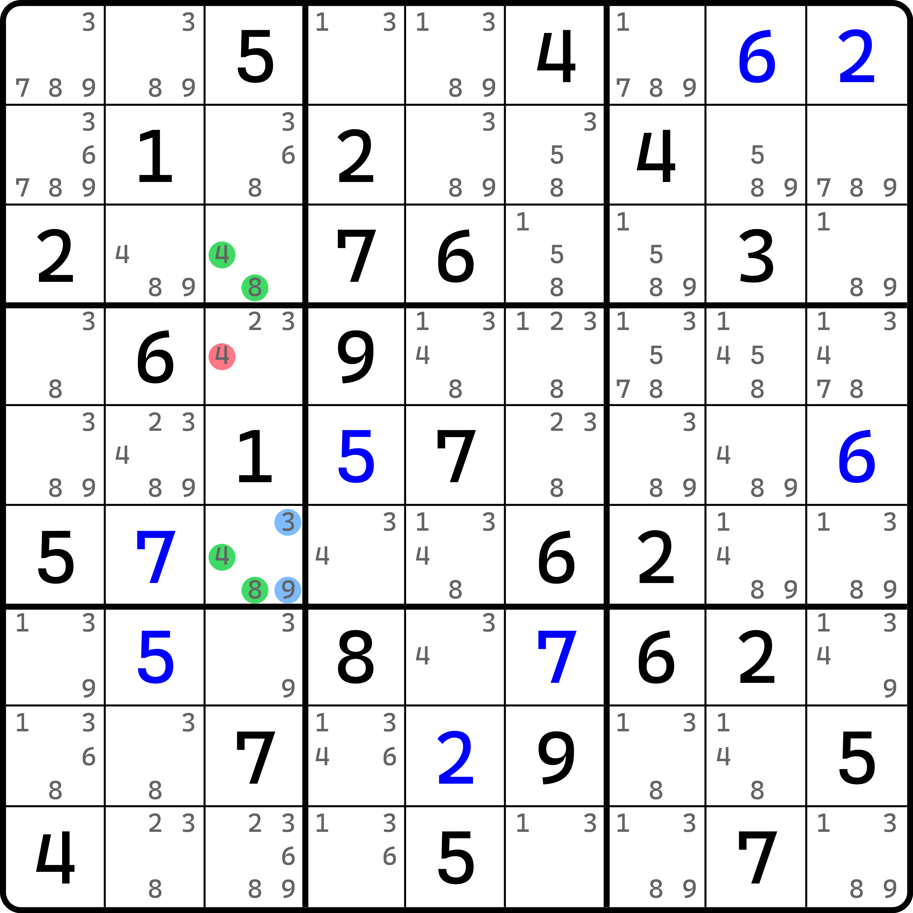
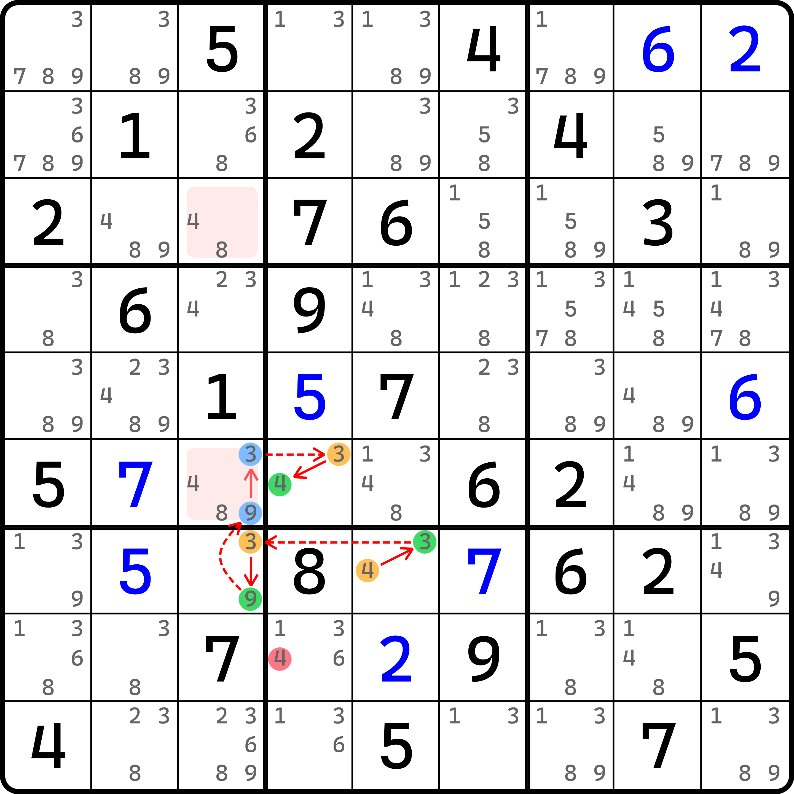
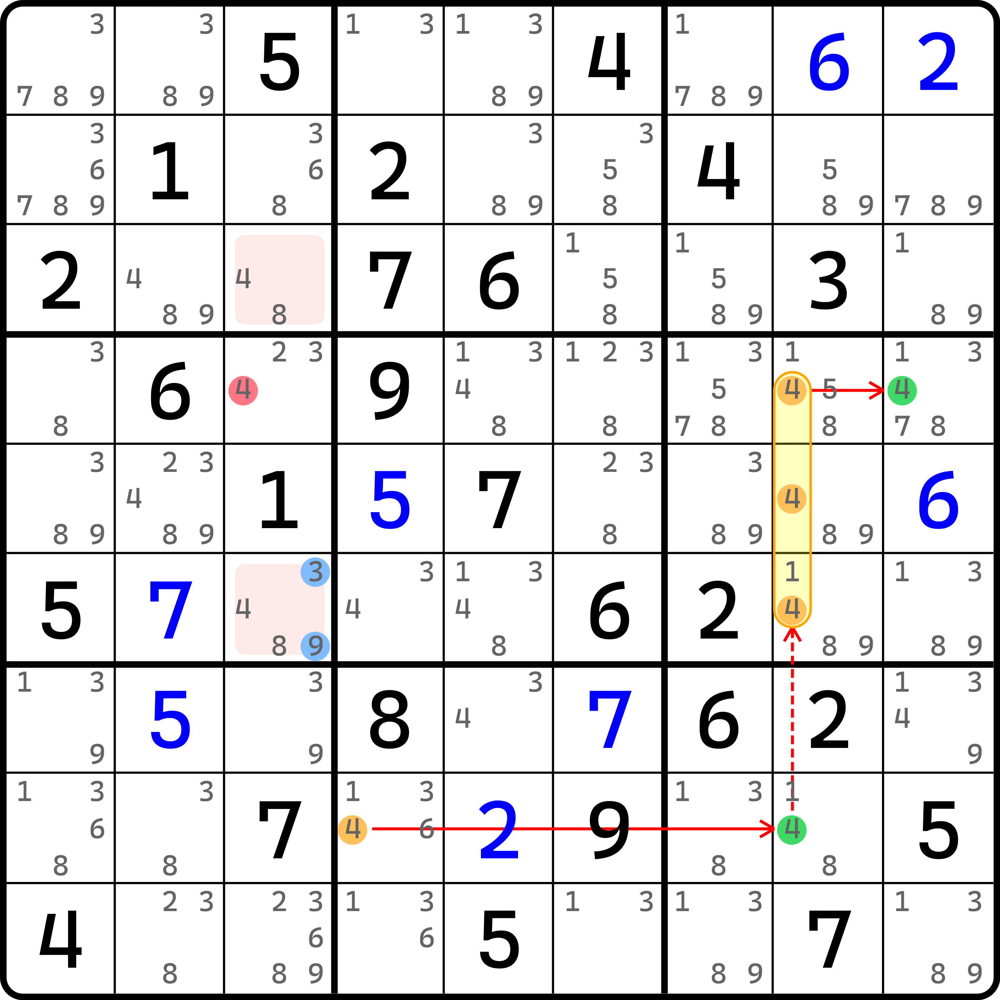
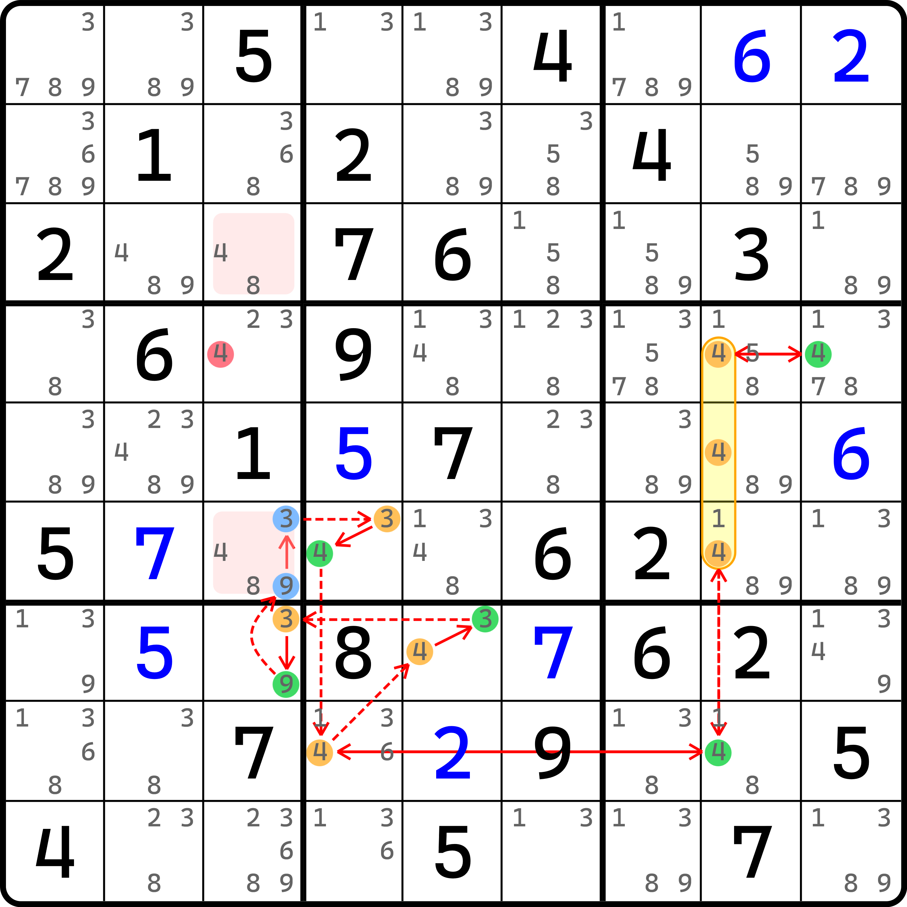
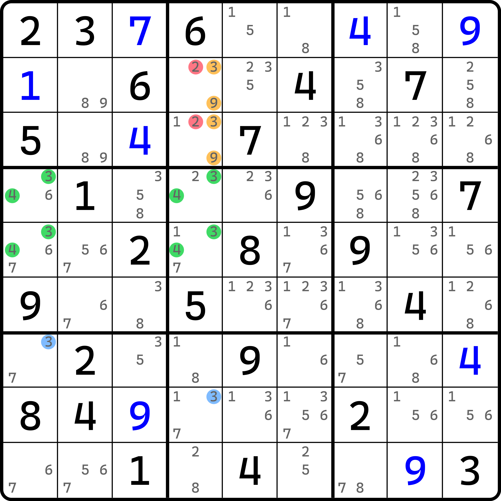
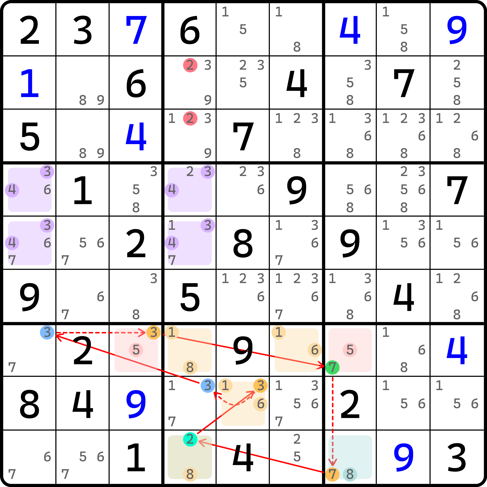
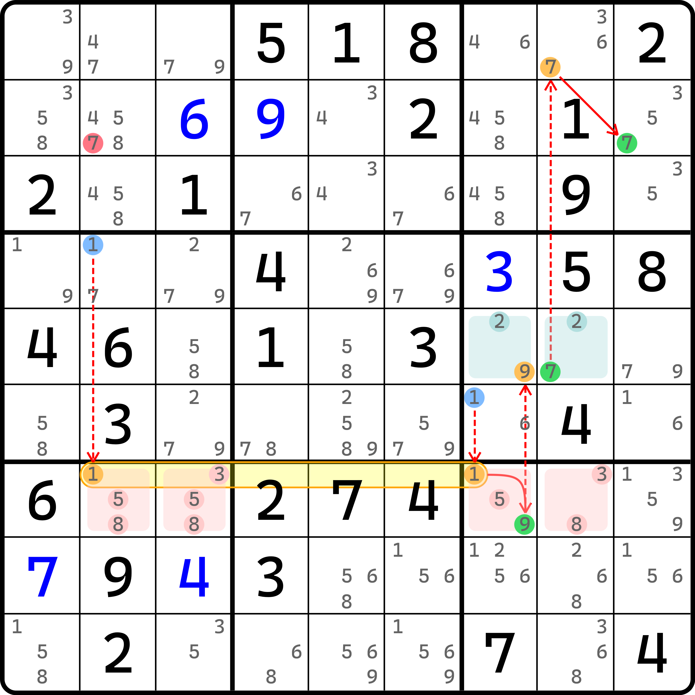
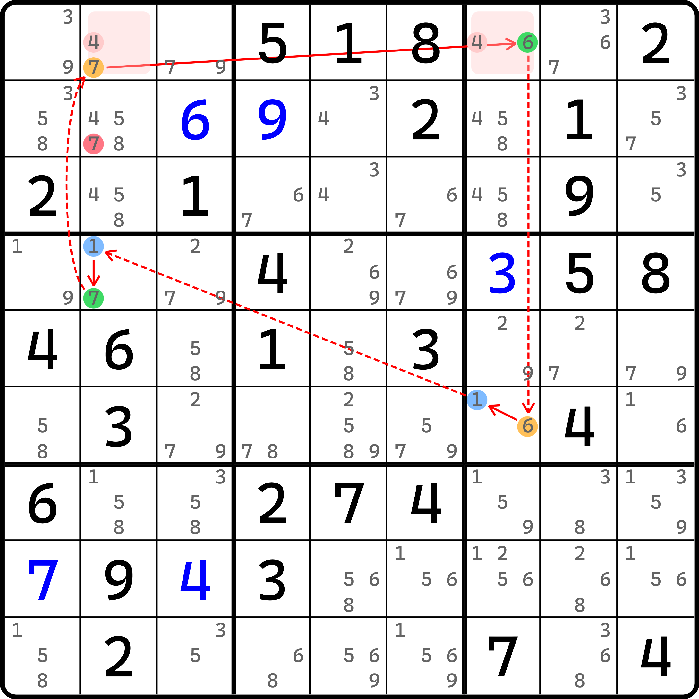

# 毛边的基本推理

前面我们学完了毛刺的用法，毛刺就是在结构上多出一个或多个候选数，需要我们讨论它的真假性（使用鱼鳍的类似逻辑），当为假的时候结构成立，当为真时引出强制链的方式找出公共的删数。

那么，有没有想过，如果这样的候选数无法使用真假引出删数（比如有两个毛刺，而且位置似乎看起来不相关），那么我们应该怎么去思考呢？

## 毛边的概念 <a href="#concept-of-kraken-link" id="concept-of-kraken-link"></a>

<figure><figcaption><p>毛边数组</p></figcaption></figure>

如图所示。如果我们图中 `r6c3` 不含有候选数 3 和 9 的话，那么显然它就是一个标准的显性数对，所以删数自然是可以成立的。但是很遗憾的是，由于这 3 和 9 是客观存在的，所以我们不能用于删数。

而这个比较遗憾的是，之前的毛刺可以用找强制链去取交集，但这个例子有两个毛刺，如果挨个去找强制链，就至少需要两条强制链，这肯定划不来。那么我们换一个思路。

显然图中两个候选数 `r6c3(39)` 组合起来一共只有四种填法：

* `r6c3(3)` 为假、`r6c3(9)` 为假；
* `r6c3(3)` 为假、`r6c3(9)` 为真；
* `r6c3(3)` 为真、`r6c3(9)` 为假；
* `r6c3(3)` 为真、`r6c3(9)` 为真。

这四种填法里，肯定在答案里仅对应一种正确的情况。虽然我们不知道，但是我们可以强行进行归类。如果 `r6c3(39)` 同为假的话，这很明显数组就可以使用，所以它单独成为一个情况；而其他三种呢？其他三种从解的角度来看，客观是不同为假的（这不废话吗）。

但是！不同假意味着强链关系。也就是说，对于其他三种情况而言，我们不必再细分下去三种子情况挨个讨论，而是合理地将他俩不同假的状态视为强链关系即可。

既然如此，我们可以利用这个强链关系构造出这么一个异数链：

<figure><figcaption><p>强链毛边构造异数链</p></figcaption></figure>

如图所示。链的写法如下：

```
(4=3)r7c5-(3=9)r7c3-(9=3)r6c3-(3=4)r6c4
```

是的，很普通的双值格链。请注意 `(9=3)r6c3` 这个强链关系。它显然并非客观成立，而是刚才我们在假设这两个候选数不同假时才会形成的情况。这一点很重要。

因为这个双值格链是正确的，所以删数 `r8c4 <> 4` 此时也是正确的，只不过只是在这条强链成立状态下才有的删数。不过不急，因为这个删数不足以让我们得到整个题的结论，所以我们还需要继续推理。

紧接着，我们有这个删数后，我们可以引出一条以假起头的强制链：

<figure><figcaption><p>由 r8c4(4) 引出的强制链</p></figcaption></figure>

如图所示。因为此时 `r8c4 <> 4`，所以我们可以引出这一条强制链，得到 `r4c9(4)` 此时为真的结果。

梳理一下，我们刚才是假设两个毛刺 `r6c3(39)` 至少有一个为真后，可引发一个双值格链得到 `r8c4(4)` 为假，于是强制链得到 `r4c9(4)` 为真，最终引出和数组相同删数的结论 `r4c3 <> 4`。

整合一下的话，因为两种情况（而对于 `r6c3(39)` 而言是四种排列情况）下均有 `r4c3(4)` 为假的结果，因此这个题的结论就是 `r4c3 <> 4` 了。

像是图中两个毛刺 `r6c3(39)` 无法直接引出强制链进行删数推理，而需要借助他们组合在一起的强链关系（也可以是弱链关系，后面会提到）来进行删数情况讨论的思路，我们把他称为**毛边**（Kraken Link）。

可以从例子里看到，毛边必须至少有两个毛刺参与才能进行使用，否则无法构造出这样的强链或弱链关系。

## 毛边强制链整合成普通链 <a href="#integration-of-forcing-chain-using-kraken-link" id="integration-of-forcing-chain-using-kraken-link"></a>

### 整合后的奇怪现象 <a href="#strange-behavior-of-chain-integrated" id="strange-behavior-of-chain-integrated"></a>

在前面的例子里，我们拥有了强链毛边关系后，引发了一个普通的链，得到了一个删数后又利用此删数接续。这个行为更方便我们对技巧的推理次序进行拆解，所以我们也希望将其拆成这样便于理解他们。但是，实际上我们想按照普通链删数的思路去做这个事情，实际上也是可以的，那么我们就需要将这种多步推理得到结论的过程整合起来成为一条普通链。

但是，总有一些例子整合成普通链就会出点令人费解的问题，下面我们就针对前面这个例子说一下有多么令人费解。

<figure><figcaption><p>将双值格链和强制链整合起来</p></figcaption></figure>

如图所示。我知道你肯定看得一头雾水，所以我打算给各位描述一下它的文本写法：

```
4r4c9=4r456c8-4r8c8=4r8c4-(4=3)r7c5-(3=9)r7c3-(9=3)r6c3-(3=4)r6c4-4r8c4=4r8c8-4r456c8=4r4c9
```

是的，非常奇怪。要想仍然删除 `r4c3(4)`，那么我们需要构造一条普通链删它的同时利用好强链毛边关系。可这次我们假设的是从 `r4c9(4)` 为假起头。它起头我们就必然依赖强弱链关系一直到 `r8c4(4)` 为真（`r4c9(4)` 假，`r456c8(4)` 真，`r8c8(4)` 假，`r8c4(4)` 真）。

接着，我们继续，将 `r8c4(4)` 为真接入双值格链的部分，比如这里接入到 `r7c5(4)` 得到其为假，然后双值格链这一部分的强弱链关系和之前完全一样，所以连假设的真假性也一样，中间就不重复了。

然后，我们可以到达 `r6c4(4)` 这里并得到它为真，然后就有 `r8c4(4)` 为假。是的，我们又一次回到了 `r8c4(4)` 这个位置上。但这里情况就有点不对了——刚才我们从 `r4c9(4)` 到这里明明还为真的，怎么绕一圈回来它就为假了？这实际上是双值格链在“发力”，因为在这个情况下，双值格链是客观成立的，所以自然可以知道 `r8c4(4)` 是不可能为真的。而最开始还没进入 `r7c5(4)` 之前，`r8c8(4)` 是为真的，这仅仅是因为它此时还并未和双值格链产生“羁绊”，它是从 `r4c9(4)` 出发得到的为真。

如果我们强行继续推理的话，我们将顺着 `r8c4(4)` 为假，然后利用好强弱链关系可以逆向推理的特性，又一次回到 `r4c9(4)` 上去。不过这次，因为 `r8c4(4)` 是为假的，所以顺着下去依次是 `r8c8(4)` 真、`r456c8(4)` 假，以及 `r4c9(4)` 为真。

看到了吗？整个一条链就构造完成了，我们强行将双值格链引发的删数纳入普通链的整合逻辑里去，这样我们可以得到这条特殊的普通链，普通链的其中一部分节点因为强行利用强链毛边关系，所以不得不让普通链走一组已经走过的节点。

这种走过的节点在普通链里我们并未这么用过，那么如果我们真要这么看的话，它是否是严谨和合理的走法呢？实际是合法的，因为它没有破坏我们整个链路里的所有强弱链关系，用还是用上了，而且也没有破坏它（比如强链用成弱链，弱链用成强链之类的错误或不正常的用法）。

所以，对于这种合法但是有病的操作，最好还是少用。这里提供给你，只是让你知道它是可以的视角，在有些时候我们可以借用普通链的思路仍然可适用于毛边的推理过程，作为其中的一环，只是更多地，我们会拆解视角以避免这种重合节点推理的普通链的奇怪现象的发生。

### 合理的整合 <a href="#reasonable-integration" id="reasonable-integration"></a>

那么，有没有合理一些的整合呢？答案是有的。整合成普通链的模式可用于删数的话，一共存在三种情况：

1. 整合为头尾均可删数的普通链；
2. 整合为可以看到删数的自我约束；
3. 整合为环，且其中一个弱链关系可以删掉删数。

这里我们拿其中一个来举例，因为三个都举例的话实在是有点啰嗦了。

<figure><figcaption><p>毛边唯一矩形类型 3</p></figcaption></figure>

如图所示。如果我们假设 `r7c1(3)` 和 `r8c4(3)` 同假的话，因为 4 在 `c14` 里都只能填在这四个单元格 `r45c14` 里，所以此时 3 也不在的话，那么 `r45c1` 就形成隐性数对，而右边为了规避也只是隐性数对（出现唯一矩形的矛盾），所以借用 `c4` 上的 9 的共轭对关系，我们可以得到 `r23c4` 只能填 3 或 9 的结论（因为其中一个单元格填 9，另外一个必须填 3，否则 3 只能放在 `r45c4` 里，然后就真成关于 3 和 4 的隐性数对了，就矛盾了）。

因此，这个时候，删数是 `r23c4 <> 2` 和 `r3c4 <> 1` 这三个数。不过这个题删不了 `r3c4(1)` 这里就不展示了。

和前面逻辑一样，我们依旧讨论两个毛刺 `r7c1(3)` 和 `r8c4(3)` 的真假性。显然也是四个情况（就两个候选数，组合起来肯定是 4 个情况），当他们同假的时候，有唯一矩形类型 3 如上面解释那样删数，所以它独自成一个情况；而其他三种填数模式的组合，我们均可以将其模糊地认为是一个强链关系。

然后我们就有下面的这条链：

<figure><figcaption><p>利用了毛边的自我约束</p></figcaption></figure>

如图所示。链的写法如下：

```
2r9c4=3r8c5-3r8c4=3r7c1-3r7c3=7r7c7-7r9c7=2r9c4
```

这一次我们就可以直接使用普通链的思路得到我们想要的结果。这是一条自我约束，从 `r9c4(2)` 假设为假起头，绕一圈回到自己得到其为真的结论。因为之前说过这种特殊的不连续环逻辑，因为证明一圈发现和自己的假设相反，所以自身的原假设肯定就错了。因此 `r9c4(2)` 为真是正确结论（假设为假绕一圈得到为真，和原假设矛盾，可不就只能为真了么）。

像是这种情况我们就可以整合为链。与其说整合的，不如说它就可以这么用。整合反而多余了（因为也压根没必要拆视角了）。

## 弱链毛边 <a href="#weak-kraken-link" id="weak-kraken-link"></a>

之前我们看了两个例子，知道毛边的推理方式是利用四个情况的“1 + 3”分成两组，其中一组单列出，另外一组用强链关系构建。我们把这种构造出来的强链毛边关系称为**强链毛边**或**强毛边**（Strong Kraken Link）。之所以我在这里提这个，想必大家都猜到了，有强肯定就有弱。下面我们来看**弱链毛边**（或者叫**弱毛边**，Weak Kraken Link）是怎么用的。

<figure><figcaption><p>弱毛边同真构造的强制链</p></figcaption></figure>

如图所示。之前我们是同假则有什么东西出现，这次我们同真试试看。

可以发现，如果 `r4c2(1)` 和 `r6c7(1)` 同真的话，则 `r7c27(1)` 直接被排除，于是可得 `r7c7(9)` 为真，这里只是象征性画出链的起点，然后接入到 `r7c27(1)` 上。然后跟着链走，可以到 `r2c9(7)` 为真，所以这个情况是可以删除 `r2c2(7)` 的。

<figure><figcaption><p>弱毛边构造环</p></figcaption></figure>

如图所示。当两个毛刺 `r4c2(1)` 和 `r6c7(1)` 不同真时，一共有三种情况。不过这里也可以学强毛边那样不再细分，直接用弱链关系模糊表示出来即可。

于是，我们可以得到这么一个环。而这个环利用了弱链关系 `7r4c2-7r1c2`，所以 `r2c2(7)` 此时仍然可以删数。

所以总体来说，两种情况均可删除 `r2c2(7)`，故结论就是 `r2c2 <> 7` 了。

可以看到，这个例子用到的弱链毛边关系证明删数成立用到的是环，即前面提及的第三种情况。只是说，这个例子看着有些模糊，因为同真和不同真的两种状态都用了链，所以有些分不清哪边是主、哪边是次。

## 毛边技巧的命名 <a href="#naming-rule-of-kraken-link-techniques" id="naming-rule-of-kraken-link-techniques"></a>

当你无法辨认一个利用了毛边的技巧叫什么时，我们应找出讨论期间两边（同真/不同真，或者同假/不同假）的主次关系。其中，**主关系发生在不使用毛边那一边，而次关系发生在使用了毛边的那一边逻辑上**。所以前面三个例子，第一个例子（强毛边）不使用毛边的情况是显性数对，第二个例子（强毛边）不使用毛边的则是唯一矩形类型 3，第三个例子（弱毛边）不使用毛边的情况则是普通链，所以这三个技巧分别称为毛边显性数对、毛边唯一矩形类型 3 和毛边链。

依赖强弱毛边的情况，只是为了证明删数成立而诞生的特殊分支。所以我们把这个定义为次要部分。而且，次要部分一定会使用链（整合后一定是前面提及的三种情况的其中一个，要么环要么链），所以我们命名毛边技巧的时候肯定不能参考它，不然就没意义了不是。

好了，至此我们就把毛边的基础内容介绍完了。下一节我们将继续来看毛边的一些实际用例。
