# 鱼构造

在解释完了比较复杂的毛刺和毛边后，我们来接着学习鱼技巧的构造。因为鱼自身结构的特殊性（跨多个行列），所以自身在使用链的时候就会出现非常复杂的思路的考量，所以我把他放在了这里。

## 毛刺鱼类型 1（Kraken Fish Type 1） <a href="#kraken-fish-type-1" id="kraken-fish-type-1"></a>

### 一个例子 <a href="#an-example" id="an-example"></a>

<figure>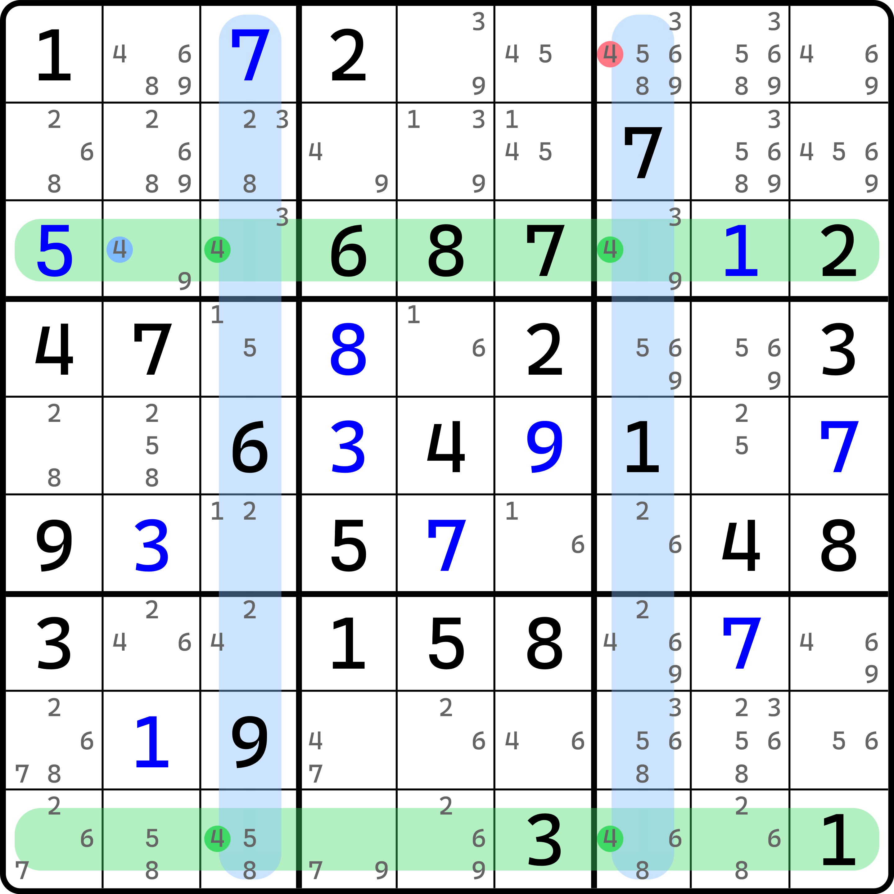<figcaption><p>毛刺鱼类型 1，结构部分</p></figcaption></figure>

如图所示。和之前的鱼几乎一致，这是一个二阶鱼结构，不过有一个鱼鳍长在了 `r3c2` 上。很遗憾的是，这个鱼鳍不导致任何删数的同时，本题的实际删数 `r1c7(4)`（稍后说明为什么可以删）和 `r3c2(7)` 的位置也不能互相看见，所以也就意味着它无法直接用于删数。

所以，我们需要动用毛刺的手段。将 `r3c2(4)` 视为毛刺，当其为假的时候，二阶鱼成立，于是删数也肯定就成立；而如果毛刺为真的时候，我们应当引出一条强制链，并假设其为真。可以发现它确实是可以删除的：

<figure>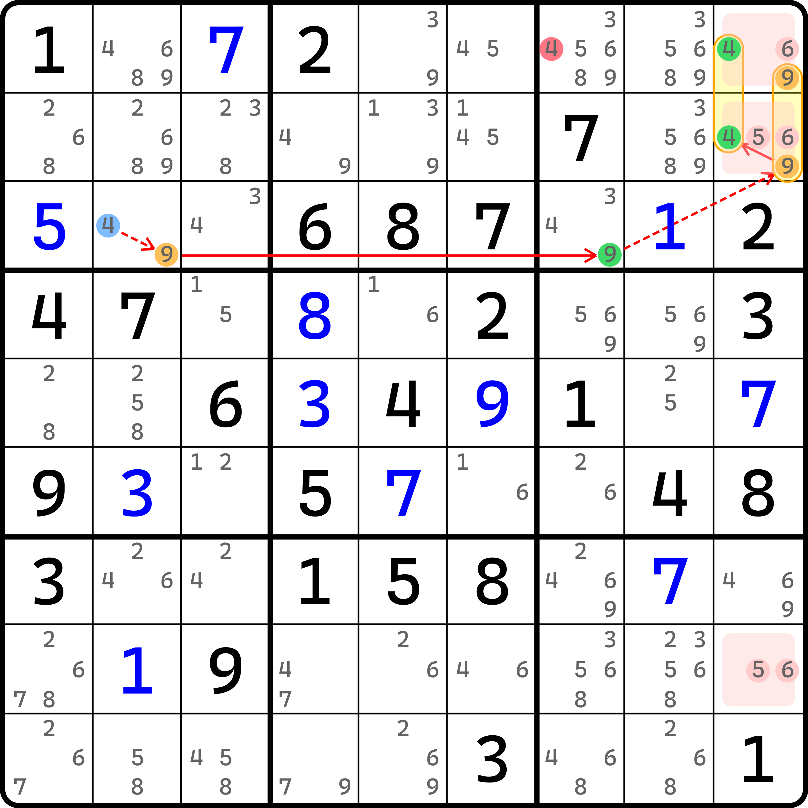<figcaption><p>毛刺鱼类型 1，强制链部分</p></figcaption></figure>

如图所示。可以看到，当假设 `r3c2(4)` 为真时，我们可以引出强制链并得到 `r12c9(4)` 区块节点为真的结论。

显然，`r12c9(4)` 可以删除 `r1c7(4)`；而结合毛刺为假的情况，因为 `r1c7(4)` 在毛刺为假时仍然可以删除，所以这个删数便是这个题的结论了。

可以看出，鱼也是可以纳入毛刺的计算范畴的。我们把这种嵌入毛刺的鱼结构称为**毛刺鱼**（Kraken Fish）。

### 毛刺及删数和鱼本体的关系 <a href="#relation-between-a-fish-and-kraken-burr-and-eliminations" id="relation-between-a-fish-and-kraken-burr-and-eliminations"></a>

可以从结构看出，它是很想将鱼纳入链的推理过程。但是奈何因为鱼本身规格比较大的特殊性，我们无法简易通过直接推导的形式将鱼纳入一个普通链里。

不过，这个题除了可以使用上述毛刺视角拆解两个视图的方式去理解它外，你还可以这么理解：强行把鱼的部分和毛刺“解耦”（分开看），因为毛刺为假，所以鱼可以成立，因此鱼和毛刺两部分可构成特殊的强链关系。当将鱼视为一个节点时，四个摆放位置需要合理进行排列，只要能使得鱼能形成删数状态，那么鱼便是成立的。举个例子，这个例子里的鱼用到的四个单元格是 `r39c37`。如果我们强行认定它是一个节点的话，那么强链成立，并将毛刺为真的这一截强制链和刚才强链关系合并到一个视图里，那么它就是一个链头为二阶鱼、链尾为区块节点的普通区块链。

如果按这种方式去理解的话，删数又是怎么理解呢？因为链的删数是看头尾的交集。而链头是二阶鱼，那么它可造成的删数显然就是本题里 `c37` 的其余单元格的候选数 4；而链尾则是区块，所以删除 `b3` 和 `c9` 里其余位置的 4。很明显，这两个情况均覆盖了 `r1c7(4)` 作为删数。所以，这么看的话，`r1c7(4)` 仍然是这个题的删数。

不过，要注意的是，鱼作为节点时，分析真假性非常痛苦，我们仅需要知道它可以和毛刺形成强链关系，以及删数是怎么看的，基本就足够了。

> 顺带一说，鱼鳍和删数可以直接对应（互相看得见对方），但它和毛刺本身区别仅在于看不看得见删数，所以，鱼本体和鱼鳍也可以形成如此的强链关系，所以并非是非得毛刺才行。只是说，鱼鳍和鱼的本体形成强链关系的这种说法本身就略显奇怪：因为鱼鳍本身就可以看到删数，所以并不需要加入额外的强弱关系去构造强制链并归纳删数逻辑。

另外，删数因为是鱼可产生的结论，所以当我们将鱼视为节点之后，鱼成立时即为真，那么删数处均为假，所以鱼和删数将构成弱链关系。总之：

* **鱼本体和毛刺形成强链关系；**
* **鱼本体和删数形成弱链关系。**

这是一个伏笔。后面我们再来详细探讨它作为节点的真假性。

### 另外一个例子 <a href="#another-example" id="another-example"></a>

下面我们来看一个混合毛刺和鱼鳍一起出现的情况。

<figure>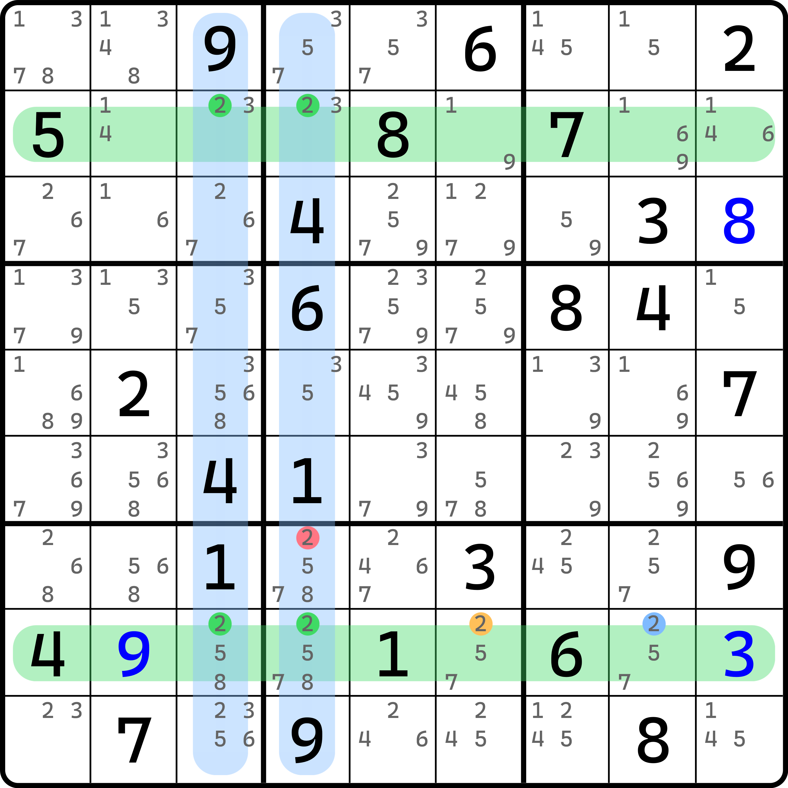<figcaption><p>毛刺鱼类型 1，另一个例子，鱼结构部分</p></figcaption></figure>

如图所示。这个题有一个鱼鳍和一个毛刺，鱼鳍是 `r7c6(2)`，而毛刺是 `r7c8(2)`。当毛刺为假的时候，那么二阶鳍鱼成立，于是删数是可以删的；而如果毛刺为真时，我们需要引出强制链。

<figure>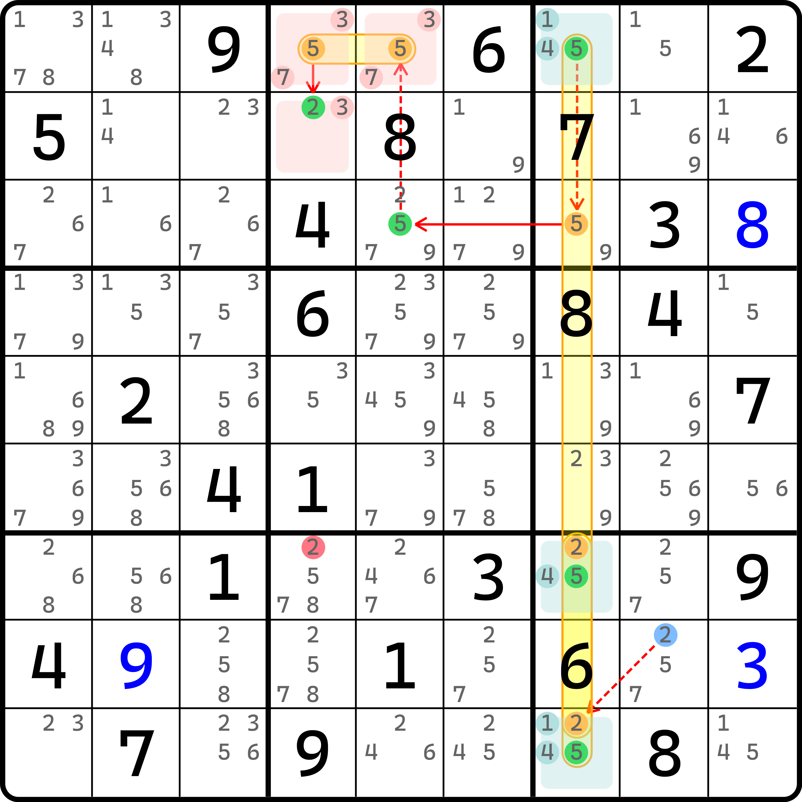<figcaption><p>毛刺鱼类型 1，另一个例子，强制链部分</p></figcaption></figure>

如图所示。我们可以引出这么个强制链。写法如下：

```
2r8c8-2r79c7=5r179c7-5r3c7=5r3c5-5r1c45=2r2c4
```

这样我们可以得到 `r2c4(2)` 节点为真，所以照样可以删除 `r7c4(2)` 这个删数，所以这个删数是这个题的结论。

## 毛刺鱼类型 2（Kraken Fish Type 2） <a href="#kraken-fish-type-2" id="kraken-fish-type-2"></a>

下面我们来看另外一种利用毛刺的鱼结构的技巧用法。

<figure>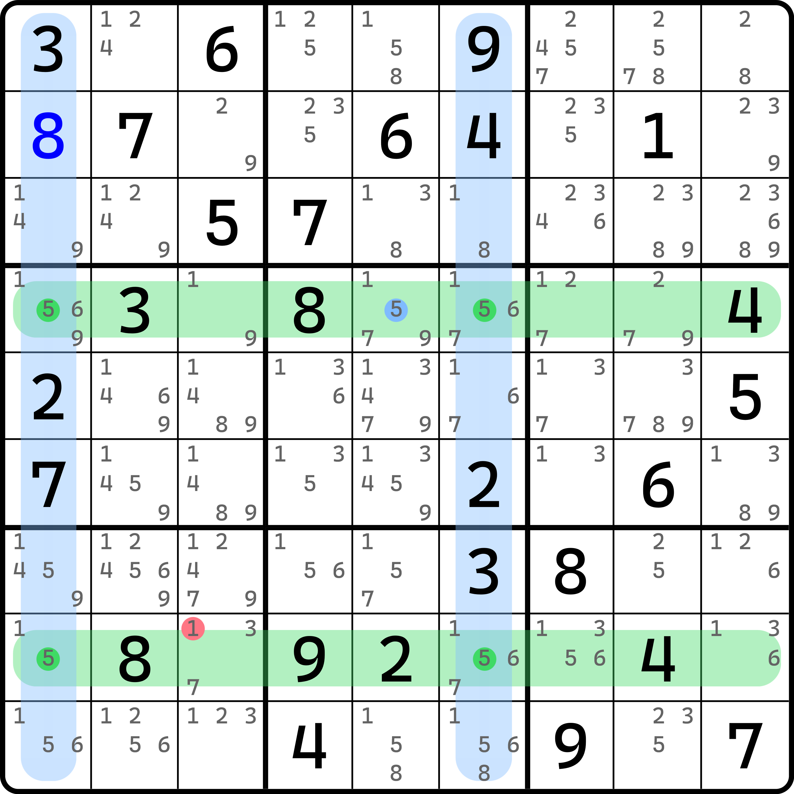<figcaption><p>毛刺鱼类型 2，鱼结构部分</p></figcaption></figure>

如图所示。可以从这个画法看出，鱼的删数甚至都无法删除到 `r8c3(1)` 这个数了。所以我们必须考虑用更复杂的逻辑。

<figure>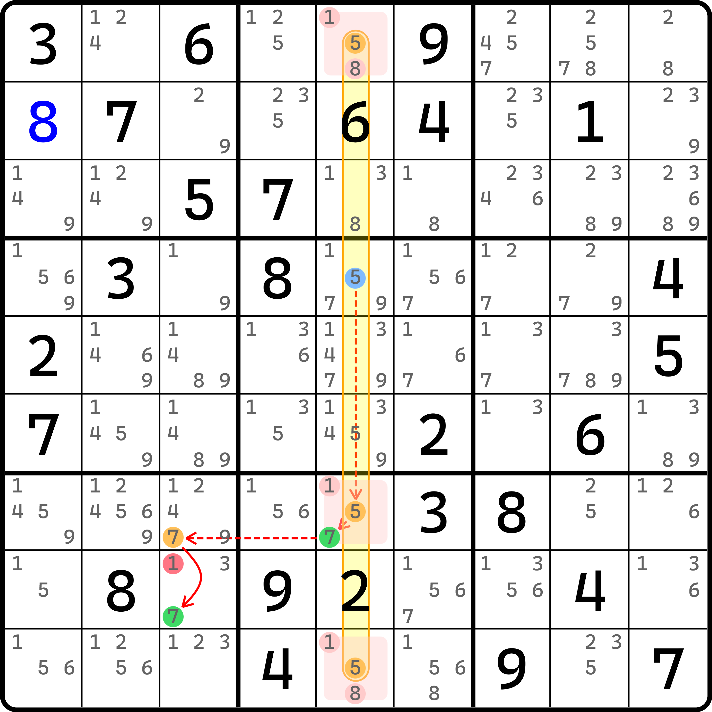<figcaption><p>毛刺鱼类型 2，毛刺真的情况</p></figcaption></figure>

如图所示。如果毛刺为真，则我们可以引出这条强制链：

```
5r4c5-5r179c5=7r7c5-7r7c3=7r8c3
```

这样可以得到 `r8c3(7)` 节点为真，于是删数成立。

不过，更重要的是，毛刺为假的时候，就算鱼成立，我们也不能删除 `r8c3(1)`，毕竟删数的数字都不一样。但是我们这么去想：毛刺为假的时候，这个二阶鱼此时是成立的，于是所有跟鱼有关系的删数是可以成立的。比如说这个题里的 `r79c1(5)` 和 `r9c6(5)` 理应都可以删除。切记，这是毛刺假的时候鱼成立才能删的数。

当这些候选数在这个状态下删除后，我们再看 `c16`，此时就会变得特殊：因为二阶鱼的关系，原本可以填入很多位置的 5 此时仅剩下鱼可使用的两处位置（分别位于 `r1` 和 `r6` 上的这两种摆法），此时我们甚至可以构造出强链关系来用。也就是说，当毛刺为假的时候，我们可以构造出 `c1` 或 `c6` 上关于数字 5 的强链关系。于是，我们可以有这样的链：

<figure>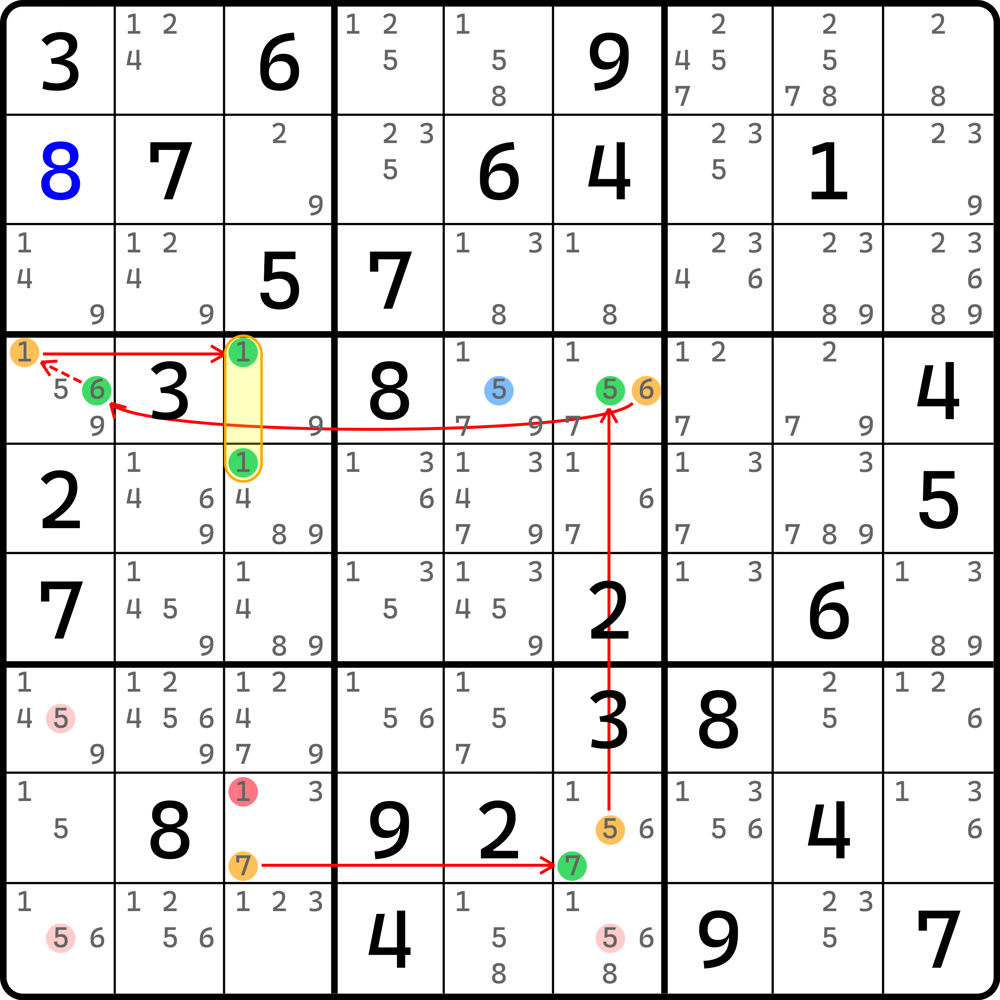<figcaption><p>毛刺鱼类型 2，毛刺假的情况</p></figcaption></figure>

如图所示。由于毛刺为假，所以我们可以构造出 `c6` 的强链关系，所以有这么一条区块不连续环：

```
7r8c3=(7-5)r8c6=(5-6)r4c6=(6-1)r4c1=1r45c3
```

这样我们仍然可以删除 `r8c3(1)`。所以，这个删数是这个题的结论。

下面我们再来看一个例子。不过这个例子会稍微麻烦一些。

<figure>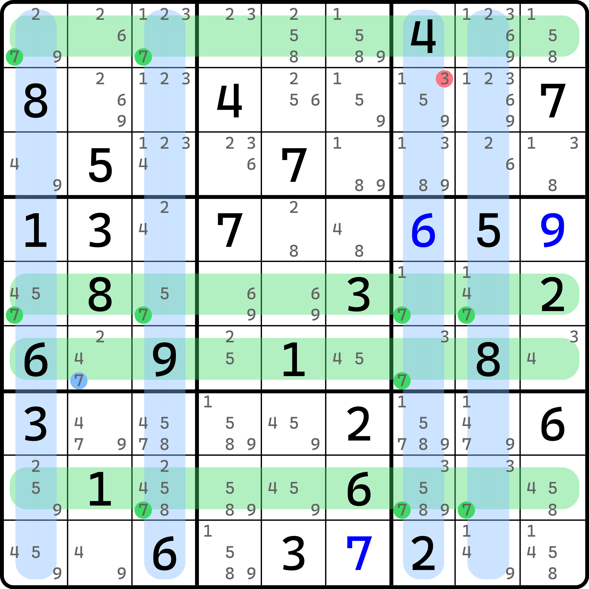<figcaption><p>毛刺鱼类型 2，另一个例子，鱼结构部分</p></figcaption></figure>

如图所示。这是一个四阶退化鱼，毛刺是 `r6c2(7)`。

<figure>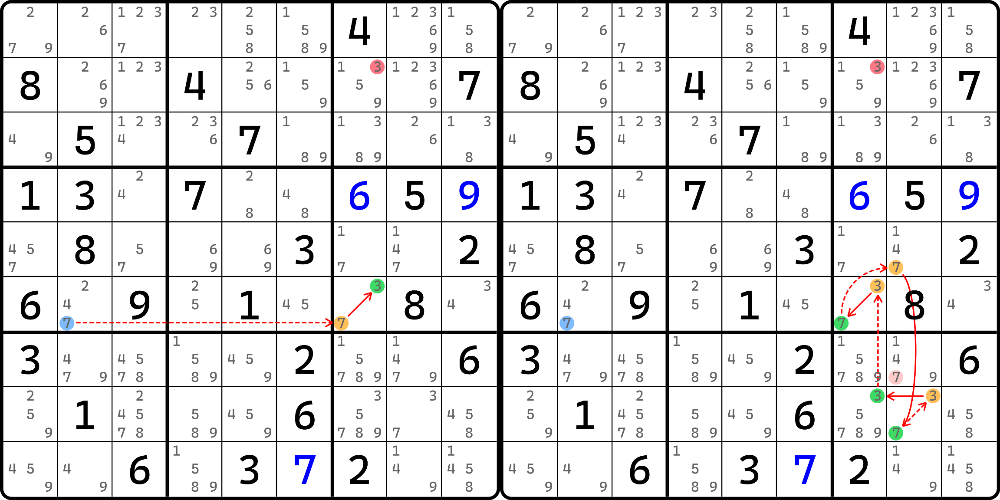<figcaption><p>毛刺鱼类型 2，另一个例子，毛刺为真和为假的情况</p></figcaption></figure>

如图所示。左图是毛刺为真的情况，右图是毛刺为假的情况。可以看出，毛刺为假时有环的结构。注意 `c8` 的强链关系建立于毛刺为假时普通的四阶鱼成立，才有的强链关系，因为 `r7c8(7)` 此时肯定可以被删除，于是 `c8` 就只剩下 `r58c8` 两处可以填 7 的位置了。

## 毛边鱼 <a href="#kraken-linked-fish" id="kraken-linked-fish"></a>

看完了鱼的两种固有构造模式，下面我们来看一些灵活构造的方式。

<figure>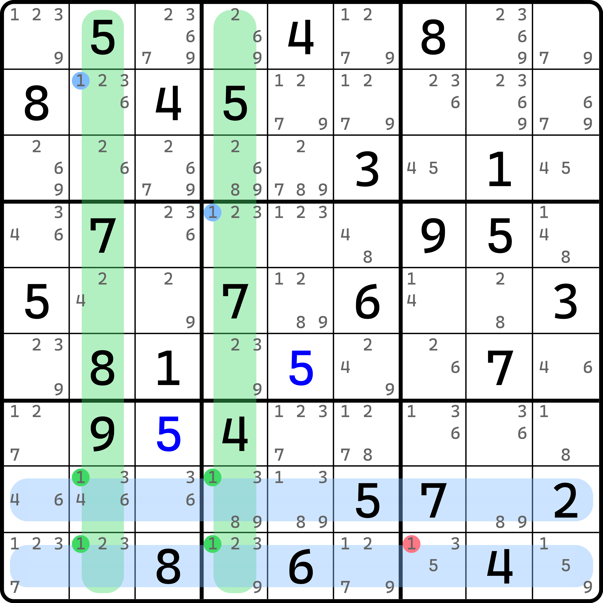<figcaption><p>毛边鱼，毛刺同假的删数</p></figcaption></figure>

如图所示，这是一个毛边鱼结构。当毛刺 `r2c2(1)` 和 `r4c4(1)` 同为假的时候，`r9c7(1)` 可以删除。

<figure>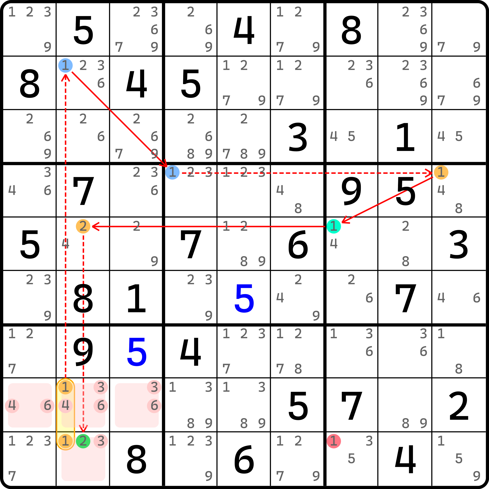<figcaption><p>毛边鱼，毛刺不同假时有自我约束</p></figcaption></figure>

如图所示。当毛刺不同假时我们可以构造出强链关系，于是可以找出这样一条自我约束，仍然可以删除 `r9c7(1)`。

## 鱼在连续环里的删数 <a href="#fish-eliminations-in-a-loop" id="fish-eliminations-in-a-loop"></a>

还记得前面的伏笔吗？下面我们来看看，鱼作为节点时的用法。

<figure>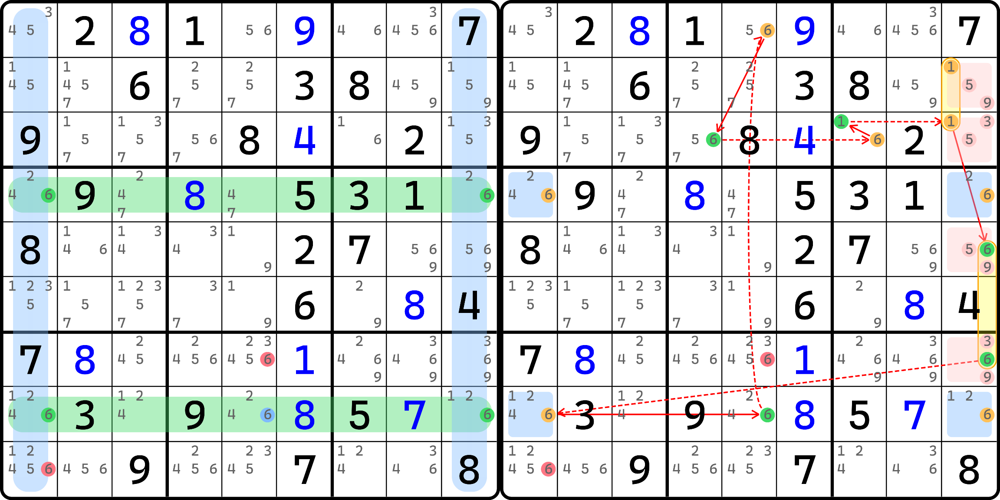<figcaption><p>区块连续环里有鱼</p></figcaption></figure>

如右图所示。这是一个区块连续环，不过比较特殊的是，其中用到了鱼结构作为推导的其中一个部件。鱼的填数情况请参考左图。环的写法如下：

```
6r48c19=6r8c5-6r1c5=6r3c4-(6=1)r3c7-1r23c9=6r57c9-6r48c19
```

鉴于之前没有将鱼当成节点形式纳入链环的讲解，这里要解释一下它的推理过程。

我们不妨从 `r1c5(6)` 设为假开始。显然前面的强弱关系比较容易看，所以就跳过。当我们推导到 `r23c9(1)` 时，这个区块节点此时是为假的（前一个节点 `r3c7(1)` 是为真的）。因为 `r23c9(1)` 为假，所以借助 `r2357c9` 的待定数组，我们可以得到 `r57c9(6)` 此时为真。

因为 `r57c9(6)` 为真之后，二阶鱼 `r48c19(6)` 作为一个节点来看，就无法保证鱼可以形成可以用作删数的状态了。原本二阶鱼需要要求在 `r48` 两行里各自填入一个 6 且不造成矛盾（即行列重复填 6）。可问题是，当 `r57c9(6)` 为真时，四个单元格无论如何都填不出来不矛盾还能让鱼成立的形式，毕竟 `c9` 两处可填的位置直接都被我们干掉了。既然干掉了，也就意味着鱼节点不可能成立了，所以 `r48c19(6)` 这个二阶鱼节点此时为假。

> 或者你这么理解：因为 `r57c9(6)` 是 `r48c19(6)` 这个鱼本体成立时可以造成的删数，而前文说到，鱼的删数和鱼本体是形成弱链关系的，所以利用逆否命题可以将此说法倒转过来：当 `r57c9(6)` 为真时，鱼本体的这个节点 `r48c19(6)` 为假。

而我们之前说过，鱼的本体和鱼鳍（毛刺）是形成强链关系的。对于此题而言，毛刺位置是 `r8c5(6)`。所以，因为此时我们得到了鱼本体是为假的，所以 `r8c5(6)` 需要为真（即利用其强链关系得到）。

> 从字面意思来看，这个说法其实并不好理解，凭什么鱼本体为假，这 `r8c5(6)` 就得为真？这有两个方式去理解。你可以选取下面随便哪一个进行理解。
>
> 第一种方式是采用逆否命题。因为我们知道，当鱼鳍（毛刺）为假时，鱼的本体是成立的，于是可以进行删数。所以换言之就是，鱼鳍为假，鱼本体就为真。所以他们构成强链关系，这一点之前提到过。而利用这个说法的逆否命题将逻辑进行倒转，我们可以得到，当鱼本体为假时，鱼鳍就为真。这是第一种理解方式。
>
> 如果你还是觉得数学描述非常晦涩，理解起来还是不够本质的话，你可以尝试用第二种方式去理解。第二种方式则是需要你去思考一下，鱼节点为假的状态都会有什么样的特效。鱼的本体要为假就说明鱼必须不能使得内部的排列有效。什么时候无效呢？比如这个题里，由于它是二阶鱼，所以一共会有四个可填位置。当鱼有效时，四个位置里恰好有两个位置不冲突地填写进去，只要他们行列不相同（互相看不见彼此）那么就是成立的。那么自然无效的话，就是取的这个说法的相反情况，也就是不让这个结构出现这种正确的填写模式。啥时候呢？
>
> 想一想，鱼有四个位置可填，所以列举出来也就五个情况：有 0 个位置可填（全部都不可填）、只有 1 个位置可填、2 个位置都填、3 个位置都填以及 4 个位置都填。很显然 $$\ge 3$$ 个位置都填的情况显然是不可能出现的（抽屉原理，一共才最多放俩，你放仨进去，那肯定就有行列直接矛盾了嘛）；填 2 个肯定也不行（不然不就直接有效了）。所以，唯一一种可以成立的只有可能是只剩下 0 和 1 处可填位置。
>
> 可什么时候鱼的本体能只填 1 处或者甚至一处都不填呢？有的兄弟，有的。把数给填在毛刺（或者鱼鳍）上，那么鱼的本体就会出现少于 2 次的填写次数。这逻辑不就串起来了嘛。所以，既然能有使得鱼不成立的状态，那要能继续推理下去，我们只能让这个数放毛刺上，这鱼的推理才能继续而且不会出现矛盾。所以，我们就得到了鱼的本体为假时，毛刺必须为真的原因。这是第二种理解方式。
>
> 不管你怎么理解吧，总之这个说法肯定是可以得到的。

当我们得到 `r8c5(6)` 为真时，`r1c5(6)` 就为假，此时环就绕回来了。因为环的强弱关系完全交替出现，所以这个题的删数就是所有弱链上可以删的地方。

是的，所有弱链上。刚刚我们就说到，鱼的本体和删数是形成弱链关系的，而鱼的删数自然就是本题里位于 `c19` 上的其余位置，所以这个题的结论里含有 `r9c9(6)` 这个删数。而 `r7c5(6)` 这个删数是 `c5` 的弱链关系，是普通的删数，所以这个题的删数一共有两处。

## 鱼节点的本质 <a href="#essential-of-fish-node" id="essential-of-fish-node"></a>

鱼作为节点时，我们利用了真假性讨论粗略地完成了对嵌入了鱼的链环的删数的理解。虽然这很麻烦，但是它的麻烦更多的原因还是来自于鱼本体跨了多个行列。如果它和之前学到的待定数组那样只涉及单个区域下的若干单元格的话，或者学学待定唯一矩形那样，就算跨了行列，但起码不影响删数推理，有一个比较简易的理解形式。

理解鱼节点之所以痛苦，主要就是在于它的这个特殊现象。从本质来看，鱼节点其实是一个动态的节点。换言之，它需要走分支去归纳所有的走法。

比如刚才那个题目，当我们走到 `r57c9(6)` 为真时，我们是直接连到了鱼上面来的。但非从本质来看的话，我们其实是走了两个分支的动态链。其中分支 1 是认为此时 `r4c9(6)` 为假，然后 `r4c1(6)` 为真，然后 `r8c1(6)` 为假；分支 2 则是认为此时的 `r8c9(6)` 为假。因为两个分支的起始点 `r57c9(6)` 可以同时造成弱链分支的出现，所以两个分支最终得到的 `r8c1(6)` 为假和 `r8c9(6)` 为假其实也是同时可以得到的。这里说的“同时”，是真的同时。因为 `r8` 上还有一个可填 6 的地方，就是毛刺 `r8c5(6)`。因为同时得到 `r8c19 <> 6` 的结论，所以 `r8c5(6)` 此时为真。

正是因为这么走了弯路，所以这个链的效果是一条动态链。哦不，这是个动态环。删数呢？我们之前说过，动态环的删数判断是需要考虑进行删数分析的，但我们给跳过了，因为鱼有自己的独特理解视角，所以我们相当于是用了上一层的视角去避免了底层的穷举步骤。当然，你非要穷举的话，这个题也是可以穷举出来的，最终仍然可以得到 `r9c9 <> 6` 的结论，不过这里我就不再讨论它了。

所以，**鱼节点的本质是动态，鱼作为节点的链就是一个标准的动态链，而在环里就是标准的动态环**。鱼的成立与否并不会影响分支上的删数（如 `r9c9(6)` 其实只属于分支 1 上可删的范畴，但整个环可以允许删去它），所以**带有鱼节点的动态环并不会影响动态环是半环还是全环的特征**；换言之，如果原本动态环是半环，那么嵌入鱼之后，半环还是半环（不会改成全环）；同理，如果原本动态环是全环，那么嵌入鱼之后，全环也还是全环（不会改成半环）。

至此，我们就把鱼的构造讲完了。下面我们将进入到绽放和牺牲的内容里。
