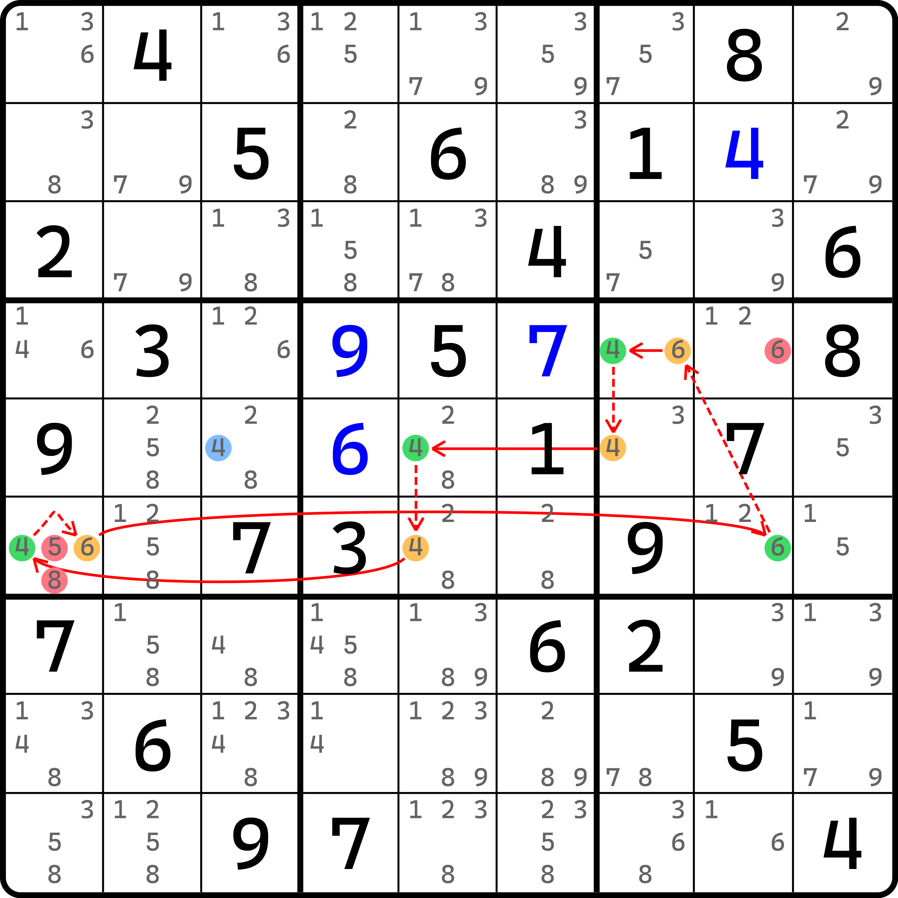
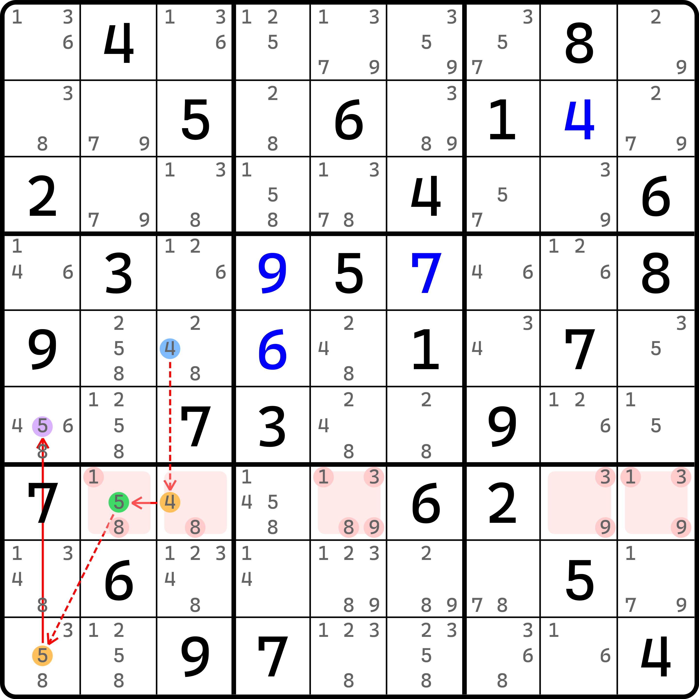
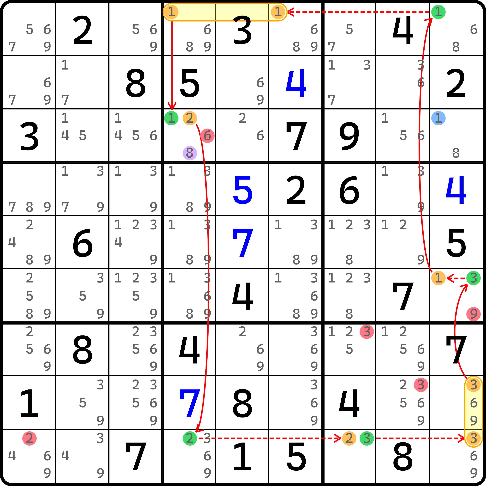
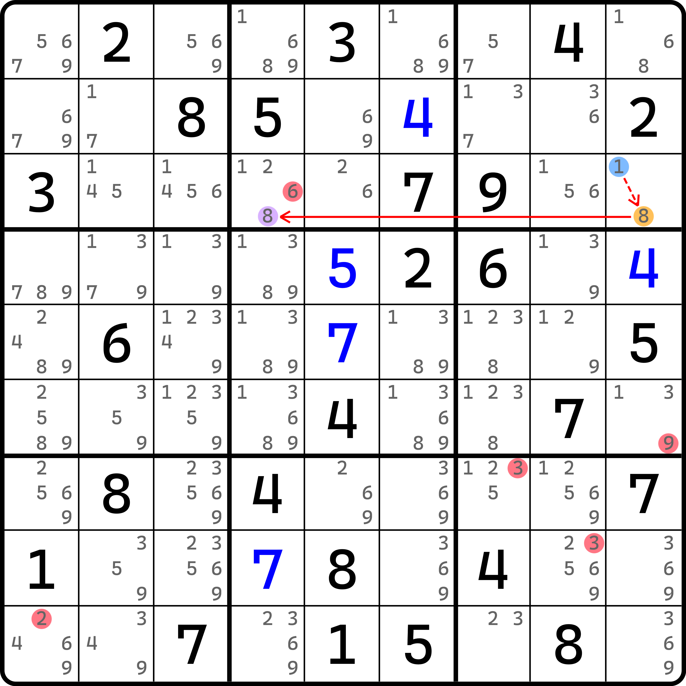
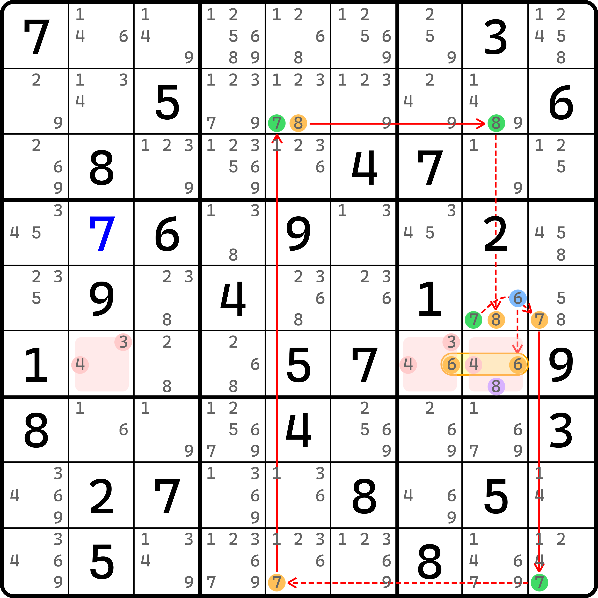
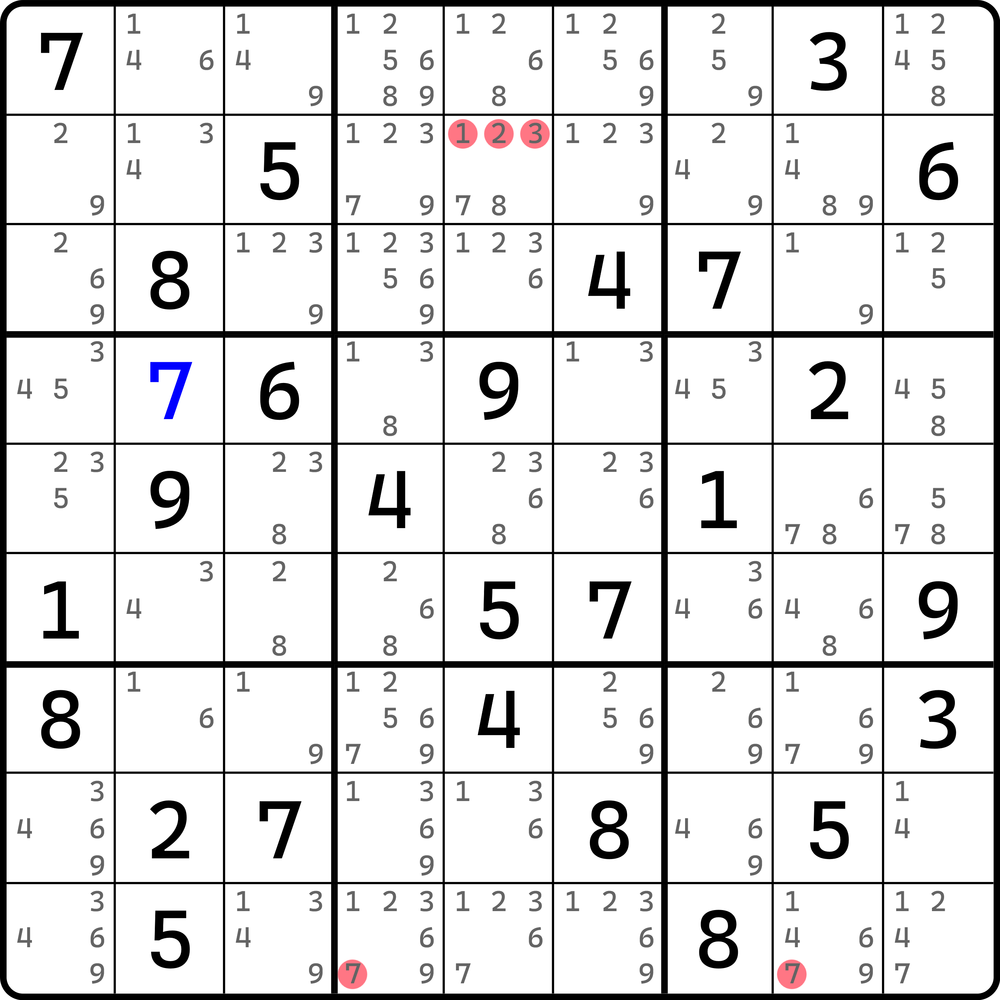
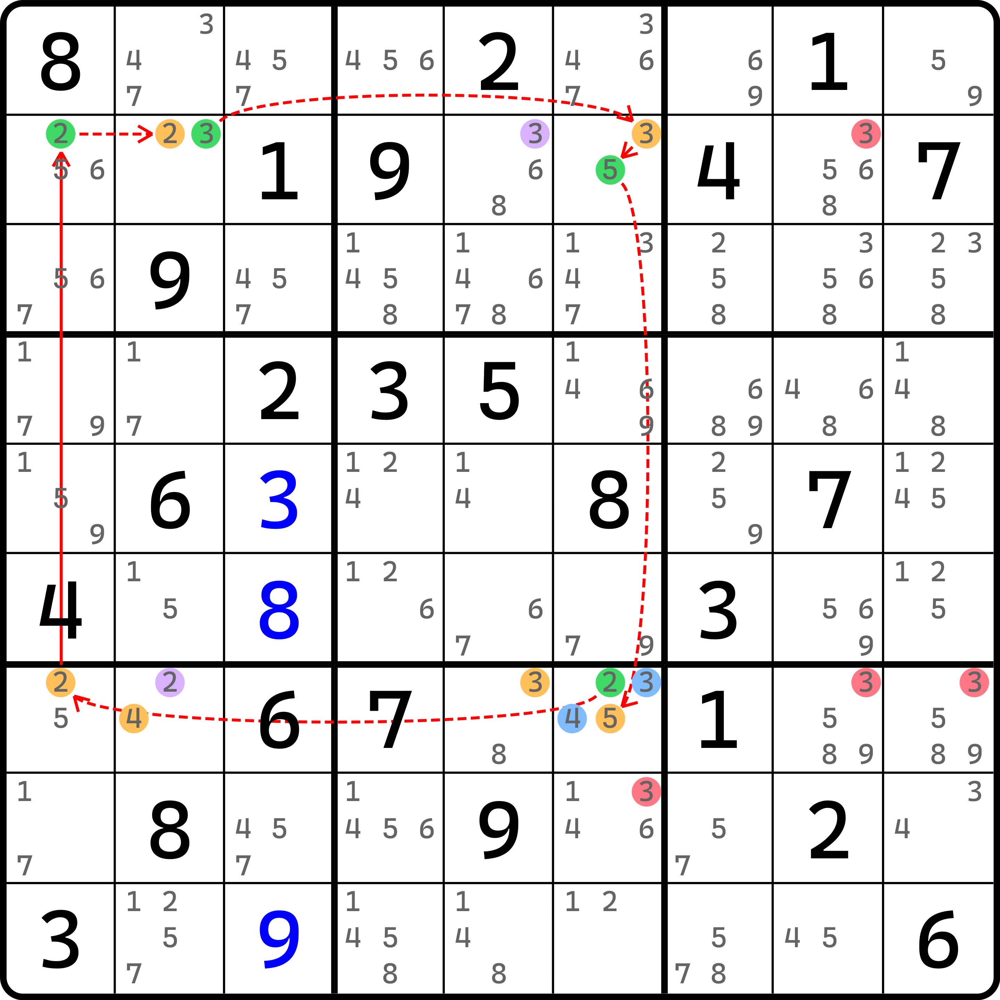
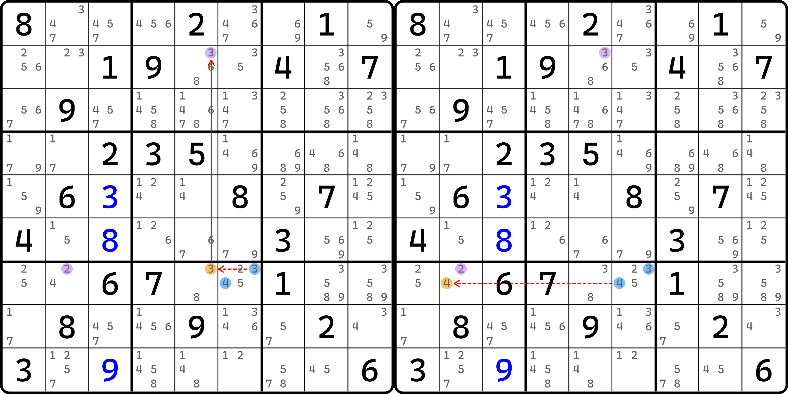

# 绽放环和绽放视角

今天我们要介绍一个全新的概念。这个概念其实早在之前就有所提及，但因为当初的难度较高，因此并未详细展开进行说明。

让我们先从一个非常基础的、有技巧名称的数独技巧切入，看看这是怎么一回事。

## 死亡绽放（Death Blossom） 

在前面我们学到过待定数组的链，我们也学过强制链。下面我们来看一下待定数组结合强制链的运用。

<figure><figcaption></figcaption></figure>

如图所示。我们按单元格 `r7c4` 讨论三种情况。

* 如果 `r7c4 = 3`，则待定数组 `r3c4` 这个单元格只能填 2；
* 如果 `r7c4 = 4`，则待定数组 `r239c5` 三个单元格里只剩下 2、6、7，形成三数组；
* 如果 `r7c4 = 5`，则待定数组 `r2c45, r3c5` 三个单元格只剩下 2、6、7，形成三数组。

因为三种情况要么填 2，要么形成数组里含 2，所以所有 2 都可以用于删数。对于这个题来说，删数是 `r1c5 <> 2`。我们把这个技巧称为**死亡绽放**（Death Blossom），即使用单元格进行强制链讨论；然后每一个分支都映射了一个待定数组，每一个待定数组全部都可以删除同一个候选数或若干候选数的情况。

这个名字听起来怪吓人的，听起来并不适合作为本内容的切入。但是它因为需要带有分支的现象和特征，使得今天我们要讲解的内容挂钩了。

## 绽放环旧技新说 

### 先来看例子 

我们来看一个怪东西。

<figure><figcaption>
绽放环，但是是之前的例子
</figcaption></figure>

如图所示，这是之前 [#blossom-loop](../chain-theory/11-dynamic-chain/03-elimination-analysis-on-dynamic-loop.md#blossom-loop "mention") 里提供的一个例子。这个例子当时是要读者自己去理解，下面我们就用新视角来看这个例子。

<figure><figcaption>
毛刺连续环
</figcaption></figure>

如图所示。这是一个毛刺连续环，毛刺是 `r5c3(4)`。当毛刺为假的时候，我们可以得到图中的这些位置作为删数。很显然，他们都删不了，因为这些删数仅仅是当毛刺为假时才可以产生的删数。

很明显，要证明删数可得，必须要走毛刺为真的情况。于是我们就去找毛刺为真的可用路径。

<figure><figcaption>
毛刺为真时的强制链
</figcaption></figure>

如图所示。当我们假设 `r5c3(4)` 为真时，可以顺利得到 `r6c1(5)` 为真的结论。请注意，这个数之前是我们在毛刺连续环成立时所得的其中一个可用删数，它是毛刺假的删数，现在被我们得到它在毛刺为真的状态下为真了。

当我们在毛刺为真时推出连续环所产生的其中任意一个删数为真时，我们就把这个现象称为**绽放**（Blossoming）。当绽放现象出现时，有如下两部分可参与删数的地方：

1. **除了当毛刺为假时得到的连续环成立所产生的删数里，毛刺真推得为真的那个数不能删**（即图中的紫色配色的这个候选数，即 `r6c1(5)`）**以外，其他数字**（`r6c1(8)` 和 `r4c8(6)`）**均可删数**；
2. **毛刺为真时的所有弱链均可按环内弱链规则进行删数**（强行将前面的这个毛刺真的分支视为环里的强弱链关系，于是找出所有弱链对应其删数即可，即 `r7c4(18)`、`r8c3(4)` 和 `r9c2(5)` 可删，其中 `r7c4(18)` 是待定数组产生的额外删数）。

所以，这个图里所有删数正如最开始那个图里展示的那样。

### 为什么这么神奇？ 

本身毛刺连续环就已经比较难了，而这个删数规则看起来更加让人摸不着头脑。这也太难理解了！我们来说一说为什么这个删数可以成立。

毛刺的本质是讨论其真假性，找出和原始结构里都可用于删数的部分，作为实际这个技巧所产生的删数。不过，毛刺还有一个性质是，**毛刺和结构的成立状态（或者说成是链里的真假性）也是不同假的**。也就是说，毛刺为假时，连续环必然成立；而当连续环成立时，因为强链会经过毛刺所在的区域，因此毛刺也根本不会存在（强链关系所在的区域只能有两处可为真的节点，他们俩必有一个满足，而毛刺的位置已经属于是“第三者插足”了）。

毛刺的分支最终回到了环的某个删数上，而**删数自身应当和环是不同真的状态**（环成立的话，删数就只能被砍掉；反之，如果删数的候选数一旦为真，则环也因为弱链的两端被删数填充所破坏，所以环也不会成立），所以我们就可以把这两个说法串起来看：

因为强弱链关系是可以逆向理解的，所以我们把强制链的这个分支倒过来看，即从删数位置 `r6c1(5)` 设为假，并回到毛刺 `r5c3(4)` 为假。注意这个思路，因为这个强制链分支是“毛刺真 ⇒ 删数真”的，所以倒过来看的时候应该取它的逆否命题，即“删数假 ⇒ 毛刺假”。倒过来有什么意义吗？有的。倒过来之后，借用前面说的这两点，整个环的思路就串起来了：

* `r6c1(5)` 假 ⇒ 毛刺假 ⇒ 连续环成立 ⇒ 连续环删数又可得 `r6c1(5)` 为假

这样就让结构周而复始地无限循环运作起来了。

那么，删数呢？为什么连毛刺作为强制链分支上的情况也可以用来删数？因为它是整个大环里所产生的主线流程的删数，只是大环里走完之后会回到连续环上，是这个大环里的小环结构。

## 例子 2 

我们再来看一个例子。

<figure><figcaption>
绽放环，另一个例子，毛刺假时的连续环
</figcaption></figure>

如图所示。这是毛刺为假时的连续环。

<figure><figcaption>
绽放环，另一个例子，毛刺真时的路径
</figcaption></figure>

如图所示。这是毛刺为真时的强制链路径，它会回到连续环的其中一个删数 `r3c4(8)` 上。所以这个题的删数除了 `r3c4(8)` 不能删以外，都能删除；分支上也可以用于删数（不过这个题没有，因为 `r3c9` 只有两个候选数）。

## 例子 3 

这个例子我把毛刺真假的两个图合并一下，不过删数先不标，请各位自己理解一下，然后找出所有的删数。

<figure><figcaption>
例子 3，但是只有结构
</figcaption></figure>

如图所示。看得出删数在哪里吗？是这些：

<figure><figcaption>
例子 3，但是只有删数
</figcaption></figure>

## 例子 4 

这个例子稍显复杂，不过也还是希望你自己看。

<figure><figcaption>
例子 4，毛刺为假时的连续环
</figcaption></figure>

如图所示。这是毛刺为假时产生的连续环。

<figure><figcaption>
例子 4，两个毛刺分支
</figcaption></figure>

如图所示。本题有两个毛刺，我们需要分别讨论，于是分别走到了两处不同的删数位置上。虽然这稍微有所变化（分支数量变多了一个），但之前的结论仍旧是有效的。因为这好比是把之前的一条链路上的逻辑改成了两个并行的分支，最终又同时汇合到一起。

## 总结 

可以看出，绽放环从本节内容里看得出来，虽然它还是动态环，但这次我们并未把这个技巧视为动态环的思路，而是用了毛刺连续环的视角将动态拆成了两个视角，避免了动态的介入，这样玩家也可以轻松了解删数的由来和推理过程，避免之前的非常臃肿的描述和证明删数可用性的原因解释。

所以，以后我们将绽放环视为毛刺连续环的场景会更多一些。

## 毛刺连续环的删数之间互相不同为真 

在讲完了前面的四个例子之后，我们来说一个推论。

<figure><figcaption>
刚才的例子 2
</figcaption></figure>

如图所示。这是刚才的例子 2。

我想要说的这个推论是，**毛刺连续环里的所有可用删数之间是不同真的**。比如这个题里，如果 `r9c9(2)` 为真时，其他的删数（`r6c9(9)`、`r7c7(3)` 和 `r8c8(3)` 这三个）就都不能为真；同理，比如 `r7c7(3)` 为真的时，其他三个也都不能为真。

> 当然，我们当然知道这个题是有绽放环的，因此删数肯定是都给干掉了。但是，毛刺连续环和绽放环也并非是同一个东西。绽放环只是拿了毛刺连续环作为一个切入视角，而毛刺连续环也不全都非得是绽放环的逻辑（比如之前只能删一两个数那种就肯定不是绽放）。

我这里想说的是，当一旦有一个毛刺连续环出现时，如果我们强行将连续环视为成立的话，会引发图中的一些删数出现。而这些删数之间互相是不可以同为真的。这是为什么呢？

你随便假设一个进去就知道了。比如假设 `r9c9(2)` 为真，我们会破坏掉图中连续环的弱链关系 `2r9c4-2r9c7`，但是连续环里的其他强弱链关系完好无损。那么我们顺着去假设，我们必然会得到删数成立的情况。比如这个例子里 `r9c7(2)` 会为假，但 `r9c7(3)` 为真，于是 `r7c7(3)` 和 `r8c8(3)` 直接为假；继续沿着推理，我们还能得到 `r6c9(3)` 为真，所以 `r6c9(9)` 这个删数也为假。

也就是说，不论你从哪一个删数出发，假设其为真，虽然你会破坏掉临近的这个连续环的弱链关系，但是你换来的是其他删数必然为假的情况。

这个推论看起来好像没啥用。没事，请先记住它。这是一个伏笔。之后的思路会基于这个推论带来全新的思维。

哦对，这是个毛刺连续环，并非是真正的连续环。所以毛刺连续环强行成立所造成的删数并非是真实的删数。但是，为了方便描述，我们称呼这种删数为**预备删数**（Pre-elimination）。后续会使用这个说法。
