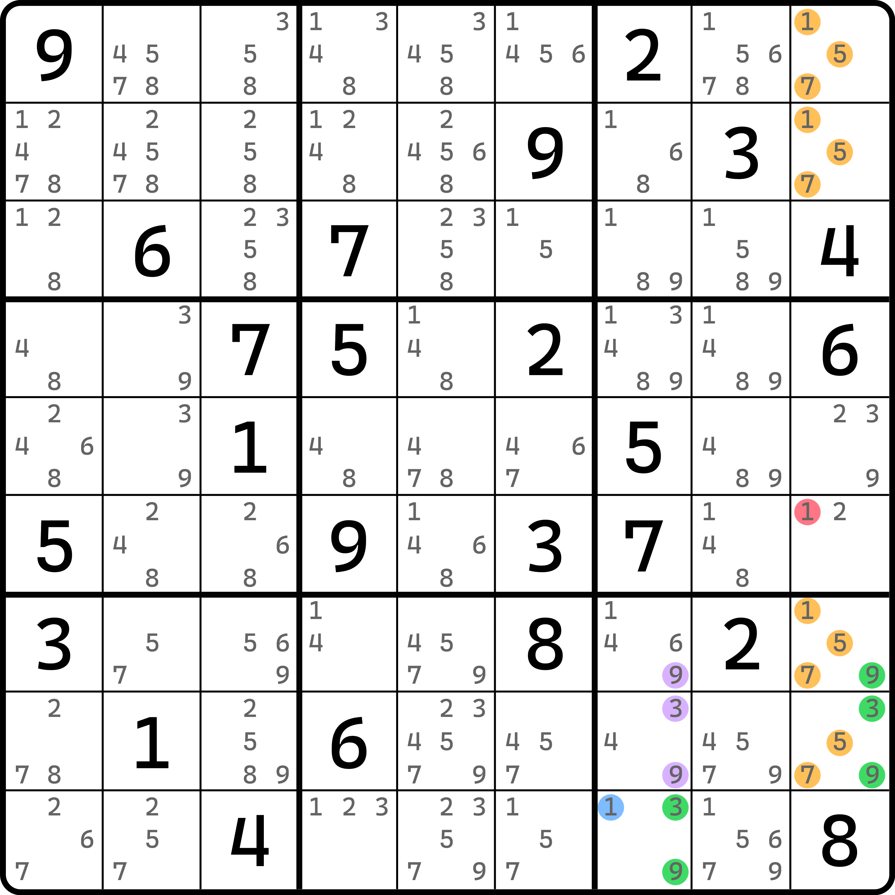
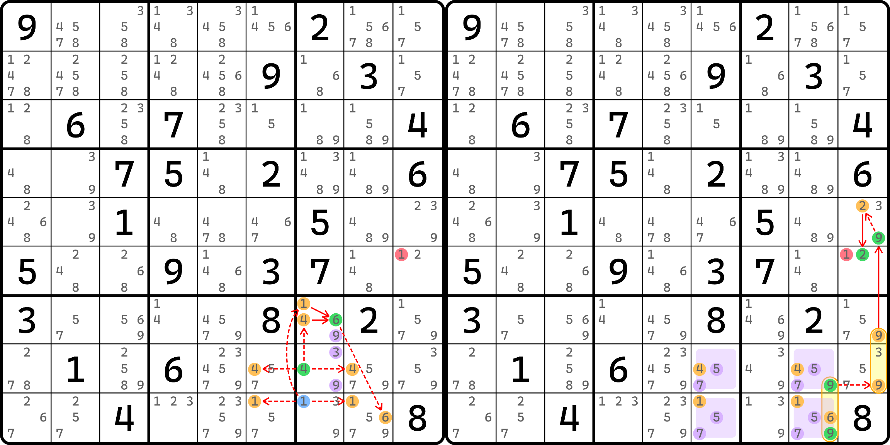

# 牺牲的例子

## 例子 1：毛刺 ALS-XZ 环 

<figure><figcaption>
例子 1，毛刺假的情况
</figcaption></figure>

如图所示。当毛刺 `r7c3(6)` 为假的时候，有 ALS-XZ 的环，预备删数是 `r7c2(9)`、`r8c4(8)` 和 `r9c9(6)` 等。其他的删数本题用不上，所以就不标了。

<figure><figcaption>
例子 1，毛刺真的情况
</figcaption></figure>

如图所示。当毛刺 `r7c3(6)` 为真的时候，我们需要按两个分支动态延伸。其中一边得到 `r2c7(4)` 为假，另外一边得到 `r9c7(8)` 为假。注意这里我们牺牲了 `r7c2(9)` 以构成单元格内的强链关系。

得到两个均为假之后，我们可以得到 `r29c7(56)` 这个显性毛刺数对为真，于是有 `r5c7(6)` 为假。这样汇合到一起。最终得到 `r56c9(6)` 为真。

因为两种情况均可删除 `r9c9(6)`，而 `r7c2(9)` 和 `r8c4(8)` 都是预备删数，所以牺牲它换来了正确的删数。

## 例子 2：毛刺融合待定数组 

<figure><figcaption>
例子 2，毛刺假的情况
</figcaption></figure>

如图所示。毛刺是这里的 `r7c4(5)`。它为假的时候，有融合待定数组形成，包含删数 `r9c9(47)` 和 `r7c5(1)` 这些。不过我们要牺牲掉 `r7c5(1)` 来换取剩下两个删数结论的成立。

<figure><figcaption>
例子 2，毛刺真的情况
</figcaption></figure>

如图所示。当毛刺为真时，可以直接排除 `r7c1(5)`，然后走另一个分支得到 `r7c1(8)` 也为假，于是 `r7c1(3)` 为真，于是继续后续的内容，到 `r9c9(9)` 为真，所以删数也可以成立。

## 例子 3：双毛刺连续环 

<figure><figcaption>
例子 3，毛刺假的情况
</figcaption></figure>

如图所示。这个题有两个毛刺 `r4c9(2)` 和 `r8c5(5)`，是一个毛刺连续环，预备删数是 `r4c3(3)` 和 `r56c9(4)` 等。

<figure><figcaption>
例子 3，毛刺真的两个分支的情况
</figcaption></figure>

如图所示。当毛刺为真时，需要考虑两个分支的分别删数，找出共同删数。左图是 `r4c9(2)` 为真，右图是 `r8c5(5)` 为真。

左图可以得到 `r4c8(4)` 为真的结果，需要牺牲 `r4c3(3)` 这个预备删数；而右图则可以得到 `r56c9(67)` 这个毛刺隐性数对为真。总之两种情况均可排除掉 `r56c9(4)` 的可能。

要注意的是，虽然我们是分开讨论的，但是我们仍然可以使用毛边的思想，将两个毛刺使用强链毛边关系连起来。因为此时两个毛刺至少有一个为真；连起来之后就是一个动态链，其中头部是这个 `r4c8(4)` 的动态分支走回到 `r4c9(2)` 为假，然后借助毛边强链关系直接到 `r8c5(5)` 为真，然后继续。最终就是看这条链的头尾（`r4c8(4)` 和 `r56c9(67)` 毛刺隐性数对）的删数交集。此时，牺牲也是可以用的。

## 例子 4：毛刺融合待定数组 

最后来看一个例子。这个例子稍微复杂一些。

<figure><figcaption>
例子 4，毛刺假的情况
</figcaption></figure>

如图所示。这也是一个毛刺融合待定数组，其预备删数有 `r6c9(1)`、`r7c7(9)`、`r8c7(39)` 等。

<figure><figcaption>
例子 4，毛刺真的情况
</figcaption></figure>

如图所示。因为有点复杂，所以我把这个毛刺为真的视图又进一步拆了两个图。

先看左图。左图是牺牲了三个预备删数 `r7c7(9)` 和 `r8c7(39)` 得到的动态强制链。这个动态强制链分支最终会造成五个候选数为假：`r8c68(4)`、`r9c68(1)` 和 `r9c8(6)`。

他们全为假后，因为 `r89c68(57)` 要出现唯一矩形造成矛盾，因此需要规避。于是，唯一可以规避的就是让区块节点 `r89c8(9)` 为真，即相当于将前面的超多分支的末端和这个节点形成强链关系，即 `4r8c68|1r9c68|6r9c8=9r89c8` 成立。

然后往后走，可以得到右图，最终得到 `r6c9(2)` 为真。因为 `r6c9(1)` 是预备删数的其一，所以这个删数可以删除。
