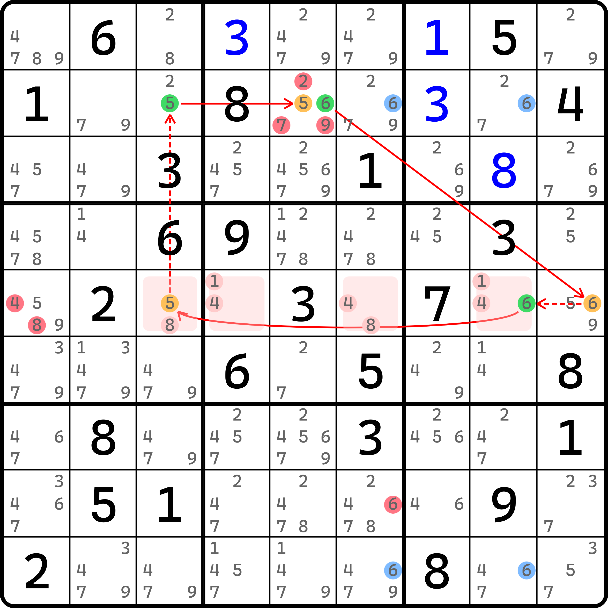

# 外部环的基本推理

## 环里的一个奇怪的强链关系 <a href="#a-weird-strong-inference-in-loop" id="a-weird-strong-inference-in-loop"></a>

<figure><figcaption><p>外部环</p></figcaption></figure>

如图所示。这是一个环。不过这个环有两个比较难以理解的点：

1. 环里似乎插入了一个奇怪的强链关系 `6r2c5=6r5c9`；
2. 环的删数似乎到不了 `r8c6(6)` 这里来。

因为其他的强弱链关系比较好理解，所以这里我们着重针对上面提及的两点进行解答。

### 强链关系推导 <a href="#how-to-get-that-strong-inference" id="how-to-get-that-strong-inference"></a>

想要得到这个强链关系的结论，其实也不难。可以在图里看到，有四个不太起眼的蓝色的候选数标记。这是一个二阶鱼结构。

证明这一点，我们需要得到矛盾的点。假设候选数 `r2c5(6)` 和 `r5c9(6)` 同为假，我们将得到 `r29` 构成一个关于 6 的二阶鱼结构。按照鱼的思路，我们可以删除 `r5c8(6)`。但是，再看 `r5` 就可以发现，此时 `r5` 就已经没有 6 可填了，因为 `r5c8` 被删，`r5c9` 也被假设为假，这是唯二可填 6 的位置。所以这就造成了矛盾。

### 环的删数 <a href="#elimination-of-this-loop" id="elimination-of-this-loop"></a>

既然环能成立，那么我们自然就可以去找弱链关系去找出删数。不过，这个题的删数有哪些呢？

显然，环里有一个待定数组和一个弱链关系可以用于删数，所以很容易得到的是 `r2c5 <> 279` 和 `r5c1 <> 48`。那么，`r8c6 <> 6` 是怎么来的呢？

我们可以这么去想。我们可以按之前鱼的构造思路，将鱼强行当成节点纳入环路里。这样传递的过程就是这样的：

```
r2c5(6) 假
  => 二阶鱼 r29c68(6) 真
  => r5c8(6) 假
  => r5c9(6) 真
  => r5c8(6) 假
  => r5c3(5) 真
  => ...
```

这里我们是为了强行阐述传递过程，所以从 `r5c8(6)` 又往 `r5c9(6)` 走去，是为了体现强弱交替传递的过程；但是因为套了二阶鱼结构的节点类型，所以我们就不再需要走 `r5c9(6)` 了，因为强弱传递是正常的。换言之，如果我们直接从 `r2c5(6)` 开始走到 `r5c8(6)` 的话，这里的传递过程就变为了“`r2c5(6)` 为真得到 `r5c8(6)` 为真”，这样画出来的链就不太恰当了。

那么，走了二阶鱼当节点后，我们之前说过，二阶鱼当成节点在环路里是视为带动态效果的存在。它的删数就是按二阶鱼的效果进行删数。所以呢？所以二阶鱼的删数包含 `r8c6(6)`，因此这个环可以删这个数。

我们把这个环称为**外部环**或**大环**（External Loop）。这种删数思路由来自中国的数独玩家“解素商”（昵称）整理得来。

## 怎么看起来外部环是“跳步骤”的环？ <a href="#it-seems-that-external-loop-misses-some-steps-on-purpose" id="it-seems-that-external-loop-misses-some-steps-on-purpose"></a>

从刚才的解释里看得出来，它的本质是传递关系期间将结构作为依托，然后构造特殊强弱关系的环的用法。说得好听一些，它是一种包装思路；但说得不好听的话，看起来就像是单纯在跳步骤，毕竟也可以将环路的强弱关系铺开，纳入结构整体传递强弱关系，也可得到结论形成。

怎么说呢……是的，你没理解错。外部环看起来就像是在跳步骤。但从包装的视角来看，一个玩家要想找出这个环，它的思路并非是从上面的解释文字这个过程去看的，而是去构造出来强弱关系。也就是说，找这种环的思路是发现大部分地方都可以强弱链关系传递，但有一个无法传递的地方，它恰好缺少强弱链关系把他俩串起来，我们就可以开始找结构。

其强链关系的本质是假设同假时造成矛盾，而弱链关系的本质是假设同真时造成矛盾。而我们的目标是构造强弱链关系，所以我们需要做的是，假设两个节点同真（或同假），看是否可以依靠结构快速得到矛盾点。如果能够得到矛盾，那么恭喜你，这个强弱链关系是成立的，那么你可以纳入环里，环也可以构成；如果不能，也不要气馁，可能只是没看到合适的位置和地方，运气不太好。

## 这种环如何去找删数？ <a href="#how-to-find-extra-eliminations-on-loop" id="how-to-find-extra-eliminations-on-loop"></a>

首先，环的基础删数肯定一个别落下。直接看弱链关系去找删数就行，这个之前环的内容里已经提过，这里就不赘述了。这里着重的是说如何看特殊删数。

要想找类似前面例子里 `r8c6(6)` 这种特殊删数，我们需要做的是，将你证明所依赖的结构纳入环里来。认真分析结构在形成后能造成的删数效果，然后进行删数分析。

这一句话相信你很难快速理解和掌握。下一节我们将给各位带来一些关于外部环的例子，让各位慢慢学习这些特殊删数结论的得来，而这句话到底是想表达一个什么意思，相信看了例子之后你也会有一个比较不错的理解和掌握。
