# 外部环的例子

下面我们来看一些例子。

## 例子 1：外部双 RCC 的 ALS-XZ 环 <a href="#example-1" id="example-1"></a>

<figure>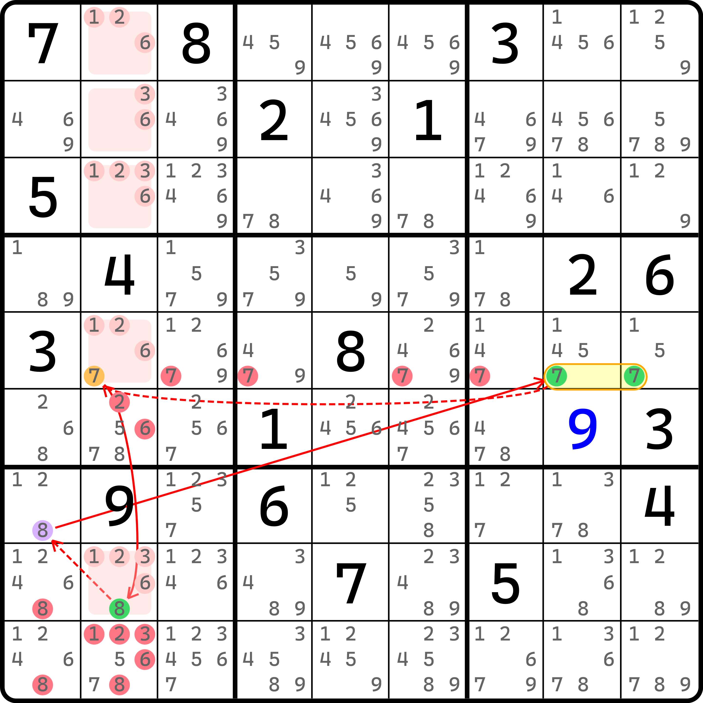<figcaption><p>例子 1</p></figcaption></figure>

如图所示。这个环特殊传递的地方发生在 `8r7c1=7r5c89`。我们来看这是怎么来的。

这个强链关系要证明其同假后矛盾，我们需要借助双 RCC 的 ALS-XZ 结构。如图所示：

<figure>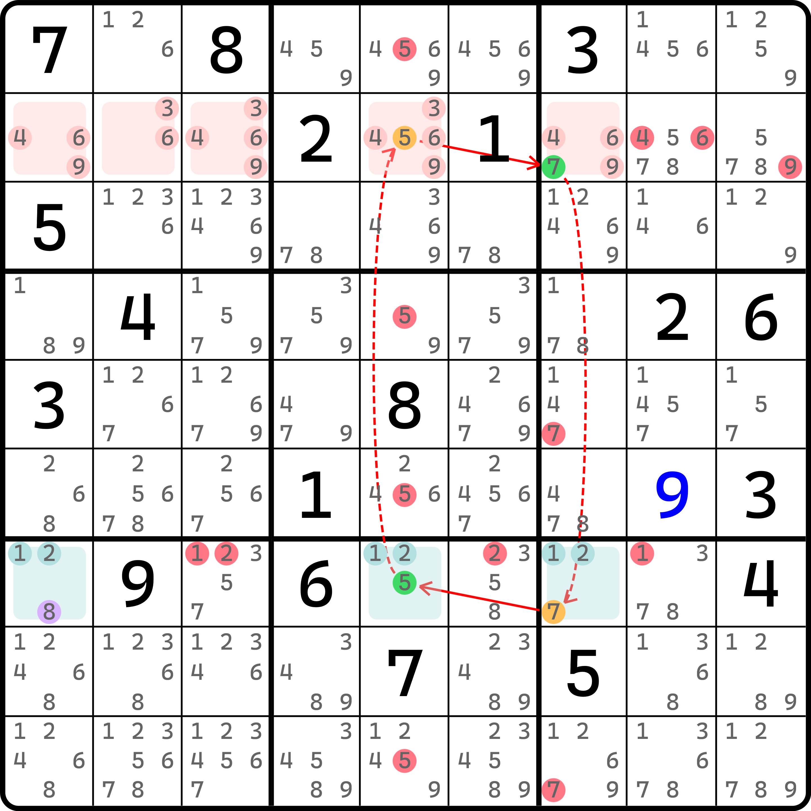<figcaption><p>双 RCC 的 ALS-XZ 证明强链关系</p></figcaption></figure>

如图所示。如果我们假设 `r7c1(8)` 和 `r5c89(7)` 同假，会发生什么？

首先，如果同假，则这个双 RCC 的 ALS-XZ 会成立（尤其是 `r7c1(8)` 没了才会促成 `5r7c5=7r7c7` 的形成）。成立之后，`r456c7(7)` 会被该结构所删除。但是，我们还假设了 `r5c89(7)` 为假，这样就会造成一个问题：`b6` 没填 7 的合适位置了。这就形成了矛盾。

所以，外部环看起来是成立的。那么删数呢？我们捋一下双 RCC 的 ALS-XZ 在本外部环里体现的作用。我们利用结构传递的这一截，传递过程是这样的：

```
r7c1(8) 假
  => 双 RCC 的 ALS-XZ 真
  => r456c7(7) 假
  => r5c89(7) 真
  => ...
```

其中，`b6` 里数字 7 是每个数字都在使用。先从 RCC 造成删数后，然后又快速得到 `r5c89(7)` 必须为真以保证 `b6` 必须填 7。因此，这个环的删数包含两部分：

1. 原环结构里的所有弱链关系造成的删数结论；
2. 双 RCC 的 ALS-XZ 结构造成的、非 `r46c5(7)` 的所有其余删数结论。

你问我为什么是除开 `r46c5(7)` 的其余候选数，而不是除开 `r456c5(7)` 的其余候选数？因为 `r5c7(7)` 是原环结构成立后直接就有的删数，它是含在其中的，但 `r46c5(7)` 不同，这俩原环里删不了（弱链关系没一个可以删它）；而这俩恰好给 `b6` 里填 7 提供了传递的依据。所以它俩特殊一些，删不掉。因此，整个环的删数如下：

<figure>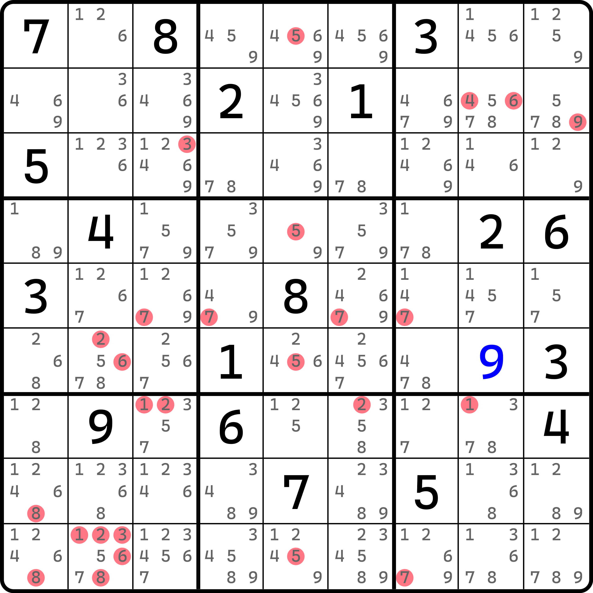<figcaption><p>例子 1 的全部删数</p></figcaption></figure>

## 例子 2：外部待定数组环 <a href="#example-2" id="example-2"></a>

<figure>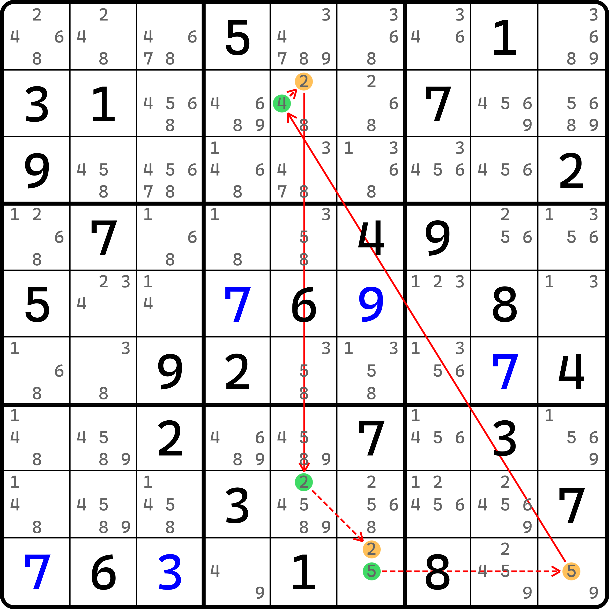<figcaption><p>例子 2</p></figcaption></figure>

如图所示。这个例子里我们可以看到奇怪的强链关系是 `5r9c9=4r2c5`。它怎么来的呢？

<figure>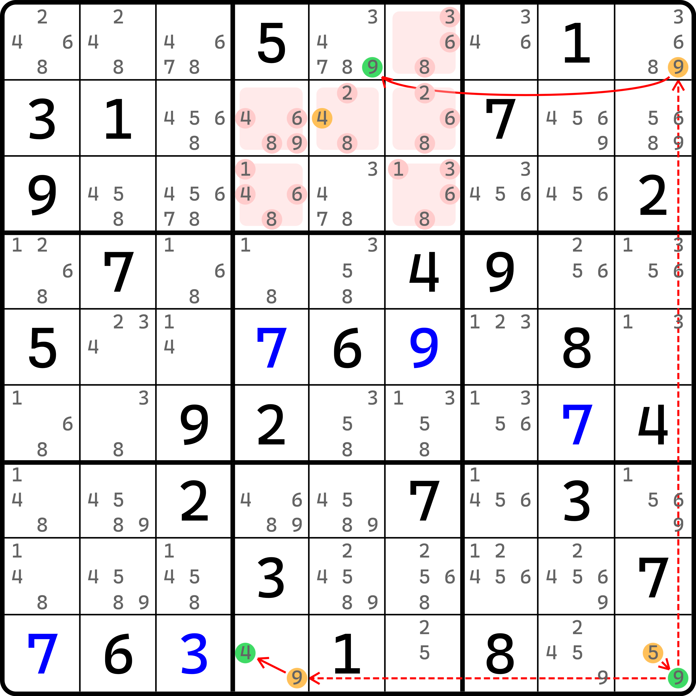<figcaption><p>待定数组证明强链关系</p></figcaption></figure>

如图所示。证明此强链关系，需要依赖同假后的推导过程。这次稍微长一些，需要引出动态链分支进行小幅度传递。如果 `r9c9(5)` 和 `r2c5(4)` 同假，则 `r9c9` 只能填 9。走两个分支分别得到 `r1c5 = 9` 和 `r9c4 = 4` 的结论。

可通过排除可得，`r23c4 <> 4` 和 `r2c4 <> 9` 的结论。这样一来，单元格 `r1c6`、`r2c456` 和 `r3c46` 只剩下 1、2、3、6、8 五种不同的数字。显然，6 个单元格是无法只放入 5 个不同数字的，所以这就矛盾了。要注意的是，`r2c5` 此时也没 4 了，因为证明强链关系成立的时候已经假设它为假了。

好了。那么我们知道这个外部环成立之后，它的删数如何呢？

<figure>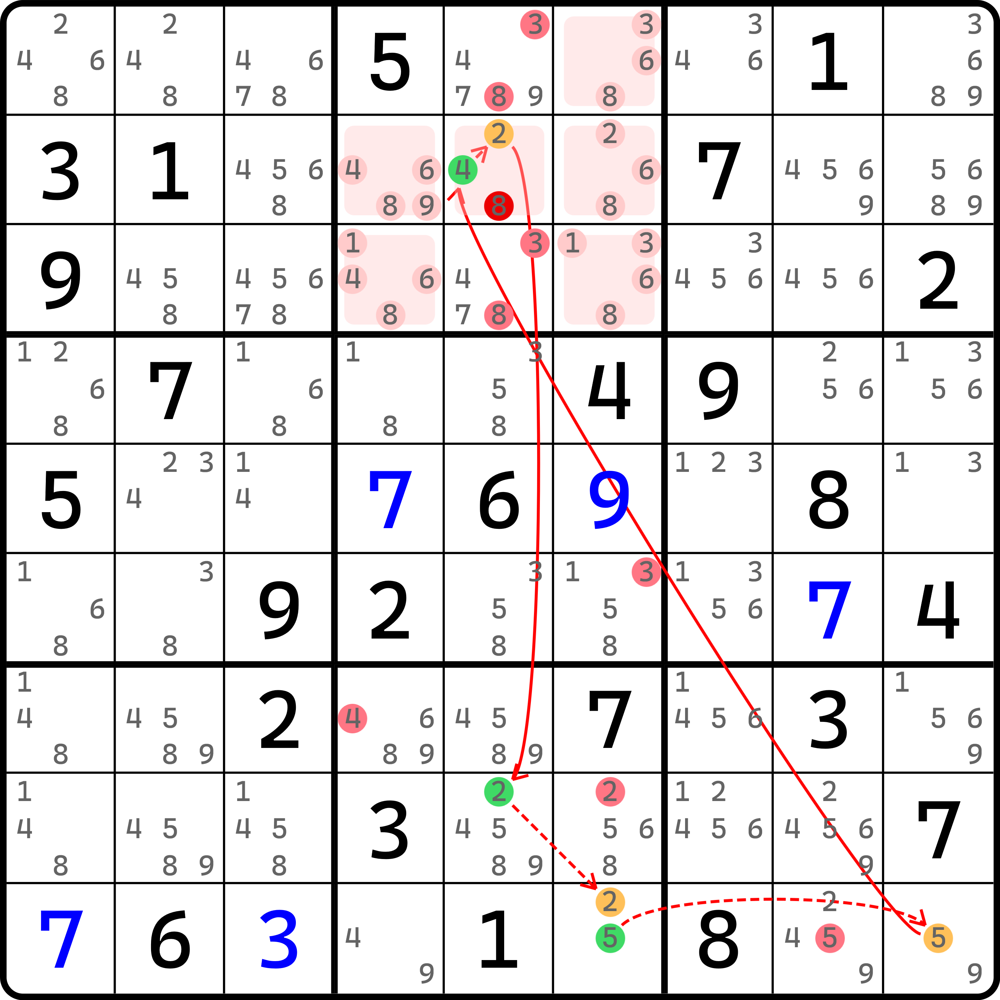<figcaption><p>例子 2 的全部删数</p></figcaption></figure>

如图所示。我们分析传递过程：

```
r9c9(5) 假
  => r9c9(9) 真
    => r1c9(9) 假 => r1c5(9) 真
    => r9c4(9) 假 => r9c4(4) 真
  => 待定数组 {r1c6, r2c456, r3c46}(1234689) 假
  => r2c5(4) 真
  => ...
```

可这么看还是不好理解。那么我们不妨就逆向看。我们之前说过环是可以反过来看的，所以我们把逻辑倒过来。

```
r2c5(4) 假
  => 待定数组 {r1c6, r2c456, r3c46}(1234689) 真
    => r1c5(9) 假 => r1c9(9) 真
    => r9c4(4) 假 => r9c4(9) 真
  => r9c9(9) 假
  => r9c9(5) 真
```

这样是不是就很容易知道了？因为待定数组直接为真之后可以引发一系列的删数，然后走了两个动态分支才汇入 `r9c9` 上。所以，这个环是个动态半环，删数只有待定数组引发的删数和非 9 的两侧分支的部分，其他弱链关系均可用于删数。

## 例子 3：外部融合待定数组环 <a href="#example-3" id="example-3"></a>

<figure>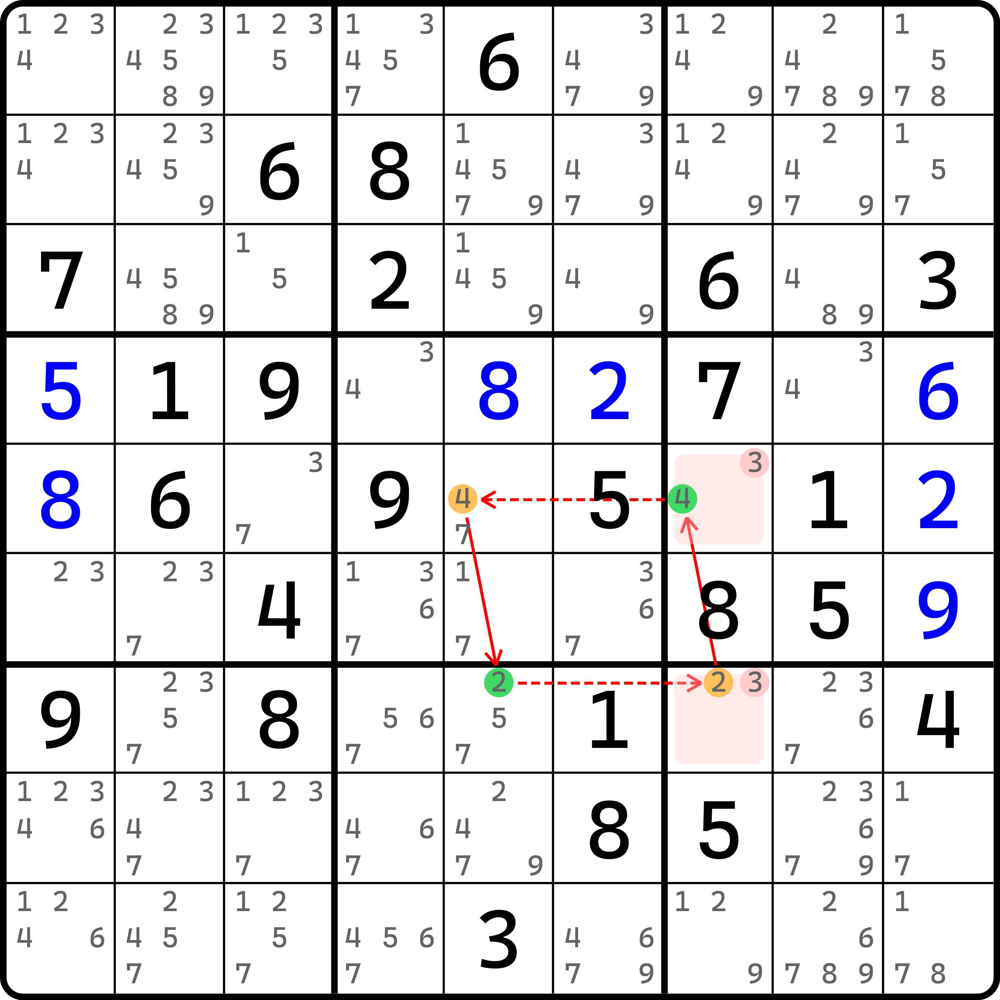<figcaption><p>例子 3</p></figcaption></figure>

如图所示。这个环要证明的强链关系是 `4r5c5=2r7c5`。

<figure>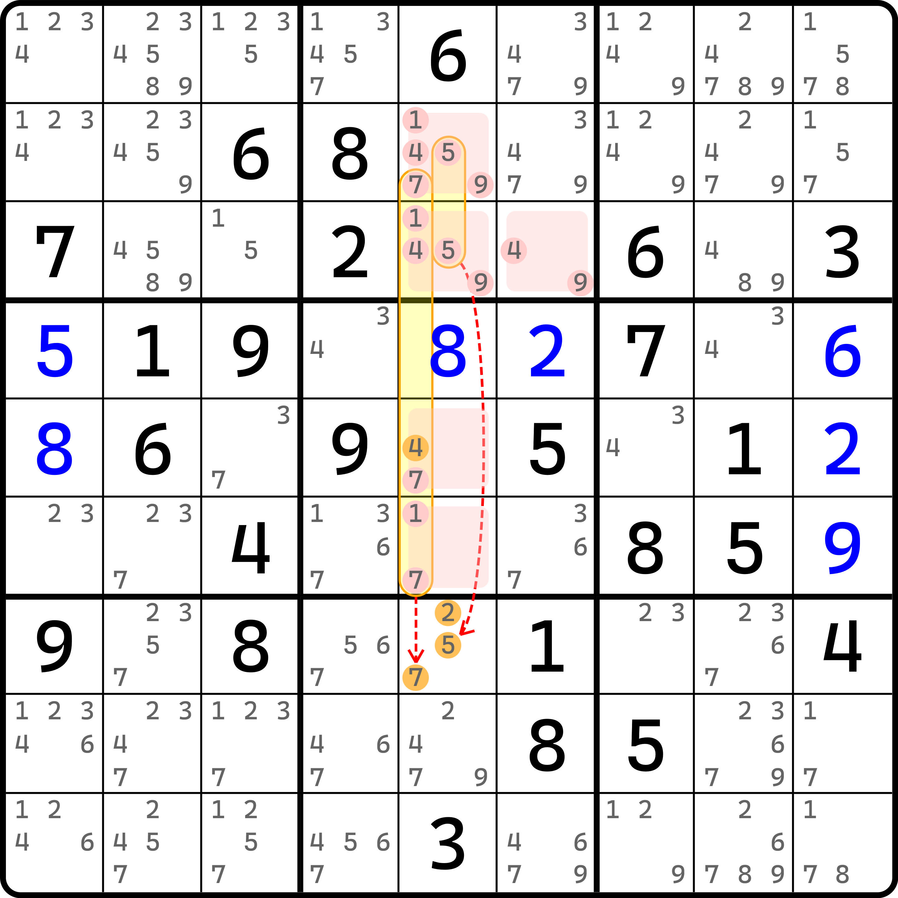<figcaption><p>利用融合待定数组证明强链关系</p></figcaption></figure>

如图所示。证明的方式是用的融合待定数组。如果两者同假，则 `r256c5`、`r3c56` 构成的融合待定数组将成立，于是 5 和 7 可以用于删数删掉 `r7c5(57)`，致使 `r7c5` 没有候选数可填。

所以，捋一遍推理过程：

```
r5c5(4) 假
  => 融合待定数组 {r256c5, r3c56}(14579) 真
  => r7c5(57) 假
  => r7c5(2) 真
  => ...
```

所以呢？所以就是融合待定数组也可以纳入环的删数，本题的删数如下：

<figure>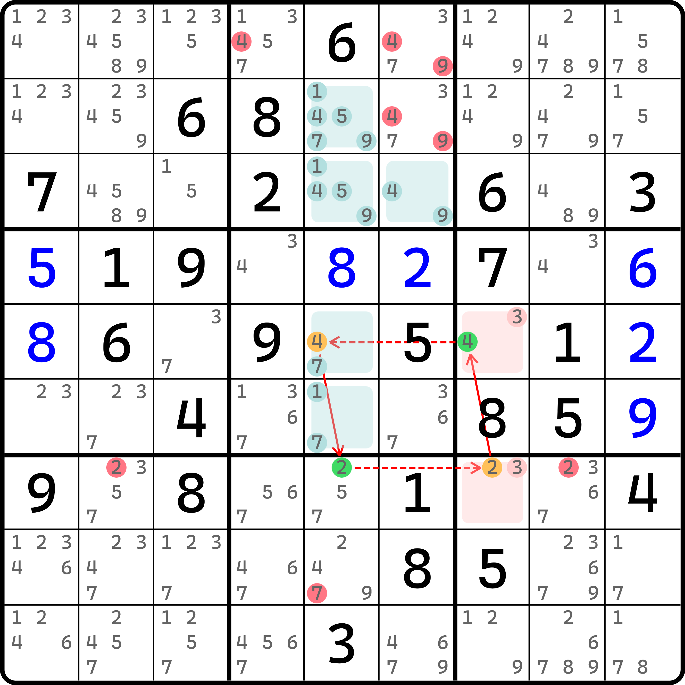<figcaption><p>例子 3 里的全部删数</p></figcaption></figure>

如图所示。

## 例子 4：外部摩天楼环 <a href="#example-4" id="example-4"></a>

<figure>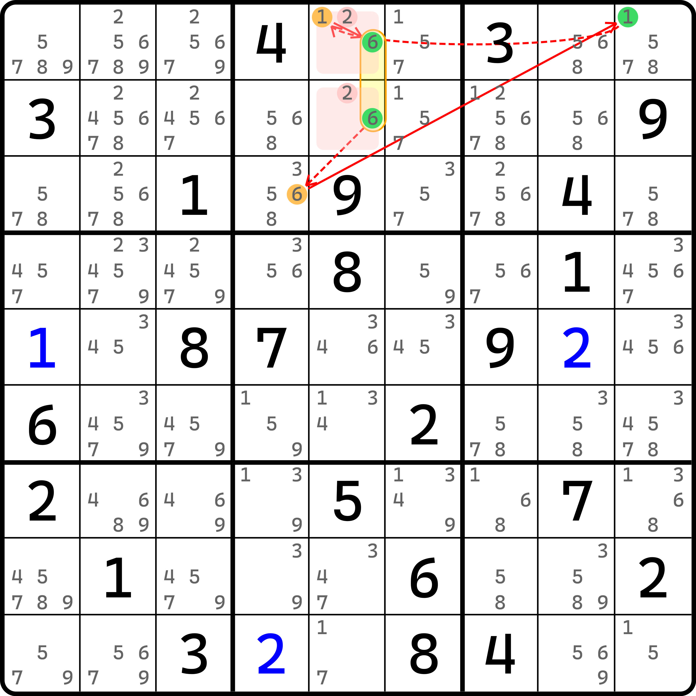<figcaption><p>例子 4</p></figcaption></figure>

如图所示。证明强链关系 `6r3c4=1r1c9` 的方式如下：

<figure>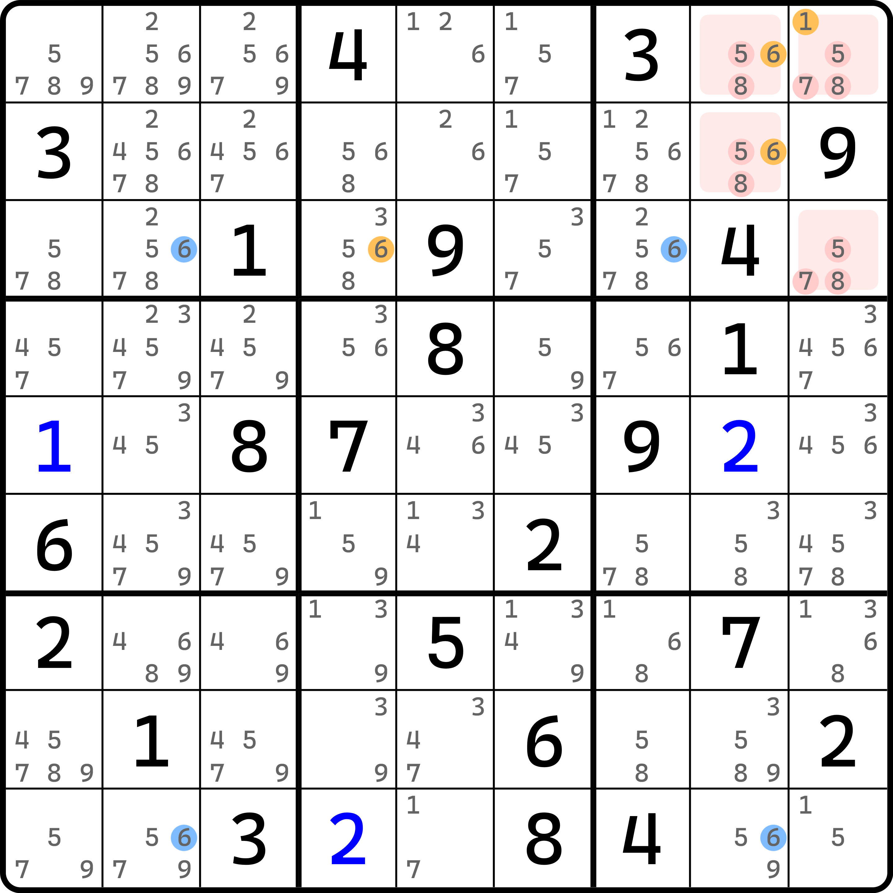<figcaption><p>摩天楼证明强链关系</p></figcaption></figure>

如图所示。这次我们用点不一样的技巧结构。如果 `r3c4(6)` 假的话，则 `r39` 两行的摩天楼成立，于是摩天楼可删除 `r12c8(6)` 两处。结合 `r1c9(1)` 为假，于是待定数组 `{r1c89, r2c8, r3c9}(15678)` 四个单元格只剩下三种数字 5、7、8 造成矛盾。

传递过程如下：

```
r3c4(6) 假
  => 摩天楼 {r3c27, r9c28}(6) 真
  => r12c8(6) 假
  => r1c9(1) 真
  => ...
```

结论自然就是涵盖了待定数组的部分了。摩天楼比较遗憾，这个例子用不了摩天楼去找额外删数。

<figure>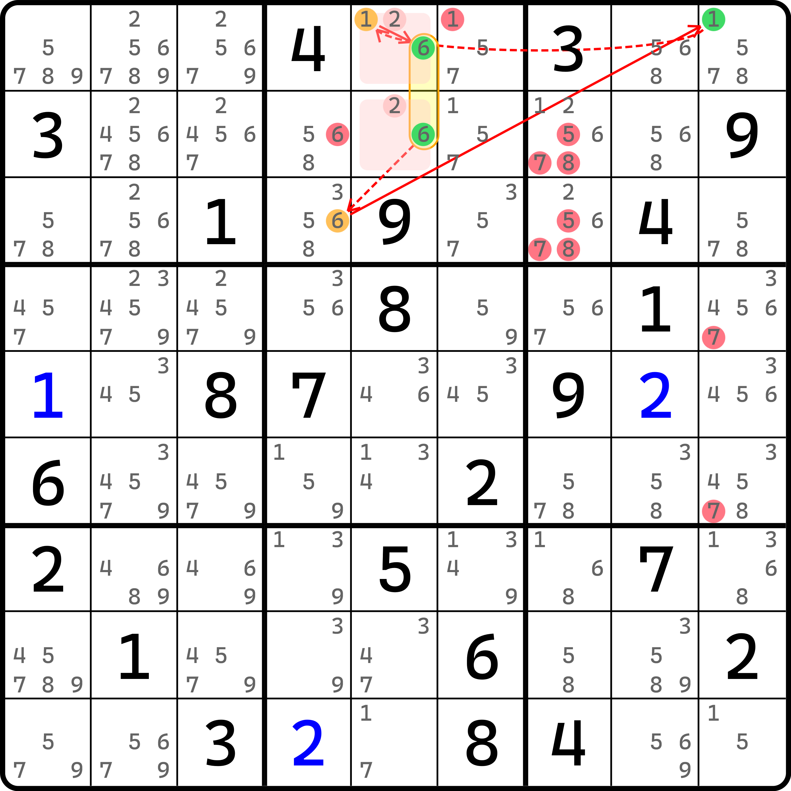<figcaption><p>例子 4 的删数结论</p></figcaption></figure>

如图所示。

## 例子 5：外部双 RCC 的 ALS-XZ 环 <a href="#example-5" id="example-5"></a>

我们再来看一个比较复杂一些的、用双 RCC 的 ALS-XZ 的外部环。我没开玩笑，这次真的很复杂。

<figure>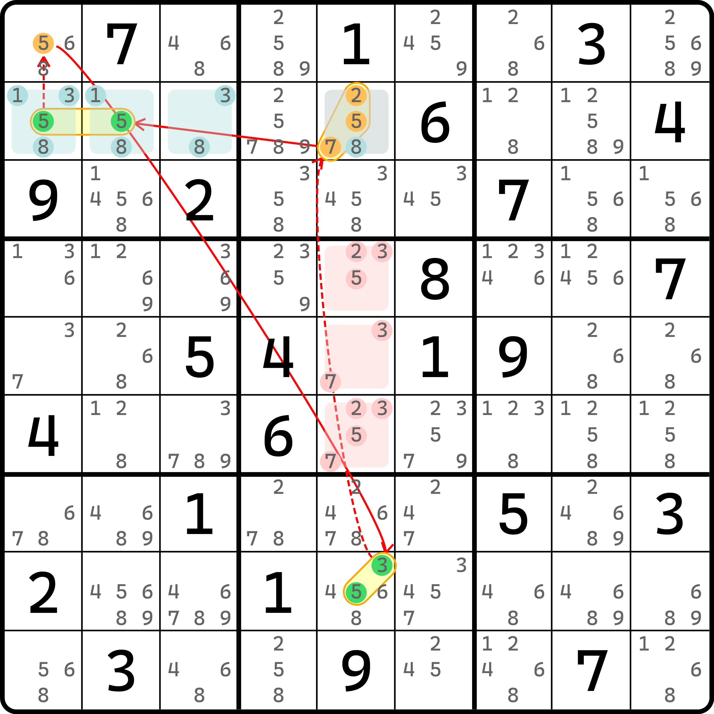<figcaption><p>例子 5</p></figcaption></figure>

如图所示。需要证明的强链关系是 `5r1c1=35r8c5`。是的，`r8c5(35)` 两个候选数将作为同一个节点用于环里。它的下一个节点是 `r2c5(257)`，也是一个同单元格、多候选数的节点。这个环非常可怕。

不过证明起来，更可怕。

<figure>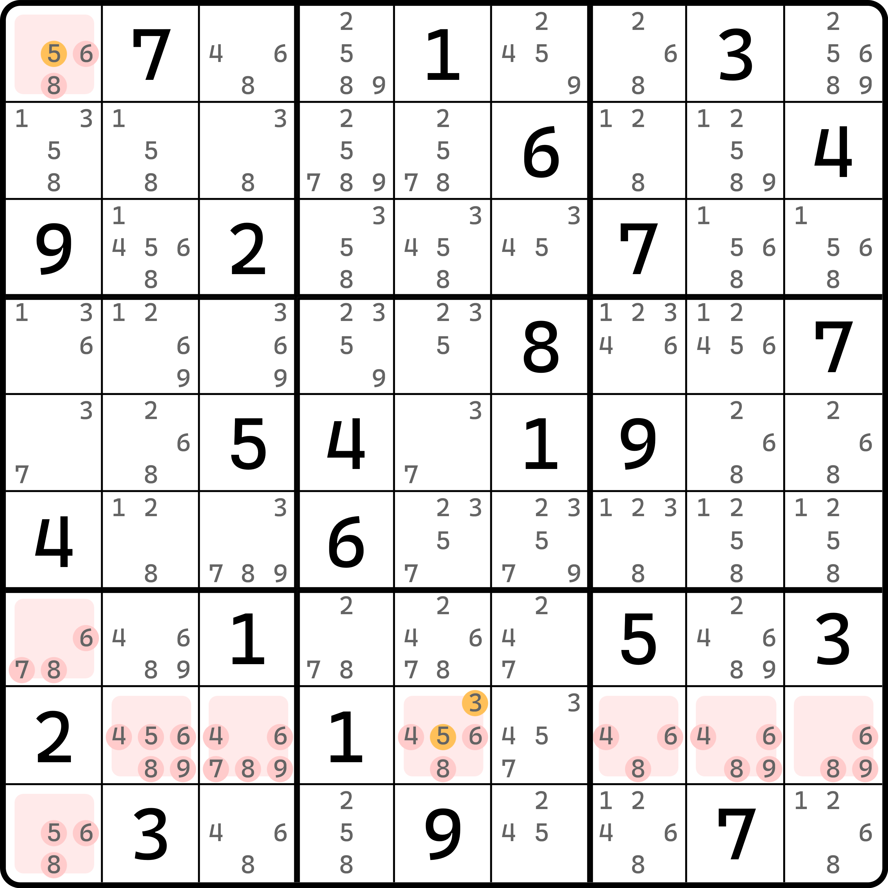<figcaption><p>利用双 RCC 的 ALS-XZ 证明强链关系</p></figcaption></figure>

如图所示。当两端节点同假时，双 RCC 的 ALS-XZ 会造成矛盾。这个结构这么大，它是如何矛盾的呢？

我们不妨按两个待定数组拆开去数一下填数的状态。显然，拆开看之后有 2 个待定数组：`r179c1(5678)` 一个，而 `r8c235789(3456789)` 又是一个。那么 RCC 呢？显然是图中的 5 和 7 了。

因为安排数字的时候，双 RCC 的 ALS-XZ 本质上也是一个环。既然是环，那么就意味着环路任意相邻的两个节点都是一真一假。对于 5 和 7 而言，环意味着两个连接状态是一真一假，也就是说，属于 `r179c1(5678)` 的数字 5（即 `r9c1(5)`）和属于 `r8c235789(3456789)` 的数字 5（即 `r8c2(5)`）是一真一假的状态；同理，`r7c1(7)` 和 `r8c3(7)` 也是一真一假。

那么这么数一下填数你就会发现有问题。基于最初 `r1c1(5)` 和 `r8c5(35)` 同假的假设，余下的候选数分配的话：

* `r179c1` 要填 6 和 8；5 和 7 只能填 1 个；
* `r8c235789` 要填 4、6、8、9；3 没了，5 和 7 也只能选一个填。

这么数一下的话，2（6 和 8 都填）+ 1（5 和 7 只能填 1 个）+ 4（4、6、8、9 都填）+ 1（5 和 7 只能填 1 个）= 8，但是总体单元格数量是 9 个。这根本不够填，所以就造成了矛盾。

是的，这很可怕。不过好在我们知道了矛盾是可以得到的。因此，强链关系是成立的。外部环成立。删数呢？删数也挺可怕的，有这一些：

<figure>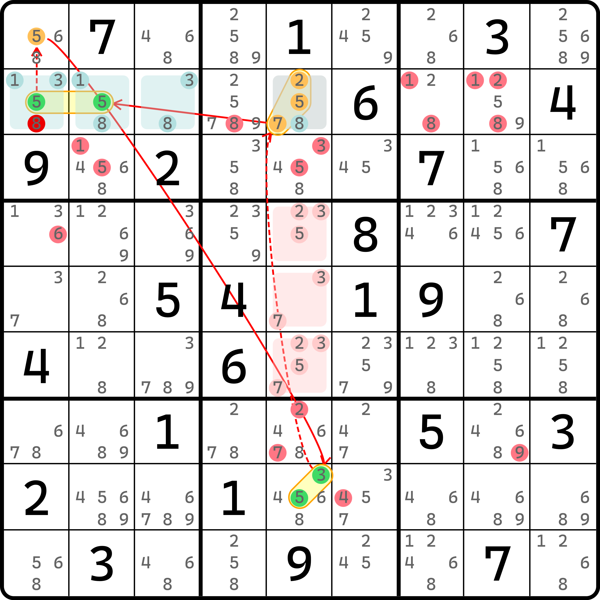<figcaption><p>例子 5 的全部删数</p></figcaption></figure>

如图所示。这些删数是可以得到的。当然，你也可以说因为删了这些之后可以得到 `r2c7 = 2` 于是又可以多一些删数。不过这显然不在结构可以造成的删数范围之内，是推出后的结论。其中，`r4c1(6)` 和 `r8c6(4)` 是来自于双 RCC 的 ALS-XZ 的删数，其他的删数则是待定数组和普通的弱链关系就可以造成的删数。不过这个题还有一个比较隐蔽的删数：`r7c8(9)`。你可以自己想一想为什么可以删。

## 例子 6：外部二阶鳍鱼环 <a href="#example-6" id="example-6"></a>

我们来看最后一个例子。这个例子难度也不小。

<figure>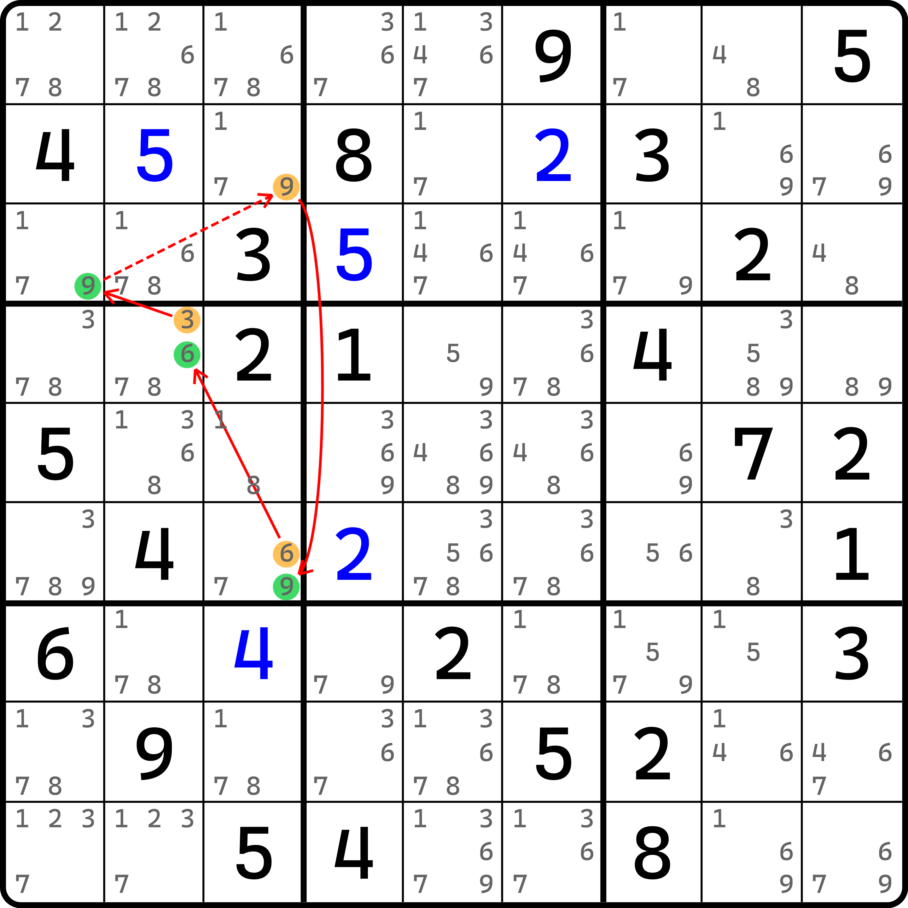<figcaption><p>例子 6</p></figcaption></figure>

如图所示。这里我们要解释的是 `3r4c2=9r3c1`。

这个说起来比较麻烦，因为它要传递过去需要依赖两次鱼结构，所以画图也不是很好体现，所以我一步一步拆开画。假设 `r4c2(3)` 为假，则有一个鳍鱼结构：

<figure>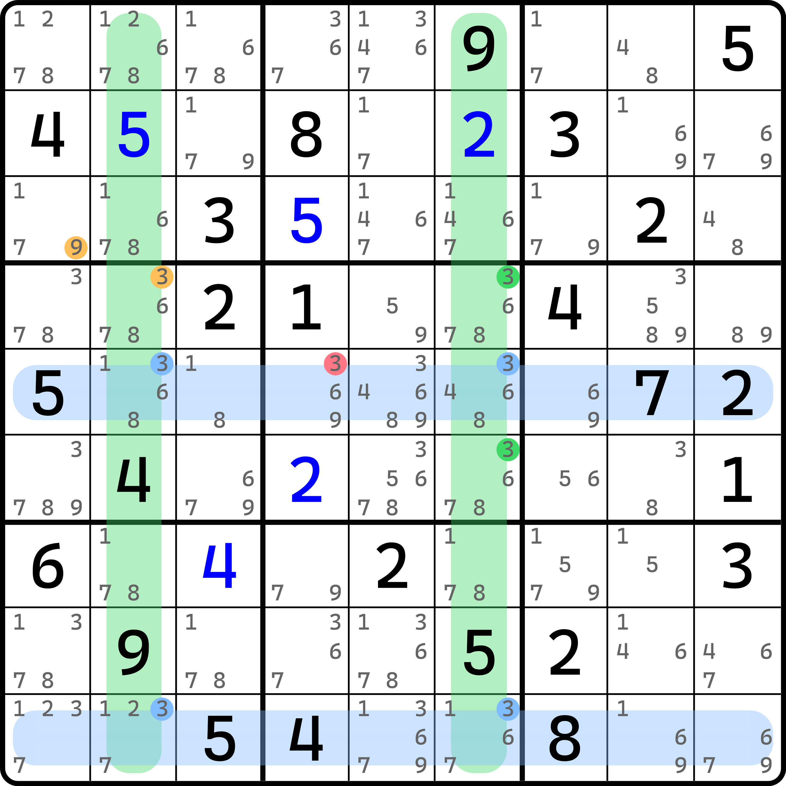<figcaption><p>r4c2(3) 假得到二阶鳍鱼结构删 r5c4(3)</p></figcaption></figure>

如图所示。这样可以得到 `r5c4(3)` 为假。

<figure>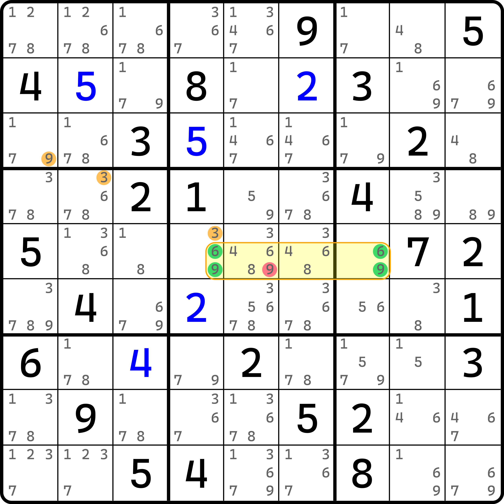<figcaption><p>r5c4(3) 假后有显性数对删 r5c5(9)</p></figcaption></figure>

然后我们可以得到显性数对删掉 `r5c5(9)`，即 `r5c5(9)` 为假。

<figure>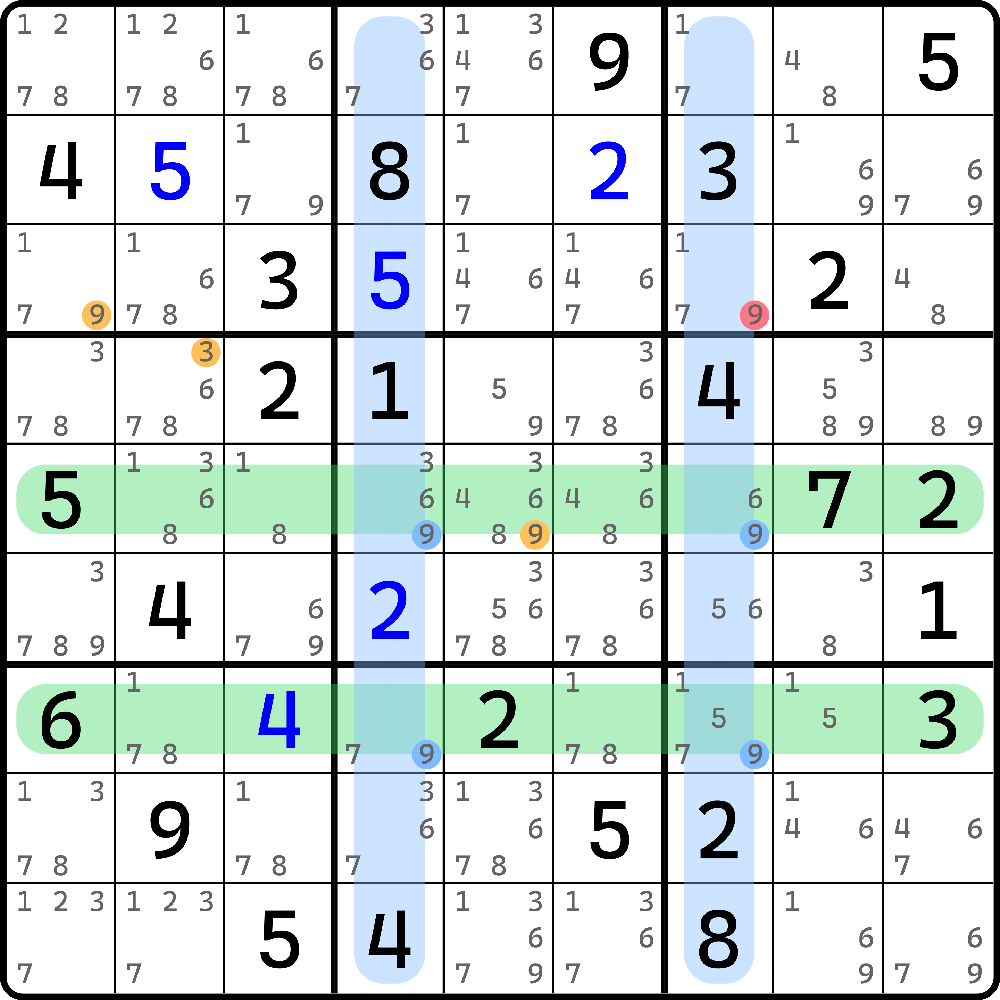<figcaption><p>r5c5(9) 为假后二阶鱼成立删 r3c7(9)</p></figcaption></figure>

接着，我们又有二阶鱼成立，得到 `r3c7(9)` 为假的结论。于是，`r3c1(9)` 必须为真。这样传递过去的。非常麻烦是不是？

那么，删数的话，如图所示：

<figure>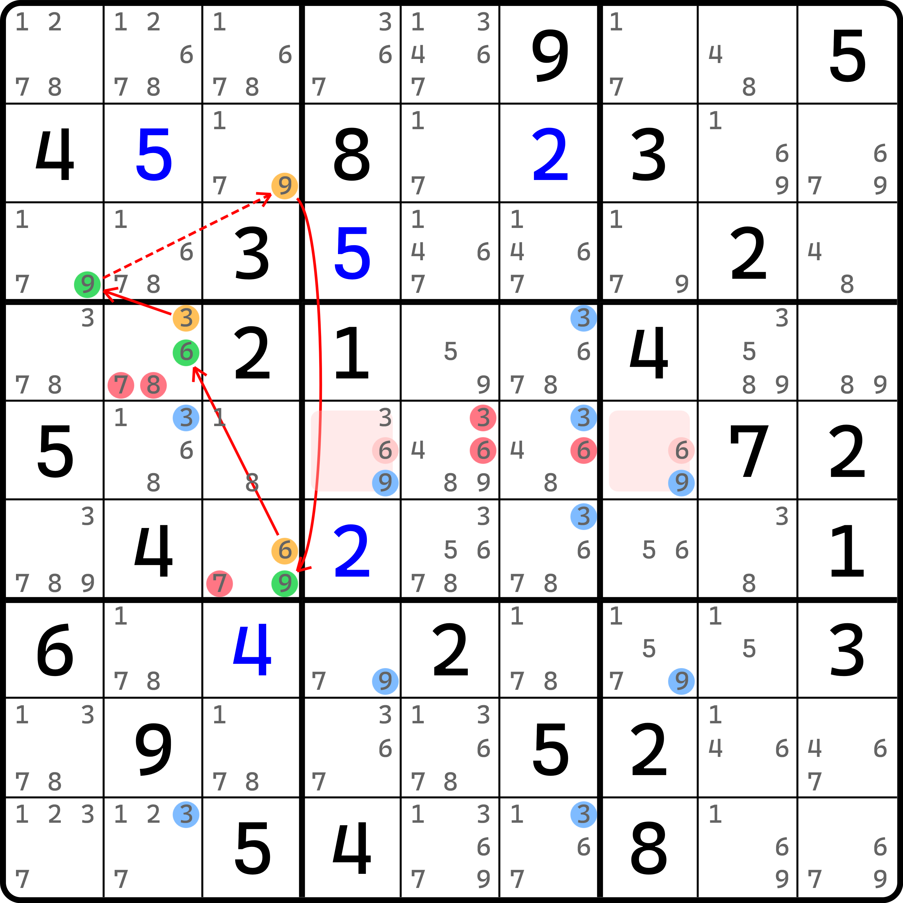<figcaption><p>例子 6 的全部删数</p></figcaption></figure>

如图所示。首先弱链关系可以删除 `r4c2(78)` 和 `r6c3(7)`，然后 6 和 9 的显性数对结构可以删除 `r5c56(6)`，最后是关于 3 的二阶鳍鱼造成了删数 `r5c5(3)`。当时在利用二阶鳍鱼的时候，我们是走的 `r5c4(3)` 为真，但 `r5c5(3)` 确实在此时也是作为删数存在的，因为它能够被鳍鱼删除。因此，这个题整体有这些删数。

至此，外部环的内容就全部结束了。
