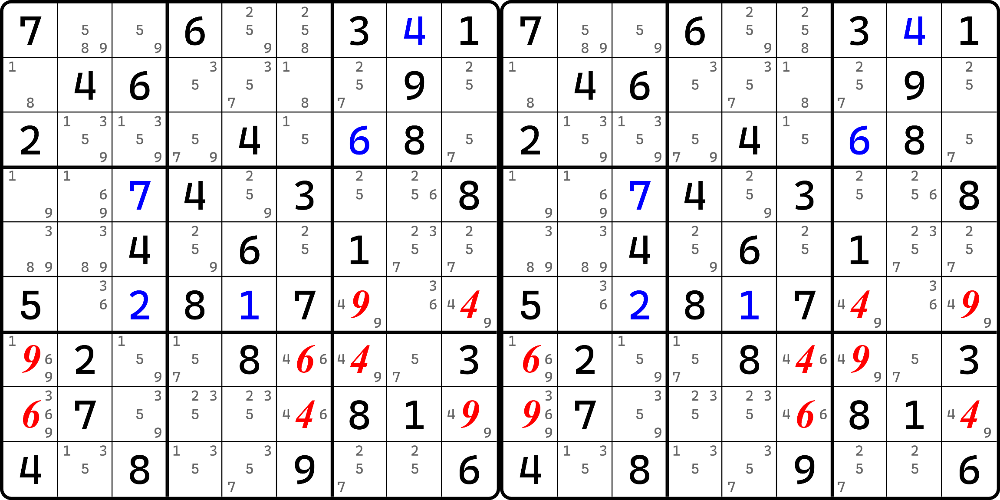
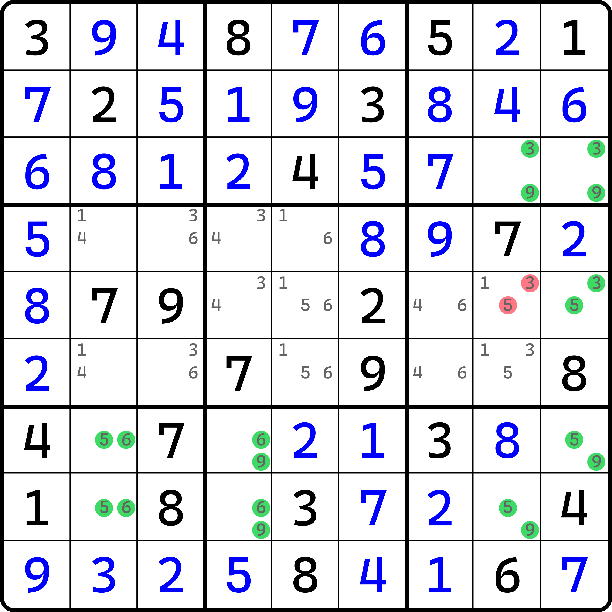
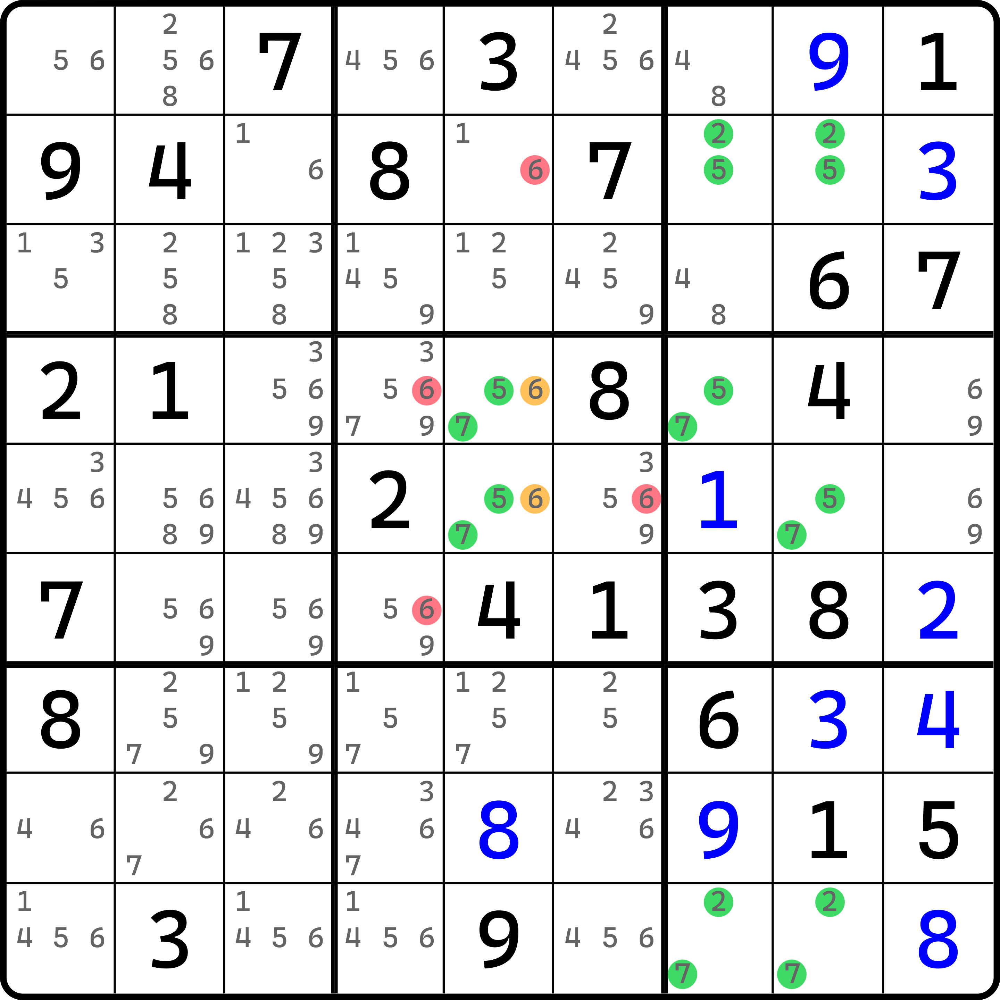
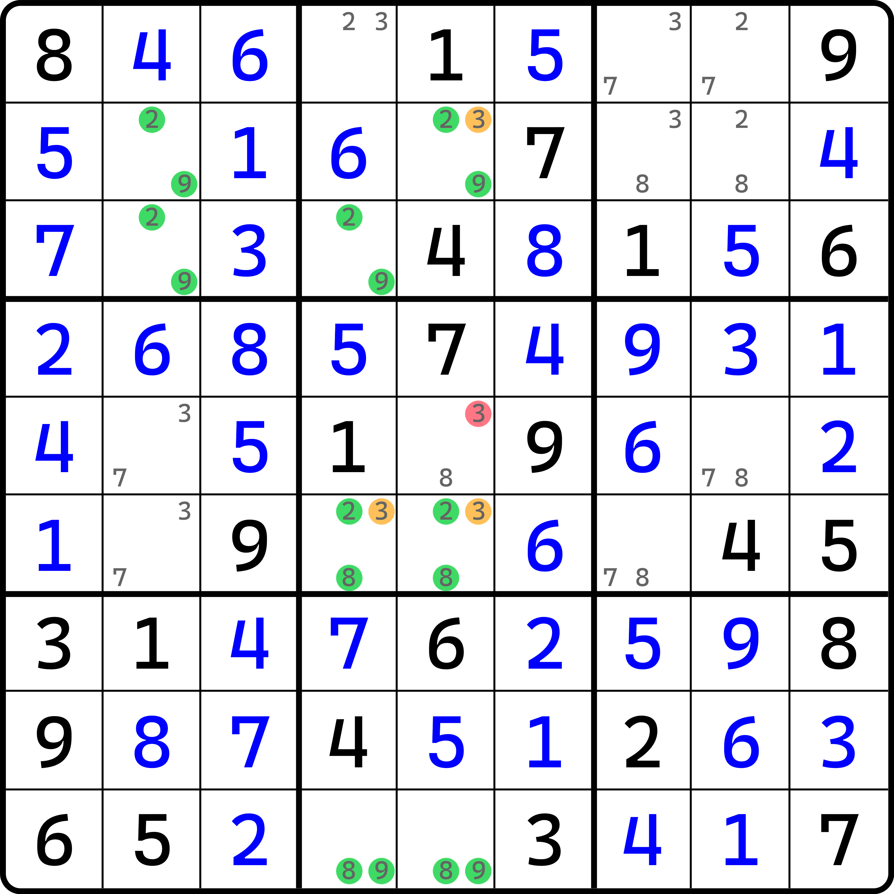

# 匿名致命结构

欢迎各位来到数独技巧教程的最后一个篇章。

## 开篇介绍 

早在唯一矩形的时候，我们就提到过，有一个大板块叫致命结构。它包含之前学到的唯一矩形、唯一环、拓展矩形、可规避矩形以及全双值格致死解法。这些解法有一个共性，就是利用了数独唯一解的特征。这个用法非常巧妙的点在于，它几乎和基础的行列宫不重复的规则是完全独立的另一个规则描述，以至于我们可以将两者进行结合，所以唯一矩形等这些技巧具有子类型的划分。

不过，唯一矩形总归是唯一矩形。它的用法再多样化，也逃脱不了它只用 4 个单元格的长相。于是，唯一环、拓展矩形等技巧就诞生了。可问题在于，拓展矩形的推理思路似乎因为结构的变样，也发生了一些变化。这带来了一个问题，我们都知道他们具备利用题目唯一解的规则在运用，那么，他们有没有一个严格的定义可以归纳全部我们目前学到过的所有这些技巧呢？

答案是肯定的，不过我们先不着急介绍这个。我们先从简单的结构进行分析和讨论，然后逐步拓展其推演思路。

## 匿名致命结构的基本推理 

<figure><figcaption>
匿名致命结构
</figcaption></figure>

如图所示。这看起来似乎是连体了，它由半个拓展矩形和半个唯一环构成，而且是一个类型 4。不过不重要，我们要想分析结构是否可以用，我们就必须知道它如何正常推演，并产生和之前学到的致命结构完全一样的、那些对应的矛盾。

我们的目的是知晓结构的所有行、列、宫里，所有这些用过的格子不论怎么换，外面的（跟结构无关的其余单元格）都保持着一样的候选数状态。这样结构内部随便换都不会影响他们，这样是证明矛盾的必要条件。那我们就先看看 4 和 9 的排列，因为拓展矩形的推演过程和唯一环、唯一矩形的直接交换有所不同，它的讨论会稍微麻烦一些，所以我们可以先从唯一环这一侧入手。

我们知道，和唯一环绑定的这一侧的四个单元格 `r6c79`、`r7c7` 和 `r8c9` 因为是唯一环长相，所以结构任意两个单元格都是串联的，我们可以跟随唯一环的路径将他们连起来，于是假设一个单元格的填数，四个格子都能填上数。那我们试试 `r7c7`。当 `r7c7` 分别填了 4 和 9，这四个单元格也就都会填上数。与此同时我们注意到，如果把 `r78c16` 拆成唯一矩形的两半的话，两边都有 6 的同时，一边含有 9 一边含有 4，可以和唯一环在假设数字排列的时候对接起来。那么我们不妨就继续将数字填充的线索传递过去。

<figure><figcaption>
两种填法
</figcaption></figure>

如图所示。按照前面描述那样，我们可以产生图中这两种填法。注意，`r78c1` 此时确实是包含别的候选数的，但是我们这里是为了讨论结构是否可以形成和之前学的那些矛盾那样也对这种也适用，所以我们不关心里面的别的数字。或者说，我们为了推演类型 4 是否成立，需要先假设它只包含必要的候选数之后让结构内部进行排列，然后看是否矛盾。

似乎这个结构填上数字后就只有这两种填法。这非常有意思。

很有趣的是，这种结构形成了一个非常特殊的效果。我们把这个结构用到的 8 个单元格全部提取出来，然后看看这个结构所有涉及的区域，对每个区域都看看它都填了什么。

* `r6`：`r6c79` 里两种情况都是 4 和 9；
* `r7`：`r7c167` 里都是 4、6、9；
* `r8`：`r8c169` 里都是 4、6、9；
* `c1`：`r78c1` 里都是 6 和 9；
* `c6`：`r78c6` 里都是 4 和 6；
* `c7`：`r67c7` 里都是 4 和 9；
* `c9`：`r68c9` 里都是 4 和 9；
* `b6`：同 `r6`；
* `b7`：同 `c1`；
* `b8`：同 `c6`；
* `b9`：`r7c7` 和 `r8c9` 里都是 4 和 9。

就是说，这个结构一共有 8 个格子，格子分布在 11 个不同的区域里；除开 3 个讨论的区域 `b678` 里格子相同的情况外，还有 8 个不同的情况。但是，余下的 8 个区域都具备相同的一个特征：数字始终只是一种形成置换的状态，在结构的每一个用到的区域里，数字仅仅是来回在变换，并不会因为更换填数情况而造成多出来新的填数。就比如说 `r7c6` 这个单元格，两种填法 4 和 6 在整个行上的体现的数字排列是 4、6、9 对吧。但是，它不会因为结构的所有填数情况，而改变影响，造成“在 `c6` 里本应该填 4 和 6，结果却填了新的数进去”的情况出现。

换言之，数字的排列在内部就消化了，形成了一个网状的闭合状态。为啥是网状而不是环状呢？因为 `r7c6` 从某种意义上是这个结构的某个中间枢纽，因为它可以横着影响到左右 `r7c17` 两个单元格的填数，也可能影响到下方 `r8c6` 的填数，而并不是一个环路，每相邻串联的两个单元格始终都只会一边进来一边出去。

有点动态环的意思了。不过这个似乎是跟单元格作为绑定的概念，而并非是候选数。

继续后续的推演。我们发现，所有结构用到的区域里，数字填的始终都是一样的。就即使看起来 `r7c6` 这种中间枢纽填了不一样的数，似乎结构整体也并未出现多出来填数的情况（即前面说的那些）。这也就是说，结构的所有填法也就那样了，但对于每个填法，盘面除了这些单元格的其余位置上，候选数余下的状态也都不会因为你内部填了数字摆放位置的不同而受到影响。就比如 `c6`，两种填法下 `c6` 上都是 4 和 6，所以 `c6` 以外的别的空格肯定就不能填 4 和 6 了；但是除此之外，并无任何区别。我再直白一点，不论你 `r78c6` 里面哪个是 4，哪个是 6，`c6` 余下的空格除了删 4 和 6 外都不会有任何其他的改变。结构里剩下的其他 10 个区域也都是如此。

那么，结构似乎按唯一矩形进行后续推演而造成矛盾似乎对这种结构而言也是可行的：因为结构的所有两种填法都不会对盘面的其余候选数造成任何实质性变动，所以这一坨 8 个单元格看起来就跟被孤立出去了一样。那既然如此，盘面唯一解意味着题目只有一个答案，也就意味着每一个空格只有唯一的一个正确的数字可填。但是，倘使盘面可以继续进行，就单看这 8 个单元格来说，就已经有两种填法了。这在唯一解的题目里肯定是不可能出现的。所以，这便构成了矛盾。

所以，我们最初假设的“类型 4”，即让 `r78c1` 里只含有 6 和 9 两种候选数的假设肯定是不对的。而且，`r78c1` 因为有共轭对的关系，所以不论哪边是 6，另外一边都不能是 9，否则必然会构成图中这两种填法的。

我们把这种没有名字的致命结构称为**匿名致命结构**（Anonymous Deadly Pattern）。可见这种结构显然是将多种之前学到过的结构搭配起来构成的，因为都是熟悉的配方，所以推理还算进展顺利。

## 一些例子 

我们再来看一些例子。

### 例子 1 

<figure><figcaption>
例子 1
</figcaption></figure>

如图所示。这是第一个例子。看起来推演过程和之前完全一样，所以我们就不带着大家推理了。

这个例子用到的是两个拓展矩形 + 斜角的唯一环的一部分构成。因为拓展矩形必须是横向或者纵向的，所以要结合到一起就必须用唯一环这种可以拐弯的结构。这个例子就刚好把拐弯的这一部分保留了下来，余下的全都抹去，改成了拓展矩形拼一起。

如图所示。这个结构总共用了 4 种不同的数字，而且还有几个单元格和之前不同，有三种及以上的候选数。这增大了我们讨论的复杂性。

### 例子 2 

<figure><figcaption>
例子 2
</figcaption></figure>

如图所示。这是一个类型 2 的例子。可以看到，这个结构和之前的那个例子也差不多，就是换了下位置，把拐角改成了中间。

### 例子 3 

<figure><figcaption>
例子 3
</figcaption></figure>

如图所示。
