# 反转拓展矩形（RXR）

之前我们介绍过拓展矩形的推演，但总有时候，拓展矩形的规模会比较大，看候选数实在是不太方便。下面我们来介绍一个从视角上和其互补的一种技巧。

## 引例 

<figure>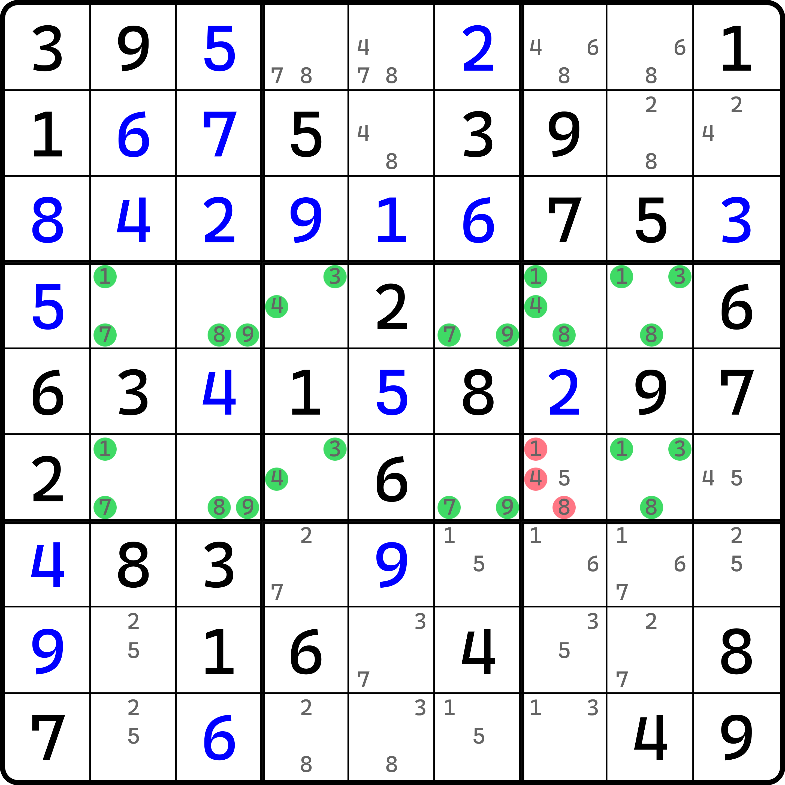<figcaption>
一个拓展矩形
</figcaption></figure>

如图所示。这是一个普通的拓展矩形，只是单纯规模有点大，一共用了 12 个单元格。

假设 `r6c7` 是 1、4、8 的其一，`r4c234678` 这六个单元格的填数都总是 1、3、4、7、8、9，而 `r6c234678` 里也是 1、3、4、7、8、9。因为 `r4` 和 `r6` 的这些格子形成了矩形形态，这意味着上下必然能找到对应的填充位置。比如 `r4c2` 和 `r6c2` 是一对，`r4c7` 和 `r6c7` 是一对。这么一对一对分类之后，整个结构就拆成了 6 对单元格。

这么配对是有意义的。因为每一对单元格都是上下对应关系，他们必然在同一个宫（或者说在同一个列）里。这意味着两个单元格肯定不可能填一样的数字。

假设上面的 `r4` 填入的数字分别是 $$a$$、$$b$$、$$c$$、$$d$$、$$e$$ 和 $$f$$，那么下面 `r6` 就是另外一种填法，如 $$a'$$、$$b'$$、$$c'$$、$$d'$$、$$e'$$ 和 $$f'$$。不管具体的数值是多少，我们总能把 $$a$$ 和 $$a'$$ 交换填数位置，$$b$$ 和 $$b'$$ 交换位置，如此操作将余下的都这么换一次，就能得到第二种填法。

因为仅仅是上下对应位置填数的交换，所以很容易我们可以知道，这个结构的每一列上出现的数字不会发生变动；而对于同一个宫里而言（比如这个题 3 个宫，每个宫都恰好 4 个格子），因为上下交换并不足以产生新填数，所以换了之后，宫内的四个数也都不会变动。所以，这符合致命结构的那种特征，置换后不影响盘面。

唯一解的题目是不允许这样的情况出现的，所以，这样的填法是矛盾的。因此，原始的假设 `r6c7` 就不能是 1、4、8 的其一；所以结论就是 `r6c7 <> 148`。

## 反转拓展矩形的基本推理 

下面我们来看它的反转版本。

<figure>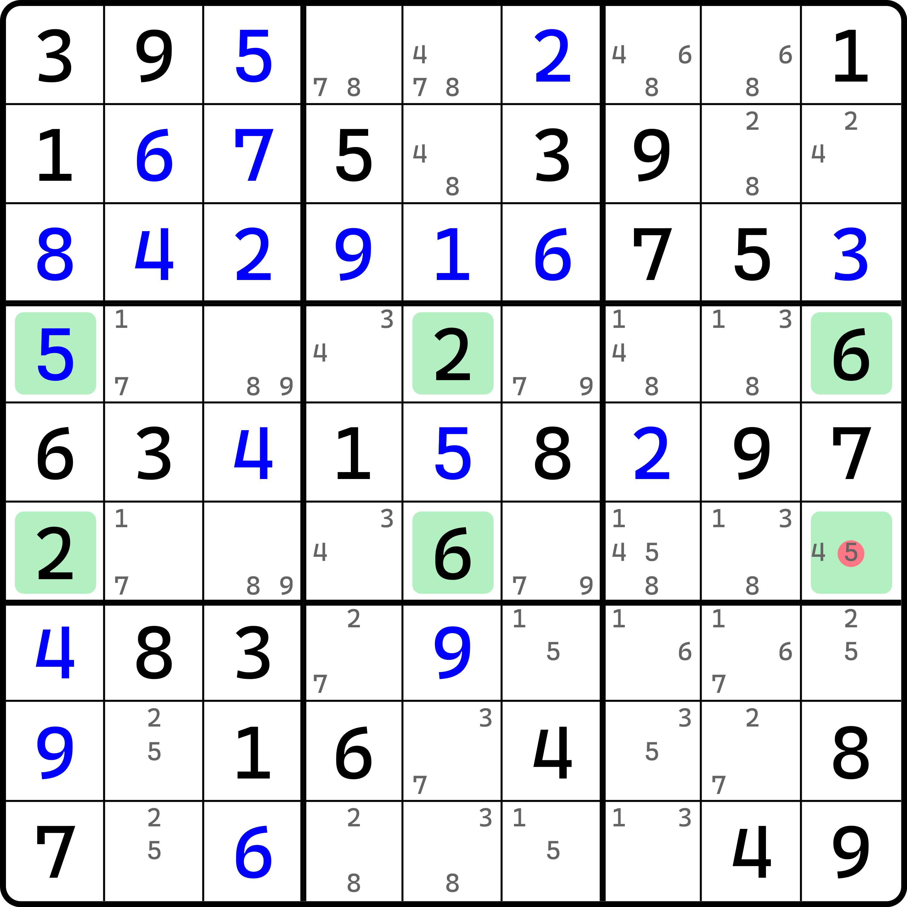<figcaption>
反转拓展矩形
</figcaption></figure>

如图所示。既然候选数数起来太费劲了，我们不如看明数版本。

可以看到，`r4` 里勾选出来的单元格正好是前面例子里没用的余下三个单元格，而 `r6` 也是。不过删数稍微发生了一点变化。其中，`r4` 固定的明数是 2、5、6，而 `r6` 的删数是 5，算上的话就也是 2、5、6。

这就是它的互补视角：**反转拓展矩形**（Reversed Extended Rectangle，简称 RXR）。它的推理过程非常朴素：假设 `r6c9` 填 5，则因为明数视角下，`r46` 出现的数全都一样，这也就意味着余下的空格里填数一样。而恰好，明数摆成了矩形的形式，这意味着不存在上下无法找到对应匹配的单元格，所以逻辑可以**规约**（Reduce）到使用普通拓展矩形的推理上去。于是致命结构的矛盾仍然可以形成。

> 所谓规约，就是将一个问题等价转化为另外一个问题进行解决的意思。比如这里就是将反转拓展矩形的逻辑改成用普通拓展矩形的逻辑去理解，就是一种规约的过程。

是的，它不存在所谓的自己的推理方式，而是采用了一种只提供视角，其背后的逻辑基于它的互补视角的这么一个做法。

## 规约简单的例子 

鉴于它的推理其实和普通拓展矩形完全一样，只是换个视角，所以我们直接来看一些使用例子。

### 例子 1：类型 1 

<figure>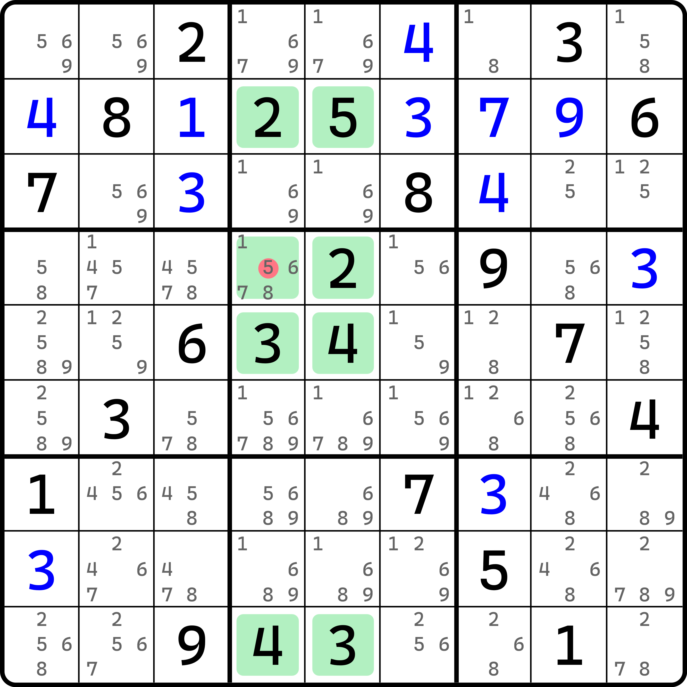<figcaption>
例子 1
</figcaption></figure>

如图所示。

### 例子 2：还是类型 1 

<figure>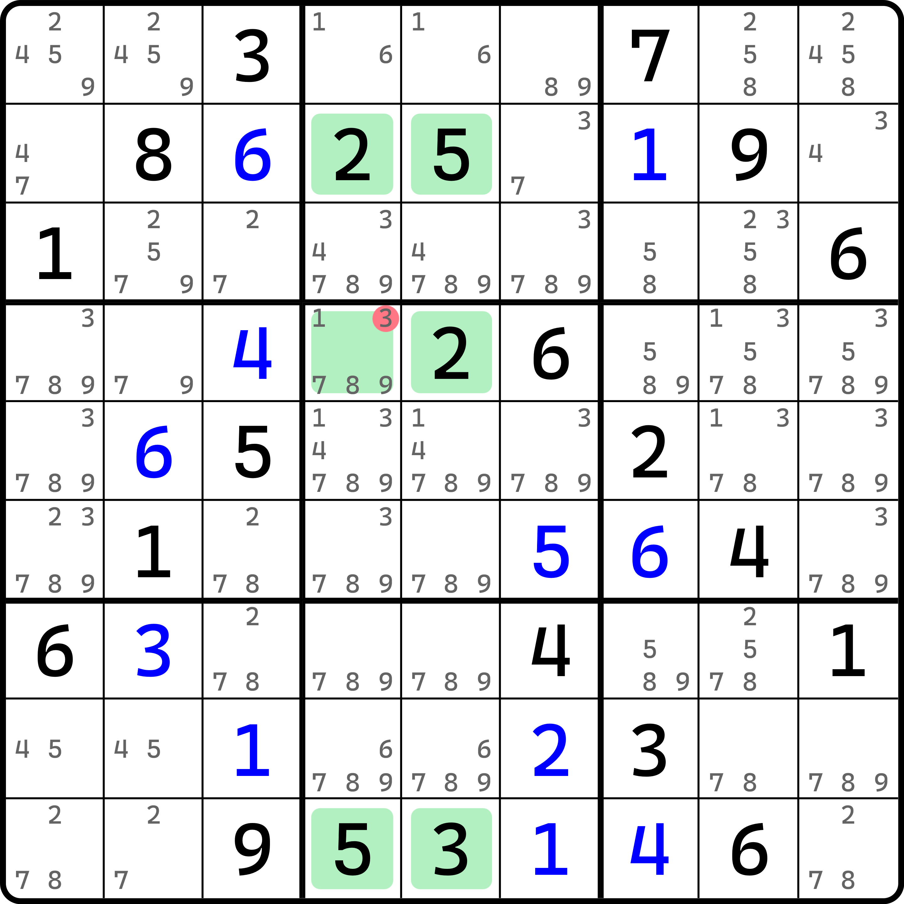<figcaption>
例子 2
</figcaption></figure>

如图所示。

请注意这个例子里，和其互补的拓展矩形结构其实是类型 2，而且删的数还是这个题里的 `r4c4(3)`。

### 例子 3：不是很有必要非得看反转视角

<figure>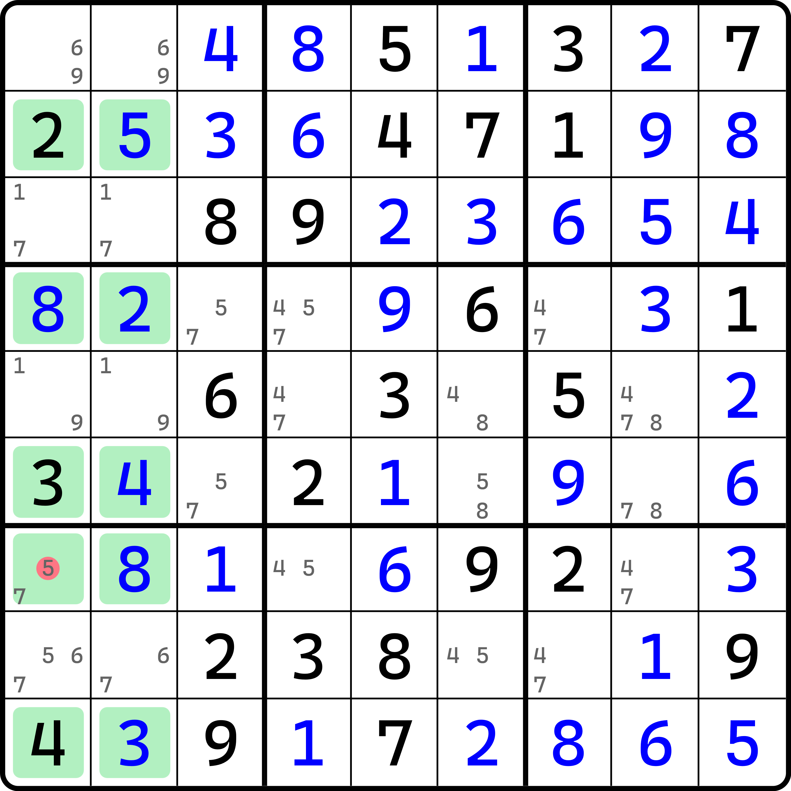<figcaption>
例子 3
</figcaption></figure>

如图所示。这个例子其实就不必看这个视角了，看拓展矩形规格其实会更小一些。这里只是故意使用此明数视角才画出来的。

## 规约复杂的例子 

前面的例子都比较简单。下面我们看一些比较抽象的反转拓展矩形的例子。

### 例子 1：类型 4，但规约时变动较大 

有些例子，在规约的时候会变得比较复杂，或者说推演过程和之前的例子已经不太一样了。

<figure>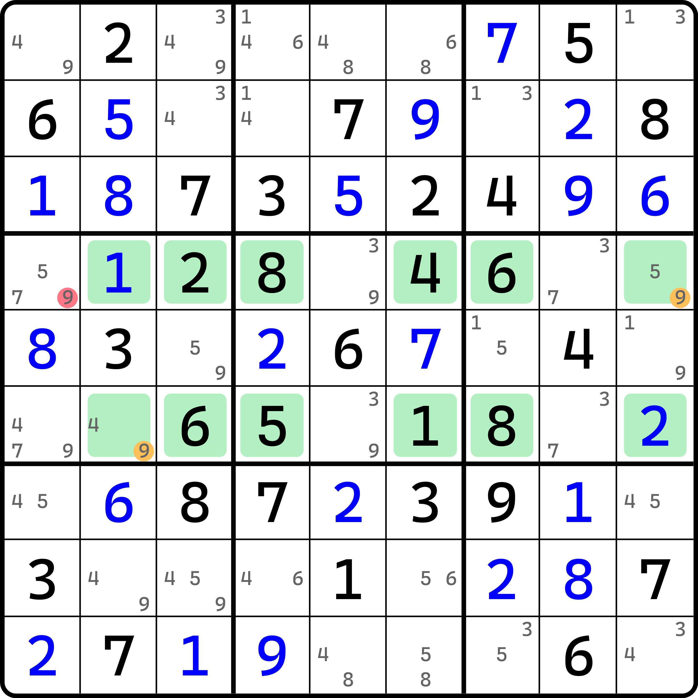<figcaption>
例子 1
</figcaption></figure>

如图所示。这是一个类型 4 的例子。它构造了一个 9 的强链关系，用于造成 `r4c1 <> 9` 的删数。这里叫共轭对有些不合适，因为共轭对是来自于染色逻辑的，里面只会用到同区域或同单元格的情况，但这里明显两个 9 跨区了（互相都看不见彼此）。不过问题不大，这只是个术语词罢了，懂意思就行。

总之就是，用了一个强链关系得到了删数。不过，这个题还能删 `r6c1 <> 9`。我知道这很难想到，因为两个 9 里，`r4c9(9)` 能造成的删数是到不了 `r6c1(9)` 来的。这里我们只能借用的是规约之后，普通拓展矩形类型 4 的共轭对来删它。

在 `c1` 有一个 7 的共轭对，如果 `r6c1 = 9`，那么数字 7 就会霸占 `r4c1` 的位置，于是结构会变为这样：

<figure>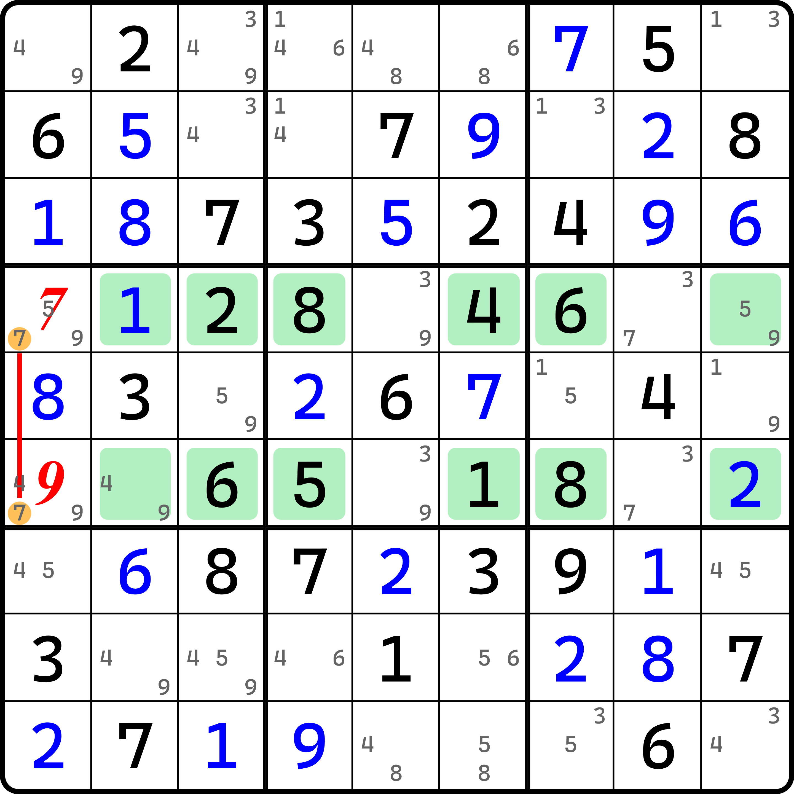<figcaption>
例子 1，共轭对之后的填数结果
</figcaption></figure>

现在，我们再看互补的普通拓展矩形结构，不难发现，`r46c158` 只有 3、7、9 了，这样造成了矛盾。

我知道这不如按普通拓展矩形去推理，但是这正是我想说的：有时候看明数视角，反而无法找到和互补的普通拓展矩形视角一样的删数。

### 例子 2：还是类型 4，但比较好规约 

<figure>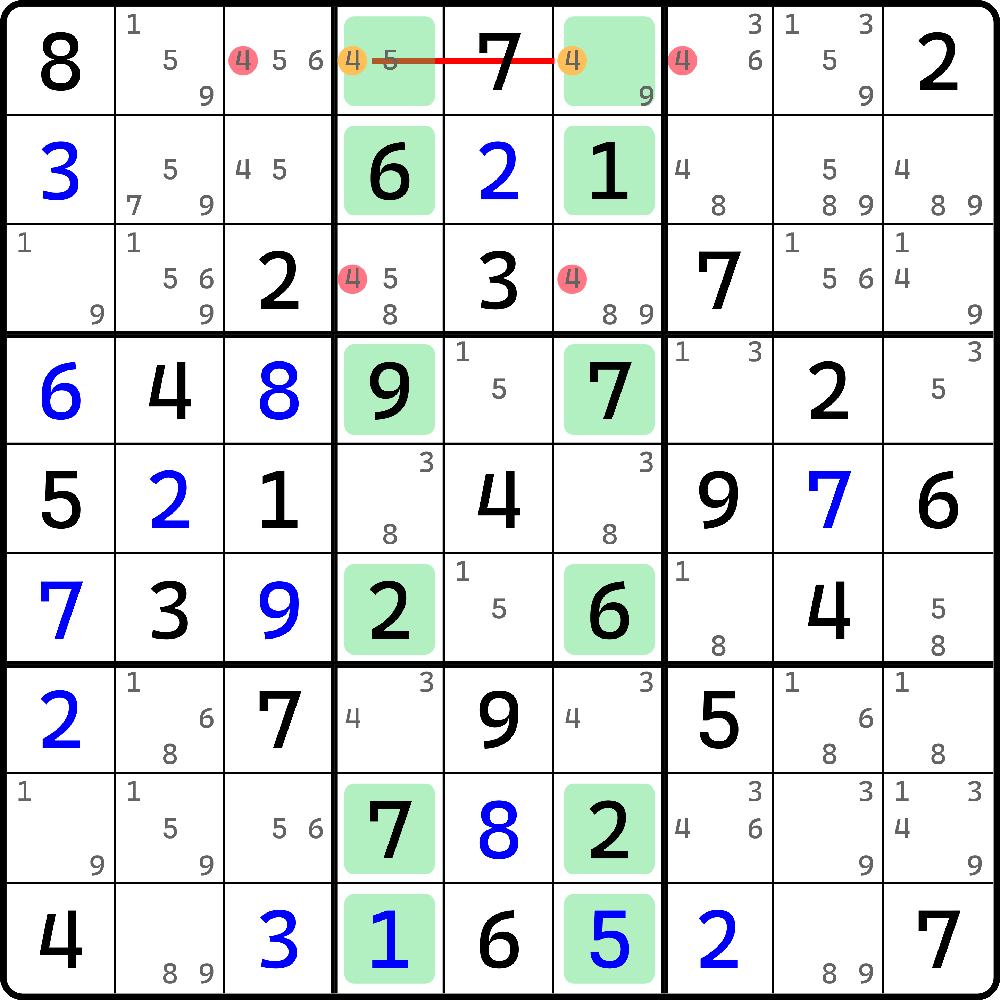<figcaption>
例子 2
</figcaption></figure>

如图所示。在这个例子里，我们发现，如果 `r1c46(4)` 同为假的话，`r1c46` 就只会留下 5 和 9，于是 `c46` 明数就都是 1、2、5、6、7、9 六种数字，且构成矩形的形态，左右可以交换的那种。这便构成了矛盾。所以结论就是 `r1c46(4)` 是区块，按区块删数。

### 例子 3：类型 3 

<figure>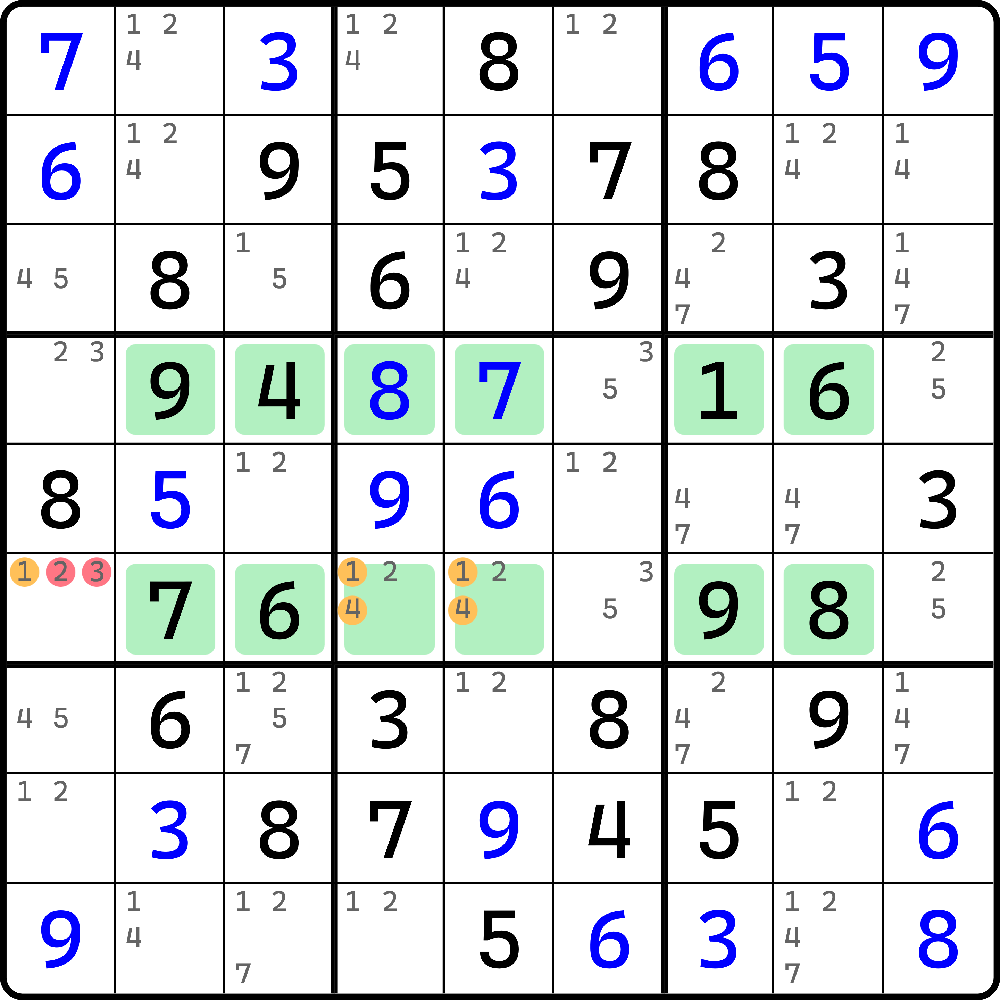<figcaption>
例子 3
</figcaption></figure>

如图所示。这是一个类型 3。可以看到 `r6` 里只有 `r6c145` 三个单元格可以填 1 和 4。假如 `r6c1` 不是 1，那么 `r6c45` 将构成隐性数对。这一旦构成，`r46c234578` 就会只有 1、4、6、7、8、9 六种数字，于是构成反转拓展矩形的矛盾。

但是可以看到，这个题使用普通拓展矩形的视角，它其实是类型 1，而不是类型 3。这个问题其实出现在 `r6c45` 上。一般而言，互补视角肯定是将整个行和列里的没有用到的格子全部取出来；但是在拓展矩形里，很多时候都反转之后，部分格子还是空的。这在数组这种技巧里其实无伤大雅，但在必须使用明数的反转拓展矩形里，这个问题会被放大：因为我们没有办法固定空格的填数，于是造成上下成对出现的逻辑更加难以得到。

显然这个例子就是其中一个。1 和 4 的具体填法无关紧要，我们只需要用到的结论是，1 和 4 一定要落在 `r6c45` 里，目的是为了造成两点特征：

1. 必须有上下对应可置换的形态，即矩形的形态；
2. 上下两个部分都是一样的数字序列。

这便是反转的时候带来的问题。

### 例子 4：不知道是什么类型 

最后我们再来看一个例子。

<figure>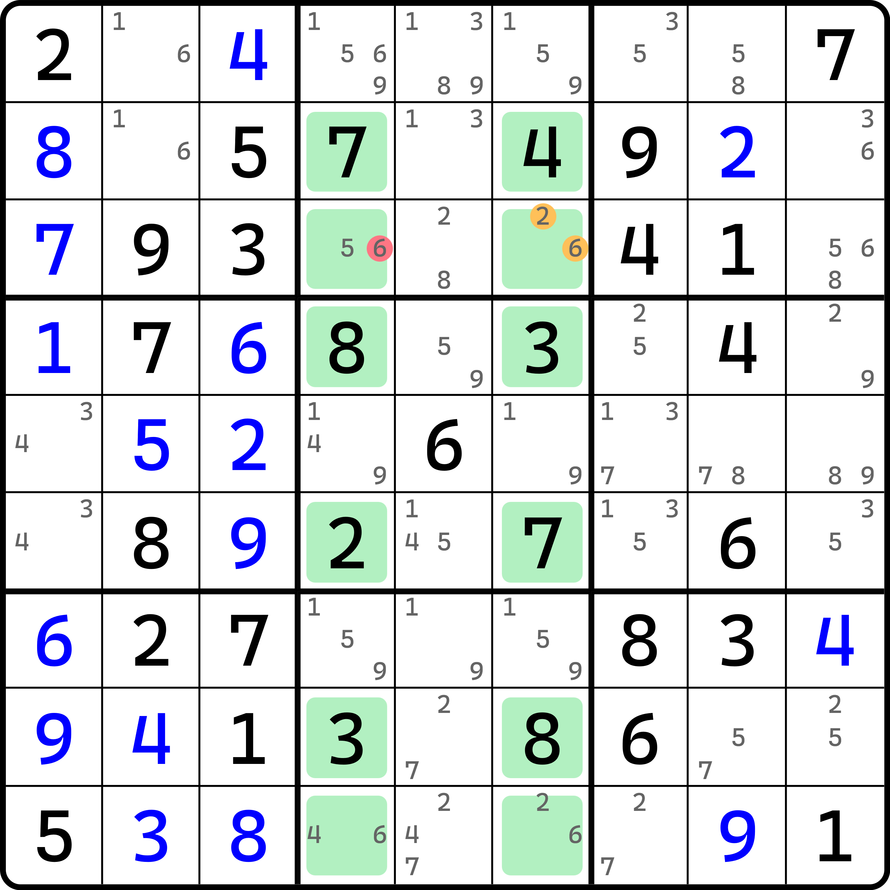<figcaption>
例子 4
</figcaption></figure>

如图所示。这个例子我圈出了 `r3c6` 的两个候选数。这个涂色并非瞎涂，因为这两个数都可以用弱链关系删除掉 `r3c4(6)`，尤其是这里的 `r3c6(2)`。

这其实是因为 `r3c6(2)` 和 `r3c4(6)` 同真之后，`r3c46` 的填数就固定为 2 和 6 了。对于左边这一列，`r3c4 = 6` 会造成 `r9c4 = 4`；而 `r3c6 = 2` 之后会造成 `r9c6 = 6`，于是变为了这样：

<figure>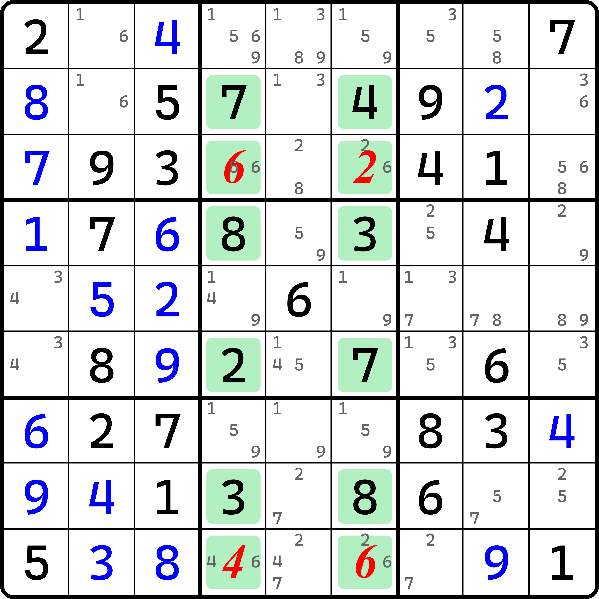<figcaption>
例子 4，造成矛盾的点
</figcaption></figure>

如图所示。显然左边一列和右边一列都是 2、3、4、6、7、8，所以就矛盾了。
