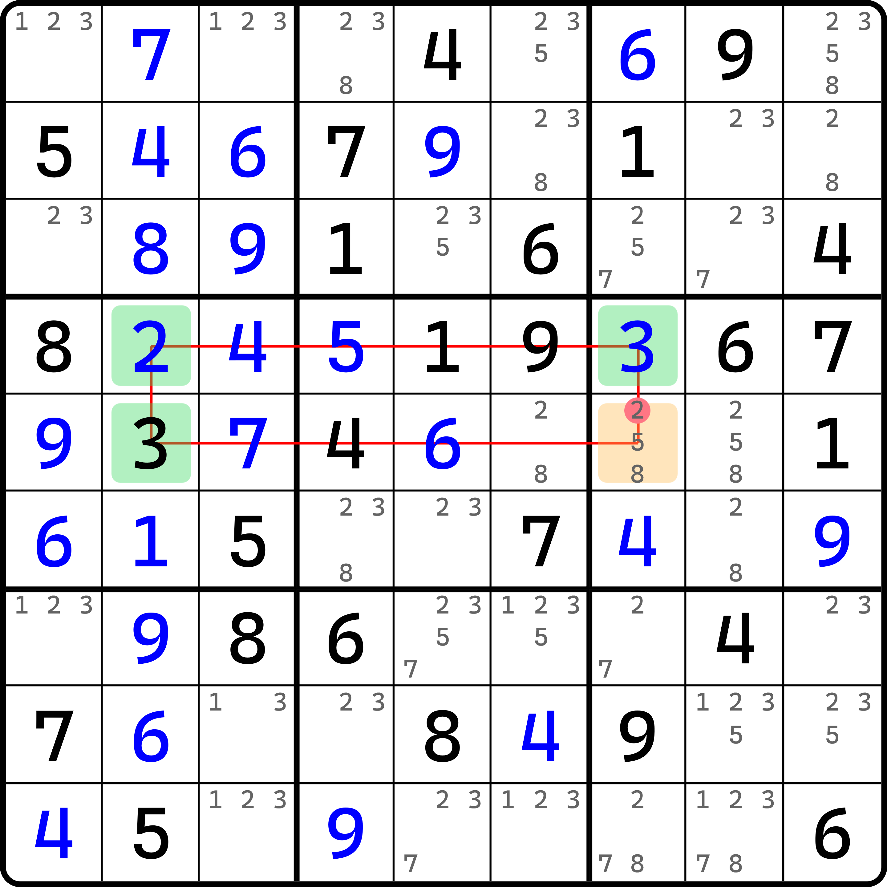
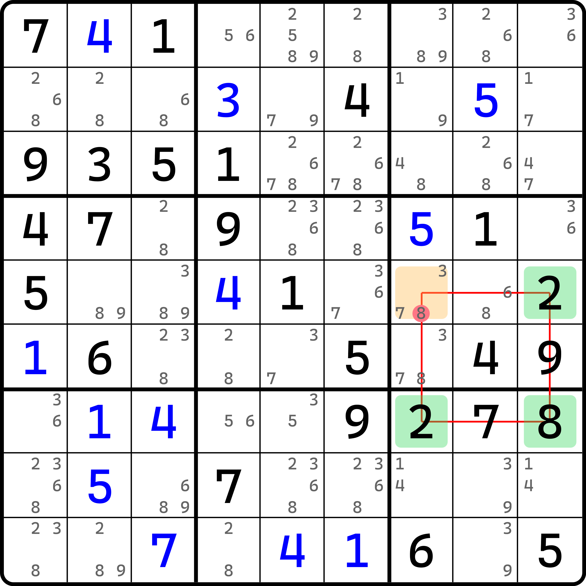
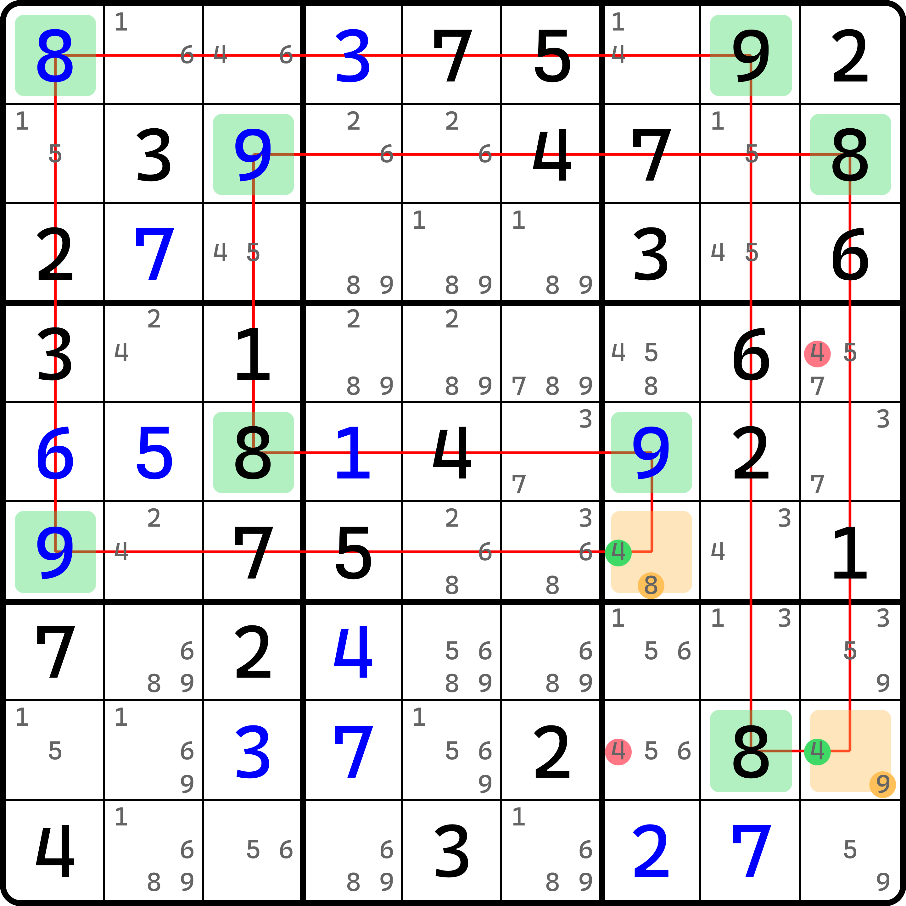
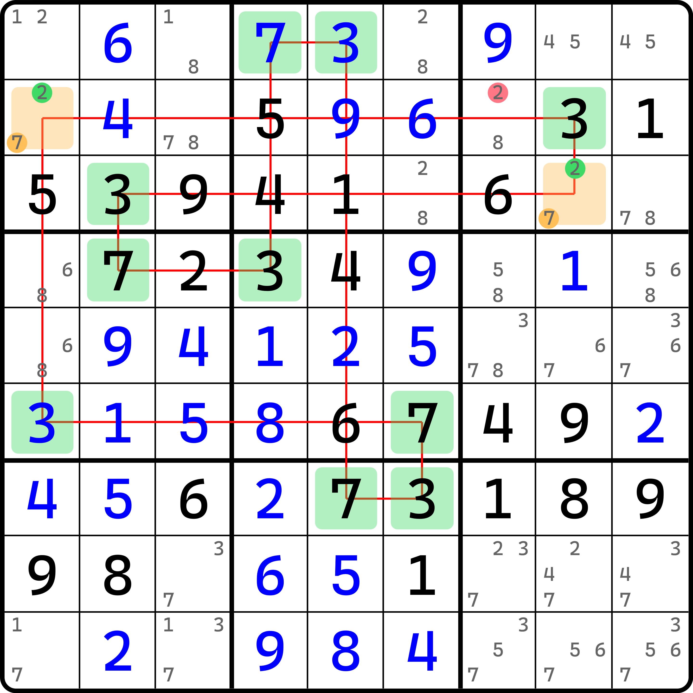
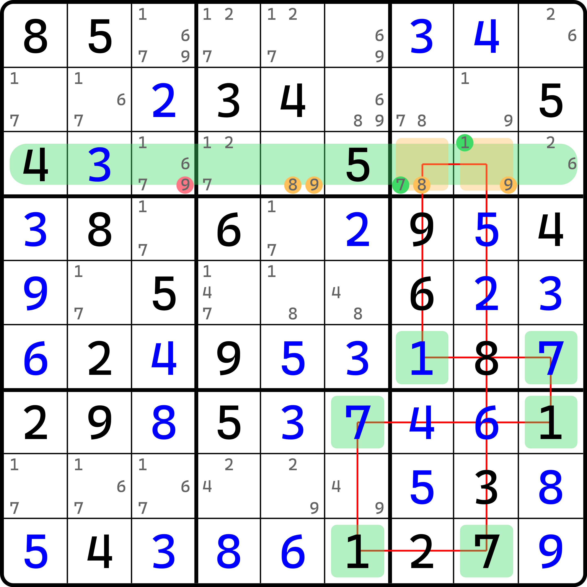
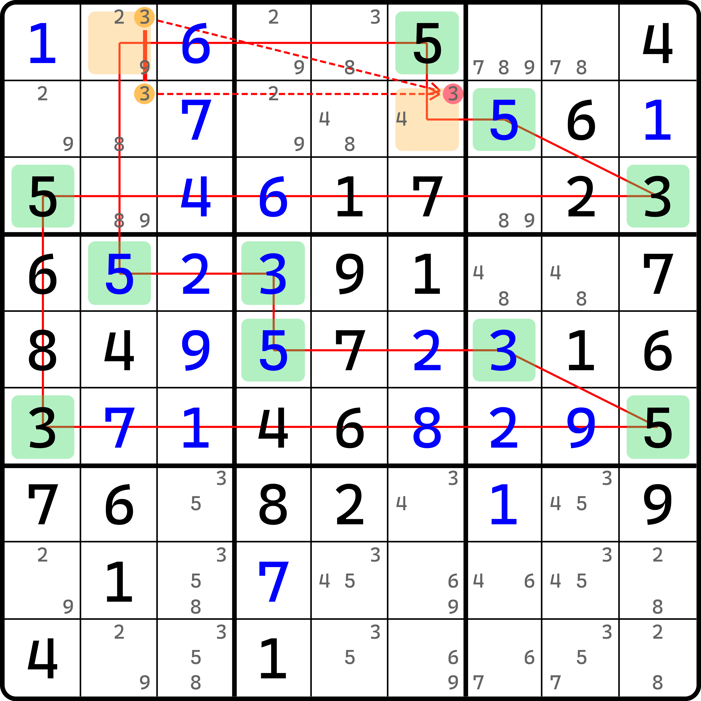
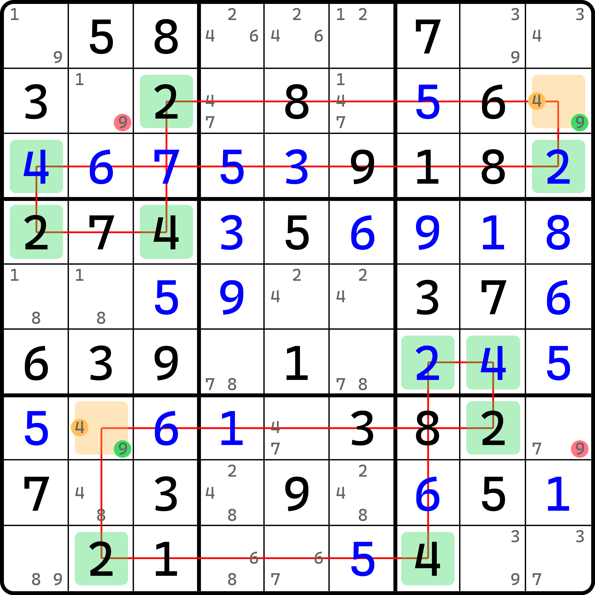
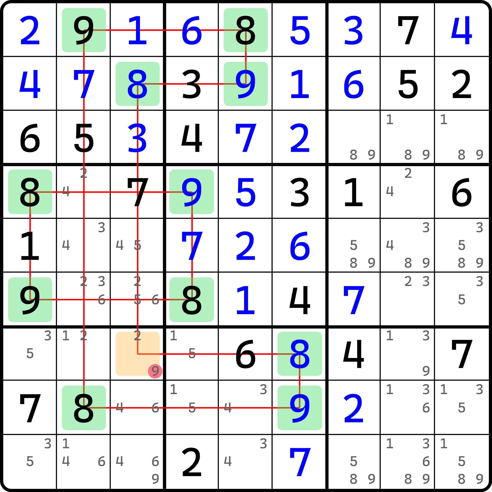
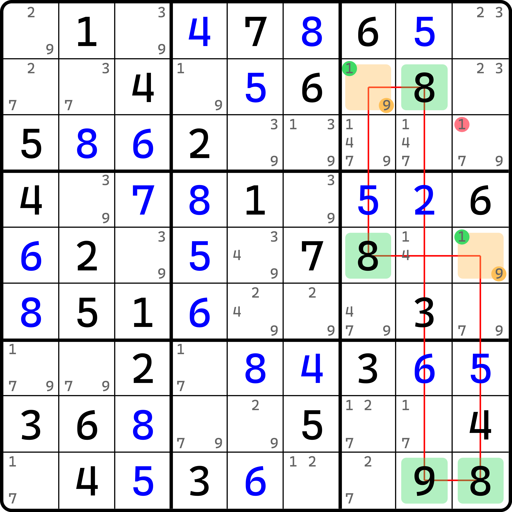

# 反转唯一矩形和反转唯一环

反转致命结构除了前面说到的反转拓展矩形外，还有一种唯一矩形和唯一环的反转版本。

在之前的内容里，我们是先讲的唯一矩形和唯一环，然后才是拓展矩形；但是在这里我们却先说了反转拓展矩形，反而把反转唯一矩形和反转唯一环放在了后面。这是因为这两个技巧的思路稍微麻烦一些。

## 从反转唯一矩形切入 

<figure><figcaption>
反转唯一矩形
</figcaption></figure>

如图所示。之前我们在使用反转拓展矩形的时候是看的整个完整两个行列，去找所有明数的格子。这次我们用唯一矩形和唯一环的反转思路，只针对于某两种数字而言，去看它的分布。

可以看到，这个题里所有的明数数字 2 和 3 一共就三个，即图中的绿色单元格。我们当然知道，数字 2 和 3 并未填完，填完的状态是，这个题目里会出现 9 个 2 和 9 个 3。但是这都不重要。

我们这么思考这个问题：倘若我们让 `r5c7 = 2` 会发生什么。如果 `r5c7` 填入了 2，那么 2 和 3 在全盘里所有明数的出现位置就会必然构成一个循环状态，这和唯一矩形非常相似，只是单纯的明数版本，还构不成唯一矩形的矛盾状态，只是结构的摆放的位置符合唯一矩形的要求而已。

但是，如果我们填了 2 之后，我们当然知道余下还要填 7 个 2 和 7 个 3，但这有一个问题。唯一矩形的形状暗示了结构只能影响到它出现的两个行、两个列和两个宫（构成数对），除此之外别无任何地方会有影响。

如果你还没有反应过来这意味着什么，那请思考一下唯一解的题目的特征。是的，唯一解意味着每个空位的填数一定是唯一确定的那一个数字。如果只有 7 种数字在题目上存在，那么这 7 种数字对于这道唯一解的题目而言是确定的填数位置，那么盘面上肯定还剩下 18 个空位留待填入最后两种盘面没有出现过的数字。为啥是 18？每个行列宫要填这两种数字，一个数独盘面有 9 个行列宫，所以是 18。

但是，这 18 个单元格而言其实是没有任何“区分度”的。或者说，你无法以任何形式找出一个原因，使得这 18 个单元格里任意一个单元格，必须填这个数而不是另外那个数的理由，这样的理由你是找不出来的。我能选出其 9 个单元格全填 $$a$$，另外 9 个单元格全填 $$b$$；那么我们就可以让前面这 9 个单元格全填 $$b$$，另外 9 个单元格全填 $$a$$。所以，光看 $$a$$ 和 $$b$$ 而言，其实就已经有置换的感觉了，这肯定是不可能在唯一解题里所允许的，所以这和题目唯一解相矛盾。

所以，这个初始假设 `r5c7` 填 2 就是错的，否则会造成 2 和 3 无法在盘面上形成任何的区分。所以，这个题的结论就是 `r5c7 <> 2`。

我们把这个技巧称为**反转唯一矩形**（Reversed Unique Rectangle，简称 RUR）。可以看出，它看似是利用了盘面所有某两种数字的明数，但实际是利用这两种数字在余下可填位置的排列是可交换的特征来得到矛盾的。是一个非常巧妙的思路。

## 为什么“7”不能推出“2”？ 

可能你意识到了一个我们并未细致说明的点，这个口头证明其实不算严谨。那就是我们凭什么可以理所应当认为盘面的提示数影响不到余下两种未出现的数字。或者说得更通俗一些，我们凭什么就可以认为这 7 种有提示信息的数字就不能影响到余下两种数字的位置，进而让余下两种数字的填数位置也能唯一确定呢？

这个问题我相信你当然知道这是不存在的，但是一时半会儿找不到说辞来论证这一点。下面我们就来阐述这一点的本质原因。不过上面的例子是有两个 2 和两个 3 的明数的，为了论证余下的空格无法出数，我们把这个问题简化为“一个题目只有 7 种提示数出现，那么这个题就一定不可能是唯一解的题目”。下面我们针对这个问题进行论证。

### 数独技巧 ≠ 魔法 

我们目前学到的所有数独技巧，不论是排除唯余这样的简单直观技巧，还是链、网、秩理论等复杂推演理论，他们的底层不外乎就是把提示信息（不是提示数，是候选数或候选数集合所构成的一组信息）进行互相传播。

所谓“传播”，就是说，你只能依靠有效的信息进行下一步的结论推演。我们数独技巧都是强制让各位用 100% 正确而严谨的逻辑得到下一步的结论的过程，这中间不存在任何的猜测。真有猜测也只是初始的假设，并使用反证法得到矛盾，从逻辑推演的角度，它仍然是一种 100% 正确的推理过程。我们使用的数独的推演过程，其本质都是在利用反证法（假设某单元格填/不填这个数，会造成矛盾，所以它必须不填/填这个数），而反证法本身只会决定自身的填数结论的真假性，而不会有任何信息的推广。

但是，这样的推演过程都只是会在盘面上有效的信息范围内进行传播，对于无法区分的上述两种未出现过的数字而言是不可能的——因为没有提示信息，你无法把任何有效信息传播到它俩的相关上面去。你能做的，只有一步一步地固定一些空格的填数，而对于唯一解的题目而言，从上帝视角来看，所有格子的填数都是确定的，那么你能做的，只能是一步一步把没填的空格里被“隐去”的数字给“复原”出来，我们只是做了这么个事情。而对于那两种数而言，你没有任何的信息去“复原”他们。数独技巧并非魔法——因为这两种数字从题目开始就没给过任何的提示信息。

### 两个未出现的数字是完美对称的 

这两种未出现的数字因为无法被“复原”，所以我们填入其中任意一个数字，那么理应换成另外那个也没有任何错。我们可以说，这两个数字现在是符合某种对称性的。当然，不同于形状的对称性，它是一种抽象的概念，意味着这两种数字置换之后效果一样。

如果真有那么一种数独技巧可以得到其中某一个数是没办法填的，那凭什么就不能得到另外一个数没办法填呢？假设得到了 $$\neq a$$ 的结论，那我说它 $$\neq b$$ 似乎也可以吧。

### 所以呢？ 

所以，因为证明的结论是得到自身的真假性的确定结果，所以它肯定不会把结论传播到一个完全没有任何提示信息的地方上去；从另一个角度而言，你也根本不可能从一个是这两种未出现数字的候选数的其一进行推演还能得到有效结论的情况，因为这两种没出现过的数字自身是对称的，能填它就一定也能填另外那个数。

### 回到原来的那个题上 

我们知晓，数字在没有任何提示信息的状态下是可以进行交换的。但是，原本的题目里是有两个 2 和两个 3 的。

其实，这并不重要。因为它构成的形状恰好满足唯一矩形的摆放形式。唯一矩形在论证矛盾期间，刚好利用了这样的特殊摆放模式，才会有后面不影响盘面其他空格的推论，才会有后续的逻辑推演，才会得到矛盾。它是必不可少的一环；对于这个技巧而言，只要我们能让数字的明数摆放不去影响到余下的空位，使之形成和前文说的这样“对称”的状态，那么这个技巧就可以正常使用。

## 一些例子 

我们来看一些例子。

### 例子 1：反转唯一矩形类型 1 

<figure><figcaption>
例子 1
</figcaption></figure>

如图所示。这个例子里，数字 2 和 8 全盘只有这三个明数。算上 `r5c7` 之后结构形成唯一矩形的摆放模式。于是删除 `r5c7(8)`。

### 例子 2：反转唯一环类型 2 

<figure><figcaption>
例子 2
</figcaption></figure>

如图所示。这是一个唯一环。别看它规模很大（10 个单元格），但是因为我们知道唯一环的分布模式是唯一矩形的推广，所以规格再大，只要符合唯一环特征，随便它长啥样都可以轻松分辨。

这个题里，我们要用的是类型 2。可以看到 `r6c7` 和 `r8c9` 都有候选数 4。如果这两个 4 都为假的话，那两个单元格会变为唯一余数，于是所有盘面上的 8 和 9 的明数配合这两个单元格的填数 8 和 9 将会构成一个完整的唯一环循环状态，于是就违背了唯一解的矛盾（数字 8 和 9 在余下空格里无法区分开来）。所以，这两个 4 必须有至少一个为真。所以这个题的结论就是 `{r4c9, r8c7} <> 4`。

我们把这个技巧就称为**反转唯一环**（Reversed Unique Loop，简称 RUL）。

### 例子 3：反转唯一环类型 2 

<figure><figcaption>
例子 3
</figcaption></figure>

或许你看得不过瘾，我们再看一个反转唯一环。推理过程就省略了，和前面的完全一样。

### 例子 4：反转唯一环类型 3 

<figure><figcaption>
例子 4
</figcaption></figure>

如图所示。这是类型 3。

如果我们让 `r3c78` 里只有 1 和 7 的话，那么显然 1 和 7 在全盘所有明数的位置，配合 `r3c89` 就会构成唯一环的摆放模式，于是会造成矛盾。

但是，显然 `r3c89` 又不会出现都填 8 和 9 的情况（否则 `r3c5` 没办法填数），所以只能 `r3c89` 里拿一个格子填 8 或 9，然后和 `r3c5` 配合在一起形成待定显性数对，得到 `r3c3 <> 9` 的结论。

### 例子 5：反转唯一环类型 4 

<figure><figcaption>
例子 5
</figcaption></figure>

如图所示。这是类型 4，别看画得有点复杂，但实际上还是算简单的。

首先，`r12c2` 里 3 形成了共轭对。对于 `r1c2` 而言，`r1c2 = 3` 也可以让 `r2c6(3)` 为假。这是因为这两个单元格都在唯一环摆放的范畴里。如果它俩同 3，就会让全盘所有明数 3 和 5，以及这两个单元格整体构成一个唯一环摆放的模式，于是会矛盾。所以，`r1c2 = 3` 的时候是不能有 `r2c6 = 3` 的；与此同时，`r2c2 = 3` 直接可以排除 `r2c6(3)`。所以，不论 `c2` 里 3 填在哪里，`r2c6` 都不能填 3。所以这个题的结论就是 `r2c6 <> 3`。

## 分离状态 

在反转唯一矩形和反转唯一环里，因为结构是取出全部明数的摆放，配合若干空格形成结论，所以它会出现一些和普通唯一矩形和唯一环不一样的分布特征——分离的状态。

### 例子 1：两个分离的唯一环 

<figure><figcaption>
例子 1
</figcaption></figure>

如图所示，这个例子里有两个唯一环。但说是两个，但实际上我们是整体把全部明数 2 和 4 都取出之后的结果。

它的理解方式是这样的：若干让 `r2c9` 和 `r7c2` 同时都不填 9，那么这两个格子就只能填 4，融入到结构里就会构成两个唯一环的摆放模式。虽然是分离的、独立的两个唯一环，但是因为他们使用的行、列、宫互相都不影响彼此，所以不管你分开看还是合一起看，我们都能说它能造成余下空格的 2 和 4 无法区分填数情况。所以这照样可以造成矛盾。所以，结论就是 `{r2c1, r7c9} <> 9`。

我们再来看一些例子。

### 例子 2：唯一矩形 + 唯一环 

<figure><figcaption>
例子 2
</figcaption></figure>

如图所示。把盘面的全部明数 8 和 9 提出来之后会变为一个分离的唯一矩形和一个唯一环。删除 `r7c3(9)`。

## 填入数可视为空格 

不知道你还能不能回忆起可规避矩形的知识点。可规避矩形能删数的本质原因在于，即使有填入数（自己填的数），它也可以被视为是空格参与唯一矩形的使用和推演，其本质原因在于，填入数自身不是题目初始所给的数字信息，所以只要题目没有解完，这个填入数都可以被当成是一个唯一余数的空白单元格状态。而空白单元格又可以在唯一矩形里等价看成是“填了一个数，另外一个数就可以换过来，使结构形成可交换状态”。

是的，这一点实际也可以在反转唯一环里出现，不过这一个特征不是用于结构的环路，而是用来找一些特殊情况。比如下面这个例子。

<figure><figcaption>
左侧的 6 个宫的 8 全都是填入数
</figcaption></figure>

如图所示。这个例子里，我们用到的是右边 `b369` 里的 8 和 9。但是我们刚才最开始就说了，这个结构必须强制我们找出全部明数 8 和 9，所以左边 6 个宫都有 8 的明数，这个结构仍然可以确保使用，这是为什么呢？

原因在于，这左边 6 个宫里的所有 8，都是以填入数的形式存在的。填入数等于说它是以唯一余数的形式存在在空格里的。如果你取出右边的 8 和 9 参与推演的话，假设我们使得此时 `r2c7` 和 `r5c9` 都只有 9 了，于是形成了唯一环的模式，但是余下的位置 8 和 9 的分布我们其实仍不清楚。虽然我们知道 8 已经都填上了，但是它始终是我们自己填上的，这意味着，你要继续推演的话，你完全可以把这些填入数 8 改成空格，然后把他们都换成 9，然后这几个宫里余下的带候选数 9 的空格我都改成带候选数 8，那我也可以说它是对的。所以这些数并不会影响到推演的本质。我们的本质是得到 8 和 9 在余下盘面里无法区分，即所谓的“对称性”。所以，它照样是可以形成矛盾的。
