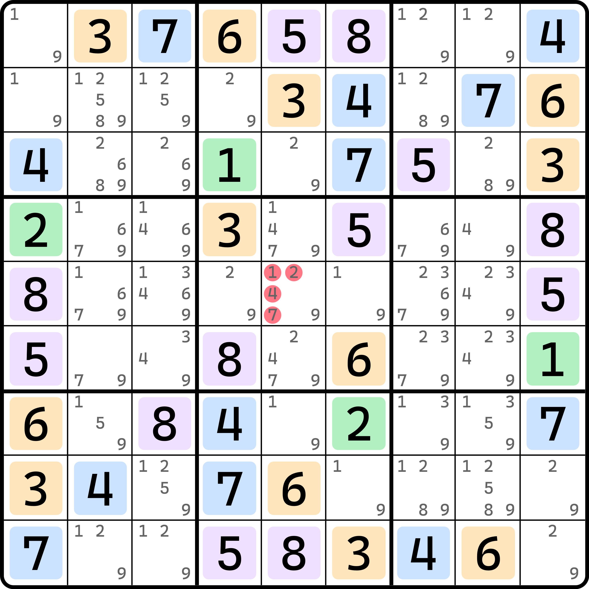
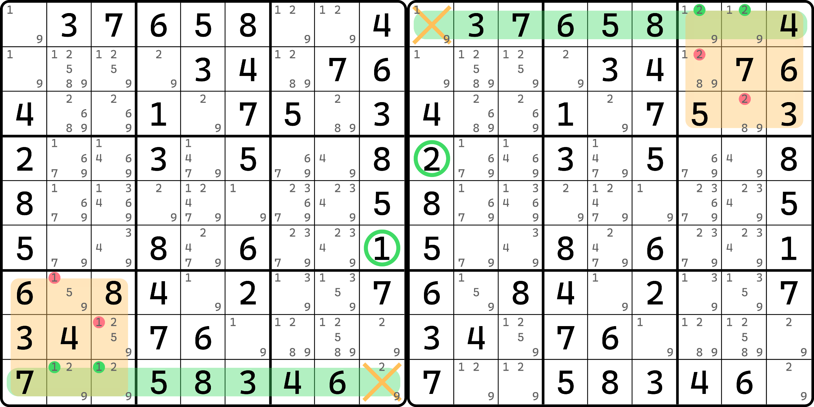
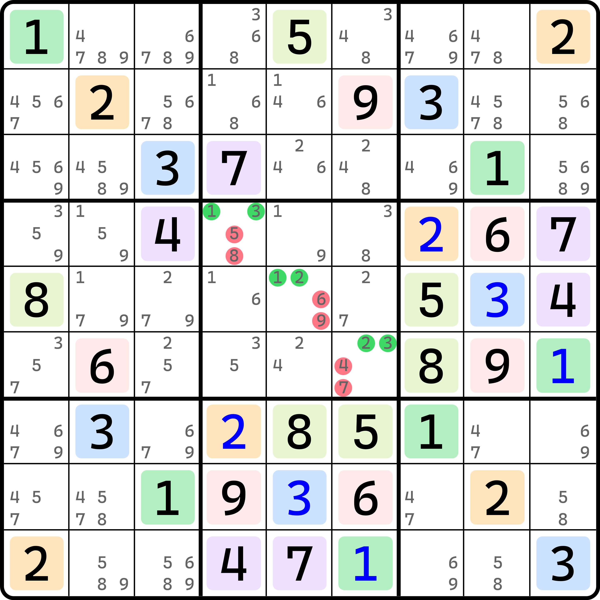

# 宇宙法的基本推理

## 中心对称 

<figure><figcaption>
中心对称
</figcaption></figure>

如图所示。请观察本题目里&#x7684;_&#x6240;&#x6709;_&#x660E;数。注意，是看所有明数，一个也别漏掉。

我们把数字分为这么几种配色：

* 绿色 1 和 2；
* 橙色 3 和 6；
* 蓝色 4 和 7；
* 紫色 5 和 8。

还有一个数字 9 并未在其中列举，这是因为这个题里没有数字 9 的明数。

我们针对于每一个配色都仔细观察，不难发现，因为每一个配色里都包含两种不同的数字，而且所有这种数字全部都涂的是跟这个分组一样的颜色（就是说，比如数字 2 是绿色，那么全部的 2 就都是绿色，不存在只有一部分的 2 是绿色，一部分是别的颜色的情况）。而且，每个提示数 $$a$$，和它呈中心对称分布的另外一个单元格，一定是所对应分组下的另外一个数 $$a'$$。比如说绿色的分组是 1 和 2，所有的 1 的中心对称位置上都是 2；而所有 2 的中心对称的位置也都是 1。

这个题目出得非常巧妙。那么我们继续思考下去的话，不难发现，`r5c5` 是整个盘面里唯一一个不符合中心对称的点位，或者说，它中心对称的另外一个单元格是它自己，这是盘面里唯一一个满足此特征的单元格。

由于本题里，所有数字均处于中心对称的分布，那么我们稍微利用一下上帝视角。对于这个题目的答案而言（当然，答案是唯一解的），我们自然可以知道的是，所有结果上填 1 的位置，其中心对称的另外一个单元格肯定填的是 2；反之亦然。为什么？因为我们之前说过，数独技巧的结论均是通过我们场上已知的信息进行推理，它只会产生通过已知信息排列组合而产生的结论，而不会创造出完全独立于现有信息的特殊结论。而场上的数字均是全盘符合对称性的，所以我们能找到任意一个数独技巧，和其中心对称的另外一边，其结构也会随着此对称性进行旋转而产生另外一个。比如说，这个题如果按纯数独技巧去做的话，你会发现有区块、数组等技巧并未删数。比如区块：

<figure><figcaption>
本题里的区块技巧（中心对称也会分布一个）
</figcaption></figure>

比如说，由于 1 和 2 是中心对称分布的，所以，一旦你能找到 1 的区块，那么其中心对称的位置上必然会出现另外一个。因为 1 和 2 对称，所以 1 的区块自然中心对称的另一边就是 2 的区块；其他数独技巧也均同理。这便是我刚才说到的，“因为盘面所有提示信息均以对称形式分布，所以你能找到的任何一个数独技巧，与之中心对称的另一边也会存在完全独立的另外一个同样的数独技巧”——因为明数均是中心对称的分布，所以候选数层面也都是中心对称的分布；既然候选数都是中心对称分布的，那么自然由这些候选数所构建的技巧也都必须是中心对称分布的。

那么，这种对称性是全盘体现的，也就意味着每一个空格都必须符合对称性填入完全对称的数值。比如如果 `r1c1` 填 1，那么 `r9c9` 就必须填 2，以保持这种对称性不会被破坏。那么，`r5c5` 这个单元格不难知道的是，它必须填的是 9，因为它是唯一一个盘面无法有和其对称的另外一个单元格的单元格。

为了守护这种对称性，数字 9 的填数就必须也得符合对称性。我们可以想到的唯一一种情况是，将 1 到 8 这几种可以中心对称的数字均填完后，剩下的 9 个单元格一定符合中心对称的状态。比如说，如果 `r2c2` 填的是 9，那么 `r8c8` 也得是 9，才能不破坏这种对称性。那么 `r5c5` 呢？它自然也得填 9。否则，填任何一个不是 9 的数，都会因为与之匹配的分组里的另一个数无法填入而破坏对称性，造成题目无法解出。所以，这个题的结论就是 `r5c5 <> 1247`。

我们把这种利用对称性做题的技巧称为**宇宙法**（Gurth's Symmetrical Placement，简称 GSP）。最早是来自于一个网友发布的帖子：



在第二页里，一位叫 Gurth 的网友解答了此题的推演过程，并率先给出了对此逻辑的完整解释：



为了纪念，此技巧使用 Gurth 命名。中文名这边则是由邱言哲本人独立发现并命名。据他本人所说，当初取名为宇宙法是因为宇宙代表的是全部的意思，而这个对称性正是基于全盘明数 + 候选数呈现出来的效果。

## 对角线对称 

前文的例子里，因为中心对称只有一个单元格，所以显然可以得到分配的最后一种数字，所以结论也可以写成 `r5c5 = 9`。但是，宇宙法的通用结论并非直接出数，因为宇宙法不一定非得是中心对称的。下面我们来看一种按对角线对称的情况。

<figure><figcaption>
对角线对称
</figcaption></figure>

如图所示。此题里 4 和 7 一组，5 和 8 一组，6 和 9 一组，余下三种数字 1、2 和 3 都没有分配分组，自己独立成组。

这是怎么看的呢？也是一样的。不论自成一组，还是和另外一个数构成一对成组的情况，他们均按捺对角线（正对角线）对称，即从左上到右下的这条对角线。

> 顺带一提，为了方便表达，尽量少地提及数学相关的说法，本教程采用民间说法“撇对角线”和“捺对角线”表示对角线的方向，而不采用正对角线和反对角线的说法。撇捺来自汉字的笔画书写，你只需要回忆笔画书写的方向就可以想起对角线的方向。

和之前不同的是，对角线包含 9 个单元格，中心对称只需要考虑 1 个单元格即可。但是说是区别，实际上也只是把对称的点位从 1 变为了 9 罢了。那么，既然 1、2、3 是按对角线对称分布且不成组的话，那么分配到对角线上的余下的三个空格 `r4c4`、`r5c5` 和 `r6c6` 就必须是 1、2、3 里面的数。不管他们三个单元格里填的 1、2、3 是否有重复数字，但总归要填的是他们才能守护这种对称性。所以，本题的结论就是 `r4c4 <> 58`、`r5c5 <> 69` 和 `r6c6 <> 47`，一共 6 个删数。
