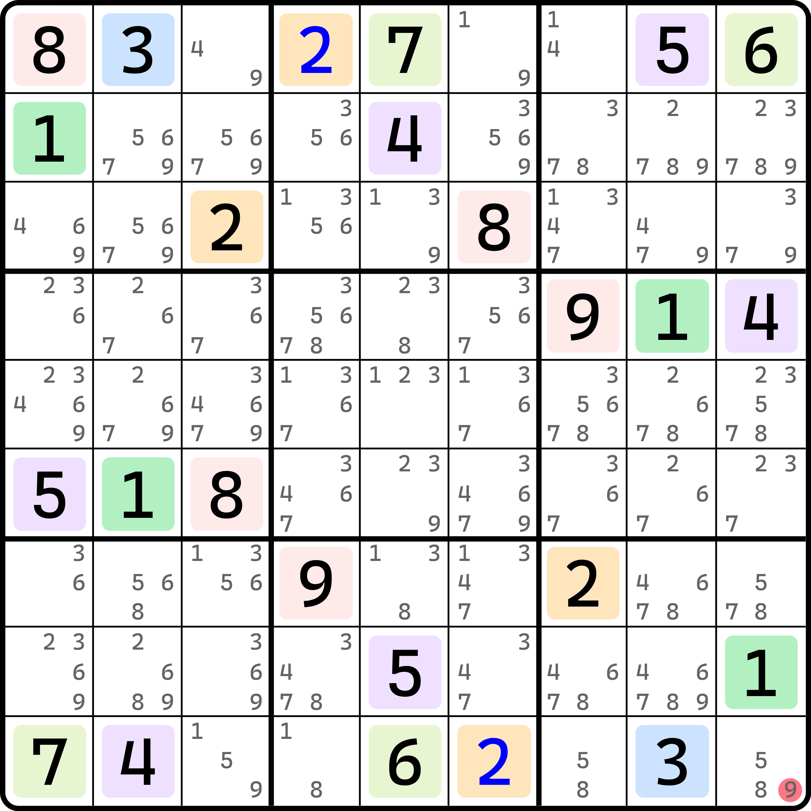
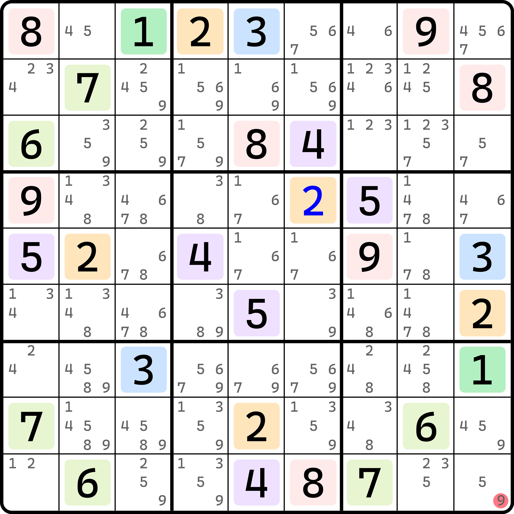
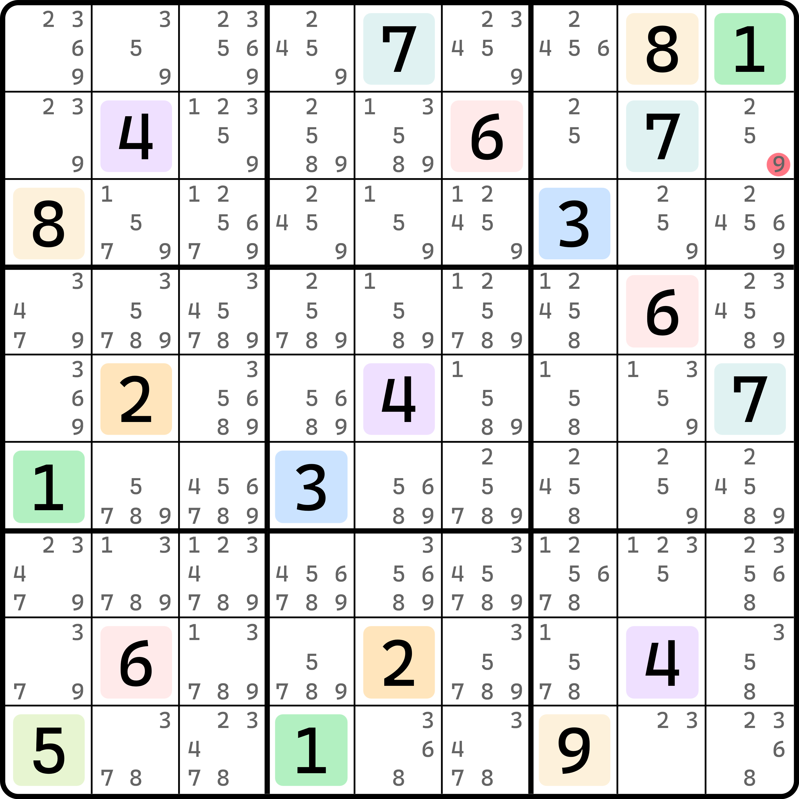
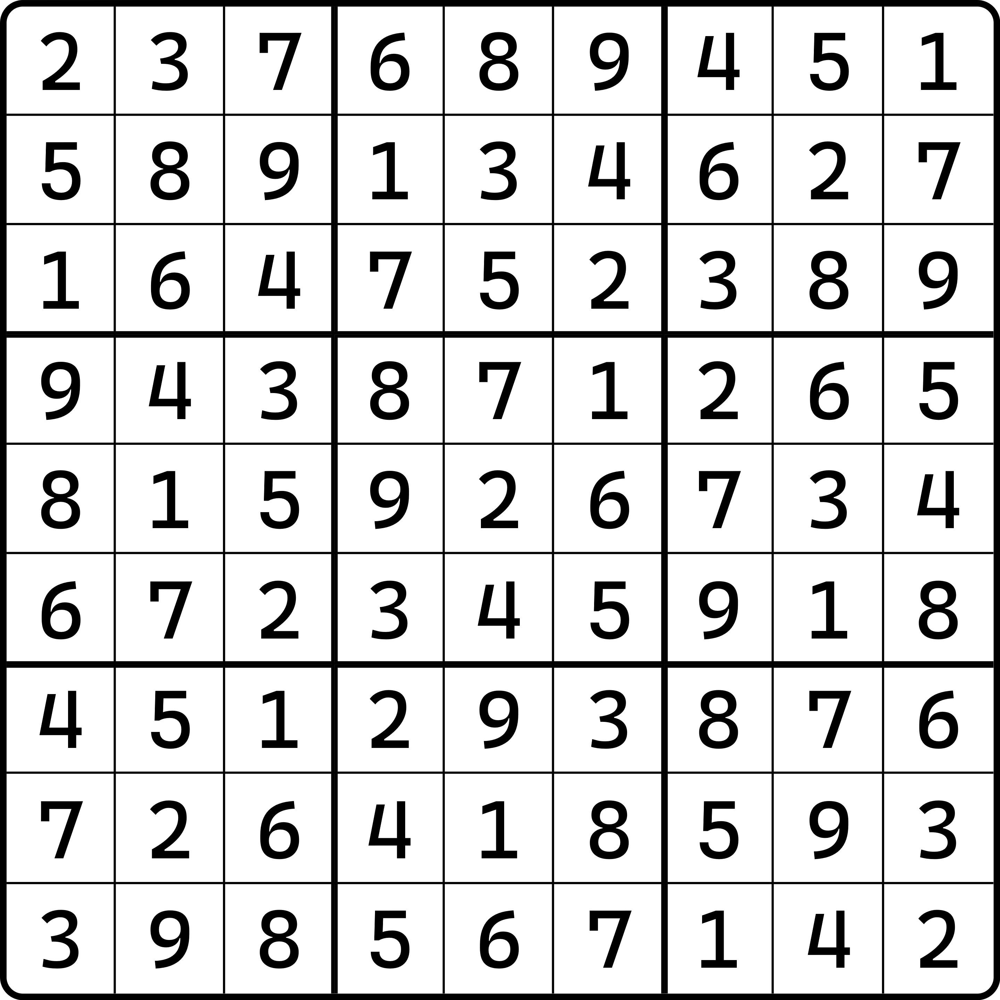
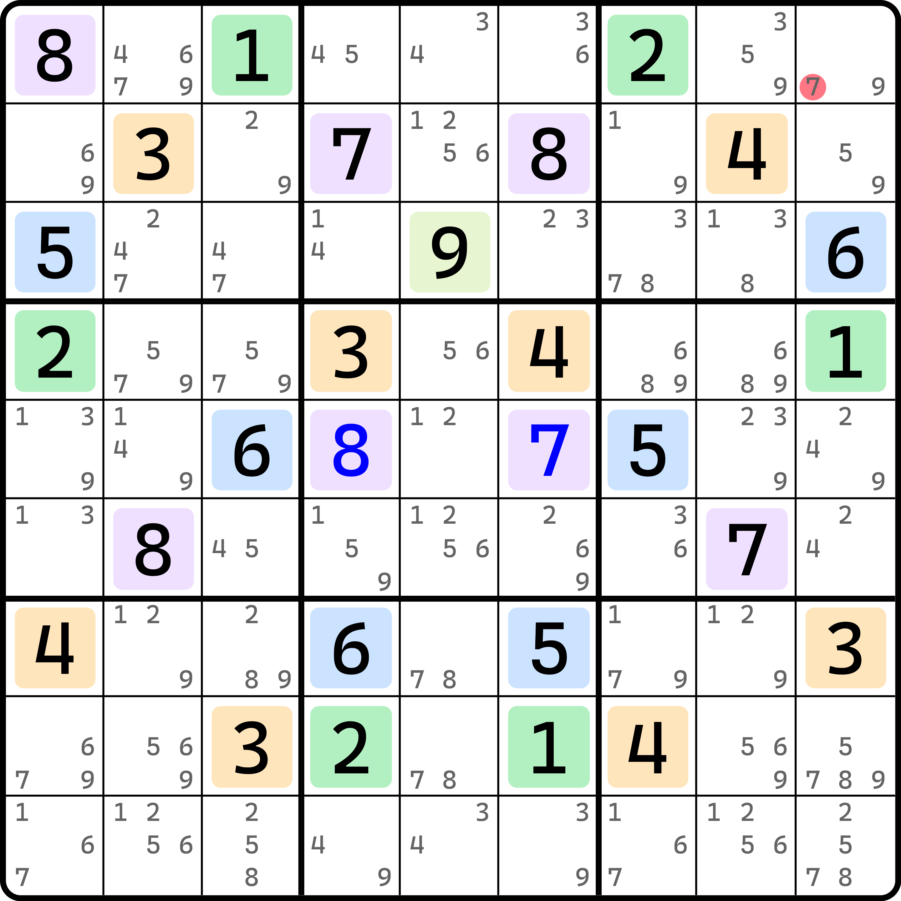

# 宇宙法反演

前面的内容里，我们提到了宇宙的基本推理过程。不过，宇宙法还有一种用法。

## 中心对称反演 

<figure><figcaption>
中心对称反演
</figcaption></figure>

如图所示。此题里我们明显发现，所有数字都是中心对称分布的，看起来似乎可以使用宇宙法。

但是这个题实际上是不能使用宇宙法的。可能你很奇怪，为什么之前的题都可以，这个题全部数字均对称了反而又不能了呢？这并不是宇宙法的设计本身有什么问题，而是你开动脑筋想想它是否真的能形成对称性？

这个题目出得非常精巧。我们发现，数字 1、2、3 都是自成一组的，而余下的数里，4 和 5 一组，6 和 7 一组，8 和 9 一组。我们发现，盘面只有 `r9c9` 暂未填数。它是和 `r1c1` 呈对称分布的，而 `r9c9` 理应是填 9 的，这样才能保证对称性。

不过我们先别急。我们先来看看对称的关系。1、2、3 找不到与之对称的另一个数，这也就意味着他们自己各自一组，4 和 5 成一组，6 和 7 一组，8 和 9 一组。这个题自成组的有三种数字 1、2、3。而倘若我们往 `r9c9` 填了 9 之后，每个数就都对称了。但是，中心对称的题目是不可能存在三种自己成组的数字的。因为 `r5c5` 是唯一一个可以用来满足自己成组的单元格，因为它的中心对称位还是它自己，这刚好用来满足最后那一种自成一组的那个数的填入。但是，如果有三种这样的数，就算拿其中一个填进去，那另外两种数字都无法满足这种对称性质了。也就是说，如果 `r9c9 = 9` 的时候，题目呈现全盘对称的效果，于是符合宇宙的全局对称条件（全部数字均从明数层面处于中心对称分布且映射关系都对称的情况）；但是从数字分组的角度去看又会发现，1、2、3 三种数字又不可能满足对称性的条件，即又符合不了宇宙的那种全局对称性。这两个说法得到了两种互相矛盾的情况。

这意思就是说，假设 `r9c9 = 9` 会引发对称性矛盾，所以 `r9c9` 填 9 是错误的填法。故 `r9c9 <> 9` 是这个题的结论。

我们把假设之后形成对称性矛盾的这种特殊宇宙法用法称为**宇宙法反演**（Anti- Gurth's Symmetrical Placement，简称 Anti-GSP）。

## 对角线对称反演 

### 例子 1 

<figure><figcaption>
对角线对称反演
</figcaption></figure>

如图所示。本题是撇对角线对称。

如果我们让 `r9c9 = 9`，则所有数字里，1、2、3 自成一组，而 4 和 5 配对，6 和 7 配对，8 和 9 配对，刚好符合对称性质。不过，本题是无法满足宇宙的对称规则的，因为 `r1c9` 只含 4、5、6、7 四种候选数。可以很清楚地发现，`r1c9` 处于撇对角线的对称轴上，它势必填入的是 1、2、3 的其一；但它正好错开了全部能填 1、2、3 的机会。就算你 `r9c9` 不填 9，这个单元格似乎都是只有 4、5、6、7 这四种候选数的。这也就是说，`r1c9` 可以看出，这个盘面不可能符合对称性要求。

所以，`r1c9` 破坏了对称性的形成，所以我们不难知道假设 `r9c9 = 9` 使得结构强制使用宇宙全局对称规则是自相矛盾的。所以，`r9c9 <> 9` 是这个题的结论。

### 例子 2 

我们再来看一个例子。

<figure><figcaption>
对角线对称反演，另一个例子
</figcaption></figure>

如图所示。如果我们让 `r2c9 = 9` 的话，那么整个盘面所有明数均都是按撇对角线对称。不过要注意的是，数字 1 到 7 全都找不到对称的配对数字，只有 8 和 9 是一对，其他 7 个数全都是自己各自成一组。

这非常奇怪。一个撇对角线对称的题目是不可能存在这么多种数字自己找不着对称配对的情况，而且还能让题目整体满足对称性的，所以这个对称性客观无法被得到满足。所以，`r2c9 <> 9` 是此题目的结论。

### 对角线对称最多只能容许 3 种数字自成组对称 

实际上，一个题目里，能形成撇对角线（或捺对角线，是哪一根对角线不重要）对称的、自己单独成对符合对称性的最大数量是 3。也就是说，一个题目能符合这种对角线对称的题目里，最多只能有 3 种不同的数字能够自己成组。如果超过 3 个，那必然存在数字无法满足对称性了。为什么？因为对角线上只能最多放入三&#x79CD;_&#x76F8;&#x540C;_&#x6570;字。注意，不是“三种不同数字”，对角线可以放 9 种不同的数字。对角线数独这种变型数独玩法不就是这样的吗？这里说的是，你尽量使得数字相同、最少地填充满对角线上的所有格子，那么只能最多填三种数。再多就必然有数字会更少频次地出现。

比如这个答案展示的就是其中一个极端情况。

<figure><figcaption>
撇对角线对称最大自成组情况
</figcaption></figure>

如图所示。数字 1、2、3 是自己成组对称的，它占满了全部的对角线 9 个单元格，已经容不下任何其他的数字放入了。一旦你想拥有 4 种及以上数字也要形成这样的对称性的话，因为对角线拆开的两边（对称的两侧）都得安排（是一个偶数），但数独又刚好填入 9 个这个数字（是一个奇数），这必然是符合不了的。

## 中轴线对称反演 

在宇宙法里，按 `r5` 或 `c5` 对称形成宇宙法推理过程是不可能的，因为对称轴同在一行或一列，又必须按宇宙法那样形成自成组的效果，就意味着又要填入重复数字，这直接就矛盾了。但是在反演里，它是可以存在的。

<figure><figcaption>
中轴线对称反演
</figcaption></figure>

如图所示。这个题按 `c5` 左右镜像对称，其中 1 和 2 一组，3 和 4 一组，5 和 6 一组，7 和 8 一组，剩下 9 单独一组。很显然，这是符合条件的，只要让 `r1c9` 填入 7 就完美了。但是，这是中轴线对称，在宇宙法里，根本就不可能形成这样的对称模式，所以，`r1c9` 不然不可能填 7 以满足这种对称性质。所以，`r1c9 <> 7` 是这题的结论。

## 自成组对称的数量 

对于前文提及的 5 种类型的对称的题目里，能自己成组形成对称的数量是有必要记一下的。

| 对称类型          | 自成组最大数量 | 备注         |
| ------------- | ------- | ---------- |
| 水平中轴线对称（上下对称） | 0       | 不可能有这种对称模式 |
| 竖直中轴线对称（左右对称） | 0       | 不可能有这种对称模式 |
| 撇对角线对称        | 3       |            |
| 捺对角线对称        | 3       |            |
| 中心对称          | 1       |            |
