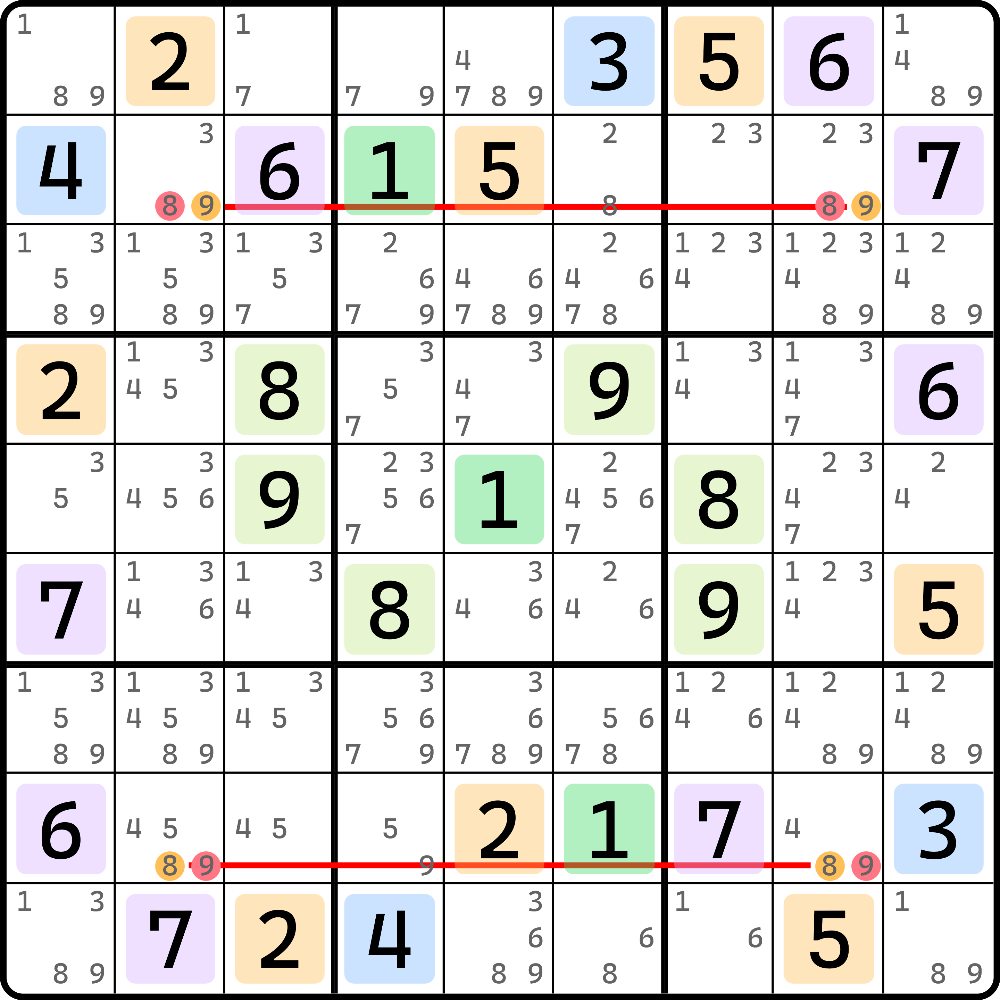
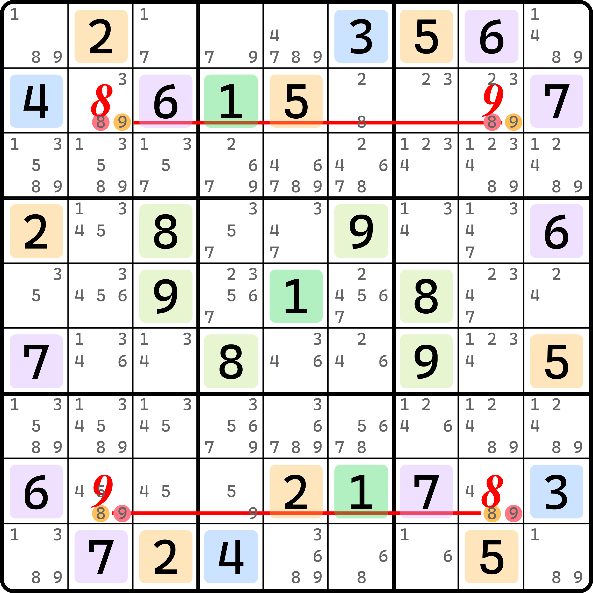

# 宇宙法的复合用法

之前我们介绍了宇宙法的基础推理过程。我们知晓的是，宇宙法会贯穿始终，整个题目只要初盘是符合宇宙的对称条件的，那么所有可用的技巧都会形成对称分布的情况。这种对称因为是始终成立的，所以我们可以将各路找到的技巧结构在一定程度上进行叠加使用，进而产生新的结论。下面我们就来看看这种复合用法。

<figure><figcaption>
带共轭对的用法
</figcaption></figure>

如图所示。本题是中心对称的，1 自成组，2 和 5 一组，3 和 4 一组，6 和 7 一组，8 和 9 一组，但 `r5c5` 已经有数字，所以无法直接使用结论。

不过不要着急。结论还是有的。我们发现，`r28` 上都有共轭对，一个是 8 的，一个是 9 的。假设我们让其中一侧的共轭对上的格子填的是对面那个数的话，就会有矛盾。比如说，`r2c2` 和 `r2c8` 是 9 的共轭对，如果我填了 8 在这两个单元格的其一里就会矛盾。

为什么呢？我们随便看一个单元格。比如 `r2c2` 填 8，于是 `r2c8` 就填 9；同时，`r8c2` 因为 `r2c2` 的缘故只能填 9，而 `r8c8` 只能填 8。

<figure><figcaption>
填了之后的样子
</figcaption></figure>

如图所示。这会造成一个明显的问题：`r2c2` 的中心对称之后的 `r8c8` 和它自己填的是同一种数。我们知道，`r2c2` 和 `r8c8` 因为是中心对称的关系，所以他们填入的数字必须只能是一对不同数字（或者都是 1；只不过这两个单元格此时没有 1 的候选数罢了）。但是这样假设我们会明确发现填的是同一个数，这违背了对称性质。所以这个填法是错的。故删掉 `r2c2(8)`。其他三个候选数也同理。

我们把这种，利用场上存在的结构进行复合使用，然后借用对称性可以得到一些特殊规则的技巧称为**宇宙法的复合用法**（Cascading Gurth's Symmetrical Placement，简称 Cascading GSP）。
