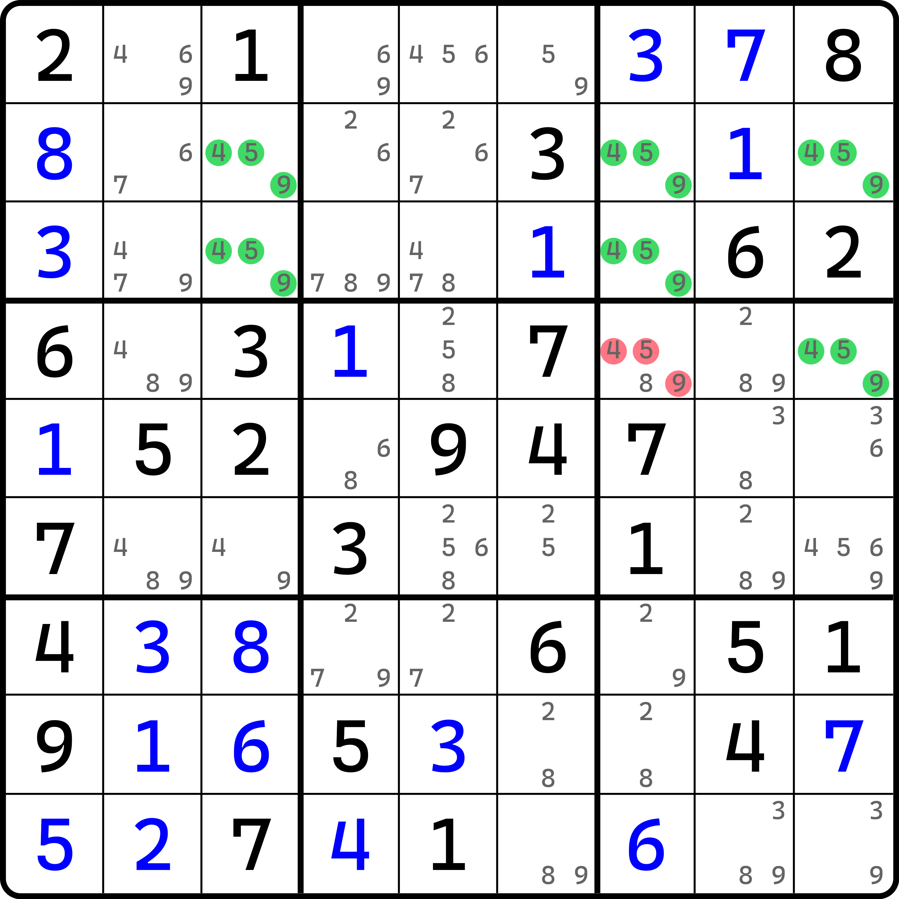
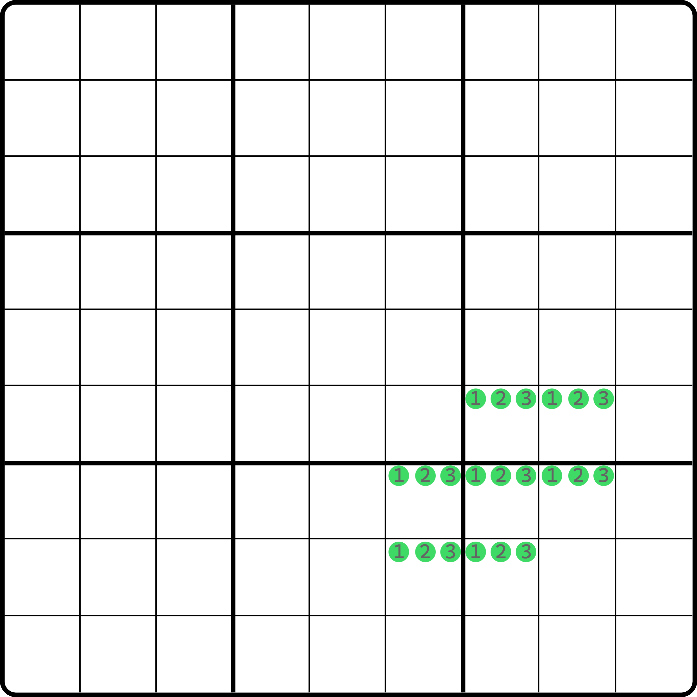
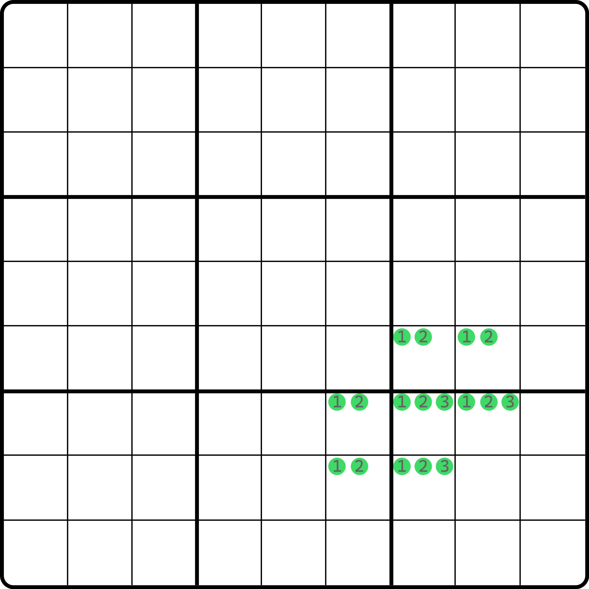
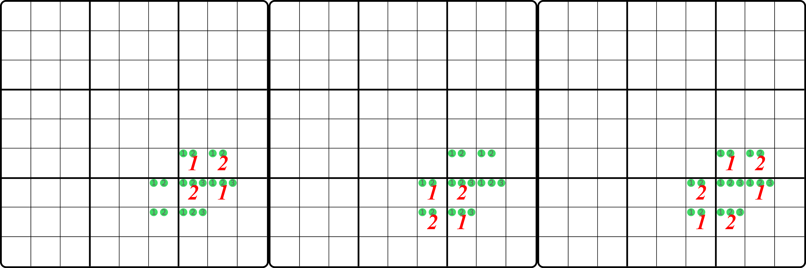
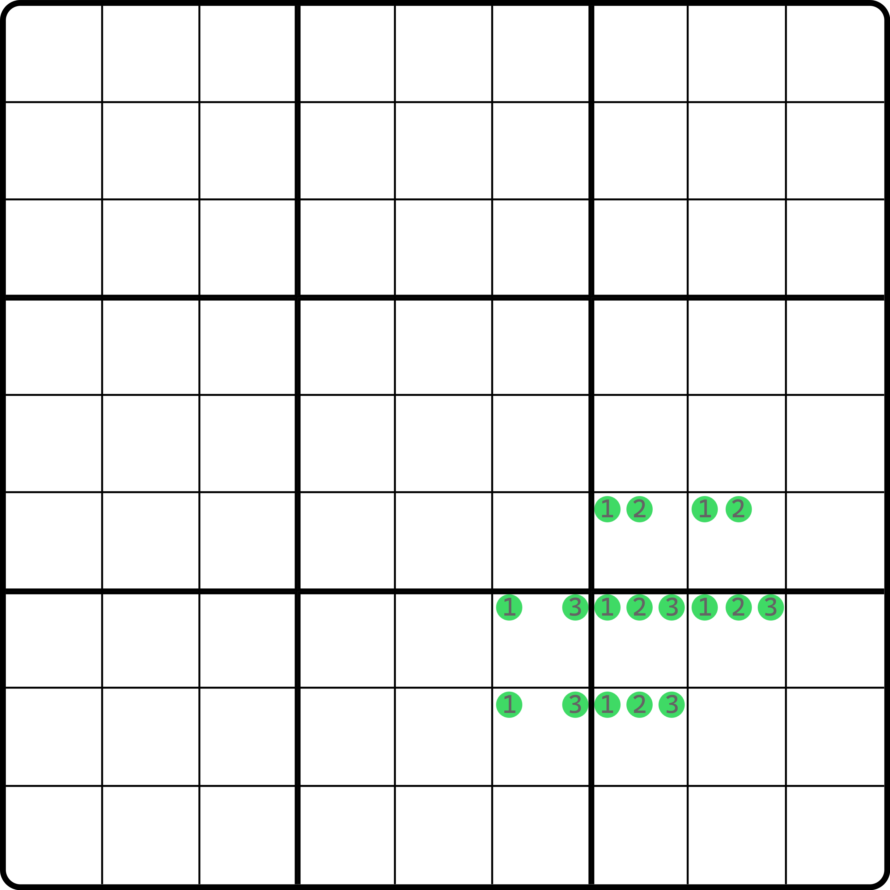
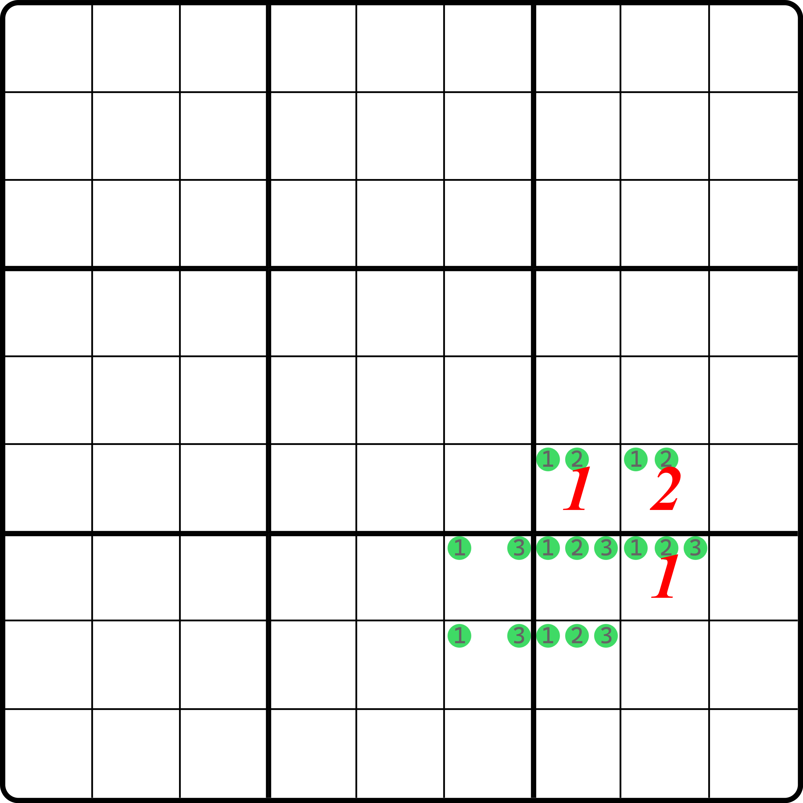
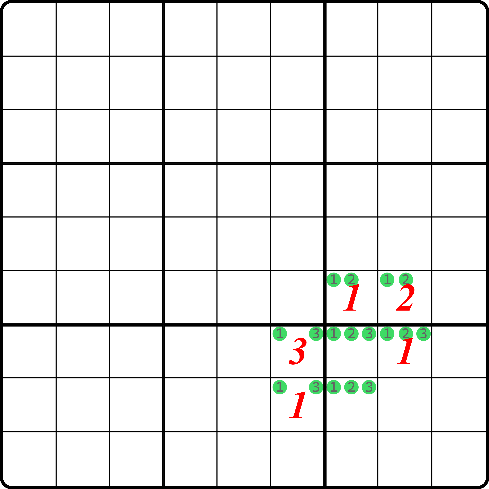
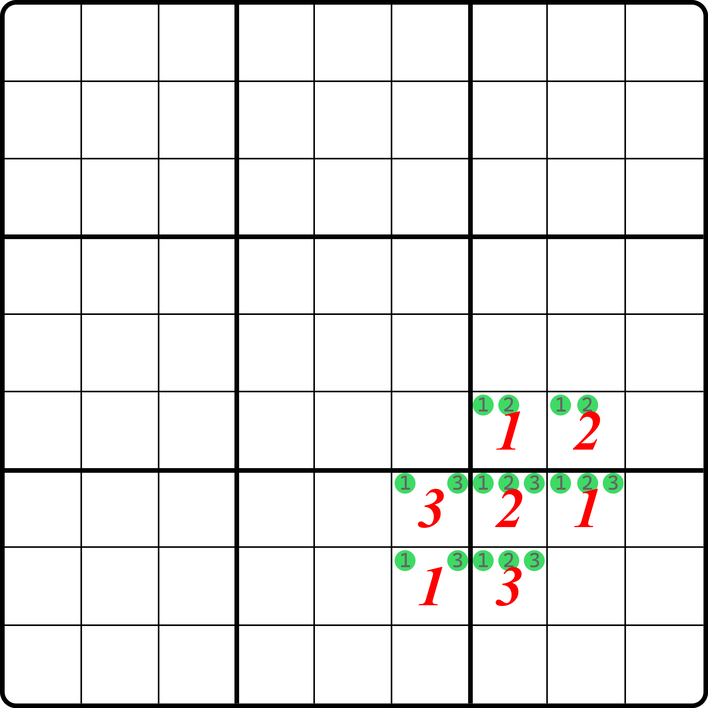
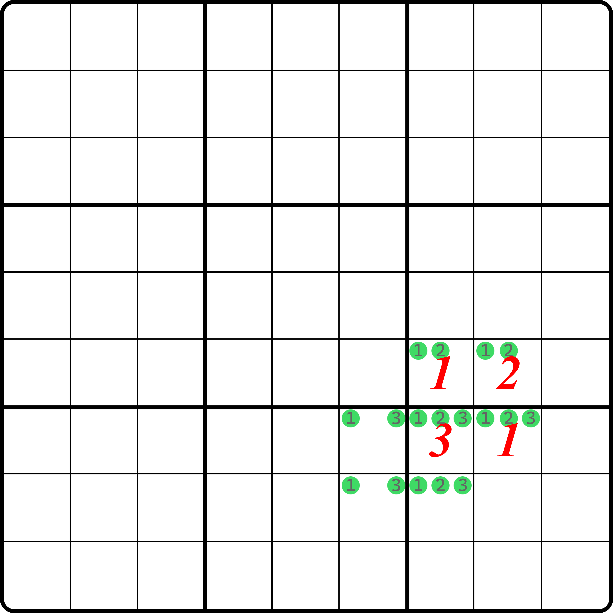

# 探长致命结构的基本推理

## 引例 

<figure><figcaption>
例子
</figcaption></figure>

如图所示。这是一个致命结构，它的结论是删除 `r4c7(459)`。

它的原因是，如果让 `r4c7` 只包含 4、5、9 这三种候选数的话，图中的 `r23c3`、`r24c79`、`r3c7` 会形成致命结构的矛盾。

我知道你看到这个例子会觉得一头雾水，这是怎么矛盾的。下面我们带着大家证明一下这个结构。

## 提取结构 

我们将这个技巧的结构提取出来。

<figure><figcaption>
结构部分
</figcaption></figure>

如图所示。不难看出，这个结构是由 6 个单元格的唯一环拓展得到的——将 `r7c7` 挖去之后，余下 6 个单元格只包含数字 1 和 2 就是唯一环了。

不过，这样的 7 个单元格要得到它是可以得到矛盾的，确实有些不太能理解。之前学习唯一环和唯一矩形的时候，我们好歹还知道它的矛盾原理是借用数字交换产生不影响盘面的填法；但是这 7 个单元格怎么看都有三种数字，这填法数量显然比唯一矩形和唯一环可多太多了。所以我们这里使用一种投机取巧的办法：用字母假设。

我们不是说，造成矛盾的前提是，怎么填都不影响盘面吗？实际上这个话里有一个比较不容易察觉的特征，就是它的所有填法可能并不一定互相都有关联，但他们各自都会造成矛盾。什么意思呢？就是说，像是唯一矩形和唯一环这样的技巧，它的所有可能填法之间都可以通过数字变换互相得到彼此；但是这个图上的结构可能不太行，因为它有三种数字 1、2、3。像是 `r6c78` 两个单元格，我们只能三选二。一旦数字被选中，那么它可填的数字情况就肯定是这俩了，而第三种未出现在这两个单元格里的数字在某种填法下一旦可以填入其中（而且图上的结构还确实是可能发生的），显然就不可能通过唯一矩形那种变换数字填充位置来互相得到这两种数字都不同的填法。

但是，我们似乎漏掉了一个技巧：拓展矩形。拓展矩形的推理是上下（或左右）对应位置的填数进行交换。从结构本身出发来看的话，它是一个 $$2 \times n$$ 的结构（其中 $$n$$ 一般是 2 到 7 里的一个数，$$n = 2$$ 的话就是唯一矩形）。而我们类似这样去看的话，也会发现不对的地方：因为整个结构里涉及 $$n$$ 种不同的数字，而对于 $$2 \times n$$ 里的这个“2”而言，它只能从这 $$n$$ 种数字里选其中的两个填入。我们在证明拓展矩形的矛盾的时候，也确实仅仅只考虑了它填入的那被选中的两种数字能够造成矛盾的情况，而并未关心它的其余填法之间是否能够进行互相的变换得到彼此；而看起来，我们只需要保证我们 $$n$$ 选 2 的时候，只要这个“2”能覆盖全部的可能性，且确实都能造成矛盾，那这个结构就是矛盾的。

我们不妨利用这一点，来看看这个结构如何证明是矛盾的。

## 证明矛盾 

搞清楚这点，我们先得知道如何证明，从哪里开始。我们尝试将结构分为若干种情况挨个讨论。

我们不妨把结构拆成三部分：`r78c6`、`r6c78` 和余下三个在 `b9` 里的单元格。拆成这三部分的目的是为了方便我们假设和分情况讨论。

因为我们知道，我们只能在其中三选二。所以，它只有可能有两种情况：`r6c78` 和 `r78c6` 要么三选二选到了一样的两种数（如都是 1 和 2），以及有一种数不同（如一个 1 和 2，一个 1 和 3）。因为这个只是个示意结构，所以如果我们能得到“同时 1 和 2 能造成矛盾”，那么同时都是 2 和 3、同时都是 1 和 3 也可以使用完全一样的证明逻辑得到矛盾；同理，对于有一种不同数字的情况而言，如果“1 和 2 一组，另外 1 和 3 一组，能造成矛盾”，那我其余的情况也都能造成矛盾。而且，这个结构不可能三选二选出完全不同的两对数字，所以只有这两种情况需要讨论。一旦他们俩都能矛盾，那么我们就可以直接得到这个结构是可以形成致命结构的矛盾的。

### 情况 1：两侧数对完全一样 

<figure><figcaption>
情况 1 示意图
</figcaption></figure>

如图所示。我们拿都是 1 和 2 举例。

因为 `b9` 里的三个单元格是 1、2、3，他们构成三数组，所以对于 1 和 2 落入的位置而言，最终 1 和 2 的情况只有三种：

* 1 和 2 横放在 `r7c78` 里；
* 1 和 2 竖放在 `r78c7` 里；
* 1 和 2 斜放在 `r7c8` 和 `r8c7` 里。

显然，三种全都是矛盾的。前两种必然是唯一矩形，第三种是唯一环。

<figure><figcaption>
三种填法（均矛盾） 
</figcaption></figure>

如图所示。很显然三种填法都是矛盾的。另外，你把填的数字的 1 和 2 换一下就是另外一个情况，这里就不再给图了。你也不用在意这个 `b9` 里剩下的那个数填多少。虽然我们知道它肯定填 3，但是它真不重要了，因为图中 7 个单元格里，只要按照我们前文假设的情况进行填入，那么其中 4 个或 6 个单元格就已经造成矛盾了。

### 情况 2：两侧数对有一种数字不同 

<figure><figcaption>
情况 2 示意图
</figcaption></figure>

如图所示。我们选择 1、2 和 1、3 进行假设。

<figure><figcaption>
情况 2，排除得到 r7c8 = 1
</figcaption></figure>

如图所示。假设 `r6c78` 填好数字，然后 `b9` 根据排除可得 `r7c8 = 1`。

我们当然知道 `r7c7` 此时肯定不能是 2（唯一矩形矛盾），不过我们先不用这个做法，先按排除法继续看看后面还能得到个啥。我们先按排除得到左边 `r78c6` 的填数。

<figure><figcaption>
情况 2，得到左边数对的填法
</figcaption></figure>

如图所示。这样 3 个数字 1 的位置都确定了。下面我们可以根据 `r7` 的三数组和 `b9` 的三数组得到最后两个数：

<figure><figcaption>
情况 2，矛盾
</figcaption></figure>

如图所示。最终我们还是逃不掉 `r7c7` 填 2 的情况。此时 `r78c67` 四个单元格还是形成了唯一矩形的矛盾。

有人问，刚才我们不是得到了唯一矩形的矛盾了吗？那如果我先规避它填 2 呢？行。我们来看看。

<figure><figcaption>
情况 2，回溯到唯一矩形矛盾处
</figcaption></figure>

如图所示。我们回溯到这里，然后因为唯一矩形矛盾，所以我们只得让 `r7c7` 填 3。然后我们再用三数组得到 `r7c6` 和 `r8c7` 的填数。

很明显，因为此时 `r7c6` 只有 1 和 3，而我们在 `r7c78` 里用完了 1 和 3 的填数，`r7c6` 无数可填，直接就矛盾了。

也就是说，对于情况 2 而言，要么唯一矩形矛盾，要么填不了合理的数字矛盾，因此，这个结构的情况 2 的所有情况也都会导向矛盾。所以，这个结构无论如何都能形成矛盾。

另外，`b9` 里的三数组的摆放是可以随意变动的。在 `r78c78` 里随便选三个单元格是 1、2、3，这个结构都是可行的。

我们把这个结构称为**探长致命结构**（Borescoper's Deadly Pattern，简称 BDP）。从名字可以看出，这个技巧的推理和证明过程来自探长。

> 这里要说一个命名上的有趣东西。实际上，这个名字是我自己把探长给冠名上去的。探长本人似乎更希望它能被称为 abc-UR，其中的“abc”代表的是这个结构只用三种数字，字母代号而已。因为它最终大多都规约成唯一矩形（UR）的矛盾情况了，所以才这么称呼的。但是，我又不是很喜欢这个叫法。主要原因还是在于 UR 对于致命结构的称呼实在是有些“乏力”：这个结构在情况 1 里有一种情况会规约为唯一环的矛盾情况（斜放的时候），而叫 UR 总会显得有些奇怪。

但是要注意的是，探长致命结构不止有这一种形态，之后的内容我们会介绍它的另一种形态。但是因为它比较复杂，证明方式也有所不同，所以考虑到内容的难度梯度，就把它拆开放在了之后再来介绍。

## 残缺状态不影响结构推理 

可以发现，我们在假设的时候，就已经在分类讨论了。从结构的完整程度上，它是 7 个单元格全都是三种候选数；但是实际上我们是分开讨论的。每一个情况下，单元格都满足不了全都 1、2、3 三种候选数全部存在。

但是，这似乎并没有影响我们的推理。因为这个结构是通过每一种子情况讨论都矛盾，才收拢到整个结构矛盾的。这也就是说，如果我们发现一个探长致命结构的其中一个或若干单元格缺少候选数的话，它也不影响结构的推演。
