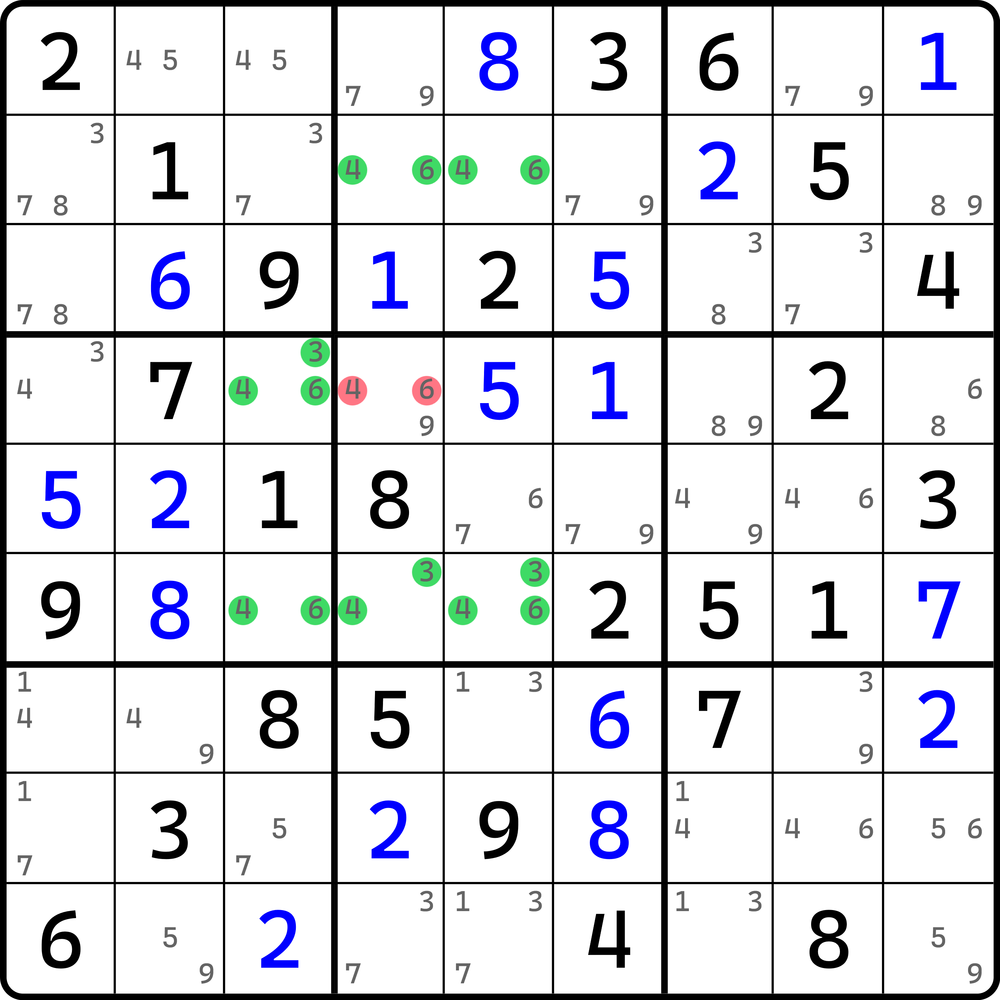
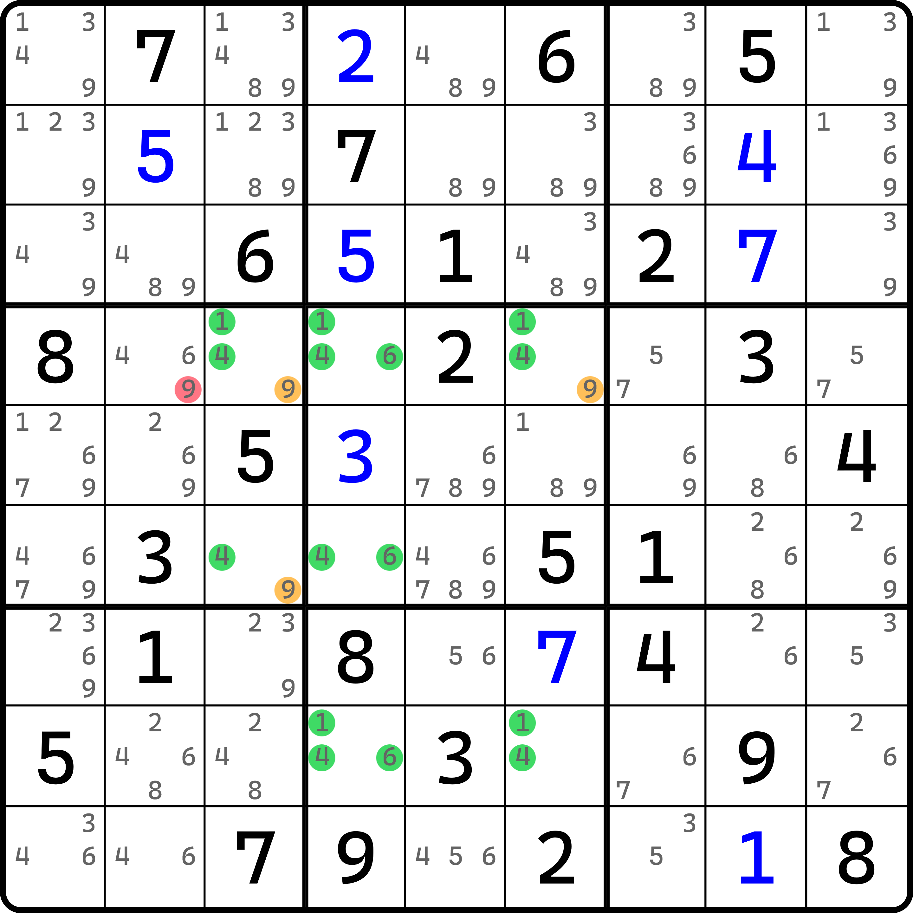
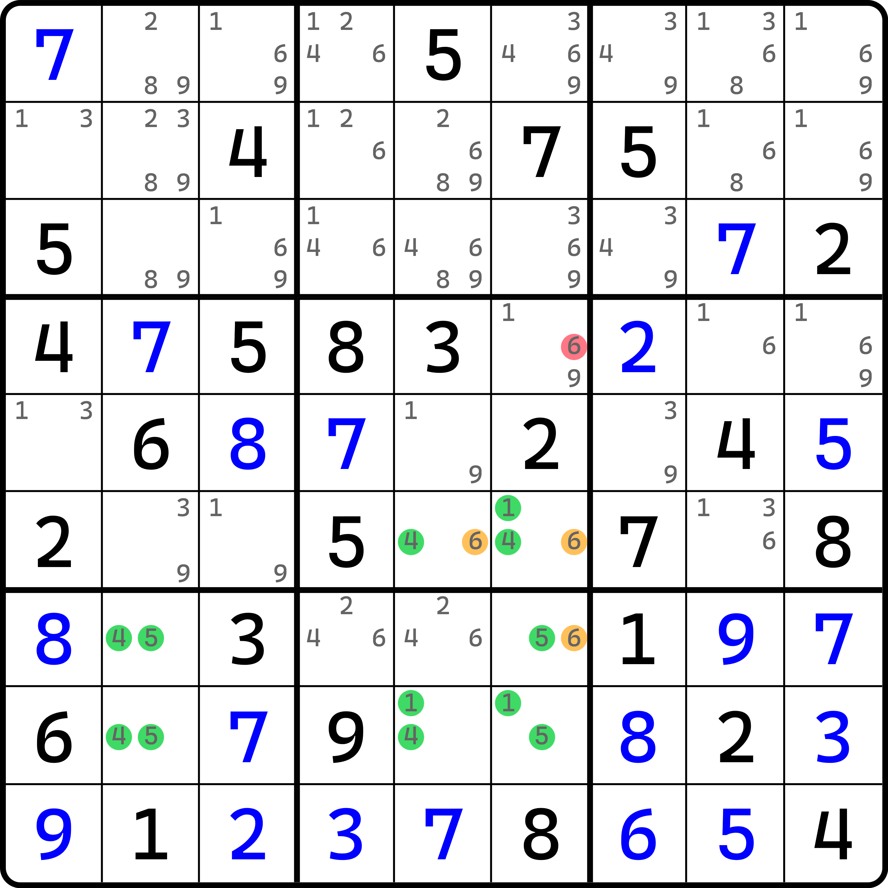
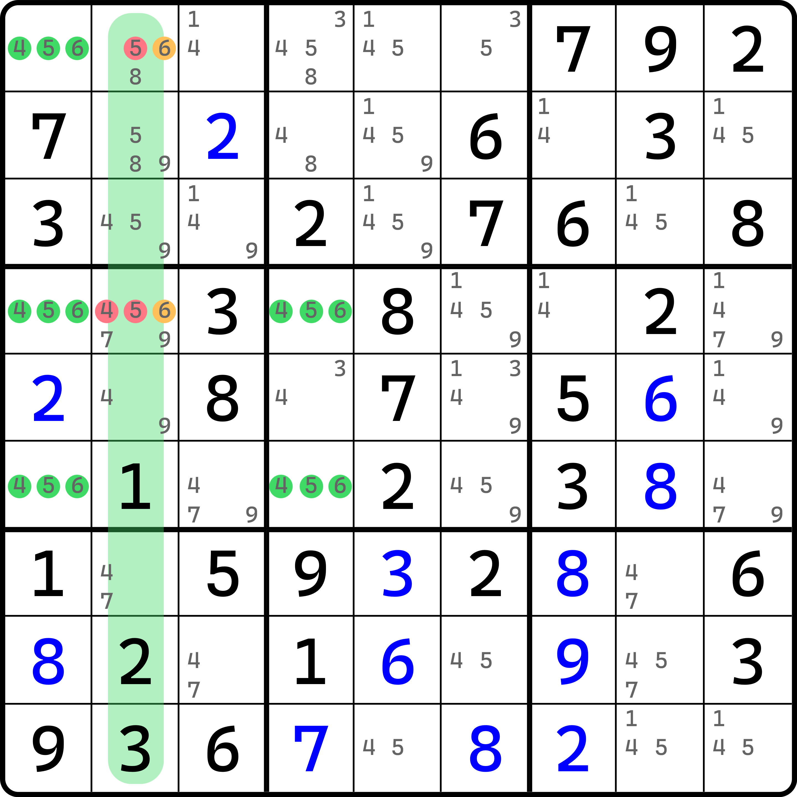

# 探长致命结构的例子

下面我们来看一些例子。

## 例子 1：类型 1 

<figure><figcaption>
例子 1
</figcaption></figure>

如图所示。可以看到，这个例子里 `r4c4` 一旦只有 4 或 6，结构 7 个单元格将只剩下 3、4、6 三种数字，进而形成矛盾。

需要注意的是，像是这种情况里，`r46c3` 甚至都不是一样的数字：`r4c3` 还多一个 3。这并不会影响推理，我知道你想问为什么，但这个解释起来确实也不费劲，所以我说一下。

整个完整结构是包含 3、4、6 的。换言之，你看到的缺少候选数的地方，均是由于前面通过一些别的技巧所删掉的，比如 `r6c3` 里缺少 3 在初盘状态下是有候选数 3 的，因为候选数全标依赖的是利用提示数进行唯一余数技巧数数操作得到的。而 `r6c3` 所在的行列宫都不存在 3 的提示数，所以根本就排除不了 3 的可能性；这里没有只能说明一点——它可能被之前某个技巧提前删掉了。

同理，别的候选数也是一样。当然，像是 `r2c45` 里本身就不可能补上 3 了，因为 `r1c6` 是 3 的提示数。但是这显然不重要，对吧。因为之前的证明过程就是讨论的这样的分情况的矛盾。而我们要找的那种影响之前分情况讨论证明矛盾的特殊情况，在这个技巧里压根就不存在，毕竟你能在结构外面找到的提示数，都直接影响一整个数对或者一整个三数组，根本也不会存在就影响单个单元格的情况。所以，大大方方地使用。证明过程很复杂，但好在结构长相比较“出众”，容易发现。

## 例子 2：类型 2 

<figure><figcaption>
例子 2
</figcaption></figure>

如图所示。这个例子是类型 2，用到的数字是 1、4、6 这三个；如果橙色的三个 9 同时为假，则这 7 个单元格只剩下 1、4、6，形成矛盾。

## 例子 3：类型 2，但是残缺严重 

<figure><figcaption>
例子 3
</figcaption></figure>

如图所示。这也是个类型 2，但是它残缺得有点严重，尤其是 `r6c5` 和 `r7c6` 这两个单元格。如果没有 6，结构都只有一个数了。但是之前我们说过，这些缺少的候选数一定都能还原回完整的数对或三数组，所以缺少的数字不会影响这个结构的推理。按类型 2 找三个 6 的交集就行了。

## 例子 4：类型 4 

<figure><figcaption>
例子 4
</figcaption></figure>

如图所示。这个例子理解起来会稍微麻烦一些。

首先我们要观察到的是 `c2` 里的 6；它形成了共轭对。如果我们让 `r14c2` 这两个单元格的其一填了 4 或 5 的话，因为另外一边一定是 6 的缘故，这两个单元格将只包含 4、5、6 的其二。结合 `r146c1` 和 `r46c4`，7 个单元格将构成探长致命结构的矛盾形式。所以，这两个单元格里不应填 4 或 5 的任意填数，删掉他们。
