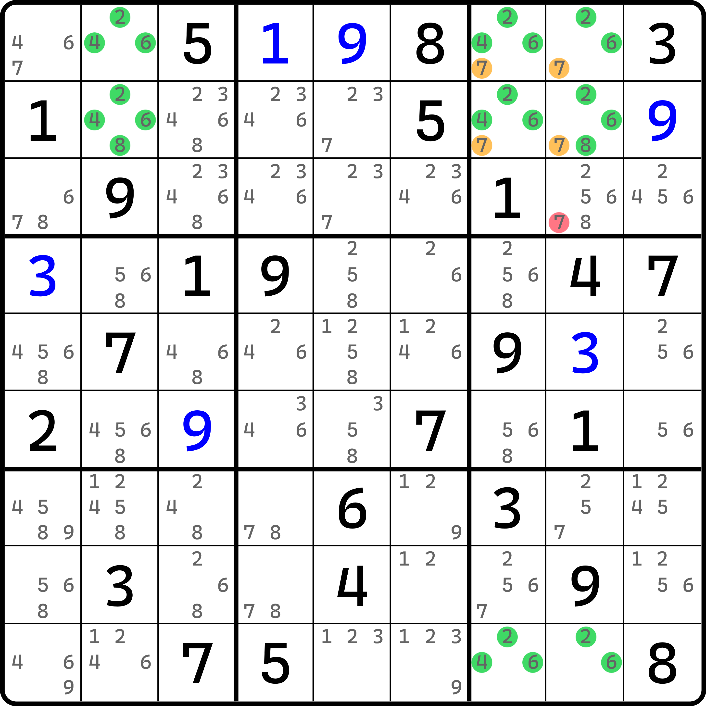
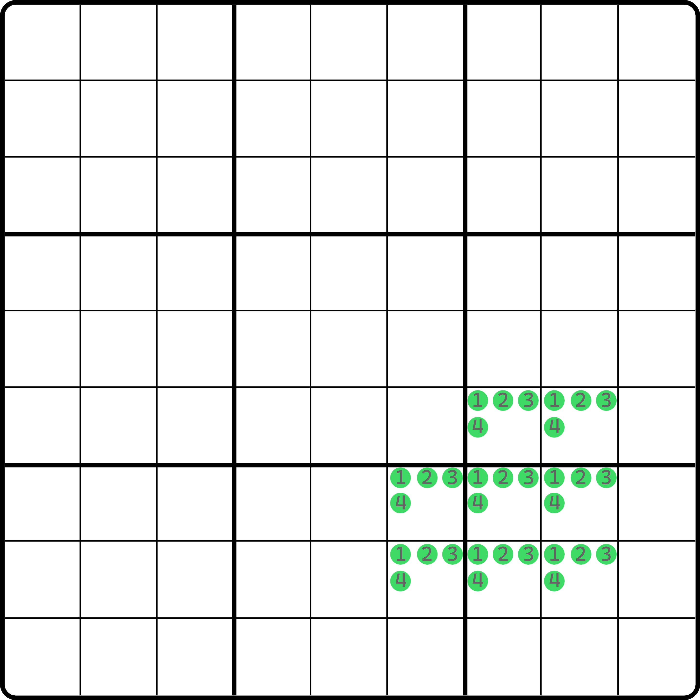
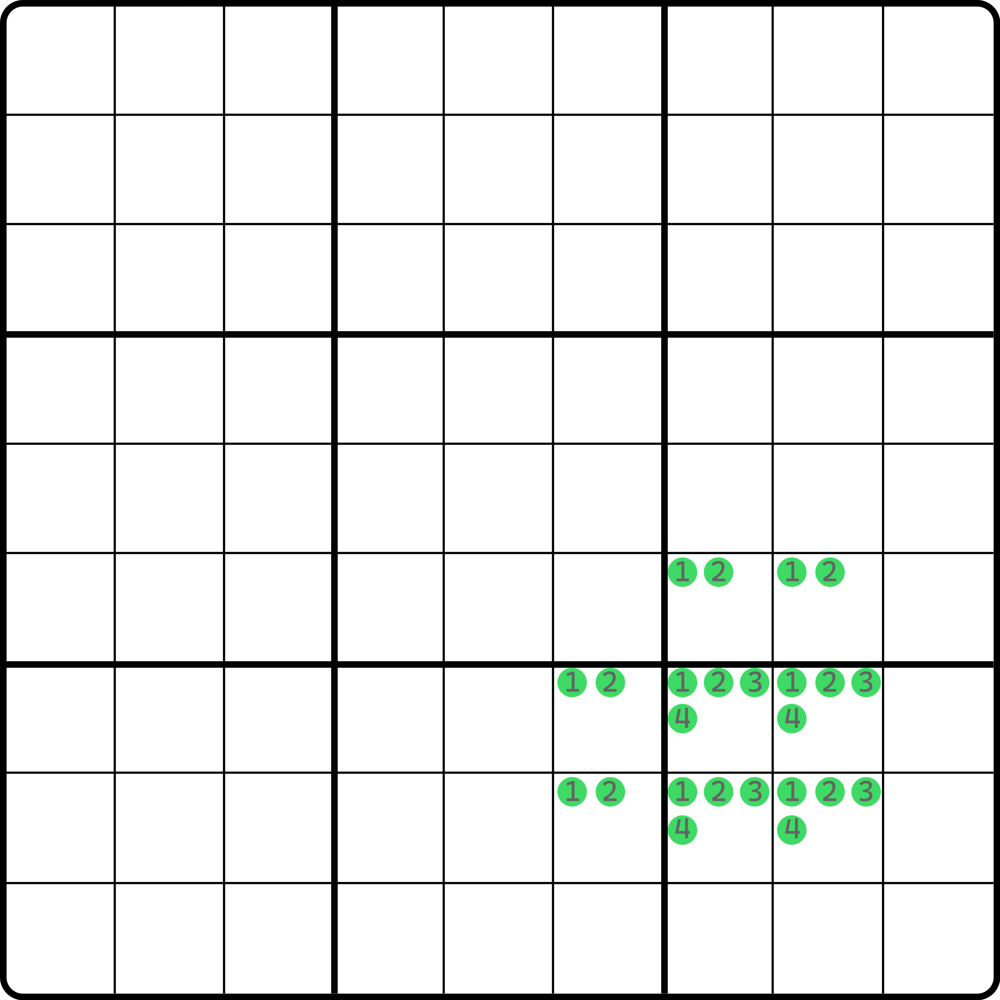
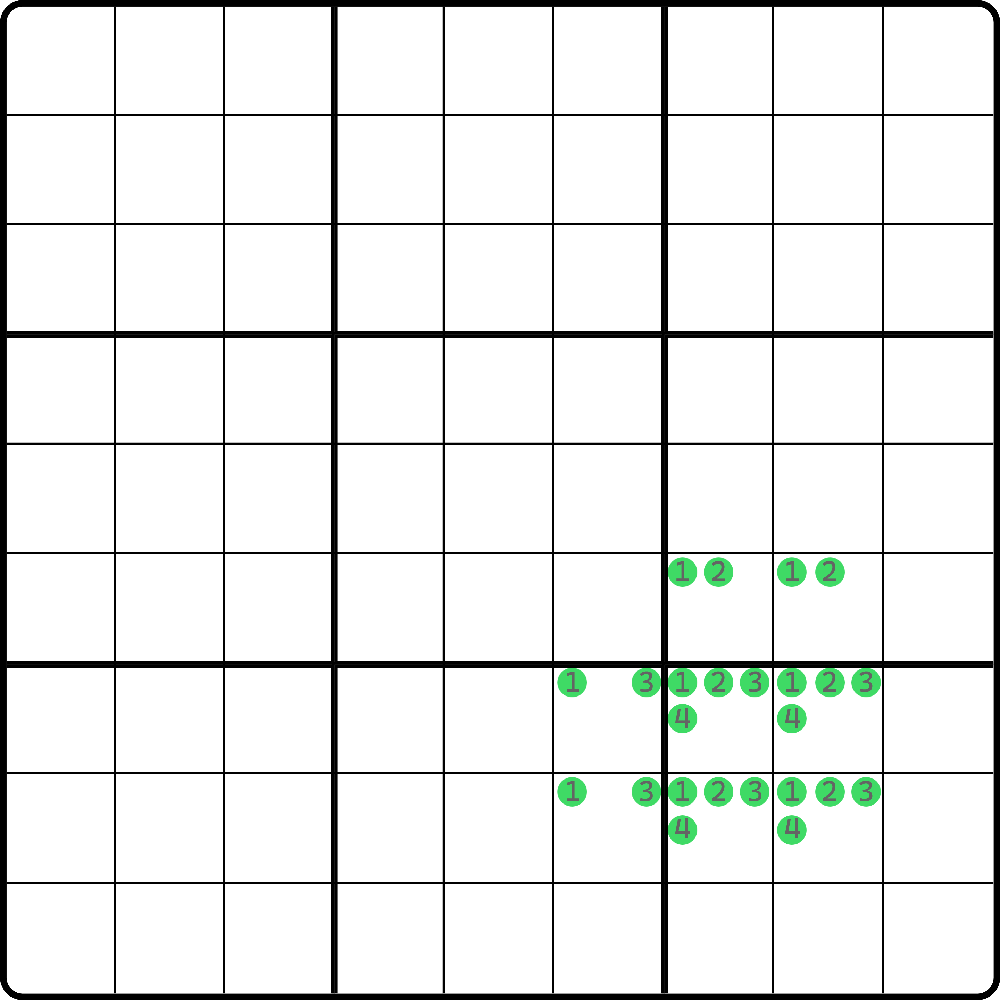
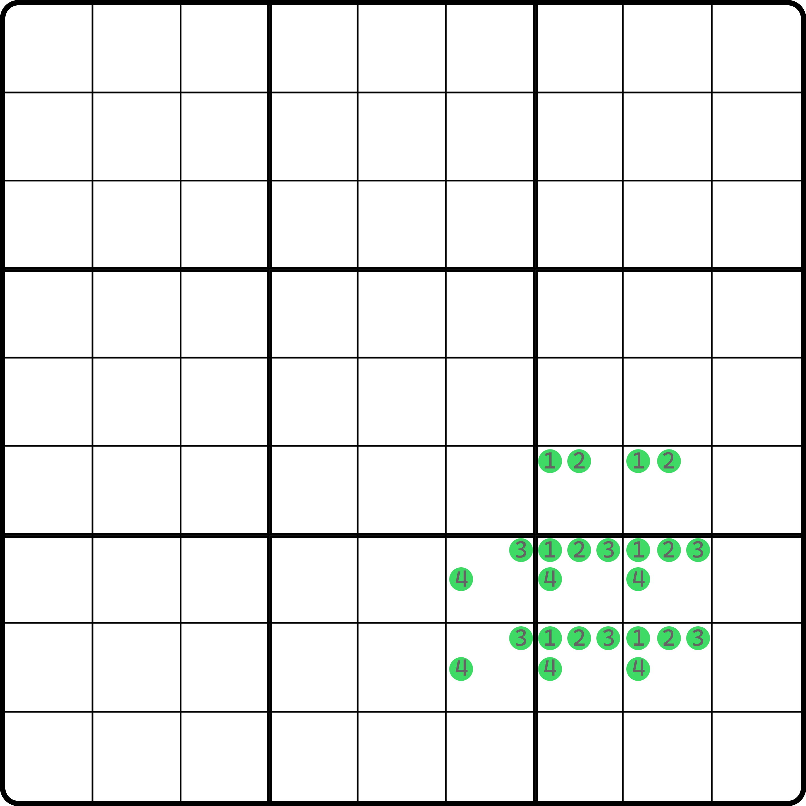
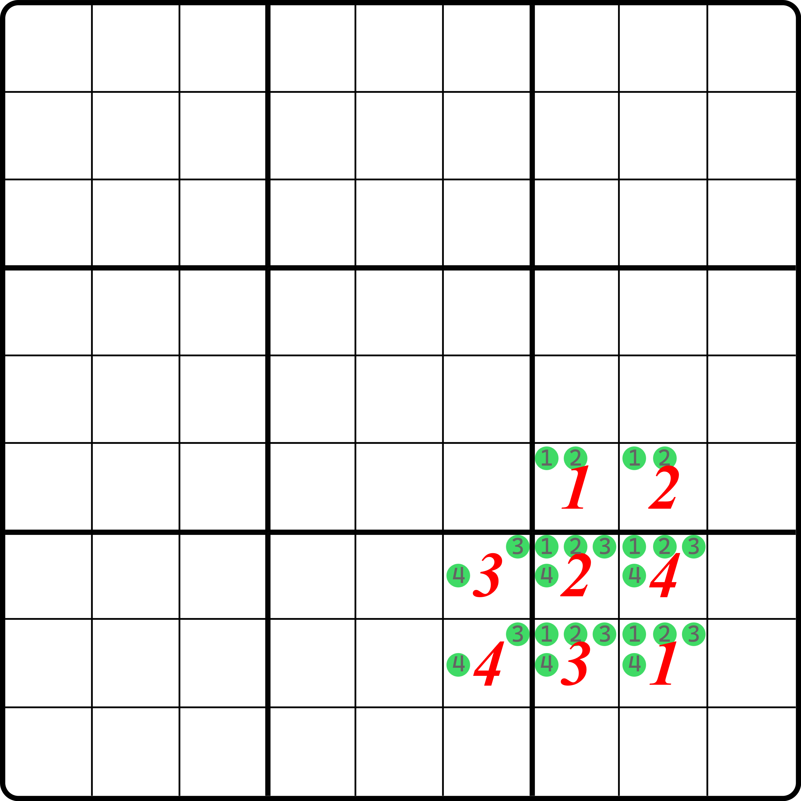
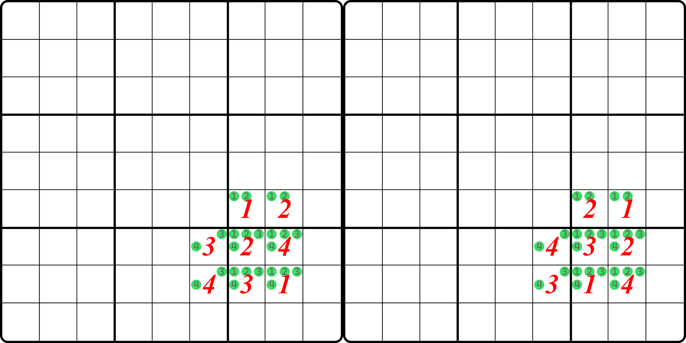
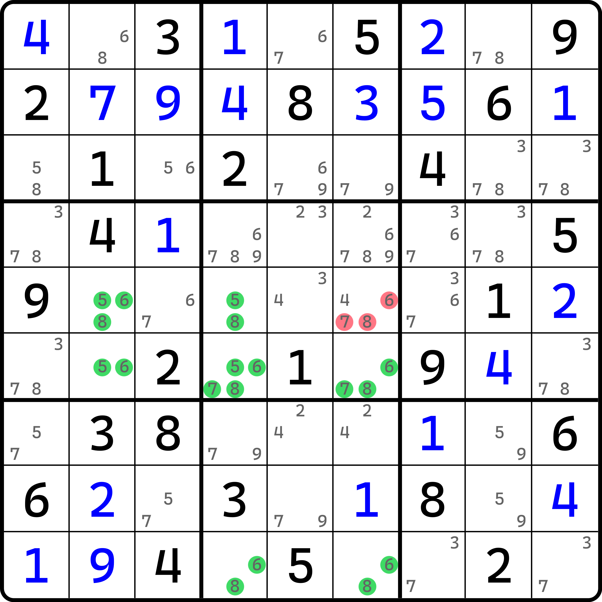
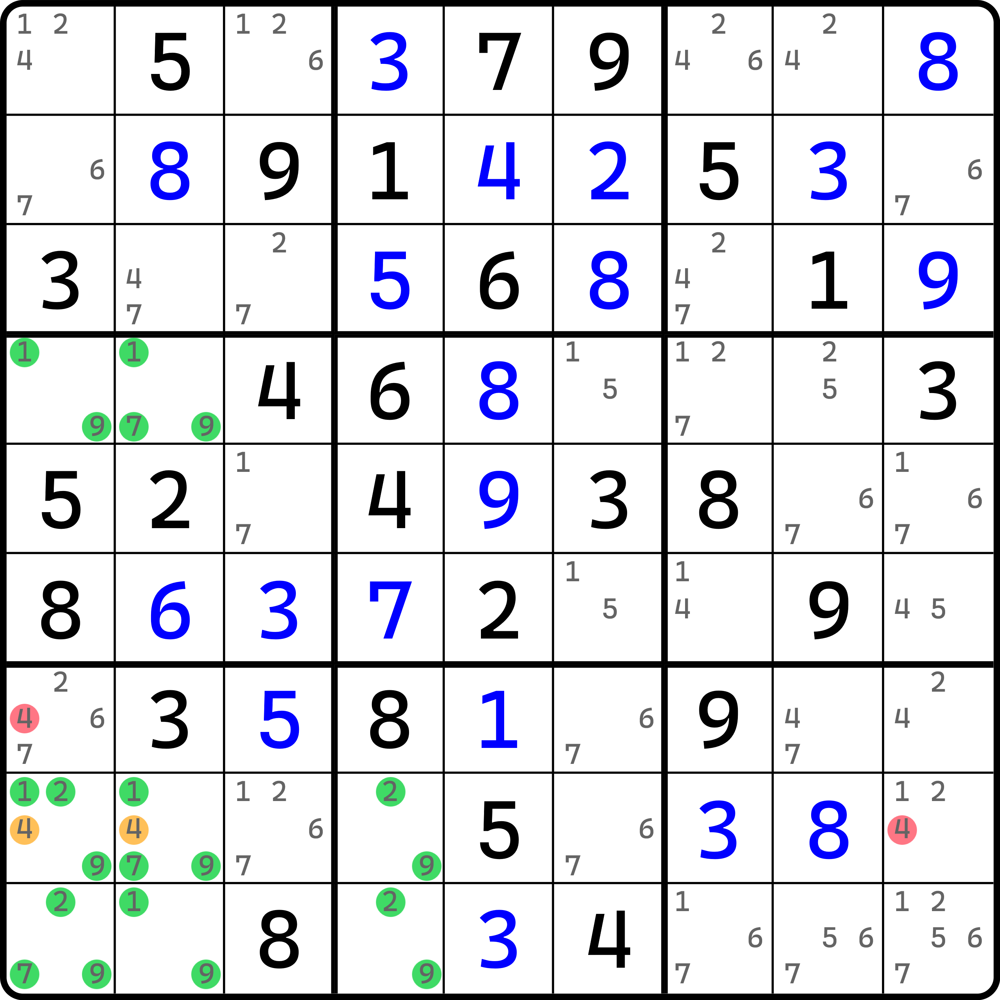
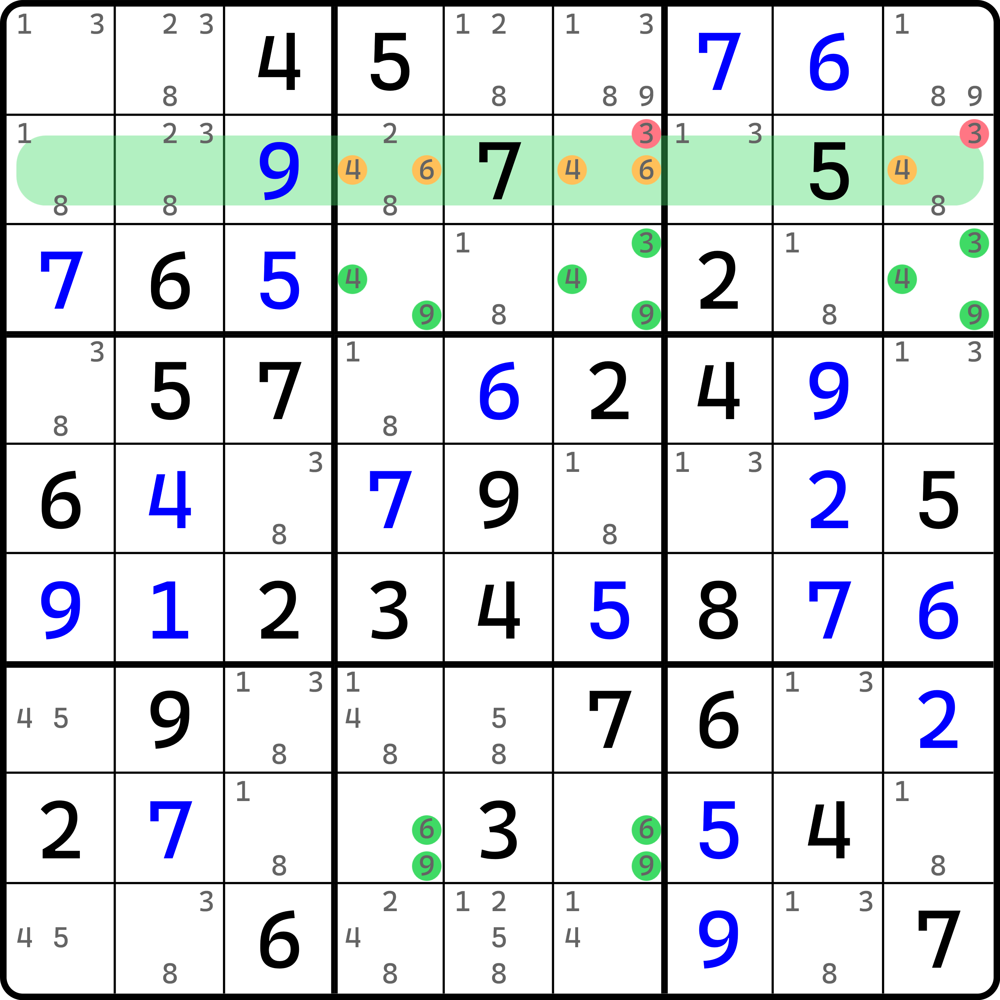

# 四数探长致命结构的基本推理

## 引例 

<figure><figcaption>
引例
</figcaption></figure>

如图所示。我们在原本结构的基础上，将使用三种数字拓展为四种，并在 `b3` 追加一个单元格。现在这个结构一共有 8 个单元格。

它仍然是可以使用的。可以看到，如果橘色的四个 7 同时为假的话，余下的四种数字 2、6、7、8 在这 8 个单元格里会形成矛盾。所以，这四个 7 里至少有一个是为真的，于是我们删除他们都可以看到的地方。所以这个题的结论是 `r3c8 <> 7`。

## 证明 

<figure><figcaption>
结构示意图
</figcaption></figure>

如图所示。我们要证明这个结构是矛盾的，别看它就只比原来的结构多了一个单元格，但它的复杂度上升了不少。我们这次需要讨论三种情况：

1. 两侧的两个单元格 `r78c6` 和 `r6c78` 是两种相同的数字；
2. 两侧的两个单元格 `r78c6` 和 `r6c78` 有一种数字不一样；
3. 两侧的两个单元格 `r78c6` 和 `r6c78` 两种数字都不一样。

### 情况 1：相同数字 

情况 1 的话，这里我们用 1 和 2 进行假设。

<figure><figcaption>
情况 1
</figcaption></figure>

如图所示。这种情况是矛盾的，甚至可以说是显然矛盾的。因为 `b9` 里出现的 1 和 2 的位置不论是怎么个摆放形式，其实都是之前提到的三数探长致命结构的证明手段，所以就不再赘述。

### 情况 2：有一种数字不同 

<figure><figcaption>
情况 2
</figcaption></figure>

如图所示。这种情况下，有一种数字不相同。这种情况仍然能规约为三数探长致命结构的证明手段上。因为数字 4 在 `b9` 的填入位置任意，余下的 3 个位置都只能是 1、2、3，而这 7 个单元格构成三数探长致命结构。

之前我们说过，三数探长致命结构的 `b9` 的三个单元格可以任意从 `r78c78` 这四个位置里随便选其中三个都行，因为其导致矛盾的本质并未发生变化。所以，这个矛盾显然也是可以形成的。

### 情况 3：出现的数字都不同 

<figure><figcaption>
情况 3
</figcaption></figure>

如图所示。这样似乎无法被规约为之前的情况，看起来甚至都没有矛盾出现。没事，我们需要讨论其子情况。

子情况也有三种。我们按上方 `r6c78` 里出现的数字 1 和 2，来讨论 `b9` 里 1 和 2 的填数位置：

1. `b9` 里的 1 和 2 横放；
2. `b9` 里的 1 和 2 竖放；
3. `b9` 里的 1 和 2 斜放。

显然，横放和竖放都矛盾。其中横放的话会造成 1 和 2 直接形成唯一矩形的矛盾形式；竖放则必然有 `r6c78` 里其中一个单元格无法填数。那只剩下斜着放了。

可问题就在这里。斜着放似乎没有矛盾出现。

<figure><figcaption>
情况 3，一种合乎逻辑的填法
</figcaption></figure>

如图所示。我们保证上述的斜放规则和 1 和 2 假设规则，不难找出这种填法。当然，`r6c78(12)` 不一定非得 1 在左边 2 在右边，`r78c6(34)` 也是。这里只是举例而已，你换下 1 和 2 的位置其实也可以；但是，放右边的情况和这个地方讨论的情况是等价的，大不了下面的 `r7c7` 和 `r8c8` 的 1 和 2 互换一下位置而已。这里就不重复讨论了，3 和 4 也一样。

很明显，这个填法下，所有行列宫没有唯一矩形、也不存在唯一环、也不存在直接导致删空的矛盾。这似乎没有任何问题。难道说它导致不了矛盾吗？

别急。我们将这个结构的行列宫提取出来。显然这个结构用到 3 个行、3 个列和 3 个宫（其中 `b68` 分别和 `r6` 和 `c6` 是一样的情况，不用单独讨论）。我们把数字提取出来：

* `r6`（或者说 `b6`）出现了 1、2；
* `r7` 出现了 2、3、4；
* `r8` 出现了 1、3、4；
* `c6`（或者说 `b8`）出现了 3、4；
* `c7` 出现了 1、2、3；
* `c8` 出现了 1、2、4；
* `b9` 出现了 1、2、3、4。

在我们前期介绍匿名致命结构的时候，我们简单提到过一个致命结构通用造成矛盾的点。那就是，数字在变换之后，行列宫出现的数字位置发生了变动，但仅仅只是数字内部进行的重新排列，每个行列宫里的数字重排列也不会造成产生新数字的填入。比如说你把 `r78c6` 的 3 和 4 换下位置，肯定不会换个 2 进来；而你变换 `r8c678` 的 1、3、4 的时候也只是重新编排 1、3、4 的填入位置，也不会加个 2 进来。

总之，我们只要找出另外一个填的排列进来，不打破原有数字在行列宫出现情况就行。比较有趣的一点是，这个结构还真有这种情况：

<figure><figcaption>
情况 3，重排列对比
</figcaption></figure>

如图所示。左边是原本的填法，右边是我随便找出的一种重排列的填法。

可以看到，右边这个重新排列过的填法下，数字或多或少都有一定程度的打乱，但是原本结构用到的 9 个区域（3 个行、3 个列和 3 个宫）上原本出现的数字全都没有任何变化：该是 1 和 2 的，还是 1 和 2；该是 2、3、4 的还是 2、3、4。只是编排数字的填充顺序稍微变了而已。

这点很重要。因为数字编排发生变化并不足以影响到整个行列宫里的其他别的单元格的填数。因为你只是交换数字的填充位置，而同在一个行列宫里的别处空格只会因为你填入的数字的不同才会有变动。你只是换下数字位置，数字原本是哪些现在还是哪些的话，那么就不会有任何影响。所以，我们可以认为，重新编排数字的填充位置造成致命结构那种特有的矛盾情况，是可以在这个技巧证明上奏效的。

所以，情况 3 我们也通过了“随意”构造出来的例子得到了矛盾。

因此，对于 8 个单元格的情况，探长致命结构也依旧是可以得到矛盾的。

另外，区别于之前的三数探长致命结构，四种数的情况称为**四数探长致命结构**（Borescoper's Deadly Pattern Using 4 Digits）。

## 一些例子 

下面我们来看一些例子。

### 例子 1：类型 1 

<figure><figcaption>
例子 1
</figcaption></figure>

如图所示。这是类型 1。

可以看到，如果我们让 `r5c6` 只包含 5、6、7、8 的候选数的话，那么 `r56c246` 和 `r9c46` 这 8 个单元格将构成四数探长致命结构的矛盾形式。

### 例子 2：类型 2 

<figure><figcaption>
例子 2
</figcaption></figure>

如图所示。如果 `r8c12(4)` 同假的话，8 个单元格 `r489c12` 和 `r89c4` 将形成矛盾，所以 `r8c12(4)` 是区块，删掉 `r7c1(4)` 和 `r8c9(4)`。

### 例子 3：类型 4 

<figure><figcaption>
例子 3
</figcaption></figure>

如图所示。这个例子是类型 4。我们发现 `r2` 的 4 和 6 只能填在 `r2c469` 里。当然，`r2c9` 没有 6，但是这并不重要，因为有 6 的话，这个结构照样可以使用（照样形成矛盾）。

那么，如果我们往 `r2c469` 里的任意一个位置填一个 3（或者 9，只是图里没 9 的候选数了），那么这三个单元格就都会因为你只剩下 3、4、6 三种数字（或 4、6、9 三种数字）而配合 `r3c469` 和 `r8c46` 形成四数探长致命结构的矛盾形式。所以，`r2c69 <> 3` 是这个题的结论。

> 特意也提到 9 是因为 9 也可以删数，但是不巧的是，这个题恰好有个 9 的明数摆在 `r2c3`，所以 9 没得删。但是 9 是可以形成删数的，这必须要说清楚。之前有读者会以为这个地方 3 可以删数是因为 9 不存在候选数才可以删的。

好了，至此我们就把探长致命结构的内容说完了。
