# 唯一矩阵

下面我们来看另外一种需要多种数字组合使用的致命结构形式。

## 唯一矩阵的基本推理 

<figure>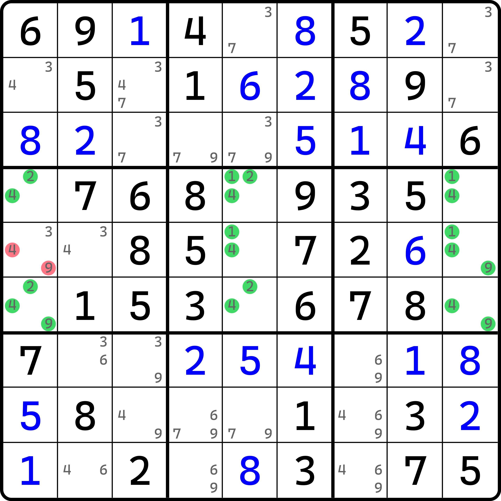<figcaption>
唯一矩阵
</figcaption></figure>

如图所示。可以看到，这个结构用到了 9 个单元格。9 个单元格里仅包含 4 种类型的数字 1、2、4、9。虽然看起来很混乱，但你可以视为是 9 个单元格全都是 1、2、4、9 的状态。

我要告诉你的是，这个也是个致命结构。因此，`r5c1` 需要规避出现致命结构的矛盾，所以 `r5c2` 此时必须填 3，因此本题的结论是 `r5c2 <> 49`。

这个技巧称为**唯一矩阵**（Unique Matrix，简称 UM）。该技巧在国外亦有研究，但并未对这个技巧有一个明确的叫法。这里给的是我自己所取的名字；之前的教程版本也使用的此名称命名，继续沿用。要注意名称要和唯一矩形区分开，不过在特殊环境下，可以视为是唯一矩形的超集。不过，这一点需要以后特殊说明才行。

## 证明 

下面我们给出这个技巧是致命结构的证明。

证明这个结构较为麻烦。我们提取这个结构的示意图。

<figure>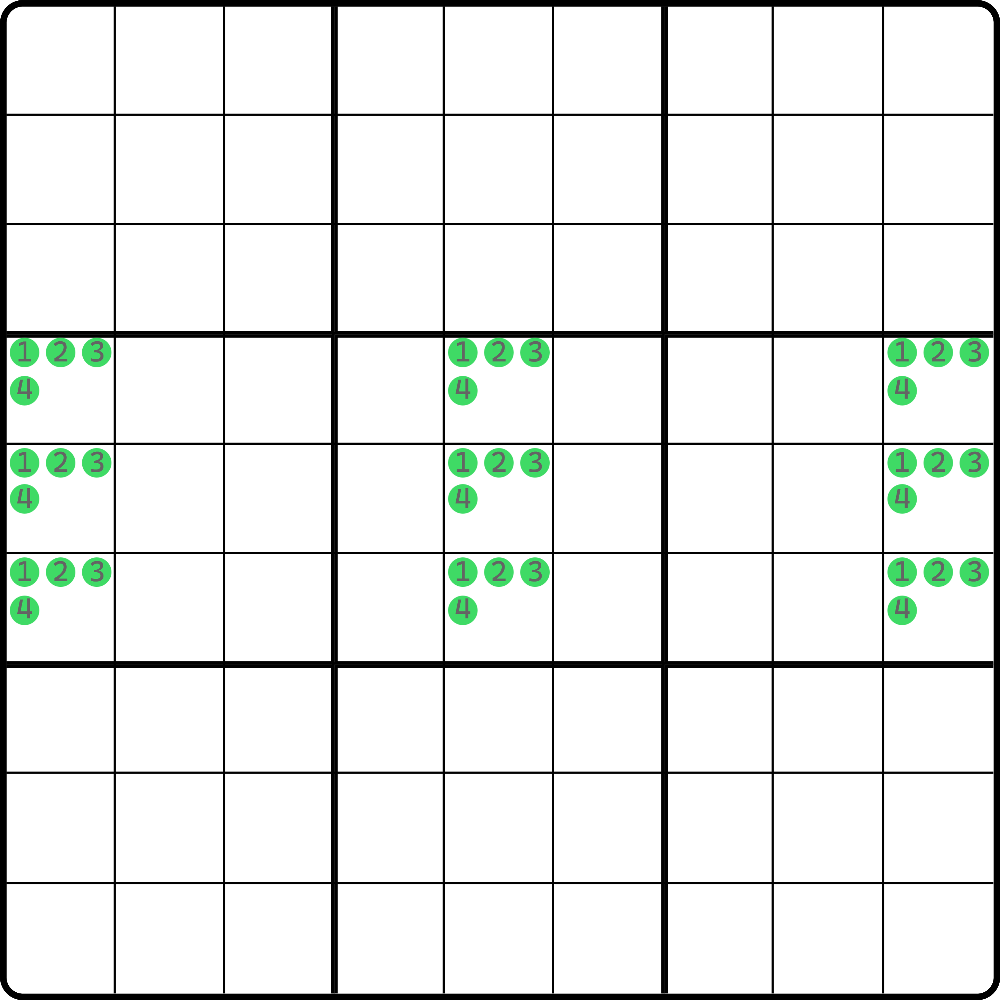<figcaption>
唯一矩阵，示意图
</figcaption></figure>

如图所示。这个结构整体是对称分布的，我们不妨随意取一个数分类讨论。比如我们按 4 的分布情况进行讨论。显然，数字 4 有四种情况：

* 这个结构整体都没有填 4 的席位；
* 这个结构最终只填 1 个 4；
* 这个结构最终只填 2 个 4；
* 这个结构填了 3 个 4。

因为是分布在 3 个不同的宫，所以显然不可能会有 4 次及以上的 4 出现。那么就这四种情况。我们挨个讨论。

### 情况 1：没有 4 填入 

如果没有 4，结构将会退化为 9 个只有 1、2、3 三种数的情况。

<figure>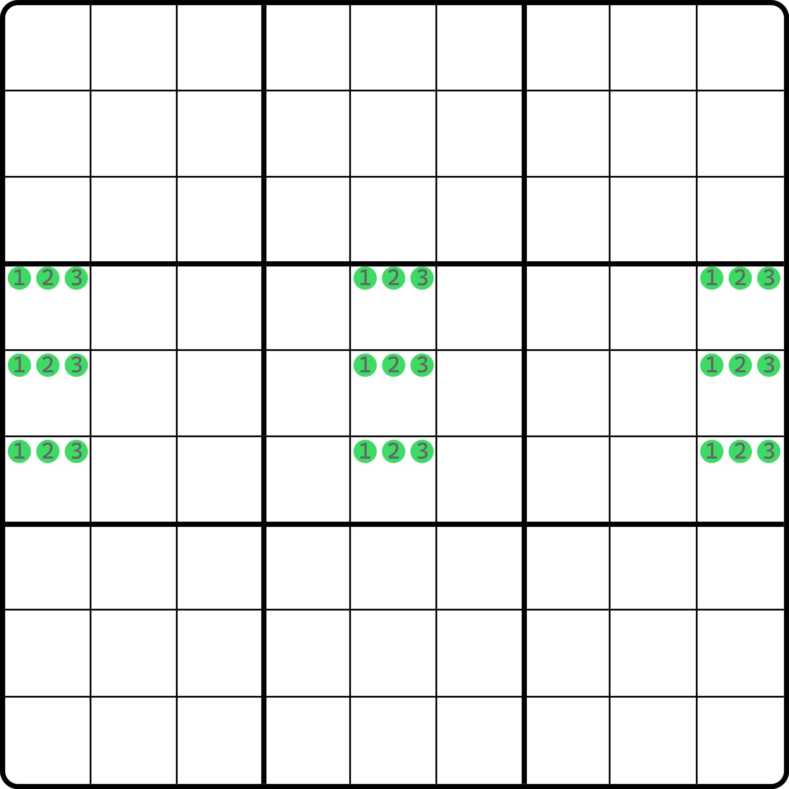<figcaption>
情况 1
</figcaption></figure>

如图所示。这显然是“致命”的，因为单看其中任意两个行就已经是拓展矩形的矛盾情况了。

### 情况 2：有一个 4 填入 

有一个 4 的填入也是致命的。

<figure>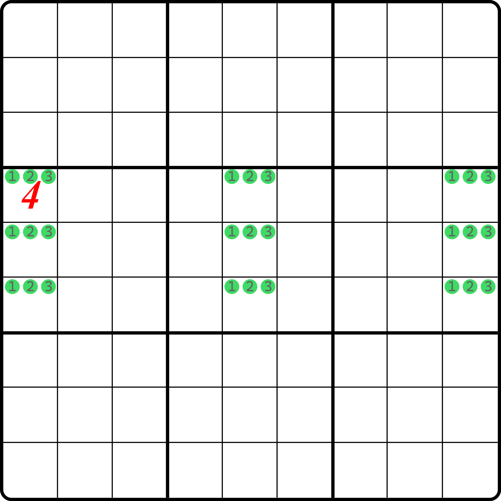<figcaption>
情况 2
</figcaption></figure>

如图所示。我们随便安放一个 4 填入到一个位置上，余下的单元格都只有 1、2、3 三种候选数。这仍然包含拓展矩形的结构在其中。

### 情况 3：有两个 4 填入 

<figure>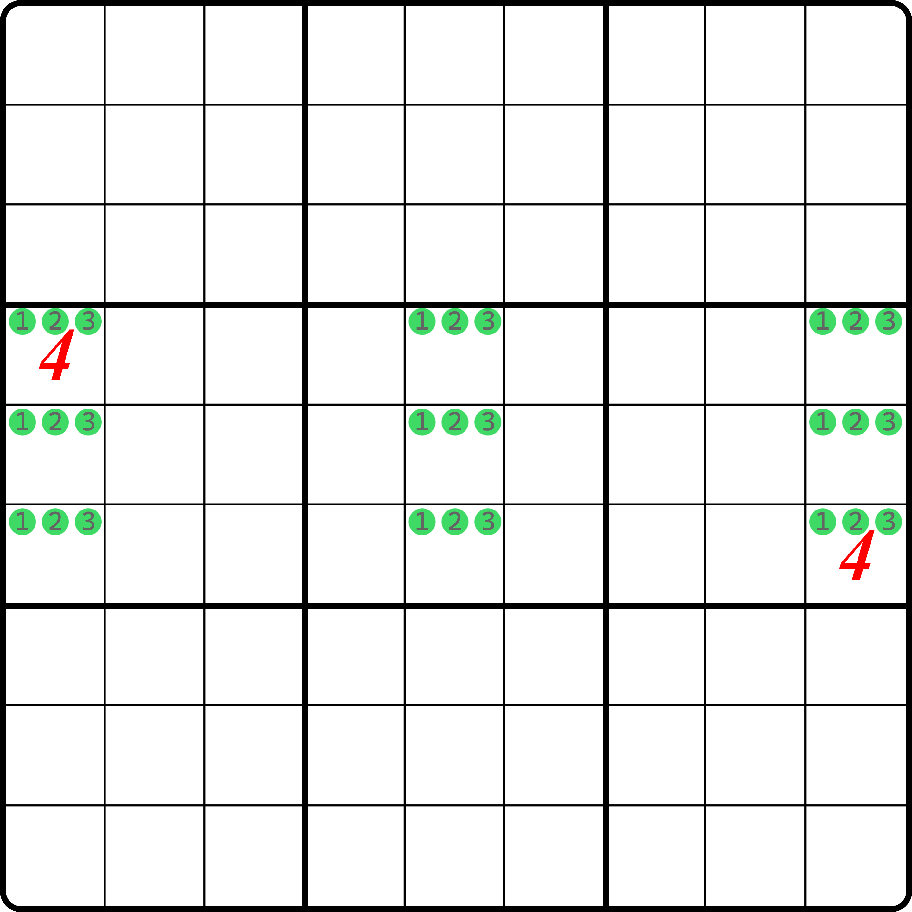<figcaption>
情况 3
</figcaption></figure>

如图所示。因为结构是对称的，所以我们随意填在两个位置就行。只要它是能证明得到的，那么其他的情况也都可以。

<figure>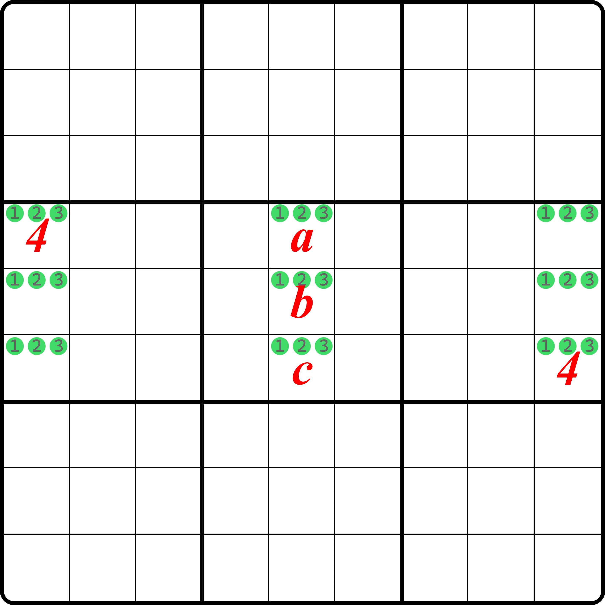<figcaption>
情况 3，代数假设
</figcaption></figure>

如图所示。我们给 `c5` 安排字母假设，假设 `r456c5` 分别填 $$a$$、$$b$$ 和 $$c$$（此时 $$a$$、$$b$$ 和 $$c$$ 均是 1、2、3 里的数字，且互相都不相同）。

然后我们转去看 `r56c1`。这两个单元格受到 `r56c5` 的填数影响，所以只能填固定的数字了：

* `r5c1` 此时只能填 $$a$$ 或 $$c$$；
* `r6c1` 此时只能填 $$a$$ 或 $$b$$。

我们按 `r5c1` 讨论一下就行。子情况 1——先假设 `r5c1` 此时填 $$a$$，于是 `r6c1` 就只能填 $$b$$。

<figure>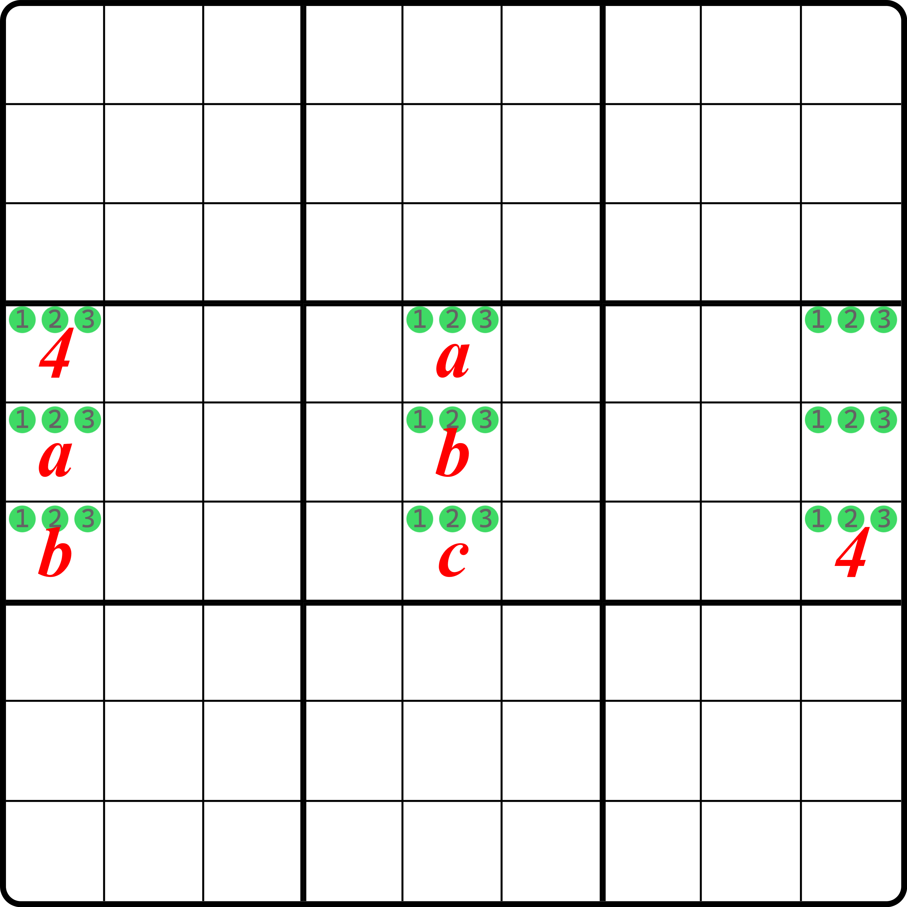<figcaption>
情况 3，子情况 1，假设 r56c1
</figcaption></figure>

如图所示。然后，因为我们确保里面只能有两处 4，所以右边 `r45c9` 只能安排 $$a$$、$$b$$ 或 $$c$$ 的填写。显然，`r5c9` 只能填 $$c$$，而 `r4c9` 只能填 $$b$$。

<figure>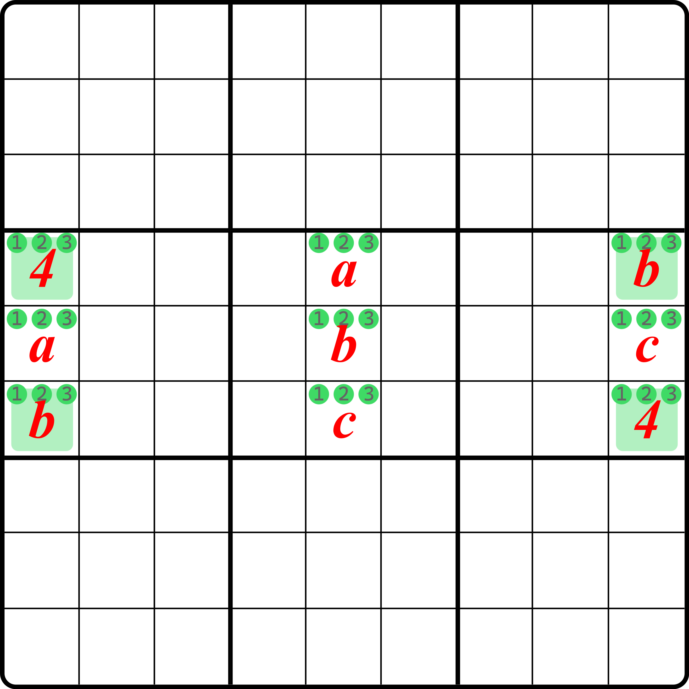<figcaption>
情况 3，子情况 1，假设 r45c9
</figcaption></figure>

如图所示。这样我们就只能得到这样的结果。显然，`r46c19` 是唯一矩形的矛盾情况。所以这个子情况矛盾。

接着看回子情况 2（让 `r5c1` 填 $$c$$）。

<figure>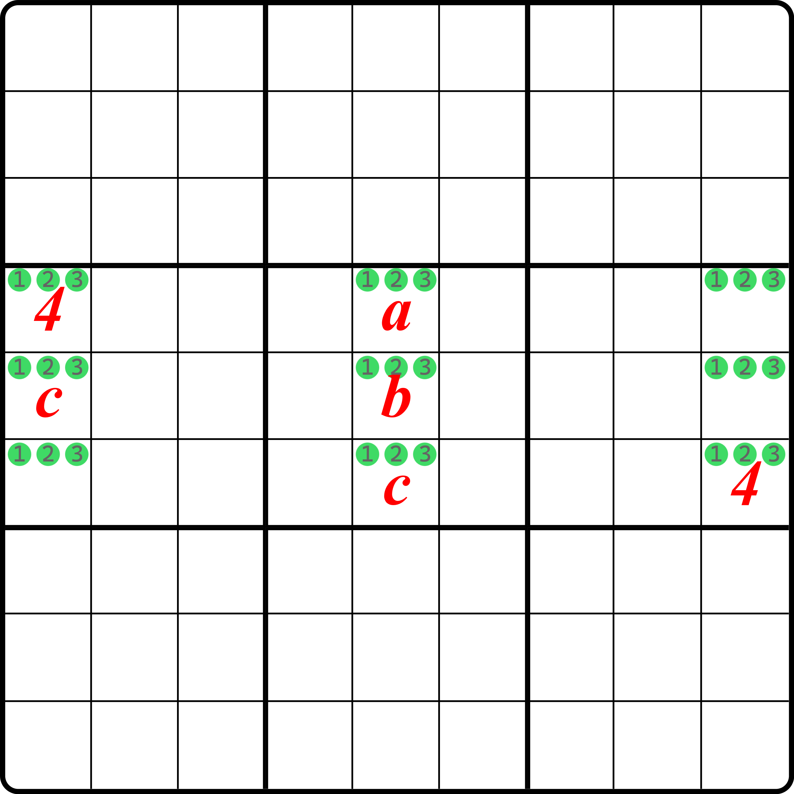<figcaption>
情况 3，子情况 2，假设 r5c1
</figcaption></figure>

如图所示。现在假设 `r5c1` 填 $$c$$。此时 `r6c1` 无法出解。不过别着急，我们先看 `r5c9`，它能出 $$a$$。

<figure>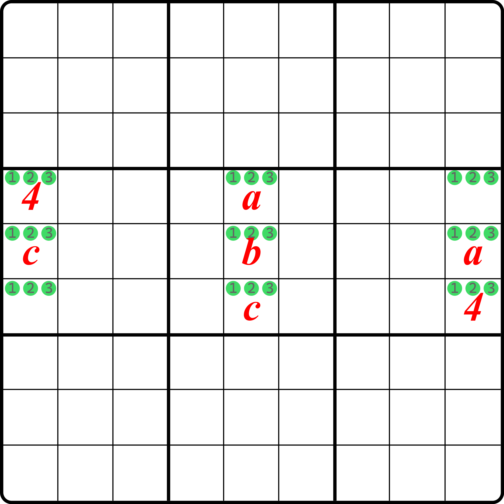<figcaption>
情况 3，子情况 2，假设 r5c9
</figcaption></figure>

如图所示。现在我们没办法继续了。但是我们发现，如果 `r6c1` 填 $$b$$ 的话，`r56c15` 会构成 $$b$$ 和 $$c$$ 的唯一矩形的矛盾，所以 `r6c1` 只能填 $$b$$；同理，如果 `r4c9` 填 $$b$$ 的话，`r45c59` 会构成 $$a$$ 和 $$b$$ 的唯一矩形的矛盾，所以 `r4c9` 安排填 $$c$$。

<figure>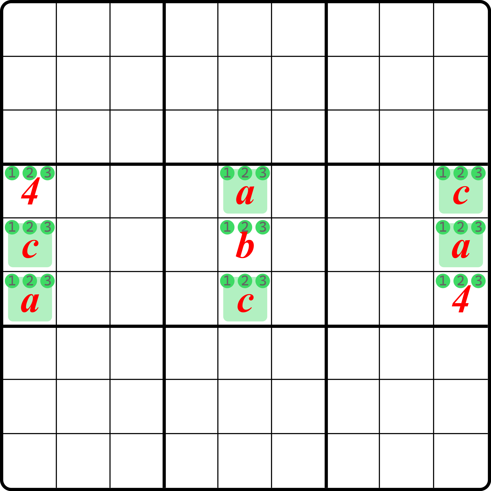<figcaption>
情况 3，子情况 2，假设 r4c9 和 r6c1
</figcaption></figure>

如图所示。这样我们得到了结果。我们发现，`r4c59`、`r5c19` 和 `r6c15` 就算规避了唯一矩形，也没能逃过唯一环的矛盾。所以，`r5c1` 在整个情况 3 里怎么填都矛盾，所以，这个结构在填两次 4 的时候必然存在这么一个格子会引发致命，所以它肯定在这个情况下也是致命的。

### 情况 4：有三个 4 填入 

最后一个情况是证明三次 4 填入。

<figure>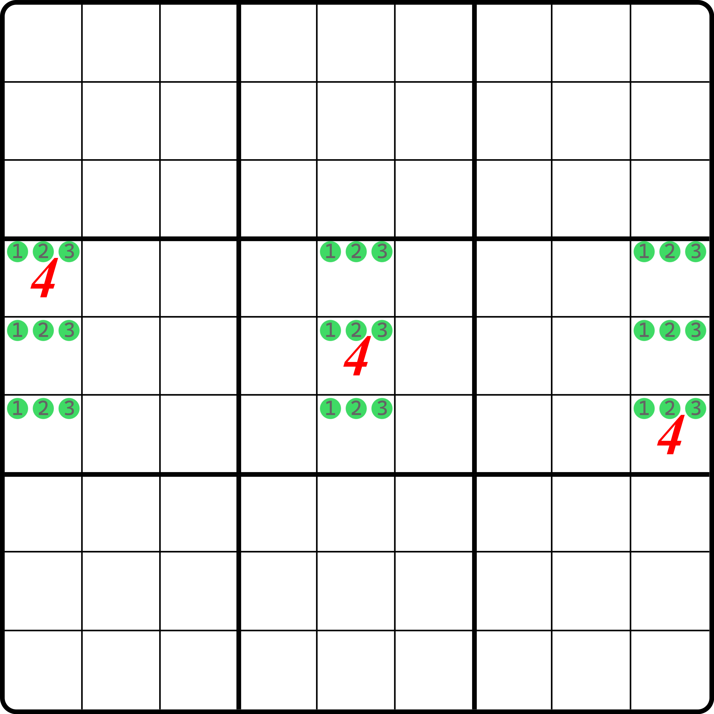<figcaption>
情况 4
</figcaption></figure>

如图所示。我们不妨就把 4 放在 `r4c1`、`r5c5` 和 `r6c9` 上。显然，余下的单元格确定不了，我们还是得继续讨论。

<figure>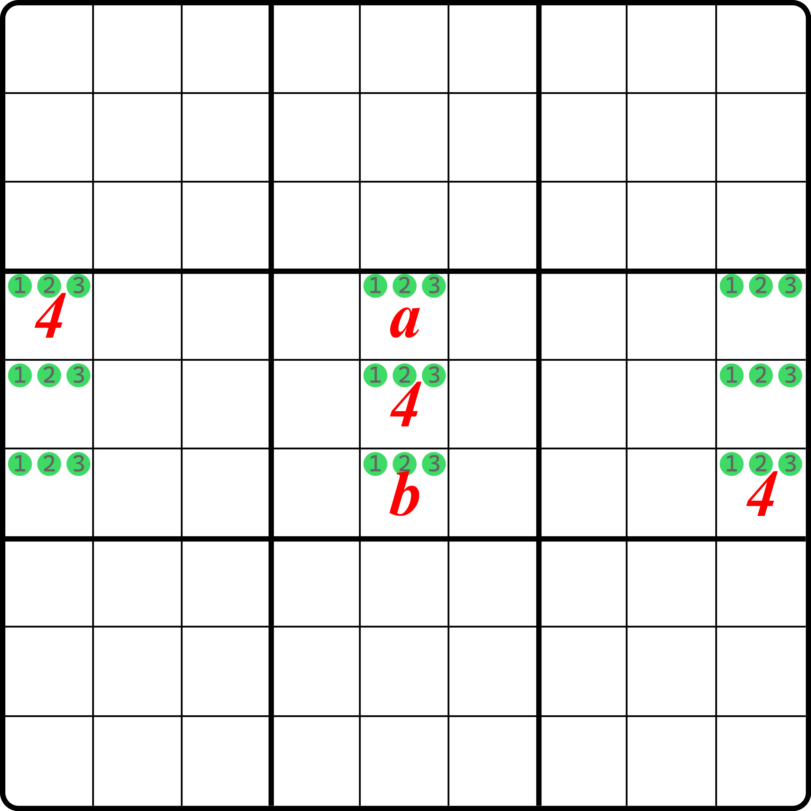<figcaption>
情况 4，假设 r46c5
</figcaption></figure>

如图所示。我们看到 `r5c1` 这里，如果 $$a$$ 填入就会让 `r45c15` 直接形成唯一矩形的矛盾，所以它只能填 $$b$$ 或 $$c$$，同理，`r4c9`、`r5c9` 和 `r6c1` 也都分别可以推算出来填入的数字。

* `r4c9` 只能是 $$b$$ 或 $$c$$（直接排除得到）；
* `r5c1` 只能是 $$b$$ 或 $$c$$（$$a$$ 不能填，否则唯一矩形矛盾）；
* `r5c9` 只能是 $$a$$ 或 $$c$$（$$b$$ 不能填，否则唯一矩形矛盾）；
* `r6c1` 只能是 $$a$$ 或 $$c$$（直接排除得到）。

因为 `r4c9` 和 `r5c1` 剩余数字是一样的，`r5c9` 和 `r6c1` 剩下的数字也是一样的，所以我们不妨配对讨论。这里讨论一边就行，如 `r4c9` 和 `r5c1` 这一对。这一对因为都是 $$b$$ 和 $$c$$，所以组合起来有 4 个情况讨论。我们挨个讨论一下就行。

<figure>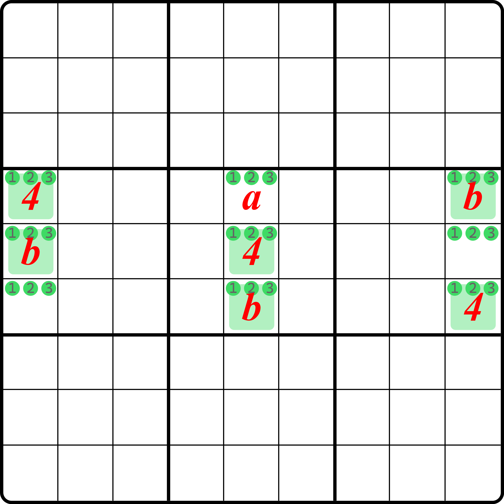<figcaption>
情况 4，子情况 1，r4c9 和 r5c1 都是 b
</figcaption></figure>

如图所示。这是子情况 1——让 `r4c9` 和 `r5c1` 同时填 $$b$$。这显然是形成了唯一环的矛盾。

<figure>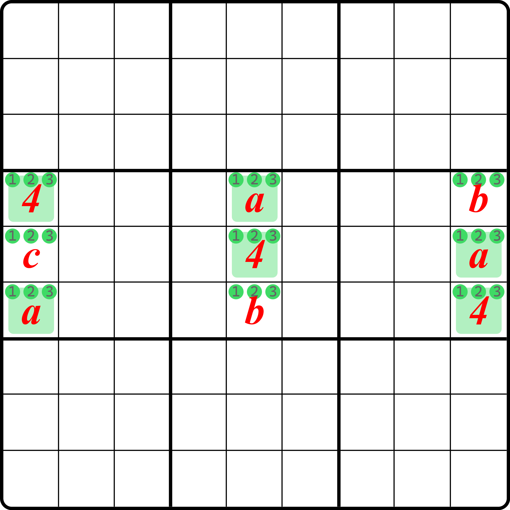<figcaption>
情况 4，子情况 2，r4c9 是 b，r5c1 是 c
</figcaption></figure>

如图所示。这样填了之后不难通过排除得到 `r5c9` 和 `r6c1` 都是 $$a$$ 的结果。然后就形成了唯一环的矛盾。

<figure>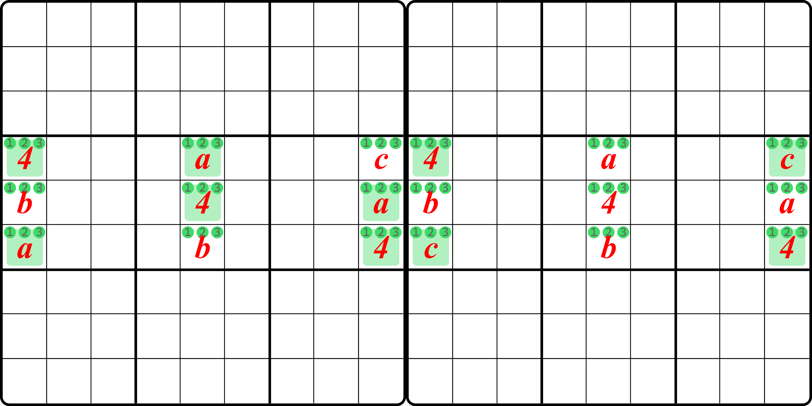<figcaption>
情况 4，子情况 3，r4c9 是 c，r5c1 是 b
</figcaption></figure>

如图所示。子情况 3 填入之后，`r6c1` 无法得到确切的填入情况。但是，此时两种填法必然都会走向矛盾。

<figure>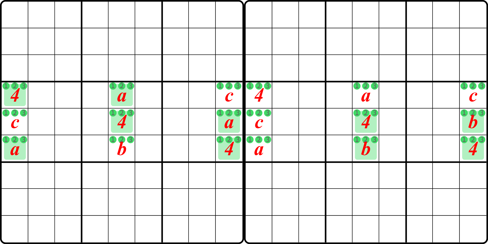<figcaption>
情况 4，子情况 4，r4c9 和 r5c1 都是 c
</figcaption></figure>

如图所示。这个情况也是都会导向矛盾。

那么可以看到，这个结构不论有几个 4，都会造成余下的单元格形成矛盾形态，所以这个结构是致命结构。

## 一个例子 

下面我们来看唯一的一个例子。这个技巧出现比较少，所以我库存就这两个例子（算上开头的那个例子）。

<figure>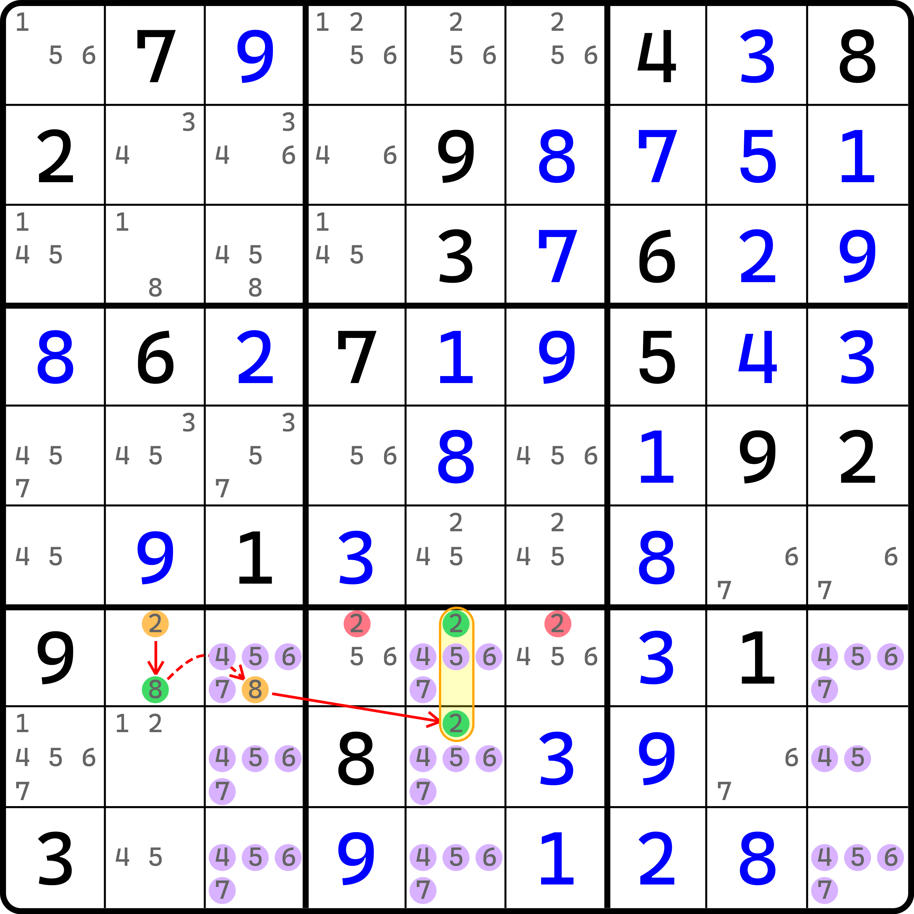<figcaption>
构造链的用法
</figcaption></figure>

如图所示。我们不难构造出这个链。尤其是 `8r7c3=2r78c5` 这个强链关系。因为两个节点同假的时候，余下的结构 `r789c359` 将构成唯一矩阵的矛盾，所以强链关系是成立的（不同假）。
