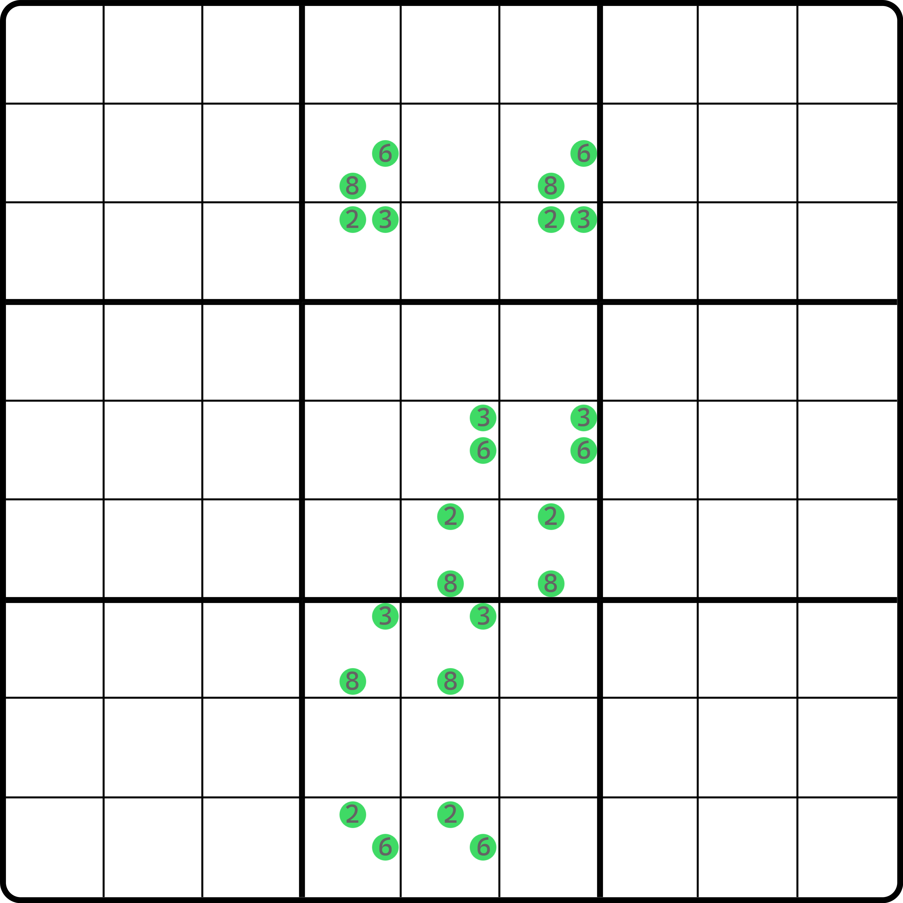
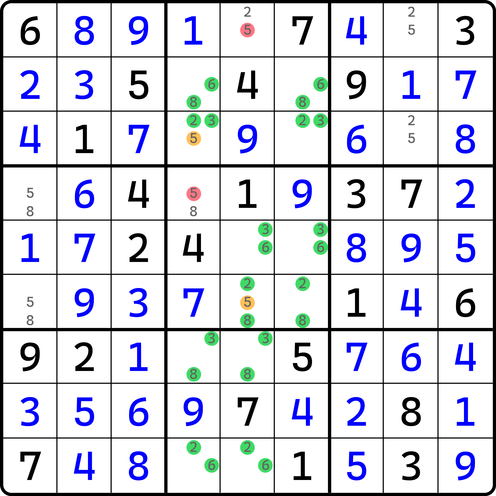

# 无解结构的判别

想要说清楚一个结构是否内部无解，我们可以穷举，但这样复杂度非常高，所以我们这里采用另一个办法。

## 结构的解的定义 

我们把一组候选数称为一个候选数集。在他们具备逻辑上的关系的时候（如可以通过强弱关系推导到彼此上去，或者组合在一起形成新结论的情况，如数对、数组、X-Wing 等等），就称为一个结构。

当一个结构具备稳定的填数可能性的时候，我们就把结构的填法方案称为**结构的解**（Solution to Pattern）。

> 填数方案的“方案”一词的英语也可以翻译为 solution。但在数独里，大多数时候 solution 都翻译为“解”，所以这里我们也延续这个翻译，将这个说法翻译为“解”。

绝大多数时，结构都是具备至少两个解的。具备唯一解的结构一般都不被当成结构来看待，因为它内部是只有一种填法的，也就意味着每一个位置都是具备明确真假性的结论的，因此单独讨论只有唯一解的结构是没有多大意义的，所以大多结构都具备至少两个解。

但是，也不乏存在一些情况下，结构需要通过“规避死局”的思路去证明一些东西，所以守护者、死环，甚至全双值格致死解法等等类型的技巧就出现了。他们往往依赖于额外的候选数，通过反过来得到他们为真的方式来决定下一步的过程。但是，单独去看结构本体（而不是这些额外的候选数时），内部是无法填数的。或者说，你找不出一种填数方案能让结构稳定下来，满足数独基本规则的填法。这种就是无解结构，即解的数量为 0 的结构；而守护者、全双值格致死解法（如果他们都只看不包含额外候选数的那一部分）的解的数量都是 0，所以他们都是无解结构。

无解结构和有解结构的区别只在解的数量上，其推演过程依赖什么实际并不是很看重。比如说链理论里我们介绍过环的思路，它只具备两种填法，所以环的解数量是 2；但对于一些别的结构而言，比如唯一矩形，它的解的数量也是 2。他们显然不是同一种技巧类型，但这并不重要。这只是提一下解的定义罢了。

## 无解结构的充分条件 

无解结构的充分条件其实非常朴素：**如果一个结构里存在至少一个全强链死环（即全强链的回路，而且其长度是奇数），那么这个结构就是无解结构**。要注意的是，这里说的是充分条件而不是充分必要条件。既然只是充分条件，也就意味着你把这个说法倒过来用，即“如果一个结构是无解的，那么这个结构也必存在至少一条全强链死环”这么说是不成立的。这一点我们将在之后详细说明，它的不成立并不是来自于这个说法本身，而是技巧的动态性。

就这么简单。虽然说起来简单，它确实解决了不少我们之前可能会有的疑问，最需要说明的是，之前传递的内容里留下的那个结构为什么是无解结构。我们现在知道它内部有全强链死环了，所以我们只需要去找全强链死环就行。

<figure><figcaption>
无解结构
</figcaption></figure>

如图所示。这个结构是无解的，因为我们随意就可以找出一条全强链死环。比如下面就是其中一条长度 13 的全强链死环：

<figure><figcaption>
无解结构里的其中一条全强链死环
</figcaption></figure>

如图所示。之所以说“其中一条”，是因为这个结构里很明显还存在别的全强链死环。不过我们只需要找到一条就行了。

## 为什么找到一条全强链死环就行？ 

既然如此，那为什么随便找到一条全强链死环，就能知道结构无解了呢？原因其实不难想到。因为全强链所用到的环路是无法填数的，它既然藏在一个结构里作为它的“子集”（其中一部分）存在，那么其他位置不论怎么填数，你都无法改变全强链死环这些候选数无解的事实。这个无解是客观存在的，就是说它不会受到你外部任何候选数填数组合的影响，它如果能死，就必定会死，毕竟我们可是用的奇数环路全强链，从数学角度严谨证明的。

## 全强链死环的特性 

全强链死环还具备一个特性。因为它所有的相邻节点都是同区域（同数）或同单元格（不同数）的，所以一定能互相看见彼此。换言之，它并不会利用类似待定数组那样去创建不同单元格还不同数字的无法直观看出结论的强链关系。这意味着，任意相邻的两个节点，从上帝视角来看就一定是一真一假。

我们说过，强链和弱链关系的定义是不同假和不同真，所以一真一假理应既符合强链关系也符合弱链关系的定义。那么，我们不妨随意从一个节点切入，从链理论的知识点也可以发现这个死环的问题。

我们把其中任意一个节点固定下来（作为锚点不动它），然后把它引出的两头的强链关系改成弱链关系。因为是环路，所以任何一个节点都有两个强链关系对接到它。而环路是奇数长度，所以就算去掉它俩，余下的强链关系的数量仍然保持在奇数（原始强链关系数 $$n$$ 是个奇数，去掉俩之后 $$n - 2$$ 显然还是个奇数）。而且，我们还知道，这个死环的任意相邻节点都是既符合强链定义也符合弱链定义的，所以我们还可以这样干：我们从刚才初次改成弱链关系的那个不是“锚点”的那两个节点分别作为开端和结尾，然后交替将强链关系重新诠释为强链关系、弱链关系、强链关系、弱链关系，一直这么排列下去。因为余下的强链和弱链关系总数是 $$n - 2$$ 仍然是个奇数，所以强链关系起头也就能得到强链关系结尾。

但是，这么改了一下之后，这个全强链死环就被我们改成了普通链（可能是不连续环，也可能是头尾异数链，也可能是普通的链，无所谓）。普通链的删数是删链的两头都看得到的候选数。对于全强链死环改成的普通链而言，其实删数至少会存在一个，那就是最开始的“锚点”。

就比如上面这个例子，我们不难把它改成这样：

<figure><figcaption>
全强链死环改成普通链的流程
</figcaption></figure>

如图所示。从最左边这个图开始，我们拿 `r9c4(6)` 当“锚点”举例。把它当成删数，然后两端的强链改成弱链关系（这里也可以不用画，因为这里是普通链了，只是逻辑上改成了弱链关系）。然后，把余下链路上的强弱关系改成交替出现（就成了中间这个图）。最后擦除没用的候选数，就会变为最右边的图了。

很明显可以看出，如果是全强链死环，那么环路上所有的候选数都可以这么干，于是这些候选数每个都会被这个对应改成的普通链给删掉。这样环路上的全部候选数都会为假。这肯定不可能出现，甚至可以说这种自相矛盾都有些过于离谱了。

不过我不是打算说这个的。因为全强链死环大多都需要有额外候选数参与辅助（以证明这些额外候选数为真），充当守护者的角色。所以，正常的题目里找到的全强链死环都会搭配这些额外的候选数才会形成。

我们不妨回到全双值格致死解法这个技巧里去。我们之前说过，全双值格致死解法用到的是盘面上的余下全部空格。它其实本质上就是一个超大型的全强链死环；对于类型 1 而言，其实也就多了那么一个真数，即这里说的所谓的守护者。

<figure><figcaption>
全双值格致死解法，之前的例子
</figcaption></figure>

这个是我们之前介绍全双值格致死解法里的例子。当时我们是说这个 `r8c9(1)` 是必须为真的。现在我们知道，因为盘面上余下的空格如果没有这个 1 为真，就会必然死局。从结构的角度来看，它就是无解结构。刚刚说过，无解结构的充分条件是里面藏着至少一条全强链死环，那么，对于全强链死环的类型 1 而言，那个多出来的额外数字，其实就是全双值格致死解法里的那个真数。换言之，**在具有全双值格致死解法的题目里，也必然存在一个全强链死环技巧**。

不难发现，我们随便就能找到一个全强链死环类型 1 位于盘面之中：

<figure><figcaption>
这个例子里藏着的全强链死环类型 1
</figcaption></figure>

如图所示。不难发现，这个题里藏了一个全强链死环。

另外，我们不妨把这个环路的 `r7c9(1)` 这里当成删数断开它，然后按前文描述的那样，将环路改成普通链，只是把 `r7c9(1)` 此时当成“锚点”看待，不难得到从 `9r7c9` 出发、到 `1r6c9` 结束的不连续环删除 `r7c9(1)`。

所以，我们还能发现如下的特性：

**全强链死环类型 1 也可以通过找出和守护者同在一个区域的、位于环路里的候选数，并将其视为“锚点”之后，它一定能被删；所以全强链死环类型 1 可以通过此办法改成一个链（不过是不连续环、是普通链，还是头尾异数链就不好说了，这个取决于结构的摆放的模式），即等价存在一个链。**

而全双值格致死解法类型 1 必然存在全强链死环类型 1 的结构用以删数，所以：

**可用全双值格致死解法类型 1 的题目，也可以找到“等价”的链**。

> 这里说的“等价”指的是以删数层面相同、结论和效果上不会造成不一致而走向不同的过程。如某个区域里只有两个可填 1 的位置，那么此时“位置 $$A$$ 的候选数 1 为假”和“位置 $$B$$ 上的候选数 1 为真”就是等价的结论，因为你删一个数和出另外一个数其实是一个意思；而“找到的链等价”就是说产生了这两种等价结论的链。

而且，全强链死环由于任意一点均可断开并得到自身可删的荒谬矛盾，所以**只要能有全双值格致死解法的存在，那么真数所在的区域上的同数字、或者和真数同在一个单元格里的别的候选数，只要在全强链死环上，就一定能从全强链死环的层面得到可删结论。**

比如说，上面这个例子里的全强链死环里，和真数相关的候选数只有 `r7c9(1)`，所以从全强链死环的角度而言，可以找出等价链的就只有它这一个候选数，因为别处都连不起来（`r7c9(1)` 同宫还有个 `r8c9(1)` 作为真数出现，所以绕不过，强链无法交替传导过去），因此只有它能用作删数。

## 无解结构是否是致命结构？ 

一个直击灵魂的问题是，无解结构到底属不属于致命结构理论的一大成员？如果不属于的话，为什么非得放在这里花篇幅讲这个？

这个问题对于不同的人的理解有所不同，因此看待起来也确实不太一样，所以它并不是一个是或否的结果这么简单。如果说它是，但是它内部没有解；如果说它不是，那它的各种子类型用法和结构的排列却又那么像是致命结构才干得出来的事情。从定义上符合与否确实是可以直接断言它是或否的决定性因素，但难免会存在一些分类困难的情况，定义层面不符合，但不归纳进来也容易造成后来人学习和分类上的不便。

### 弄清楚无解结构的各种分类 

要想确定它的分类，我们需要把无解结构的所有分类情况都看一看。

无解结构分为守护者、死环、全强链死环、三值死环以及全双值格致死解法这些情况。可从守护者、死环和全强链死环这几个技巧看出，它显然不符合一个致命结构具备的基础特征的那点“内部任意排列填数都不影响盘面其他位置的填数情况”。比如说死环，死环涉及单元格数量是奇数个的双值格的环路，且每个格子都是相同的候选数。因为它是奇数个单元格，除了意味着必定同区出现相同数字外，还有个更严重的问题是，它可能会存在某个区域下，只有一个单元格的情况。这样它填入不同的数字就会影响到盘面外的空格的状态。所以，显然他们都不属于致命结构。

但是，对于全双值格致死解法以及三值死环而言，这个问题可能并不会那么好解答。先说结论：**无解结构从定义上确实不符合致命结构的特征，所以不能归纳到致命结构里；但对致命结构在论证其中一些必需内容来说（如判别解的数量），他们确实应该有一席之地。**

### 无解结构带来灰色地带 

这里最“灰色地带”的其实是，我们作为人类是无法预先知晓它是否是无解的结构。我们只能先试着通过全强链死环的判别走一遍，才能知道它是不是。更何况，稍后我们还要说的三值死环实际上是通不过判别的。

先来说全双值格致死解法。首先和刚才说的一样，它一眼就是看不出来是否是有两个及以上的解的数量，你必须得试填（或者去找全强链死环）才知道；其次，它会用到场上余下&#x7684;_&#x5168;&#x90E8;_&#x7A7A;格。这个“全部”就厉害了：全部空格都是结构的一部分，这意味着致命结构的“不影响其他单元格”的这个“其他单元格”在这个技巧里根本就不存在。或者你也可以理解成“压根没有格子可以影响”不也是一种“不影响其他格子”的特殊情况。

在之前的教程内容里，我们明确区分了负秩结构和无解局面。当时我用的词语是“无解局面”而不是“无解结构”，想明确表达的是引发盘面层面状态的无解；但全双值格致死解法理应被看成是一个结构，只是它用了盘面全部的空格而已，但总体来说侧重点就是不太一样。而且，它确实可以从概念上使用了“会造成题目双解”的方式来反证得到矛盾，从这种说辞上也确实可以认为是利用了唯一解的规则。如果你说它不是致命结构的话，反倒我们需要从全强链死环的方式进行切入，显然它和我们最初的推理过程有明显的不同。

然后，三值死环刚好打破了“是无解结构就必存在至少一个全强链死环”这个说法，也就是把之前对无解结构的充分条件的描述倒过来说的机会（无解结构的必要条件）。那三值死环咋就打破了呢？因为这个技巧用到的所有 12 个单元格均是三值格。三值格意味着你没办法找出强链关系，以构造出全强链死环的那种“相邻节点是强链关系”的特性。那这是条件本身的问题，还是三值死环的问题呢？其实是结构在证明期间需要进行分情况讨论的问题。也就是说，三值死环打破了这个规则的原因，单纯是因为它有分支。我们知道，全强链死环说明结构无解的思路是没问题的，但它的限制条件在于它只能形&#x6210;_&#x4E00;个环路_。这个“一个环路”包含两层含义：

1. 一个：它得是一整个结构，不能被拆分；否则拆分开之后，子结构和子结构之间是否有关联，还需要我们进行分情况讨论（比如说真假性的排列组合）；
2. 环路：它得是一个从头到尾拼接完整的环路，不能是断开的；否则头尾断开我们也无法判断他们的关系是否能形成矛盾。

三值死环要证明其结构无解，必须要走分支才能得证。分支意味着你必须把三值格拆成子情况进行挨个讨论，这样环路就不止 1 个。最多因为结构的对称性，用字母描述会比你直接讨论数字的排列会更省事，但最终你还是逃不了分情况讨论。

“存在全强链死环”只是给你了一个可以找出无解局面的切入视角。换句话说，你要证明结构是否无解，你还是只能穷举全部可能的排列，然后发现这个结构就是找不出来解。只不过，这种穷举在一些技巧里是明确看得出来的，比如守护者。守护者技巧拿掉那些额外候选数后，会形成奇数长度的强链关系构成的环路，而数学上严格证明了这种情况直接是不可能有解的，所以我们才可以大胆使用它来快速判断。所以其本质还是在穷举，只是有些技巧有可切入的方式，绕过了穷举罢了。我们总归是人类，我们不可能达到计算机那样对结构的全情况排列。小一些的结构还行，大一些的估计不行。比如探长致命结构，如果只有两种数的时候，它会退化为 6 个单元格的唯一环，这种唯一环只有两种填法；但三数的探长致命结构包含 24 个解；更甚者，四数探长致命结构包含 384 个解。这个数量级显然不是我们能快速判断得到的，我们只能用数学手段去规约，简化我们的穷举。

所以，判断无解结构的本质仍然是穷举是否有解。如果你把它当成判别的重点的话，那么我相信你就可以明确知道致命结构和无解结构的关系到底是包含，还是有交集，还是完全没有关系了。

至此，我们就把全强链死环和无解结构的内容介绍完了。下一节我们将继续探讨更复杂的致命结构的内容。

## 局部全双值格致死解法（Bivalue Universal Grave Lite） 

无解结构可以看出，它要么是属于全强链死环这种，跟致命结构一点不沾边的情况，要么就是全双值格致死解法这种，看起来非常像是致命结构（多解的那种）。

实际上，在外国的数独圈子里，对于全双值格致死解法这种看起来一眼判别不出来的、除了无解不符合致命结构的特征外，其他均符合的特殊结构，他们称为**轻量级全双值格致死解法**或**局部全双值格致死解法**（Bivalue Universal Grave Lite，简称 BUG Lite）。最典型的例子就是之前我们看到的，那个错误传递的结构。它在实战里是确实有这种题的。

<figure><figcaption>
局部全双值格致死解法
</figcaption></figure>

如图所示。这是一个之前结构的实体例子。

这是类型 2。如果 `r3c4(5)` 和 `r6c5(5)` 同假的话，这个结构将矛盾。所以删掉两个 5 可以看到的地方。
