# 正确地使用传递

前面的内容我们已经足够充分地了解了传递的原理是通过枚举一个可能的致命结构的所有可能的解，然后去校验是否有造成影响。那么如果穷举的话，大多数时候我们都无法去做。所以我们需要一个恰当的、简单的方式去找传递。

下面我们来看看如何去找传递。

## 学会找传递媒介 

所谓“传递媒介”，它并非是一个术语，它表示的是在传递过程之中我们用于替换的中间单位。这个传递过程的本质是去找简化路径，将一个大结构简化为小结构，直到足以判断为止。

举个例子。假设我们有个这个东西：

<figure>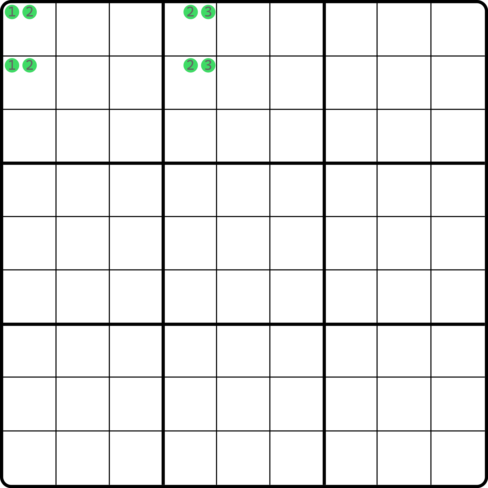<figcaption>
引例
</figcaption></figure>

我们可以看到，它其实是一个就差一对形成的拓展矩形。

假设这个结构藏匿于一个拓展矩形里，那么很明显它还需要补充一对 1 和 3 的数对在 `b3` 里，对吧。但是，我们证明这个结构形成致命结构的矛盾的必要一步是去穷举结构的排列。为了便于我们轻松去定位排列的可能性，我们经常会使用检查数字摆放方向的方式来分情况讨论，也就是之前我们经常描述的横放、竖放和斜放这三种情况。对于此结构而言，1 和 3 只会稳定出现在 `c1` 和 `c4` 里（也可以说 `b1` 和 `b2` 里，随便）；反倒是这个 2，它有 4 个位置。显然按数独的规则，这俩 2 只能斜着形成类似于二阶鱼那样的对角线分布的状态。于是，整体这个 1、2、3 的填数组合就会有这些：

* r1c1 = 1、r1c4 = 2、r2c1 = 2、r2c4 = 3；
* r1c1 = 2、r1c4 = 3、r2c1 = 1、r2c4 = 2。

穷举的思路是这样。但是，如果我们将结构单独拆成看 `c1` 的 1、2 数对和 `c4` 的 2、3 数对的话，我们始终会发现，2 的位置是稳定的，而 1 和 3 位置不稳定。这里的“稳定”想说的是，怎么换其实都跟唯一矩形那样不影响外部的格子。因为数字 2 必须填两个，还是不多不少的两个，所以它一定要么左上角 `r1c1` 和右下角 `r2c4`，要么右上角 `r1c4` 和左下角 `r2c1`。但是，组合起来就会发现，2 填的两种情况下，`r12`、`c14` 和 `b12` 这 6 个区域（也是 `r12c14` 所有四个格子所涉及的全部区域）下，2 都会稳定出现。既然 2 都会出现，那么这个 2 就是可有可无的。这个可有可无的概念我们可以先放一边稍后再说，我们再来对比看看 1 和 3。

再看数字 1 和 3，就会发现它俩不是稳定的。因为 1 和 3 都只能填 1 个。对于 1 而言，要么这个 1 填在 `r1c1`，要么就填在 `r2c1`。显然，在 `r1c1` 上和在 `r2c1` 上是不一样的情况。因为 `r1c1` 会影响到 `r1` 的别处；但 `r2c1` 则影响的位置就变为了 `r2`。这和唯一矩形里填两次不影响外部单元格的情况不同。这意味着，1 最终的位置无法确保稳定性，进而无法进行致命结构论证矛盾的推演，所以我们说，数字 1 是不稳定的；而数字 3 也同理，只是换到了 `c4` 这两个格子而已。

接着，我们最开始假设它藏匿于拓展矩形里，那么拓展矩形要让结构能真正形成致命结构那样的矛盾，这个 1 和 3 的影响就必须要规避，使得它俩也能像 2 一样不影响外部的格子。从结构的角度来说，1 和 3 也需要稳定出现两次形成二阶鱼那样的分布才能规避影响；而恰好的是，拓展矩形很好地提供了这一点补救。

> 之所以说“补救”，是因为我想让你用传递的视角去理解它。它这里其实是稳定的 2 外加不稳定的 1 和 3，再在外部添加了两个单元格，使得 1 和 3 恢复稳定的填数，使得全部数字都稳定。以这个视角去看。而不是让你用穷举的视角去看。

那么，如果的图中的 `r12c14` 位于某个大结构里，要判断是否整个结构致命与否，我们就可以利用这一点，将补救措施给用上，让不稳定的部分参与推理的时候能稍加简化一下，避免大型讨论。就比如这里的 1 和 3。因为 2 是稳定的，所以我们拿来当传递媒介。这就是我前面想说的可有可无。因为余下的 1 和 3 不稳定，所以我们得想办法简化的时候，让 2 这种稳定的数字干脆就不要了，而只保留 1 和 3 的这个不稳定性。1 和 3 的不稳定体现在行上，所以我们不妨拿一个竖着摆的 1 和 3 的数对来体现。

<figure>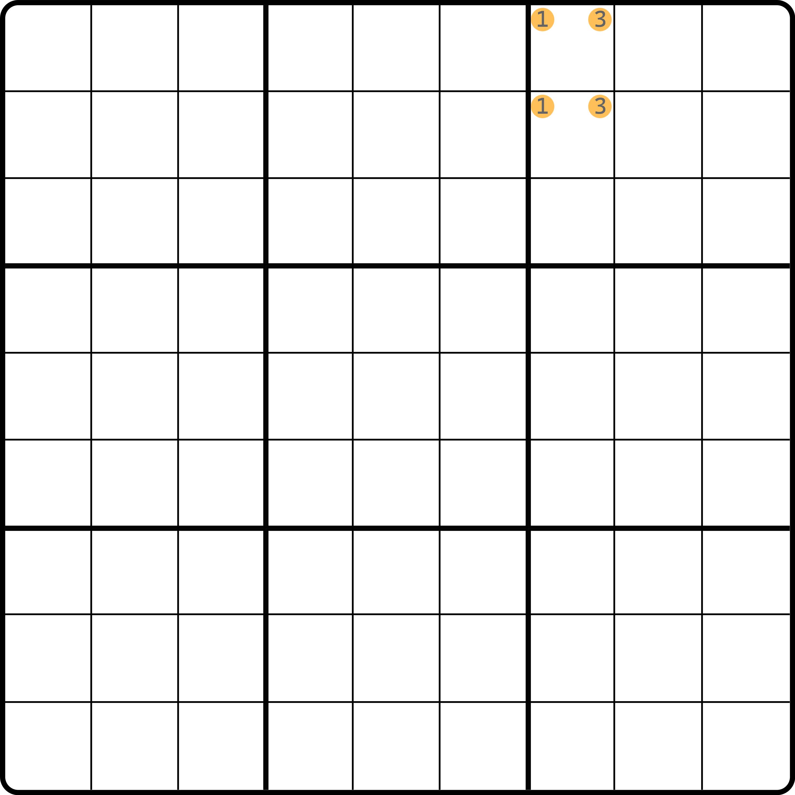<figcaption>
传递出的竖着摆的 1 和 3 数对
</figcaption></figure>

如图所示。那为什么是 1 和 3 的数对，还得是竖着放呢？因为竖着放的 1 和 3，才刚好和原本 1 和 3“影响了行上的格子”的这种不稳定保持一致。竖着放的 1 和 3，因为 1 和 3 要么是上面是 1 下面是 3，要么上面是 3 下面是 1，所以 1 的实际位置要么在上面要么在下面，只能填一次。这个效果和原本 1 和 3 不稳定的本质是完全一样的。而 3 也是如此。但是，2 因为是稳定状态，所以我们不妨直接干掉这个 2（反正它怎么排列都是稳定的），干脆我们就少讨论一个数。

也就是说，我们将最终这 4 个格子改成了两个竖着摆的 1 和 3，这个过程美其名曰“传递出了一个竖着摆的 1 和 3 的数对”。不稳定性得到保留的同时，我们还降低了讨论的复杂度，这就是传递的核心。

## 一些例子 

下面我们来看一些实际的例子。

### 例子 1 

<figure>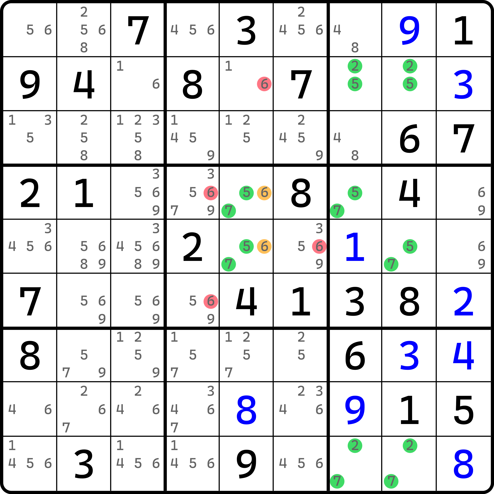<figcaption>
例子 1
</figcaption></figure>

如图所示。这个题目在之前出现过，不过当时我们是通过匿名致命结构的方式得到矛盾的。说实话，我们当时那种做法其实是单纯在背结构。我们来看看这个怎么传递。

<figure>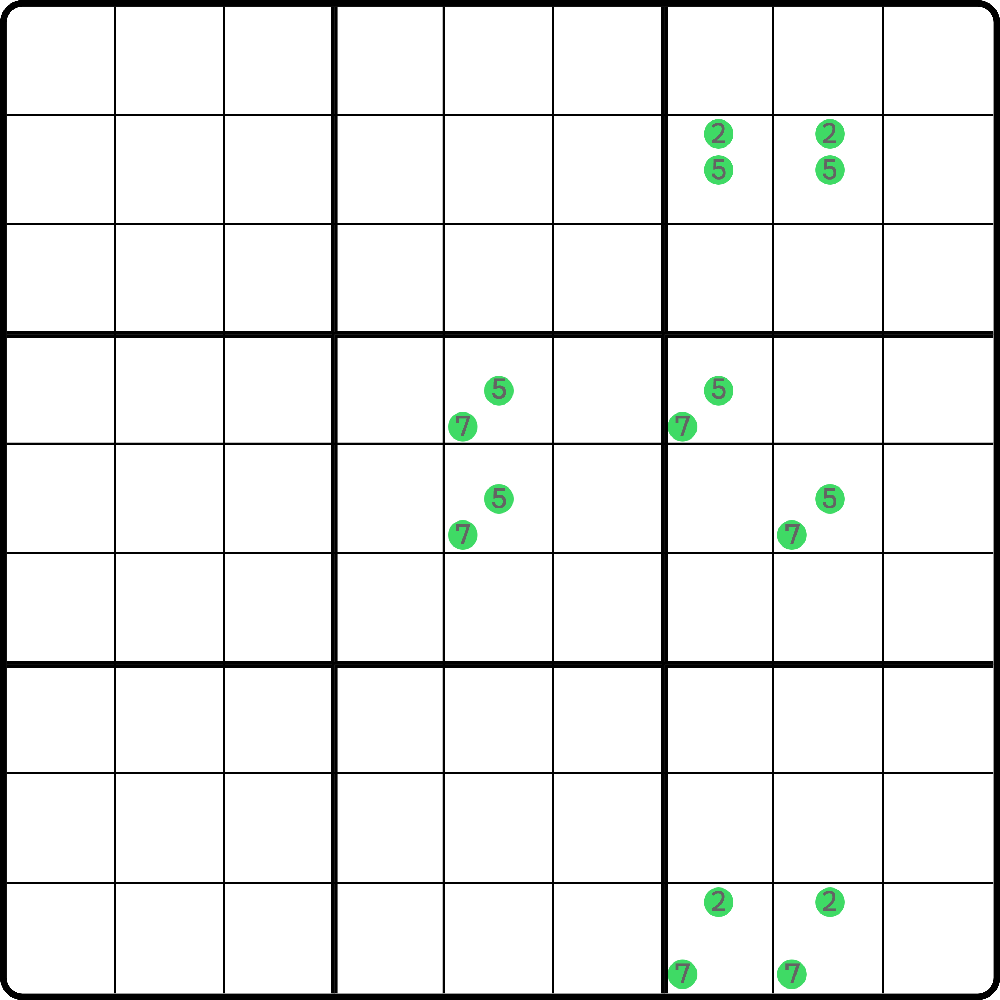<figcaption>
例子 1，结构示意图
</figcaption></figure>

如图所示。我们把结构提出。不难发现，中间的 `r45c5`、`r4c7` 和 `r5c8` 四个格子是唯一环的一部分，而余下的两个单元格可以传递为横向摆放的 5 和 7 的数对。但是因为放在 `b2` 或 `b8` 都会直接造成填数失败的问题，所以我们放到 `b5` 里。

这一步是重点。我们为什么可以这么传递呢？因为我们知道的是，我们这么做的目的是让复杂度降低。复杂度降低的做法显然是找出不稳定的数字看看都影响到哪里了，然后去找简化结构以和原本的这部分凑一起。可以看到，唯一环的这一部分四个单元格，造成不稳定的显然是 `b6` 里的这个数对。因为是数对，所以它必然只有两个填法：

* r4c7 = 5、r5c8 = 7；
* r4c7 = 7、r5c8 = 5。

不难发现，它影响到的是 `r45` 和 `c78` 四个区域。但是，由于 `b5` 里存在的这个数对很好地弥补了 5 和 7 在排列的时候横向出现的影响（因为你在组合 5 和 7 的填数的时候，`r45c5` 两个单元格也得填 5 和 7；而恰好他们在相同的行上，所以 5 和 7 都会稳定出现在 `r45` 上面，所以行上的影响被多出来的 `r45c5` 给规避掉了），所以这四个 5 和 7 整体只会影响到 `c78` 两个列区域。

于是，整个唯一环结构其实就只有影响到 `c78` 两个列造成 5 和 7 摆放不稳定的结果。我们拿一个横着摆放的 5 和 7 数对进行替换，因为横着摆放的数对显然会影响到列上，而他们同行又同宫，所以其造成的不稳定性和原本的这四个单元格是一样的，所以我们说，传递出了横着摆放的 5 和 7 的数对。于是我们有了这个结构：

<figure>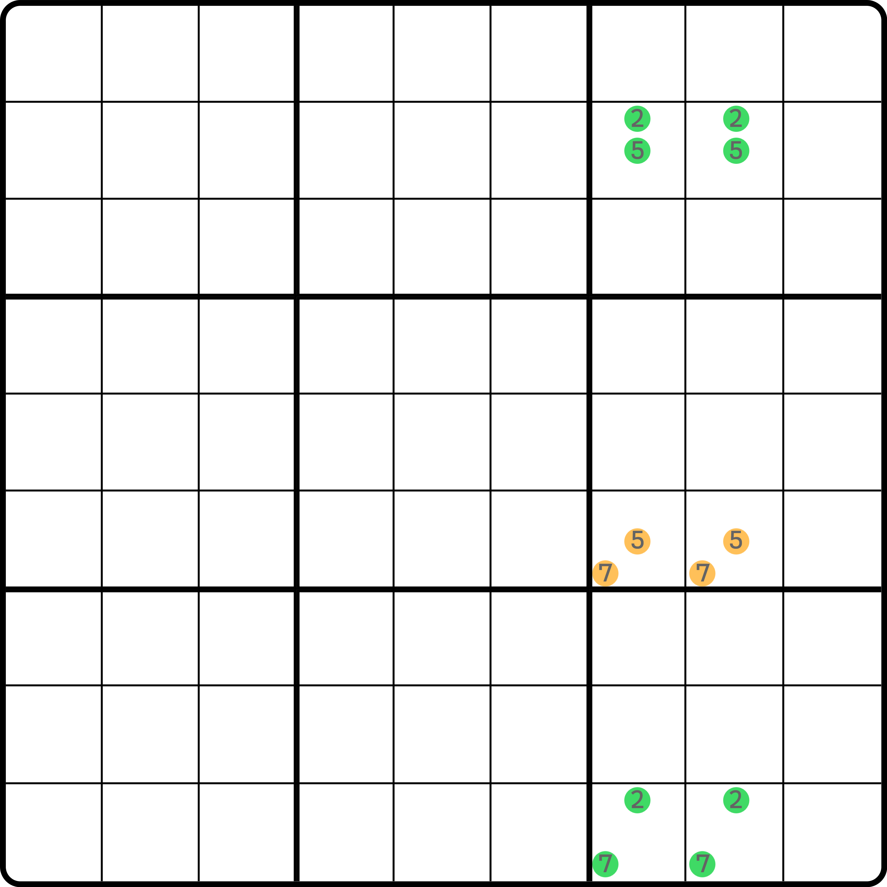<figcaption>
例子 1，传递结果
</figcaption></figure>

因为传递之后，它是一个拓展矩形，它显然矛盾（左右对应位置交换造成矛盾），所以原本的结构也是可以形成矛盾的，即是致命结构。

### 例子 2 

<figure>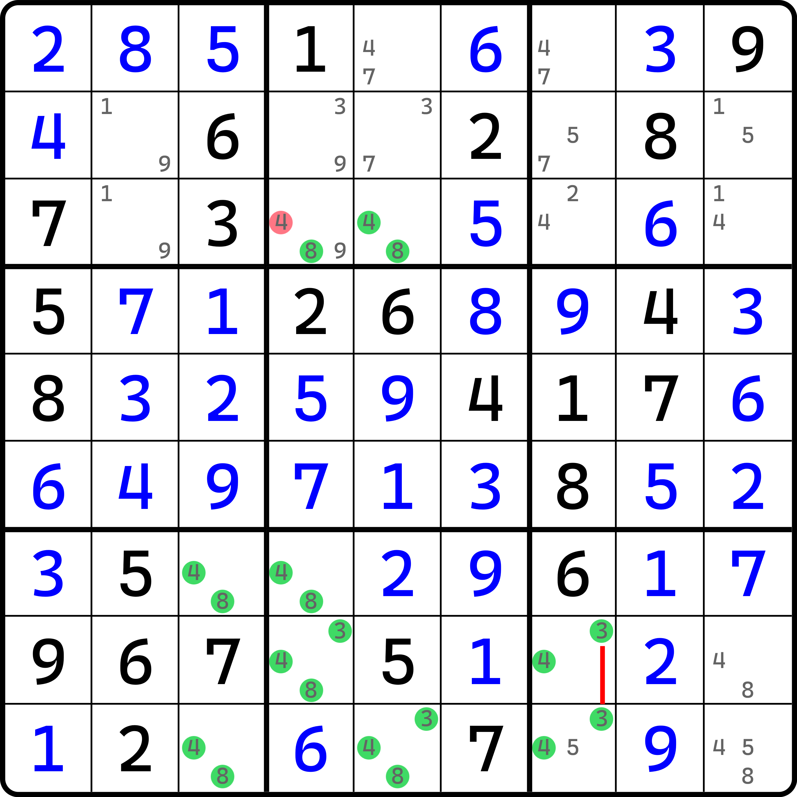<figcaption>
例子 2
</figcaption></figure>

如图所示。这个例子要尝试假设 `r3c4 = 4`，然后才能让结构形成矛盾。期间要借助一下 `c7` 上数字 3 的共轭对。

我们先把结构抽取出来。

<figure>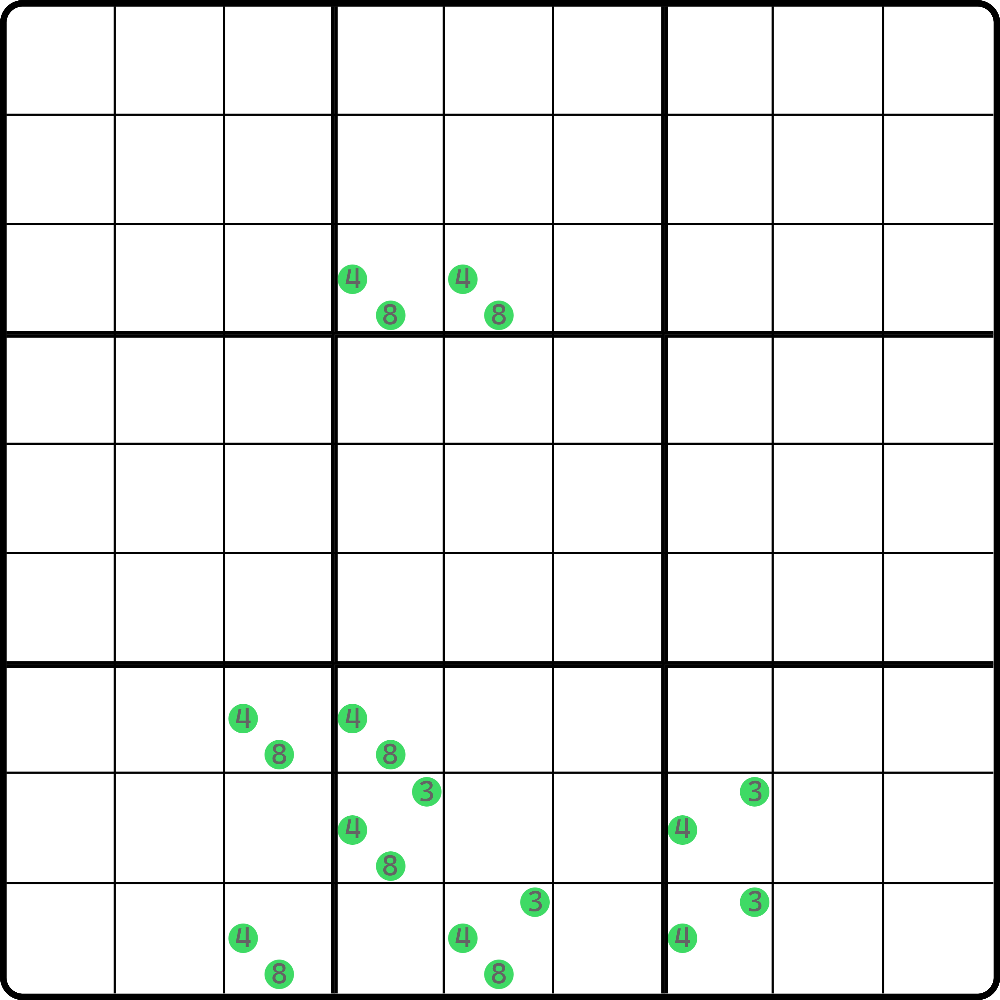<figcaption>
例子 2，示意图
</figcaption></figure>

如图所示。很明显，`c4` 出现了神奇的一幕：因为有 4 和 8 的数对，所以会必然造成 `r8c4 = 3` 的结果。我们继续的话，会得到这么一幕：

<figure>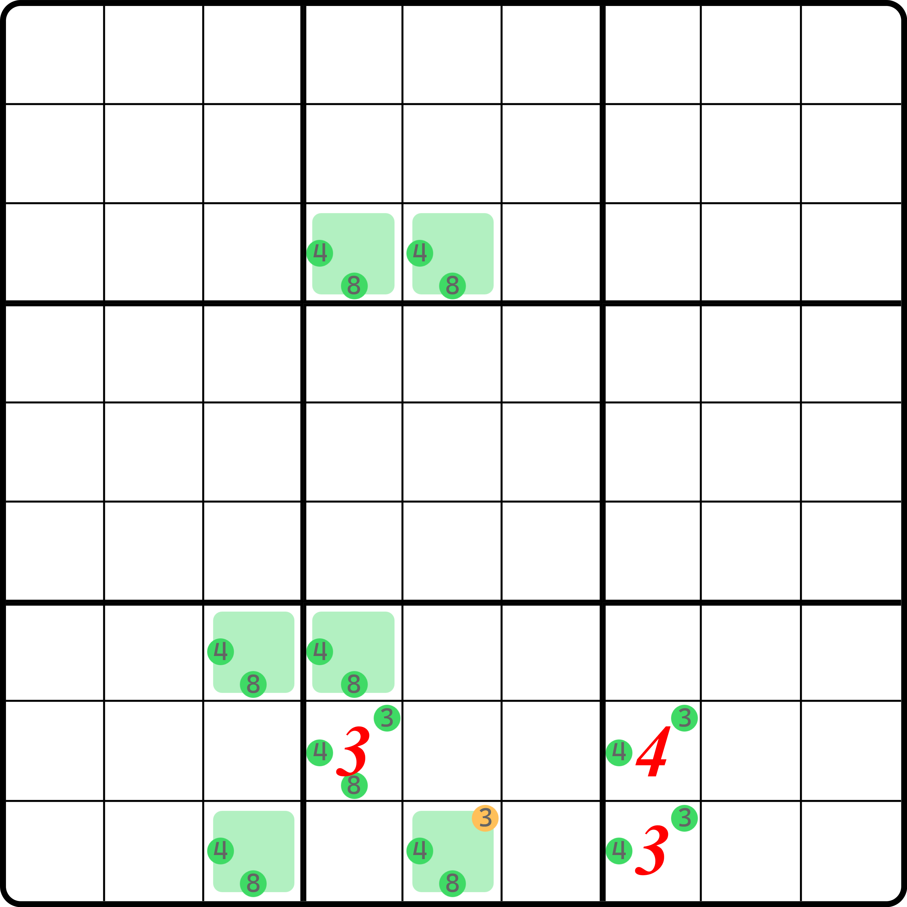<figcaption>
例子 2，唯一环造成矛盾
</figcaption></figure>

是的，它其实是唯一环 + 一部分固定路径的矛盾。

那它能不能用传递呢？比如说，可能有读者会想把 `r3c45` 和 `r7c4` 三个单元格传递到 `r7c5` 这个单元格上来，但是这是不对的。可以看到，在 `c4` 有两个单元格被用到。一个在 `r3c4` 一个在 `r8c4`。如果我们传递到 `r7c5` 的话，原本 `c4` 上的数对就不见了；取而代之的是 `r7c5` 这个格子。

我们说，传递的过程是保有原本应有的不稳定性，但是是降低复杂度的保有，这样才能简化结构讨论。但是，显然 `c4` 上原本形成固有填数的特征（数对造成 `r8c4 = 3` 的结论）消失了，这造成了前后的不一致。所以这个传递是不对的。

那我们能将 `r7c34` 和 `r9c3` 传递成 `r9c4` 单元格的 4 和 8，可以吗？很好。是可以的。为什么这回又可以了呢？因为这几个 4 和 8 的单元格占用的区域是 `r79`、`c34` 和 `b78` 这 6 个。其中，`r7`、`c3` 和 `b7` 是都包含数对的，这些区域下，4 和 8 的出现是稳定的；但余下三个区域则不稳定。

如果我把它传递为 `r9c4` 的话，那么它影响的范围仍然是这些位置，而不影响的（稳定出现的）4 和 8 的那三个区域就不关心了。这么看起来确实是等价的。于是结构就会变为这样：

<figure>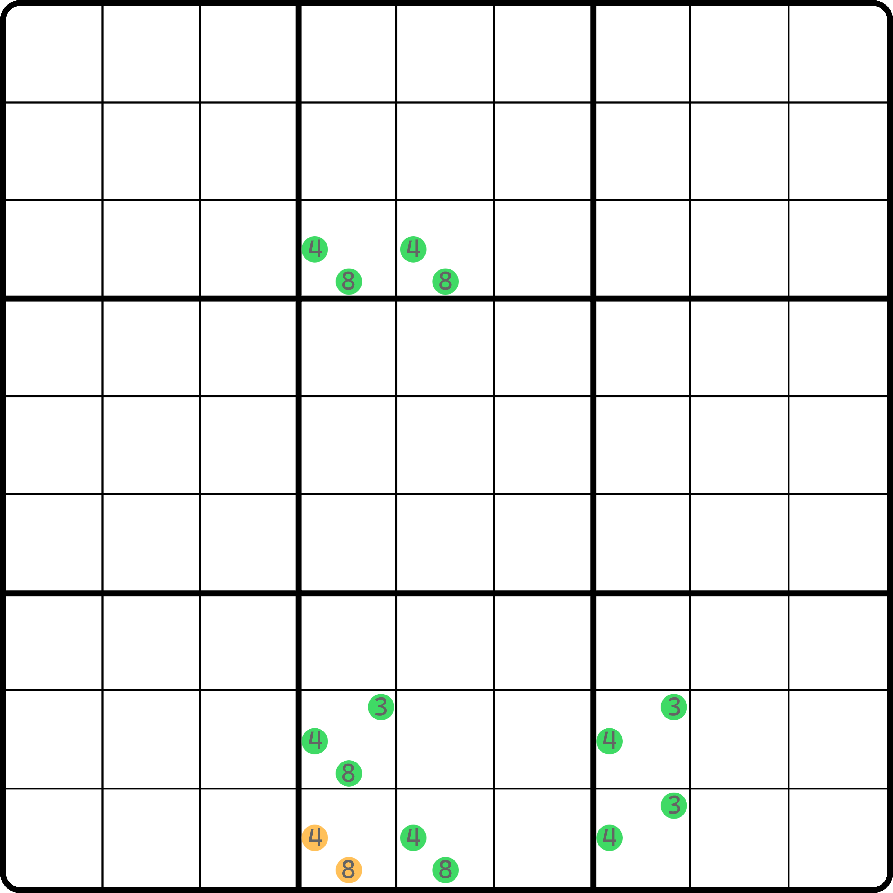<figcaption>
例子 2，传递唯一矩形到一个格子上
</figcaption></figure>

于是，我们就将结构改成了这样。显然，原本能造成 `r8c4` 出数 3 的特征居然这一步传递之后都没发生变化，这个传递已经到了这么丧心病狂的地步了。

不过话说回来，这么看的话，这个结构其实也是致命结构。因为它是 3 个数的探长致命结构。因为它是致命的，所以原本结构就也是致命的。

那么它为什么会直接内部形成出数呢？其本质原因在于，我们是直接将结构抽出来看的。它用到的一些额外的东西我们并未在单元格的候选数上体现，比如 `c7` 的共轭对，比如 `r3c4` 还包含其他候选数。这些其实不能忽略的地方被我们忽略了。这里说的不能忽略，并不是说忽略了就成错的逻辑了，而是说忽略的地方才会造成这种特殊现象得以存在。不信的话你可以回去看看，`r3c4` 原本还有 9 呢，所以原本这里就不能因为 4 和 8 的数对而出数；而是我们假设了 4 填入才造成的出数罢了。

### 例子 3 

<figure>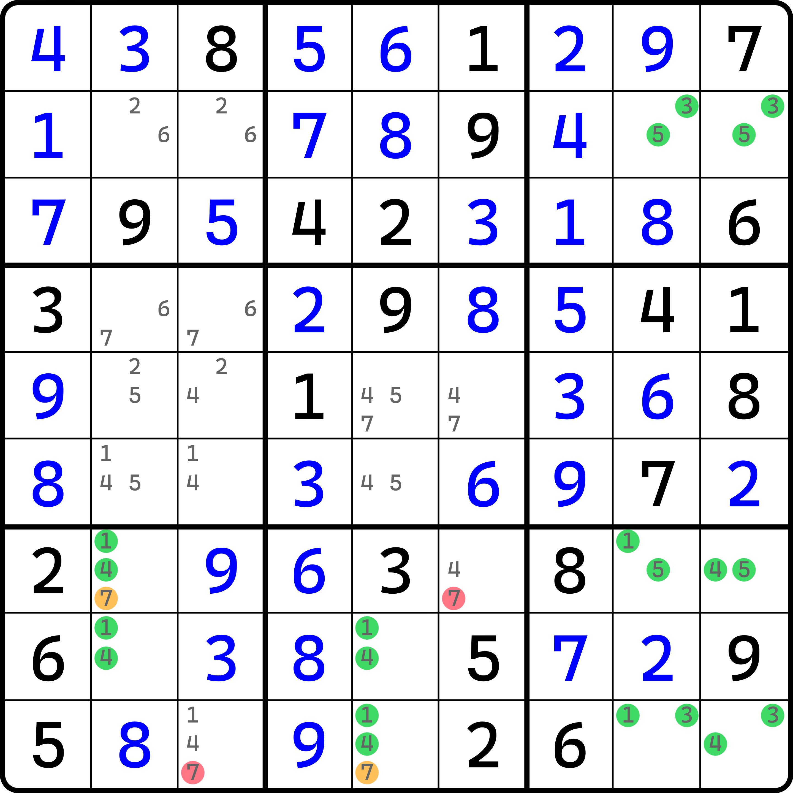<figcaption>
例子 3
</figcaption></figure>

如图所示。这个例子看起来有点复杂，不过也不难。它是唯一环 + 探长致命结构的融合版本。

我们先要搞定的是传递出一个什么。

<figure>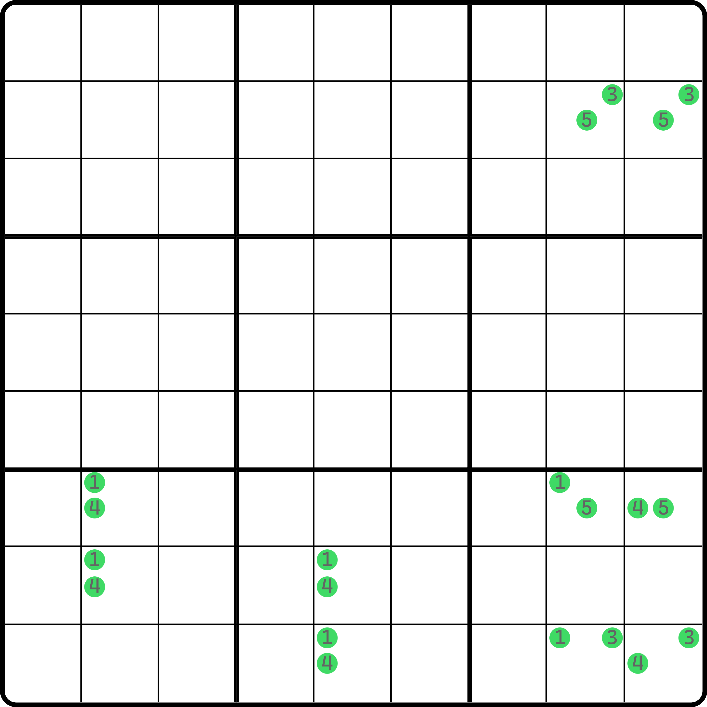<figcaption>
例子 3，示意图
</figcaption></figure>

如图所示。

很容易我们可以找到的是，唯一环可以传递出 1 和 4 竖着放的 1、4 数对结构。比如说这样：

<figure>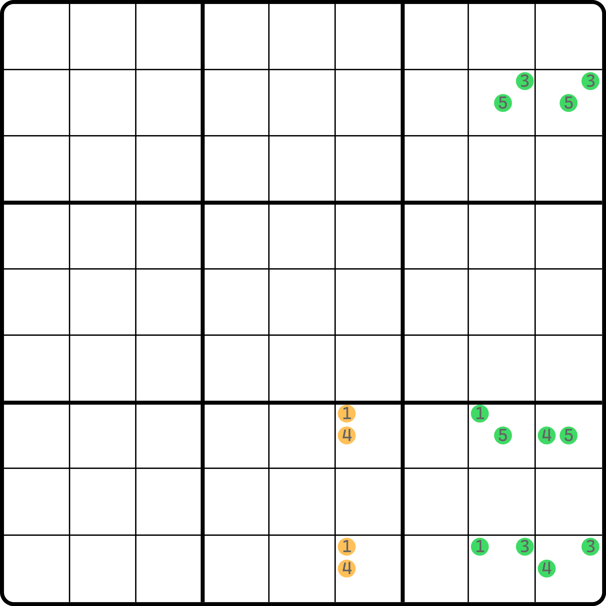<figcaption>
例子 3，用唯一环传递出竖放的数对
</figcaption></figure>

如图所示。这样探长致命结构就形成了，于是这个结构致命，所以原来的结构也是致命的。

我们来简单说一下为什么这里可以传递。因为唯一环这部分的 1 和 4 比较特殊，它一共用了 7 个区域：`r789`、`c25` 和 `b78`。其中，`r8`、`c25` 和 `b78` 这 5 个区域不受影响（始终会有稳定的 1 和 4 出现），所以只有两个区域 `r79` 不会稳定出现 1 和 4。然后，我们移除他们，在 `r79` 上补充一个竖着放的 1 和 4 的数对，效果就是等价的了。
