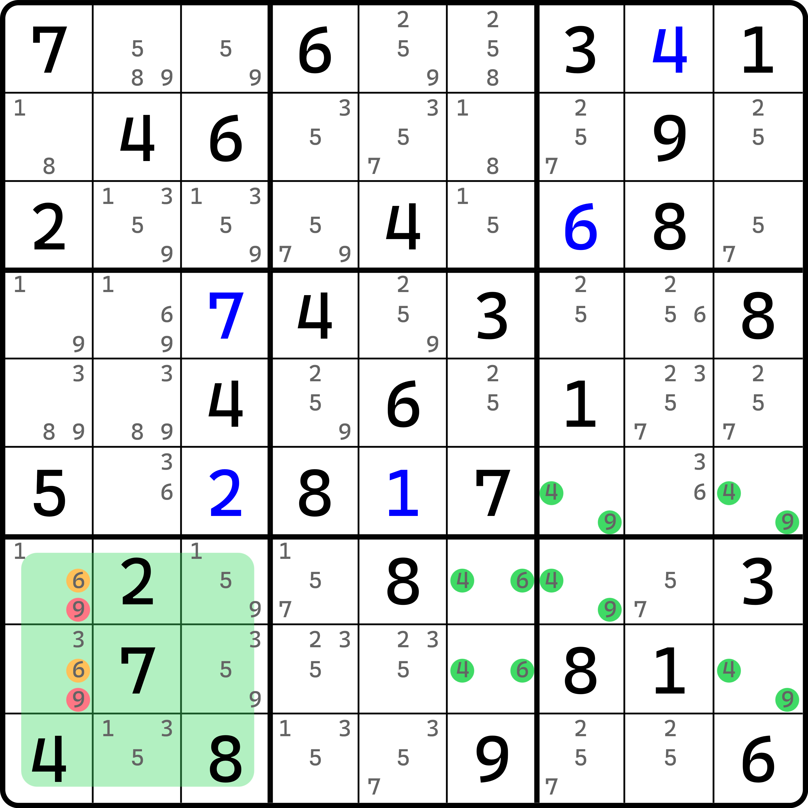
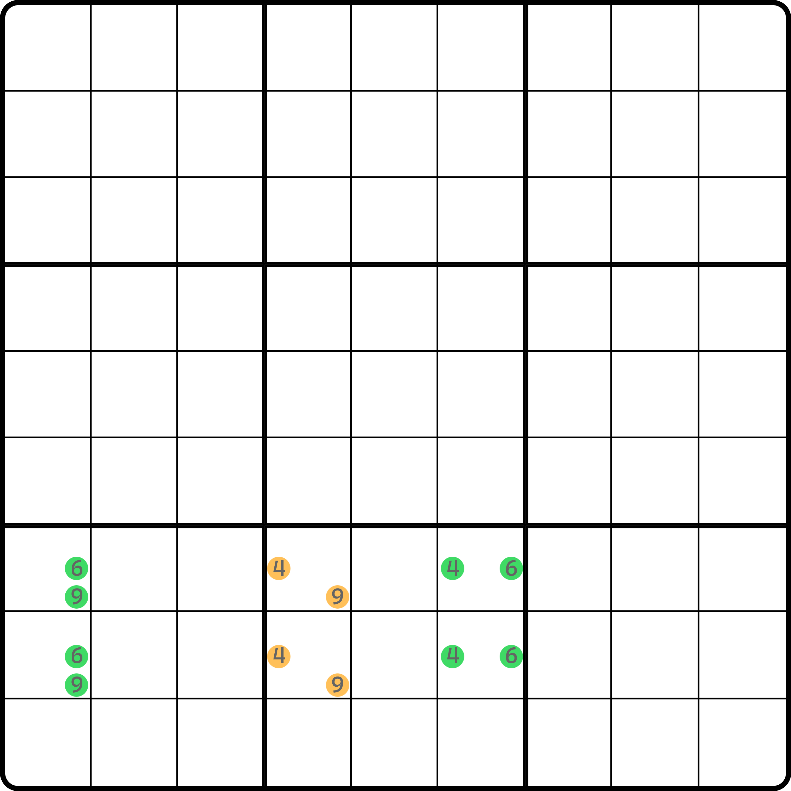
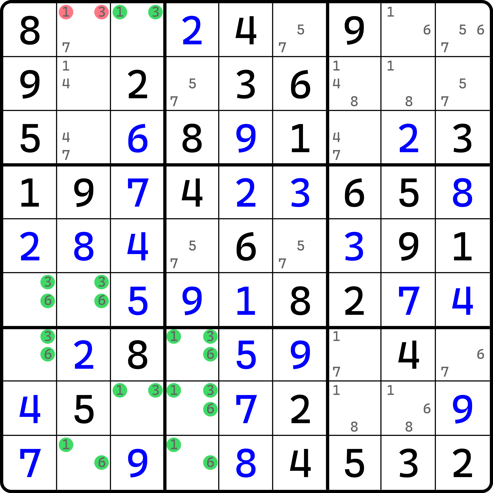

# 什么是传递？

在致命结构里，为了让结构可以更加普遍地存在于题目之中（而不是光有之前我们学到的这种固定技巧的结构形式），我们经常会将不同的结构组合在一起，形成“缝合怪”。这种缝合之后的结构就被称为匿名致命结构，即多个致命结构技巧叠加在一起的情况。

但是，这种叠加并非随意的。在致命结构理论里，如果 $$A$$ 和 $$B$$ 都是致命结构，也会存在 $$A + B$$ 不是致命结构的情况，这就需要我们对结构进行细致的分析。这个分析过程称为致命结构的**状态转移**（State Transition）、致命结构的**状态迁移**或致命结构的**传递**。

## 从匿名致命结构开始 

<figure><figcaption>
匿名致命结构
</figcaption></figure>

如图所示。这是[#reasoning-of-anonymous-deadly-pattern](../01-anonymous-deadly-pattern.md#reasoning-of-anonymous-deadly-pattern "mention")里的一个例子。我们将结构提取出来，以便我们可以开始后续的内容。

<figure><figcaption>
结构示意图
</figcaption></figure>

如图所示。这是提出来的结构。我们不难发现，唯一环的部分缺少两个单元格就会成立。我们不妨将其简化一下，将唯一环的四个格子从盘面里直接拿掉，取而代之的是，为了确保唯一环成立，我们往盘面里补充一个 4 和 9 的数对在 `r78` 两行并排的位置上。比如说 `r78c3`、`r78c5` 之类的。你可以把他想象成，如果有 `r78c3` 或是 `r78c5` 这个 4 和 9 的数对之后，唯一环就会形成。

<figure><figcaption>
结构示意图，将唯一环替换为数对
</figcaption></figure>

如图所示。这个结构就变为了这样。

我知道这肯定是不成立的，因为明显的是，`b8` 出现了 4 和 9 的数对和一个 4 和 6 的数对。按数对的删数逻辑来讲，`b8` 的两个数对共用一个 4 是肯定不可能在任何一道唯一解的题里出现。但是这并不重要，因为这对 4 和 9 是我们补出来的，它本来就在原来的题里就不存在；而我们这里也确实只是想从概念上说明它是否是致命结构，因此这并不重要。

而实际上，你也可以发现这种异常局面的时候，将 4 和 9 的这个数对往右平移到符合放置的位置上，使之重新成立。例如我们移动到 `r78c9` 上去。

<figure><figcaption>
结构示意图，平移 4 和 9 的数对
</figcaption></figure>

如图所示。现在我们将其移动到了 `r78c9` 的位置上，于是结构恢复了正常的同时，结构变为了拓展矩形。

因为我们知晓这个结构（拓展矩形）是致命结构，所以我们可以断言，原来的结构也是致命结构。

这就是致命结构的传递：**将大结构拆解为若干部分，每一个部分都是一个单独的致命结构的其中一部分“零件”。我们需要做的是，将零件** $$A_1$$ **还原回最初的致命结构** $$A$$**，然后找出** $$A$$ **结构余下的另一部分没出现的** $$A_2$$**，然后用** $$A_2$$ **代替掉** $$A_1$$ **参与到结构里进行推演，然后一直重复这个过程，直到结构你可以直接判断它是致命的即可**。更数学的语言是，借用 $$A = A_1 + A_2$$ 将结构 $$P = A_1 + B_1$$ 代换成 $$P' = A_2 + B_1$$。如果 $$P'$$ 是致命结构，那么 $$P$$ 就是致命结构。

## 传递的时候会造成无解局面 

这里有几个坑点，第一个已经提到了，就是在简化原有结构的时候，可能在简化之后会造成新结构无解的情况（如俩数对用至少一种相同数字，位于同一个区域里）。这种我们说到了，它只是单纯因为我们是补上去的，只是想要逻辑层面表示它合理，而并未考虑它是否会造成实际填充的无解；如果你确实觉得它会无解会影响你的推断，你就把他拿走，放在另外一个和之前原来的位置“等价”的地方，让结构从无解变为有解就行。

## 有些传递实际上是缺乏考虑的 

总有时候我们会缺少考虑，导致传递的不严谨，它会阴差阳错地得到正确答案，但其实在过程之中并不严谨，导致我们可能会以为它是正确的传递过程，下次使用在别的结构上的时候也这么缺少考虑，就会造成错判的情况。下面我们来看一个例子。

<figure><figcaption>
一个传递例子
</figcaption></figure>

如图所示，这个例子的 `r1c2` 是删数，这意味着它原本是结构的一部分，而造成了致命结构的矛盾所以才删掉。因为它的构型应该包含 `r1c2(13)` 作为一部分。

按照原本的传递的规则，我们会优先将结构进行简化和拆分。显然这个结构可以看成是两个唯一矩形 + 一个拓展矩形：

* 结构 $$A$$：唯一矩形 `r18c23`。结构里缺少 `r8c2` 单元格；
* 结构 $$B$$：唯一矩形 `r67c12`。结构里缺少 `r7c2` 单元格；
* 结构 $$C$$：拓展矩形 `r789c24`。结构里缺少 `r78c2` 单元格。

我们将两个唯一矩形所缺少的单元格还原到结构盘面里，并去掉原本的结构。

<figure><figcaption>
传递过程
</figcaption></figure>

如图所示。那么可以看到，最终我们将结构改成了拓展矩形的完整构造。因为最终我们形成了拓展矩形，它是致命结构，所以原始的结构就也是致命结构。

但是这么说起来，它是不严谨的。我们这里漏掉了一个潜在的问题：`r78c4` 多出来的候选数。`r78c4` 在传递之后，左右其实是并未构成拓展矩形的必要的数对的，比如 `r7` 里，`r7c24` 里一边有候选数 1，一边却没有。

虽然我们之前说过，拓展矩形里的左右只是选择了其中两种数字参与讨论，所以实际上它允许对应位置上的两个单元格不一定只包含两种候选数，但是这是我们通过传递得到的。我们并不确保它是否能因为我们这么传递之后，`r7c2` 缺少的数字 1 是否会影响讨论。同理，`r8c2` 缺少候选数 6 也是一样的道理。

你可能会回忆起，我们之前说过，这种致命结构因为结构只会影响到所在的区域的格子，这也意味着我们完全可以在结构形成之后把缺少的候选数给补充回去。但是这么做在这个例子里不太对。为什么呢？因为原本的唯一矩形用的是 1 和 3（缺候选数 6）以及 3 和 6（缺候选数 1）；两个唯一矩形都压根不包含 `r7c4` 和 `r8c4` 里存在的候选数 1 和 6。一旦我们补回去，我们就默认了唯一矩形在讨论的时候“缺少的候选数不会影响‘最终结构是不是致命结构’这个说法的正确性”这个说法成立。

这个话有点绕。说白了就是，我们缺少的候选数一旦被补回去，我们就默认了它的补充（或不补充）的这个操作对于“整个致命结构成立与否无关”这个说法，但是这么做肯定是错误的（你不补充和补充显然已经触碰到了结构的逆鳞——原本唯一矩形的那一坨单元格就没这个数）。所以，这么传递是不合适的。不过，如果 `r78c4` 分别缺少那个多余的 1 和 6 的话，因为余下的结构完全成立，那么我们就可以大大方方地认为结构是致命结构。

你再回去看看原本的题目，你会发现 `b4` 有数字 1 的提示数，这意味着 `r6c12` 和 `r7c1` 的 3 和 6 自始至终都缺少数字 1 的存在性。所以 `r8c3(1)` 会影响结构的讨论，以至于结构就算你用补候选数的说法也不能奏效。这是这个结构传递失效的一大根本原因。

## 不要对无解结构进行传递 

<figure><figcaption>
一个等待判断是否致命的结构
</figcaption></figure>

如图所示。这个结构是否是致命结构呢？我们试试看。

我们发现，`r34c4` 分别补充 6 和 8 以及 2 和 3，就会形成 8 个单元格 `r2356c56` 构成拓展矩形。于是我们传递为这样：

<figure><figcaption>
传递之后的结果
</figcaption></figure>

如图所示。我们发现，传递成这样之后，结果变为了 2、3、6、8 的拓展矩形。因为这个结构是致命的，所以原本的结构也就是致命的。

很遗憾的是，这个传递是错误的。原本的结构也确实不是致命结构，因为&#x5B83;_&#x6CA1;有合适的填法_。如果你比较轴，你可以试试在原本的结构里对数字的填法进行排列组合（穷举一下填数）。你会发现，原本结构根本就不存在一种有效的填充方式，使得可以稳定填入，即满足数独规则的填入情况。一个情况都没有。

这种结构更类似于之前学到的全双值格致死结构，看起来哪哪都是数对或数组，结果怎么填都是无解的，因为结构本体用完了全部的空格。题是唯一解的显然不容许两种填法的存在，所以实际上，保留预留的数字之后的结果就是，结构直接就没有合理的解了。这个结构也是如此，只是单纯不一样在它是局部的单元格，并不是全局的。

这很令人头疼。我每次判断结构是否致命的时候，贸然使用传递肯定会出现问题；但是我也没办法一眼判断出这个结构到底有没有合适的填法，所以还得进行一轮对解数量的校验么？

很遗憾，是的。你必须知晓结构是否可以参与传递，才能使用传递。参与传递的根本条件是，**它必须至少存在两个有效的填法**。所谓“有效”，其实就是填进去之后让基础数独规则成立（即行列宫不包含重复数字即可），只有一个都不行，因为没得跟它产生交换的填法。

那么，快速判断是否无解，有没有啥好的办法呢？有的。不过这个我们先卖个关子。下一节我们先来看看致命结构的传递，更底层的原理。在说完原理之后，我们再对无解和有解的相关内容进行补充。
