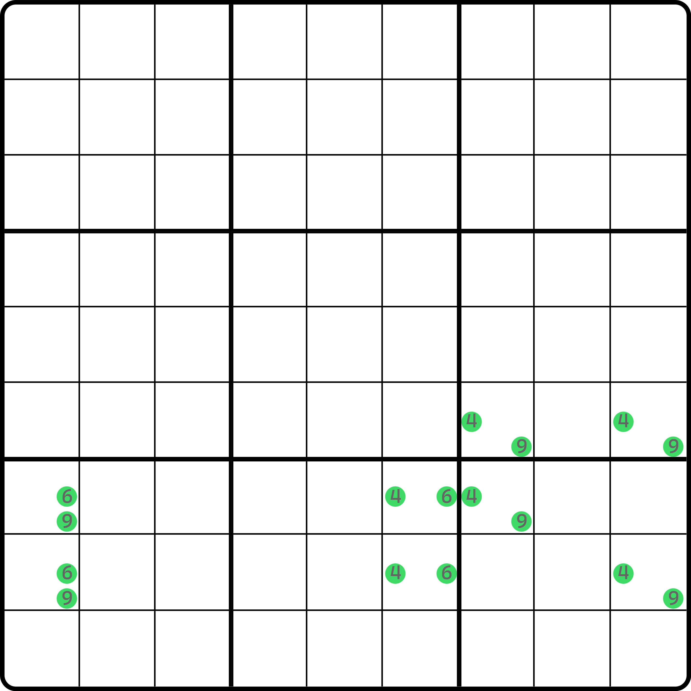
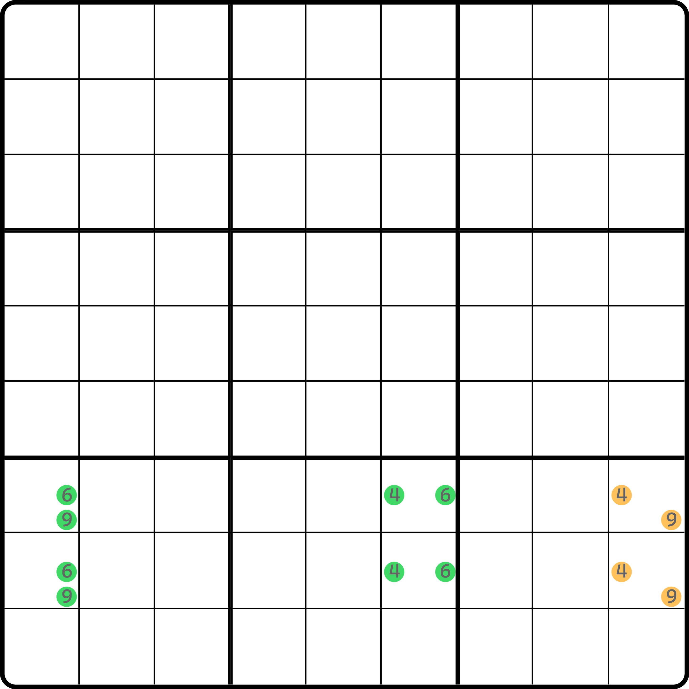
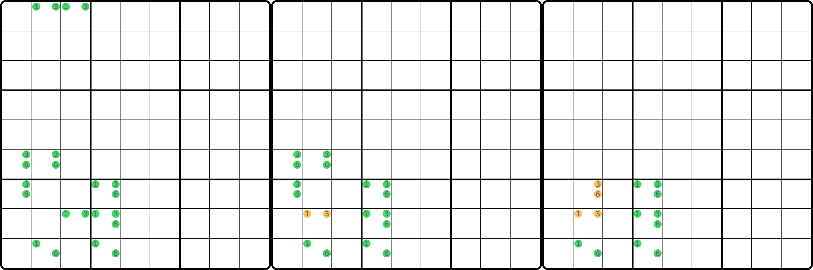
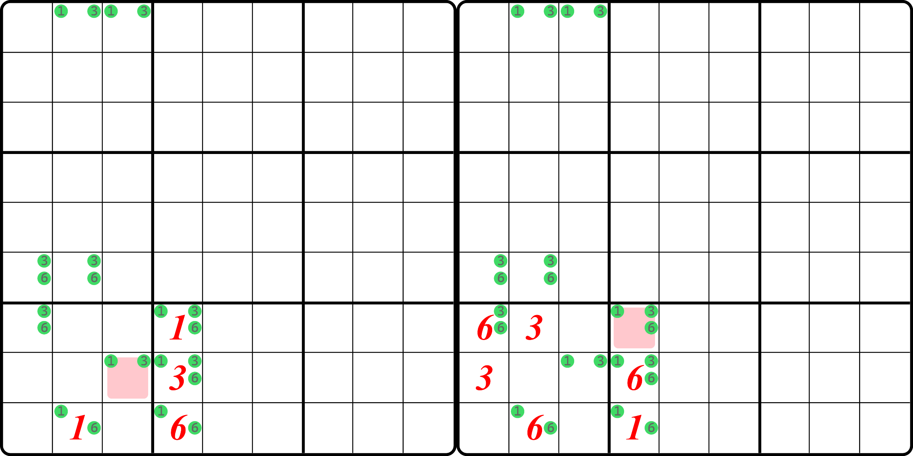
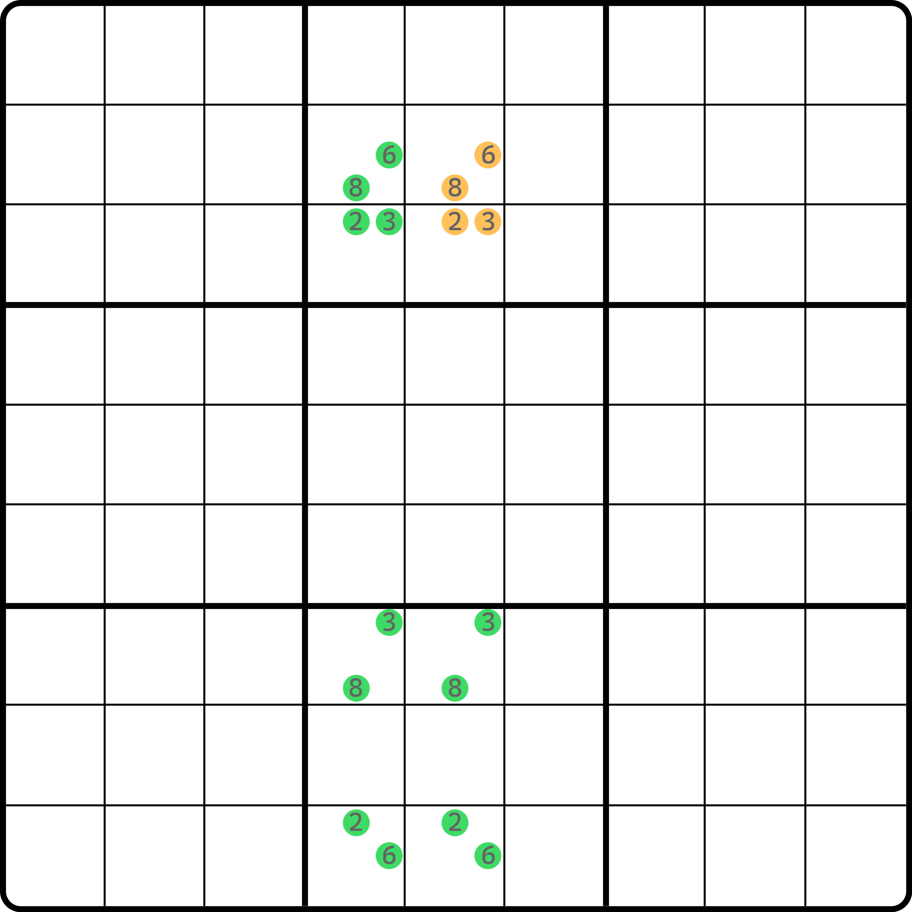

# 传递的底层原理

前一节的内容我们描述了如何使用传递，以及对传递的操作的限制条件。我知道你看完肯定会觉得条件限制特别多，以至于就算知道了、看懂了传递的过程也无法自己掌握传递。遇到一道题还是不会使用它。

下面我们来针对传递进行底层原理的解释，看看它为什么可以奏效。

## 形成致命结构的充要条件 

我们之前提到不止一次，致命结构要形成矛盾，它必须是可以构成交换的状态。换言之，你需要找到一种填法，使得这个填法和原本的填法不同的同时，还能不影响盘面余下的单元格。

我们将这段话加工一下。

**对于若干个单元格（这里我们记作结构** $$P$$**）而言，我们往这些单元格里进行填数。只要我们发现所有单元格都被填上了数字，且数字只需满足数独基础规则（同区域下不包含相同数字），我们就记录一下这个填法。接着，我们需要找出这个结构里所有的填法，构成填法的集合，我们拿一个字母** $$\Omega$$ **表示（读作“omega”，数学上通常用这个字母表示“全部情况”的意思）。**

**对于全部填法** $$\Omega$$ **里的每一种填法** $$A$$ **而言，我们都需要从** $$\Omega$$ **里找出至少一种不同的填法** $$B$$**，使得在本结构** $$P$$ **的每一个区域下，**$$A$$ **和** $$B$$ **里所选取的数字都是一样的。**

> “填法 $$B$$ 和 $$A$$ 不同”里的“不同”的意思是说，两个填法 $$A$$ 和 $$B$$ 里至少有一个单元格填了不一样的数，即不完全相同。
>
> “$$A$$ 和 $$B$$ 选取数字相同”说的是，在这个区域下，单元格里编排的填数可能顺序不一样，但里面填写的数字总体上是相同的，比如某个行的 3 个格子分别填了 1、2、3 和 1、3、2，那么我们就可以认为是“选取数字是一样的”。

当一个结构 $$P$$ 具备此特征的时候，我们就将这个结构称为致命结构。这是一个充分必要条件。换言之，如果一个结构被称为致命结构，那么它也会严格符合此特征。

## 传递原理剖析 

让我们再次回顾一下传递。我们来看看传递能够奏效的根本原因是什么。

### 先看看致命结构的定义是怎么运作的 

<figure><figcaption>
还是那个题的示意图
</figcaption></figure>

如图所示。这还是之前的那个题的示意图。我们将这个结构的所有填法进行穷举，不难发现这个结构只有两种有效填法。

<table><thead><tr><th width="100.933349609375">编号</th><th>填法</th></tr></thead><tbody><tr><td>1</td><td>r6c7 = 4、r6c9 = 9、r7c1 = 6、r7c6 = 4、r7c7 = 9、r8c1 = 9、r8c6 = 6、r8c9 = 4</td></tr><tr><td>2</td><td>r6c7 = 9、r6c9 = 4、r7c1 = 9、r7c6 = 6、r7c7 = 4、r8c1 = 6、r8c6 = 4、r8c9 = 9</td></tr></tbody></table>

既然只有两个填法，按照定义我们就直接拿情况 1 和 2 对比就行，连从全部填法里去找不同的填法都不需要找了，省事。而很显然的是，这个结构符合所有区域填数相同的特征（毕竟这一点在之前完整证明过了），所以它是一个致命结构。

这是符合定义的，或者说我们改写成严格的定义的说辞看起来“运作起来”很正常，这很好。下面我们来看看，我们使用了传递的过程，它到底改变了哪里。

### 传递到底影响了什么地方 

下面我们来看看，传递是怎么运作的，它影响到了哪些地方。

<figure><figcaption>
结构示意图，平移 4 和 9 的数对
</figcaption></figure>

如图所示，这是我们采用了传递造成结构减小的方案——将唯一环的四个格子传递成了这一个 4、9 的数对。因为我们说传递的时候，放入 4、9 到 `b8` 会明显导致填数方案无解，所以我们稍加平移了数对的位置，使得它能正确运作。

我们再来看看这个拓展矩形，我们把它的全部情况也列举一下。这个结构也只有两个可能填法：

<table><thead><tr><th width="100.933349609375">编号</th><th>填法</th></tr></thead><tbody><tr><td>1</td><td>r7c1 = 6、r7c6 = 4、r7c9 = 9、r8c1 = 9、r8c6 = 6、r8c9 = 4</td></tr><tr><td>2</td><td>r7c1 = 9、r7c6 = 6、r7c9 = 4、r8c1 = 6、r8c6 = 4、r8c9 = 9</td></tr></tbody></table>

在这个拓展矩形的结构里，我们把原来在匿名致命结构里存在的单元格提取出来：`r78c16`。这里要注意的是，匿名致命结构里 `r8c9` 虽然也被用到，但拓展矩形里的 `r8c9` 是因为我们平移了原本被我们安排在 `b8` 里的那个补的 4、9 数对，从原理和本质上看，他们并非同一个东西，所以这里我们没把他们算进去。

我们将两个结构的填法作一个对比，并且只看原本匿名致命结构里存在的那几个格子 `r78c16`：

* 匿名致命结构的填法
  * r6c7 = 4、r6c9 = 9、**r7c1 = 6**、**r7c6 = 4**、r7c7 = 9、**r8c1 = 9**、**r8c6 = 6**、r8c9 = 4
  * r6c7 = 9、r6c9 = 4、**r7c1 = 9**、**r7c6 = 6**、r7c7 = 4、**r8c1 = 6**、**r8c6 = 4**、r8c9 = 9
* 拓展矩形的填法
  * **r7c1 = 6**、**r7c6 = 4**、r7c9 = 9、**r8c1 = 9**、**r8c6 = 6**、r8c9 = 4
  * **r7c1 = 9**、**r7c6 = 6**、r7c9 = 4、**r8c1 = 6**、**r8c6 = 4**、r8c9 = 9

我们可以看到，匿名致命结构里第一个填法和拓展矩形里的第一个填法下，这四个单元格的填数完全相同（分别填的 6、4、9、6）；而匿名致命结构的第二个填法和拓展矩形的第二个填法在这四个单元格里填数也都完全相同（分别填的 9、6、6、4）。从数学上说，就是匿名致命结构 $$A$$ 和拓展矩形结构 $$B$$，即使规格不同，但他们各自的可能填法下，$$A$$ 含有的单元格而 $$B$$ 不含有的单元格 $$A - B$$（注意 `r8c9` 要作为传递的单元格而特殊处理，不应被算进去），填数不会有任何影响，即结构的填法集合，所有的元素都完全一样。

它暗示了我们一个现象：**我们使用传递，将大结构的其中一部分单元格改成另外一部分单元格的过程，只要保证余下的单元格（没变化的那一部分）不受影响，那么我们完全可以认为，它俩从集合填写上就是严格的包含关系。或者换句更通俗的说法，传递的本质是利用了讨论和穷举结构填法的重复性，将需要重复讨论的部分用更小规模的单元格替换，以简化讨论复杂度的过程。**&#x8FD9;是传递为什么奏效的根本原因。

## 为什么传递在使用时仍有众多限制？ 

我们已经知道了传递的最根本原因是降低讨论重复度和复杂度，那么下面我们来说说，为什么传递有这么多使用上的限制。我们依旧拿前一篇的内容里的错误用例说明。

### 传递例子 1（欠考虑） 

<figure><figcaption>
例子 1 的传递过程
</figcaption></figure>

它传递失败的原因不在于我们简化唯一矩形为一个单的单元格是错误的，而是因为我们并未真正讨论结构余下的部分，尤其是我们提及的 `r78c4` 的候选数 1 和 6。

我们试着穷举此结构的填法，以及每一步传递下来的填法，看看哪里出了问题。

* 匿名致命结构的填法
  * r1c2 = 3、r1c3 = 1、r6c1 = 3、r6c2 = 6、r7c1 = 6、r7c4 = 3、r8c3 = 3、r8c4 = 1、r9c2 = 1、r9c4 = 6
  * r1c2 = 1、r1c3 = 3、r6c1 = 6、r6c2 = 3、r7c1 = 3、r7c4 = 6、r8c3 = 1、r8c4 = 3、r9c2 = 6、r9c4 = 1
* 中间结构的填法（去掉了 `r1c23` 和 `r8c3`，补充了 `r8c2`）
  * r6c1 = 3、r6c2 = 6、r7c1 = 6、r7c4 = 3、r8c2 = 3、r8c4 = 1、r9c2 = 1、r9c4 = 6
  * r6c1 = 6、r6c2 = 3、r7c1 = 3、r7c4 = 6、r8c2 = 1、r8c4 = 3、r9c2 = 6、r9c4 = 1
* 拓展矩形的填法（去掉了 `r6c12` 和 `r7c1`，补充了 `r7c2`）
  * r7c2 = 3、r7c4 = 6、r8c2 = 1、r8c4 = 3、r9c2 = 6、r9c4 = 1
  * r7c2 = 6、r7c4 = 3、r8c2 = 3、r8c4 = 1、r9c2 = 1、r9c4 = 6

因为传递过程是一步一步来的，所以我们每次看的时候都需要一点一点看。先是最开始，从匿名致命结构到中间结构的转化。

* 匿名致命结构的填法
  * r1c2 = 3、r1c3 = 1、**r6c1 = 3**、**r6c2 = 6**、**r7c1 = 6**、**r7c4 = 3**、r8c3 = 3、**r8c4 = 1**、**r9c2 = 1**、**r9c4 = 6**
  * r1c2 = 1、r1c3 = 3、**r6c1 = 6**、**r6c2 = 3**、**r7c1 = 3**、**r7c4 = 6**、r8c3 = 1、**r8c4 = 3**、**r9c2 = 6**、**r9c4 = 1**
* 中间结构的填法（去掉了 `r1c23` 和 `r8c3`，补充了 `r8c2`）
  * **r6c1 = 3**、**r6c2 = 6**、**r7c1 = 6**、**r7c4 = 3**、r8c2 = 3、**r8c4 = 1**、**r9c2 = 1**、**r9c4 = 6**
  * **r6c1 = 6**、**r6c2 = 3**、**r7c1 = 3**、**r7c4 = 6**、r8c2 = 1、**r8c4 = 3**、**r9c2 = 6**、**r9c4 = 1**

可以看到，第一步传递的操作下，原始匿名结构余下的 7 个单元格在中间结构里的填数情况是完全相同的。匿名致命结构的第一种分别填了 3、6、6、3、1、1、6，而中间结构的第一种填法也是 3、6、6、3、1、1、6；而第二种情况 6、3、3、6、3、6、1 也可以在中间结构的填法里找到（其第二种填法）。

也就是说，这个传递过程是正确的，因为这 7 个单元格的填数情况并未发生任何变化（没有多出来也没有少掉一些情况），所以我们完全可以拿一个单元格代替原本的 3 个单元格将结构讨论的复杂度降低。

然后我们再来看第二步传递。

* 中间结构的填法
  * r6c1 = 3、r6c2 = 6、r7c1 = 6、**r7c4 = 3**、**r8c2 = 3**、**r8c4 = 1**、**r9c2 = 1**、**r9c4 = 6**
  * r6c1 = 6、r6c2 = 3、r7c1 = 3、**r7c4 = 6**、**r8c2 = 1**、**r8c4 = 3**、**r9c2 = 6**、**r9c4 = 1**
* 拓展矩形的填法（去掉了 `r6c12` 和 `r7c1`，补充了 `r7c2`）
  * r7c2 = 3、**r7c4 = 6**、**r8c2 = 1**、**r8c4 = 3**、**r9c2 = 6**、**r9c4 = 1**
  * r7c2 = 6、**r7c4 = 3**、**r8c2 = 3**、**r8c4 = 1**、**r9c2 = 1**、**r9c4 = 6**

可以看到，中间结构往拓展矩形的传递也是符合条件的。中间结构的第一种填法（3、3、1、1、6）在拓展矩形里可以在第二个情况里对应上；而中间结构的第二种填法（6、1、3、6、1）则可以在拓展矩形的第一种填法里对应上。说明这样的传递降低复杂度的同时也不影响原本的结构的情况，所以传递 OK。

那……既然就这两步的传递，为啥说这是错的呢？还记得这个错误例子在那篇内容里的标题吗？“有些传递实际上是缺乏考虑的”。我们从第一步推演重新看看，不难发现，`r7c4` 和 `r8c4` 有没有被命中的候选数。按理说这是全部的情况了，但 `r7c4` 始终都没有填上这个 1，而 `r8c4` 则始终没填上这个 6。

缺乏考虑的点在这里。传递实际上是不依赖他们的（或者说跟他们的真假性没有关系），所以原本的结构使用这两步进行传递是奏效的，这其实没有任何问题。但是，`r78c4` 的候选数并未删干净，导致这两个候选数得以保留，以至于我们推演的时候需要考虑他们。我们在没有穷举之前，直接使用传递的时候是不知道这两个多出来不可能成立的候选数真正是不是成立的，它会被纳入传递的行列里，所以贸然使用传递会造成不可预测的后果。

实际上，你如果强行去假设让 `r7c4` 填 1 的话，会造成无解局面；同理，`r8c4` 填 6 也是如此。

<figure><figcaption>
两个填法都会造成无解局面
</figcaption></figure>

如图所示。左图是假设 `r7c4 = 1` 造成 `r8c3` 矛盾的情况；右图是 `r8c4 = 6` 的时候造成 `r7c4` 矛盾的情况。两者都会直接导向无解的局面，以至于我们无法找出一个有效的解，使得 `r7c4(1)` 和 `r8c4(6)` 能为真的填数情况。

可以从这个本质原因看出，它俩是本该删掉的数字（因为它根本找不到它为真而结构还能成立的情况），但它的存在扰乱了我们的推理。

可能还有朋友看不懂到底怎么扰乱推理的。你完全可以把问题想简单一些：比如这个例子里，`r8` 里就两个单元格，但一个是 1 和 3 俩候选数的格子，一个是 1、3、6 仨候选数的格子。很明显，我们只能让这两个格子填入两个不同的数，所以这有些类似于拓展矩形里多个候选数只选其二的操作。但是问题在于，拓展矩形里的那个情况里，所有的数字都是可能出现的，但这个例子不同的是，你不能在穷举之前提前预知这个多出来的 6 单独出现在 `r8c4` 是否可行。如果它不可行（无解），它应该被删除，进而确实不影响传递的推演流程；如果它可行，结构就可能会多一个情况，而这个情况里的 6 只能在 `r8` 里填在 `r8c4` 上面。这固定了一个填数之后，6 还无法交换到左边，因为 `r8c3` 压根就没有 6 的位置。而且，你还不知道这个 6 该不该补回去到 `r8c3` 里。如果补了的话，那么 `c3` 里会出现一边是 1、3，一边是 1、3、6 的情况，相当于增大了讨论的复杂度。

就是说，这个多出来的数字，你无法提前预判它的真假性。从计算机穷举的角度来说，它确实很容易得到（穷举全部可能填法，先把没覆盖到的候选数给删除，即这俩多出来的候选数，然后再判断致命结构的定义是否成立）；但人的话则不一定。这个题似乎满足，但换一个题可能就不行了。所以，我们往往会在脑海中增加一点快速判断的操作：把结构的所有区域预先看一遍，看看是否存在一个区域里，某个数字只能在一个位置上出现。比如 `r8` 里这个 6 就只能在 `r8c4` 里出现，进而直接认为它不能传递即可。但是，这样也会漏掉一些可能成立的情况（比如这种多出来的数实际上不能成立的结构）。所以，这是传递判断的难点所在。

### 传递例子 2（错误） 

<figure><figcaption>
例子 2
</figcaption></figure>

如图所示，这是第二个例子。

这看起来非常像是一个致命结构，但它内部是无解的；换言之，你根本就找不到一个有效的填法让这个结构的每一个格子都填上有效数字。这似乎不会在唯一解的题里出现这个结构，但请相信我，它会以类似全双值格致死解法的形式存在，我们甚至可以利用这一点来进行无解规避和删数。不过这不是重点。重点是来看看这个结构的传递，其错误的本质原因到底是什么。

<figure><figcaption>
传递之后的结果
</figcaption></figure>

我们当时是这么传递的。我们将 `r23c6` 和 `r56c56` 这 6 个单元格当成拓展矩形的其中 6 个格子，然后补上了 2 和 3 以及 6 和 8 的两个单元格，使之成为整个结构里剩余的部分。

可问题就在这里。原本的结构是一个无解的局面，但我们通过传递反而得到了一个拓展矩形（有合理填法的局面）。从上帝视角而言，这就已经不成立了——传递是不能改变原本余下单元格可填情况的；也就是说，你传递的时候，原本结构可以填的所有情况，你需要在传递之后也可以完全作出匹配。但无解的结构变为反而有解的结构，这显然不等价了。所以它不正确。

当然了，如果从上帝视角来看的话，我们显然需要穷举，这肯定太难发现到这一点。那么，我们可以这么想这个问题。既然传递是需要保持等价的（只是结构规模变小了，原本的填数情况是不影响的），那么我们可以使用反证法。假设传递有效，看看能不能矛盾（即得到“传递有效”这个说法是错误的）。

因为传递保证结构两边是（在效果上）等价的，就是说，原本的结构 $$A$$ 改为了拓展矩形 $$B$$，如果传递有效，则 $$A$$ 和 $$B$$ 理应都能得到致命结构的定义符合（只是此时得到 $$A$$ 需要穷举而已，我们先不考虑穷举不穷举这回事），而且还能得到 $$A - B$$ 里的排列，在结构 $$A$$ 和 $$B$$ 里都能出现。

但是，如果我们看拓展矩形 $$B$$ 这个情况。不难发现它可以在结构里“溢出”一种填法：`r2c5 = 6` 和 `r3c5 = 3`。这种填法在拓展矩形里是成立的，因为它可以作为拓展矩形的排列而存在（毕竟有解嘛）。但是，你将 6 和 3 代入原结构 $$A$$，你就会发现问题：`r5c5` 无法填数了。按理说，两个结构效果上等价，理应在拓展矩形 $$B$$ 里的这种排列情况，$$A$$ 就算 `r23c5` 不在结构里不属于结构的一部分，但对于拓展矩形 $$B$$ 里，`r23c5` 填好之后的余下 6 个单元格的填数情况，$$A$$ 也必须存在才对。可是这情况会直接让 `r5c5` 挂掉而无法填数。这已经展现出效果上的不一样了。所以，两种结构的有效填法实际上是不一样的。

既然不一样，那么我们也就不能得到后续的逻辑（传递有效，进而得到原结构 $$A$$ 是致命结构的结论）。换言之，传递的证明失败了，或者说我们发现反证法得到矛盾了。所以，这两个结构其实是不等价的，你不能这么传递。

这就是我们证明传递有效性的办法：**快速判断一个结构传递过程是否有效，就去假设我们传递之后的结构多出来的那一部分单元格的所有排列，是否真的有影响到原本结构的填数情况，进而发现不等价的端倪。**

这里利用的是反证法的思路。一般而言，我们只需要利用唯一环这种结构传递出一个数对这么简单的做法。而这样的传递可以说绝大概率都是符合传递有效性的（因为你的排列仅仅会考虑在其中填入一个数对的两种摆放情况，而大概率这两个单元格的摆放又同行列又同宫，所以等价性多半都不会受影响）。但是，如果传递出来的是一个斜着摆放的数对，可能你就需要考虑了：因为斜着放的数对，对于行或列上可能仅有一个单元格在结构之中，于是它大概率不成立，毕竟交换就不等价了嘛。

总之，无脑使用传递是不可取的行为，但也不要因为它需要考虑的点过多，反而把自己封闭起来而不去尝试它。
