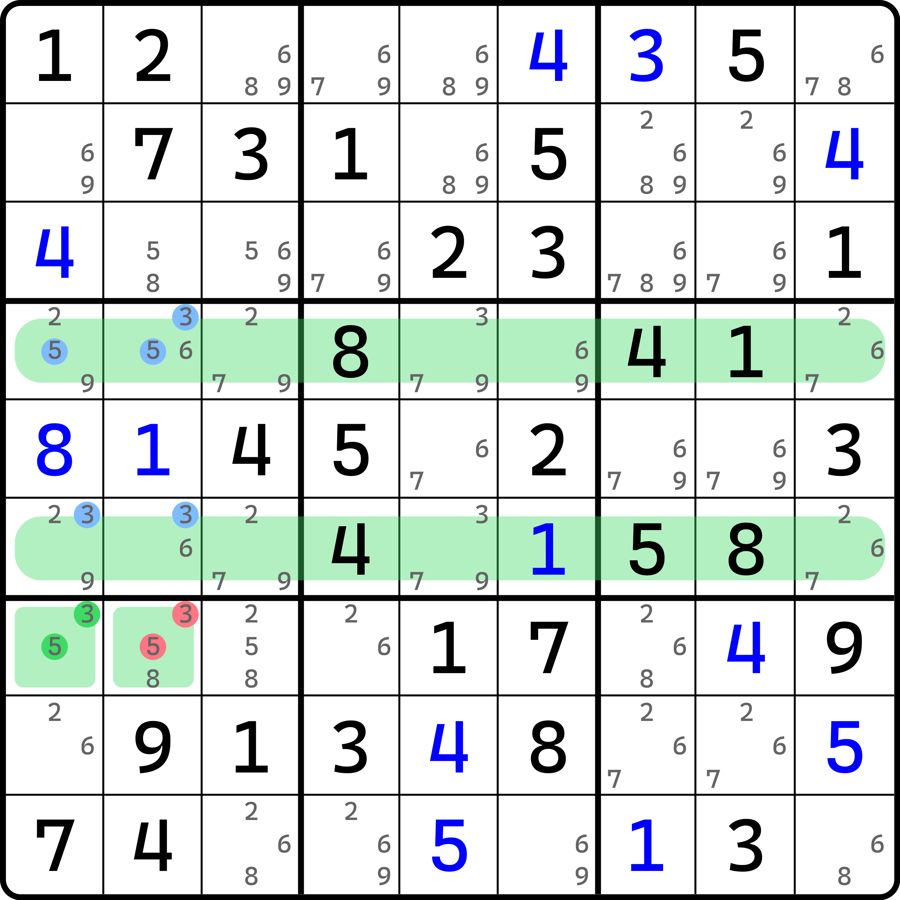
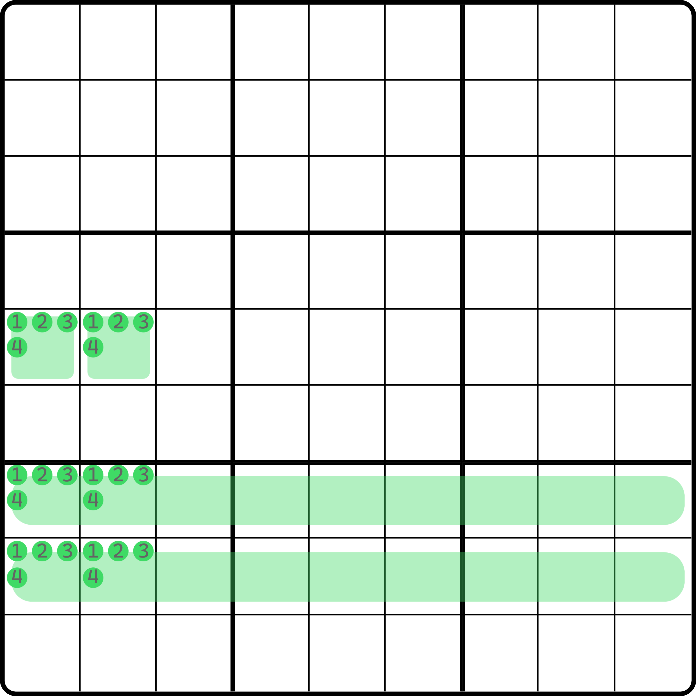
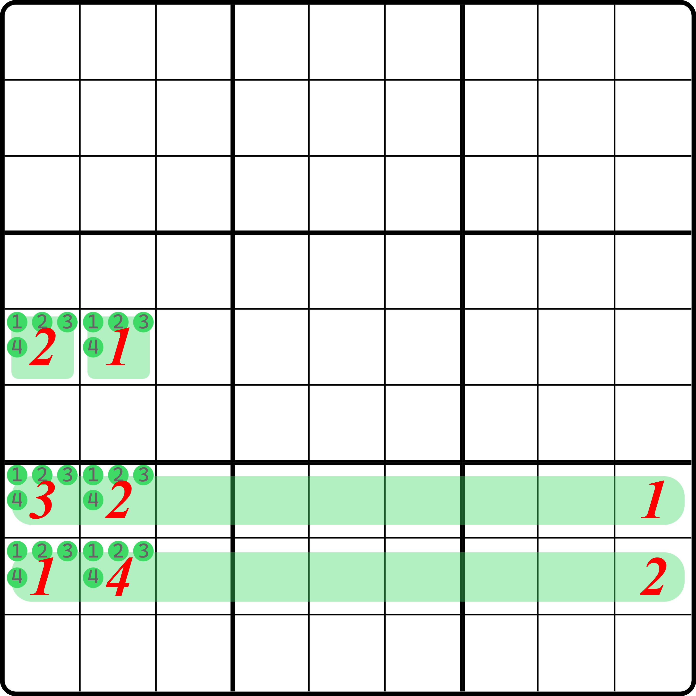
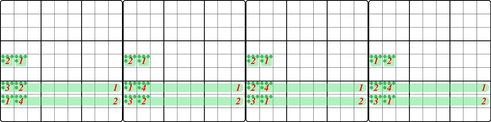
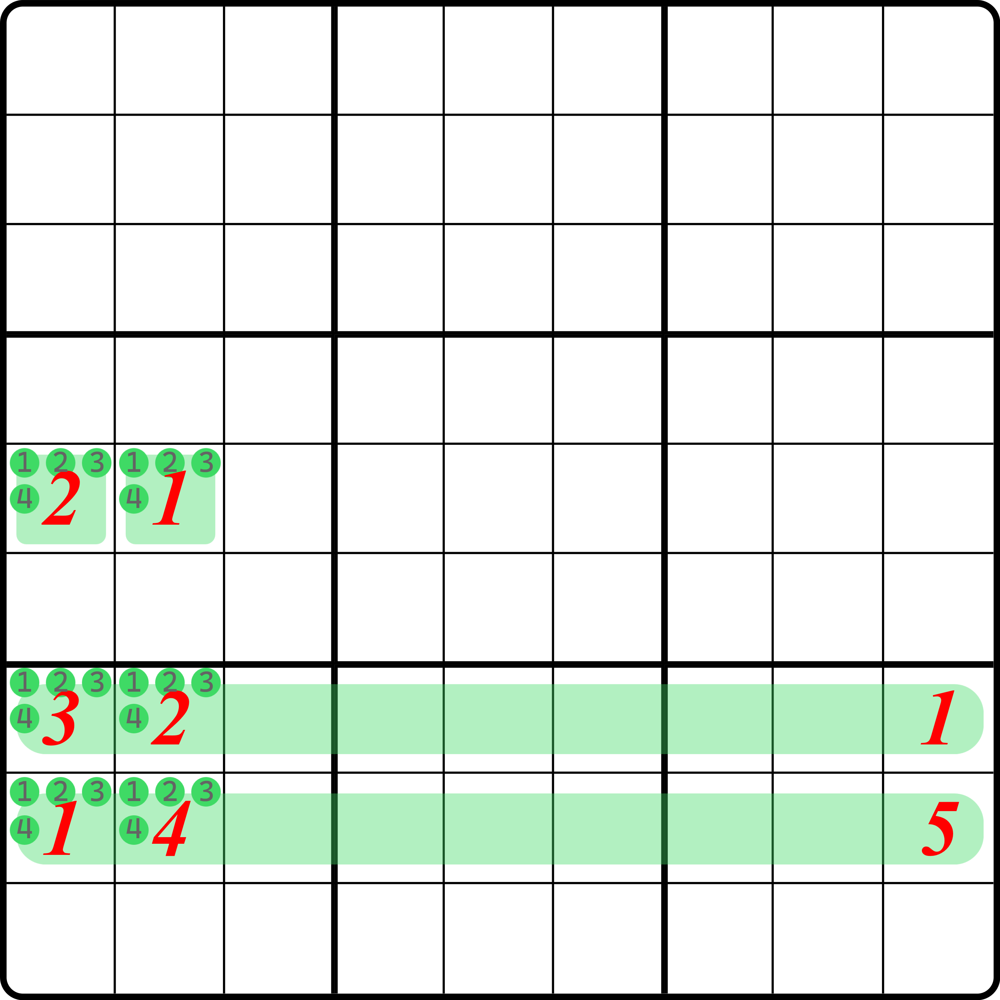
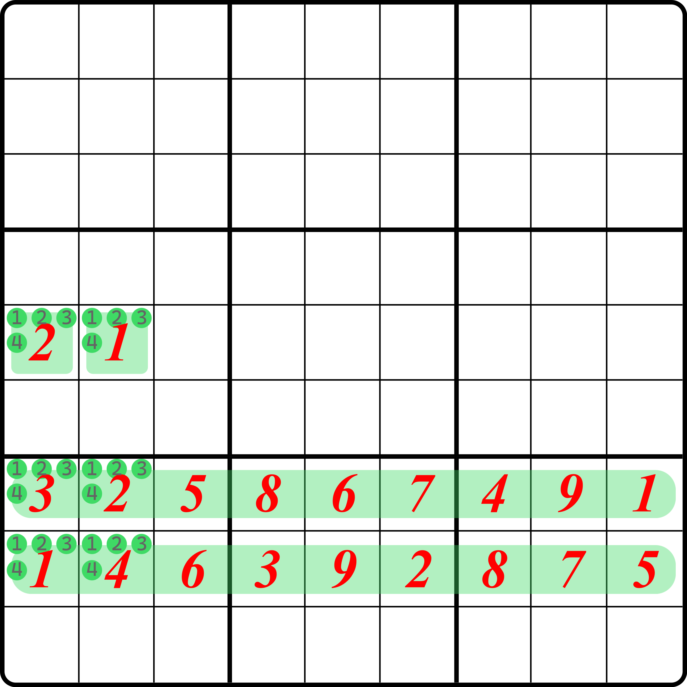
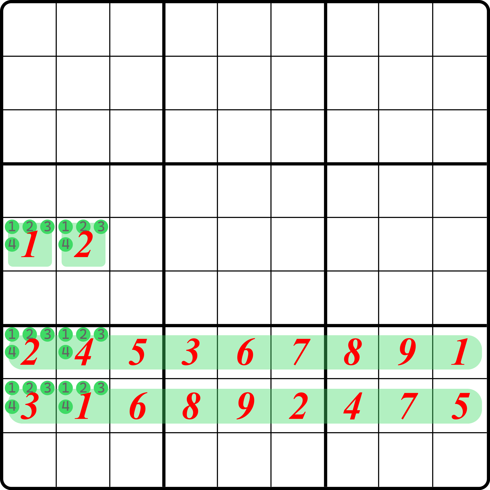
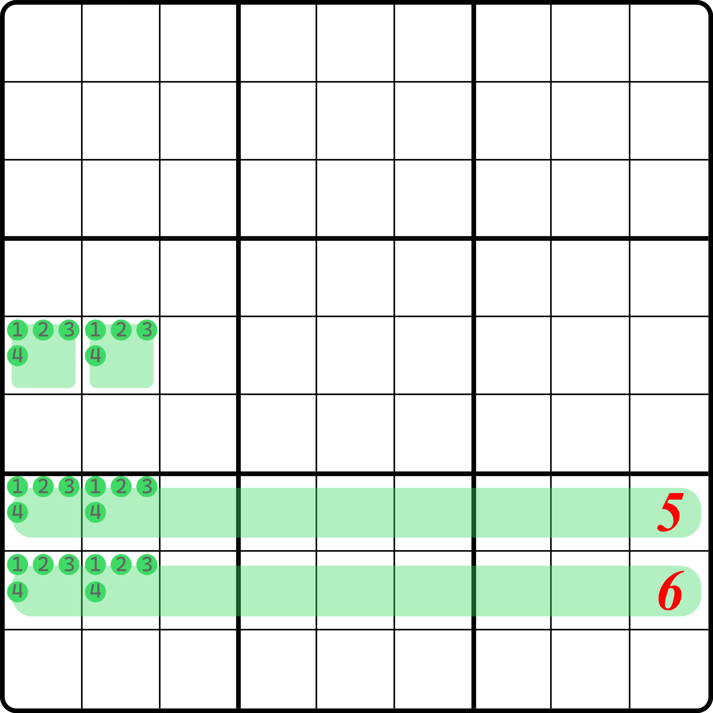
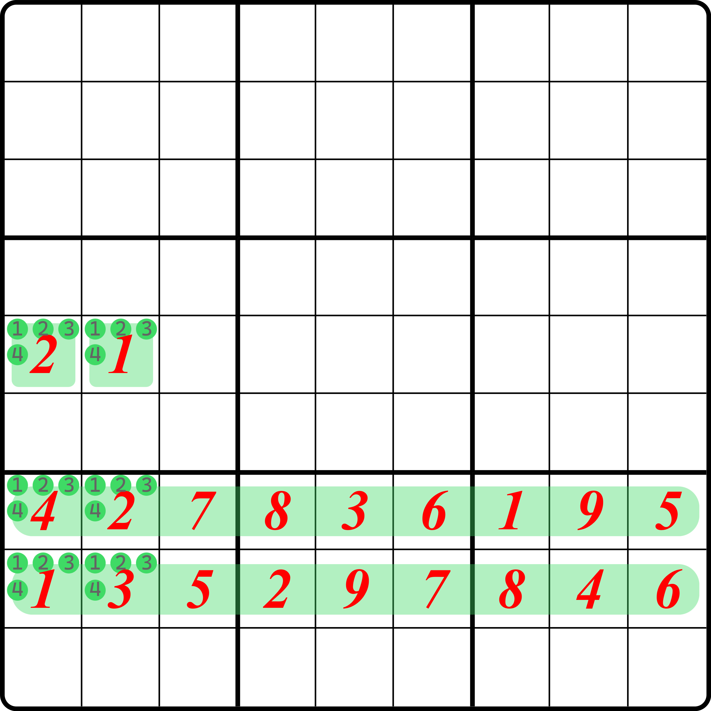
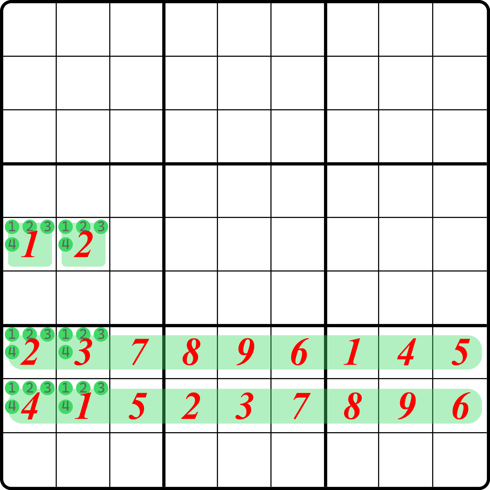

# 淑芬致命结构的基本推理

## 引例 

<figure><figcaption>
引例
</figcaption></figure>

如图所示。所有 `r46` 的空格，外带上 `r7c12` 构成一个结构。如果 `r7c2` 只含有 3 或 5，这些空格将构成致命结构的矛盾（交换而不影响盘面余下的空格）。所以，这个题的结论就是 `r7c2 <> 35`。

可以看到，它似乎有一个比较容易注意的点。结构的 `r46` 这两行的部分，因为明数上下对应位出现的数字都是成对的（5 除外），所以不难想到之前我们介绍的反转拓展矩形（或者说它的反面，即普通的拓展矩形）；然后多出来的 `r7c12` 先得很突兀，跟结构的数字似乎一点都不沾边。唯一看起来相关的是 `r7c12` 里是 3 和 5，似乎用到的 5 在刚才成对方案里就它单出来了。不过之后的内容会告诉各位，这个其实没多大关系，是不是这样都无关紧要。

## 证明 

证明这个结构是致命的，需要先知道这个结构到底样式长啥样。

### 结构描述 

这个结构至少需要具备如下的特征：

1. 结构包含两个完整的行或列 $$L_1$$ 和 $$L_2$$ 里的全部空格，以及两个额外的空格 $$C_1$$ 和 $$C_2$$；
2. 单元格 $$C_1$$ 和 $$C_2$$ 只能横放或竖放，位于同一个宫里；
3. 单元格 $$C_1$$ 和 $$C_2$$ 若横放，那么 $$L_1$$ 和 $$L_2$$ 就必须是行；反之若 $$C_1$$ 和 $$C_2$$ 竖放，则 $$L_1$$ 和 $$L_2$$ 就必须是列；
4. 行或列 $$L_1$$ 和 $$L_2$$ 必须位于同一个大行或大列里；
5. 单元格 $$C_1$$ 和 $$C_2$$ 都不能在 $$L_1$$ 和 $$L_2$$ 里，也不能在和 $$L_1$$ 和 $$L_2$$ 所处的大行或大列里；
6. 单元格 $$C_1$$ 和 $$C_2$$ 包含的不同的候选数数量最少两种、最多 4 种；
7. 将 $$C_1$$ 和 $$C_2$$ 各自看得见的、$$L_1$$ 和 $$L_2$$ 里的空格取交集之后再并起来得到的 4 个单元格 $$P_i$$（其中 $$i$$ 只能是 1、2、3 或 4）此时一定同处于一个宫 $$B$$ 里。此时，对于 $$C_1$$ 和 $$C_2$$ 里每一种候选数而言，该候选数在 $$B$$ 这个宫里出现的位置只能在 $$P_i$$ 里；
8. $$L_1$$ 和 $$L_2$$ 里的几乎所有数字都会符合和反转拓展矩形那样上下（或左右）对应位置都会配对出现，但是也恰好一定存在有一个数不满足此特征（或者说上下成对出现的刨去之后，就剩一对两个数只能填不一样的数）。

如果整合上述说法，我们不难得到这个框架：

<figure><figcaption>
这个结构的示意图
</figcaption></figure>

如图所示。当然，因为最后一点需要依赖于明数，因为它没有一个固定构型，所以就没画上去。总之它的结构大概就长这样。

那么我们来看这个结构是如何致命的。虽然说是四种数，但是实际上对于 `r5c12` 而言，能填的就两种数字（也就是说四选二）。所以我们假设我们选好了其中两种数字分别是 1 和 2 的话（选别的因为结构是一样的，所以就不用重复讨论了），那么，证明此结构致命需要有三个情况要讨论：

* `r78` 里包含的明数里，1 和 2 都出现；
* `r78` 里包含的明数里，只出现 1 或者 2 的其中一个；
* `r78` 里包含的明数里，没有 1 也没有 2。

### 情况 1 

先来看情况 1。情况 1 的示意图显然是这样的：

<figure><figcaption>
情况 1，示意图
</figcaption></figure>

如图所示。把 1 和 2 换一下位置也无所谓，反正是构型，上下交换属于是同一种情况，不必单独再讨论一次。

> 另外要强调的是，示意图里，只有 `r78c9` 里有明数，但实际的题目里 `r78c3456789` 里都可以有明数的出现，只要保证有一种数字上下对位出现之后，但有一个数不满足就行。这里是简化了讨论，过多的数字会带来更困难的理解成本。其实他们是等价的。

显然，两个完整的行必须要出现两套完整的 1 到 9。但是，因为 `r78c12` 里必须是 1、2、3、4，所以里面一定会出现的数字，在 `r78c345678` 这 12 个单元格里就不会再次出现，因为 `r78c9` 已经有 1 和 2 的明数了。也就是说，在这 12 个单元格里，5、6、7、8、9 均会出现两次，那么余下的 3、4 只能出现一个。

出现两次的数都好说，因为他们最终填的两次不论在哪里，因为肯定符合拓展矩形上下置换的原则造成矛盾，因此我们可以说他们不影响结构的推算过程（属于稳定的填数）。不稳定的只会是 1、2、3、4 这几个数。

要想消除其影响，我们必须用传递的思维去看待。因为 1、2 在本情况下是以明数出现的，这意味着 1 和 2 还有一对一定出现在 `r78c12` 之中。因为我们最初假设了 `r5c12` 是填 1 和 2（以简化其他情况的讨论，毕竟都是等价的），所以我们可以分三种子情况来看：横放、竖放和斜放 1 和 2。

显然，横放是矛盾的，因为它会配合 `r5c12` 构成唯一矩形的矛盾；而竖放显然是不可能的，因为会造成 `r5c12` 无法填数（因为 `r5c12` 原本假设的时候就只能填 1 和 2），那么斜放呢？我们可不能说它会形成唯一环的矛盾，因为 `r78c9` 是明数 1 和 2。明数就意味着它俩可能是提示数，提示数不能交换这一点我不想再过多强调了。

那么斜放是怎么矛盾的呢？斜放的矛盾来自于 3 和 4 配合。刚才我们说到，因为 `r78c12` 里必然只能是 1、2、3、4，现在我们又限制了 1 和 2 只能斜放，所以 3 和 4 此时也只能斜放在另外两个位置上。至于哪一对是 1 和 2，哪一对是 3 和 4 并不重要，你先记住它。

<figure><figcaption>
情况 1，斜放情况下的示意图
</figcaption></figure>

如图所示，那么斜放之后情况会变为这样。

我们刚才说到，因为 5、6、7、8、9 不影响结构形成，所以 `r78c345678` 里只会多出来一对 3 和 4 会影响结构推理。而 3 和 4 在里面是啥样的呢？也是横放、竖放和斜放。

> 这里说的“斜放”就不是同宫的斜着摆了，这里的 3 和 4 可以跨宫摆放，只要在 `r78c345678` 这 12 个单元格里不处于同一个行列上摆放，我们就都叫斜放。

横放肯定不行（不然会导致 3 和 4 在 `r78c12` 里没办法填），而竖放会造成四数探长致命结构的矛盾（`r578c12` 和 `r78` 里竖放的那两个格），那就只剩下斜放了。因为这里有俄罗斯套娃的意味了，所以我们再次梳理一下，避免你迷失在证明之中：一旦 3 和 4 斜放能形成致命，那么整个 1 和 2 斜放的情况也将会形成致命。因为 1 和 2 的其余两种情况要么不存在要么能形成致命，所以整个情况 1 整个全都被证明了，它就是致命的。

斜放能致命吗？能的。先对 `r78c345678` 的数直接进行上下交换，然后微调 `r578c12` 的填数就可以。先说上下交换。上下交换的数字只有 3、4、5、6、7、8、9（因为只是对 `r78c345678` 这 12 个单元格而言），所以他们上下直接换就行，也不会改变什么；但是 `r78c12` 里，由于刚才这 12 个单元格的数字进行上下交换，所以里面出现的 3 和 4 位置也变了（上下位置换了），所以在 `r78c12` 里的 3 和 4 的位置也得换。这里我们有这么一个通用的办法换过来：

* 第一步：强行对上下对应位置交换 `r78c12` 的填数；
* 第二步：交换之后 1 和 2 会和 `r78c9` 形成冲突，将 1 和 2 在 `r78c12` 里调换一下位置；
* 第三步：调换之后 1 和 2 会和 `r5c12` 形成冲突，再将 1 和 2 在 `r5c12` 里调换一下位置。

就比如说图中这个填法，上面 `r7c12` 是 3 和 2，下面 `r8c12` 是 1 和 4。我们上下先交换会变为 1 和 4 以及 3 和 2；然后 1 和 2 此时有冲突，于是我们调换 1 和 2 的位置。调换完了之后，`r78` 没冲突了，但是 `r5c12` 里填的 1 和 2 会有列上重复的冲突，于是我们再次调换一下它俩就行了。

整个流程是这样的：

<figure><figcaption>
完整调换示意图
</figcaption></figure>

如图所示。我们从左到右一步一步看，最终我们会来到最右边这个图的状态上来。最终我们会发现，这么调换之后没有冲突的同时，原本结构里面出现的数字也都只会要么上下交换，要么同宫内切换，要么列上变动。从致命的角度来看，这个结构出现的所有区域有 `r578`、`c123456789` 和 `b4789` 这一些。但是，所有这些区域上的填数经过前面这样的变化之后，数字并未有任何的变化，总体还是一样的，所以它是致命的。

这样我们就得到了情况 1 致命了。

### 情况 2 

情况 2 的话，我们在 `r78c9` 里摆 1 和 5 来作为举例。

<figure><figcaption>
情况 2，示意图
</figcaption></figure>

如图所示。和之前一样，我们也这么去数一下 `r78c345678` 里的数字。因为 `r7c345678` 里，6、7、8、9 都会成对出现，反而是 2、3、4 必须出现在 `r78c12` 里的设定，所以 `r78c345678` 这 12 个单元格里，2、3、4、5 这四个数全都只会出现一次，而 6、7、8、9 都出现两次。稍微算一下，6、7、8、9 成对出现占 8 个格子，2、3、4、5 单独出现占 4 个格子，8 + 4 = 12，刚好用完，没问题。

和之前一样。我们讨论一下 `r78c12` 里 1 和 2 的斜放情况（因为此时 `r5c12` 是按大前提假设成 1 和 2 的，所以我们讨论 1 和 2。这点别忘了）。显然，横放直接唯一矩形，竖放直接使得 `r5c12` 填不了数，所以还是直接来看斜放的情况。

<figure><figcaption>
情况 2，斜放情况的示意图
</figcaption></figure>

如图所示。它和情况 1 稍微有点不一样，所以必须借助数字来给各位解释一下。

<figure><figcaption>
情况 2，带数字的示意图（只是个举例）
</figcaption></figure>

能造成矛盾的处理办法是通用的，但是非常不好用文字描述清楚（这是在挑战我对文本描述能力的极限）。所以我这里给一个随便填好的来给各位解释一下我想说什么。

* 第一步：从在情况 2 里选取的和 1、2 不同的那个数（即 5）开始，找它下面对应出现了什么数（即 6）。然后找到这个数在 `r78c345678` 里出现在哪里，继续迭代这个对应位置的出现数字的串联逻辑，直到到只出现一次的 1、2、3、4 的其中一个数结束。如从 5 开始，5 的下面是 6，于是找 6 的位置；6 的下面是 9，然后找到 9；9 的下面是 7，然后就去找 7；7 的下面是 2，2 是 2、3、4 的其一，结束；
* 第二步：因为第一步这么迭代串联过程里会用到一对数字只出现一次的情况是 2 和 5，那么余下那对一定是 3 和 4，那对也可以参考这个走法把它串起来（如从 3 开始，4 下面是 8，8 下面是 3，结束）。刚才说到，`r78c12` 里必须有 1，因为 `r7c9` 是 1 的明数，排除过去的，所以 `r78c345678` 里不可能有 1。注意这种串联会割裂两组数字的传递，如刚才一组是 5-6-9-7-2，一组是 4-8-3，因为 2、3、4、5 都只出现一次，所以这样串联的过程显然需要恰好两组才能构成，只是两组序列的长度不一定罢了，不过长度反而不重要；
* 第三步：将包含 2 的这一组序列（5-6-9-7-2 这组）保持不动，反而去交换另一组序列的数（3-8-4 这组），进行上下对应位置的交换。这个做法是为了保证 1 的明数不会在交换 2 这一组数字后导致 1 和 2 最终结构放不了数；
* 第四步：交换之后，3 和 4 的位置变了，所以要配合 3 和 4 的变化，`r78c12` 进行和情况 1 里最后那样的做法进行微调，然后同步去调整 `r5c12` 的 1 和 2 就行了。

比如这个题，我们保持 5-6-7-9-2 这一组数字不动，而去上下对应位置交换 3、4、8 这几个数出现的列。然后变化 `r78c12` 里 3 和 4 的位置（上下交换），然后 1 和 2 也跟着变了，此时把 1 和 2 换一下，然后再配合换过的 1 和 2，把 `r5c12` 也给换一下就行了。最后我们会得到这个：

<figure><figcaption>
情况 2，举例的示意图变化后的结果
</figcaption></figure>

如图所示。这样我们就构造出了另外一种填法，和第一种填法能保证所有区域上数字都保持一致，所以斜放是致命的，故整个情况 2 是可以致命的。

### 情况 3 

<figure><figcaption>
情况 3，示意图
</figcaption></figure>

情况 3 也是和情况 2 差不多的。因为两种数字都和 `r5c12` 的 1 和 2 不同，所以我们不妨用 5 和 6 表示。

不难想到，`r78c345678` 这 12 个单元格里，此时会有 6 个数都会单着，那就是 1 到 6；7、8、9 倒是会成对出现。1、2、3、4 不用说了（`r78c12` 里必须填 1、2、3、4）。所以算一下，7、8、9 三种数字成对出现，占 6 个格子；1 到 6 全单着，占 6 个格子，6 + 6 = 12，也没问题。

因为这次有 6 个格子单着，所以还是按情况 2 那么去上下迭代串联过程的逻辑的话，会形成三组。比如我构造一个这个情况：

<figure><figcaption>
情况 3，只是个举例
</figcaption></figure>

比如这个例子里，这么串联我们会得到三组序列：

* **3**-9-**4**
* 6-7-5
* 1-8-2

其中，3 和 4 这对有了。那么我们直接参考情况 2 里的置换手法就可以得到这个结构必然是矛盾的：直接把 3-9-4 这一组给交换一下，而 6-7-5 和 1-8-2 这两组的数字都不动。然后再去上下交换 `r78c12` 里对应位置的 3 和 4，再微调 `r578c12` 的数。

<figure><figcaption>
情况 3，变化后的情况
</figcaption></figure>

如图所示。这样就行了。

要注意的是，这里有个小坑。我们不是说可以得到三组串联序列吗？可能得到的串联序列里，实际上 3 和 4 不一定非得在同一个序列的开头和结尾。但是，这无伤大雅，因为我们只考虑 3 和 4 上下交换进而构造出一种不影响排列的情况得证而已。所以 3 在一组里，4 在另一组里也可以，没啥不可以的。我们直接两组都上下对应位置交换就行了。而显然 3 和 4 只会最多被分配到两组不同的序列里，不可能还有更多的情况。所以就不用再考虑更多的可能情况了。

总之，情况 3 也可以按情况 2 那套变化手法进行变换，也可以得到致命（我们这里确实省去了一些东西的证明，比如 1 和 2 在 `r78c12` 里只能斜放的证明。不过这个前面已经提到两回了，所以就不再赘述了；其他的也是，可以类比得到）。

因为，三种情况均可得到结构是致命的，所以这个技巧整个结构不论它怎么摆放，只要满足基础特征，就是一个致命结构。

> 顺带一提。对于情况 1 而言，这种利用迭代串联序列并找到 3 和 4 这一组执行交换的手法，也是适用的（只是说，情况 1 里，3 和 4 按串联的方式去看，必定只会存在一组序列，完整的，长的序列；所以我们就直接说交换了，其实还是 3 和 4 这一组的交换）；不过，当时我们在证明的时候不需要描述这个而已。所以三个情况其实本质上是同一个情况的三个分支讨论，用的是同一套证明框架。
>
> 另外，这里用分组串联的视角，其实本质来说还是传递。这里介绍的三种情况，并置换上下 3 和 4 对应位置的思路其实本质是在说，最后整个右边空白的这 12 个单元格会传递出一对竖放的 3 和 4 的数对。然后……然后你就知道了，它配合 `r578c12` 会构成四数探长致命结构，因为四数探长致命结构致命，所以原来的结构也致命。

我们把这个技巧称为**淑芬致命结构**或**邱少致命结构**（Qiu's Deadly Pattern，简称 QDP）。该技巧来自于邱言哲，提出宇宙法名称的那位。不过本教程没有涉及它的一些说辞，例如区分度的概念等，尽量不采用术语化的说法来方便理解。

> 这个淑芬致命结构的“淑芬”其实是个戏称。这个说法来自于邱少当时在学校里学习的数值分析相关课程的简称“数分”的谐音，本身跟这个技巧没多大关系；但是因为当时聊天的时候恰好把话题搭一块了，说起来也比较顺嘴，所以就按这个名字传开了。

## 三数淑芬致命结构 

对于最开始的描述里，我们说一共要用 4 种不同的数，我们把这种称为**四数淑芬致命结构**（Qiu's Deadly Pattern Using 4 Digits），跟探长致命结构一样也稍微区分一下。实际上，这个结构也可以改成只用三种数字，即**三数淑芬致命结构**（Qiu's Deadly Pattern Using 3 Digits）。

改的办法是，直接让 $$C_1$$ 和 $$C_2$$ 只出现三种数；然后，把在 $$P_i$$ 里的那几个格子里出现的四种数字全满足改成这 3 种数字；接着，把 $$i$$ 取值改成 1 到 3（而不是 1 到 4），就是说让这几个单元格里原本 4 个位置的其中一个，直接用一个不相关的明数占了就行。

这个结构仍然是致命的，其本质原因在于整个行列 $$L_1$$ 和 $$L_2$$ 只要始终保持只有一个数不符合需求（不能成对出现），即使占了一个格子，也不会影响我们的交换视角。其传递的视角就是传递出一个数对，配合 `r578c12`（`r78c12` 里少了某个格子）会形成三数探长致命结构。不过这里就不证了。

## 这个技巧出现频率极低 

不过非常遗憾的是，这个结构大多都是四数出现的模式，三数结构在实战题目里几乎从不出现；四数结构出现频次也是属于跟飞鱼坐一桌的水平，但三数结构比它还要少。

四数出现的频率也不高，几乎可以说是在万里挑一的水平。我的电脑跑过算法，一万道需要伪数组这种难度级别的技巧的题目里，只能出现 1 个用这个技巧的题，而且用的是类型 1，而且四种数字里还一般只出现两种数字（而不是 4 个数都出现）。看了下一篇的例子，你就知道我在说什么了。
