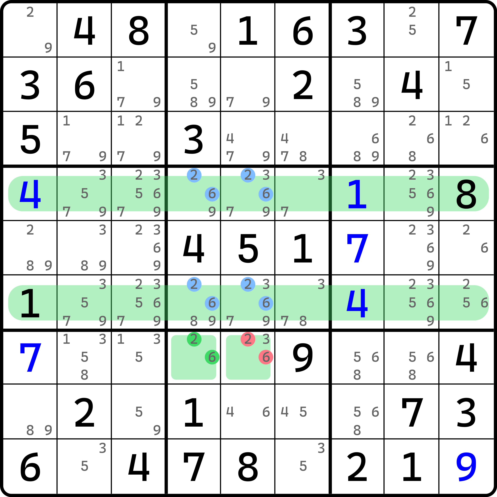
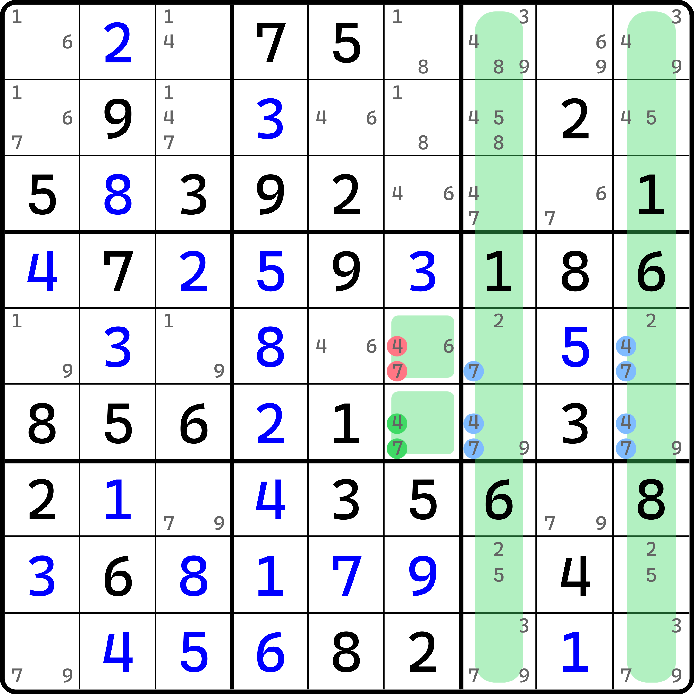
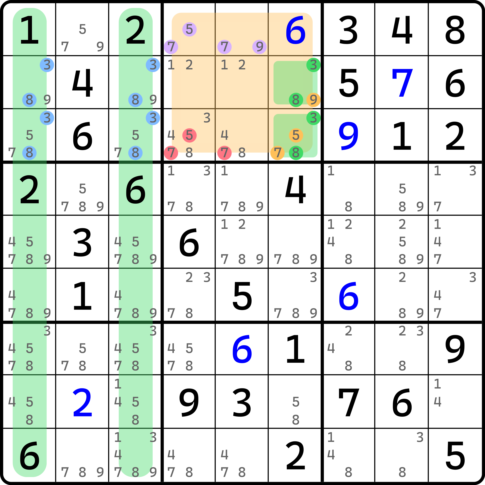
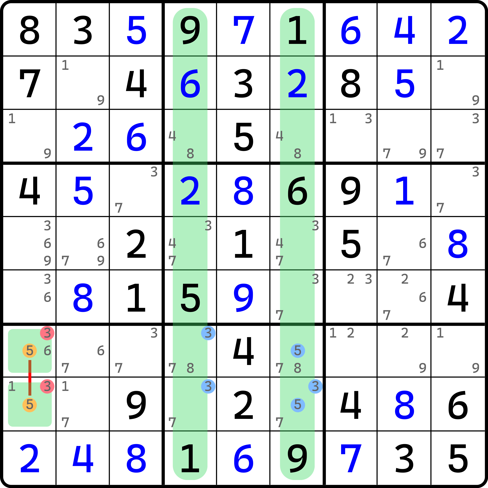
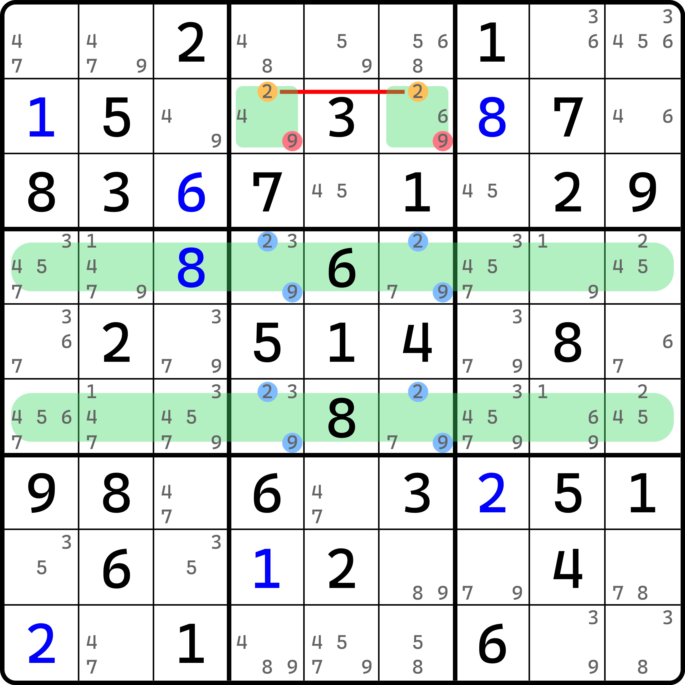
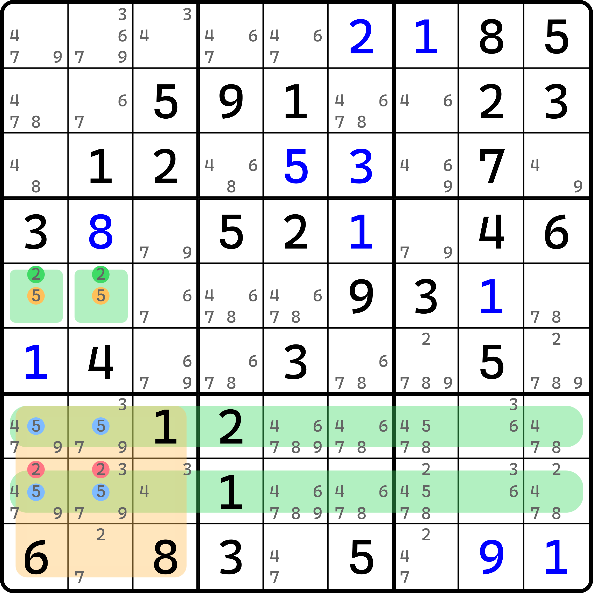
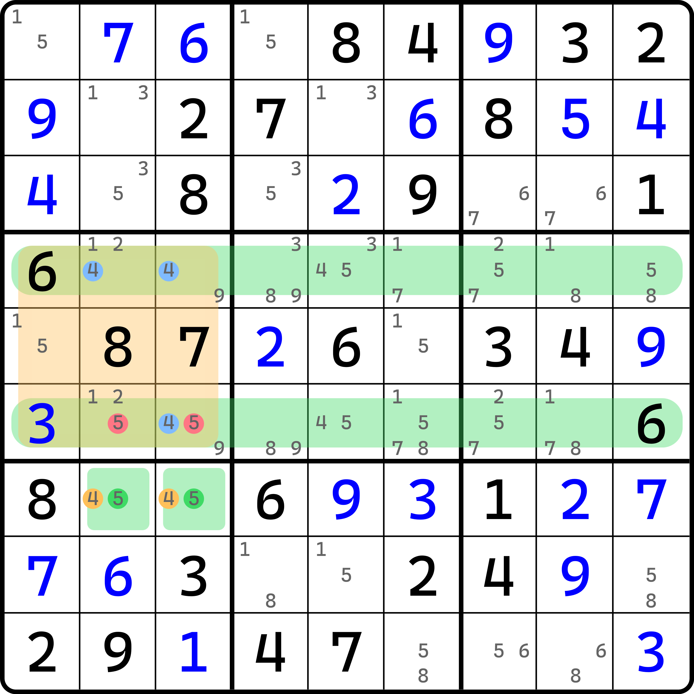
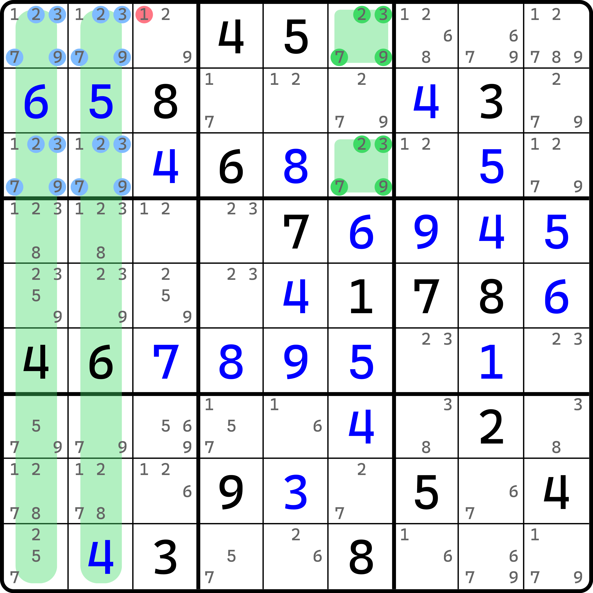
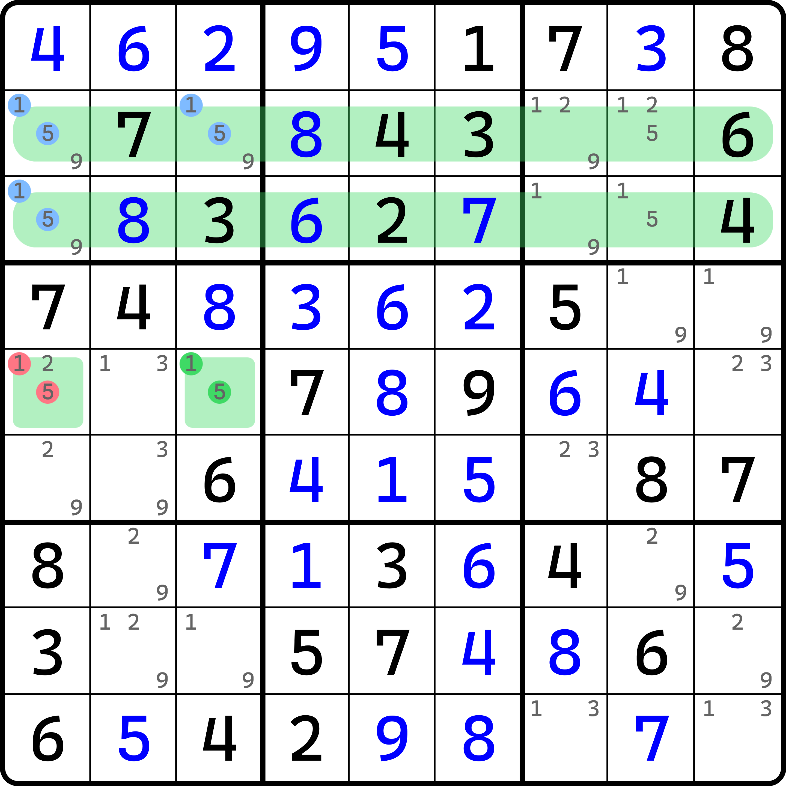
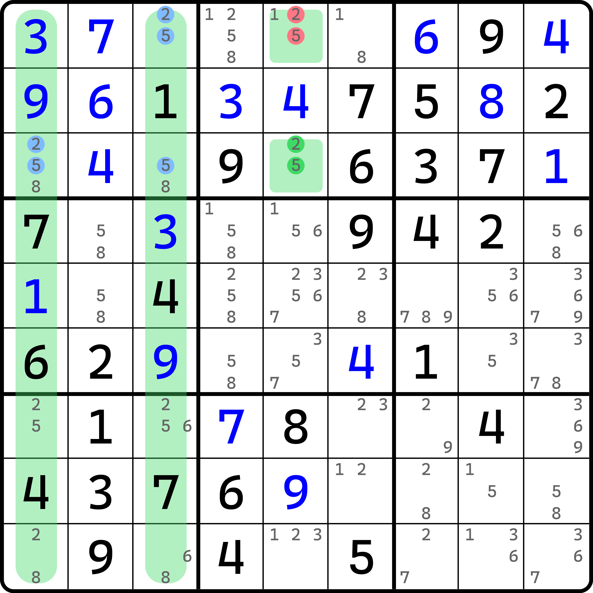

# 淑芬致命结构的一些例子

下面我们来看一些例子。

## 四数淑芬致命结构例子 

先来看稍微常见一点的四数淑芬致命结构。

### 淑芬致命结构类型 1（Qiu's Deadly Pattern Type 1） 

<figure><figcaption>
类型 1
</figcaption></figure>

如图所示。`r57` 里数字 1 和 4 明数成对出现，上下对应；但是 8 下面对应位置出现的是空格且是 2、5、6 三个候选数，所以意味着这两行确实存在这么一个数字不满足规则。而 2 和 6 在 `r7c45` 里出现，`b5` 里又确实只能填在 `r57c45` 四个格子里，因此整个结构一旦让 `r7c5` 只含 2 和 6 的时候会出现矛盾。所以，结论就是 `r7c5 <> 26`。

我们再来看一个例子。

<figure><figcaption>
类型 1，另一个例子
</figcaption></figure>

如图所示。这里就不重复解释了。自己看吧。

### 淑芬致命结构类型 3（Qiu's Deadly Pattern Type 3） 

因为类型 2 实在是没例子，所以就直接跳到类型 3。

<figure><figcaption>
类型 3
</figcaption></figure>

如图所示。如果让 `r23c6` 只有 3 和 8，整个结构将构成形成矛盾；所以只能配合 `r1c45` 形成 5、7、9 的显性三数组结构，所以结论就是删除 `b2` 其他的 5、7、9，即 `r3c4 <> 57` 和 `r3c5 <> 7`。

### 淑芬致命结构类型 4（Qiu's Deadly Pattern Type 4） 

<figure><figcaption>
类型 4
</figcaption></figure>

如图所示。因为 `r78c1` 包含 5 的共轭对，所以不能允许 `r78c1` 里存在 3 的候选数，否则会构成隐性 3、5 数对，造成矛盾。

<figure><figcaption>
类型 4，另一个例子
</figcaption></figure>

如图所示。这个就自己看了。

### 淑芬致命结构类型 4 的变体 

当然了，既然有基本的类型，当然也就会存在特殊的类型；但是这个特殊有点“特殊”，至少说是不能归纳为一个类型，因为它有不同的情况。我们来看一下。

<figure><figcaption>
类型 4 变体，第一个例子
</figcaption></figure>

如图所示。我们发现，2 在 `b7` 还可以填在 `r9c2` 里，但 5 确实是卡死在 `r78c12` 里的。

如果我们让 2 也卡死在其中，也就意味着我们直接形成了矛盾。所以，`r78c12` 里不能填 2，删掉他们。所以这个题的结论就是 `r8c12 <> 2` 了。

我们再来看一个例子。

<figure><figcaption>
类型 4 变体，第二个例子
</figcaption></figure>

如图所示。这个也自己看了。

<figure><figcaption>
类型 4 变体，第三个例子
</figcaption></figure>

如图所示。这个例子看起来麻烦，其实不麻烦。

s要注意的是，因为 `r1c3` 是保持 2、3、7、9 不出现矛盾的特殊位置，所以 `r1c3` 必须是 2、3、7、9 的其一。所以，`r1c3 <> 1` 是这个题的结论。

## 三数淑芬致命结构例子 

下面我们来看三数淑芬致命结构。比较遗憾的是，我本地就只有三个例子，而且还全都是类型 1 的。这里拿其中两个举例，第三个因为长得也差不多，就不列出来了。

<figure><figcaption>
三数淑芬致命结构类型 1
</figcaption></figure>

如图所示。这个就是所谓的变体类型。其中 `r23c13` 里本身四个格子都是空位，但是此时，`r3c3` 是 3 的明数，跟结构的数字 1 和 5 无关。`r23c13` 里不是 9 也满足那个规则吗，那为什么没把 9 算进结构里呢？因为 `r5c13` 没有 9，仅此而已。如果它没有 9，我们就不必讨论关于 9 的情况；虽然 9 是满足条件的，但这并不重要。

再来看上面 `r23` 这两行。明数里 `r2` 出现的是 7、8、4、3、6；而 `r3` 出现的是 8、3、6、2、7、4，其中配对出现的是 3、4、6、7、8，只有 2 没有，所以也满足只有一个数没配对出现的情况。

我们再来看一个变体。

<figure><figcaption>
另一个例子
</figcaption></figure>

如图所示。这个也自己看吧。
