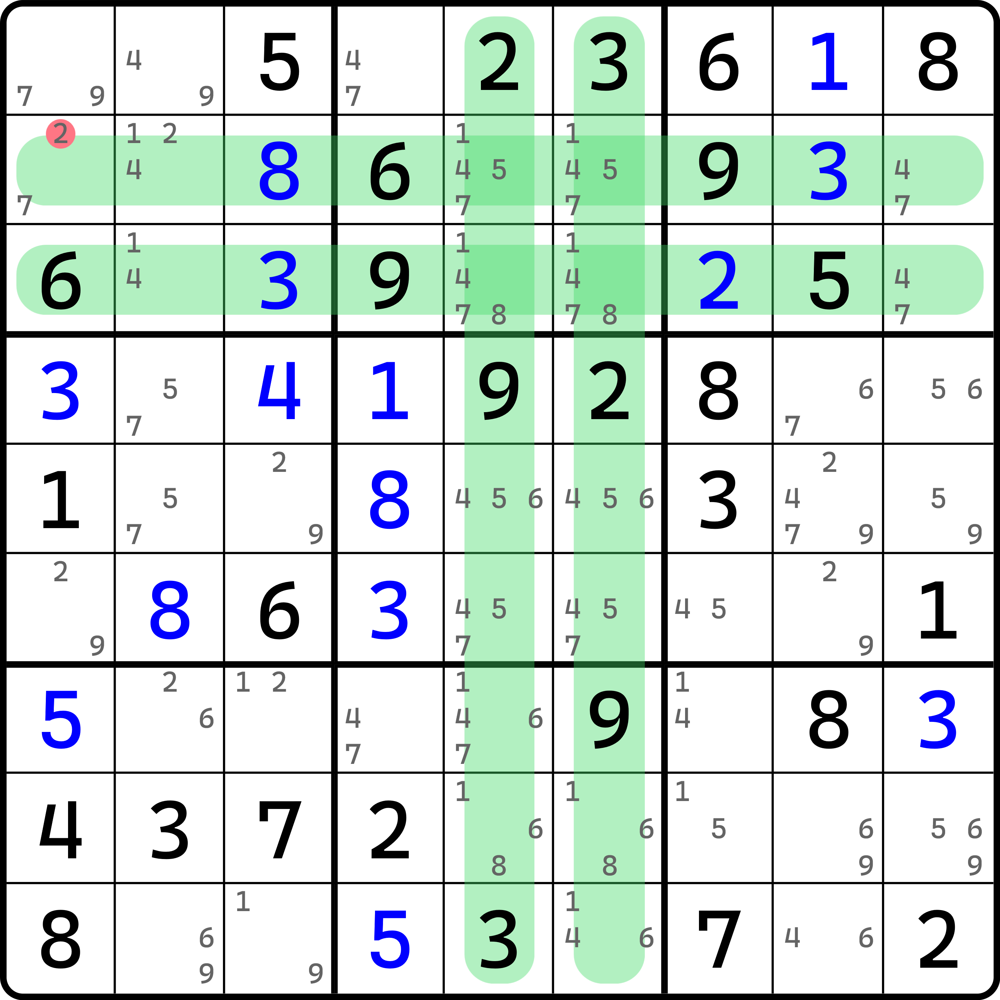
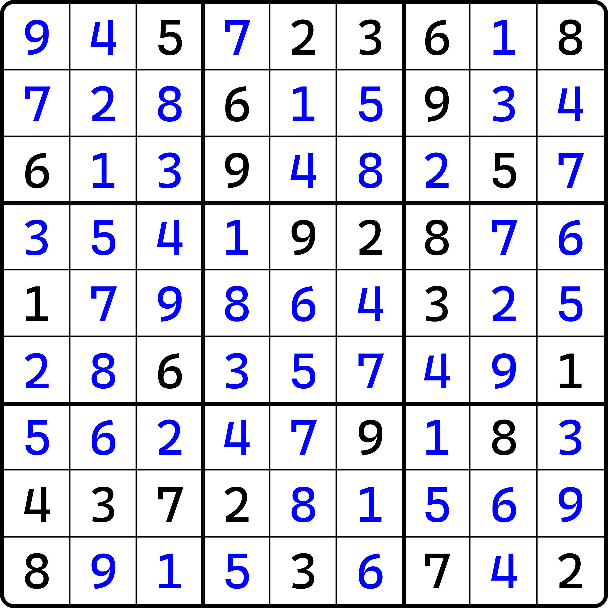
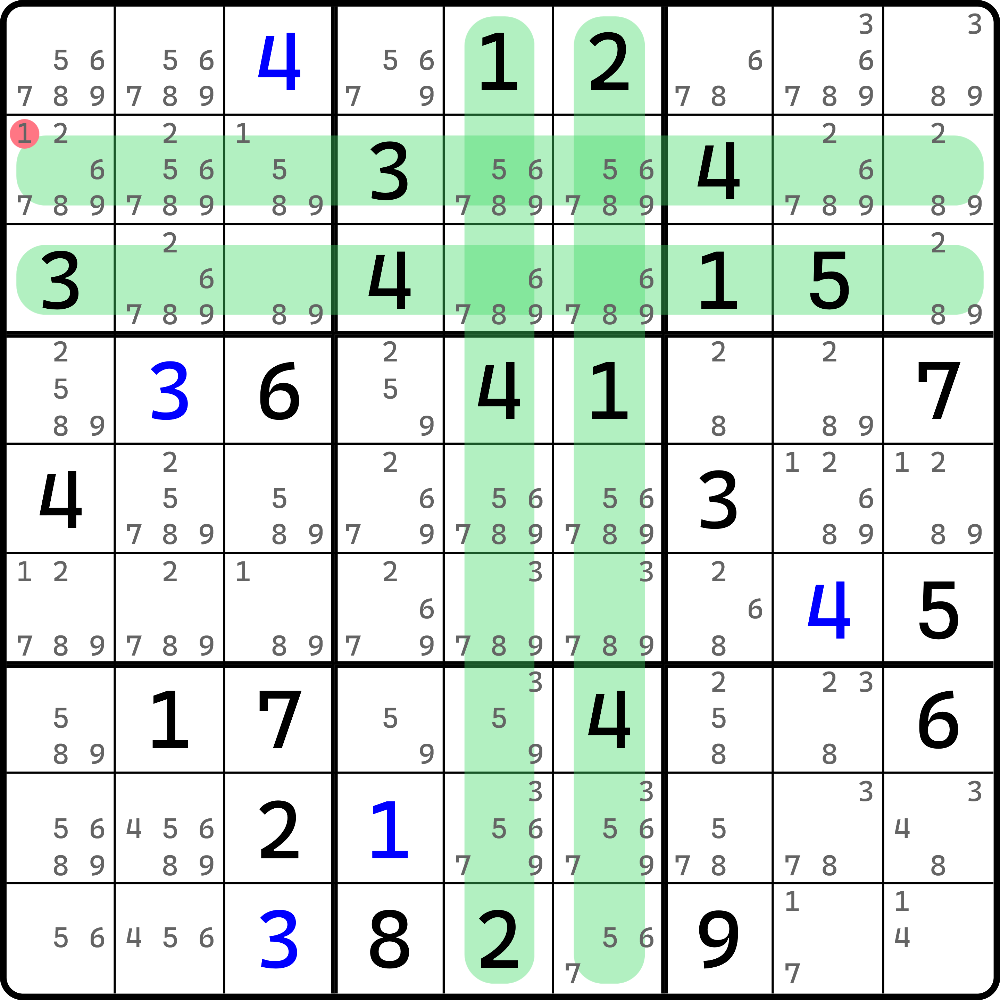

# 双淑芬致命结构

我们之前提到，它的思路是通过交换，传递出一个 3 和 4（那个例子里是 3 和 4），然后使之形成四数探长致命结构的过程。具体逻辑很复杂，我实在是不想重复了。

下面我们来看的是，将其中多出来的两个单元格拿掉，取而代之的是新的一组两个行列的情况。

## 双淑芬致命结构的基本推理

<figure><figcaption>
双淑芬致命结构
</figcaption></figure>

如图所示。可以看到，这个图里，`r23` 是一组、两行，`c56` 是一组、两列。

`r23` 里，`r2c1` 和 `r3c1` 是一个空格一个明数，所以我们不妨来看看数字成对和不成对的情况。假设 `r2c1 = 2`，我们不难发现，2 成对了，3 成对了，6 成对了，9 也成对了，只有 5 和 8 这两个数没有成对出现；而另一边 `c56` 呢？`c56` 就更有意思了。2、3、9 全都成对出现，但对应位置有两处空白单元格，即 `r7c56` 这对，和 `r9c56` 这对。

显然，因为这两个空格在同一个宫里，他们必然填不同的数，所以当你把他视为不同的填数后，你就会发现，成对出现的数字确实也是有一个数不符合的，只是单纯来说，它是模糊的情况，没有落到具体哪个数上而已。

既然 `r23` 是这样，`c56` 也这样，那么我们来看 `b2`。`b2` 里 1、5、8 是符合条件的（不过这看起来似乎没那么重要），因为压根用不着这个规则了。我们不妨来想想，如果我们遵循之前给的证明，这会得到个什么？从 `r23` 举例开始，如果 `r2c1 = 2` 之后，不成对出现的是 5 和 8；而 5 和 8 恰好落入 `r23c56` 里了，于是 `r23c56` 里会有一对 5 和 8 的出现；剩下俩呢？1、4、7 的其二。

然后，因为 `r23c29` 仍然是空格，所以它还需要填写数字，所以按照抽屉原理，这里也会出现 1、4、7 的其二。所以总体而言，就算把 `r23c29` 安排上数字，我们最终也只会有其中两种数字会传递到 `c56` 去。然后呢？然后，因为 `r7c5` 和 `r9c6` 的特殊性，不论填什么，不论怎么填，要么唯一矩形矛盾、要么唯一环矛盾、要么拓展矩形矛盾、要么探长致命结构矛盾。就这么简单。

总之，`r2c1 = 2` 会引发传递成探长致命结构的矛盾，所以本题的结论就是 `r2c1 <> 2`。

我们把这个结构称为**双淑芬致命结构**（Dual Qiu's Deadly Pattern），将原本传统的两个单元格替换为两个行列，使结构变为四个区域（两行、两列）。

## 证明 

证明这个技巧也不是难事，但需要带点传递的感觉。

在之前的内容里，我们已经知道，在淑芬致命结构的证明过程之中，数字串联序列可以进行分组并构造传递情况，比如我们把上面这个双淑芬致命结构的 `r23` 拆成两部分来看。一部分是位于 `b2` 里的单元格，一部分是余下的 12 个单元格。

我们照着这个题的答案来看看我想说什么。

<figure><figcaption>
这个题的答案
</figcaption></figure>

如图所示。这是上面那个例子的答案。展示答案并不是说这个技巧的证明需要依赖于答案本身，而是随便拿一个完整的两行和两列已经填好数字的序列作为演示，告诉你我要说什么。

可以看到，`r2` 里是 7、2、8、6、1、5、9、3、4，`r3` 里是 6、1、3、9、4、8、2、5、7。我们知道的是，刚才展示技巧的那一步盘面里，只有一个数没有配对出现。对于明数而言，上下对应位置已经都给了明数的填入（包括 `r2c1`，因为是假设 2 会造成矛盾，所以我们姑且假设它也填上了数），和传统的一个明数搭配一个空格还有点不同。但是感觉上的不同不代表逻辑上的不同，因为他们本质是一样的——上下对应位置就是只有一对数字不一样。

刚才的例子里，用到的格子是 `r23c13478` 这些格子。这一组格子里，我们提取出成对出现的数字和不成对出现的数字。不成对出现的数字是 5 和 8。那么对于 `r2` 余下的 8 个格子 `r23c2569` 里，5 和 8 还会再出现一次，这样两行才能完整保证 5 和 8 都出现且是两次。

观察答案可以知道，`r2c2569` 里的数是 2、1、5、4，`r3c2569` 里的数是 1、4、8、7。我们从 `r2c2` 开始，按之前说的上下配对串联迭代的思路，可以得到两组序列：2-1-4-7 和 5-8。找这个序列一般是随意的，你也可以选别的，比如从 `r2c5` 开始，这样 1 会被断开。即 2-1-4-7 在路径里会被拆成 2-1 和 1-4-7 这样，仅此而已。

再看 `c56`，因为剩下俩空格，但因为它内部填的数一定不相同，所以我们先假定填了个 $$a$$ 和 $$b$$，于是就是 $$a$$、$$b$$、2、3、9 这几种数字。因为 $$a$$ 和 $$b$$ 就出现了一次，所以在余下的 `r23568c56` 这 10 个单元格里，$$a$$ 和 $$b$$ 也都会再出现一次。

> 当然了，我们已经知道了最终答案里 $$a$$ 是 7、$$b$$ 是 6；不过我们之前在做题的时候是不知晓的。

而对于这 10 个单元格而言，我们可以从 `r5c5` 开始找出这么一整个串联序列：6-4-8-1-5-7。

好了。现在我们已经知道了两点：

1. 序列随便从哪里开始都行，无关紧要；
2. 序列可以随意拆开和组合，形成不同数字作为起始和结束的情况。

有这两点就足够了。请把视角看到 `r23c56` 这四个单元格上。这四个单元格最终会选取其中四个数填入，而这四个数一定来自于 `r23` 和 `c56` 里。因为他们都是空格的缘故，所以在初始找成对出现的数字的时候，他们必然不会被纳入其中。别觉得这是废话。我想说的是，正是因为它是空格，所以猜也猜得到，这四个格子将会对后面证明矛盾起到重要的作用。

从答案来看，里面填的是 1、4、5、8。而恰好的是，`r23` 在使用串联迭代找序列的操作里，我们用到了 1、2、4、5、7、8 这些数，而 1、4、5、8 全都在其中；`c56` 里用到的是 1、4、5、6、7、8，而 1、4、5、8 也全都在其中。这暗示了一个点。我们说，找这个迭代路径的过程其实就是把最终头尾串联的数字对作为最终这两个行或这两个列所传递出来的数对。所以这意味着从逻辑上，我们能传递出 1、4、5、8 里任选其二的数对，而且还是两个（一个是 `r23` 传递出来的竖放的数对，一个是 `c56` 传递出来的横放的数对）。再配合 `r23c56`，这便构成了一个四数探长致命结构。因为四数探长致命结构是致命的，所以原本结构也就是致命的。证毕。

## 另一个例子 

我们再来看一个例子。

<figure><figcaption>
双淑芬致命结构，另一个例子
</figcaption></figure>

这个结构长得就很像是第一个例子，但是看候选数数量就可以看到，其实不是一个题。但是因为是一样的，所以就不重复解释了。

是的，这个技巧我就这两个例子。
