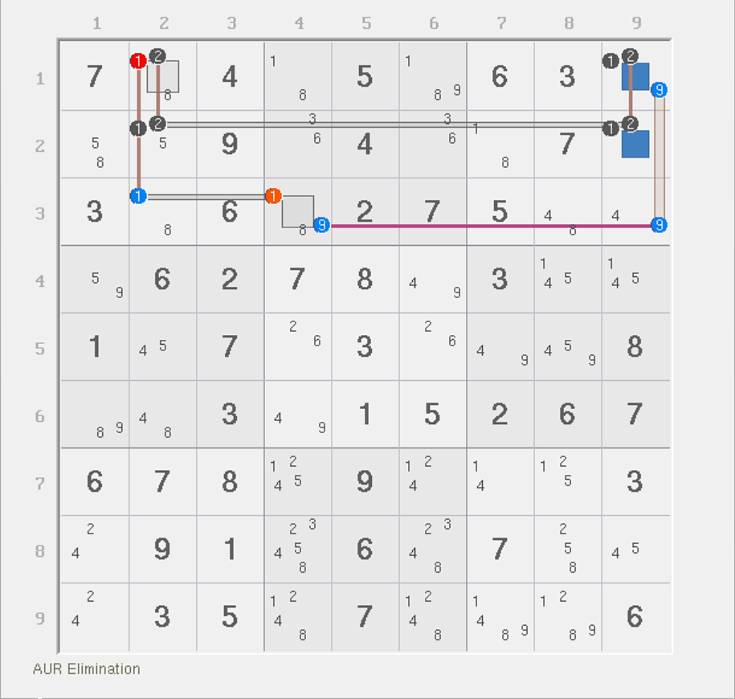
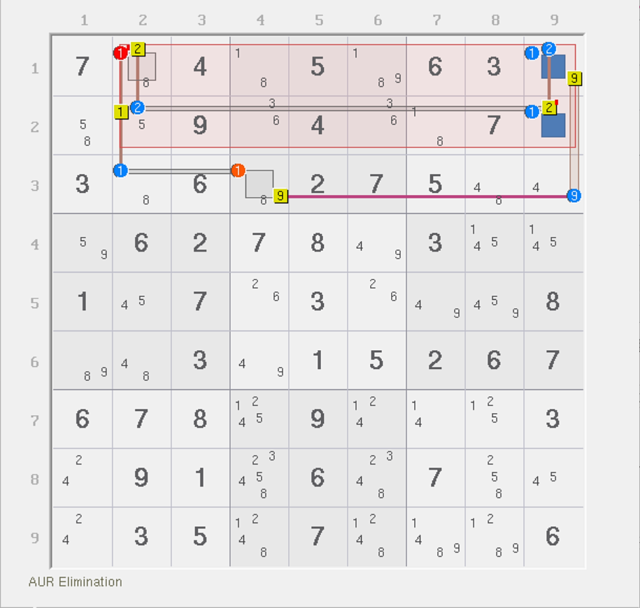
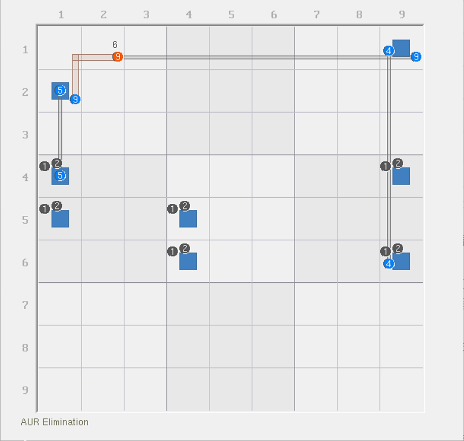
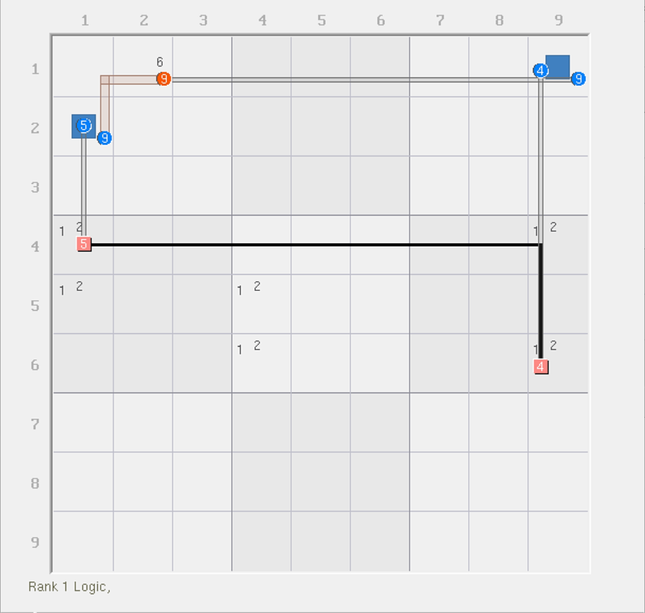

# 致命结构的秩

在致命结构理论里，致命结构的满足条件是通过穷举（咱先不管人脑能不能穷举出来吧，至少电脑可以），然后可以算出所有情况均造成致命的效果，然后得到的。显然，这个思维跟秩理论的讨论有一定的相似性，所以按道理来说，它是可以在秩理论里使用的。

之所以没有在秩理论讲这个，一来是整个教程对于这两个技巧而言，在讲解上的顺序编排的问题；二来是因为，它需要考虑一个本质的问题是，它必须有一定的对致命结构的底层原理的认知才能解释。

## 致命结构在秩理论里的讨论方式 <a href="#determine-rank-of-deadly-pattern" id="determine-rank-of-deadly-pattern"></a>

<figure><figcaption><p>使用了唯一矩形的链</p></figcaption></figure>

如图所示。这个是一个使用了唯一矩形的链，并得到删数是 `r1c2 <> 1` 和 `r3c4 <> 1`。

秩理论里有所谓递归分析的概念，这意味着我们在讨论其情况的时候，多数时候会对这个结构进行一轮包装（比如诠释为普通的链的处理逻辑，或者是动态链分支的逻辑，并按这种技巧理论进行删数，避免穷举）；但也有时候结构足够麻烦，以至于我们无法用技巧简单包装起来，于是不得不进行穷举或者是递归分析。

我们且不说它的复杂度高低的问题，这并不重要。我们这里主要想说的是，对于分析致命结构的时候，秩理论里甚至几乎不考虑对致命结构的考虑。比如下面展示了一个填法：

<figure><figcaption><p>其中一种填法</p></figcaption></figure>

因为 XSudo 软件在标黑了致命结构的这些候选数后，无法正常显示穷举的组合，因此这里换了个显示模式。

> 红色框起来的是唯一矩形这部分；部分数字边上有个小的红色的撇号记号 `'`，这个暗示的是唯一矩形的两个点位可以唯一确定这个唯一矩形结构在哪里，不影响技巧推演过程。

可以看到，这种情况下，`r1c2 = 2` 和 `r3c4 = 9` 可以确保删数成立（当然，这个删数要想成立，显然是需要其他所有情况也都能删的才行，只是这里只演示了一个填法状态罢了）。那么，只需要找出这个结构里的所有填数方案，取个交集就行了。

要注意的是，致命结构要多一层考虑，就是安排填数位置的时候，因为致命结构本身要求不允许往这些涉及的单元格里填的全都是致命结构用的数字（最上面图里黑色的那些），所以在找填法的时候要明确记得规避一下。不过话说回来了，也正是因为唯一解的题不可能有能让致命结构填充成立的状态，所以也不必担心这一点对我们的思考有任何禁锢和约束，仅仅是方便我们找删数的时候更快捕捉到合适的结果。就像是你把每个填法下延伸出来的填法当成一棵树的根在无限延展，而致命结构填法的规避，其实等效于你在对这棵树的根茎进行“剪枝”而已。

## 再来一个例子 <a href="#another-example" id="another-example"></a>

再比如下面这个示意图里给的删数，它的秩理论结构的画法是这样的：

<figure><figcaption><p>另外一个例子，示意图</p></figcaption></figure>

想必我不用多重复什么吧。

## 致命结构和虚拟区域 <a href="#deadly-pattern-and-virtual-set" id="deadly-pattern-and-virtual-set"></a>

想必你已经发现了，致命结构大多都只是延伸数字的方式引出强链或弱链关系。从这个角度来说，它等效于虚拟区域。致命结构不存在秩一说，但它可以抽取强链，使结构可以在填充次数上做文章。

<figure><figcaption><p>上面的例子，用虚拟强区域的方式表示</p></figcaption></figure>

如图所示。当我们将逻辑形成的强链关系按虚拟强区域改写后，链路改成这个显示方式。当然，删数是照样有的，只是换了画法罢了。

从这个角度来说，这个结构的秩是等于 1 的，因为有 4 个弱区域和 3 个强区域，所有数字也都是精确覆盖的。所以，我们也可以说，原本致命结构的画法下，那个结构的秩也为 1；但是，如果你使用 XSudo 软件获取信息的时候，它会这么告诉你致命结构的强弱区域情况：


```
12 N [0,20] 20 Candidates 
     9 Truths = {245N1 1N2 56N4 146N9}
     4 Links = {9r1 4c9 5c1 9b1}
     AUR points {aur 1r4c1 2r4c1 1r4c9 2r4c9 1r5c1 2r5c1 1r5c4 2r5c4 1r6c4 2r6c4 1r6c9 2r6c9 }
     1 Elimination, 1 Assignment --> [1N2] => r1c2=6, (1N2*9r1*9b1) => r1c2<>9
```


可以看到，它会完整告诉你这个结构有 9 个强区域和 4 个弱区域。弱区域不用多说，但强区域为什么是 9 个呢？我们先留着这个问题，之后我们再说。
