# 旋转致命结构的基本推理

## 引例 

<figure>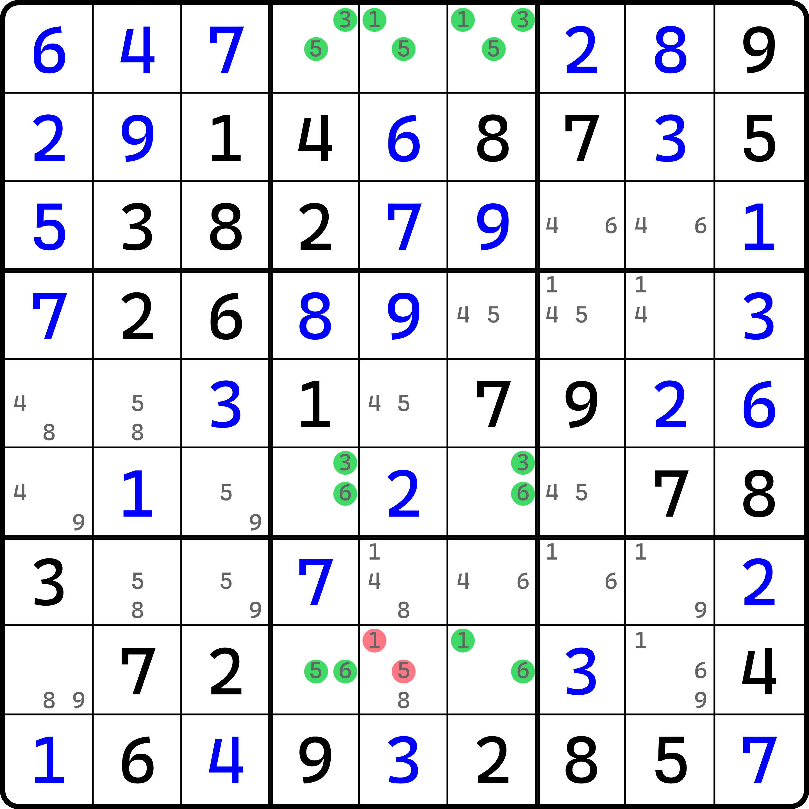<figcaption>
缺一格的唯一矩阵
</figcaption></figure>

如图所示。如果让 `r8c5(8)` 为假的话，图中 `r1c456`、`r6c46` 和 `r8c456` 八个单元格将构成致命。所以，结论就是 `r8c5 <> 15`。

我知道你肯定觉得一头雾水。这看起来很像是唯一矩阵（毕竟三行三列 + 4 种不同数字），但它缺了一个单元格。这还是致命结构？这如果是的话，为什么之前不提它呢？

我们先从枚举的视角给大家看看它是怎么矛盾的。这个题一共就两种填法：

<figure>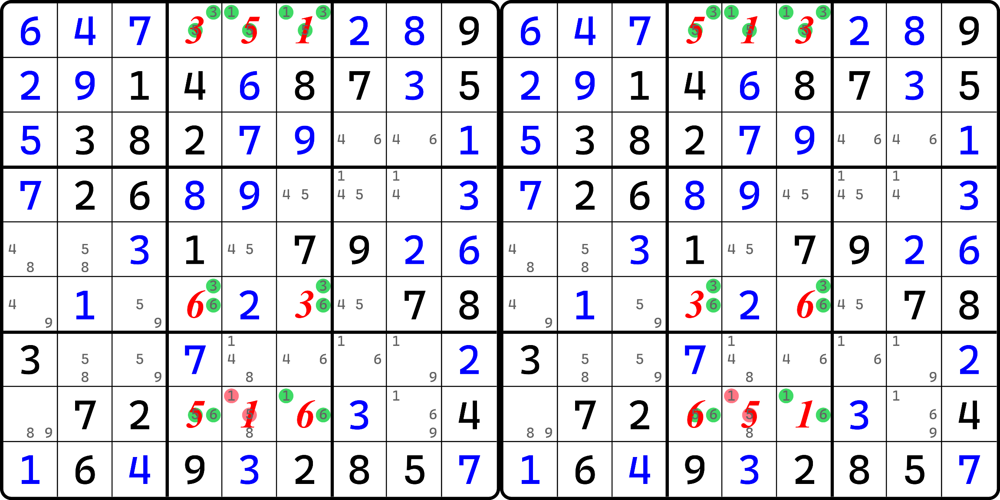<figcaption>
两种填法
</figcaption></figure>

如图所示。这两种填法下，所在行、列、宫的数字位置发生了变换，但数字种类总体是不变的，所以它从枚举和致命结构的条件来看，是符合致命结构的特征的，所以，结论是可以形成的。

不过我们不难想到，它既然是四种数，那么我们把数字补回去看看啥情况。

<figure>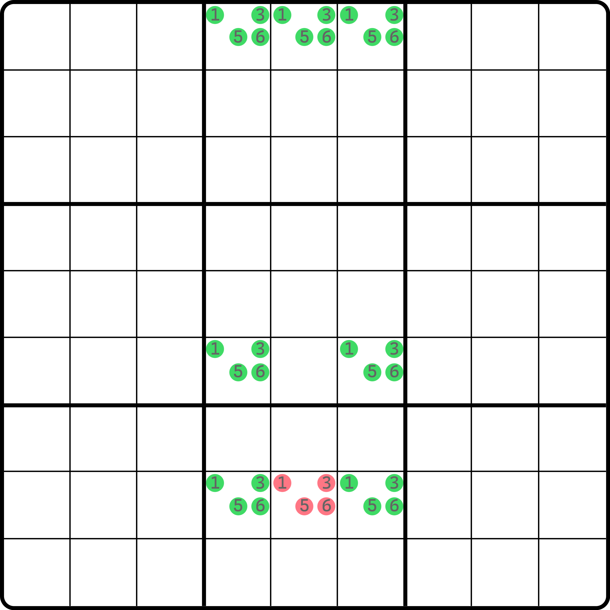<figcaption>
上面致命结构的完整版（吗？）
</figcaption></figure>

如图所示。可以看到，这样补全之后就长这样。

不过很遗憾的是，这个结构却不是致命的。换言之，我们把它补全之后，原本的结构反而不满足致命的特征了。实际上，这个结构总共有 864 种不同的解（不违背数独基础规则的解）。虽然这个情况非常多，但是我还是给各位看看是什么情况。

这个题不符合致命结构的条件，原因是其中有一些解是不符合致命结构里的那个交换数字而不影响总体数字出现类型的这个条件的。因为每个解的填法的图打印出来确实费劲，所以我这里就节选其中一部分打印成文本格式，给各位看一下他们大概是什么样：

<figure>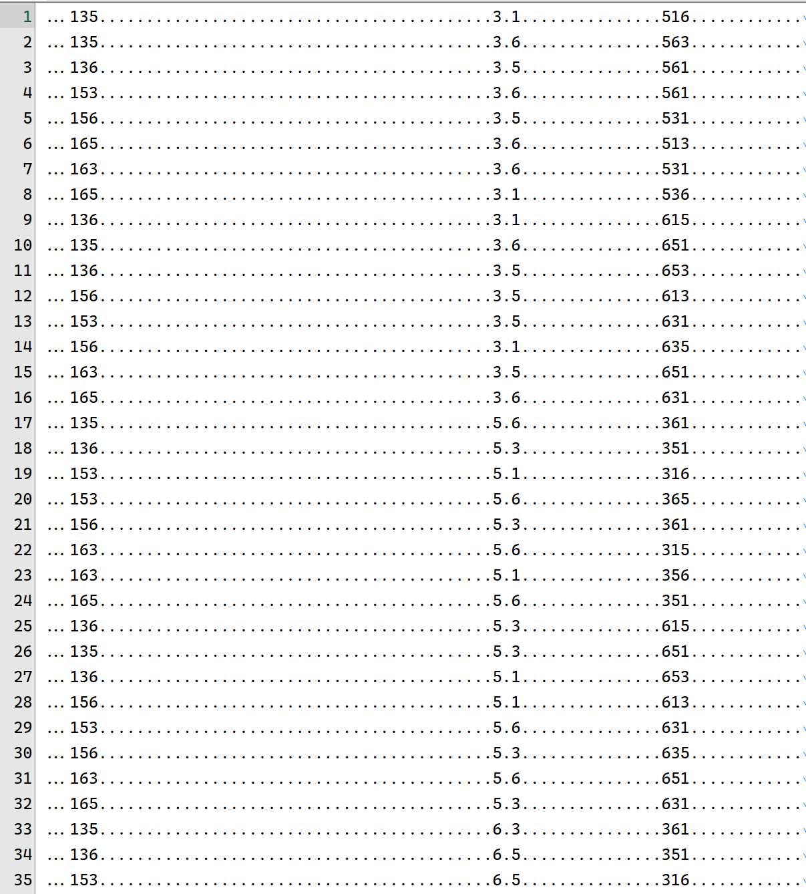<figcaption>
一些我打印出来的不符合条件的解（文本形式）
</figcaption></figure>

图中只演示了其中一部分（不然图就会特别长）；每一行都是一个解，小数点表示空格，每一个填数按次序从左到右编排，就可以还原出解在实际盘面里的填法了。

实际上，这 864 种不同的填法下，一共有 192 个解不符合条件。我们把这种，结构本身形成致命结构的矛盾，但将结构补全候选数之后反而不是致命的特殊致命结构形式，称为**条件致命结构**（Conditional Deadly Pattern）。其中，最为代表的一类是上面讲解的这种情况：唯一矩阵但缺其中一个单元格的情况。这个矩阵缺一个格的致命结构是有单独的名字的，它叫**旋转致命结构**（Rotating Deadly Pattern）。

## 条件致命结构的条件 

### 什么叫条件？ 

对于这种特殊的条件致命结构而言，我们一般没有办法快速判别是否致命，所以圈子内的朋友多数是采用从小结构开始总结，然后一点一点将结构扩大（例如使用之前学到的传递）。

而一般的结构我们可直接通过传递判断；当有些结构比较“整体”的时候，比如唯一矩阵，我们确实不能用传递的方式得到结构致命与否，所以只能一点点去挖掘。然后去从这些结构入手，移除一些单元格来构造新结构出来。

此时，因为挖去一些单元格的行为会破坏原有结构的设计，而原本的结构是“无条件致命”的，所以挖去之后可能就会存在一些格子填了数字但无法找出合理交换形式的情况了，这便会造成两种局面：

1. **无条件致命结构变为了条件致命结构**：此时我们要追加一些额外条件以过滤掉他们，进而让满足条件的余下这些填法能符合致命结构的特征；
2. **无条件致命结构直接变为不是致命结构了**：这种一般是删错位置了，造成结构无解了，或是结构存在一些区域下就一个格子，直接肉眼可见不符合致命结构的特征。

后者我们就不多说了，这里主要是前者。前者的话，一般要么穷举，要么根据我们设定的条件来直接当成固定结构记住，是两种不同的做法。当然了，人脑穷举的话，肯定会很慢，所以最好是当成固定结构记住它，就行。

### 旋转致命结构的条件 

我们可以人为规定它，它必须基于一定条件下，结构即使四种数字，也可形成致命结构。那么，它的条件是什么呢？

<figure>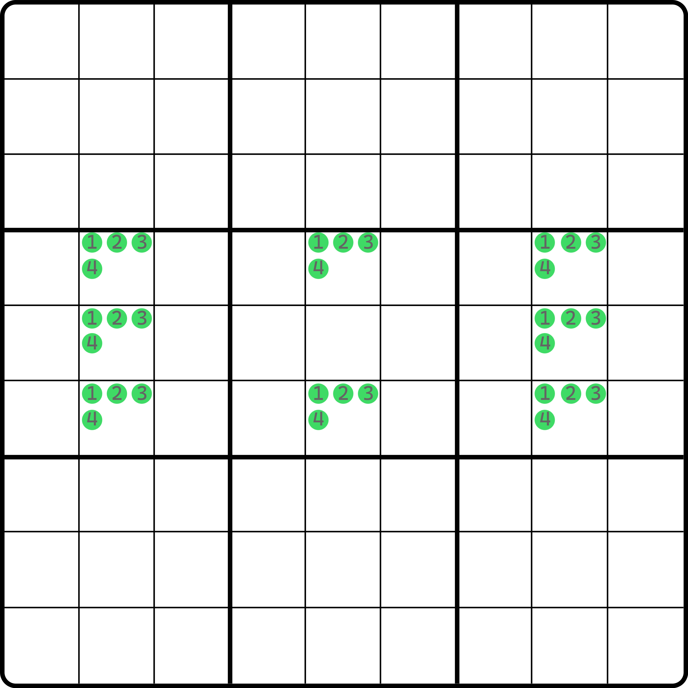<figcaption>
旋转致命结构，示意图
</figcaption></figure>

如图所示。我们只需要添加一个条件就行：唯一矩阵所缺少的那个位置为中心点，所在行和列上必定会穿过四个单元格（其中有两个是同行的，有两个是同列的）。只要让同行这两个单元格最终填数，和同列两个单元格的最终填数不相同即可。比如 `r5c28` 选取 1 和 2，而 `r46c5` 选取 3 和 4，这样结构就致命了。

那么，为什么呢？我们来看看为什么。

<figure>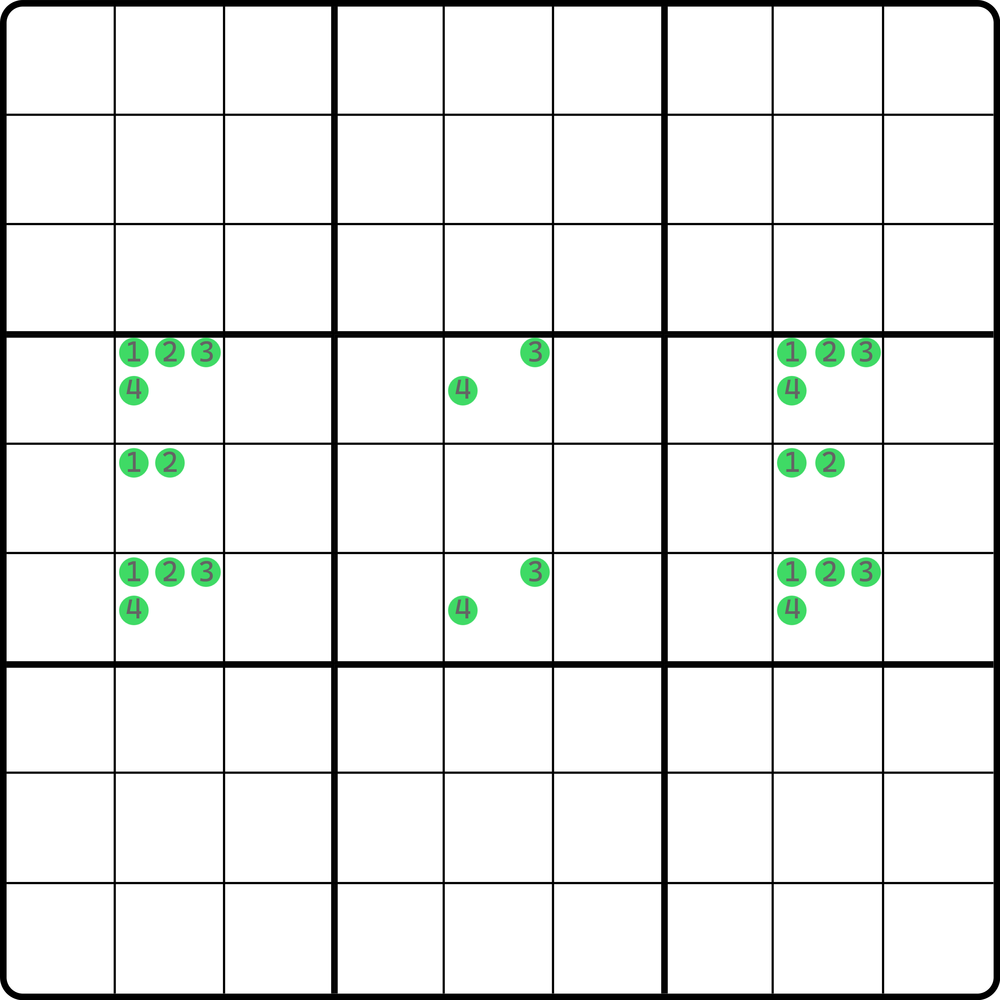<figcaption>
旋转致命结构的条件
</figcaption></figure>

如图所示。当我们这么去选取数字的时候，它就是致命的。当然了，如果选取的数字分组是 1、3 和 2、4 这些都是可以的，只要两个数对数字不相同即可，这里只拿 1、2 和 3、4 举例。

此时，因为结构比较对称，所以我们按 `r4c2` 来讨论。假设它是 1 或 2，为了规避唯一矩形的矛盾，此时 `r4c8` 只能是 3、4；然后又由于 3 和 4 要规避唯一矩形的矛盾，所以 `r6c8` 只能是 12，然后进而又规避唯一矩形去删减 `r6c2` 的候选数，最终我们可以得到这样的结构：

<figure>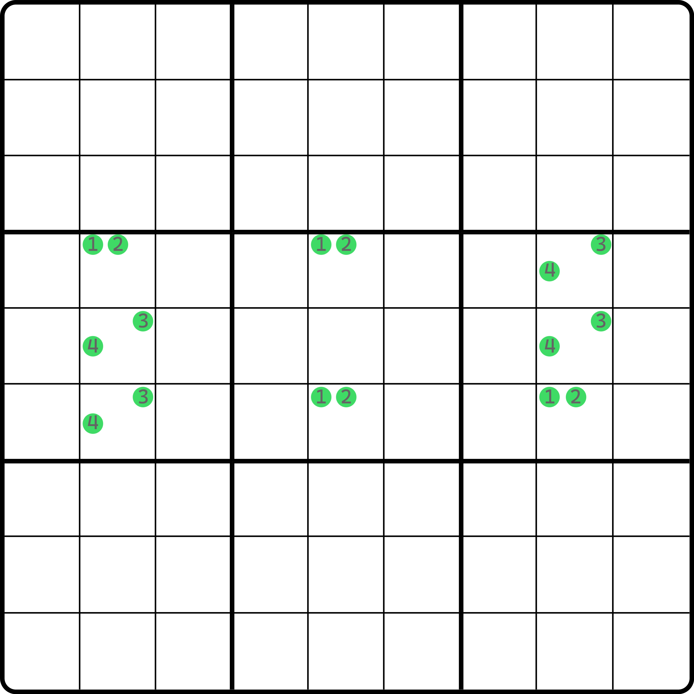<figcaption>
旋转致命结构，当 r4c2 是 1 或 2 的删减后的样子
</figcaption></figure>

如图所示。当出现这个形状的时候，你肯定会觉得这玩意儿这么对称，居然是致命的？是的。我们不妨这么想：我们把每一个单元格选取的实际填数顺时针旋转，填在它下一个位置上去。

<figure>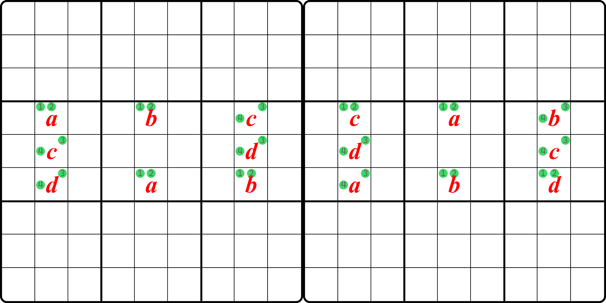<figcaption>
旋转致命结构，删减后可形成矛盾的原因
</figcaption></figure>

如图所示。我们可以看到，原本填的数字，它顺时针下一个单元格的位置填上它即可，这样绕一圈之后，数字的位置发生了变化，但是总体所有的区域下，数字原本是哪些还是哪些。其中 $$a$$ 和 $$b$$ 是 1 或 2，$$c$$ 和 $$d$$ 是 3 或 4。

旋转之后 $$c$$ 或 $$d$$ 会填在 $$a$$ 和 $$b$$ 原来的位置上，这样不是错的填法吗？如果你还在思考这个问题的话，我建议你还得重新回去理解一下致命结构形成矛盾的条件这个内容。

总之，因为换了之后，数字并未有变动，所以这个结构此时是致命的。当然了，讨论 `r4c2` 是 3 或 4 也是如此，所以这里就不讨论了（讨论 3 和 4 的时候需要逆时针旋转而非顺时针）。

正是因为这个结构用旋转的方式证明得到，所以它被称为旋转致命结构。

> 另外，本结构还可以用另外一个条件限制，也可以得到致命——我们还是选这个缺少的格子为中心，按行列划线，这样可以得到横向一个数对纵向一个数对。只要其中一个数对选定是某两种数字后，它俩边上的、构成斜角位置上的两个单元格也是这两种数字，就可以构成致命。比如说图里我们选定 `r46c5` 是 1 或 2，那么如果结构还原回去全都是 1、2、3、4 的状态，只要让 `r4c2` 和 `r6c8` 也是 1 和 2，就可以形成致命。当然，你让 `r4c8` 和 `r6c4` 是 1 和 2 也是一样的，结构是对称的嘛。
>
> 不过这里就不带着证明了，这个说起来也不难，读者可以自行对此进行证明。

下面我们来看一些旋转致命结构的例子。

## 一些例子 

### 旋转致命结构类型 1（Rotating Deadly Pattern Type 1） 

<figure>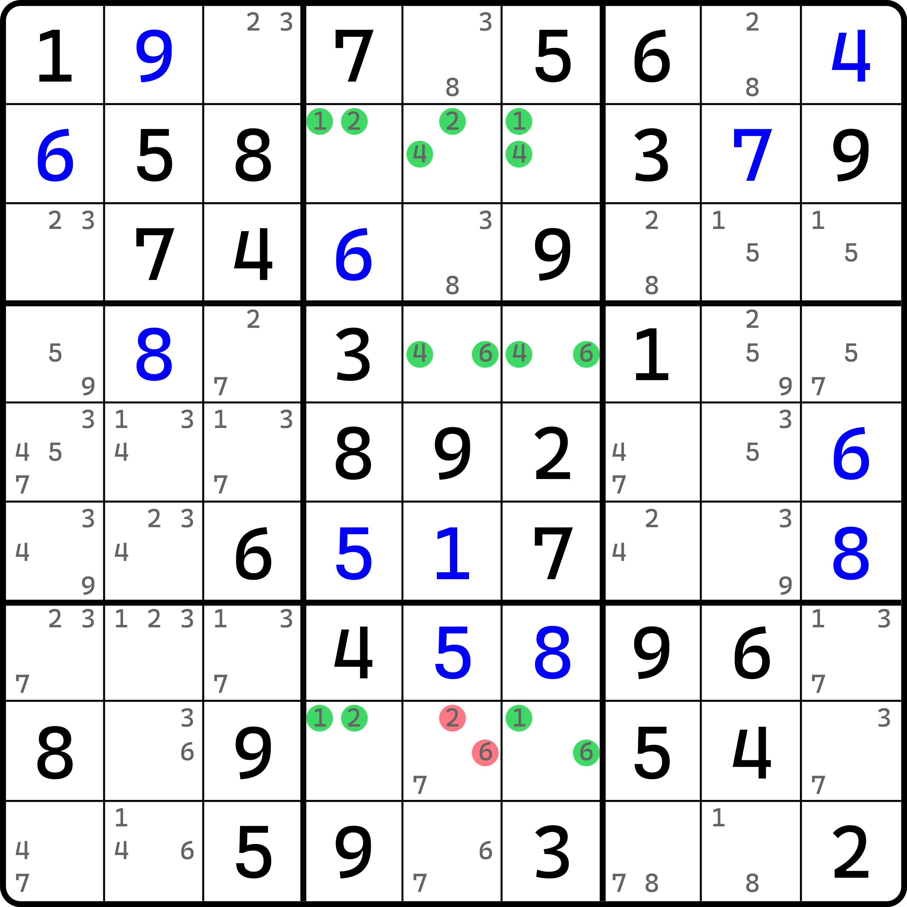<figcaption>
类型 1 例子
</figcaption></figure>

如图所示。这个地方缺少的位置是 `r4c4`，而横向是 4、6 数对，纵向是 1、2 数对，符合刚才的条件。因此这个结构是致命的。

<figure>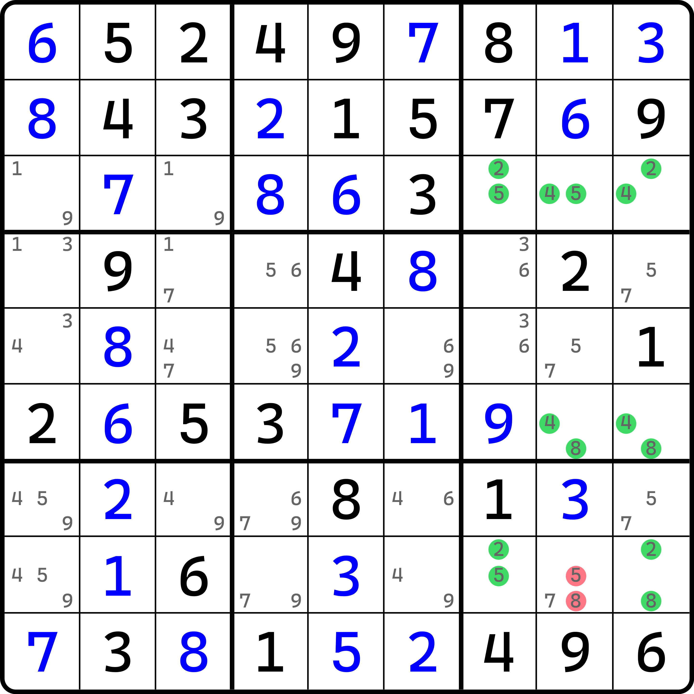<figcaption>
类型 1，另一个例子
</figcaption></figure>

如图所示。这个例子缺少的是 `r6c7` 这个位置。横向的是 4、8，纵向是 2、5。

### 旋转致命结构类型 2（Rotating Deadly Pattern Type 2） 

<figure>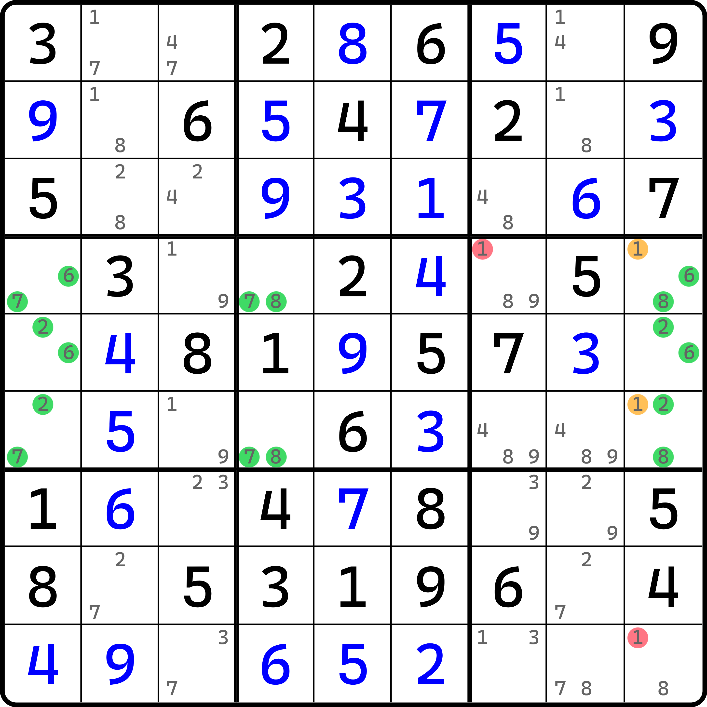<figcaption>
类型 2
</figcaption></figure>

如图所示。这个就自己看了。

### 旋转致命结构类型 3（Rotating Deadly Pattern Type 3） 

<figure>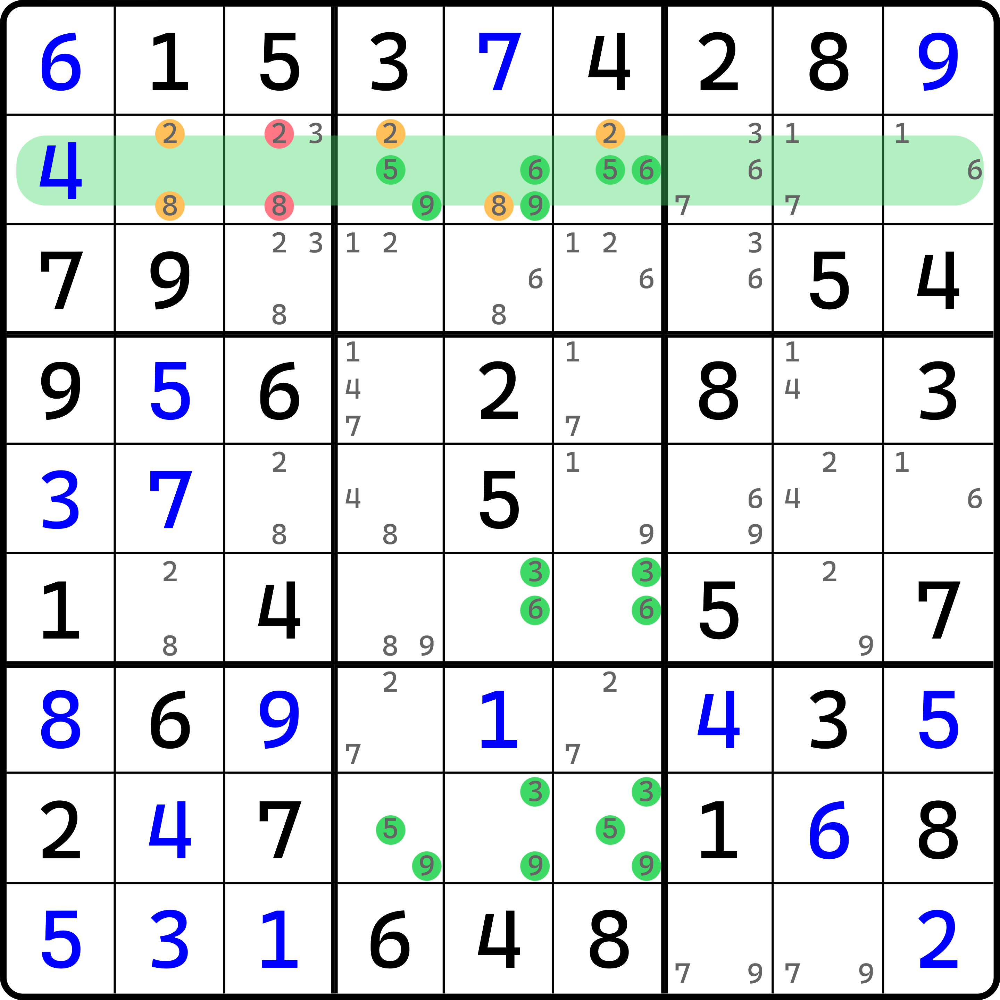<figcaption>
类型 3
</figcaption></figure>

如图所示。

### 旋转致命结构类型 4（Rotating Deadly Pattern Type 4） 

<figure>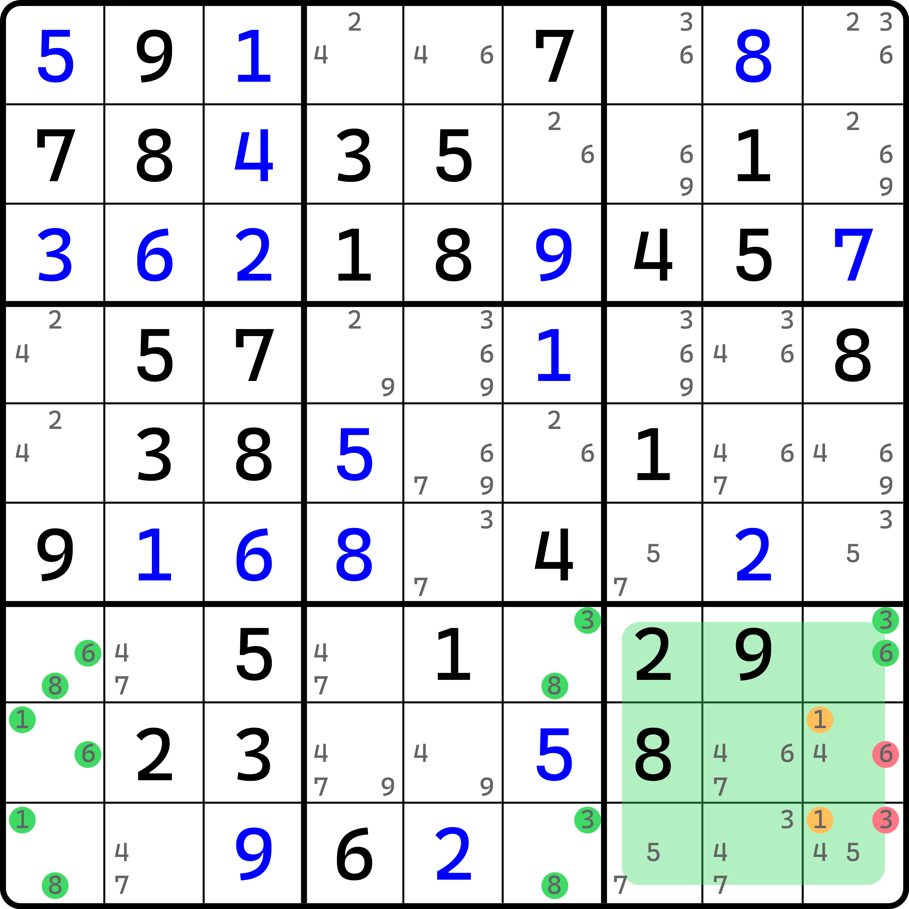<figcaption>
类型 4
</figcaption></figure>

如图所示。这个例子需要说一下。

因为 `c9` 上有 1 的共轭对（或者说 `b9` 里），所以 `r89c9` 里必须有一个是 1。如果让 `r8c9 = 6` 将直接造成矛盾（矛盾原因就是前面描述那样）。

这题也能删 `r9c9(3)`，因为它填了之后，共轭对会让 `r8c9 = 1`，于是 `r8` 上这个数对是 1 和 6，而 `c6` 里的数对是 3 和 8，也符合条件。
