# 拐角模式

在平时讨论致命结构的时候，前面的知识点可以对一些简单的致命结构进行分析了。但是，也存在一些情况确实无法分析，所以我们需要总结出来他们，看看能不能有破解的点。这里显然会存在一个讨论理论结构的时候从小到大的过程。比如说，我要找一个新的、属于致命结构的结构，但是前面的传递可以解决很多我可以想到的样子，所以有些想不到的就需要我们自己进行构造。

在此时，结构需要我们从空盘里选取一些格子，然后固定给他们安排一些候选数可用作填入，然后去论证它是否致命。这便是这篇文章的重点讨论的内容。

## 拐角模式和致命条件 

### 何为“拐角”？ 

<figure>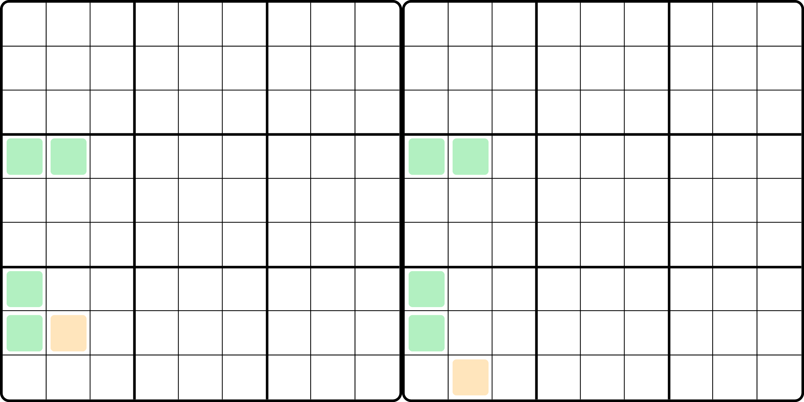<figcaption>
拐角模式
</figcaption></figure>

如图所示。对于致命结构理论里，我们把 `b7` 称为**拐角**（Corner）。所谓拐角，指的是在致命结构的传递里，分布超过 3 个单元格，或分布是 2 个单元格，但格子分布是斜放的情况。比如这个图里的 `r8c2` 和 `r9c2` 不同，会构成不同的拐角模式。

需要说的是，要构成致命结构，显然里面包含的数字种类需要有一定的要求。比如 `b7` 里有三个单元格，因此显然需要填写的是三种不同的数字；而对于 `r4`（或者说 `b4`）而言，里面只能填两种数。考虑到这是用于致命结构里，成为致命结构的其中一部分，所以就算 `r4` 里的是两个孤立的单元格，我们也要求它和 `b7` 里的填数处于一种包含关系，或者说 `r4c12` 里的填数必须在 `b7` 里的这几个格子里的填数里全都出现过，不能出现完全不一样的数。

这一点很重要，它需要作为大前提，作为后续内容的预设的约定条件。

### 结构的修正 

要总结新的结构，就需要找出一些固定的模式。当结构不成为致命结构的闭环状态的情况（比如上面拐角模式下，`r7` 上就只有一个单元格，这种显然不是致命的），于是我们就需要在 `r7` 上再补充一个格子，使之闭环。但是，补充的格子本身也需要形成闭环，所以我们一般会在 `b8` 或 `b9` 里塞一个竖着放的数对（或数组）来让结构涉及的所有区域下全都至少两个单元格。且不说它是不是致命结构，但至少它看起来还挺像的吧。

我们把这个补充单元格使结构成为致命结构的做法称为对结构的**修正**（Fix）。修正一词在之前就有提到了，比如对网的修正。这里借用一下这个说法。

### 修正方式和致命条件 

为了方便描述，我们把前面的配图里左图称为直角拐角或 L 型拐角，右图里称为钝角拐角或非 L 型拐角。

* **对 L 型拐角模式而言，它本身不影响致命结构的形成，所以可直接参与修正；**
* **对非 L 型拐角模式而言，修正后的结构下，仅当橙色格和其同行列的三个单元格是跨区三数组时才可避免致命。**

前者 L 型拐角模式还比较好理解，非 L 型这个是什么情况呢？我举个例子。因为它如果作为致命结构的一部分的话，首先 `r9c2` 这个格子非常特殊，它现在因为摆在了 `r9` 里，所以此时 `r789` 全部是单个单元格。我们需要在 `b8` 或 `b9` 里找三个位置，竖着摆下他们，进行修正。最容易想到的办法是这样放：

<figure>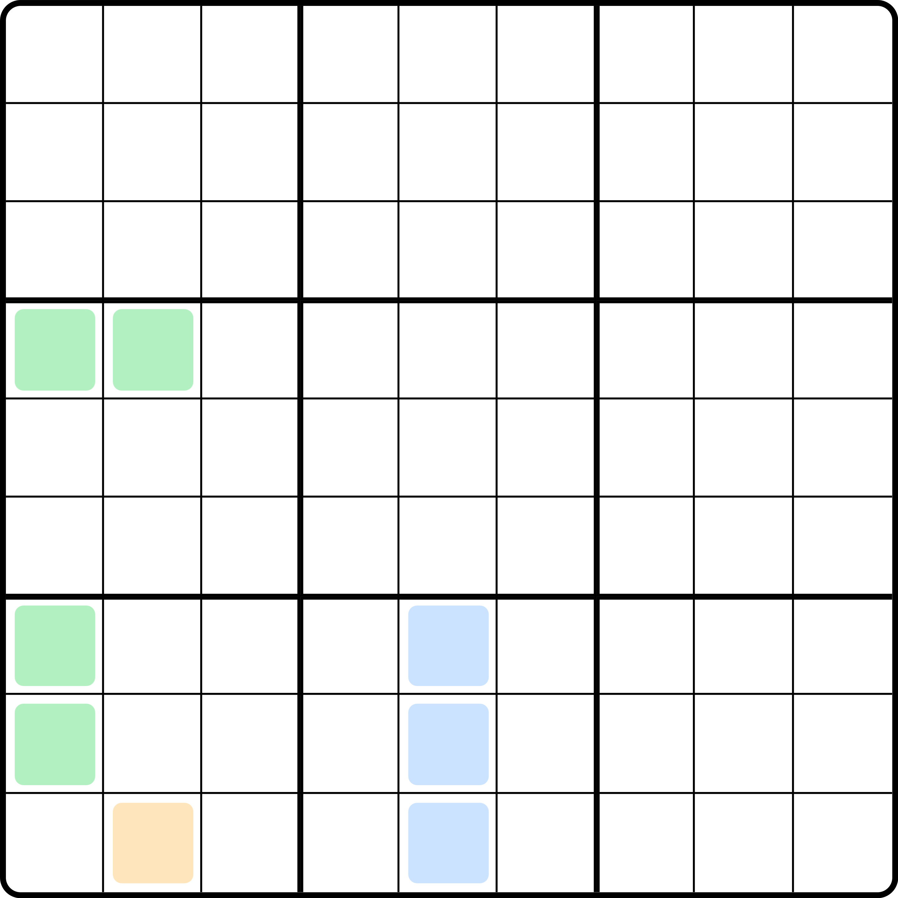<figcaption>
补充 r789c5 作为修正
</figcaption></figure>

如图所示。在 `r789c5` 补充三个格子作为修正，结构就可形成条件致命结构。之所以是说“它形成条件致命结构”，是因为它有一种情况不会致命，就是让橙色格所看得到的行列两个格子，包含它自己在内的话，这三个单元格如果是跨区三数组，就不会致命，即这样的情况：

<figure>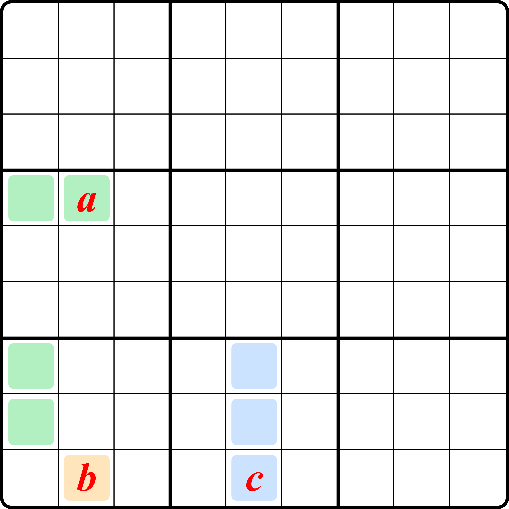<figcaption>
修正后不构成致命的情况
</figcaption></figure>

如图所示。仅当这样的情况出现，我们才认为它是不致命的。其他情况均致命。

> 此条件可通过枚举得证，因此这里就不带着大家用枚举证明了，没那个必要，也不够优雅。

### 一个例子 

<figure>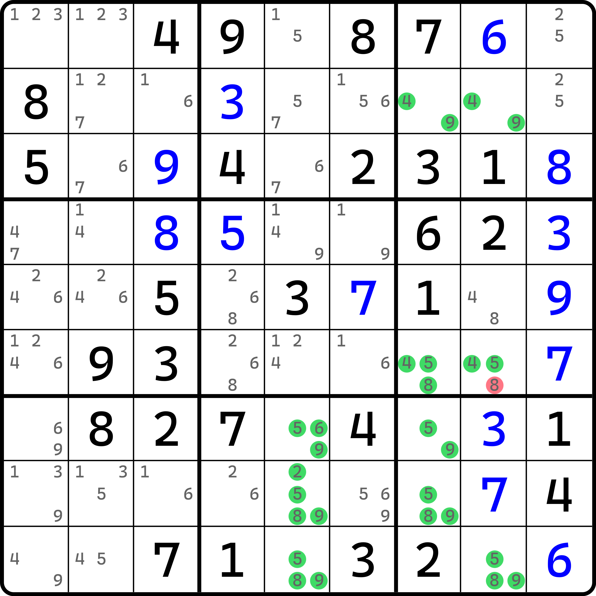<figcaption>
一个例子
</figcaption></figure>

如图所示。这个结构是非 L 型拐角模式，在 `r9c8` 这里是起到和前面示意图里橙色格子一样作用的位置，修正位于 `b8` 里的这三个单元格。上面 `r26c78` 则是余下的单元格。

可以对比示意图发现，示意图里仅有一对单元格是孤立的，但这里却包含两对，一个在 `b3` 一个在 `b6`。这里可以明显发现，因为 4 整个结构就在 `r26c78` 里用过，而且刚好布局处于二阶鱼那样的摆放模式，所以 4 的影响可以被省去（不用讨论），但 5、8、9 每个下面都有使用，你无法确保最终 `r26c78` 里选取的数字是什么（只有 4 是稳定出现的，别的数都不是稳定出现的），所以不敢省略，所以等于说是传递出了一个横放的两个单元格，一个位于 `c7` 里一个位于 `c8` 里，且里面包含的候选数都是 5、8、9，选其二填入；但 5、8、9 具体是哪两个我们不能略去讨论，只有 4 可以移除作为传递的“消耗品”（或者说传递媒介）。然后呢？然后结构传递之后就跟上面非 L 型拐角模式的修正结构就完全一样了，4 的效果被移除，整体结构只有三种数字，全部条件均满足。

假设让 `r6c8` 填了 8 之后，`b9` 里很容易得到 `r8c7` 填 8的结果，然后又因为 `c5`（或者说 `b8` 里）有 8 的共轭对，所以此时又可得到 `r9c5` 填 8 的结论。刚才我们说到，结构仅当拐角可看到的两个格子，包含它自己的时候三个格子是跨区数组时不致命，而此时 `r9c5` 和 `r6c8` 同时填 8 不是跨区数组，因此必然致命。所以，`r6c8 = 8` 的假设错误，故结论是 `r6c8 <> 8`。

是的，就这一个例子。

## 其他三数的拐角模式及修正 

下面我们快速地过一遍其他的拐角模式，以及修正方式。因为这些模式都比较复杂，所以往往仅存在于理论层面，实战很难出现这样规整的结构。

后面的内容由解素商整理得到。可能没有列举全，因为毕竟是自己私下总结的，如果有更多的情况也欢迎读者自己去钻研一下。

### 非 L 型拐角模式 - 修正方式 1 

我们在 `b9` 额外增加两个竖放的格子（也是这三种数字），即可修正，结构无条件致命。

<figure>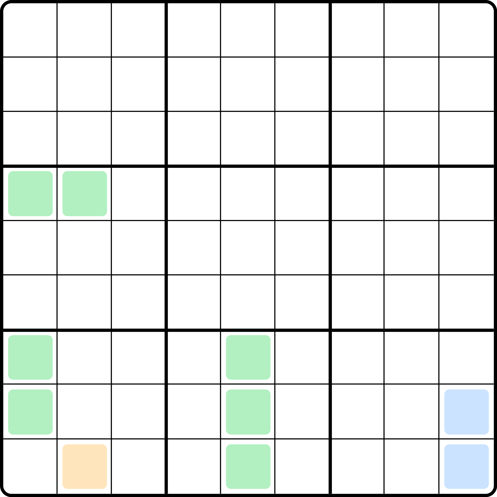<figcaption>
非 L 修正方式 1
</figcaption></figure>

如图所示。这样是可以的。

### 非 L 型拐角模式 - 修正方式 2 

当需要将其和普通 L 型拐角模式叠加的时候，可将拐角点位摆放和非 L 型拐角模式的点位同行列来达到修正。

<figure>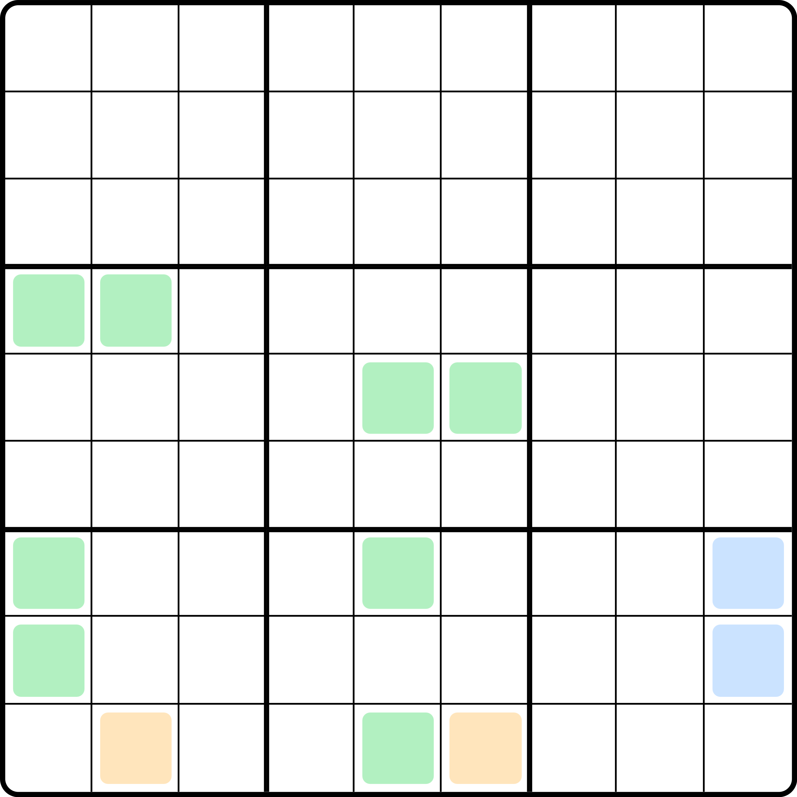<figcaption>
非 L 修正方式 2
</figcaption></figure>

如图所示。这样也是无条件致命的。

### 双非 L 型拐角模式 - 修正方式 1 

在 `b9` 里补充一对竖放的单元格可形成无条件致命。

<figure>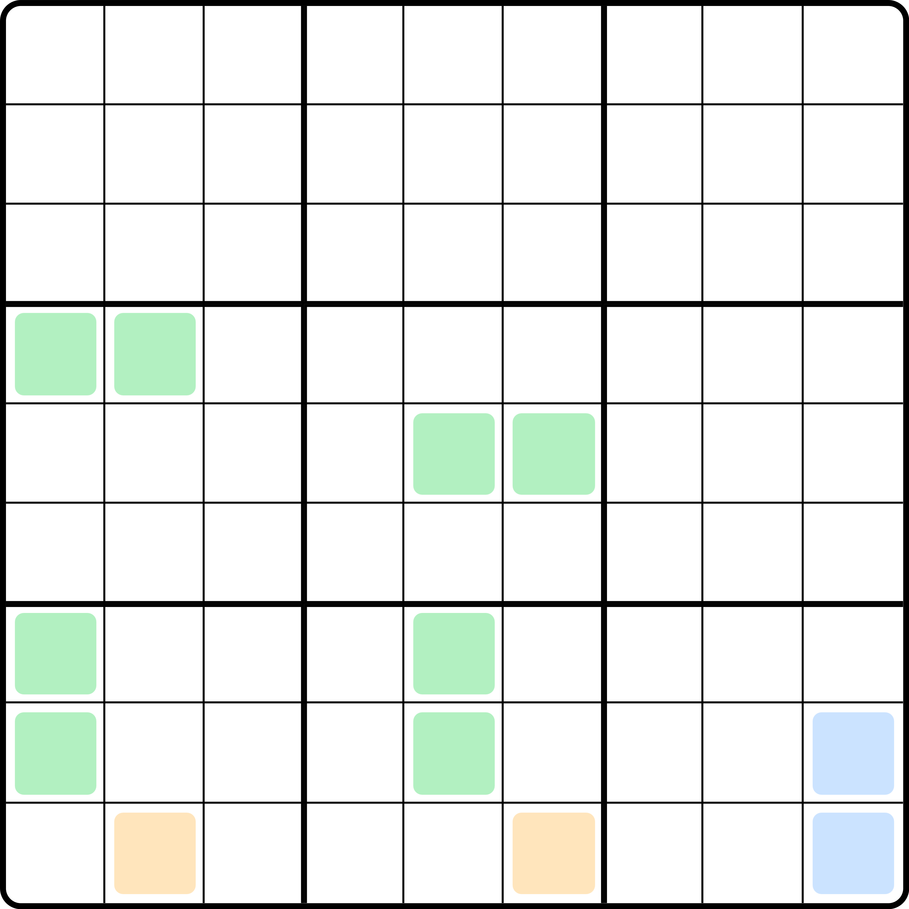<figcaption>
双非 L 修正方式 1
</figcaption></figure>

### 双非 L 型拐角模式 - 修正方式 2 

叠加两个非 L 型拐角模式的时候，就算拐角点位错开摆放，也是无条件致命的，只要保持 `r89c9` 修正格不变即可。

<figure>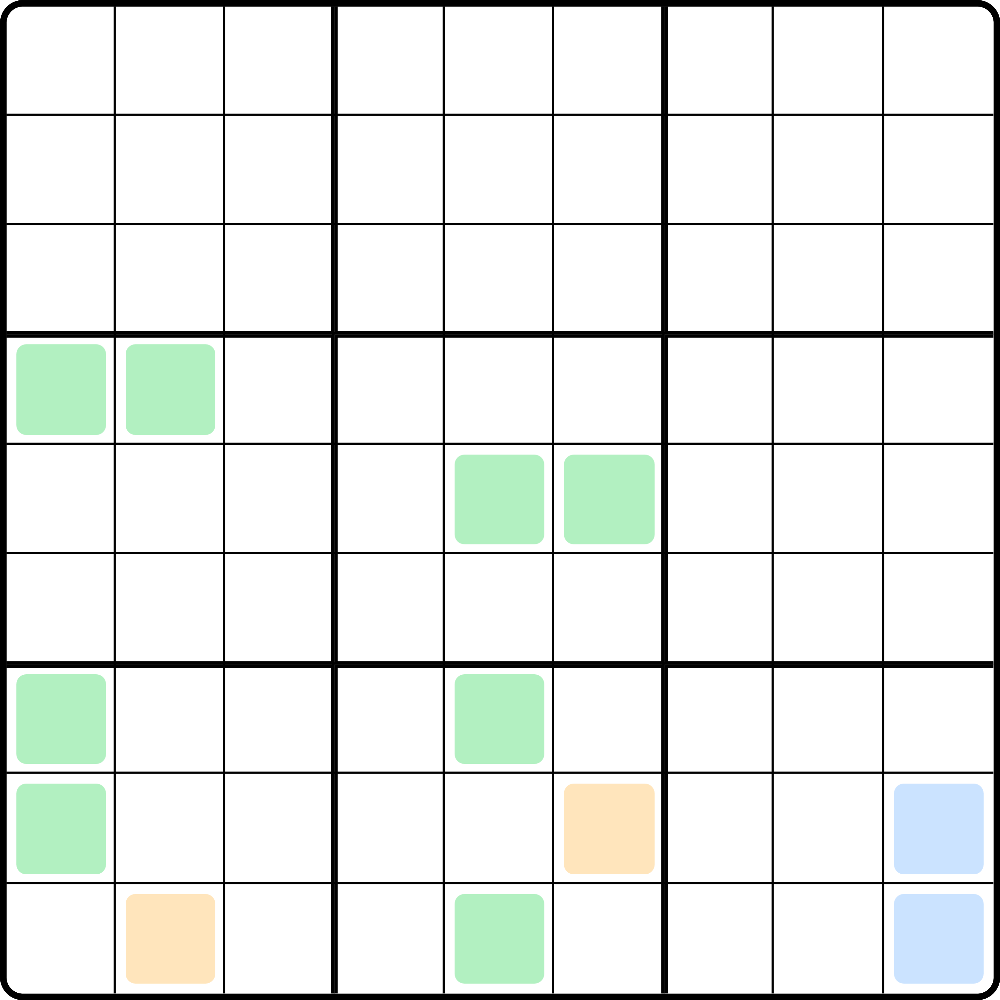<figcaption>
双非 L 修正方式 2
</figcaption></figure>

### 双非 L 型拐角模式 - 修正方式 3 

但是，当 `r89c9` 作为修正格，只对其中一个拐角点位修正，另一个不修正的话，就会成为条件致命结构。

<figure>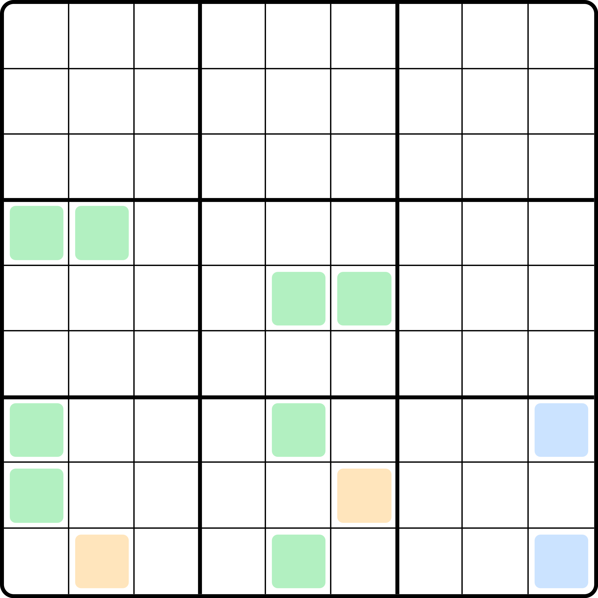<figcaption>
双非 L 修正方式 3 - 条件致命
</figcaption></figure>

如图所示。当没有被修正的点位是 `r8c6`，因为 `r89c9` 修正格改成了 `r79c9`，显然 `r8` 上的填数没被修正。此时，仅当此单元格和它看得见的同行列的两个单元格，三个格子构成跨区三数组的时候不致命。即这三个单元格：

<figure>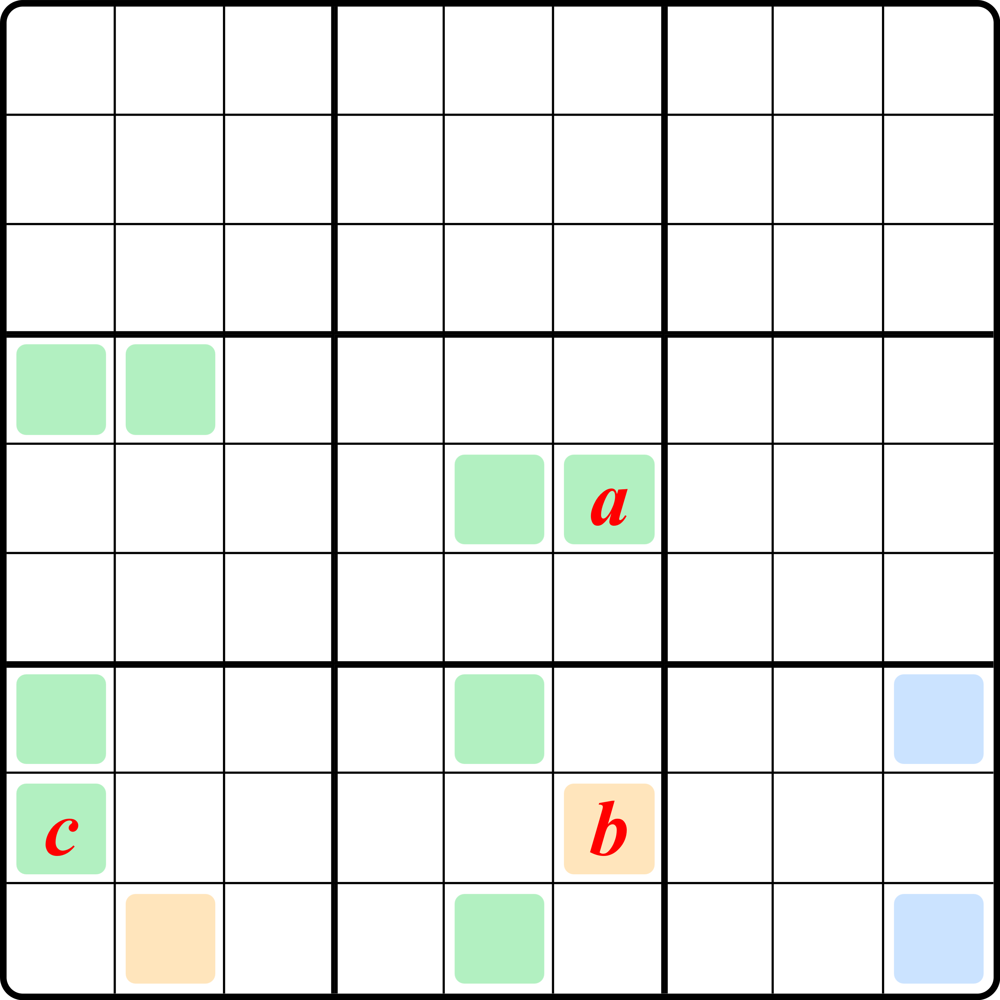<figcaption>
不构成致命的时候
</figcaption></figure>

如图所示。当 `r58c6` 和 `r8c1` 构成跨区三数组的时候不构成致命。

## 四数的拐角模式及修正 

既然有三种数可构成的拐角模式的修正后致命的情况，那肯定会有四种数字的情况，只是说四种数字没有可用例子，所以只能配上示意图看看理论就行了，差不多得了。

### 四数的拐角模式 

<figure>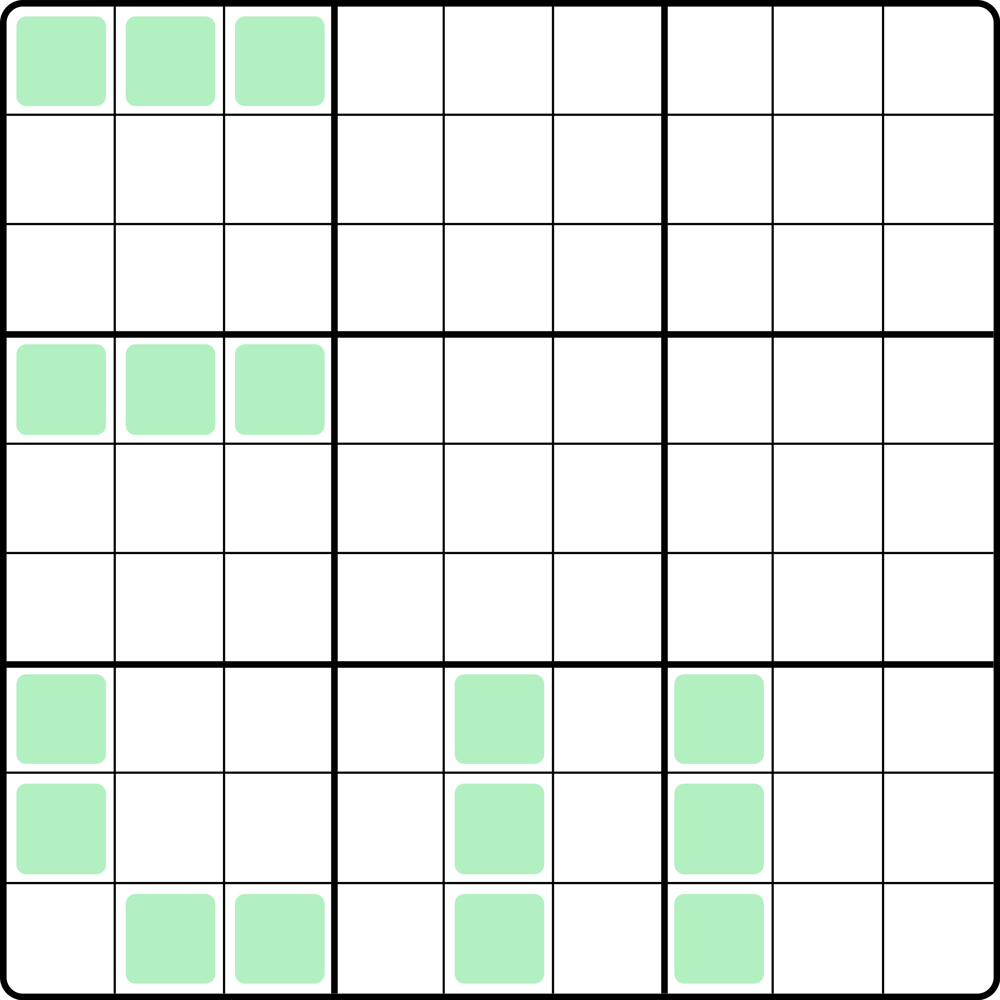<figcaption>
四数拐角模式
</figcaption></figure>

如图所示。`b7` 搭配 `r14` 构成拐角模式（当然也可以说是 `c57`，结构是对称的，所以随意）。整个结构如果只用四种不同的数字，那结构是无条件致命的。

### 推广此模式 

将上面的结构进行推广，可将 `b4` 里的单元格稍微移动一下。我们把 `r4c2` 改到下面 `r5c2` 去，然后对此修正，在 `b5` 里竖放一个单元格，会变为这样：

<figure>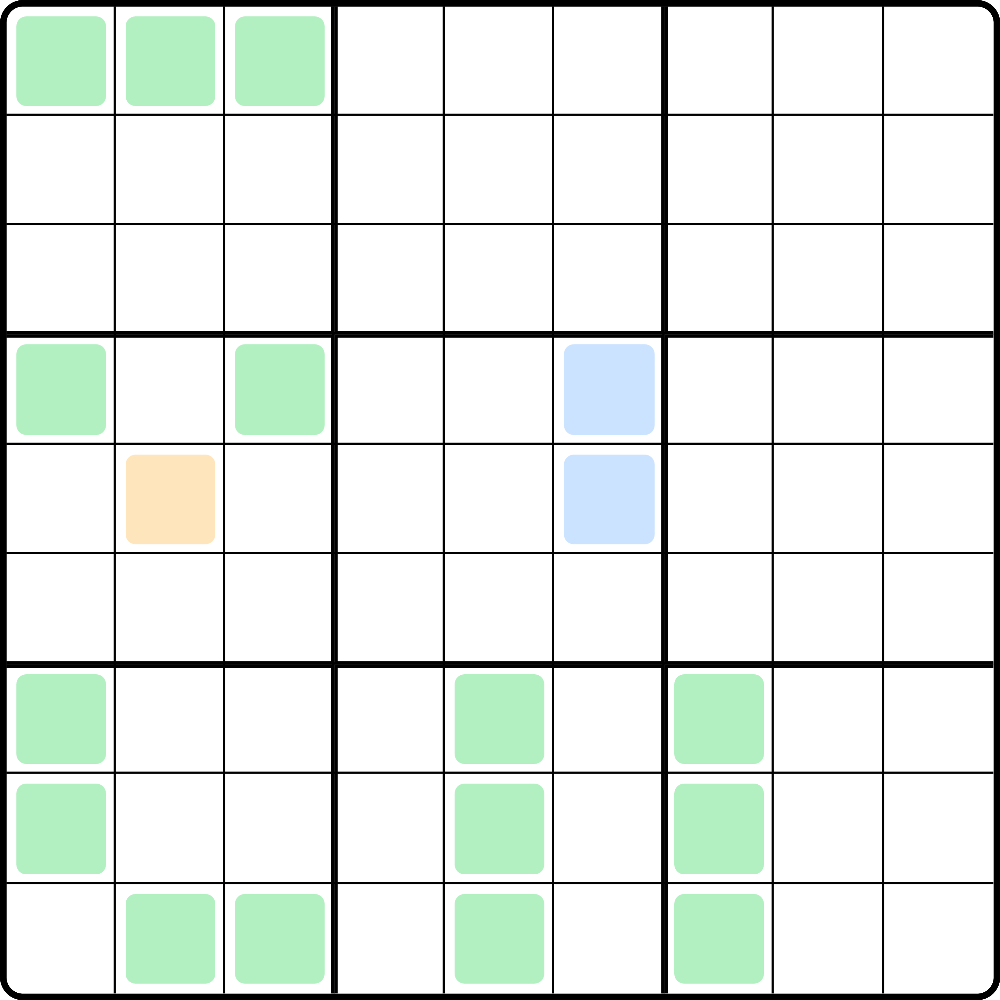<figcaption>
推广模式
</figcaption></figure>

当 `b4` 和 `b5` 的两组单元格里都只能填 $$a$$、$$b$$、$$c$$、$$d$$ 的其中三种数字 $$a$$、$$b$$、$$c$$ 的时候，结构是致命的。

### 其他结构 1 

当前面这个推广结构的 `r9c5` 被拿掉，改成 `r9c6` 的时候，可在 `b5` 里补充 `r56c5` 两个格子予以修正，此时就不需要限制 `b45` 两个宫只能三种数了，整个结构是无条件致命的。

<figure>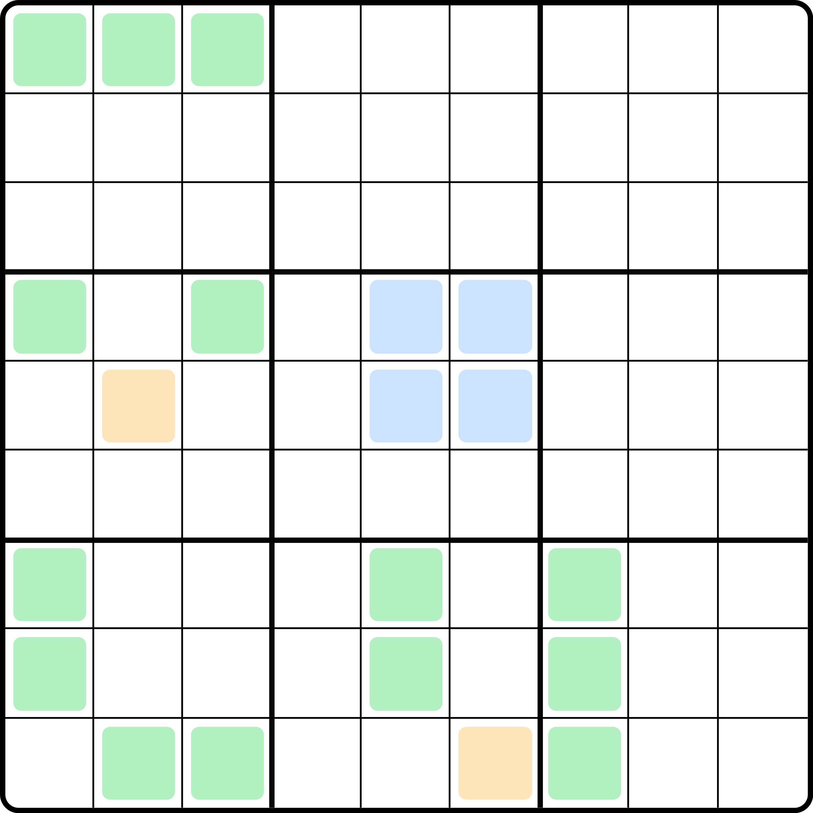<figcaption>
其他结构 1
</figcaption></figure>

如图所示。这样 `b45` 仍然是四种数字，也是致命的。

### 其他结构 2

另外，让结构不涉及三个行列，只用两个也可以无条件致命。

<figure>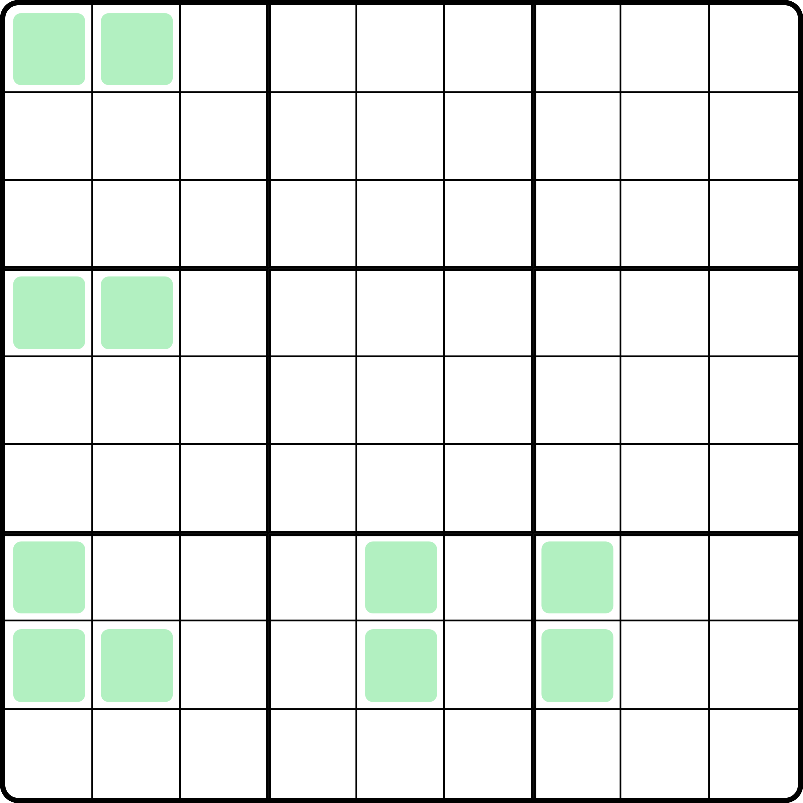<figcaption>
其他结构 2
</figcaption></figure>

如图所示。

至此，致命结构的内容就全部结束了；教程的全部主要内容就都结束了。
