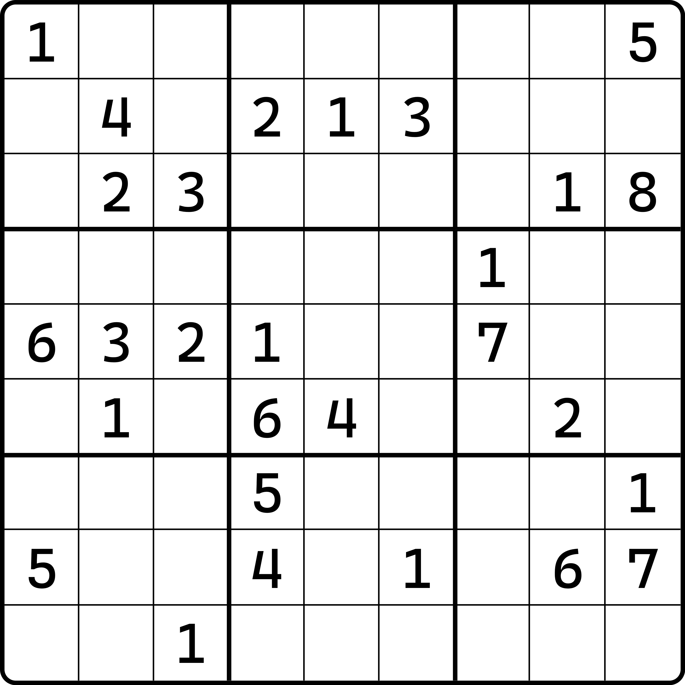
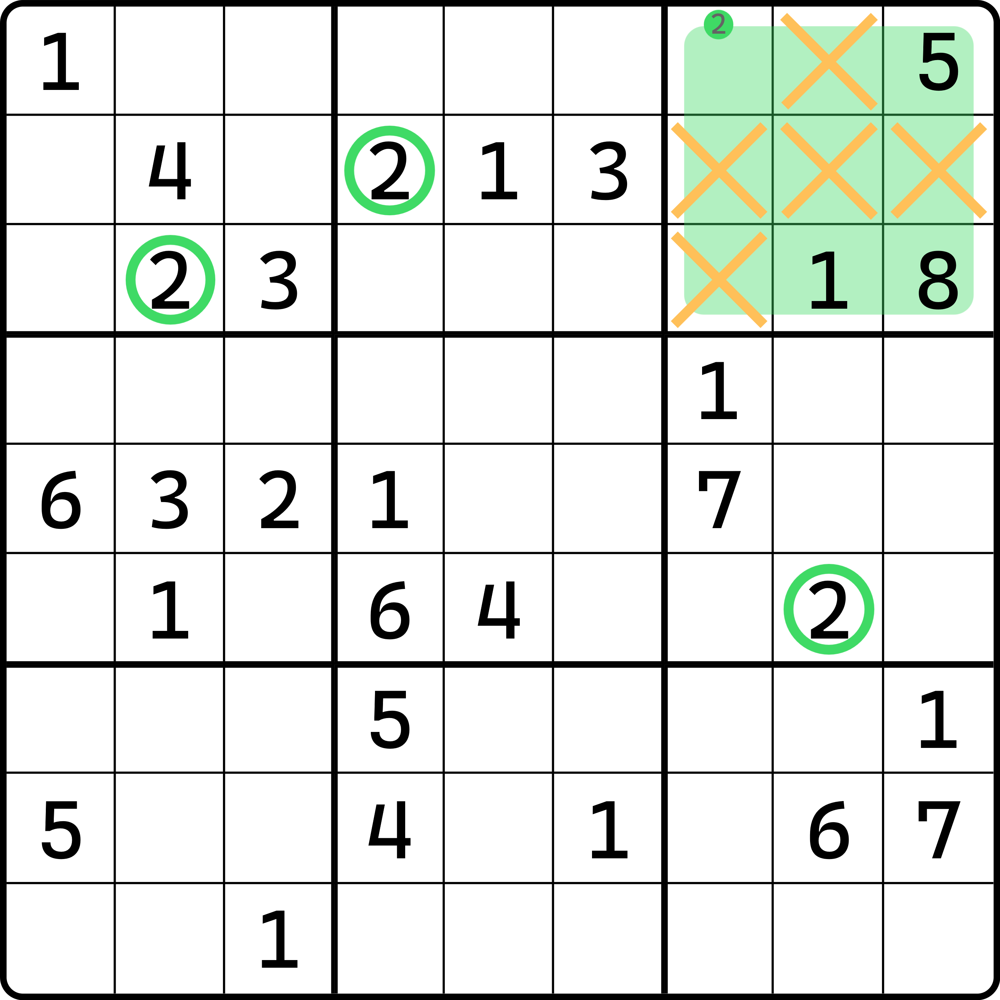
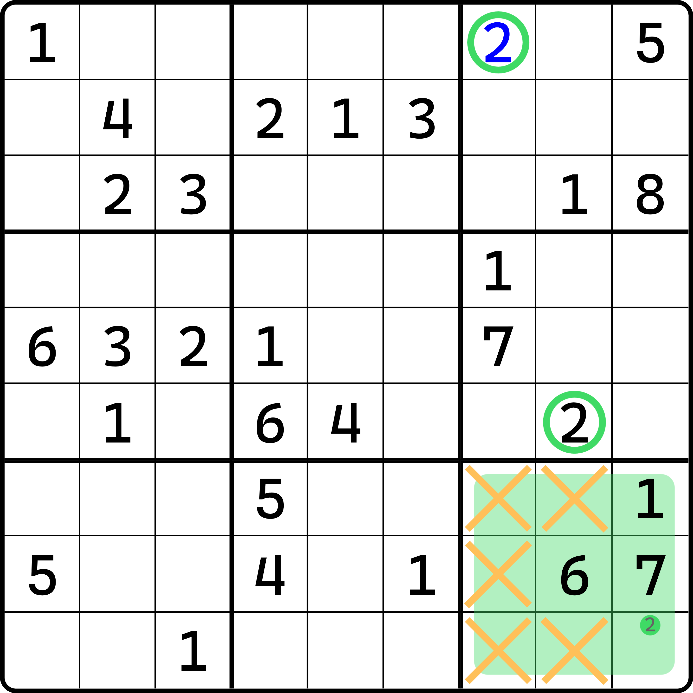
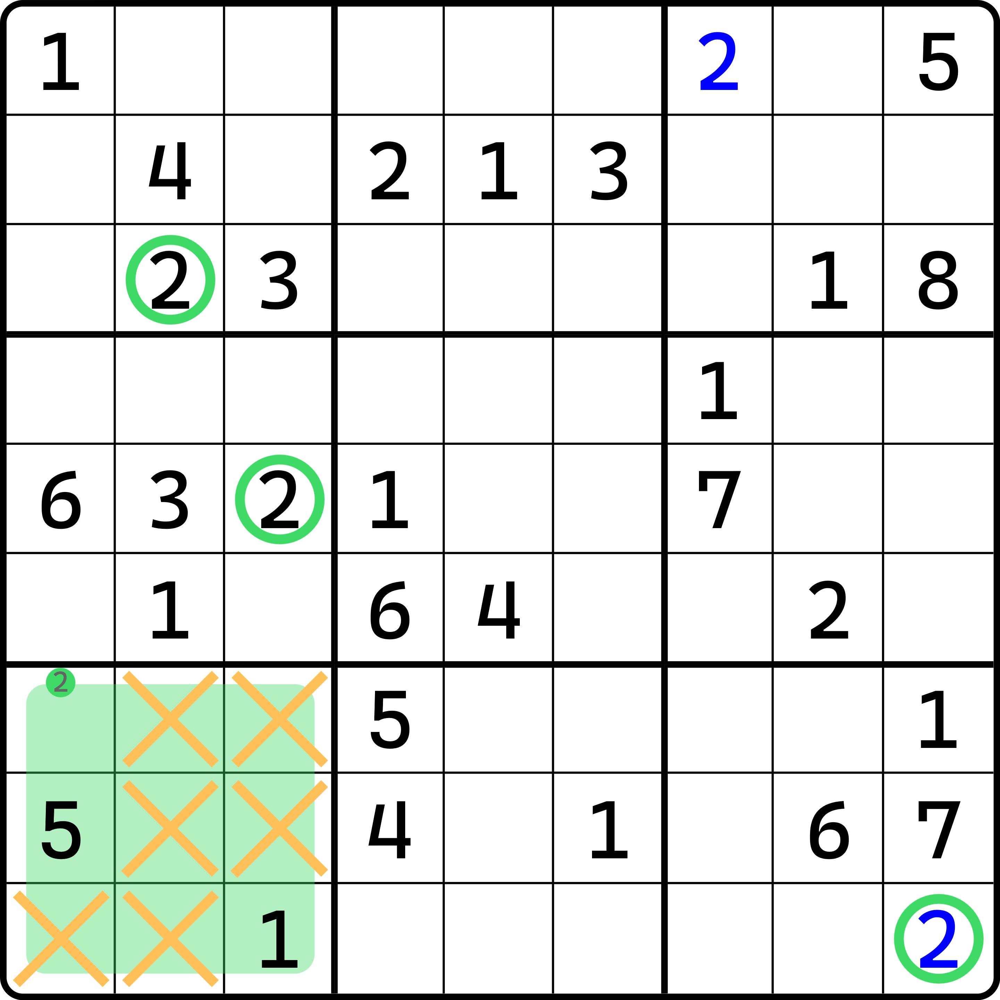
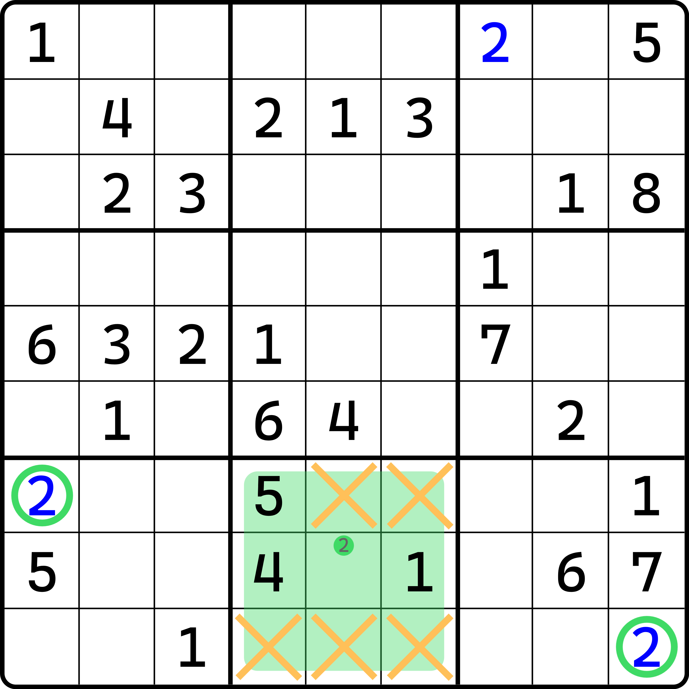
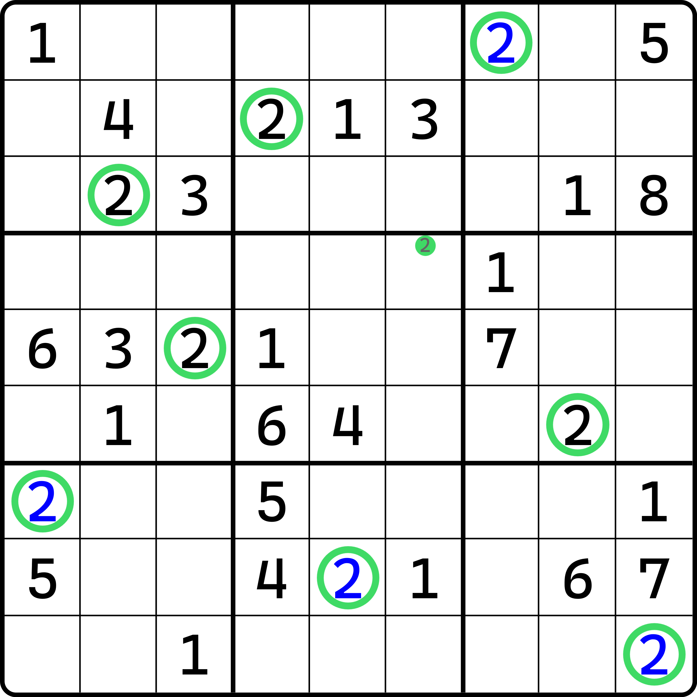
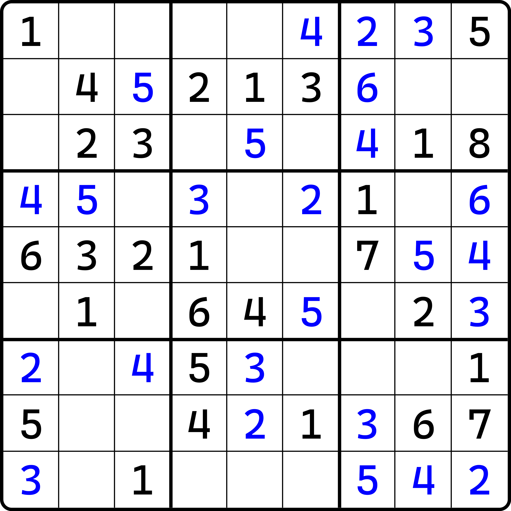
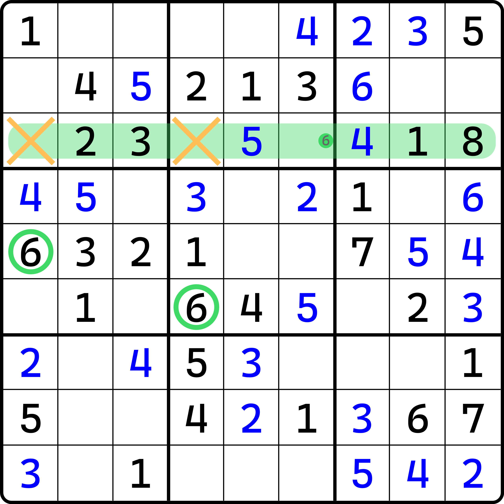

# 数字锁定策略

当你看到密密麻麻的数字而无从下手时，你肯定会寻找一个固定的做题策略来帮助你完成题目的同时，又可以有一个比较方便快捷、以便随时可用的办法。

在数独里，它并非不存在。这便是今天要为各位讲解的做题策略：**数字锁定策略**，也叫**锁定数字策略**（Digit-Locking Strategy）。

## 学会只看单一数字 

初学的时候，我往往会教各位只将眼睛盯着其中一个数字去看。这到底是个什么含义呢？

<figure><figcaption>
一个题目
</figcaption></figure>

如图所示。当你拿到一个题的时候，你知道排除和唯一余数两个解题技巧可以使用。其中，排除只跟一个数有关；而唯一余数，则只跟一个单元格有关。

显然，找排除可比找唯一余数要轻松多了。排除只需要看其中一个数字就行了，而别的数字全都是用来给这个数的余下可填位置作排除项的。而唯一余数恰恰不行，因为它直接就要求我们找完全部 1-9 并全部数一次，确保只有唯一的一个数字填入才是正确的结论。

按照做题时间的长短，显然排除比唯一余数的效果更出众。那么我们不妨让大家入门就从排除起手。而且，在讲解技巧推理过程的时候我就说到过，三种排除里，宫排除最简单，因为它下结论是看的一个宫的空格情况；而这个宫里剩余的可选位置是我们最容易一眼看全的，而行和列都不行——行和列的形状是长条形的，天生就比宫要难看一些。

那么，确定了我们要使用的技巧之后，我们下一步就得开始看格子。鉴于宫排除是排除的一种；而排除又是只跟单一的数字有关系的技巧，那么我们不妨只看全盘里所有相同数字的分布情况。比如数字 1，我们明显发现这个题里每一个宫里都有 1。按照数独规则，我们要填满全部空格，且数字 1-9 每一个数字都要在行列宫里都出现 1 次，那么它的总情况显然是每一个数都要填 9 次。而很显然这个题数字 1 已经有 9 个，所以这说明我们需要完成的数字只有 2-9 这 8 个。

接着，我们如果是无头苍蝇的话，可以按次序来。比如我们就真的先去看数字 2。显然这个题里 2 出现还比较多。按数独规则算，每一个宫都必须填一次 2，所以我们就去找哪些宫没有 2。显然，这个题的第 3、5、7、8、9 宫没有数字 2 的出现，这也就意味着数字 2 还得填 5 个进去。

> 初学数独的时候会有一个对数独规则比较迷惑的点。为什么数的是宫而不是行或列？直接从推理角度去思考，数独只有 81 个格子，而每一个格子要安排互相行列宫都不重复的 1-9，所以每一个数必须均衡出现才能保证其数量是合适的。而均衡出现的结果就是每一个数都出现 9 次。但在计算的时候，不论你是横着看（按行看）、竖着看（按列看）还是按宫看，每一个数都会被重复计算一共 3 次，所以并非是 27 次数字 1-9，而实际上只会出现 9 个 1-9，因为每一个数行里面算一次，列里面算一次，宫里面又会被算一次，所以被算了三回。
>
> 既然数独里 1-9 每一个数实际就只能填 9 个，那其实按行看还是列看还是宫看其实就是无所谓的了。毕竟，除了技巧使用上不同以外，单纯从数位置的角度而言谈起的话，肯定是等价的。那么，我们肯定会选更好看的去看，所以我才告诉大家去看宫，而不是行和列。所以，“1-9 宫每一个宫都出现一次数字 2”的这个说法其实是想告诉你“数字 2 必须出现 9 次，而且每一个宫都出现一次”的这两点信息。

那么我们直接去挨个看就行。顺着数过去，显然第一个要看的是第 3 个宫。它能填出来 8 的实际位置吗？是的：

<figure><figcaption>
第一个宫排除，出第 3 宫的 2
</figcaption></figure>

如图所示。这样第 3 个宫就被我们找到了。接下来去看 5 宫。很不巧，5 宫出不了数。所以我们只能继续第 7 个宫。

还是不巧。空格剩得太多了，外侧数字 2 能影响的范围虽然很大，但仍然会余下两个位置可放。此时我们不确定 2 究竟填哪个，所以只能放弃，继续看后面的第 8 宫和第 9 宫。

> 这里要说一个初学数独又一个困惑的点：我们此时已经就剩下两个可填位置了，为什么我不猜一个？万一对了呢？
>
> 这并非是有意批评提问的朋友，但这确实需要好好跟各位谈一下关于做题目的的问题。我们要完成题目这显然是一个比较重要的目的，但我们忽略了比完成题目更重要的东西：思维。不论你玩数独是出于哪种初衷（打发时间也好、为了让自己对数字的敏感性提高也好、甚至是工作需要也好），数独贯穿始终的其实是它带来的对你逻辑推理能力的冲击和挑战。可能有些后面的技巧难度会很高，可能你找不到他们，可能你因此做不出一道题，但这都不重要。
>
> 你的目的是锻炼你的思维能力。时间的长短并不重要。初学的朋友很容易会陷入一种思维惯性：我做着做着就会让自己去猜一个，毕竟我填不下去了。填不下去真的不是问题，很多初学的朋友遇到的第一道数独题经常会做半个小时，这是正常的现象。
>
> 我见过太多“浮躁”的玩家了。数独的脑力体操小游戏给你带来的是让你静下心来好好欣赏题目让你对数字的认知和敏感程度的提升，所以它必须要静下心来做。半个小时确实很长，它甚至都快赶得上一节课了。但是，这只是因为你对数独的认识还不够熟悉导致的。如果你真正理解初学数独游玩的题目难度和你的能力潜力是匹配的的话，那么剩下的就只是多做几个题而已。
>
> 数独的提速非常快，比你想象得还要快。如果你狠下心完成了一道和你能力匹配的题（比如你刚学会宫排除，你就去练手找一道宫排除作为题目主要技巧的题去做），那么它显然会给你带来的是你的满足感，因为你把它做出来了，而且不需要任何的帮助和外界提示。这份成就感只有你自己亲身体验过你才会知道。而你做完一个题，你肯定会知道你这一局游玩体验里大概在哪里会卡壳，大概哪里会有提速的空间。所以你的第二题如果是同等难度的话，你甚至可以从 30 分钟的做题时间直接缩短到 10-20 分钟。这个提速是非常显著的。但是真要看你做的这两道题，你自己的宫排除的熟练度其实并没有特别大的提升，毕竟一个题能带给你的提升是非常有限的。但是，时间上而言，你确实只需要一个题就能从 30 分钟变为 20 分钟以内。
>
> 我知道，一天玩一道题 30 分钟，第二题再玩 20 分钟这就小一个小时了。但是，你并不需要一天做很多题，两个题就够。初学对自己要求也不必过于严格。
>
> 所以，回到最开始的问题。我并不建议各位直接做不出来就猜。原因其实很简单：因为你是初学者，你的基础功必须要扎实。猜确实可能会让你更快完成题目，但这对你的推理能力没有任何帮助。毕竟，谁都会猜，它没有一个明确的、规范的、成体系的思维体系，只是简单地填入一个数然后去看是否有矛盾。

那么我们继续看第 8 宫。很遗憾，第 8 宫也没有。接下来就只有第 9 宫了。很好，第 9 宫确实有。

<figure><figcaption>
第 9 宫出 2
</figcaption></figure>

太不容易了。这样我们就看完了一遍全部的 2。

接下来，一般会有两种做法：直接看数字 3，和继续死磕数字 2 直到确实没有可填的情况了。如果是我的话，我会继续看 2。因为此时 2 已经填了两个，这两个 2 也可以用于找数字 2 上面。这就是宫排除，一个利用同一种数字解题的技巧。

接着看 2 的话，我们发现 2 确实还能继续填。刚才我们不是说第 7 个宫没办法填是因为余下了两处单元格 `r7c1` 和 `r9c1` 吗？那么我们这个时候 2 已经填到了 `r9c9` 上，这说明第 9 行整个行的别处都不能第二个填 2 了。这不就用上了！`r9c1` 刚好也在第 9 行上，所以它此时就不能填 2 了，于是第 7 宫的 2 就可以继续得到了。

<figure><figcaption>
第 7 宫出 2
</figcaption></figure>

接着，我们第 8 个宫就可以填 2 了。

<figure><figcaption>
第 8 宫出 2
</figcaption></figure>

接着，第 5 个宫是最后一个剩下的、没填 2 的宫了。既然 8 个宫都有 2 了，最后一个 2 肯定是必然可以填的。所以我们把它填上。

<figure><figcaption>
第 5 宫出 2
</figcaption></figure>

这样，所有数字 2 就全部填完了。

接着我们就可以看数字 3 和后面的其他数字了。

## 行列排除的策略 

前面这个题按宫排除甚至可以直接到这里：

<figure><figcaption>
可以直接到这里
</figcaption></figure>

如图所示。下一步其实是要填 6 的。为什么？因为按照我前面说的这个数字逐个击破的思路，到这一个盘面状态下，刚好才填了数字 6，而 6 还没填完，所以继续填 6。不信你可以自己试试。

这个时候你会发现，这个题宫排除要想进行下去就必须切换到数字 7 了。数字 6 已经没位置填了。

> 或许你知道区块排除，不过我不打算先提及任何超纲内容，这个我们之后介绍了区块再说，这里就先卖个关子。

若是你非要填数字 6，数字 6 要出数是 OK 的，不过要用一个行排除：

<figure><figcaption>
用一个行排除可以出 6
</figcaption></figure>

这勉强算一个题目的瓶颈。因为它确实会卡住不少的人，大多数初学者都找不到这个 6，虽然它就剩 3 个空，大不了挨个都看一下呗。但是，我刚刚说过，按宫排除做题的思路，很少会有人能进行灵活变通，即使你之前学过行列排除甚至唯一余数技巧，但自己也会下意识按惯性去做题，所以下一个还是宫排除，大不了先把别的宫排除都填了回来再看都行。毕竟，万一这里的行列排除会因为空格少了很多就变成宫排除了呢？

这是一个好的思路。而且我也会建议你这么做。如果你要对自己的熟练度有一个提升，你可能需要掌握的是对难度较高的技巧有一个认知上的权衡。如果你有充分的把握认为这个盘面里它就是会有行列排除或唯一余数，而且比较好看到，那你可以大大方方先用这些技巧来做题；但是如果你没有十足的把握，那你大可先去看别处的宫排除，毕竟它确实简单一些。

## 策略总结 

这个题一旦用了这个行排除后就不难了，后面没有任何行列排除和唯一余数了，最高难度宫排除，你可以练练手继续完成，也可以自己做一遍这个题，从原题最开始的地方开始做。

那么总结一下我想告诉大家的做题流程：

* 宫排除至上：先找宫排除，然后才是行列排除，然后是唯一余数；
* 适当灵活调整：如果你有一定的把握认为盘面下一步看行列排除或唯一余数更好看（比如盘面空格摆放确实更容易出行列排除或唯一余数）的话，那么你可以试试去找他们；如果没有把握就继续看宫排除；
* 数字锁定策略：按照数字 1-9 次序逐个去解题，先看数字 1，把数字 1 填到自己实在是看不到下一个位置在哪里了为止，然后继续数字 2、数字 3、数字 4，以此类推；
* 必要的轮回：当你完成了一轮的数字 1-9 发现题能做完那就皆大欢喜；如果没有的话就继续从 1 开始看。当然，如果你有把握发现别的数字也有填的，那你可以适当先去填别的数字；当你认为自己还是无头苍蝇的时候，就老老实实按数字次序逐个击破就好。

## 一刀流的概念 

前文我们教大家按数字次序去做题。在数独里，我们还真有一个术语描述一类跟这种做题模式相关的题目。

如果有一个题它能在你一轮数字 1-9 逐个看完的时候刚好把题给做完，那么这个题我们就称为它是**一刀流题**（Ittoryu Puzzle）。所谓**一刀流**（Ittoryu），指的是你在做题的时候按一轮数字 1-9 完成的这个过程；对应地，如果你要两轮才能完成，就可以叫“二刀流”，甚至是更多的“三刀流”，等等。

显然，如果练手的话，我会推荐各位去做一刀流题，主要就是为了让各位练习熟练度。显然，这种题也是很少的，大多数数字摆放都不允许你做的题能一刀流；但是一刀流确实可以用来帮助你提升熟练度。
