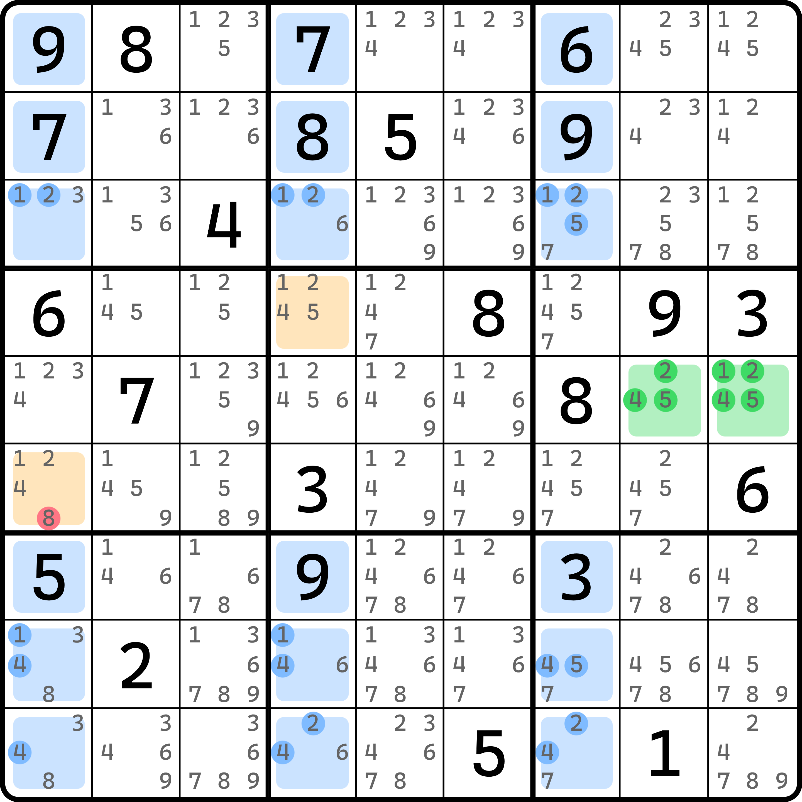

# 飞鱼的基本推理

欢迎各位来到新的篇章。这个篇章的内容只阐述一个数独技巧，但它的理解成本比较高，还具备非常多的变体，因此在实战中并不实用。这个技巧主要还是用于研究其推理逻辑。

另外，这种技巧规模一般较大，所以在普通的题目里即使存在，也较难进行分析和推理，所以即使这个技巧存在于题目里可以用于删数，大多也不会在前面只依靠链就可以解题的题目里使用。

## 一个看起来就很复杂的题 

<figure><figcaption>
飞鱼
</figcaption></figure>

如图所示。

请将视野关注到 `c258` 上来。我们把 `c258` 三列的所有 27 个单元格分成两组看。其中一组是图中涂色了的 18 个单元格，而余下 9 个没有涂色、但也在这三列里的 9 个单元格则作为另外一组。

然后我们还可以看到 `r5c46` 两个单元格只有候选数 1、3、6 三种数字。这看起来有点像待定数组，不过后续会告诉你这跟待定数组暂时没有关系，只是这个题恰好有三种数字罢了。不过，这三个数字确实会对刚才 27 个单元格的填数状态有一定影响。

请仔细观察图中 `c258` 里涂色的这 18 个单元格，并着重观察数字 1、3、6 的分布。不难发现，显然在 18 个单元格里，数字 1 只能在这 18 个单元格里填入最多两个，而 3 和 6 也都只能最多填入进去两个。因为 `c258` 一共有三列，所以按理说，数字 1、3、6 都必须出现三次才对，但涂色的 18 个单元格最多只能允许往里塞 2 个 1、2 个 3 和 2 个 6，所以余下的 9 个未涂色的单元格里就必须最少填一个 1，一个 3 和一个 6，这样三列才能凑齐填入三次 1、3、6 的情况。

> 所谓“最多出现 2 次”的意思是，你往里放这个数字，你会发现因为就三个不同的列，你要保证数字能不违反数独的基础规则的前提下，尽可能多地往里面塞这个数，那么这个最多的情况只能是 2 个。比如 1 出现的单元格有 `r1c58` 和 `r9c25` 四个单元格。最少肯定填 1 个就行；但最多就只能把 2 安排在不同行的两处位置，但你如果要往里塞 3 个 1，这肯定是放不下的。所以我们就认为这个 1 最多只能填两次。同理，3 和 6 也都这么去看。

好的。下面我们假设 `r5c46` 的填数。因为它只能填两个数进去，所以不妨我们暂时用字母表示。比如 `r5c46` 分别填了 $$a$$ 和 $$b$$（此时 $$a$$ 和 $$b$$ 是 1、3、6 的其中两个数）。那么，显然按照代数的排除操作，`r5c28` 和 `r46c5` 则都不能填 $$a$$ 和 $$b$$ 了。于是，在未涂色的 9 个单元格里，只剩下预留的两处单元格 `r4c2` 和 `r6c8` 是可以填 $$a$$ 和 $$b$$ 的地方了。

> 可能你想问我此时除了 $$a$$ 和 $$b$$ 外的余下那个数字还能怎么填，这其实反倒无关紧要。因为 `r5c46` 并未限制 $$c$$（最后那个数字）的填数，所以很显然 $$c$$ 是可以随意找到合适的位置放进去的。换言之，刚才说的 `r46c5` 和 `r5c28` 这些被排除掉的位置并不会因为 `r5c46` 的填数受到任何影响，所以他们都可以放 $$c$$。

总之，我们只能让 `r4c2` 和 `r6c8` 填 $$a$$ 和 $$b$$。那么很明显，因为 $$a$$ 和 $$b$$ 是 1、3、6 的其二，所以这两个单元格自然也必须是 1、3、6 的其二。因此，`r4c2 <> 24` 便是本题的结论。

这个技巧我们称为**飞鱼导弹**，简称**飞鱼**（Exocet）。这个技巧名非常的酷炫，但难度也是非常的“酷炫”。整个这么大的结构结果就能删一两个候选数，太难受了。不过这个技巧后续会得到一定程度的推广，到时候可能会有更多的删数，不过我们还是循序渐进慢慢学。

下面我们再来看一个例子。

<figure><figcaption>
飞鱼，另一个例子
</figcaption></figure>

如图所示。这个例子和刚才的一样，不过得横着看。这次选取的是三行：`r347`。然后结合 `r12c3` 的填数得到 `r47c1` 只能是 1、2、3 的其二，进而得到结论。

这个例子就自己照着推理一遍就行，逻辑几乎是一样的，就不赘述了。

## 基本术语 

飞鱼技巧是一个系列，它的结构里很多“部件”都可以参与拓展和推广，进而得到不一样的删数。为了之后对结构描述得更为具体一些，这里我们列举一下这个技巧的相关术语。

* **基准单元格**（Base Cells 或 Base）：例子里配色为绿色的两个单元格。这两个单元格用于推出目标结论之前作填数假设用。基准单元格最多只能有两个，但可以只有一个单元格，这一点之后说明；
* **目标单元格**（Target Cells 或 Target）：例子配色为橘色的两个单元格。这两个单元格用于得到结论。一般只有两个，但可以更多，最多可以到 4 个，最少 1 个，这一点之后说明；
* **交叉单元格**（Crossline Cells 或 Crossline）：例子里配色为蓝色的 18 个单元格。指的是结构需要讨论基准单元格里所给出的全部数字的排列的那 18 个单元格。注意它不是指 27 个全部的格子，只指代图中 18 个涂色的部分。不过变体可能会用四个行列而非三个，所以 18 可能会变为 24，这一点之后说明。

还有一些其他的术语，我们将在之后遇到使用的时候再作出说明，这里全都一股脑扔出来了也记不住。

## 基准格里包含 4 个数字的飞鱼 

下面我们来看两种基准格里不止 3 个数字的情况。

<figure><figcaption>
基准格含有 4 个数的飞鱼
</figcaption></figure>

如图所示，这次基准单元格有 4 种不同的数：2、5、6、7。虽然两个单元格里不再像之前一样，两个单元格候选数状态都是一样的，这次左边缺 2、右边缺 5，但这并不妨碍我们继续后续的推理，所以无关紧要。

我们关注的交叉单元格是图中 `r456789c247` 这 18 个单元格。观察 2、5、6、7 的分布，显然这 18 个单元格里，2、5、6、7 全都只能最多出现两次。那么，和之前一样，`r123c247` 这 9 个单元格里，就必须让 2、5、6、7 全都最少放一次才行。

那么，假设基准单元格 `r1c56` 填的是 $$a$$ 和 $$b$$，那么不难根据排除效果可得，$$a$$ 和 $$b$$ 就只能填在 `r2c2` 和 `r3c7` 之中。所以，`r2c2` 和 `r3c7` 就不能填除了 2、5、6、7 以外的别的数字，故这个题的结论就是 `r2c2 <> 3`。

我们再来看一个例子。

<figure><figcaption>
4 个数的另一个例子
</figcaption></figure>

如图所示。这次基准单元格是 `r89c3`，目标单元格是 `r3c1` 和 `r5c2`，交叉单元格是 `r357c456789` 这 18 个单元格。

这个就自己看了。

## 交叉单元格里含明数 

正如标题所说，一个飞鱼结构可以用于删数，不一定要求交叉单元格里只是单纯的候选数排列。

<figure><figcaption>
交叉单元格里含有明数
</figcaption></figure>

如图所示。从上帝视角来看删数肯定是删 1、2、4、5 以外的数，所以结论 `r6c1 <> 8` 就不用多解释了。主要是看整个推理流程里为什么 `r7c1` 是明数 5 也可以使用飞鱼技巧。

首先，要检查的数字是基准单元格 `r5c89` 里的 1、2、4、5。对于 1、2、4 都好说，但是 5 确实不是最多两个——它只能最多一个，并且出现在 `c7` 上。但是，我们整体去思考这个事情你就会觉得问题不大了：交叉单元格是不计算 `r456c147` 的。倘若我们整体看 `c147` 这三列的话，显然数字 5 按数独规则就必须填 3 次进去。注意，这里说的是完整的三个列，所以必须是恰好有三次 5 的出现。

那么，刨去 `r456c147` 的话，5 除了处于 `c7` 上的交叉单元格里可以放以外，能纳入 5 的计算的就只有明数 `r7c1` 这个 5 了。它理应要算一次填入，因为“三个完整的列要填三次”是有它的一席之地的，所以，这么算的话，在交叉单元格里，`c1` 恰好有一个 5 了，而 `c7` 出现的 5 确实只能要么不填要么填一个 5。整个交叉单元格里 `c4` 就没有填 5 的地方，所以，这么看起来，5 仍然是最多填两次。

那么，既然如此，`r7c1 <> 5` 的结论仍然是成立的——所有数字 1、2、4、5 都只能在交叉单元格里最多填两次，这个结论可以形成，后续推导也就可以继续进行了，故删数是成立的。
