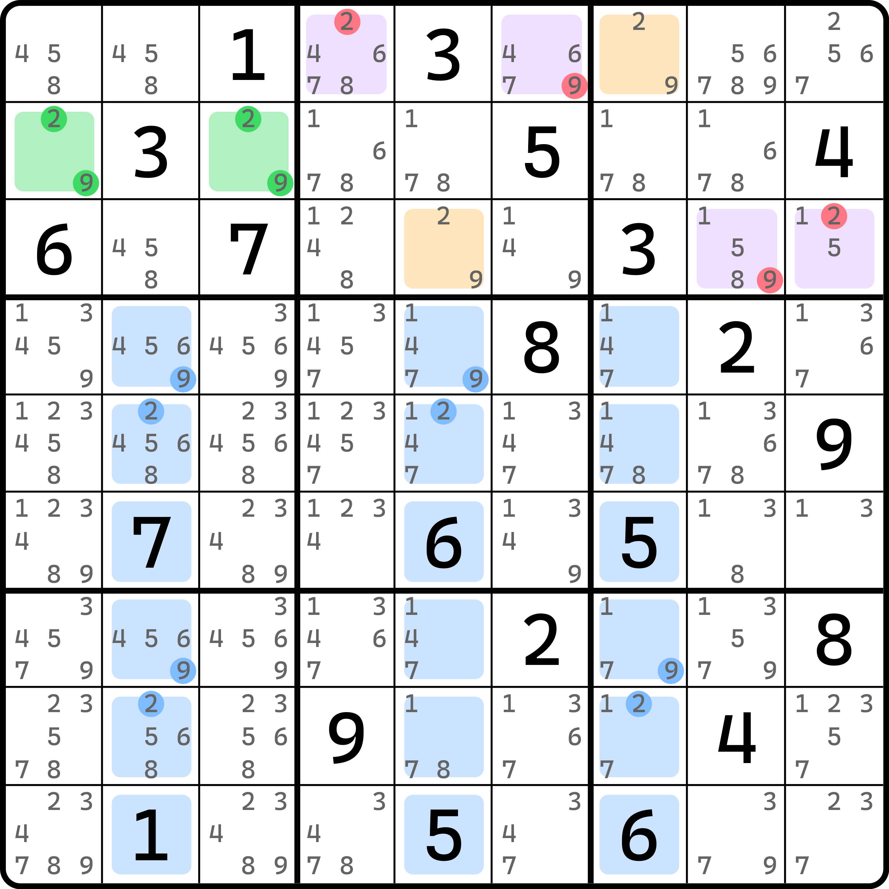
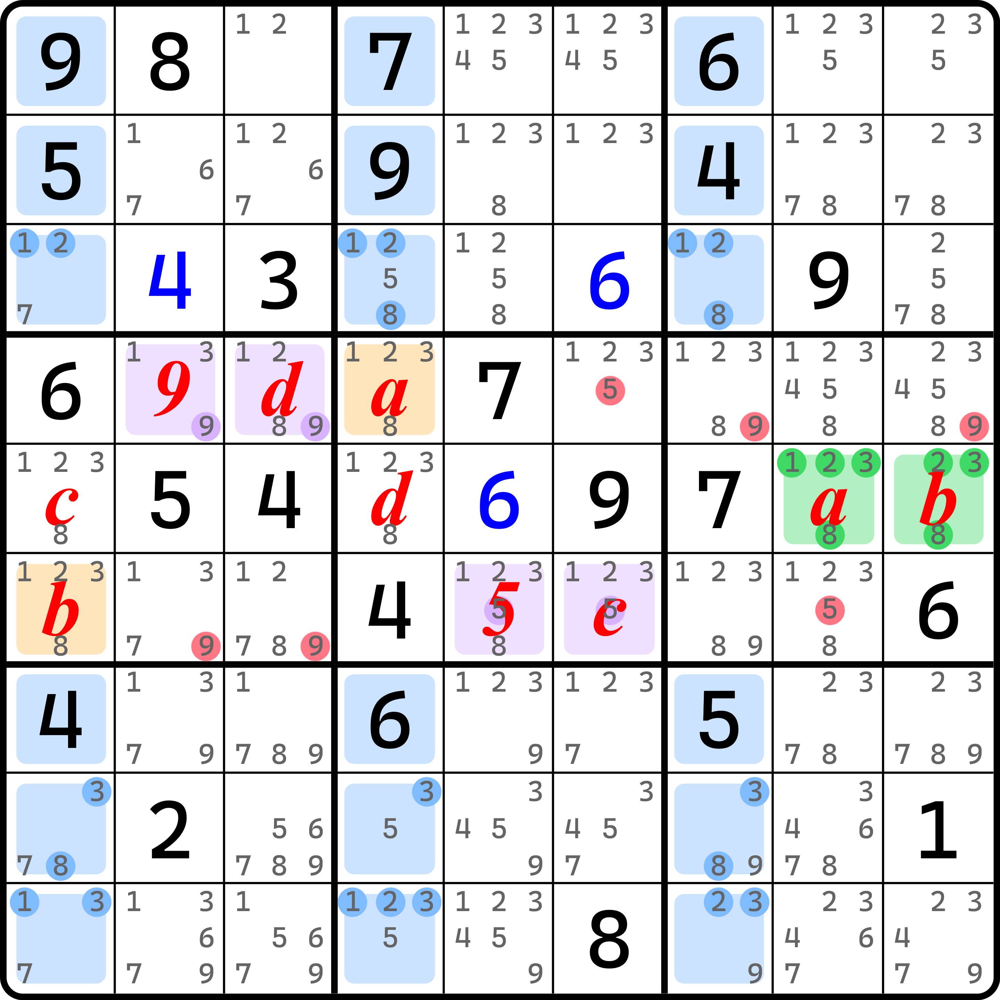
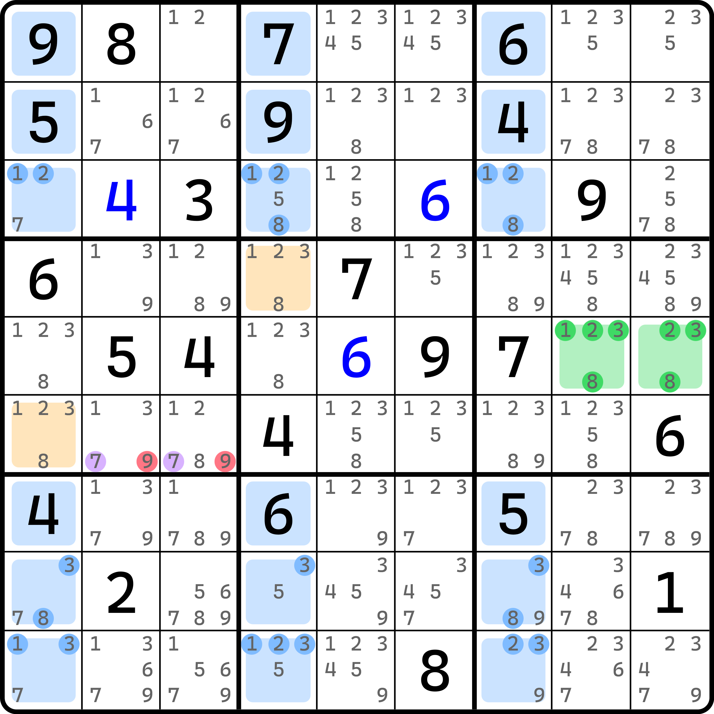
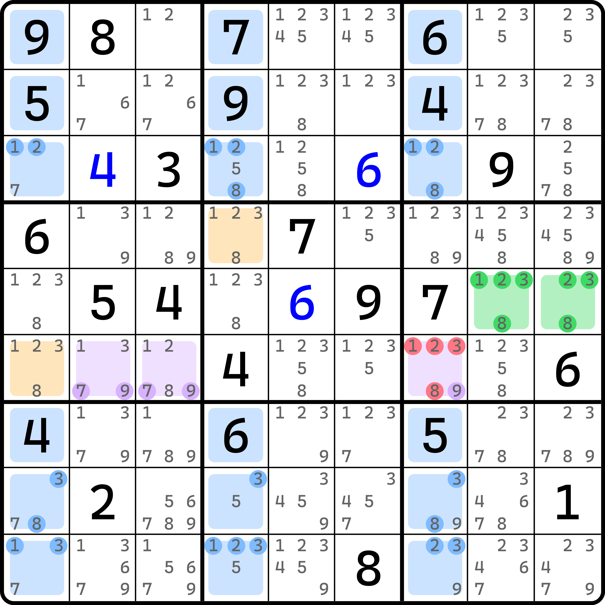
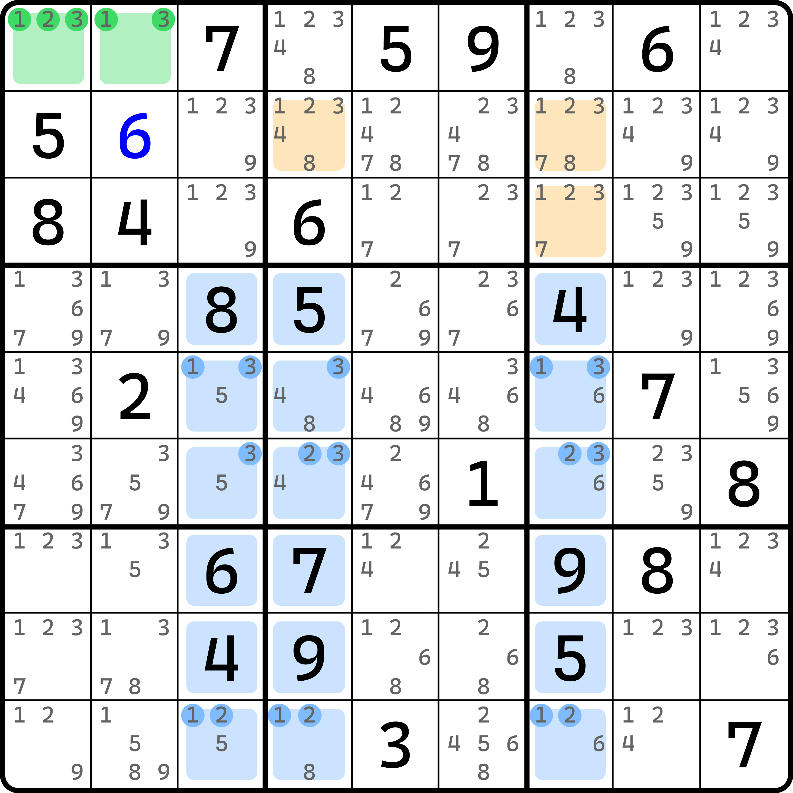

# 镜面格的删数特性

## 什么是镜面单元格？ 

**镜面单元格**（Mirror Cells 或简称 Mirror）指的是结构里，和目标单元格同在一个宫，并且和交叉单元格方向垂直正交导向的两个单元格。比如之前的例子里，我们利用目标单元格删掉了边上的候选数，紫色单元格给的是原来删数的单元格。

<figure><figcaption>
镜面单元格（紫色）
</figcaption></figure>

如图所示。而镜面单元格呢？镜面单元格是图中的 `r1c89` 和 `r3c46` 这四个，挨着目标单元格还同宫的这几个。这有点反直觉，因为感觉跟图上给的删数没有多少关系。这一点我们稍后说明。

每一个目标单元格都对应两个镜面单元格。因为两个单元格反映了填数和目标单元格的潜在关系，所以有反映、反照的感觉在里面，所以叫 mirror cells。mirror 在英语里除了镜子的意思还可翻译为“反映”的意思。

> 不过，对于“镜面单元格”这种说法确实比较少用到，所以也经常将镜面单元格直接称为是“目标单元格的邻居”。在中国大陆，在不太正式的讨论环境下，也经常会使用这些术语的英文的首字母来代指单元格的类型，如基准单元格会称为“B 格”，目标单元格会称为“T 格”。所以，镜面单元格也会被经常简化称为“M 格”或“T 邻”，即 T 格的邻居。
>
> 所以，从这个角度来说，本文介绍的内容和后面和镜面单元格有关的介绍，也都经常被称为 T 邻的相关规则。

## 镜面单元格的特征 

图中能造成紫色单元格形成删数的本质是因为我们知道，目标单元格其实填入的是不一样的数。不过，我们继续进一步延长推理过程，我们还可以得到一个更有趣的结论。

我们知道，基准单元格填了 $$a$$，而其中一个目标单元格也会填 $$a$$，那么对于另一个目标单元格的镜面单元格呢？根据排除法我们可以得到，另一侧目标单元格的镜面单元格就必须填 $$a$$。举个例子：如果 `r2c1` 是 $$a$$，而如果 `r1c7` 是 $$a$$，那么 `r3c46` 根据排除法也就必须有一个是 $$a$$，而他是 `r3c5` 这个目标单元格的镜面单元格。同理，`r3c5` 如果是 $$b$$，那么 `r1c89` 就必须有 $$b$$。

从这个角度来看，`r1c46` 不填 2 和 9 的本质原因就被我们找到了：因为镜面单元格和目标单元格摆在一排三个单元格里面的其中两个位置上，所以构成了一个显性待定数对结构，所以删掉了紫色位置上的 2 和 9。

这也就是说，**镜面单元格里必须存在一个和另一侧目标单元格填数一样的数**。这个特征很好玩，稍后我们会利用这一点得到一些非常有趣的结论。

## 镜面单元格用法 

我们可以利用前面的说法得到一些额外结论。

### 用法 1：基准格所在行列锁定填数 

<figure><figcaption>
基准单元格锁定填数
</figcaption></figure>

如图所示。我们按照代数的思路继续假设上的推广。我们假设 `r5c89` 是 $$a$$ 和 $$b$$，而整行就四个空格，不如全都假设了：`r5c1` 是 $$c$$，而 `r5c4` 是 $$d$$。此时 $$a$$、$$b$$、$$c$$ 和 $$d$$ 是 1、2、3、8 里的四种完全互不相同的数字。而我们根据基础的飞鱼技巧可知，`r4c4` 和 `r6c1` 显然填的也是 $$a$$ 和 $$b$$。这里我们不妨也把字母写上。

显然，镜面单元格 `r4c23` 里必须是 9 或 $$d$$，而 `r6c56` 必须是 5 或 $$c$$。为什么呢？比如我们拿 `r4c23` 来说，因为此时里面只有 1、2、3、8 和一个无关的数字 9，而 `r4c4`、`r56c1` 这三个单元格都看得见 `r4c23` 这两个单元格，且这三个单元格又填的是完全不同的数字。所以呢？所以 `r4c23` 只能再容纳一个不同的字母，那么另外一个就必须是 9，否则 9 放不下不说，`r4c234` 和 `r56c1` 全都是 $$a$$、$$b$$、$$c$$、$$d$$ 还因 `r4c23` 看得见余下三个单元格，这显然会填不下。同理，`r6c56` 也是如此。

所以呢？所以我们可以知道，`r4c23` 有 9，而 `r6c56` 有 5，故形成 9 和 5 区块。所以，`r4c89 <> 9`、`r6c23 <> 9`、`r4c6 <> 5` 和 `r6c8 <> 5` 是这个题的结论。

### 用法 2：镜面单元格直接删数

<figure><figcaption>
镜面单元格区块
</figcaption></figure>

如图所示。还是同一个题，不过我们换一个思路去找删数。

首先，镜面单元格 `r6c23` 正儿八经在 `b4` 或者说 `r6` 形成了区块，所以 `r6c23 <> 9`。完了。

为什么呢？还是一样的逻辑。由于我们知道此时镜面单元格一定会有一个区块 7 形成，所以镜面单元格余下的另外一个单元格就不能填 7。而我们能选择的数字就只能有 1、2、3、8 和跟飞鱼无关的数字 9 可以选择了。

如果我们选 9，那么镜面单元格也就一定是 7 和 9 的显性数对。这说明什么？这说明我们违背了镜面单元格必须填一个 $$a$$ 或 $$b$$ 的特征，造成了矛盾。所以，`r6c23 <> 9` 是这个题的结论。

同理，我们也可以利用这一点直接得到 `r4c6 <> 5` 的结论，因为 `r4c6` 是 `r4c4` 这个目标单元格的镜面单元格。原本镜面单元格有两个 `r4c56`，但因为其中一个单元格 `r4c5` 不是空格也填的跟 1、2、3、8 无关，所以 `r4c6` 就必须是 1、2、3、8 的其一，直接删数就行。

当然，我们还能把这个结构进一步延长，将区块改成隐性待定数组：

<figure><figcaption>
待定隐性数组
</figcaption></figure>

如图所示。我们还能继续延长推理过程。因为 `r6` 只有三个单元格可以填入 7 和 9，而其中两个还是镜面单元格。所以 `r6c7` 必然只能是 7 或 9 的其一。毕竟 `r6c23` 的另外一个单元格必须是 1、2、3、8 里的数。所以一个是 1、2、3、8 的其一，一个是 7 和 9 的其一，那么余下的 `r6c7` 就必须是 7 和 9 的另外一个，以保证 7 和 9 填够到 `r6` 上，所以 `r6c7 <> 1238`。

## 小练习 

我们来看一个练习题，请根据图中的结构找出全部的删数，并挨个解释其删数原因。

<figure><figcaption>
练习题
</figcaption></figure>

如图所示。

***

答案：

* `r2c4 <> 48`：目标单元格直接删
* `r2c7 <> 8`：目标单元格直接删；需要借助 `r23c7(7)` 的共轭对来删数
* `r3c89 <> 9`：因为 5 区块，所以镜面单元格必须删 9 以保证 1、2、3 必须填入
* `r3c3 <> 123`：前者结论的推广；借用 `r3c389` 构成 5 和 9 的隐性待定数对
* `r2c89 <> 123`：前者结论的推广；`r2c3` 只能是 1、2、3，所以配合 `r2c4` 和 `r23c7` 里的其中一个格子构成 1、2、3 的三数组
* `r2c56 <> 4` 和 `r1c9 <> 4`：前者结论的推广；`r2c89` 构成 4 和 9 的显性数对
* `r1c4 <> 1238` 和 `r56c4 <> 4`：前者结论的推广；`b2` 此时只有 `r1c4` 可填 4

