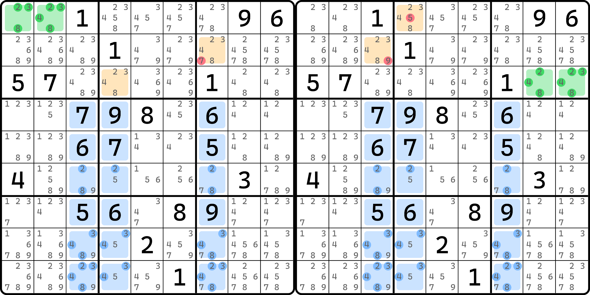
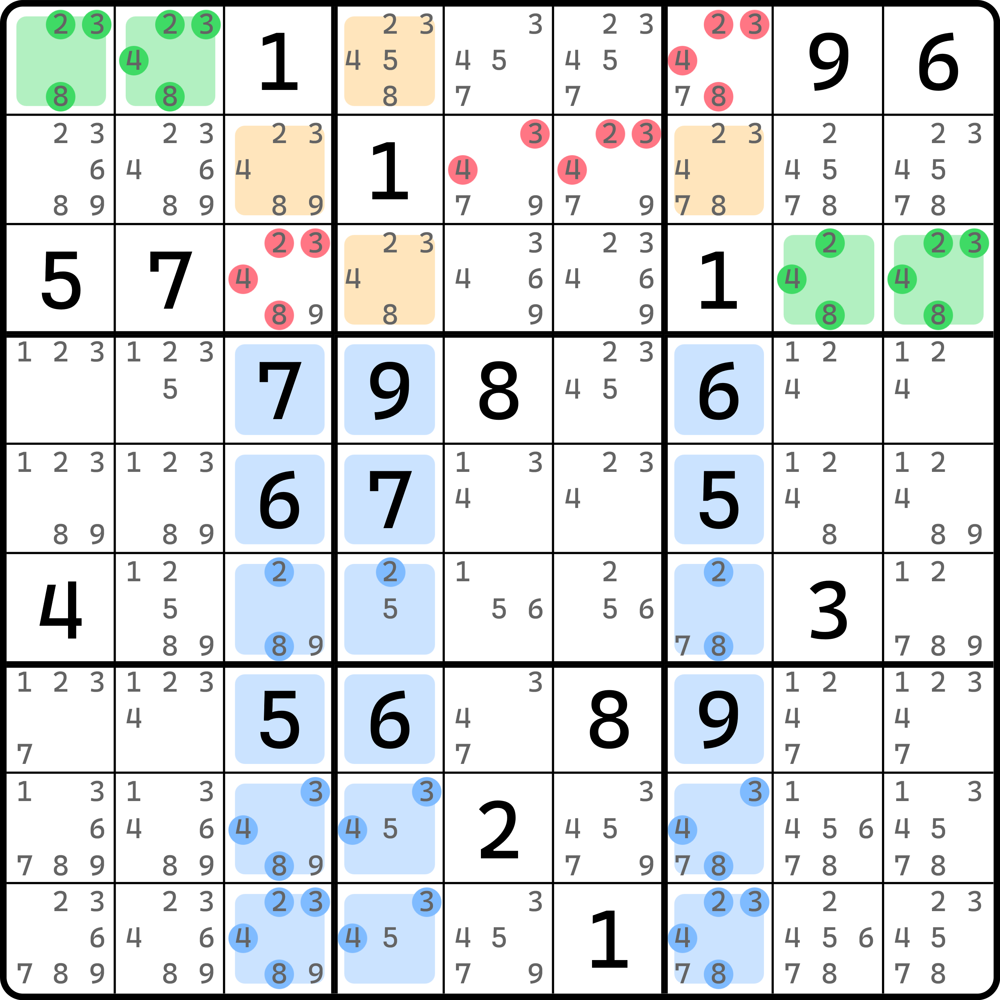
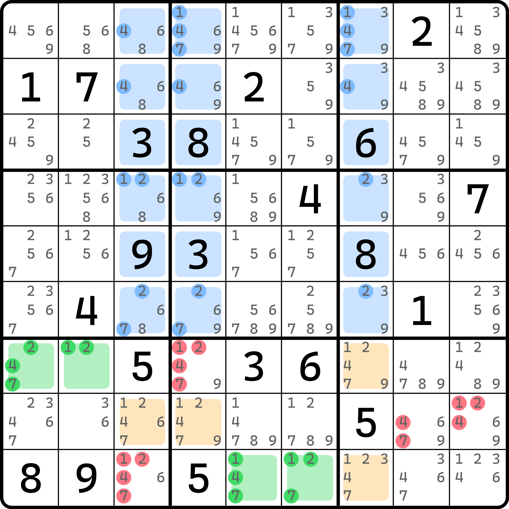
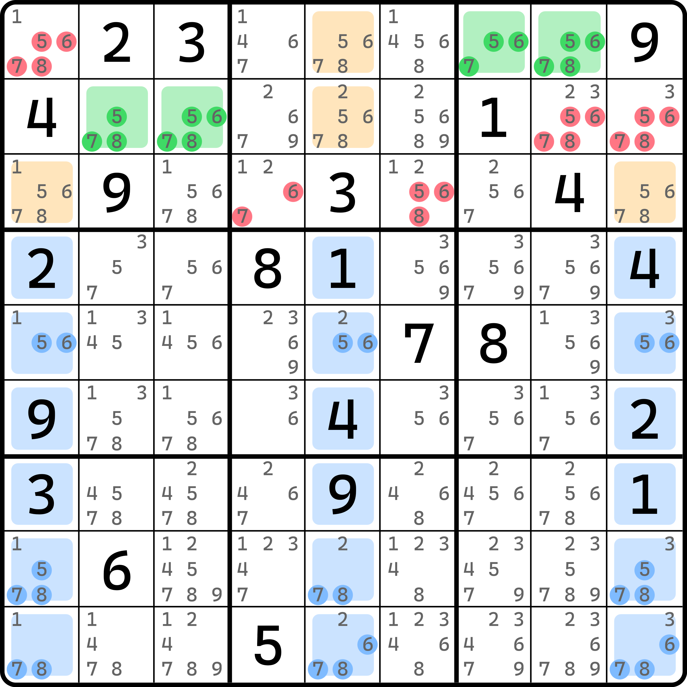
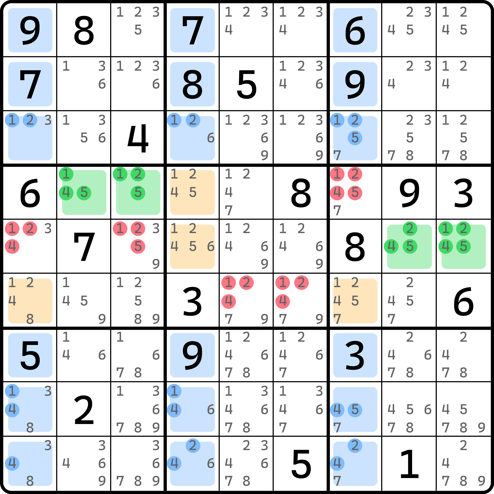
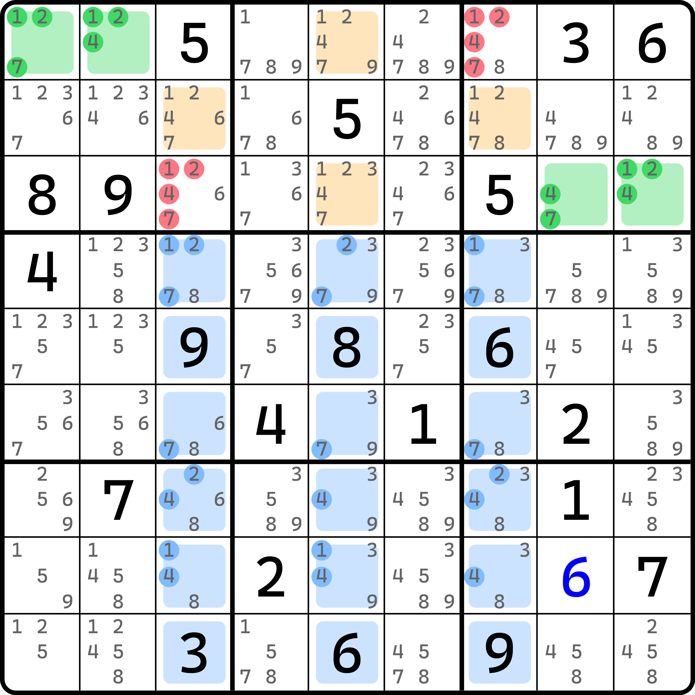
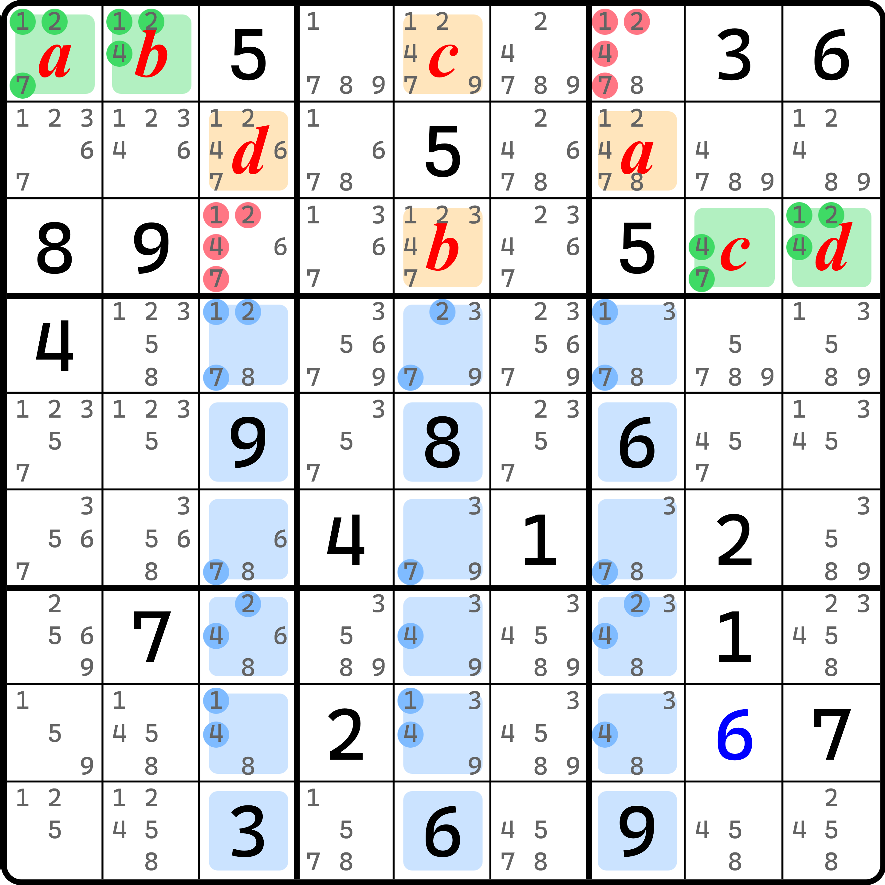
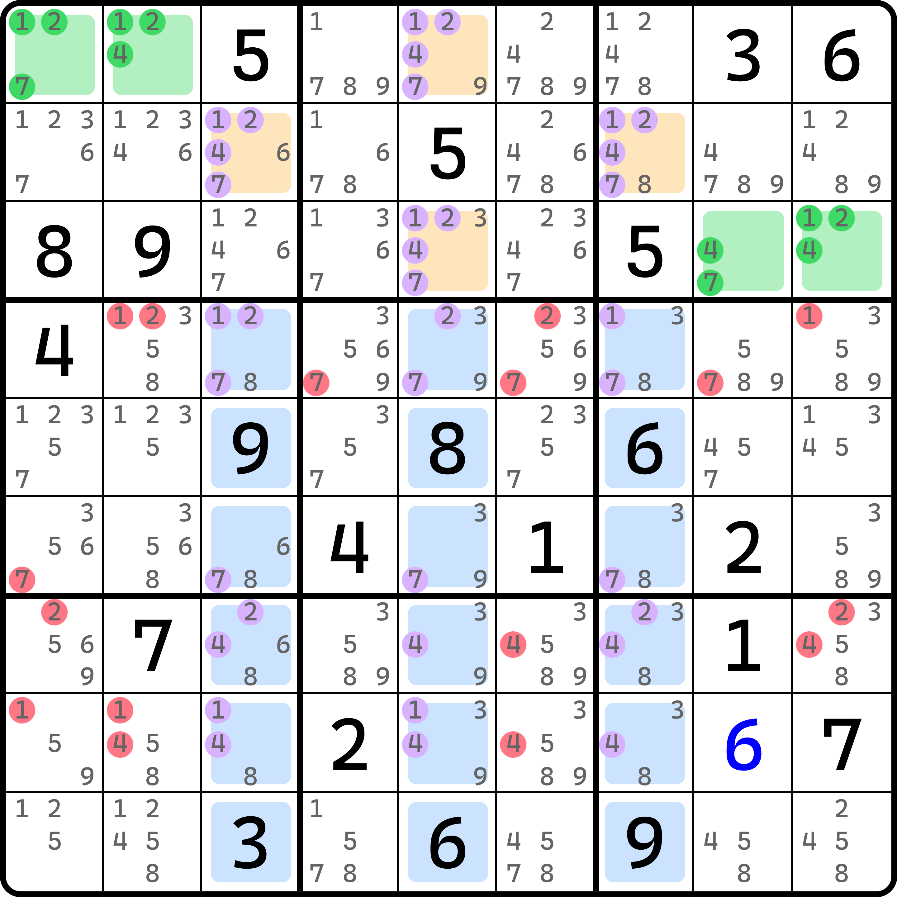
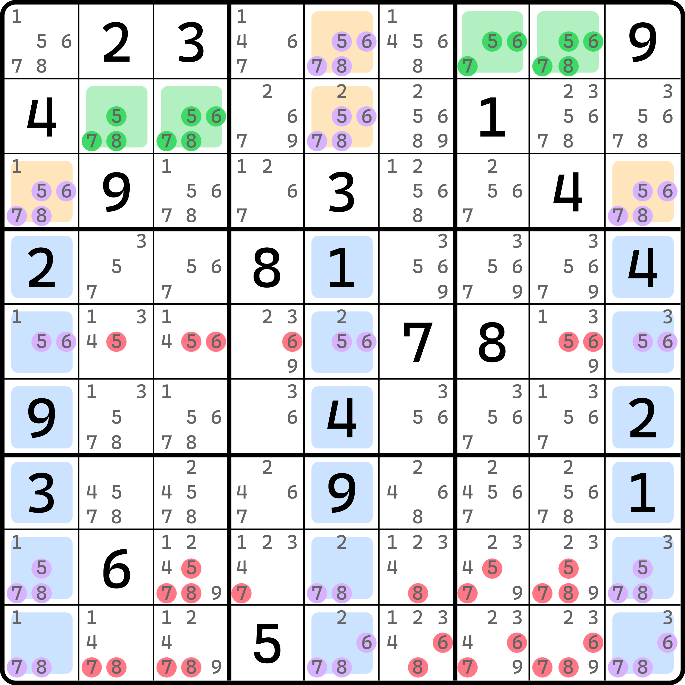
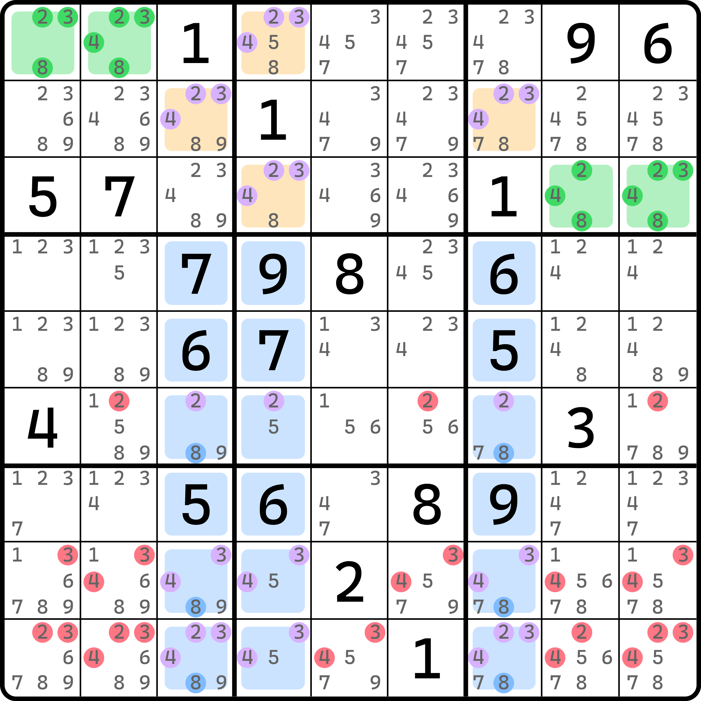

# 双飞鱼

虽然说飞鱼的名字里带有“鱼”字，但是因为它是走英语 exocet 翻译过来的，不能说跟鱼有关系，只能说毫无关联。但是，巧合的是，飞鱼技巧也有类似鱼里孪生的说法。不过，鱼的孪生是借用同样的一部分内容然后合并得到的，所以删数其实仍然是两个独立的鱼的删数；但是飞鱼的孪生有所不同——它可以通过两个孪生的飞鱼结合在一起，进而引发一些额外的结论。

## 双飞鱼的基本推理 

<figure><figcaption>
双飞鱼
</figcaption></figure>

如图所示。这是同一个题目里的两个不同的飞鱼结构。他们都用了 `c347` 作为交叉单元格，但基准单元格选择不一样，所以目标单元格也就不一样。

单独看还是比较好理解的，因为它就是最基础的飞鱼的推理过程。不过，我们进一步去思考一下，这两个结构结合在一起会有什么新结论出现。

假设我们针对左边这个结构，假设基准单元格里填的是 $$a$$ 和 $$b$$（其中 $$a$$ 和 $$b$$ 是 2、3、4、8 的其二），那么目标单元格也是 $$a$$ 和 $$b$$。不过，这两个位置刚好都能看到右图里的基准单元格 `r3c89`，而 `r3c89` 也是 2、3、4、8，所以这两个单元格肯定就不能填 $$a$$ 或 $$b$$ 了。那么我们用 $$c$$ 和 $$d$$ 来表示，此时 `r3c89` 必须填的是另外两个数 $$c$$ 和 $$d$$，故右图里的结构里，目标单元格就是 $$c$$ 和 $$d$$。

我们将四个目标单元格 `r13c4` 和 `r2c37` 结合起来，他们整体只能填 $$a$$、$$b$$、$$c$$ 和 $$d$$ 四个数，而且还互不相同。这便是这个结合起来产生的新结论：四个目标单元格整体构成一个跨区四数组。那么，结论呢？结论就是，`r3c56` 是不能填 2、3、4、8 的任意一个数的。

更进一步，我们结合基准单元格也可以得到结论。将两个图里的四个基准单元格结合起来，因为四个基准单元格也是互相填入的不同数字，所以这四个单元格也刚好构成一个跨区数组。因此，`r1c7` 和 `r3c3` 也可以去掉 2、3、4、8。所以，这个题产生的进一步的删数如下：

<figure><figcaption>
双飞鱼的进一步结论
</figcaption></figure>

如图所示。这就是这个飞鱼结构可以额外产生的结论。

我们把两个飞鱼结合在一起的情况称为**双飞鱼**（Double Exocet）。之所以没有叫“孪生飞鱼”，是因为孪生这个术语在鱼里不能造成额外的删数，他们从结论推导上并不完全一样。

接下来我们来看一下双飞鱼的例子。

## 一些例子 

我们来看一些例子。

### 例子 1 

<figure><figcaption>
例子 1
</figcaption></figure>

如图所示。基础删数就不展示了。这里展示的是双飞鱼里的特殊删数部分。

和前文推理完全一样，照着搬下来就行。先是假设基准单元格，然后得到其中一边的目标单元格是 $$a$$ 和 $$b$$ 后，随记得到另外一个飞鱼结构的基准单元格只能是 $$c$$ 和 $$d$$，然后得到另外一个飞鱼的目标单元格也是 $$c$$ 和 $$d$$，最终得到跨区四数组的结论。

### 例子 2 

<figure><figcaption>
例子 2
</figcaption></figure>

如图所示。这个题也是一样的。

### 例子 3 

<figure><figcaption>
例子 3
</figcaption></figure>

如图所示。这个题也是一样的，不过要注意的是，其中有一个飞鱼比较特殊，它用到了一个明数。

实际上，这个题在最开始讲飞鱼的时候就说过了，明数可以纳入到交叉单元格填入次数的计算之中。这里只是将其结论进行双飞鱼层面的推广而已。

## 双飞鱼里的三阶解鱼 

在飞鱼的内容里，我们说到它会存在三阶解鱼的特殊结论。在双飞鱼里，它仍然会出现，而且更好解释。

<figure><figcaption>
双飞鱼，没有字母标识
</figcaption></figure>

如图所示，这是一个双飞鱼结构。它有很多删数，不过这里我们就标图里这几个，因为这几个才会实质性影响后续的结论推导。

显然，因为双飞鱼的过程我们可以知晓，交叉单元格里必须只能填入最多两次 1、2、4、7。对于这个图里也是如此。不过，这次我们可以通过形成的结论反向影响到交叉单元格里。怎么影响呢？看到我标注的删数了吗？这些是不能填的，而能填 1、2、4、7 的地方，在 `c357` 整个三列里，就只有交叉单元格里和目标单元格这四个位置了。

这样确实有些不直观。我们给它标上字母：

<figure><figcaption>
双飞鱼，标上字母
</figcaption></figure>

如图所示。要强调的是，字母的顺序并非是正确的，这里只是一个标识。比如 `r3c89` 这里，不是说 $$c$$ 一定在 `r3c8` 而 $$d$$ 一定在 `r3c9`，这里是因为我的软件标注不出来这种混合的表示，这里只是表示 `r3c89` 整体假设的是 $$c$$ 和 $$d$$，而 `r1c12` 整体是 $$a$$ 和 $$b$$。

不过问题不大。主要是看下面这 18 个交叉单元格。因为整个三列 `c357` 是必须填三次 1、2、4、7 的，而很明显的是，四个字母假设的位置一定会出现一次。比如 `r2c7` 图里标的是 $$a$$，意味着此时 $$a$$ 代表的这个数在 `c357` 里会有一次确切填入；$$b$$、$$c$$ 和 $$d$$ 也是一样。

这也就是说，$$a$$、$$b$$、$$c$$ 和 $$d$$ 在余下的交叉单元格里都只能填两次了，而且是确切的两次，并非是最多两次。

这里我们挨个数字看看。比如数字 1，它在交叉单元格里只有 `r38` 里出现过。我们给 `r3` 和 `r8` 各安排一个 1 的填写，这样三个 1 就凑齐了，而且你还填不了更多的情况。所以，`r38` 确定了一定会有 1 的一席之地，故 `r38` 的其余的单元格都不能填 1；同理，2、4、7 也都如此。所以，双飞鱼还有一个进一步的结论：三阶解鱼的删数。

所以，这个例子的解鱼删数有哪些呢？

<figure><figcaption>
双飞鱼，三阶解鱼的删数
</figcaption></figure>

如图所示。这些都是可以删的。

再来看一个例子。

<figure><figcaption>
双飞鱼，另一个解鱼删数的例子
</figcaption></figure>

如图所示。这个题的删数原因完全一样，就自己看了。

那么，有没有可能，双飞鱼的解鱼不存在或者不能删呢？答案是有的。比如下面这个例子。

<figure><figcaption>
双飞鱼的解鱼结论，但是有一个数不能删数
</figcaption></figure>

如图所示。图中的 2、3、4、8 是双飞鱼的数字，其删数原本按解鱼删数也是 2、3、4、8 的，但是数字 8 是不能删数的。因为这个例子里，数字 8 的方向是竖着的。在当你确定了 `r13c4` 和 `r2c37` 一定是 2、3、4、8 之后可以删掉 `r1c7` 和 `r3c3` 这两个单元格里的 2、3、4、8。

接着，按列来看，我们会知晓数字 2、3、4、8 在交叉单元格里必须填恰好两次。对于 2、3、4 都好说，他们恰好都只会出现在交叉单元格里的其中两个行。但是 8 不满足，它的结论形成是按列来看的：数字 8 可以在交叉单元格里填入在 `r689c37` 这 6 个单元格里。显然，`c37` 上各自放一个就“满员”了，所以 8 确实符合填两次的特征。但是，按鱼的思维来看的话，2、3、4 都是按行删数（行作为鱼的弱区域来看），但 8 的弱区域必须是按列看的，即 `c37`。可问题就出在这里：`c3` 和 `c7` 放够两个 8 之后，还有一个 8 一定在目标单元格四个位置的其中一个上，即图中 `r13c4` 这两个单元格之中。为什么不能是 `r2c37` 呢？因为 `r2c37` 恰好在 `c37` 上。我们刚说了 `c37` 安排了填 8 的位置在交叉单元格里。

那么，8 的摆放是确切的。但，正是因为这个确切的机制，所以造成了它没有合理的删数——`r13c4` 填 8 就意味着它会作为区块存在。但是，这个区块是“平凡”的，它在结构最初形成之时就已经存在了，也就是说按区块删数就算成立和存在，也跟飞鱼无关；其次，你确定了弱区域，但弱区域的余下可删数的单元格早就被它前一步形成跨区四数组的时候就已经给干掉了。所以，数字 8 这么摆就等于说它没有删数。
