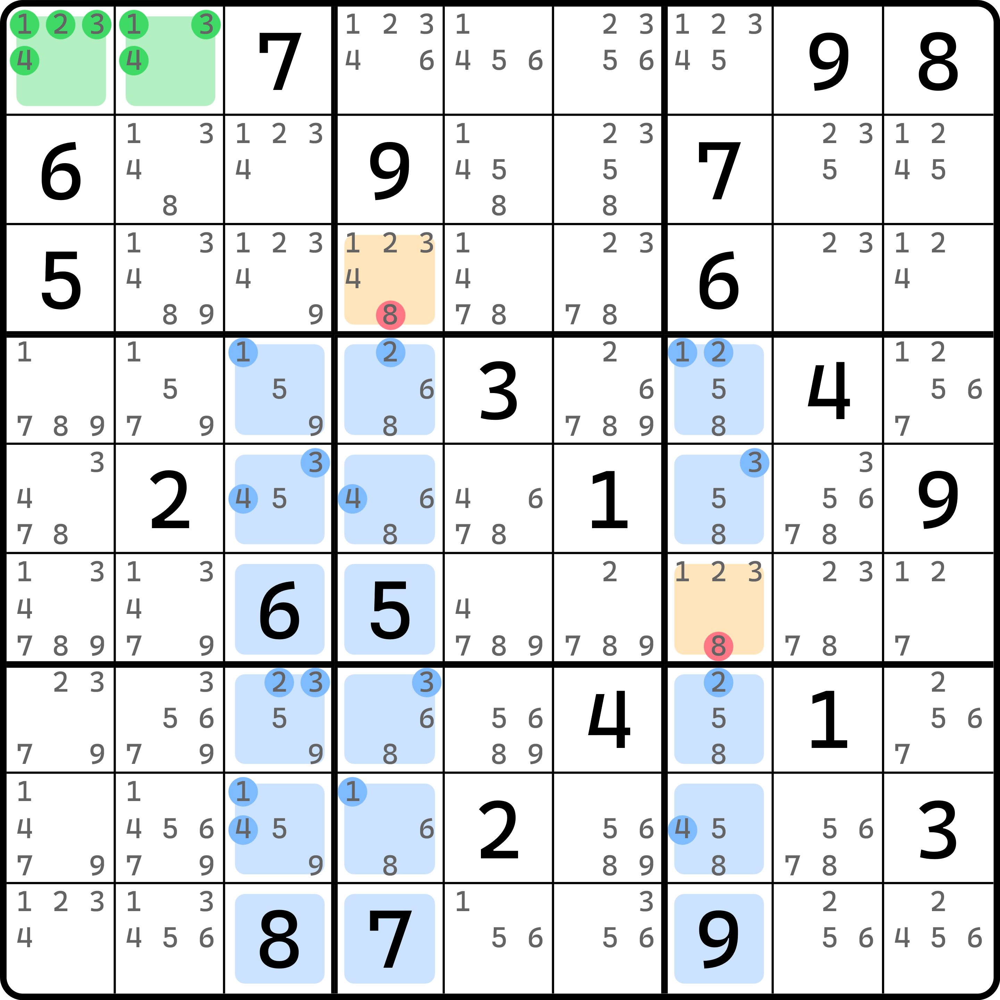
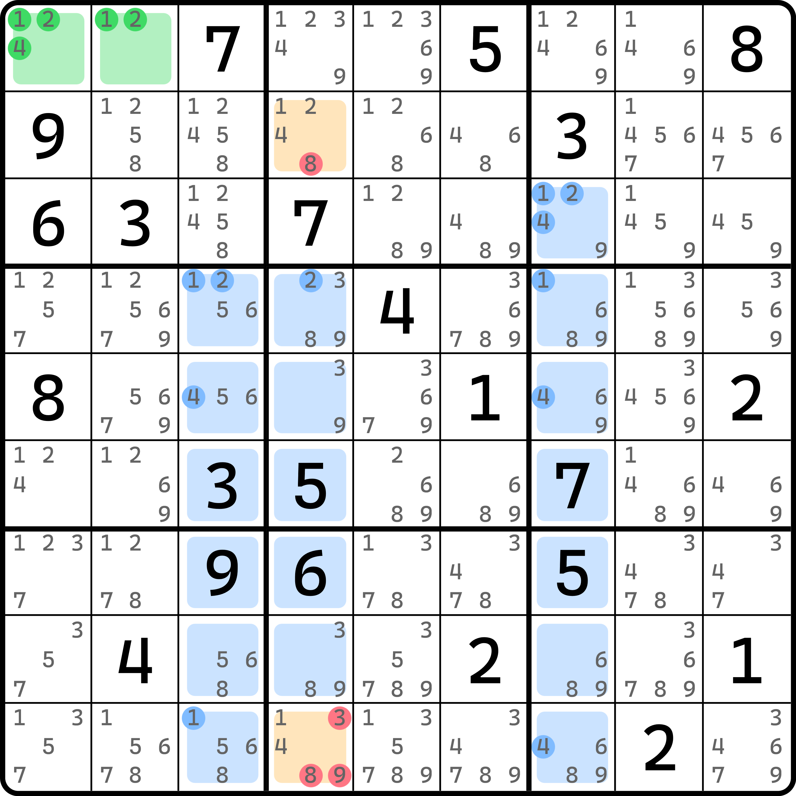
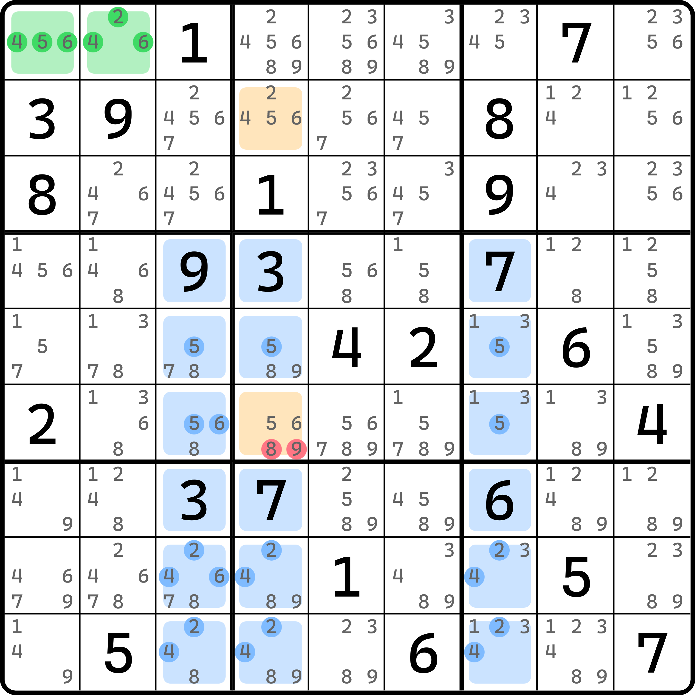
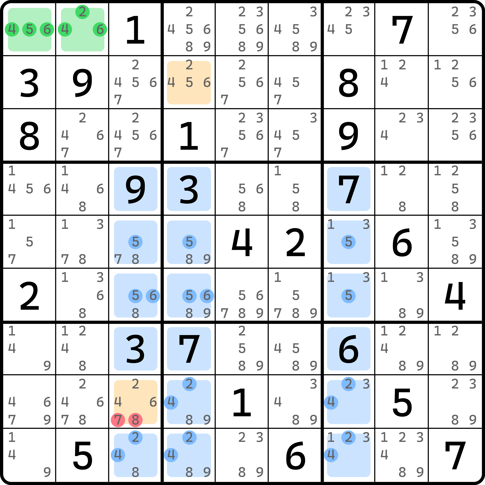
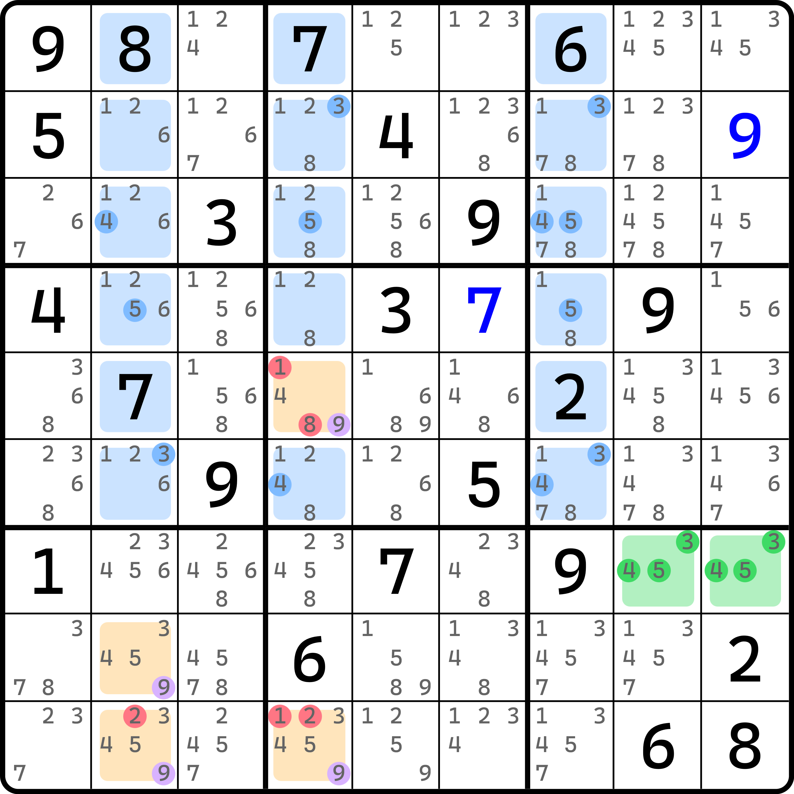

# 高级飞鱼

今天我们来看飞鱼的高级版本。

## 高级飞鱼的基本推理 

<figure><figcaption>
高级飞鱼
</figcaption></figure>

如图所示。这个飞鱼结构和之前的飞鱼有所不同的是，它有个目标单元格内嵌到了交叉单元格的范围里。别的似乎都一样。不过这是怎么奏效的呢？

我们按照基础的推理流程走一遍。基准单元格是 1、2、3、4，于是我们检查这些数字在交叉单元格的填充情况。很显然，`r6c7` 非常奇怪。如果它纳入交叉单元格的话（实际上它确实存在于交叉单元格的 18 个单元格的范畴之中），这就会造成 1、2、3 三种数字的填充次数无法预测。不过没关系，我们干脆干掉它。

假设 `r6c7` 不是 1、2、3，则交叉单元格里 1、2、3、4 四种数字都最多只能填两次，于是对于 `c347` 而言，上方 `r123c347` 就只能填至少一次 1、2、3、4 了，以凑够三次 1、2、3、4。

如果 `r1c12` 是 $$a$$ 和 $$b$$（其中 $$a$$ 和 $$b$$ 是 1、2、3、4 的其二），那么根据排除效果，我们可以得到的是 `r1c47` 和 `r23c3` 都不能是 $$a$$ 和 $$b$$。那么，对于 `r123c347` 而言，$$a$$ 和 $$b$$ 就只有 `r3c4` 可以放了。这怎么可能？唯一的一个位置是填不下两个数的。你把 $$a$$ 放下了，那 $$b$$ 就没有容身之所了。而刚才我们假设的是 `r6c7` 这个影响结构形成的位置是不填 1、2、3 的，这不就矛盾了吗？所以，`r6c7` 必须是 1、2、3 的其一，这样一来，如果我们把他拿出去不算成交叉单元格的一员的话，那么结构就是在告诉你，交叉单元格的 17 个单元格（原本 18 个位置，但是 `r6c7` 被我们拿掉了）里，1、2、3、4 都最多只能填两次，所以，`r3c4` 必须填一个和基准单元格一样的数以外，`r6c7` 也得填，而且还填的是另外一个数，也就是 $$b$$ 了。所以，我们要把这个题里的 `r6c7` 视为目标单元格而非交叉单元格。故这个题的结论是 `r3c4 <> 8` 和 `r6c7 <> 8`。

我们把目标单元格内嵌在交叉单元格的飞鱼称为**高级飞鱼**（Senior Exocet，简称 SE）。相对地，我们把之前学到的所有标准意义的飞鱼都称为**初级飞鱼**（Junior Exocet，简称 JE）。但是，一般我们没有强调那么细致的内容，所以之前的初级飞鱼我们仍然直接称为飞鱼。另外，我们把内嵌到交叉单元格里的目标单元格称为**内目标单元格**（Endo-Target Cell），而之前所有介绍过的目标单元格，因为他们都不在交叉单元格之中，所以按照名称的对称性，我们也有时为区分开，称为**外目标单元格**（Exo-Target Cell）。

## 内目标单元格不好找的例子 

我们前面已经知道了，我们是可以先划分单元格的类型是交叉单元格还是目标单元格的，这并不影响推理，那么我们进一步将这个用法发扬光大，看看下面这个例子应该如何推理。

<figure><figcaption>
一个奇怪的例子
</figcaption></figure>

如图所示。基准单元格是 1、2、4，目标单元格是什么呢？`r2c4` 和 `r3c7`？如果你这么选的话，那么这个题就成了普通的初级飞鱼。删数是有的，不过我不是打算讲这个的。

这个题还有个非常精巧的做法：让 `r3c7` 成为交叉单元格，而 `r9c4` 反倒作为目标单元格。这么划分的意义是什么呢？我们先照着推一遍看看能不能推。

检查 1、2、4 在交叉单元格里的分布情况：

* 数字 1 只能放在 `r3c7`、`r4c37` 和 `r9c3` 里；
* 数字 2 只能放在 `r3c7`、`r4c34` 里；
* 数字 4 只能放在 `r3c7`、`r5c37` 和 `r9c7` 里。

细数一下数字的可填次数。数字 1 最多只能填两个（`c37` 各一个），数字 2 最多只能两个（`r3c7` 填 2，`r4` 安排一个），数字 4 最多也只能填两个（`c37` 各一个）。此时三个数填最多两次都是符合条件的。

那么继续。假设 `r1c12` 分别是 $$a$$ 和 $$b$$，那么我们有 `r2c4` 和 `r9c4` 必须填 $$a$$ 和 $$b$$ 的结论。很显然这样选择的话，`r2c4` 和 `r9c4` 就只能填 1、2、4，于是删掉除了这几个数以外的别的数字。所以这个题的结论有这些。

## 一个诡异的例子 

<figure><figcaption>
一个例子
</figcaption></figure>

如图所示。这个例子的内目标单元格选在了 `r6c4` 上。这个选择很奇怪，但是你看下 6 的分布就知道了。

之前我们介绍过一个例子，明数是可以直接纳入交叉单元格里进行推算的。这个题里的基准单元格里提供的数字是 2、4、5、6，这意味着这些数字都需要分布合理的填数次数——最多两次在交叉单元格里。所以选择 `r6c4` 是明智的选择，它含有一个 6 比较特殊，它的存在会超过填两次的情况。

如果把它拿掉，数字 2、4、5 出现次数都好说，6 的话就只有 `r68c3` 可以填了，而 `r7c7` 是明数的 6。这么看的话，6 在 `r68c3` 里最多填一个，算上 `r7c7` 这个客观的 6，整体也可以说是最多有两个 6 的出现，所以整个 `c347` 里余下的单元格就只能最少出现一次 2、4、5、6 了。后面的推算就完全一样了。

结论就是这里的 `r6c4 <> 89` 了。

这个例子就说完了……吗？你看看这个 6 的摆放是不是很特殊？是的！我们能竖着用一次，还能横着用一次。

<figure><figcaption>
这个例子咱再换一个内目标单元格
</figcaption></figure>

如图所示。这次我们把目标单元格换到 `r8c3` 上。这样 6 就只能摆在 `r6c34` 了，这样和 `r7c7` 组合起来，依然满足最多两次；别的数均不受影响，所以后面的推算逻辑完全一样，结论是 `r8c3 <> 78`。

## 利用共轭对造成删数 

<figure><figcaption>
高级飞鱼 + 共轭对
</figcaption></figure>

如图所示。这个例子一共有四个目标单元格。显然这不太科学，因为我们只能有俩目标单元格才能有删数。不过没关系。这个题的四个目标单元格里，我们将其分为两组：`r89c2` 和 `r59c4` 这两组。`r89c2` 里有 9 的共轭对，而 `r59c4` 也有一个 9 的共轭对。

显然，`r89c2` 里必须要填一个 9，所以另外一个才能是实际填入基准单元格设定的那个数字；而 `r59c4` 也是如此，所以这个题的结论可以删除了 3、4、5 和 9 以外的别的候选数，所以这个题的结论就是 `r5c4 <> 18`、`r9c2 <> 2` 和 `r9c4 <> 12`。
