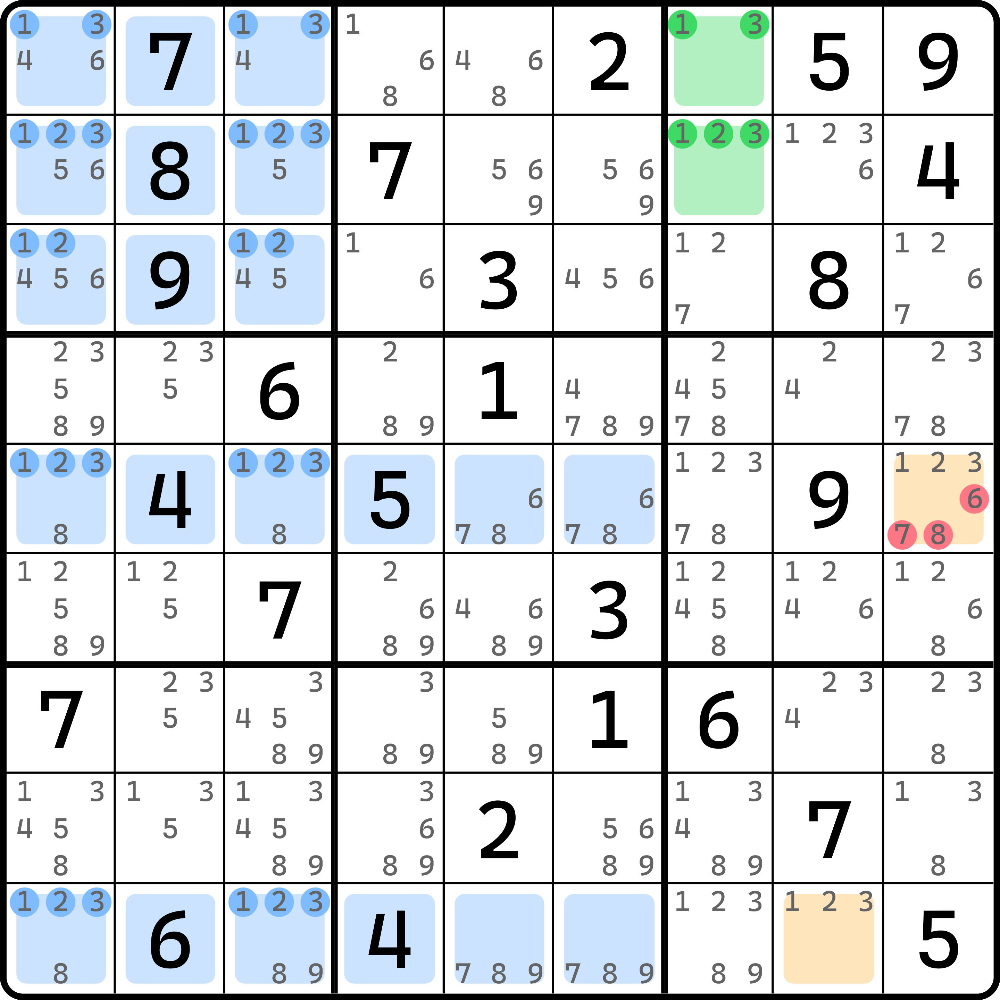
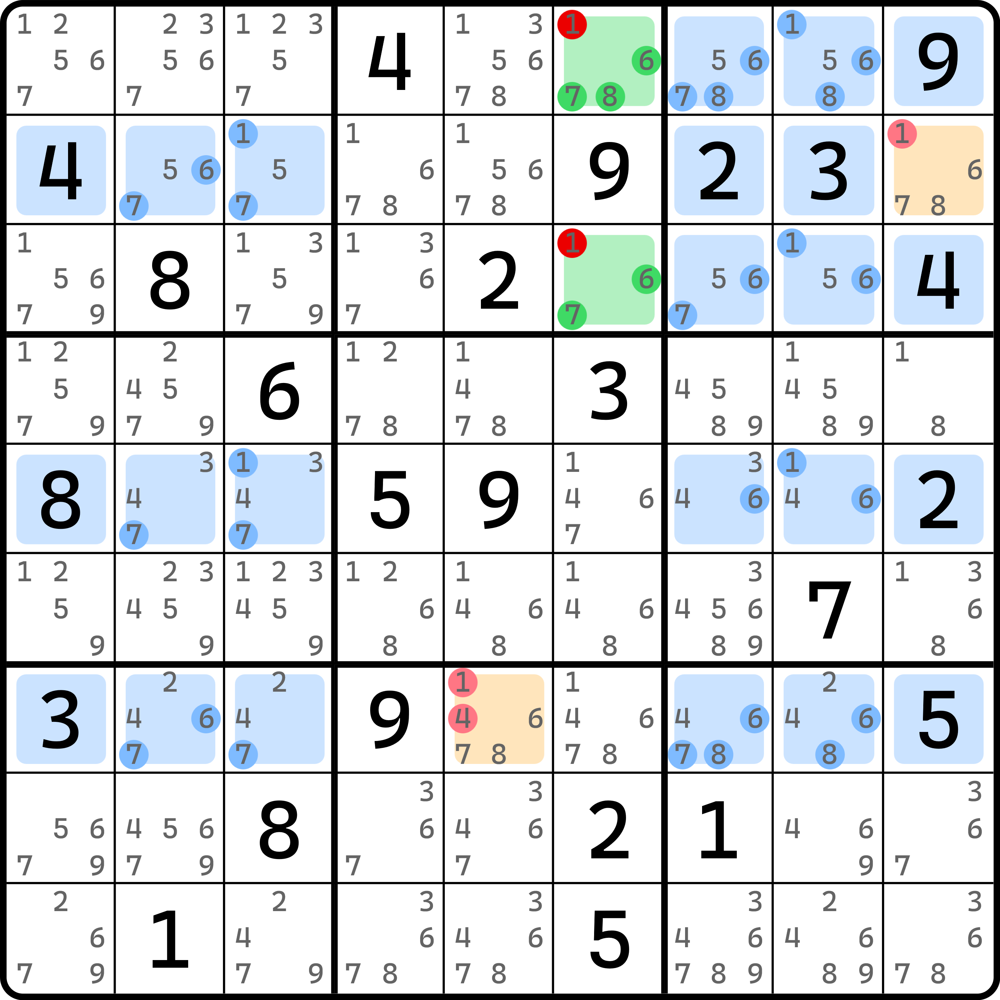
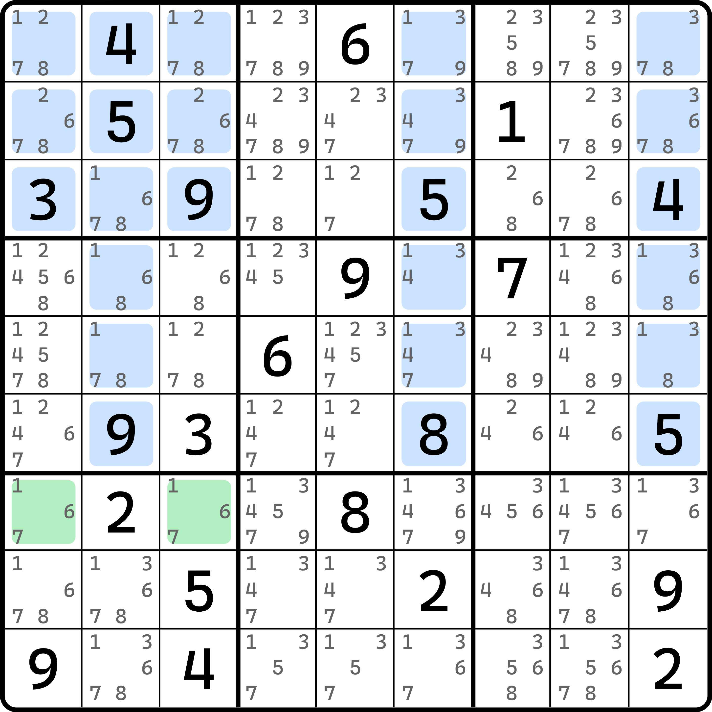

# 宫内飞鱼

## 宫内初级飞鱼（Franken Junior Exocet） 

<figure><figcaption>
宫内初级飞鱼
</figcaption></figure>

如图所示。按照我们之前学到的飞鱼的推理过程，我们需要将结构按之前的思路去思考。但比较奇怪的是，如果我们只利用 `r59` 两行作为交叉单元格的话，那么这个题就无法正常进行下去了，因为 1、2、3 都可以最多填两次。

之前的飞鱼逻辑我们约定的是，如果有 $$n$$ 个行（或列）构成了交叉单元格的所用区域的话，那么它必须要保证其中所有的数字都必须只能最多填入 $$n - 1$$ 次。超过的话会造成结论无法得到（因为交叉单元格并不会涉及和基准单元格所在的同一个大行列的那 9 个单元格）。

这就有些棘手了。因为 `r59` 可以容纳最多两次 1、2、3，所以我们无法继续进行推理。这怎么办呢？非常奇妙的是，我们如果强行把 `b1` 看成交叉单元格的话，似乎问题就解决了：`b1` 这个宫里的 1、2、3 恰好和 `r59` 里交叉单元格里的 1、2、3 同在两个列里。也就是说，我们不论如何摆放 1、2、3 的填数，始终 1、2、3 只会落入 `c13` 里，不会逃走。这样的话，1、2、3 真的就只能最多填两次了，而且这一共有 3 个不同的区域类型参与了计算。

那么我们继续向下思考。如果 `r12c7` 两个单元格填了 $$a$$ 和 $$b$$（此时 $$a$$ 和 $$b$$ 是 1、2、3 的其二），那么这两个数一定会落入到 `r5c9` 和 `r9c8` 之中。

> 这里说得有点快。因为左边这些交叉单元格里暗示了不论你 $$a$$ 和 $$b$$ 是什么数，1、2、3 全都只能最多在交叉单元格里填两次进去；但一共有 3 个区域构成交叉单元格，所以余下的 6 个单元格 `r59c789` 里就必须摆至少一次 $$a$$ 和一次 $$b$$，然后排除掉 `r12c7` 所可以看到的格子，就只有 `r5c9` 和 `r9c8` 了。

那么，`r5c9 <> 678` 肯定就是结论了。

这个结构的推理框架和之前初级飞鱼的思路是一样的。但是因为它借用了 1、2、3 同时处于 `b1` 这个宫的特殊设定，它的设计非常类似于复杂鱼里的宫内鱼，所以这个技巧美其名曰就叫**宫内飞鱼**（Franken Exocet）。这里是初级飞鱼，所以是**宫内初级飞鱼**（Franken Junior Exocet，简称 Franken JE）。

对于这种特殊相貌的飞鱼，其实非常难以在题目里被发现。我的库存了也就只有这一个是初级飞鱼的例子。这个例子还是由邱言哲亲自出的题目。不过比较遗憾的是，这个题是强行构造的，属于是为了介绍这个结构而特殊搭的结构的架子。但是，这个题本身的难度并不高，它可以被普通的链给破解掉。所以这个题只是为了呈现技巧的推演。

## 宫内高级飞鱼（Franken Senior Exocet） 

下面来看高级飞鱼的版本。

### 宫内高级飞鱼的基本推理 

<figure><figcaption>
宫内高级飞鱼
</figcaption></figure>

如图所示。这个题有些类似之前介绍过的一个比较特殊的例子。基准单元格能删 1，但不要以为只有 X 致命定理才能删。这个题因为形状发生了变异所以本身也无法使用 X 致命定理。它是怎么删的呢？

我们使用反证法。假设 `r13c6` 里有 1 的填写，那么另外一个单元格必然是 6、7、8 的其一。这里我们假设为 $$a$$。和之前一样，我们把 $$a$$ 填写的这个格子当成单个基准单元格，这样来看飞鱼的话，我们直接检查 6、7、8 三个数在交叉单元格里的填数。注意，$$a$$ 此时是不为 1 的，因为它是 `r13c6` 里另一个格子的填数，所以按飞鱼的逻辑，我们只用讨论 6、7、8 在交叉单元格的分布情况就行。

我们发现，6、7、8 的位置分布在了不同的三个列上，这显然意味着他们最多都能填三次进去。但这个 1 确实比较奇怪。1 虽然不讨论，但是毕竟 1 会占用 `r13c6` 里的一个填数位置，所以 `r13c6` 的那个 1 必然会影响这些交叉单元格里 1 的位置摆放。仔细观察 1 的位置，我们确实发现 1 只能填在 `r25c3` 和 `r135c8` 这五个单元格里。哦对，还有 `r2c9` 别忘了。

要想在 `b3` 和 `r257` 四个区域里填入足够数量的 1，我们需要仔细数数，这个 1 的分布确实有点迷。如果 `r2c9` 占位填 1，它会同时满足 `b3` 和 `r2` 两个区域填 1 的需求，这样四个区域填三次 1 就足够了（不然就得填四次 1）。顺着这个思路想下去：

* 如果 `r2c9 = 1`，那么 `r5c38` 里有一个 1，于是 `r7c5 = 1`；
* 如果 `r2c9 <> 1`，那么 `r13c8` 里可以填一个 1，`r2c3 = 1`，于是 `r5` 没 1 可填，矛盾。

有人问，为啥不能填？`r5c6` 不是可以填 1 吗？别忘了大前提是假设了 `r13c6` 里有一个是 1 的，这样 `r57c6` 都是不能填 1 的。

那么我们可以顺着思路得到 `r2c9 = 1` 和 `r7c5 = 1` 这两个结论。看起来没毛病。但是，别忘了这是单基准格的飞鱼，$$a$$ 的位置我们都还没放呢。我们感谢 `r2c9 = 1` 把这个恶心的单元格给占掉了。现在，交叉单元格里 6、7、8 都能最多填三次。尤其是这个 8，`r5c1` 是明数的 8，它会占用掉一次填 8 的机会，而 8 余下空格还能填最多两次 8，所以整体最多是三次 8 的出现；这点我们之前说过了，有那么一个例子我们会用到一次明数的作为推理的一部分。

因为顺着这个思路下去，$$a$$ 是 6、7、8 的其一，那么就必须要在 `r7c5` 这个唯一余下的位置上填 $$a$$。但是，它在大前提的约束下必须填 1 才能符合条件，这是不能填别的数的。那么，6、7、8 有一个数就无论如何都填不满了。这便形成了矛盾。

是的，我们中间经过了艰难险阻，得到了那么多可以出数的结论，结果发现最开始的假设就是错的。所以，`r13c6` 里压根就不能有 1 的出现。所以，`r13c6` 可以删掉 1。删掉 1 之后呢？删掉了之后，这个结构余下不是还有 6、7、8 三个数吗？那么我们把他当成两个基准单元格的普通飞鱼去看就行了。因为交叉单元格的填入次数我们刚才就讨论过了，这点是不受 1 的有无的影响的，所以可以直接拿来用；如果基准单元格 `r13c6` 是 $$a$$ 和 $$b$$，那么目标单元格除了放在 `r7c5` 上，还能放在哪呢？对了，这个 `r2c9`。这个单元格尤为特殊，它处于两个区域 `b3` 和 `r2` 的交集上。如果我们不把它算作目标单元格，那么讨论就会过于复杂。因为它的占位与否影响 6、7、8 实际的填充次数——就是说，之前的“最多填几次”的这个数值上是一个定数，比如最多两次最多三次，肯定是 2 和 3 贯穿始终，是一个固定数值；但是如果 `r2c9` 的占位和不占位，最终要讨论的填充次数最多几次就不再是一个定数了，因为它占位会同时满足 `b3` 和 `r2` 两个区域填这个数的机会，这会使得讨论更加麻烦和棘手，甚至无法继续推演。

那么，`r2c9` 和 `r7c5` 被看成目标单元格之后，似乎一切都明朗了起来。因为 6、7、8 都最多三次，所以 `r2c9` 和 `r7c5` 这两个单元格里也就必须是 $$a$$ 和 $$b$$ 以保证 $$a$$ 和 $$b$$ 这两个数能填够。所以，结论就是 `r2c9 <> 1` 和 `r7c5 <> 14` 了。

这个结构是高级飞鱼的讨论模式，所以我们把这个结构叫做**宫内高级飞鱼**（Franken Senior Exocet，简称 Franken SE）。

### 讨论 r2c9 占位与否并不重要 

有人还是觉得这一点很奇怪。`r2c9` 到底说还是处于两个区域的交集，它填不就直接让这个数同时满足两个区域 `b3` 和 `r2` 的填数了么？那不就破坏了最多填数次数的逻辑了么？这里再多补充一下。`r2c9` 是按目标单元格算的，这意味着我们预先拿掉了它填入的机会——它被剥夺了填入次数的计算。之前我们说过，交叉单元格是按单元格为单位在计算的。这句话不单单是一句废话。你可以把交叉单元格的设计范围当成一个数学上的集合。假设 `b3` 和 `r257` 四个区域构成全集 $$\Omega$$，那么全集等于交叉单元格序列 $$S$$、被 `r13c6` 排除掉的一些单元格 $$C$$ 和这两个目标单元格 $$T$$ 并起来，即 $$\Omega = S \cup C \cup T$$。因为我们只讨论 $$a$$ 和 $$b$$ 在此环境中填入的次数，只是说 6、7、8 三种数字都最多是三次，所以换什么数成为这个 $$a$$ 或者 $$b$$ 都无所谓，因为不会有特殊情况需要单独考虑，这是飞鱼所要强调的点。

显然，$$a$$ 或者 $$b$$ 在集合 $$C$$ 里都不能填，所以公式里的 $$C$$ 可以拿掉：$$\Omega = S \cup T$$。我们的目的是保证 $$a$$ 和 $$b$$ 在整个 $$\Omega$$ 范围填入的次数是够的就行。之前的所有飞鱼里，次数都是一个定值，毕竟都还没有出现过 `r2c9` 这个格子造成填入次数出现不定的情况。这个例子里，`r2c9` 的填入与否确实会影响最终 $$a$$ 和 $$b$$ 可以填入的总的次数，但这并不重要。之前所描述的“最多几次”，也只是一个形象的描述，告诉你集合的两侧一边“最多几次”而另一边“最少几次”，这样并起来才能是定数，就是数学的不等式的一个口语化的体现，毕竟好理解一些。这里直接这么解释确实有些不好懂，但这并不重要。我们只需要知道这个数就算不是固定的，但从题目的答案上来讲，它总得是一个定值吧，只是说 $$a$$ 对于不同的取值下，这个定值可能不一样罢了。

这个话的意思是，我们要让 $$S$$ 这边填入的次数最多 3 次，所以理应 $$T$$ 就得是最少 $$x$$ 次（这个 $$x$$ 本身可能是 0，也可能是 1，不知道）。虽然这个 $$x$$ 我们不知道具体的取值，但是我们知道 $$3 + x$$ 次是这个数字最终要填在 $$\Omega$$ 集合里的确切次数，而 $$3 + x$$ 肯定是一个固定的数字，所以，讨论 `r2c9` 是否破坏结构的填充次数真的不重要。

## 复杂飞鱼大多都是高级飞鱼 

可以从前面例子里看出，因为结构的特殊性，它往往都会有 `r2c9` 这种交点格进而影响推理过程。为了结构可以进行正常推理，大多数时候 `r2c9` 这样的格子都是会被当成目标单元格来处理的。所以，复杂飞鱼的例子大多都是高级飞鱼。初级的复杂飞鱼一般不会出现，或者说例子非常少。

## 小练习 

下面给各位一道练习题。这个题只给了模糊的基准单元格和目标单元格，请找出这个结构里的飞鱼结构并得到合理的推演结论。

<figure><figcaption>
练习题
</figcaption></figure>

注意，目标单元格需要自己找，它可能是初级飞鱼也可能是高级飞鱼，所以目标单元格可能也在蓝色标注的范围里，也可能不在。

答案就不在这里说了。这个题我们还会在后面的例子里见到的；而且当前我们能掌握的推理只能删掉这个结构的其中一部分的候选数，所以现在就说了答案有些不值得。
