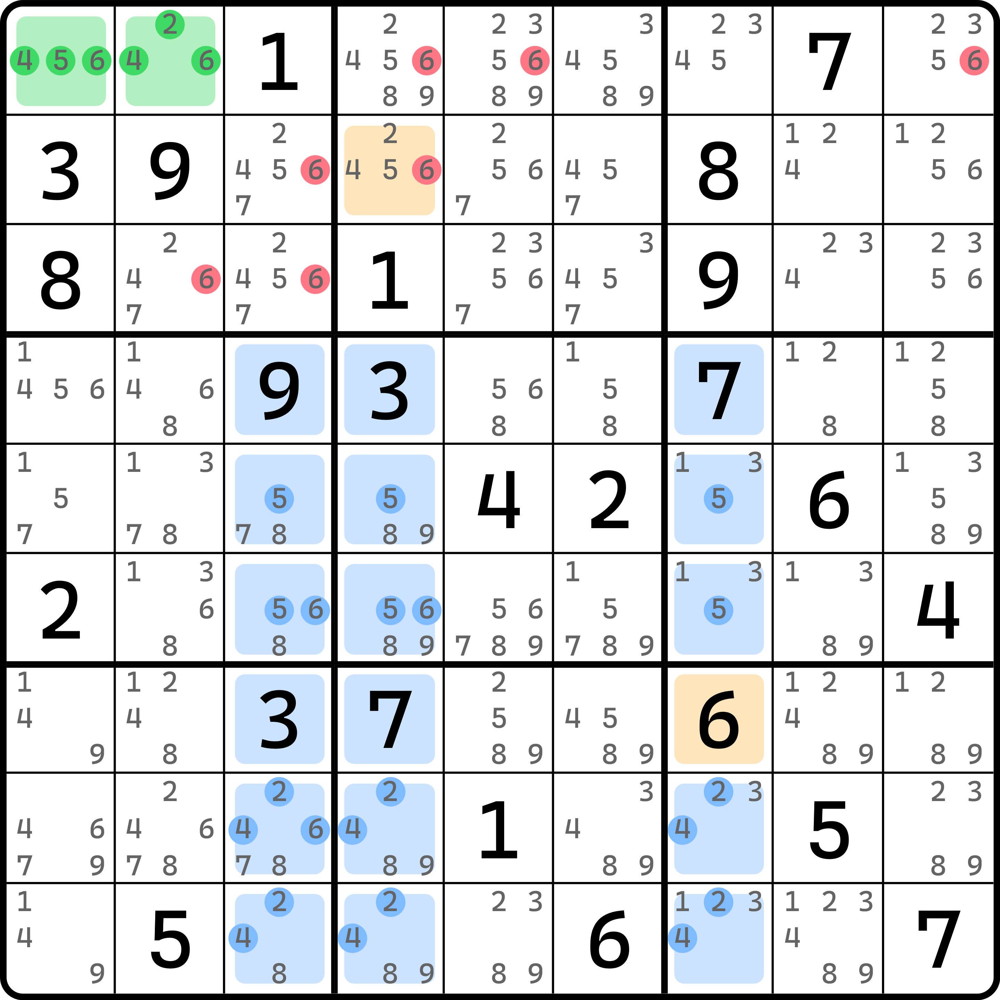

# 退化飞鱼

前文我们介绍了高级飞鱼的使用。下面我们来看一种高级飞鱼的特殊情况。

## 退化飞鱼的基本推理 

<figure><figcaption>
退化飞鱼
</figcaption></figure>

如图所示。基准单元格里是数字 2、4、5、6，但是数字 6 在 `r7c7` 出现了。交叉单元格里出现基准单元格里有的数字的明数形式，这虽然本身不怎么影响推理过程（可能只是比较特殊的存在），但这个题比较特殊——它出现了之后推导就进行不下去了：因为 `r6c34` 和 `r8c3` 还有候选数 6，也可以出现两次，所以这会影响 6 的摆放。

这回难受了。它还是明数，还不是空格。我们无法假设它不填 2、4、5、6 来强行继续。那我们干脆把它拿出去，只看余下 17 个单元格。交叉单元格原本 18 个，现在拿出去之后还有 17 个。拿出去的这个行为看起来有些奇怪，但它确实不影响推理，我们只是调整了计算 2、4、5、6 的分组填充次数的情况，它是明数也只是说它不算在交叉单元格之中而已。

余下 17 个单元格里，2、4、5、6 恰好都只能填最多两次。注意 6 此时是可以有三个的（因为 `r7c7` 是 6，算上 6 本身候选数层面的最多两次一共是最多三次），但这并不影响什么。我们继续后续的推导。我们发现，目标单元格只有 `r2c4` 一个位置了。基准单元格是 $$a$$ 和 $$b$$ 的话，那么 `r2c4` 填了 $$a$$ 之后，$$b$$ 就没地方放了。

那么，这矛盾了吗？并没有。相反，我们还得到了一个非常有意义的结论：`r1c12` 一定有 6。这里不是很好从前面直接得到这个结论，我们不如反过来想。如果 `r1c12` 里没 6 的话，那么 6 意味着我们不用把 `r7c7` 拿出去了，因为它再也跟我们这里的推理没有关联。原本 2、4、5 符合最多两次在交叉单元格里的约定，所以后续推理都可以正常进行。但是到结尾下结论的时候我们会发现问题：目标单元格只有 `r2c4` 了。这次是真的没有位置放了。交叉单元格里只能最多填两次 2、4、5，目标单元格也就一个位置放 2、4、5，那么有一个数肯定会放不进去，这必然矛盾。所以，`r1c12` 一定有 6。

那么，结论就是 `r1c12` 形成 6 的区块。所以 `{r1c459, r2c3,r3c23} <> 6`。而同时，因为基准单元格有 6 的存在，所以目标单元格一定要把 6 安排在 `r7c7` 上。所以，也就意味着 `r2c4 <> 6`，毕竟两个目标单元格是一个 $$a$$ 一个 $$b$$ 的，这便是这个题的全部删数。

我们把这个技巧称为**退化飞鱼**（Sashimi Exocet）。

比较遗憾的是，这个技巧我就只有这一个例子。
