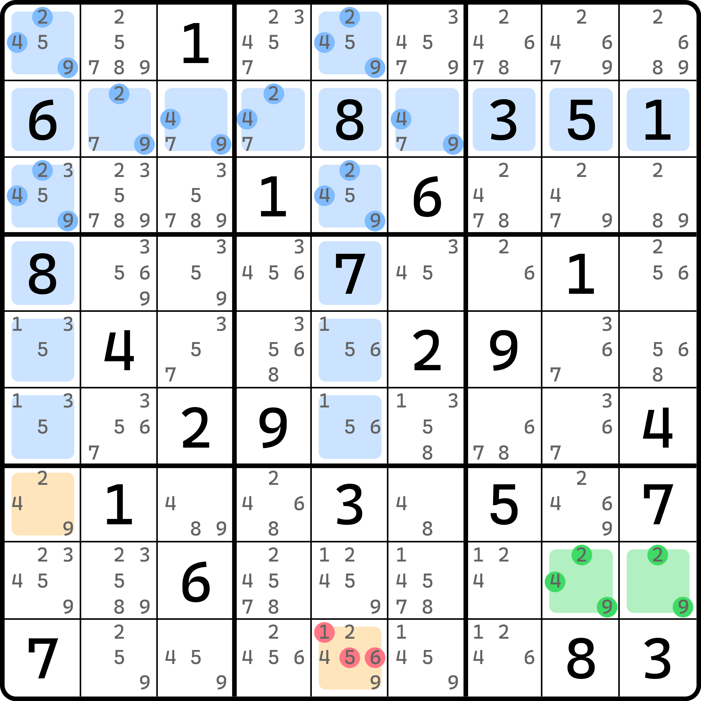
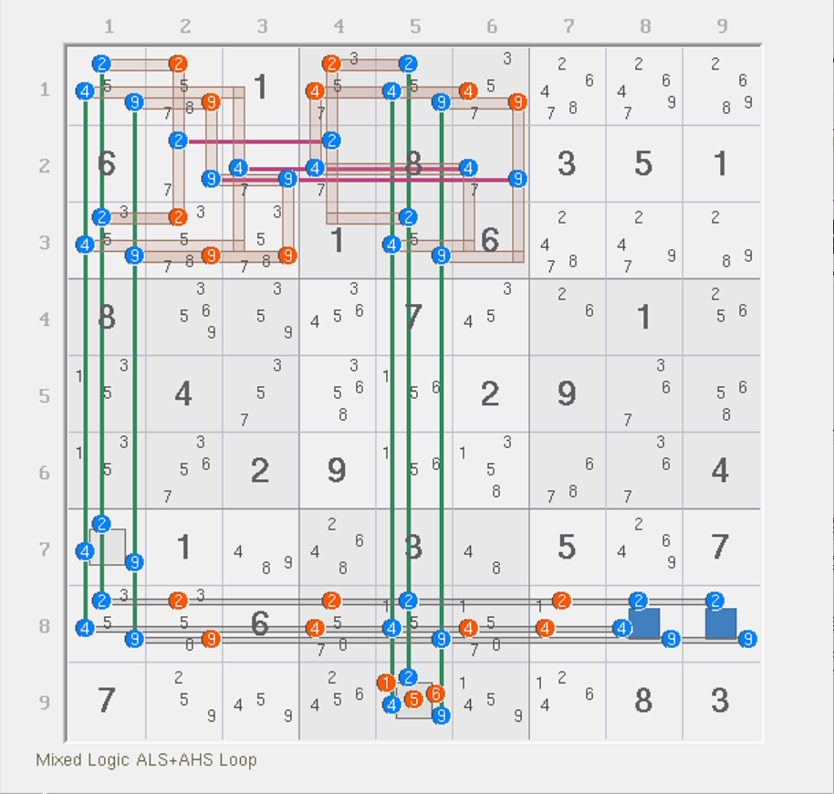
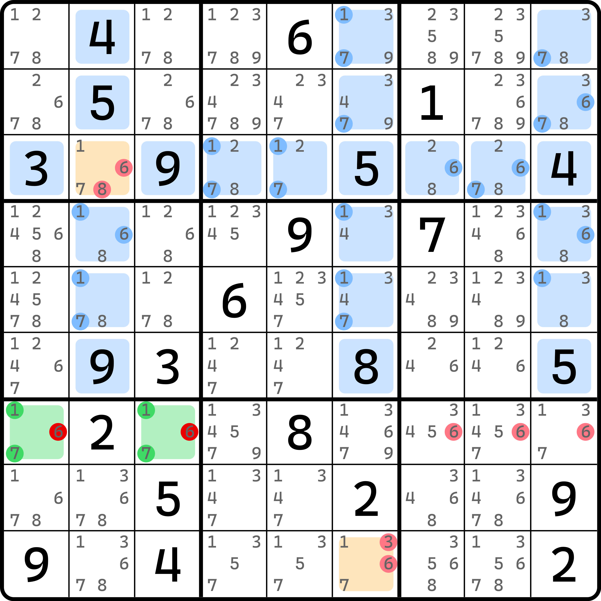
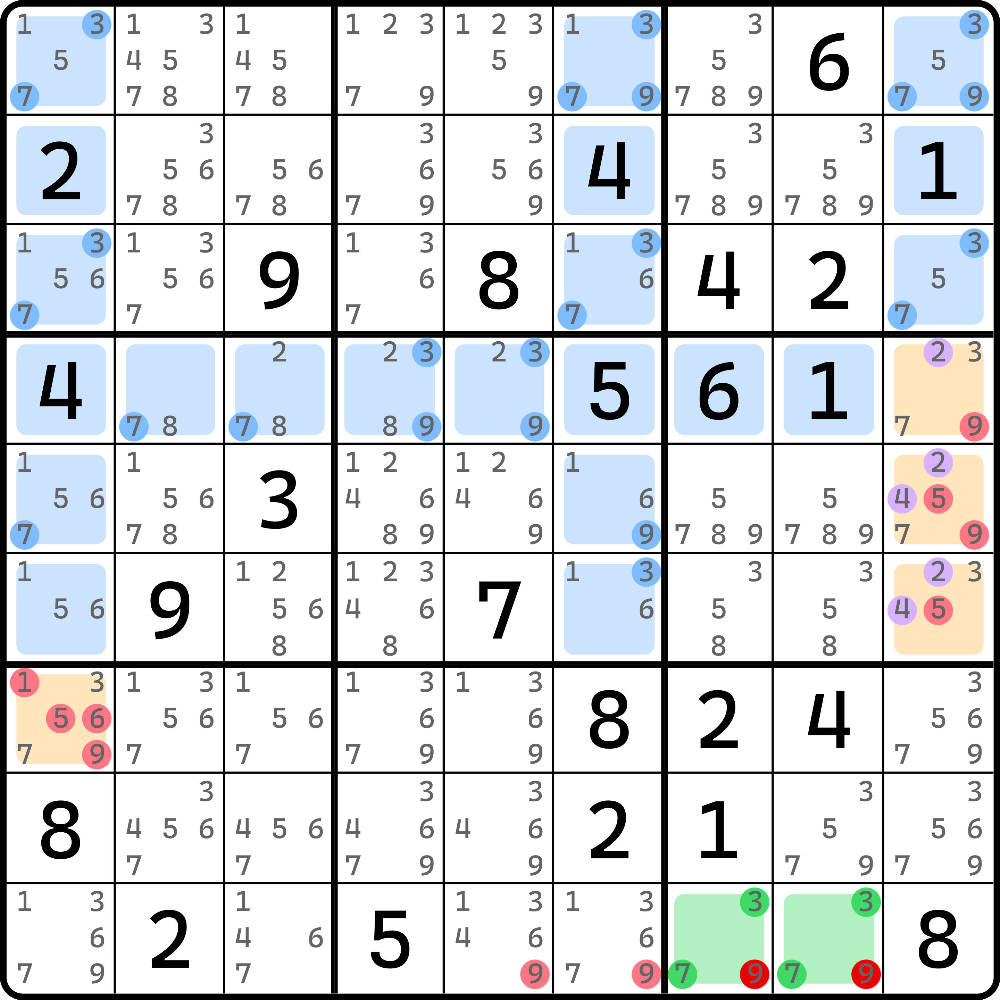
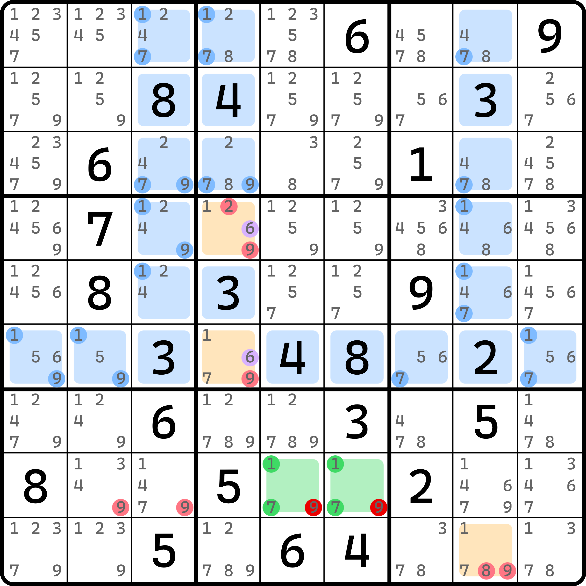
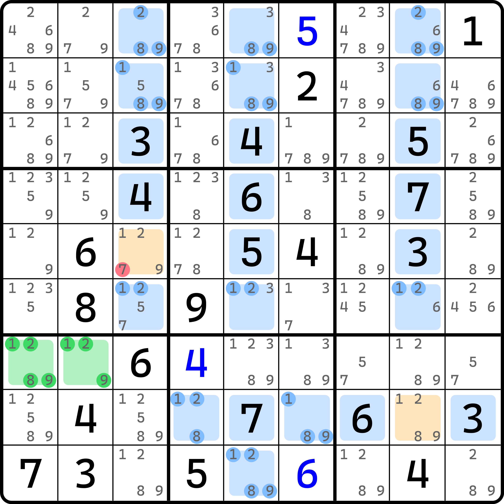
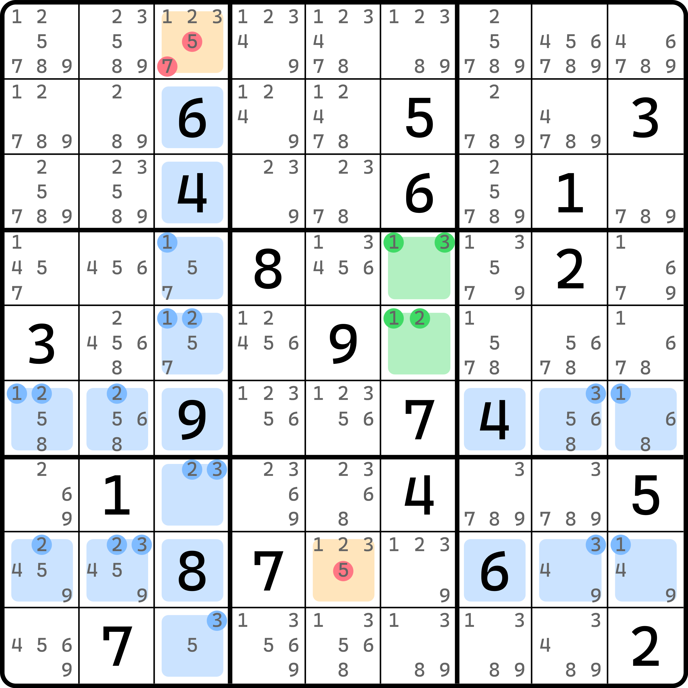
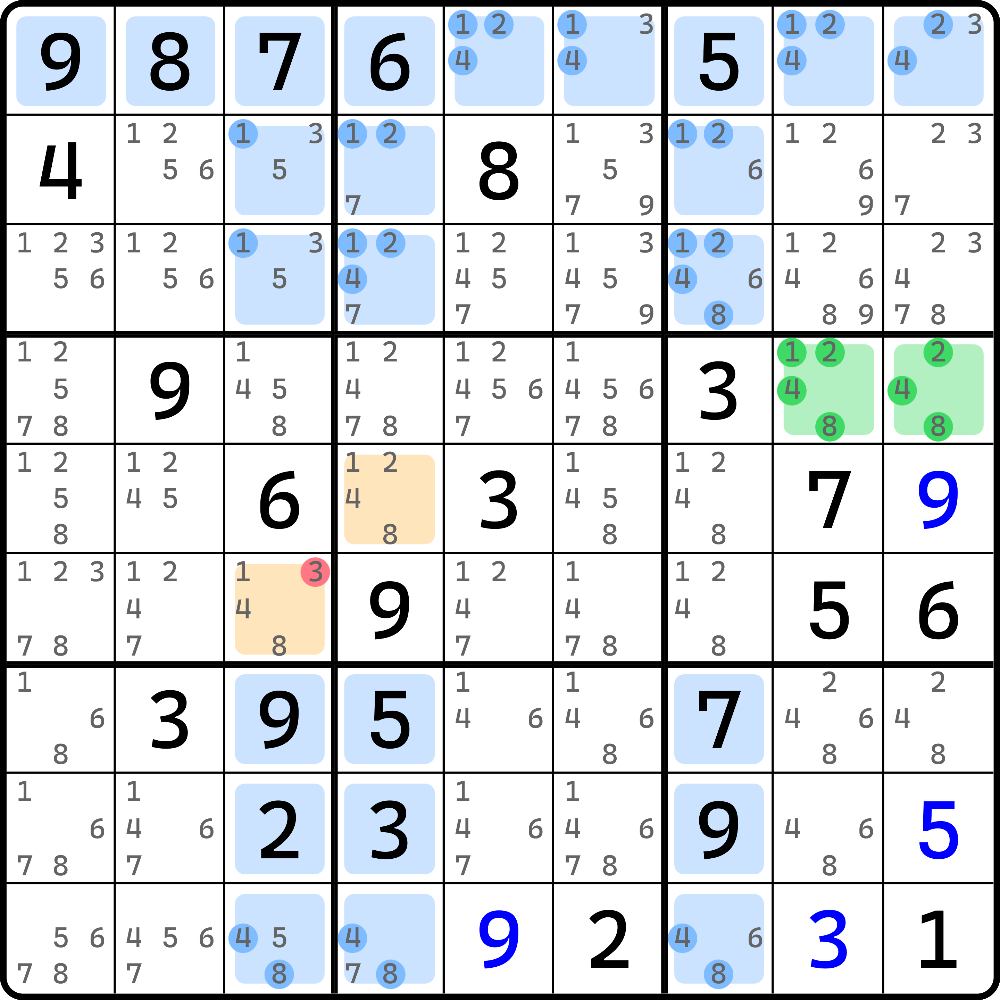
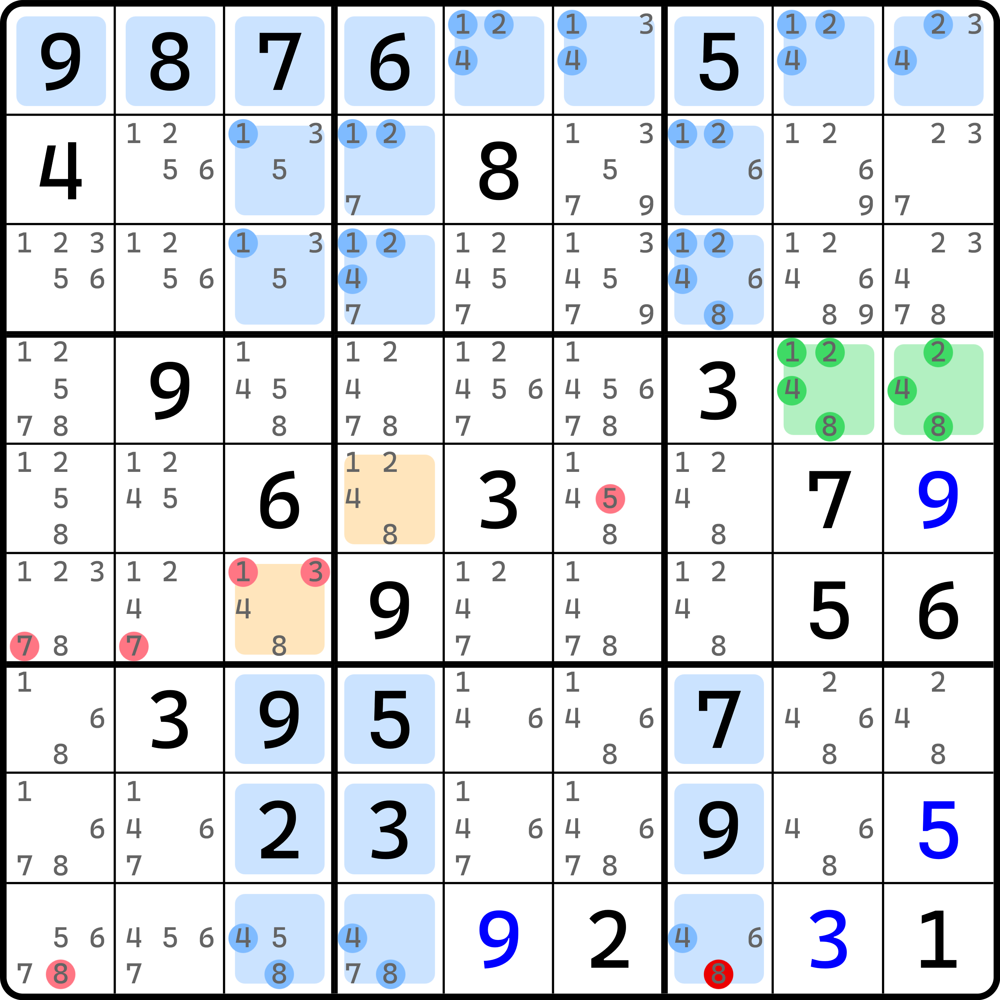

# 交叉飞鱼

今天我们来看**交叉飞鱼**（Mutant Exocet）的内容。

## 交叉初级飞鱼（Mutant Junior Exocet） 

### 基本推理 

<figure><figcaption>
交叉初级飞鱼
</figcaption></figure>

如图所示，这是一个**交叉初级飞鱼**（Mutant Junior Exocet，简称 Mutant JE）。

之前我们有了宫内飞鱼的推理思路，这回我们把交叉单元格选择从行/列 + 宫的组合改为行 + 列的组合。这次我们选择 `r2` 和 `c15` 作为交叉单元格的领域。

我们仔细观察 2、4、9 的分布。这三个数在这个例子里的摆放位置都非常巧合地落在了 `b12` 里。换言之，你只能把所有交叉单元格里出现的候选数 2、4、9 安排在 `b12` 里。所以 2、4、9 显然都只能最多在交叉单元格里填入两次。

有了这一点之后这个题就很好解决了：因为基准单元格里是 2、4、9。我们选取其中两个数填入其中，于是这两个数就会根据排除在 `c15` 延伸出来的余下 2 个位置里填写最少一次。所以，`r7c1` 和 `r9c5` 就必须是这两个选取的数字。因此，`r9c5 <> 156` 是这个题的结论。

### 复数鱼结论 

先别急。这个例子还有其他的删数。

如果我们把这个题改写成秩的样貌，你可以发现他其实是一个由 11 个强区域和 11 个弱区域所构成的、零秩的复数鱼结构。

<figure><figcaption>
11/11 复数鱼
</figcaption></figure>

如图所示。删数是图中标注的这些。这么看来，除了 `r9c5` 以外还有很多额外的删数。

这是怎么被找到的呢？其实也很简单：交叉单元格提示了我们数字的摆放的次数。按照定义规则，2、4、9 出现在 `r2` 和 `c15` 里，所以我们只需要按照这三个区域把 2、4、9 都算入结构，这样我们可以直接得到 9 个强区域，并遗留了 `r78c1` 和 `r89c5` 一共 4 个单元格的 2、4、9 没有被覆盖。

接着，我们还有基准单元格没有纳入。显然，因为我们要讨论的就是这两个单元格的填数。在强制链转秩理论推算秩的相关内容里我们提过，强制链引发分支的那个区域是按强区域来算的，所以 `r8c89` 两个单元格这里我们需要按两个单元格强区域计算，于是整个结构就有 11 个强区域了。

弱区域的话，按照前文的描述，显然 `b12` 里的 2、4、9 都可以纳入，所以这样就会有 6 个弱区域；目标单元格 `r7c1` 和 `r9c5` 按单元格弱区域纳入，这样有 8 个弱区域了。余下还有 `r8` 里的 2、4、9 都没被覆盖到。刚好我们只需要用 `r8` 作为弱区域就可以纳入全部的候选数，所以弱区域数量也是 11 个。

虽然看起来删数很多需要我们仔细推理，但是每一步的逻辑都不难被发现，因此这个结构的删数结论可以快速被我们得到，甚至不需要费多大的力。

## 交叉高级飞鱼（Mutant Senior Exocet） 

下面我们来看高级飞鱼的版本。

<figure><figcaption>
交叉高级飞鱼
</figcaption></figure>

如图所示。这个例子的删数有些诡异，我们先来看最正常的删数。

先是 `r3c2` 和 `r9c6` 作为目标单元格存在。在前一篇内容里我们说到，对于 `r3c2` 这种单元格而言，它可能会影响填入次数。因为它同时属于两个交叉单元格所在的区域里，它的填写会同时满足两个区域的这个数的填数次数，所以填一次就行；但是这不符合我们对这个推理过程的需求（不然就没办法进行下去了）。所以，我们这里强行规避这一点，让它作为目标单元格的其一，这样可以避免讨论它。

接着，基准单元格有候选数 1、6、7，我们就试着看看交叉单元格里 1、6、7 的分布情况。

* 数字 1 可以填的位置有 `r1c6`、`r3c45`、`r45c269` 这些单元格；
* 数字 6 可以填的位置有 `r2c9`、`r3c78`、`r4c29` 这些单元格；
* 数字 7 可以填的位置有 `r12c69`、`r3c458`、`r5c26` 这些单元格。

这很复杂了已经。我们只能慢慢去看。对于数字 1 而言，它整体只出现在 `b2`、`r45` 这三个区域里。换言之，你只需要让这三个区域里每一个区域都填一个 1 就行。这样就是最多可填入的情况，所以就是最多三个 1。那么为什么这么看代表的是“最多”呢？这是因为这个看法是类似秩理论的弱区域，秩理论里弱区域的定义为“最多填入一次”，故三个弱区域等于说是最多填三次。当然，这只是一个形象化的描述。你完全可以不用这个思路去看，你自己去枚举一下 1 的排列也可以。不过这显然就没有那么好枚举了，毕竟摆放的位置千奇百怪的。

数字 6 的话，`b3` 可以算一个，然后 `r4` 可以算一个。没了。所以 6 实际最多就能填俩。这不符合我们认知“四个交叉单元格区域只填最多三次”，所以数字 6 我们放在一旁先不管。

接着是数字 7。数字 7 的话，`b2` 可以算一个，`b3` 也可以算一个，最后是 `r5`。也可以三个弱区域归纳全部的 7，故数字 7 也可以最多填三次。

这样数下来，1、6、7 里就 6 不符合要求。我们无法继续后续的推理，因为 6 的填数会有影响。没关系，我们讨论一下 6 的存在就行了。

假设 6 在基准单元格里存在，那么另外一个单元格只能填 1 和 7 的其中一个数。因为交叉单元格里 1 和 7 是符合最多三次的规则的，所以 `r3c2` 和 `r9c6` 里必须安排至少一个 1 和 7 的填入。但是，`r7c13` 里有 6，但 6 根本就不足以让四个区域 `r3` 和 `c269` 都填有 6，毕竟 6 一共在交叉单元格里就最多才能出现俩。你想想，我还要填 1 或 7 呢，6 都不够放，你就哪怕让 `r3c2` 和 `r9c6` 都填 6 也才刚好满足 6 在这四个区域 `r3` 和 `c269` 全都出现的基础数独规则。这也才刚好，1 和 7 此时都没有目标单元格的填写位置了，全都被 6 给占了，它太霸道了。

所以呢？所以就是 6 一旦存在，我们无论如何都没办法让 1 和 7 放进去。所以，基准单元格根本就不可能有 6。那这个问题就很简单了——基准单元格只有 1 和 7，目标单元格里删除除了 1 和 7 以外的别的数字，这便有了图中除了 `r7c789 <> 6` 外的全部删数。当然了，基准单元格是 1 和 7 的显性数对了之后还有数对的删数，不过这里就不标了，不然标的就太多了，容易影响后续的推理；不过，`r7c789 <> 6` 可以标上，这毕竟不是那么好发现。

`r7c789 <> 6` 的来源很简单：`c6` 一旦确定了 `r9c6` 只能是 1 或 7 后，6 就只能填在 `r7c6` 了，所以，`r7c6 = 6` 是可以得到的结论，故 `r7c789 <> 6`。不过这里我们不建议标注为出数结论，因为只是这个题刚好能出数，其结论本质还是利用了 `c6` 下了 1 和 7 的结论之后才能具备的可填位置削减的推论。

这个结构的 `r3c2` 就是内目标单元格了。刚好它也利用了交叉飞鱼的特性，所以这个结构就称为**交叉高级飞鱼**（Mutant Senior Exocet，简称 Mutant SE），也叫**木忐忑飞鱼**或简称**木忐忑**。

> 另外，这个结构比较复杂。正所谓规则越复杂，也就意味着规则更“一般化”，所以更容易产生一些非常特殊的推理过程延续。比如这个题里删数还包含基准单元格删 6，`r7c789` 也可以删 6 这些特殊结论。它实际上并非飞鱼的基础结论（基础结论就只有俩目标单元格删 1 和 7 以外的数的结论）。但毕竟它比起宫内初级/高级飞鱼都有一定的应用上的提升，所以交叉高级飞鱼在私底下研究得也比较多一些。
>
> 私底下我们也经常把它叫做“木忐忑”。木忐忑这个说法来自于 mutant 这个单词的音译，本身从汉字上看是没有什么实际含义的，但你也可以强行理解为它的推理会有一定程度的延续，所以用的时候要格外小心，因为每一步新的推理都老怕用错，所以心里很“麻木”和“忐忑”。不过要注意，木忐忑虽然是来自于 mutant，但它专门指代的是高级飞鱼版本。初级飞鱼一般不叫木忐忑。

## 一些例子 

### 例子 1：木忐忑 + 隐性待定数组 

<figure><figcaption>
例子 1
</figcaption></figure>

如图所示。这个例子和之前的推理差不多，数字 9 需要单独讨论，因为在交叉单元格里 9 只能最多填两个，但是 3 和 7 都能最多填三个。

假设基准单元格 `r9c78` 有 9，则 9 无法填满使得满足四个区域 `c269` 和 `r4` 这四个区域，不然目标单元格 `r7c1` 和 `r456c9` 都必须有 9 的容身之所。就算你填进去了，3 和 7 的其一在 `r9c78` 里也会有一个，那么此时这个数就无论如何都找不到合理的目标单元格可填了。

要注意的是，这个题 `r456c9` 里有 2 和 4 的隐性待定数组，这意味着 `r456c9` 里有一个是 2 有一个是 4，余下的一个格子才能作为目标单元格存在。这一点和之前有一个例子差不多，不过那个例子用的共轭对，这里继续推广成了一个待定隐性数组。其实说人话就是，2 和 4 在 `c9` 里只能填在 `r456c9` 里，所以 `r456c9` 必须有一个 2 和一个 4。

另外，因为 `r9c1` 在目标单元格只能是 3 和 7 的结论形成之后，它是唯一一个在 `c9` 可以填 9 的数字。所以，`r9c56 <> 9` 也可以删数。因此本题的删数有图上这些。

### 例子 2：木忐忑 + 共轭对 

<figure><figcaption>
例子 2
</figcaption></figure>

如图所示。这个例子也是一样的。就自己看了。

### 例子 3：木忐忑 + 借格 

<figure><figcaption>
例子 3
</figcaption></figure>

如图所示。这个例子是最普通的交叉高级飞鱼，甚至不需要前面那么复杂的讨论，它只能删除了 1、2、8、9 以外的、目标单元格里的候选数。这个题甚至只有一个删数 `r5c3 <> 7`。

不过，要注意的是，这个题的目标单元格选择在 `r5c3` 和 `r8c8`；反倒是 `r9c5` 这个单元格会被算进交叉单元格里。如果不纳入进来的话，按道理它应该会被纳入到目标单元格里，于是目标单元格就会有三处。如果我们不按图上这么选择目标单元格的话，`r5c3` 里的 1、2、9 讨论起来就会非常麻烦。

当然了，你也可以把 `r9c8` 这个单元格纳入交叉单元格，只不过没有意义，因为它不是 1、2、8、9，而且还是个明数，根本不会影响交叉单元格里填入次数的讨论。

### 例子 4：木忐忑 

<figure><figcaption>
例子 4
</figcaption></figure>

如图所示。这也是一个交叉高级飞鱼的最基础的版本，而且还只有三个交叉单元格区域 `c3` 和 `r68`。

### 例子 5：交叉初级飞鱼 

<figure><figcaption>
例子 5（基础删数）
</figcaption></figure>

如图所示。这个例子比较复杂。我们拆开说。

假设基准单元格里是 $$a$$ 和 $$b$$（$$a$$ 和 $$b$$ 是 1、2、4、8 里的其二），那么检查 1、2、4、8 在交叉单元格里的排列。

* 数字 1 能填最多三个，因为弱区域可以选取 `c1`、`b23` 这三个；
* 数字 2 能填最多三个，弱区域可以选取 `b23`，但 `c3` 有 2 的明数，所以 `c3` 自动满足；
* 数字 4 能填最多三个，弱区域可以选取 `b23` 和 `r9`；
* 数字 8 能填最多三个，弱区域可以选取 `c7`、`r9`，而 `r1` 有 8 的明数所以自动满足。

所以所有数字在四个区域 `r1` 和 `c347` 里的交叉单元格上都是最多出现三次。于是，目标单元格必须是 $$a$$ 和 $$b$$ 才能保证这两个数填够，所以 `r6c3 <> 3` 结论成立。

不过，结论远不是这么一点。还记得 T 邻（镜面单元格）吗？在交叉初级飞鱼里它也是适用的——`r6c56` 里必须存在一个格子填的数字和 `r6c3` 相同；`r6c12` 里必须存在一个格子填的数字和 `r5c4` 相同。所以，`r5c6 <> 5` 和 `r6c12 <> 7` 删数也成立。为什么 `r6c12` 也能删呢？因为 `r6c12` 里有一个 3。因为 `r6c3 <> 13` 之后，`r6c12` 里就必须有 3 的存在。这个题里刚好只有 `r6c1` 可以是 3，所以 `r6c1 = 3` 是可以当出数结论成立的。不过讲道理这里应该是看成 `r6c12` 存在 3 的区块（或者说共轭对），然后才有镜面单元格的删数——因为有一个格子是填 3，另外一个格子自然就是填的和 `r5c4` 一样的数，所以无论如何都轮不到填 7。

还有删数吗？有的兄弟，有的。还记得刚才我们讨论填数次数的规则吗？数字 8 最多填三次看起来确实有些奇怪。虽然它确实满足填最多三次，但实际上这个 8 根本就不可能填在 `r8c7` 这个枢纽上——它刚好处于 `c7` 和 `r9` 的交集上。倘若它是 8，那么 8 就填不了最多三次，因为 8 在交叉单元格里的分布位置除了 `r1c2` 的明数外，只有 `c7` 和 `r9` 上才有 8 的位置。你往 `r9c7` 填 8 就意味着 8 的所有别的位置全部会被干掉。于是，8 的落脚点只能在 `r456c34` 这几个位置。这几个位置里要摆两个 8 才能保证 `r1` 和 `c347` 都符合填了 8 的基础数独规则。

但是很明显，要填两个 8 就意味着 `r4c34` 里必有 8，于是 `r4c89` 基准单元格就不能有 8，但这么做带来的问题是 `r5c4` 和 `r6c3` 里又有 8，这便带来的不同步的矛盾（基准单元格和目标单元格的填数要保持一致）。所以，`r9c7 = 8` 是矛盾的。同理，和这个证明思路差不多的还有 `r9c1 <> 8` 和 `r6c3 <> 1`，假设为真也可以这样造成矛盾。

完了吗？还没有，不过其他的删数讨论起来就过于暴力了，这里就不提了。总之，我们能按基础的推断可以得到的删数有上面这些：

<figure><figcaption>
例子 5（不太暴力的全部删数）
</figcaption></figure>

不过，`r6c3 <> 1`、`r9c17 <> 8` 相对来说也都挺麻烦的，需要讨论填入后反得交叉单元格填充次数的矛盾，这个确实有些复杂。不过老外似乎专门给这个讨论思路取了个名字，叫**兼容性测试**（Compatibility Test）。不过老外的这个说法不止是这种矛盾，它还涵盖了之前介绍的 X 致命造成删数矛盾的情况，属于是只要不兼容的填数全都删。这个名称叫什么无所谓，甚至兼容性测试都测试哪些位置，范围也无所谓。我们想讨论的目的是让你将能删的数找全；如果只能通过暴力破解去找矛盾的话，显然这不符合我们教学，对结构分析有效且优雅的初衷，所以我们就不过多讨论了。

至此我们就把交叉飞鱼的内容介绍完了。下一节将带着大家看看飞鱼和多米诺环交织的特殊用法。
