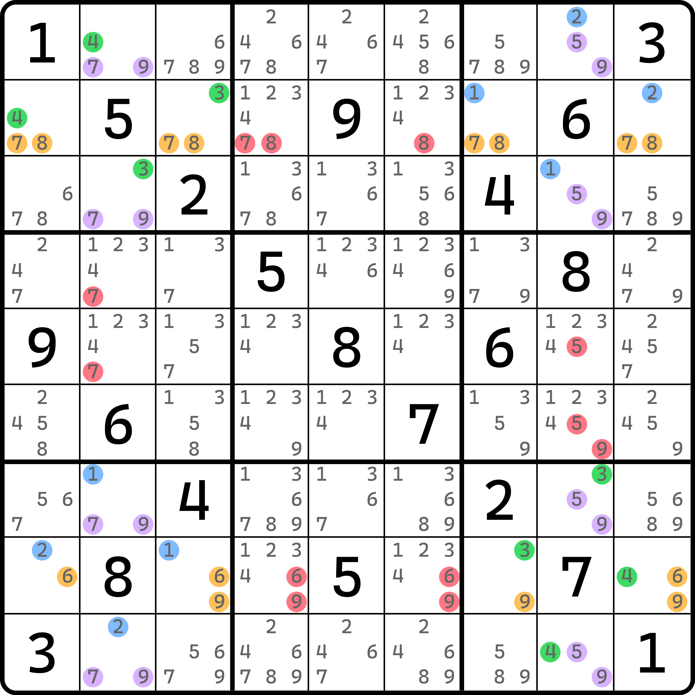
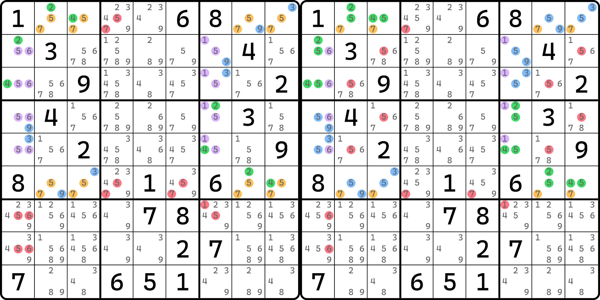

# 多米诺环的直观

为了方便后续的描述，我们先来看一个铺垫内容。

在学习多米诺环的时候，细心的朋友可能已经发现，多米诺环虽然用的格子很多，但因为它毕竟落在四个不同的宫里，所以宫里的提示数的摆放非常的有意思。

<figure><figcaption>
多米诺环
</figcaption></figure>

如图所示。这是一个多米诺环的例子。删数无关紧要，这里我们来看它分布的四个不同的宫有什么特殊性质。

可以看到，`b1` 里的提示数是 1、2、5，`b3` 提示数是 3、4、6，`b7` 的提示数是 3、4、8，而 `b9` 里则是 1、2、7。我们提取出相同的部分：

* `b1` 和 `b9` 里都有 1 和 2；
* `b3` 和 `b7` 里都有 3 和 4。

这样便构成了多米诺环的几点特征：

1. 四个宫里分布为对角线上两个宫（如这里的 `b19` 和 `b37`）里，每个数都恰好出现两次；
2. 同一个宫里必然有 3 个提示数，且一定互相不同行列；
3. 除开这里说的 1、2、3、4，每个宫余下都只有一个提示数，而且这个提示数一定是在多米诺环所形成的 4 个“空矩形”范畴的交叉点上（图中的 `r28c28` 四个单元格）。

这便是多米诺环的直观视角。不过要注意的是，“`b19` 和 `b37` 恰好分别都只有 1 和 2 或 3 和 4”这个特征确实很特殊，但这并不一定是所有多米诺环的特征，因为下面的题可能会安排四个宫里四种数字摆放是“循环态”的，即 $$\{a, b\}, \{b, c\}, \{c, d\}, \{d, a\}$$ 这么个情况。多米诺环仅要求四个数字 $$a$$、$$b$$、$$c$$ 和 $$d$$ 都出现在四个宫里，且恰好都有两个就行。

我们不妨再来看一个题。

<figure><figcaption>
多米诺环，同一个直观视角还对应两个不同的结构
</figcaption></figure>

如图所示。左右两个图里都是同一个题派生出来的两个多米诺环结构，删数有所不同，但他们的“架子”完全一样，即分布于 `b1346` 四个宫里的这 12 个提示数，满足前文描述的那几点特征。

请尤其记住这几点。这几点是一个伏笔，本篇内容的后续内容，甚至于下一篇的内容都可能用到它。
