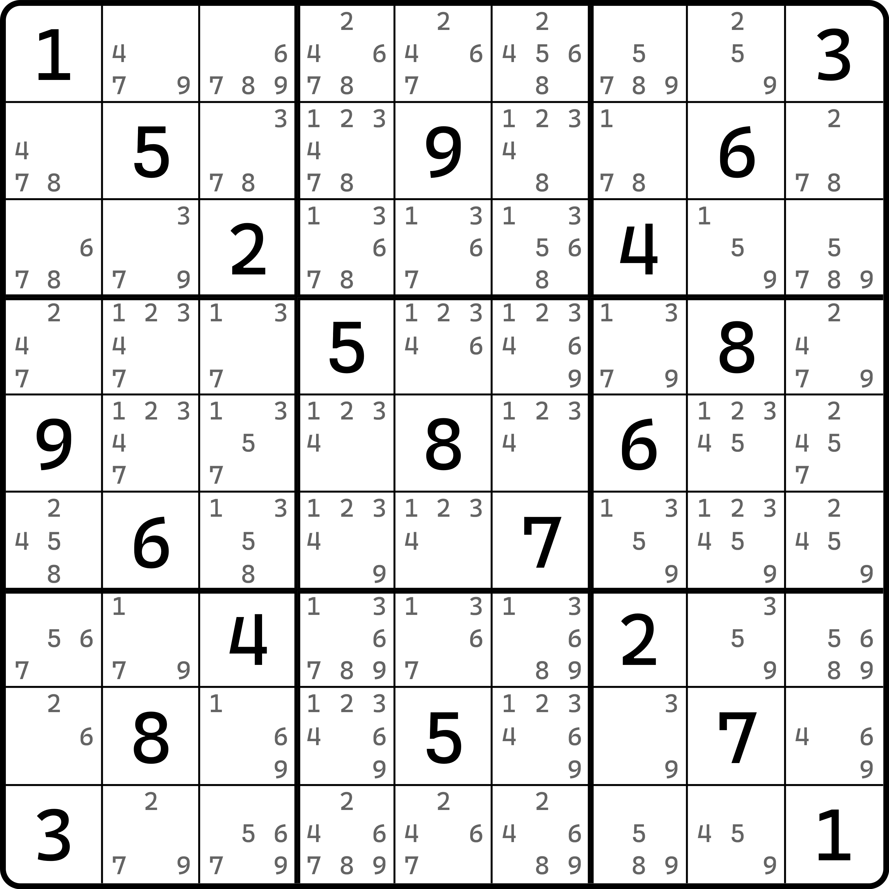
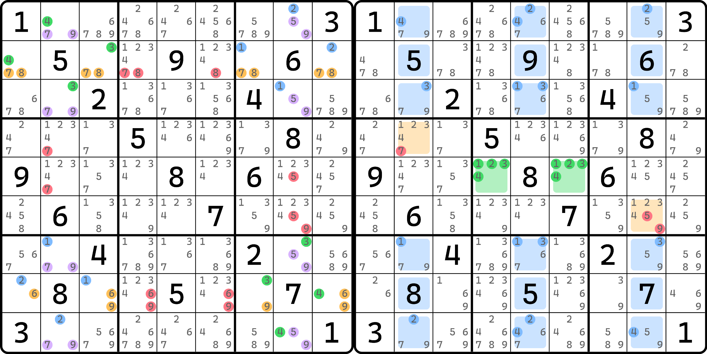
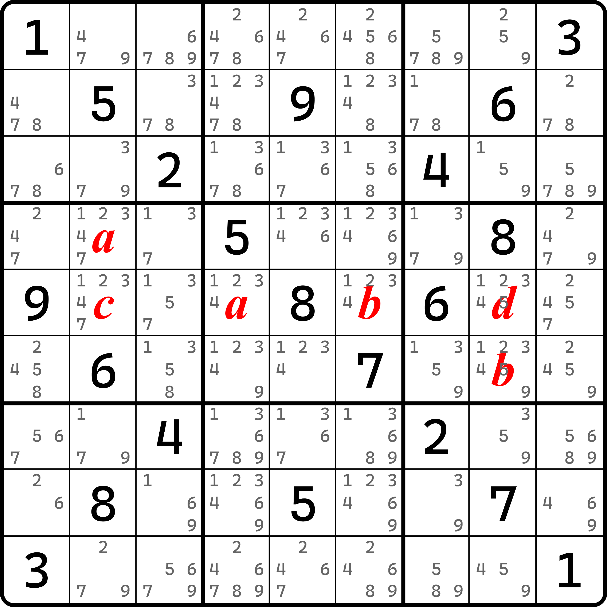
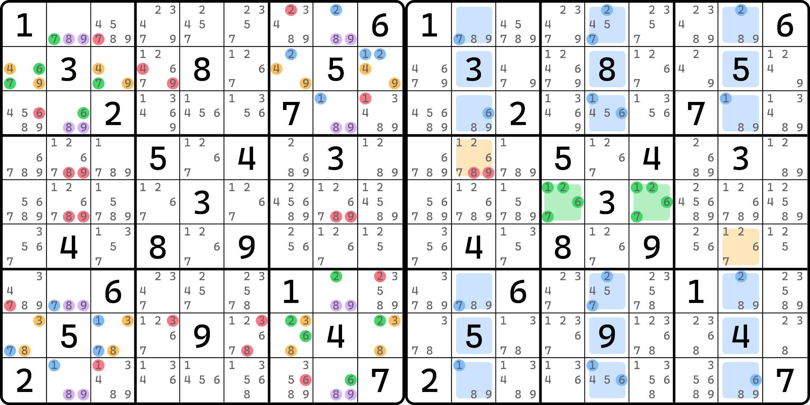
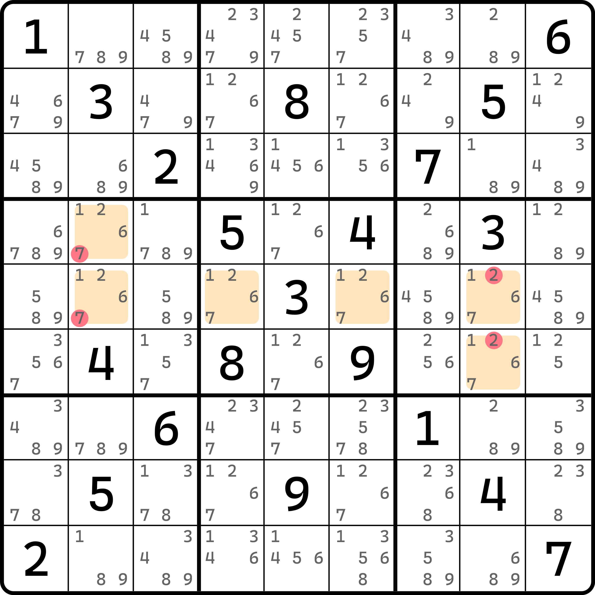

# 模式四数组（PLQ）

我们来看这个题目。

## 模式四数组的基本推理 

<figure><figcaption>
例子（原题）
</figcaption></figure>

如图所示。这个题目的数字摆放看起来就很奇怪。而正是因为这种看起来说不上来的奇怪，才带来了这个题的有趣的点。这个题同时有初级飞鱼和多米诺环两个技巧，他们是共存在这个题里的。

<figure><figcaption>
多米诺环和初级飞鱼（基础删数）
</figcaption></figure>

如图所示，左图是这个题里的多米诺环的位置，右图则是初级飞鱼的位置。

看起来，似乎飞鱼也可以删多米诺环的其中一部分删数，但用的结构的推理过程似乎完全不同。这似乎有点巧合？先不管那么多，我们来看看这个题有什么结论会发生。

因为多米诺环删数更多，我们从多米诺环的删数切入来看看。将图中删数移除后，我们会发现 `r5` 显然有一个显性四数组位于 `r5c2468`。这还算比较容易发现。但是，初级飞鱼的知识点告诉我们，`r4c2` 和 `r6c8` 填的数和中间 `r5c46` 基准单元格里填入的数字一样，所以我们可以巧妙地得到下图这样的情况：

<figure><figcaption>
这 6 个格子的代数结果
</figcaption></figure>

如图所示。我们可以得到，`r4c2`、`r5c28` 和 `r6c8` 四个单元格可以构成跨区四数组。

> 和之前一样，因为我的软件无法按一组单元格标注代数字母，所以图中的 `r4c2` 是 $$a$$ 并不是说它和 `r5c4` 一定填一样的数（同理，`r6c8` 也是）。这里只是想表示一个概念，告诉你 `r4c2` 和 `r6c8` 这一对单元格总体是 $$a$$ 和 $$b$$，它俩和 `r5c46` 这一对单元格是一样的填数，但内部是怎么填的我们并不清楚。

我们把图中 `r4c2`、`r5c28` 和 `r6c8` 这四个单元格构成的跨区四数组称为**模式四数组**（Pattern-Locked Quadruple，简称 PLQ）。很显然，它是一个客观存在的四数组，只要同时有多米诺环和初级飞鱼就行。

我们再来看一个例子。

<figure><figcaption>
模式四数组，另外一个例子
</figcaption></figure>

如图所示。这个题也有一个模式四数组，而且摆放和前面那个题都完全一样。这是故意的，方便初学理解。

相信到这里你还是能看懂的。

## 利用飞鱼基准单元格同步 

我们继续拿前面这个例子来解释这个内容。

<figure><figcaption>
模式四数组的额外删数
</figcaption></figure>

如图所示。这四个候选数是模式四数组可以形成的潜在删数。这看起来是不是一头雾水？实际上，其中两个删数 `r4c2 <> 7` 和 `r6c8 <> 2` 是可以在得到模式四数组和 `r5` 上的四数组之后，直接通过飞鱼删除的，它要借助一下之前学到的飞鱼的锁定成员来得到。不记得了？那请回到[04-locked-member.md](../05-potential-eliminations-of-exocet/04-locked-member.md "mention")的内容里学习一下吧！

不过，就算是这样，其实也只能删两个数。实际上模式四数组是可以删这四个候选数的。那么余下的俩是怎么来的呢？其实也不难得到。我们直接假设 `r5c2 = 7`，不难知道，因为飞鱼的特性，`r5c2 = 7` 会造成基准单元格 `r5c46` 无法填 7，于是目标单元格就必须没有 7。再加上 `r5c2` 排除掉 `r5c8(7)` 的情况，这样 `b6` 就没办法填 7 了，所以就矛盾了；同理，`r5c8 <> 2` 也可以这么得到，看 `b4(2)` 就可以。

这还是比较简单的。
