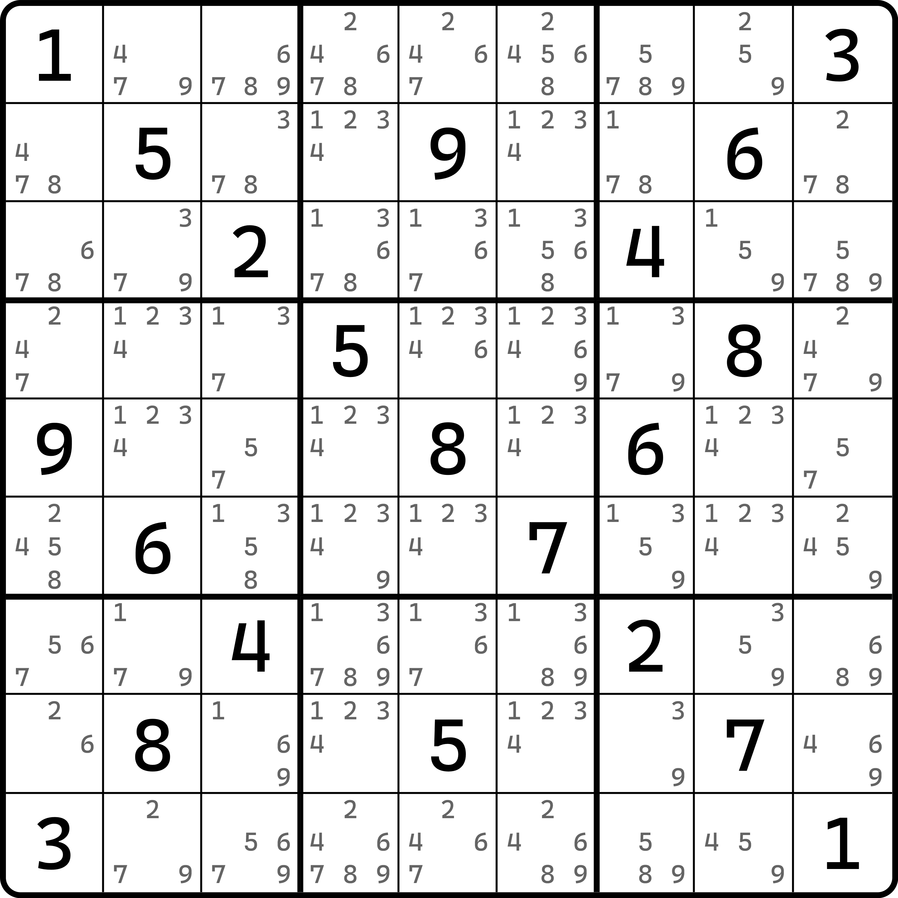
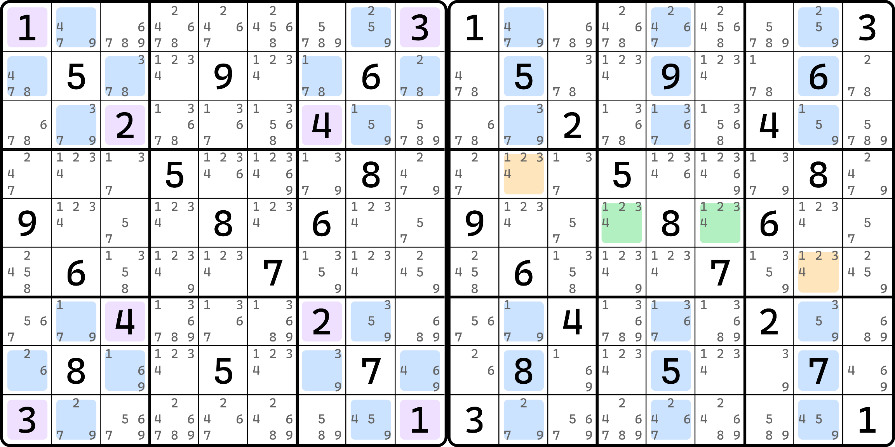
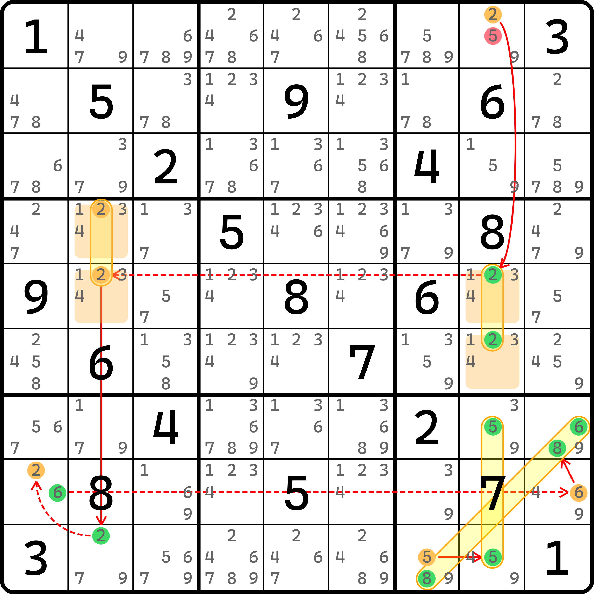

# 共轭四元节点（CQN）

前面的内容还是比较简单的，下面我们继续延续模式四数组的推论看看有没别的结论。

## 共轭四元节点的基本推理 <a href="#reasoning-of-conjugate-quadruple-node" id="reasoning-of-conjugate-quadruple-node"></a>

通过前文我们可以得到的模式四数组，我们不难发现，因为四数组内部的某个数字不能出现两次及以上，所以我们可以强行构造弱链关系把他们串起来，于是我们可以构造一个抽象的链结构出来：

```
节点1(a) = PLQ其中两个格(a) - PLQ另外两个格(a) = 节点2(a)
```

如果头尾的两个节点确实都可以和这里的模式四数组的某个数字 $$a$$ 串起来，那么我们不难得到此链路。同时，链可以被简化为两个节点之间的强链：`节点1(a) = 节点2(a)`。

我们把这四个节点 `节点1(a)`、`PLQ其中两个格(a)`、`PLQ另外两个格(a)` 和 `节点2(a)` 称为一组**共轭四元节点**（Conjugate Quadruple Node，简称 CQN）。

> 这个术语表示的是一组四个节点，所以四个节点整体一个单位，用单数形式。

## 实际用例 <a href="#an-easy-example" id="an-easy-example"></a>

<figure><figcaption><p>共轭四元节点使用例子</p></figcaption></figure>

如图所示。这是一个题目。这个题同时包含一个多米诺环和一个初级飞鱼，但是非常遗憾的是，这个例子这两个技巧都没有正常删数。我们必须要用额外的逻辑才能得到结论。

<figure><figcaption><p>多米诺环和初级飞鱼的位置（示意图）</p></figcaption></figure>

如图所示。这是这个题目的多米诺环和初级飞鱼的所在位置，都没有合适的删数。不过别急，我们还有“后招”。

<figure><figcaption><p>利用共轭四元节点构造链</p></figcaption></figure>

如图所示。我们用一下链。这里我们构造出这样一条不连续环：

```
2r1c8=2r56c8-2r45c2=2r9c2-(2=6)r8c1-6r8c9=68r7c9|r9c7-5r9c7=5r79c8 => r1c8 <> 5
```

其中 `2r1c8=2r56c8-2r45c2=2r9c2` 强弱关系的得到，就是利用的共轭四元节点。后面的 `6r8c9=68r7c9|r9c7` 来自于 `b9` 里数字 6 和 8 的毛刺隐性数对。
