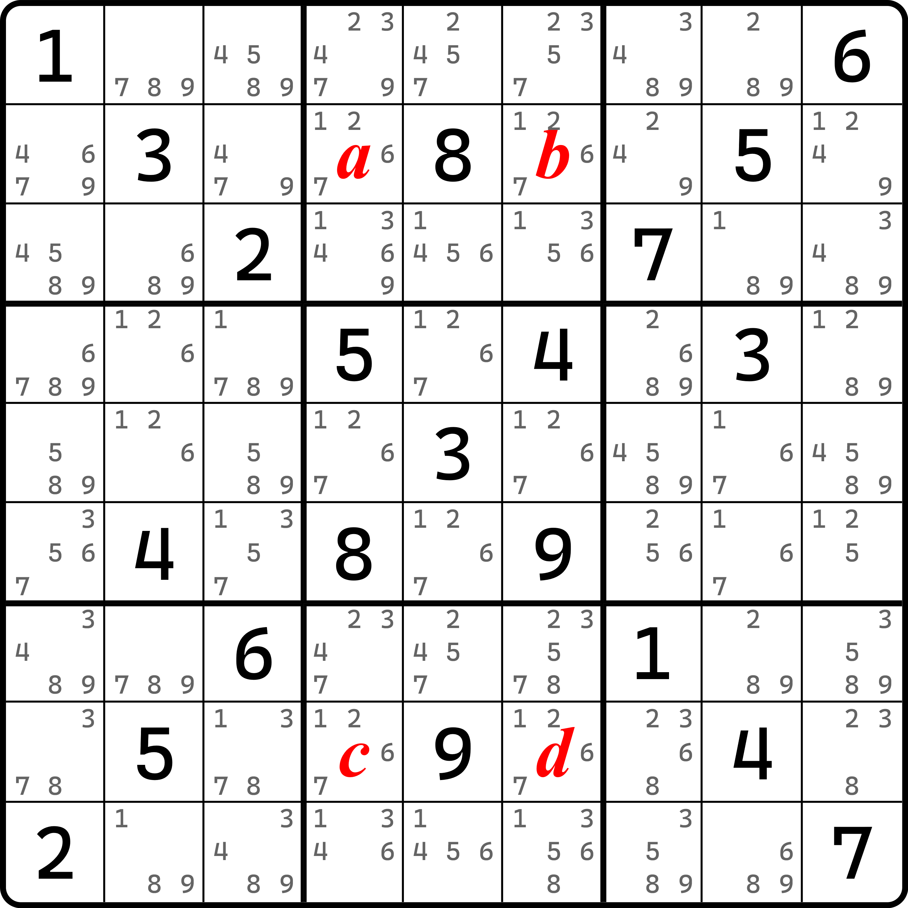
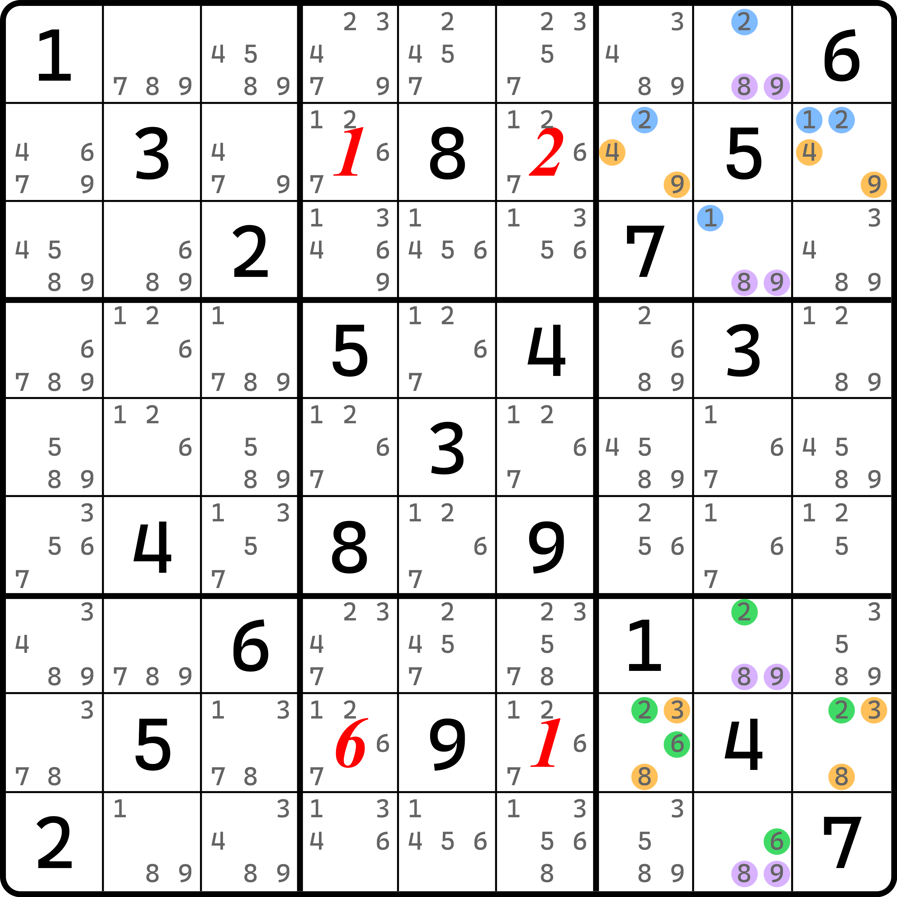
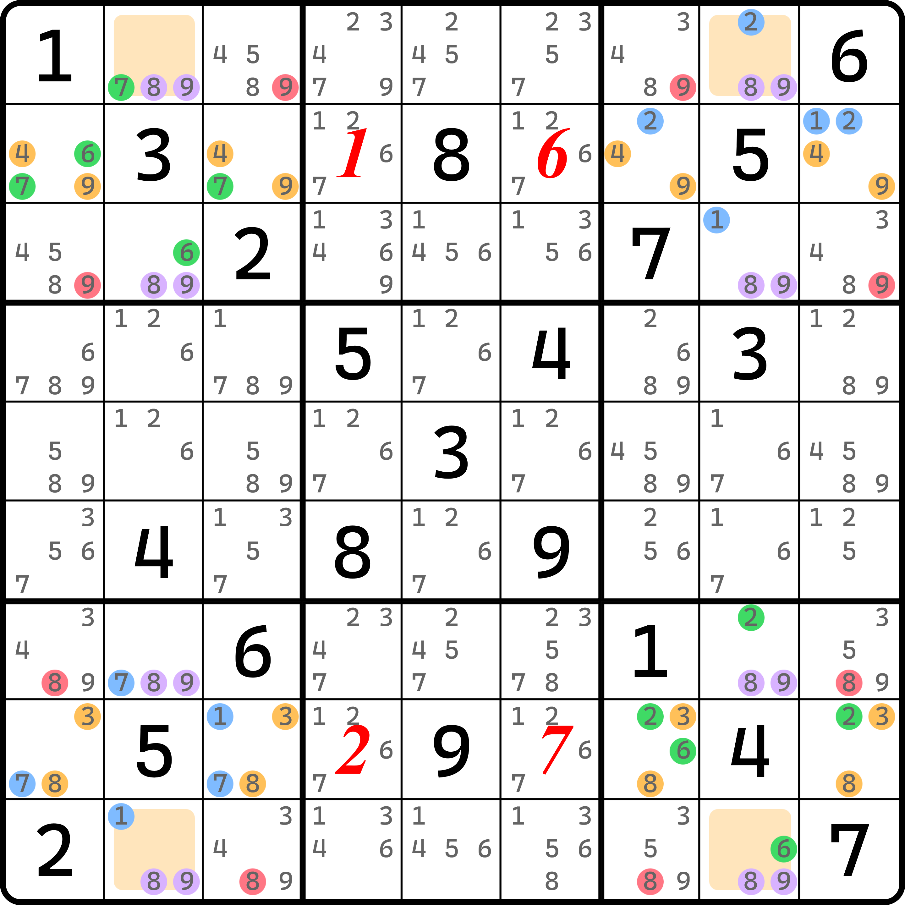
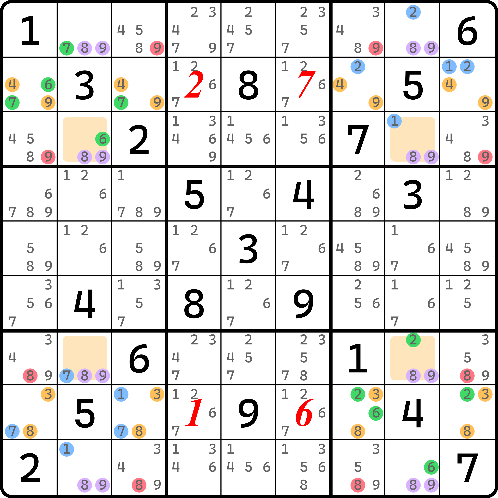
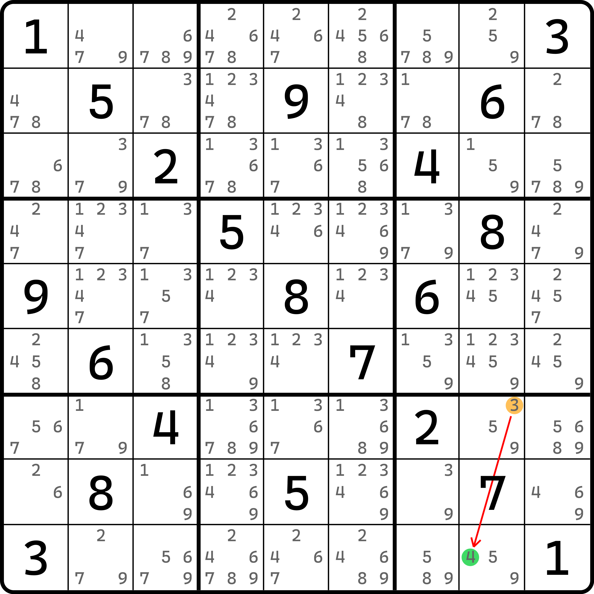
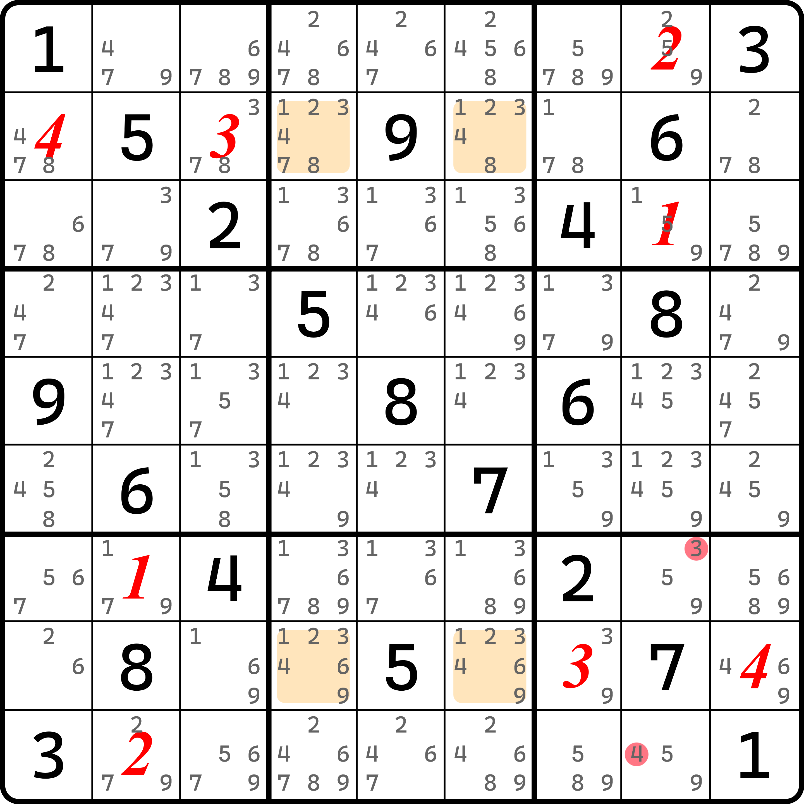
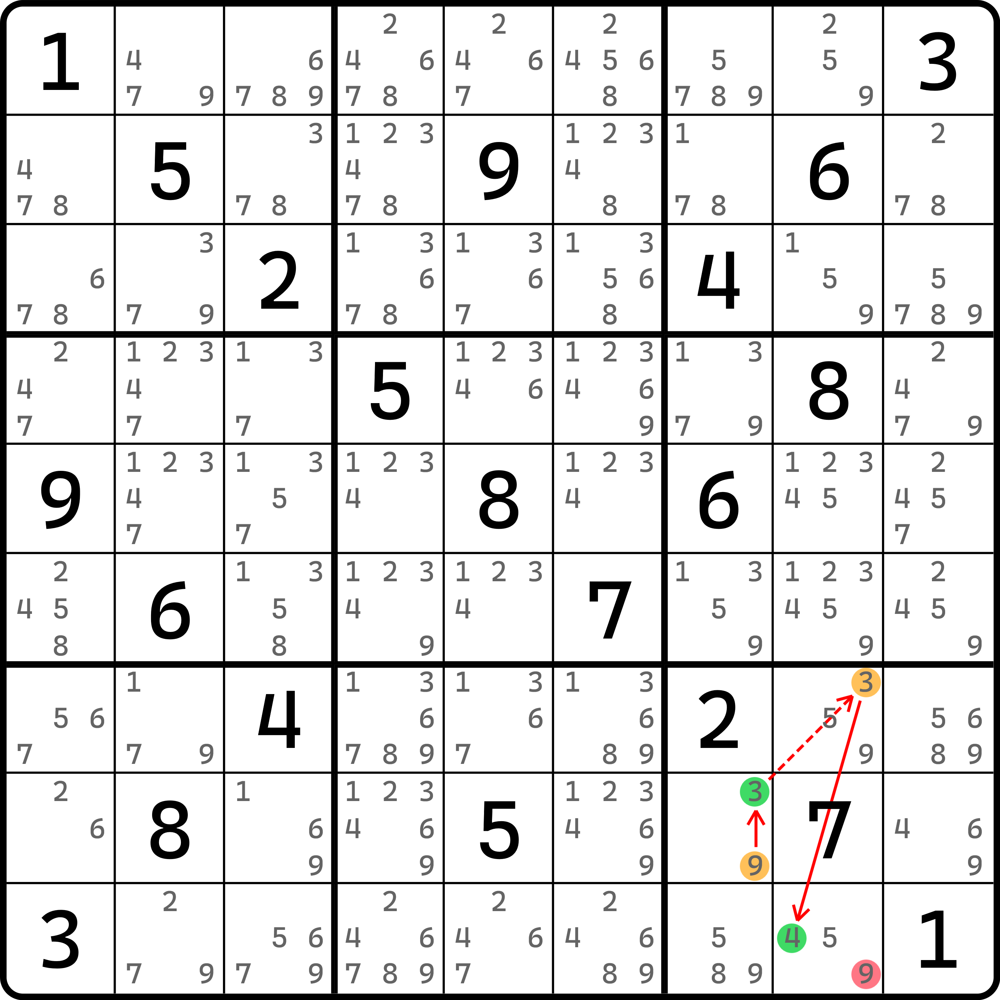

# 单真对（STP）

除了之前我们找出的部分，我们还能得到一个“二号模式四数组”，它位于 `r28c46`。

## 单真对的基本推理 

<figure><figcaption>
“二号模式四数组”
</figcaption></figure>

这四个单元格也是一个跨区四数组。这怎么论证呢？

显然，`r28c46` 四个单元格只可能有三种情况要讨论：

1. 这四个单元格只填了两种不同的数字；
2. 这四个单元格填三种不同的数字；
3. 这四个单元格要填四种不同的数字。

显然第一种是矛盾的，因为四个单元格是唯一矩形的架构，填两种数字意味着直接形成唯一矩形的矛盾。所以第一种直接被我们 pass 掉。那么我们着重讨论第二种情况。

但是很不幸的是，要想证明它，目前没有什么好办法，我们只能使用穷举。结构里的 1、2、6、7 和你实际在 `r2c46` 和 `r8c46` 里填了什么并不能归拢为一样的情况而过滤掉，所以我们不能直接使用代数或别的什么好的办法；好在每一个情况都不难发现矛盾。这里我们讨论一种给各位演示一下怎么得到矛盾的。其他的就自己试试看了，毕竟每个情况都写一遍也挺费劲的。

假设我们让 `r2c46` 填 1 和 2，`r8c46` 填 1 和 6，这样是三种数字 1、2、6 都出现，是一种符合要求的情况。倘若这个情况成立，那么我们会有这样的情况发生：

<figure><figcaption>
其中一种假设情况
</figcaption></figure>

如图所示。这个图里展示了多米诺环的右边这一部分。因为我们就用这一部分就可以得到矛盾。因为 `c8` 里包含除了 `8c8` 和 `9c8` 这两个列弱区域外，还有 1、2、6 三种数字。这对应了我们假设用的数字。

因为我们假设 1、2、6 填入，所以必然我们可以得到 `r1c8 = 2`、`r3c8 = 1` 和 `r9c8 = 6` 的结论。这是显然的，因为这三种数字在 `b39` 里既是强区域也是弱区域。有人问，这不是弱区域吗？别忘了这是多米诺环，是一个特殊的网结构。网是一个零秩结构。之前我们说过，零秩的弱区域里可以用于删数，于是删掉数字之后余下的部分就变为了强区域。

这里我们不能用弱区域，不然这么推不动。这里我们用强区域的话，尤其是 `c8` 的 8 和 9 的弱区域我们必须看成强区域来推理。强区域意味着 8 和 9 只能在 `r1379c8` 里选两个位置填。但是，1、2、6 的排除效果造成了 `c8` 会同时被其中三种不是 8 和 9 的数给用掉，而这整好把 `r1379c8` 的其中三个位置给用掉了。于是，8 和 9 无论如何都放不满，因为只有一个格子了，而 8 和 9 都是“嗷嗷待哺”准备填进去的状态，这便形成了矛盾。

说起来很长，但是实际上就是简单利用了多米诺环零秩的特征来得到矛盾。其他的情况也都如此，这里就不展示了。我们挨个论证了之后，这四个单元格是无法只填三种数的。

可以看到这个证明思路似乎对其他组合都有效，看起来可以归纳一下，但从教学的角度来说，过于复杂的数学知识实在是不便于描述，总不能用群论吧。所以这里就用了一个稳妥的枚举的思路。

总之，我们最终可以通过枚举得到第二种情况（只填三种数）也不合理。所以，这四个格子只能填四种不同的数字。

我们把图中这四个单元格 `r28c46` 称为**单真对**（Single Truth Pair，简称 STP），即前文说的“二号模式四数组”。

## 单真对的潜在删数 

很明显的是，四个单元格填四种不同的数字，那必然就得开始排列 1、2、6、7 的情况了。不过比较幸运的是，很多情况其实在讨论情况 2 枚举证明矛盾期间就已经提及过了。比如说这里的 1、2、6 共同使得 `c8` 产生矛盾的特征，这在 `r28c46` 里选取 1、2 在上方 `r2c46`，`r8c46` 填 6 和 7 的这种情况里其实也适用，就不必重复讨论了。注意讨论的时候，`r2c46` 和 `r8c46` 都要讨论一下，因为选取的数对不一样，走向会不同，要算两个情况。

那么把这些情况都排列起来，我们最终会发现一个神奇的现象。因为四个单元格被我们人为分成了 `r2c46` 和 `r8c46` 两组，而两个单元格可以选择的数字配对一共有 $$C_4^2 = 6$$ 种情况：

* 1 和 2；
* 1 和 6；
* 1 和 7；
* 2 和 6；
* 2 和 7；
* 6 和 7。

但是，其中多数情况已经被我们讨论过了。因为 `r2c46` 要从中选取一对，而 `r8c46` 里也要选一对讨论，所以就是找出这里面用过的两对数字的全部组合，然后去掉，于是我们就只剩下三种要讨论的情况了：

* 1 和 2 + 6 和 7；
* 1 和 6 + 2 和 7；
* 1 和 7 + 2 和 6。

只有这三种情况我们暂时没有讨论了。但是，1 和 2 + 6 和 7 这一对里，1、2、6 因为同时出现，所以 `c8` 会造成矛盾；1 和 7 + 2 和 6 的情况也是在 `c2` 或 `c8` 里造成矛盾（前文省略了没有讨论过，但是你可以自己讨论一下）。所以，唯一一种组合才是合理的：1 和 6 + 2 和 7 这种选取方式。

那么，要讨论的有两个情况：

* 1 和 6 放在 `r2c46` 里，2 和 7 放 `r8c46` 里；
* 1 和 6 放在 `r8c46` 里，2 和 7 放 `r2c46` 里。

对于情况 1 而言，我们有这样的图：

<figure><figcaption>
情况 1（1 和 6 在上面）
</figcaption></figure>

如图所示。我们有图中这 8 个位置可以用来删数。先是 `r1c37 <> 9` 和 `r9c37 <> 8` 可以直接得到——因为假设的数字，所以 1、2、6、7 传递到 `b1379` 里之后会分别填在 `r3c8 = 1`、`r7c8 = 2`、`r3c2 = 6` 和 `r7c2 = 7` 这四个位置。于是，`89c28` 四个弱区域就形成了一个类似二阶鱼一样的情况，而且还是用了同样格子的两个不同数字的二阶鱼。所以，`r19` 都会形成关于 8 和 9 的数对，所以位于 `r19c37` 的这四个数可以删（但是要注意，8 我没有删，因为最终结论里另外一种情况下是删不了的，只能删 9）；同时，`r3c19 <> 9` 和 `r7c19 <> 8` 这四个候选数也可以删。不过稍微要讨论一下。

刚才我们说，`r19c28` 是构成了二阶鱼的，所以 8 和 9 的分布只有可能是两种：

* `r1c2 = 8` 和 `r9c8 = 8`（余下俩填 9）；
* `r1c2 = 9` 和 `r9c8 = 9`（余下俩填 8）。

对于第二种很好说，因为是 9 了之后直接就和删数同宫了，所以直接可删；但是第一种的话会麻烦一些。比如说这种情况下我们可以有 `r1c2 = 8` 和 `r1c8 = 9`，然后我们可以快速知道 `b3` 里 `r2c79 <> 9`。但是因为多米诺环的特性，`49r2` 两个弱区域可以因为零秩的缘故转为强区域。于是 9 只能落入到 `r2c13` 之中。这样还是可以和 `r3c1(9)` 同宫造成删数；而 `r3c9 <> 9`、`r7c1 <> 8` 和 `r7c9 <> 8` 的结论也是完全一样的得到方式。

所以，对于 1 和 6 填在 `r2c46` 的所有情况讨论完了之后我们可以得到图上这 8 个位置的删数。那么，情况 2 呢？

<figure><figcaption>
情况 2（1 和 6 在下面）
</figcaption></figure>

如图所示。这个情况这 8 个数仍然可删。不过过程就不讨论了，完全是一样的。

总之，我们讨论了唯一一种可以成立的四元组 1、2、6、7 放入 `r28c46` 的情况，发现这 8 个多出来的数也可以删除。

## 强链关系构造 

另外，单真对的逻辑还可以用于构造强链关系。因为我们已经知晓图中四个特殊位置必须是一个跨区四数组，所以它明显不能放置任意相同的数字。

<figure><figcaption>
可以构造的一个例子
</figcaption></figure>

如图所示。这是一个示例。这个例子构造了 `3r7c8=4r9c8` 的强链关系。

这是怎么来的呢？我们不妨试试看。假设它俩同假，我们可以得到 `r79c8` 形成的显性数对，于是，删除 `c8` 和 `r8` 的其余 5 和 9，于是跟着多米诺环绕一圈，我们将会有如下的填数情况出现：

<figure><figcaption>
绕一圈之后的情况
</figcaption></figure>

于是你就会发现，单真对的四处单元格 `r28c46` 无法填四种完全不同的数字了——实际上只能填 1 和 2，直接形成了唯一矩形的矛盾情况。

所以，原始假设的两处节点不能同假。

于是，我们可以构造出一条双强链：

<figure><figcaption>
构造链
</figcaption></figure>

如图所示。这样我们就可以构造出一条不连续环进行删数。
