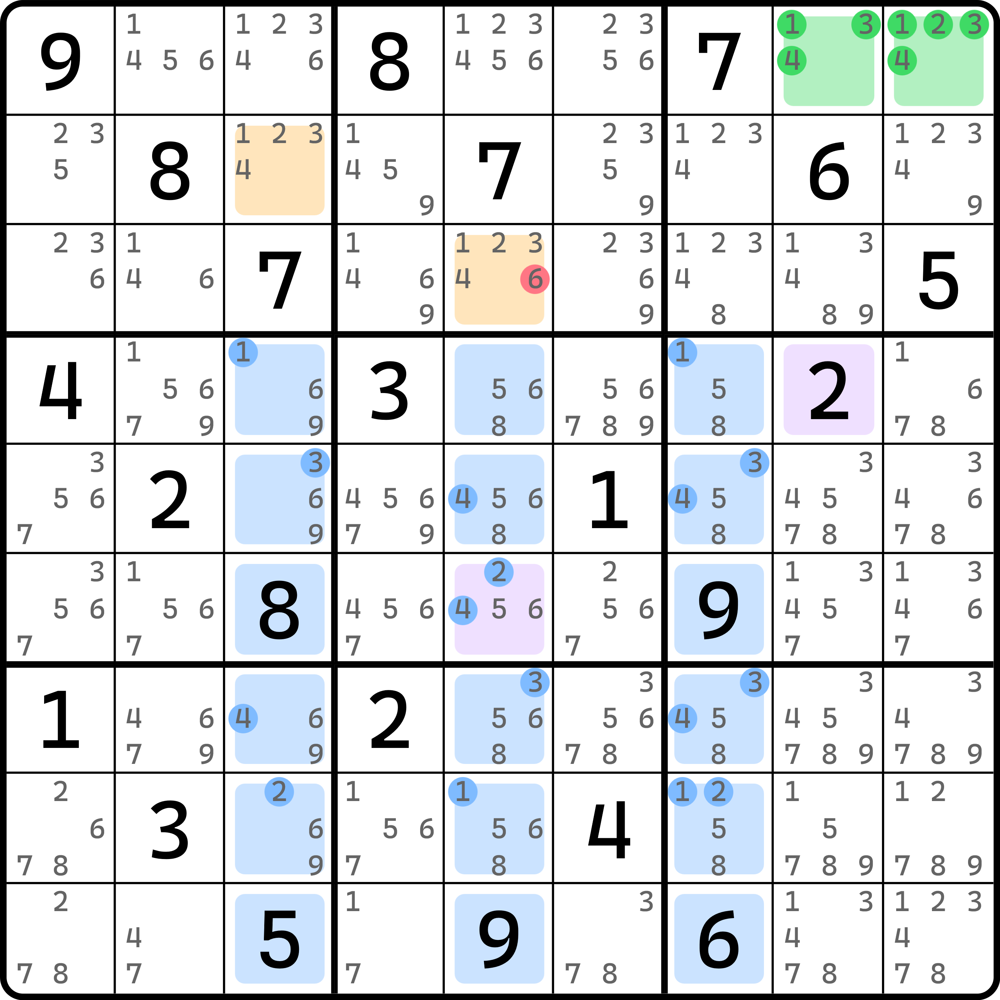
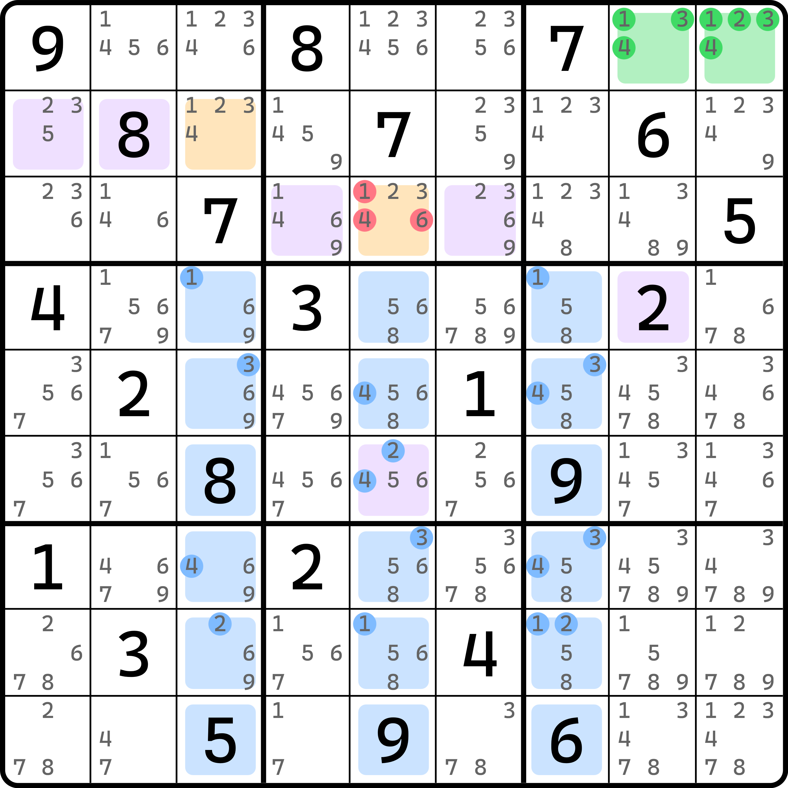
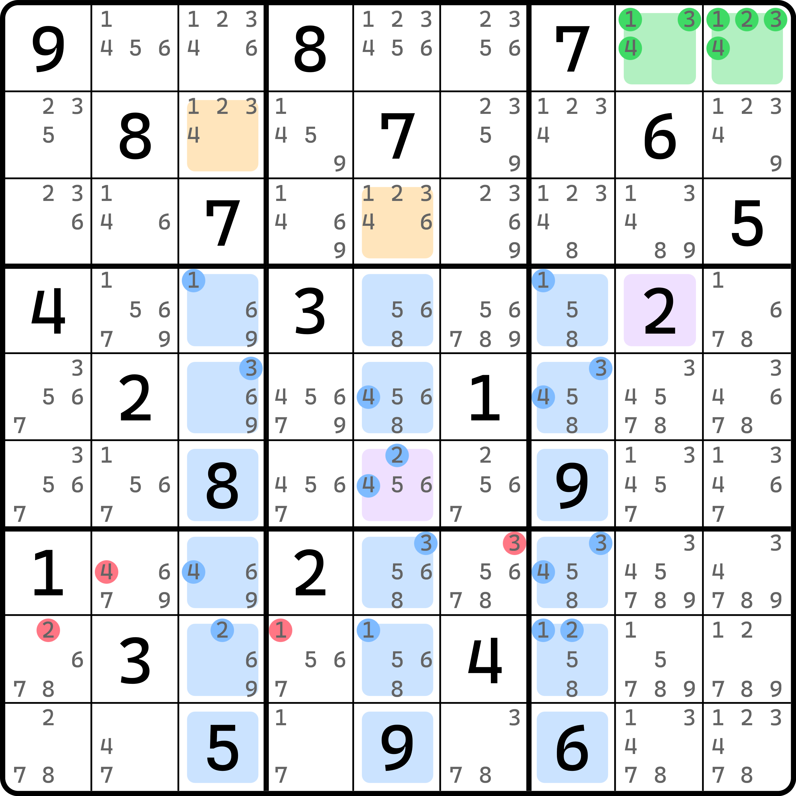
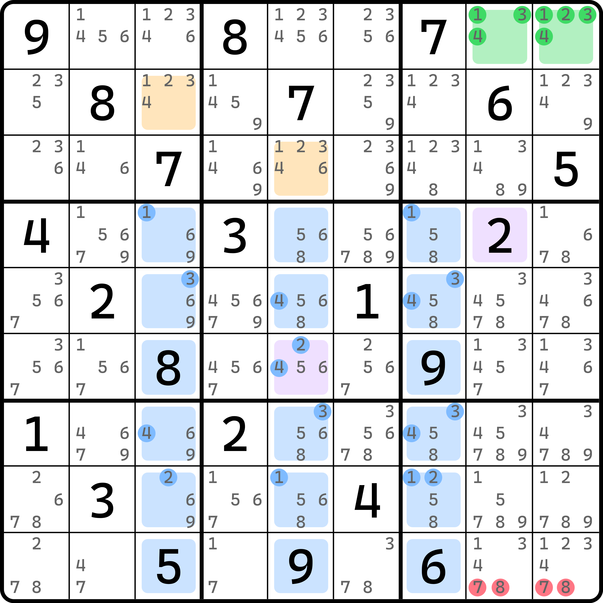
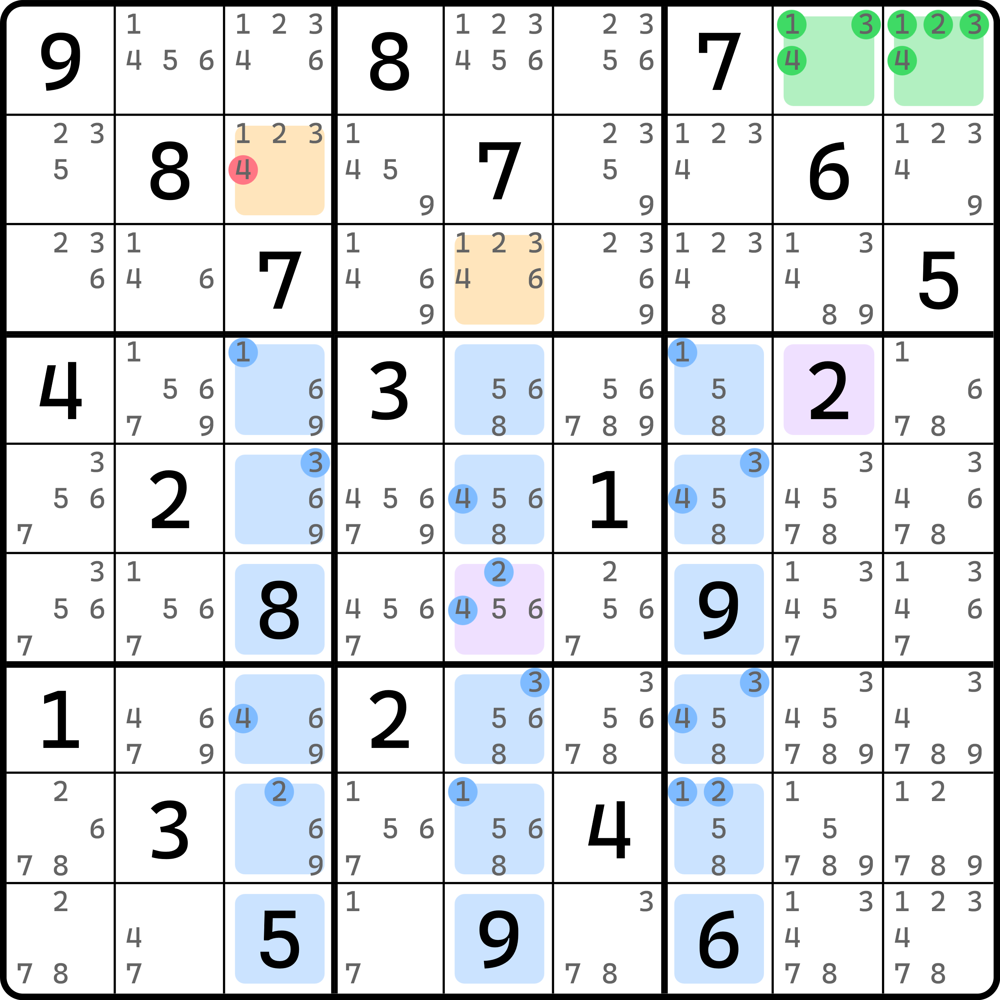

# 初见衰弱飞鱼

虽然我很不想说，但这确实是一个极为复杂的技巧推演。本文考虑篇幅的内容，所以这次我们使用倒叙，先说结构的形成条件和结论。

## 一个奇怪的例子 

<figure><figcaption>
一个奇怪的飞鱼
</figcaption></figure>

如图所示。这是一个奇怪的飞鱼结构。可以看到，基准单元格、目标单元格似乎都差不多，但是很明显，位于 `r6c5` 这个单元格是会影响推理的。如果说这个单元格是一个不含 1、2、3、4 的空格，或是一个非 1、2、3、4 的明数单元格，这个例子就算是一个标准的飞鱼结构；但是此时由于 `r6c5` 的存在，我们不能进行任何飞鱼的推导过程，因为我们无法继续。

不过，这个题我要告诉大家的是，它可以删数，只需要满足如下的一些复杂的条件就可以按普通的飞鱼来删：

1. **此种飞鱼必须是由一个标准的初级飞鱼改造得到的**，这意味着它的交叉单元格必须全部是行或全部是列（如图中是三个列 `c357`）；
2. **交叉单元格必须只能包含 3 个行或列**（如图中指的是 `r456789c357` 这 18 个单元格）；
3. **交叉单元格里，位于不和基准单元格同在一个大行列（Chute）的余下 12 个单元格里（图中 `c35` 里的这 12 个单元格，因为 `c7` 和基准单元格保持同在一个大列（Tower 或 Mega-Column）里；当然结构如果是横向的，可能就是大行（Band 或 Mega-Row）里了），必须存在一个单元格包含基准单元格所用到的数字，且作为空格或以明数单元格形式存在**（如图中指的是 `r6c5` 这个单元格，它位于 `c5` 里，而基准单元格 `r1c89` 同在一个大行列的交叉单元格是 `c7` 上这几个，而 `r6c5` 不在这些格子里）；
4. **位于不和基准单元格同在一个大行列的余下 12 个单元格，所跨越的 4 个宫里，除开这 12 个单元格外，还必须包含 8 个单元格是明数，且其数字必须是基准单元格所使用的数字**（图中指的是 `r4c14`、`r5c26`、`r7c14` 和 `r8c26` 这 8 个单元格）；
5. **在第 4 点提及的这 8 个单元格里，保持和交叉单元格延伸方向垂直的大行列类型上的其中 4 个单元格，一定不能和第 3 点提及的特殊单元格处于同一个行列上、同一个和交叉单元格的延伸方向垂直的行列类型上**（如交叉单元格本题是三个列，所以垂直的则是行；这说的是，保持和 `r6c5` 同处于一个大行上的 `b45` 里的这 4 个单元格 `r4c14` 和 `r5c26`，他们不能和 `r6c5` 在同一个行或同一个列里）；
6. **在第 4 点提及的这 8 个单元格里，必须每个宫都恰好包含两个单元格，且盘面分布处于对角线上的两个宫里的填数是一对相同的数字，另外一组呈对角线分布的两宫里的填数是另外一对相同的数字**（如图中指的是 `b48` 里都是 2 和 4，`b57` 里都是 1 和 3）；
7. **基准单元格不能和第 4 点提及的这 8 个单元格同处于同一个大行列上**（如图中指的是 `b4578` 四个宫，他们的大行列必须不含有 `r1c89` 这两个基准单元格，就是说你不能把基准单元格调到或找在和 `b4578` 同在一个大行列上的格子里去）；
8. **和第 3 点描述的那个特殊单元格、并且和交叉单元格延伸方向垂直的大行列上，且和基准单元格所在大行列相同的这 3 个交叉单元格，它们仨所在的宫里，且必须处于和第 5 点里提及的那个“不和那个特殊单元格同在一个行列上”规则相同的余下 4 个单元格里，必须存在一个单元格是明数单元格，且它必须是基准单元格里用到的数字之一**（如图中指的是 `r4c8`，它位于 `b6` 里，它和基准单元格 `r1c89` 在一个大行列里，且可满足和 `r6c5` 这个单元格同在一个大行上，且不在 `r6` 上，且确实在最后剩下的 `r45c89` 单元格里取的一个合理位置）。

如果这些条件它都满足（是的，都需要满足），那么这个飞鱼我们称为**衰弱飞鱼**（Weak Exocet）或**半衰弱飞鱼**。另外，我们把第 8 点里所提到的、和 `r4c8` 这样起到类似作用的单元格称为**强心针单元格**（Stabilizer），而 `r6c5` 称为该衰弱飞鱼结构的**伤口**（Wound）。

> “大行列”这个概念其实早期就有所使用，但因为用的地方非常少，所以就不曾提起。这里确实找不到合适的表达可以简化说辞，所以才第一次正式被用起来。
>
> 大行列指的是并排的横向或纵向的三个宫所组合起来的所有 27 个单元格。其中横着的三个并排的宫称为大行，竖着并排的称为大列。一个数独盘面有 6 个大行列，其中包含 3 个大行和 3 个大列。在 RCB 坐标体系里被记作 `MR1` 到 `MR3`（或使用小写字母），以及 `MC1` 到 `MC3`（或小写字母）。
>
> 另外，强心针单元格这个说法灵感也来自于探长。其本人想表达的含义是，因为 `r6c5` 的存在，所以结构本身无法使用飞鱼；但 `r4c8` 的存在救活了结构，使得结构可以发挥它真正的作用，所以好比是“用强心针救了飞鱼”。

## 衰弱飞鱼可以得到的结论 

因为我们并未展开描述其推理过程，只是给了粗略的形成条件和删数，所以我们需要一一列举一下它可以得到的所有删数位置。

### 结论 1：目标单元格基础删数 

这一点和初级飞鱼完全一样。衰弱飞鱼一旦形成后，它和初级飞鱼里“目标单元格必须和基准单元格填数一致”的结论是一样的。本题删数只有一个：`r3c5 <> 6`。

<figure><figcaption>
衰弱飞鱼结论 1
</figcaption></figure>

### 结论 2：镜面单元格同步删数 

第二部分删数是来自于镜面单元格同步，也就是所谓 T 邻的规则。图中对应的是 `r3c5 <> 146` 这些删数。因为镜面单元格 `r2c12` 这两个里有一个是明数，另外一个只有 2 和 3，它一定是另外一边的目标单元格里的填数，所以 `r3c5` 只能填 2 或 3，删掉余下的数字。

<figure><figcaption>
衰弱飞鱼结论 2
</figcaption></figure>

### 结论 3：多米诺环修正删数 

第三部分的删数来自于伤口。伤口 `r6c5` 和强心针单元格 `r4c8` 同处于一个大行 `mr2` 上，另外伤口所在的大列是 `mc2`。我们按交叉单元格所分布的这几个宫作基础，刚才的这大行和大列会构成“L”字母形状的连线。其中连线的短边能够到 `b8`。这部分的删数就来自于 `b8`，和保持和伤口和强心针单元格连线方向平行的大行 `mr3` 上的 `b7` 这个宫。

仍然保持和看伤口排除一个行列一样的思路，这次我们把 `b78` 里含 1、2、3、4 的这两行提出来，即 `r78c1246` 这 8 个单元格。这 8 个单元格里，`b8` 是“L”形状直连的短边，它删除的是 1 和 3（和它里包含的明数 2 和 4 不同的另外一对数字 1 和 3），而 `b7` 里是 1 和 3，则 `b7` 里的 `r78c12` 删的是 2 和 4。

<figure><figcaption>
衰弱飞鱼结论 3
</figcaption></figure>

### 结论 4：矩形填充模式删数 

第四部分删数来自于 `b9`。这个宫其实就是刚才结论 3 里，同在一个大行上，又和基准单元格同在一个大行列上的这一部分。这一部分里，由于刚才 `r78c1246` 处于 `r78` 上，所以对于 `b9` 而言，排除掉 `r78c89` 四个格，然后去掉交叉单元格 `r789c7` 三个格，就只剩下 `r9c89` 了。

对于 `r9c89` 里有删数。它删的是非 1、2、3、4 以外的全部候选数。

<figure><figcaption>
衰弱飞鱼结论 4
</figcaption></figure>

### 结论 5：毛刺 X 致命删数 

第五部分删数来自于 `r2c3` 这个和伤口不在同一个列上的目标单元格。

和强心针单元格同处于一组的 1、2、3、4 的这一对两个数字 2 和 4 里，删除 `r2c3` 里的、不是强心针单元格填数 2 的另外一个数字 4。也就是 `r2c3 <> 4` 这个结论。

<figure><figcaption>
衰弱飞鱼结论 5
</figcaption></figure>

至此，我们就把所有的结论全部介绍完毕了。下一节我们再带着大家证明一下图里的删数由来。
