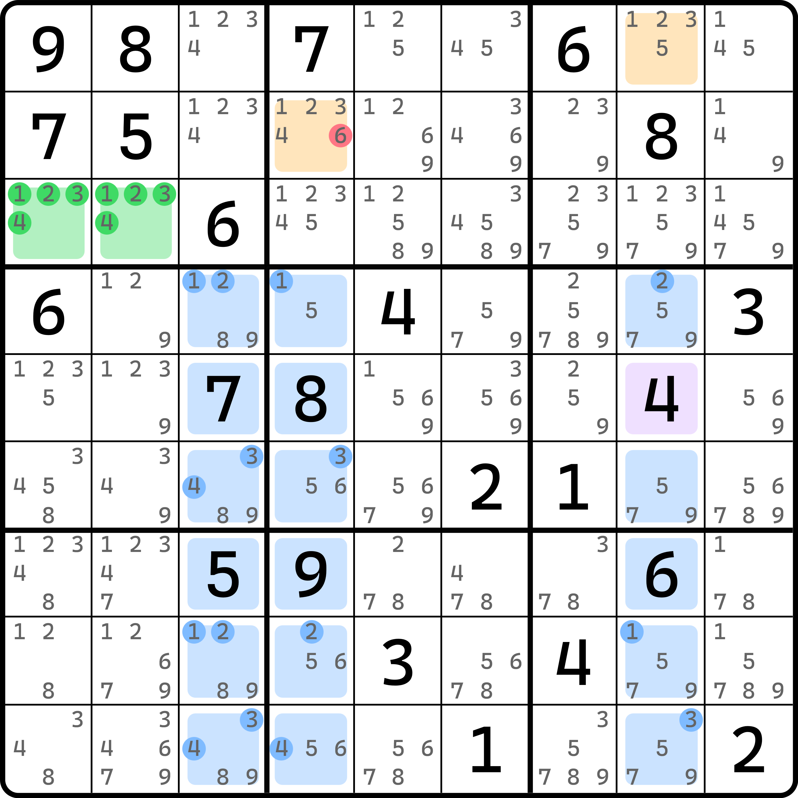
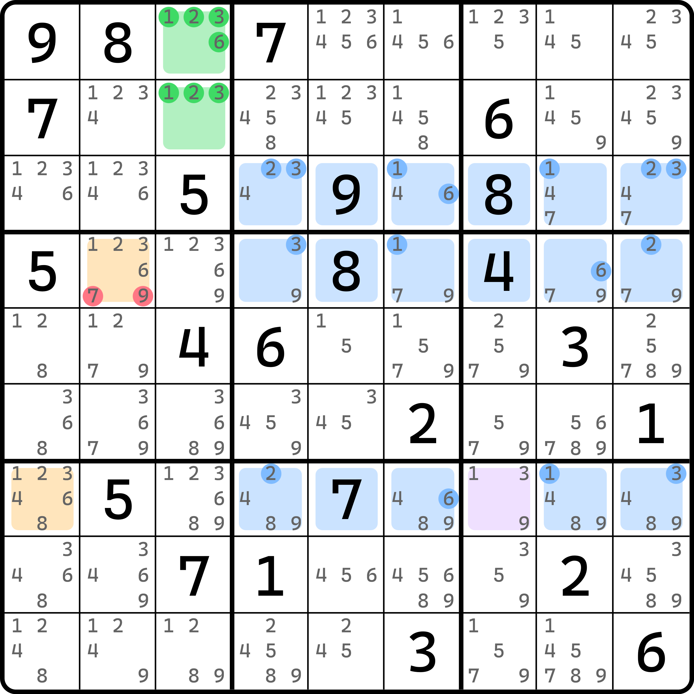
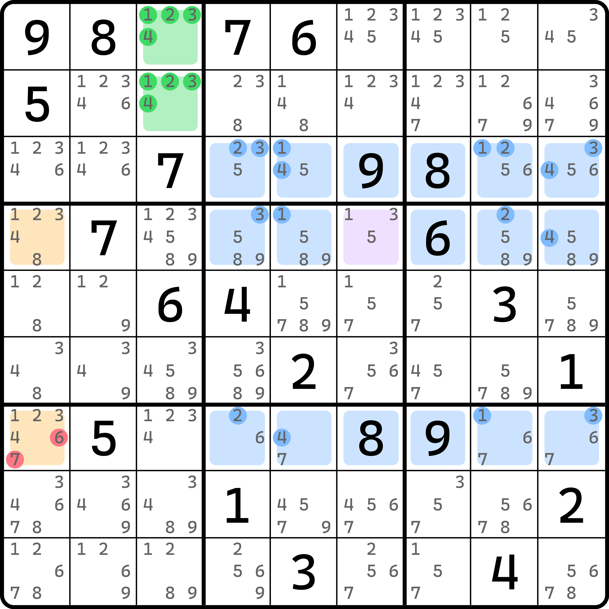
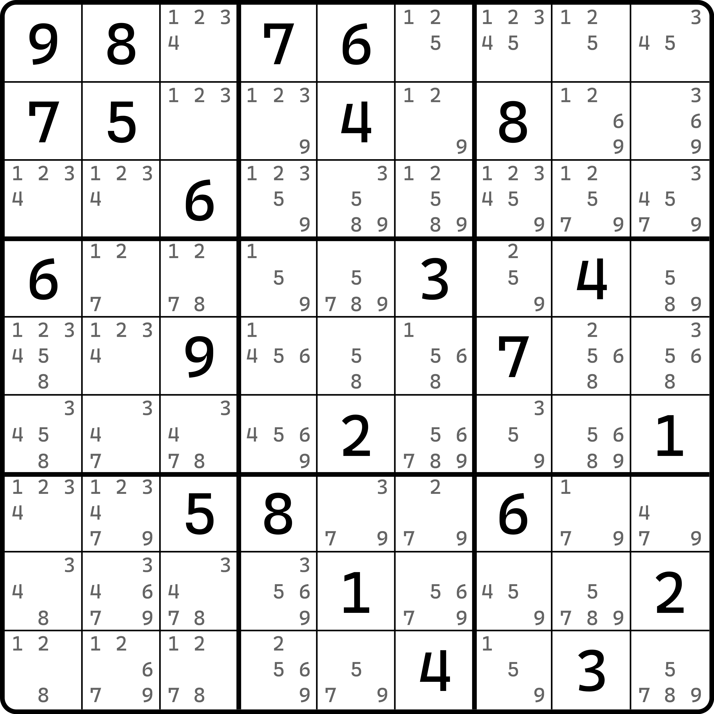
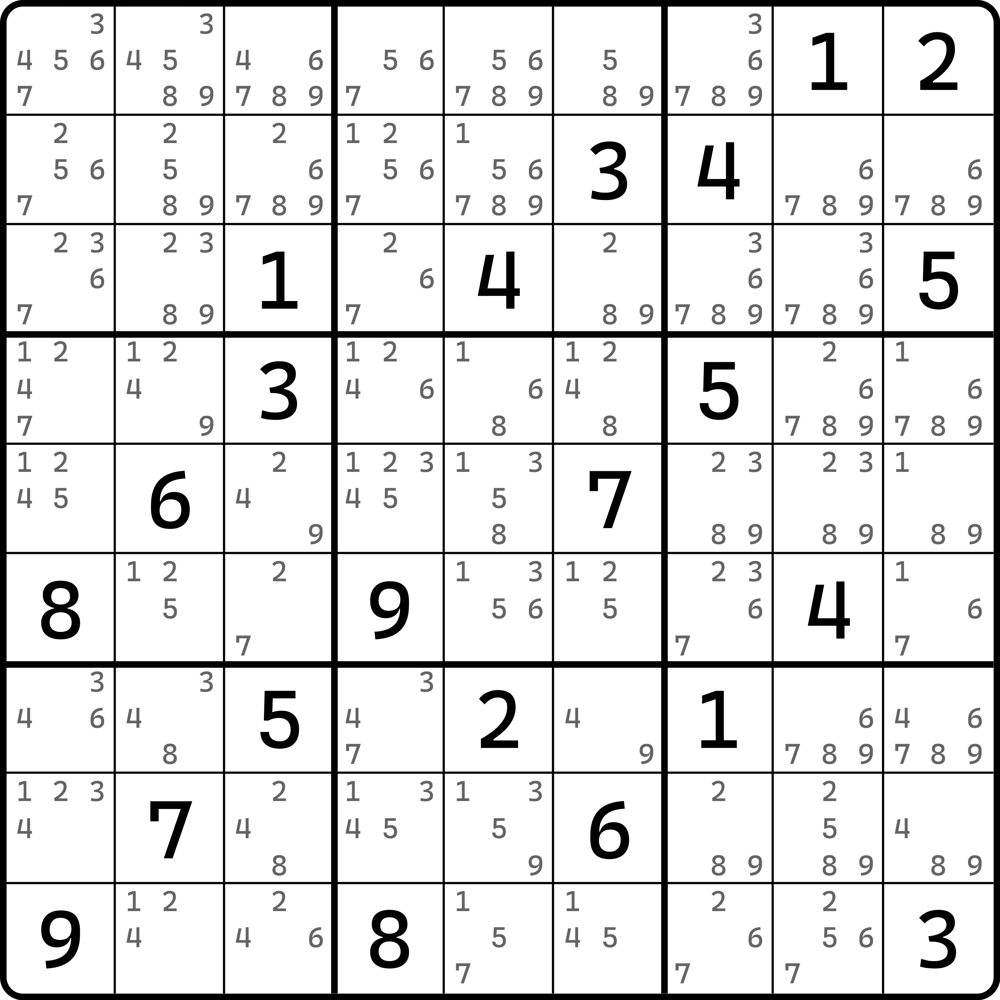
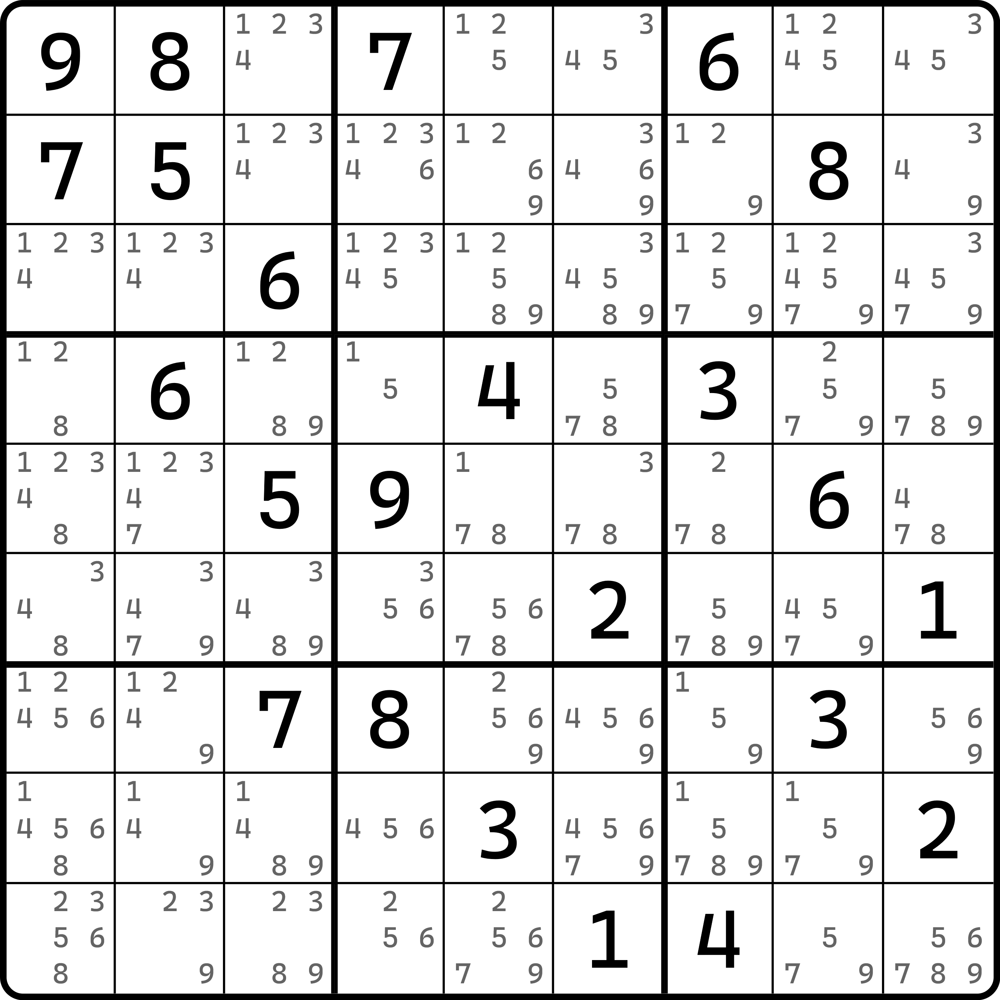

# 全衰飞鱼

前面我们带着大家看了如何得到衰弱飞鱼的一些特征删数，下面我们来看衰弱飞鱼的变体：**全衰弱飞鱼**（Lame Weak Exocet）。

## 全衰飞鱼的基本推理 

<figure><figcaption>
全衰弱飞鱼
</figcaption></figure>

如图所示。本题缺少强心针单元格，所以看起来衰弱飞鱼救不活了。不过，实际上衰弱飞鱼也是有结论的：

**如果衰弱飞鱼不存在强心针，那么衰弱飞鱼其他额外删数均不可删，但伤口看不见的那一个目标单元格仍旧可以得到“填入的是和基准单元格其一填的一样的数字”的结论。**

说人话就是，本题里基准单元格的候选数是 1、2、3、4，就算是缺少强心针，伤口看不见的另外一个目标单元格 `r2c4` 仍然可以得到它是 1、2、3、4 的其一的结论。所以，这个题的结论是 `r2c4 <> 6`。但是，别的结论就都得不到了。它尽力了，它真的尽力了。

我们把这种缺少强心针单元格的衰弱飞鱼结构称为全衰弱飞鱼，简称**全衰飞鱼**。

## 全衰飞鱼对伤口没有要求 

尤其要注意的是，本题的伤口是长了一个明数，这并非全衰弱飞鱼成立的条件。它实际上是什么都无所谓，甚至是一个空格。

<figure><figcaption>
另一个例子
</figcaption></figure>

如图所示。可以看到，这个题是缺少强心针单元格的。有人问，这个 `r2c7` 不是强心针吗？不是的。之前我们说过，强心针单元格不能和伤口在同一行列，或者说，在同一个行列上的数字在证明的时候是用不上的，所以考虑它没有必要。

如果你不信邪，你可以看看这个例子。

<figure><figcaption>
连相同数字都没有的例子
</figcaption></figure>

如图所示。这个题里你甚至在 `b23` 里都找不到一个明数是 1、2、3、4 的单元格。

## 练习题 

请找出图中的全衰弱飞鱼，以及对应的删数。每一个例子的提示数摆放均和之前的例子比较相似，但确实并非同一个题目，主要是为了练手，不是为了为难大家，所以题目都比较容易找；正因为容易找，所以答案我也就不给了。



### 题目 1 

<figure><figcaption>
题目 1
</figcaption></figure>



### 题目 2 

<figure><figcaption>
题目 2
</figcaption></figure>



### 题目 3 

<figure><figcaption>
题目 3
</figcaption></figure>



至此，我们就把飞鱼的内容全部结束了。
