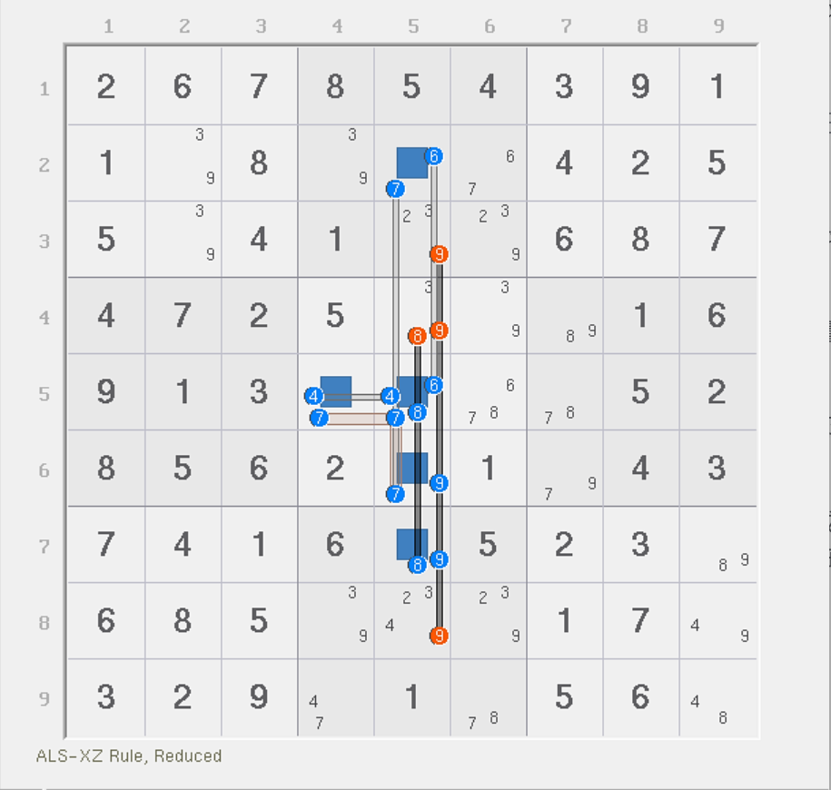
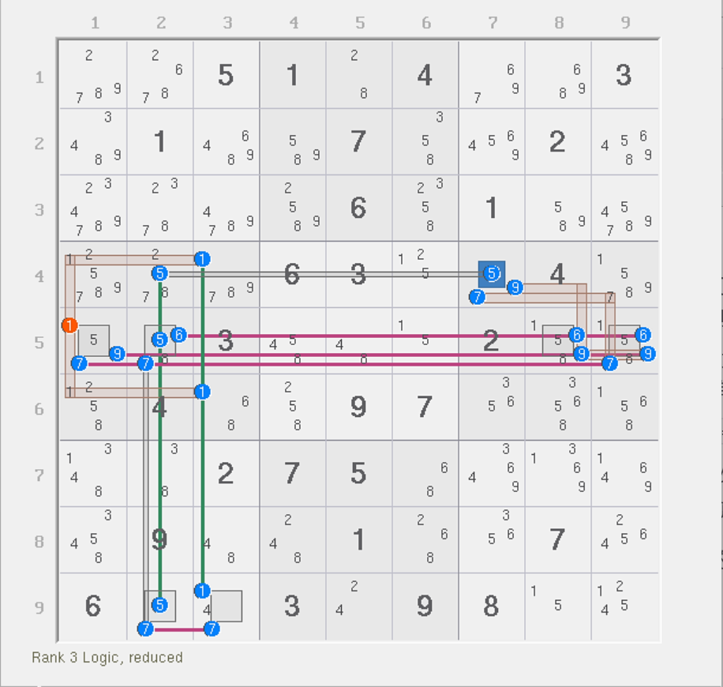
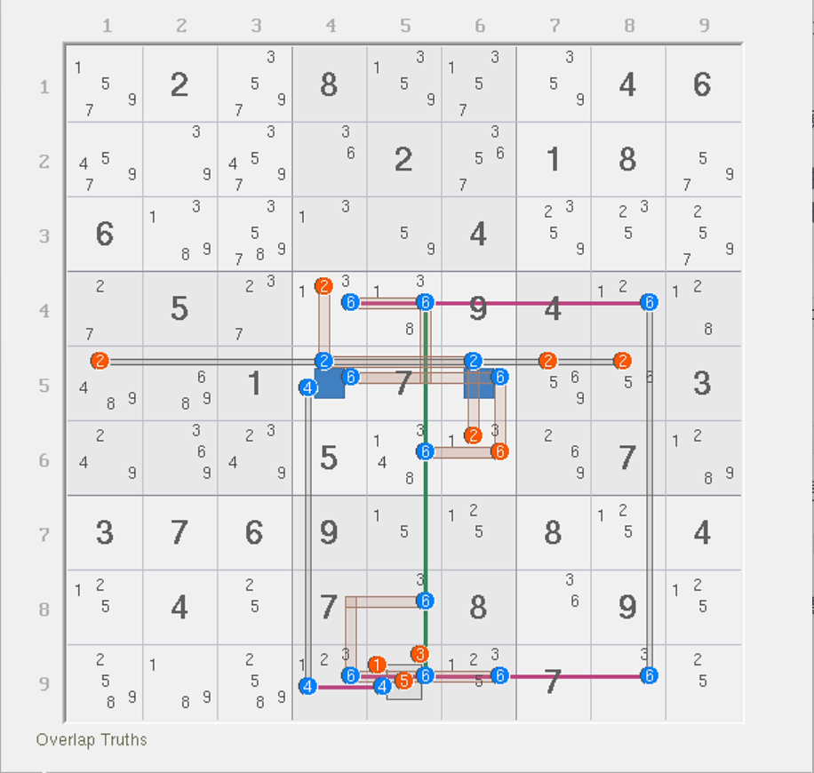
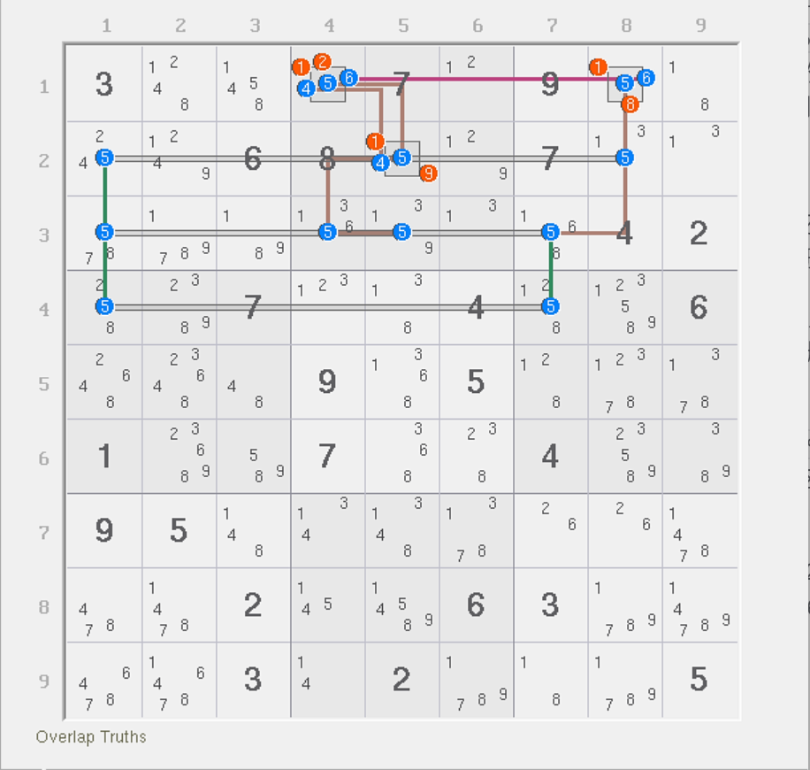

# 递归分析

总有一些特殊结构我们无法立马得到结果，因此我们不得不借助复杂的子情况分析的形式将结构进行分情况讨论处理。但是，结构复杂的时候可能不一定一层就可以搞定，可能子情况套着子情况，所以非常难以搞清。

这个时候我们可能需要考虑**递归分析**（Recursive Analysis）。所谓递归分析，就是说在某个情况下我们无法直接得到结论时（比如结构仍旧比较大，且无法直接依靠精确覆盖得到结论时），可能就需要继续讨论里面的一些位置，参与结果的分析。

## 让我们从鱼结构开始 <a href="#let-us-start-with-fish-pattern" id="let-us-start-with-fish-pattern"></a>

为了阐述清楚要说的东西，我们先从鱼结构开始学习。鱼结构之所以放在这里当成初学例子，是因为鱼只用一个数。单个数字的讨论相对来说压力不是那么大。

<figure><figcaption><p>还是之前那个题</p></figcaption></figure>

如图所示。这个题其实之前已经分析过了，不过有一个删数我们并未讨论，就是图中的 `r4c7(4)`。这个数字是可以删除的，但是我们之前并未对此进行分析。

我们先试着假设当 `r4c7 = 4` 的时候会造成什么效果。显然，它能让 `b6` 的余下三处 4（即 `r56c8` 和 `r4c9` 这三处）都无法填 4，于是我们数一下余下结构的强弱区域的数量。强区域有 5 个（因为假设的是删数处，它不在任何一个强区域里，所以强区域数量并未减少），弱区域则还剩下 3 个（少了 `4r4` 和 `4b6` 这俩）。

能算结构的秩吗？不能，因为 `r5c1` 是强三元组，所以并不是所有候选数是精确覆盖的。那么这个时候我们可以进行递归分析。

### 思路 1：进行递归分析 <a href="#do-recursive-analysis" id="do-recursive-analysis"></a>

进行递归分析的方式也不难。我们直接忽略强三元组，然后先去找结构里可以直接出数的强区域，然后继续试着在结构里往下填数。很巧的是，刚才我们假设造成了 `r56c8` 无法填 4，而这俩是处于 `4c8` 这个强区域里的，于是 `4c8` 顺理成章地将 4 的可填位置安排在 `r2c8` 里，因为它此时是唯一一个可以填 4 的位置了。

接着，我们继续沿着结构填数。因为 4 此时填到了 `r2c8` 里，所以理所应当地，`r2` 的别处不能填 4，故 `r2c149(4)` 为假。可以看到，`r2c9(4)` 为假了。结合前面一步我们有的 `r4c9(4)` 为假的结论，此时 `c9` 可以出 4：`r8c9 = 4`。

然后，顺着弱区域 `4r8` 走，我们划去 `r8c4(4)` 这个位置，它此时也不能填 4 了。不过，将前面的结论全部提取出来，`4c4` 这个强区域则可以出 4 的位置在 `r5c4` 上。

结构都快试完了全部的位置，但是最终我们发现了矛盾。刚才我们依次填入了 `r4c7(4)`（初始假设）、`r2c8(4)`、`r8c9(4)` 和 `r5c4(4)`。试了快一整圈才发现，`4c1` 和 `4b4` 已经无法填数，因为这两个强区域的所有位置都被我们前期的填数给排除掉了。所以，它最终还是造成了矛盾。

这便是我想说的：当我们无法一步达成矛盾，就只能继续将线路延伸下去，在结构里一直往下填，直到填不动了再去看是否有结论。如果不行的话，可能还需要继续对每一个之后的情况继续这么作分析，直到全部的分支都造成矛盾为止。

总之，因为它造成了矛盾，所以初始假设是有问题的，故我们可以删除 `r4c7(4)`。

### 思路 2：预估秩的极值 <a href="#evaluate-minimax-value-of-rank" id="evaluate-minimax-value-of-rank"></a>

另外一个思路是用秩来得到矛盾。

可能你会问我，这不是不能算秩吗？是的。秩的确定结果我们确实无法知道，毕竟这个题有一个强三元组 `r5c1(4)` 和一个弱三元组 `r5c8(4)`。直接上手分析自然是不合适的。

不过，我们可以预估。我们初步可以确定的是，这个结构有 5 个强区域和 5 个弱区域。当我们假设 `r4c7 = 4` 的时候，结构会少掉两个弱区域，一个是 `4r4`，另一个是 `4b6`。这一点刚才第一个思路里已经说过了。

少了两个意味着，强区域数量没变（还是 5 个），但弱区域数量变为 3 个。我们试想一下，我们要得到矛盾，要么结构代入秩的式子发现为负数（前提是可以按秩的公式计算），要么就上手试到矛盾为止。

这个结构还算比较好分析的一点是，它在填了假设的 `r4c7(4)` 后，结构就只余下了一个强三元组 `r5c1(4)` 需要我们单独讨论了。我们思考一下。想要让秩的公式可以奏效的前提条件是让结构里所有候选数都能精确覆盖，对吧？强三元组确实是我们求秩的“绊脚石”，那么我们粗略估计一下呢？

强三元组占位的时候，它会同时让两个强区域都有填数，此时余下的结构就还有 3 个强区域，而弱区域会额外再少一个 `4r5`。从前一步的状态到这里，强区域此时还剩下 3 个，而弱区域就只有 2 个了。余下的数字都是精确覆盖，于是我们可以知道的是，强三元组此时占位是直接造成矛盾的：秩直接等于 -1 了。

那当强三元组不占位呢？不占位也就意味着结构的所有余下候选数均为精确覆盖。但是，此时结构余下的强区域数量有 5 个，弱区域数量才 3 个，秩是 -2，仍然是矛盾的。

所以呢？所以我们评估了强三元组占位的两种情况后发现，不论哪种情况秩都是负数。所以就说明了，原始假设肯定是错的。所以 `r4c7(4)` 可以删除。

## 预估极值不只是少点分析这么简单 <a href="#evaluate-rank-is-inequivalent-to-reduce-complex-analysis" id="evaluate-rank-is-inequivalent-to-reduce-complex-analysis"></a>

可能你看完了第二条思路会觉得，它好像也是在代入假设强三元组的真假性来确定秩肯定为负数，这不就单纯是为了避免少递归分析么？本质不还是在试，只是少了点试的成本罢了。

这话说得不完全对。我之所以按前面那么解释只是为了单纯让你觉得好理解一些。实际上学会预估之后就会发现，因为两侧的情况，秩的结果就算不能预判，但结构的矛盾也是客观事实。就比如说前面两个情况（强三元组占位的两种情况），算出来一个是 -2，另一个是 -1，但你有没有想过，从数值比较上去理解，-1 比 -2 大，却仍然是负数，这是不是有什么说法在里面？

我们依靠这个思路去思考。-1 的情况是强三元组占位的时候，而 -2 则是不占位的时候。在占位的时候，因为弱区域数量会变少，所以被减数会减少；而强三元组因为是占位，所以强区域数量会少得更多。这会造成一个很有意思的现象。

考虑下面这个式子：

$$
R=n_L-n_T
$$

其中 $$n_L$$ 是弱区域的数量，而 $$n_T$$ 是强区域的数量，结果 $$R$$ 是结构的秩，这就是普通的计算秩的式子。

首先，在假设了 `r4c7(4)` 为真之后，结构的弱区域数量是比强区域数量要少的（强区域数量是 5 个，但弱区域数量是 3 个），虽然我们知道此时还有一个强三元组，所以即使这个式子算出来是负数也不能代表结构是错的，我们继续往下看。

虽然此时的负数不代表结构一定有矛盾（因为有强三元组不能直接使用公式求秩），但这已经足够能说明一个问题了。强三元组占位会造成弱区域数量减少 1 个，强区域数量减少 2 个。这也就是说，式子里 $$n_T$$（减数）减少得比 $$n_L$$（被减数）还要快，从结果 $$R$$ 上体现出来的效果就是，它会比原本算出的值要更大一些。

> 随便写个式子你就懂了。假设式子是 2 = 5 - 3，如果减数 3 少得更多，被减数 5 没少那么多的话，比如式子变为 4 - 1，这算出来的结果是等于 3 的，所以结果 3 上体现得会比原来的 2 还要大一些。

但是，原本通过粗糙地计算后，我们发现结果算出来就已经是 -2 了。但结构只有一个强三元组不是精确覆盖的地方。就算我们能让它占位造成结果 -2 变大，也只能变大一个单位，即变为 -1，但它还是小于 0 的。

另一方面，如果不占位的话，所有候选数变为精确覆盖，就可以直接代入式子求秩，这等效于在说强弱区域数量并未发生变化，那结果 -2 也就成为了定局。

所以，最终体现的效果就是，我们即使利用唯一一次可以造成秩结果变大的情况（让强三元组占位）算出结果都不能让秩 ≥ 0（恢复结构不矛盾的状态），那就说明结构肯定是矛盾的，所以直接就可以得到 `r4c7(4)` 是删数了。

换言之，我们可以通过粗略通过算出秩的结果（虽然它不一定代表结构的真实的秩），然后通过预估占位时造成的强弱区域数量的变动，来估算秩变化的情况（是变大了还是变小了），然后再拿来和 0 参与比较来快速确定矛盾是否存在。

## 来看几个例子 <a href="#some-examples" id="some-examples"></a>

下面我们来看几个例子。

### 例子 1：复杂待定数组 <a href="#example-1" id="example-1"></a>

<figure><figcaption><p>例子 1</p></figcaption></figure>

如图所示。这个例子一共有 5 个单元格构成，也就用了 5 种不同的数字，但是它有 6 个弱区域，因为 7 有两个弱区域，其中有 2 个弱三元组位于 `r56c5(7)`。粗略计算秩可以得到 6 - 5 = 1 的结果，这肯定用不上，所以我们只能继续递归分析。

* 如果弱三元组 `r5c5(7)` 占位，余下四个单元格均为双值格的缘故，所以可以快速得到情报：`r6c5 = 9`、`r7c5 = 8`。其他的单元格可以不看，因为跟本题的结论暂时没有啥关系，就不耽误时间让各位去看那些地方了；
* 如果弱三元组 `r6c5(7)` 占位，则可以得到 `r5c5 = 8`、`r7c5 = 9` 的结论；
* 如果两个弱三元组均不占位，则所有余下候选数均为精确覆盖。秩虽然此时仍然等于 1 不能直接出结论，但此时 `r6c5 = 9` 和 `r7c5 = 8` 的结论是可以直接得到的。

综合三种情况可以发现，`r567c5` 里肯定会有 8 和 9 的填入，这个是跑不掉的。所以，结论就是 `c5` 的其他单元格都不能填 8 或 9，删掉他们。

### 例子 2：一个复杂的结构 <a href="#example-2" id="example-2"></a>

<figure><figcaption><p>例子 2</p></figcaption></figure>

如图所示。假设 `r5c1(1)` 为真，我们会依次顺着强区域的剩余位置确定 `r9c3(1)`、`r9c2(7)`、`r5c9(7)`、`r5c8(9)` 和 `r4c7(5)` 和 `r5c2(6)` 这些候选数为真。

但是此时，`5c2` 强区域无法填数，所以矛盾了。所以原始假设错误，故 `r5c1 <> 1`。

这是一个有 7 个强区域和 11 个弱区域的结构，比较难推，因为每一步都需要直推，非常不方便。我们也可以包装一下结构。比如说，`r5` 有一个毛刺隐性三数组 `r5c289(679)`。此时我们按 `r5c1(79)` 的真假性讨论即可：

* 如果 `r5c1(79)` 有一个为真，直接删除 `r5c1(1)`；
* 如果 `r5c1(79)` 均为假，则隐性三数组成立，故 `r5c2(5)` 为假，与此同时，`r5c89(9)` 形成区块，故 `r4c7(9)` 为假，此时 `r4c7` 为只有 5 和 7 的双值格：
  * 讨论两种填法：
    * 如果 `r4c7 = 5`，则 `5c2` 里 5 填在 `r9c2`，于是 `r9c2(7)` 为假；
    * 如果 `r4c7 = 7`，则 `r5c9(7)` 为假，于是 `7r5` 里 7 落在 `r5c2`，于是 `r9c2(7)` 也为假；
  * 于是，`r9c3(7)` 为真，`r9c3(1)` 为假，于是 `r46c3(1)` 形成区块，也可以删除 `r5c1(1)`。

总之，两种情况要么直接删，要么走动态链分支一般得到 `r46c3(1)` 是区块删除 1。

### 例子 3：又一个复杂的结构 <a href="#example-3" id="example-3"></a>

<figure><figcaption><p>例子 3</p></figcaption></figure>

如图所示。这个例子讨论起来挺麻烦的。我们先按链的思维去走。

假设 `r9c5(4)` 为假，则引出链：

```
4r9c5=4r9c4-4r5c4=26r5c46-6r4c45=6r4c8-6r9c8=6r9c456
```

别急。这会还删不了数。我们继续看。因为中途我们可以得到 `r5c46(26)` 显性数对为真，所以理应在此时 `r46c5(6)` 都可以变为假。与此同时，我们因为得到末尾区块 `r9c456(6)` 为真，所以 `r8c5(6)` 也为假。再次观察 `6c5` 这个强区域可以得到，6 此时只能填在 `r9c5`。所以，当 `r9c5(4)` 为假的时候，`r9c5(6)` 必须为真；而算上 `r9c5(4)` 为真可以占位的结论，我们可以直接得到 `r9c5 <> 135` 是直接可以直接得到的结论。

不过剩下的删数都是怎么来的呢？

还是借用一下这个链，不过我们只用其中一截就行。还是假设如果 `r9c5(4)` 为假，我们可以快速得到 `r5c46(26)` 这个显性数对为真的结论，所以 2、6 在 `r5` 和 `b5` 里可以用于删数。

而现在讨论 `r9c5(4)` 为真的情况的话：如果它为真，则 `r9c5(6)` 就为假，此时 6 可用的范围是 `6c5` 和 `6r8` 这两个强区域。显然 6 一旦放在上面 `r46c5(6)` 两处就可以直接删数了，所以我们要讨论的位置就只有下面 4 个候选数 `r8c5(6)` 和 `r9c468(6)` 了。

不过其实很容易知道的是，如果 `r8c5(6)` 为真，则 `r9c8(6)` 为真，则 `r4c45(6)` 区块成立，删 `b5` 里其他位置的 6；如果 `r9c46(6)` 为真，则借用强区域 `6c5` 可得 `r46c5(6)` 区块成立。也就是说还是能回去到上面得到 `r4c45(6)` 和 `r6c5(6)` 三个候选数其一填 6 的结论。

所以，总体讨论了所有情况就会发现，要么显性数对 2 和 6 成立，要么三个独立的候选数里至少有一个为真，故 `r6c6(6)` 可以删除。那 2 怎么删的呢？因为刚才说到的这三处 6 至少有一个成立，所以到 `r5c46` 而言，里面就都不能填 6，于是形成关于 2 和 4 的显性数对，故 2 也可以造成删数。

总之，这个例子讨论起来还是挺复杂的。

### 例子 4：利用占位出 4、5、6 必填 <a href="#example-4" id="example-4"></a>

<figure><figcaption><p>例子 4</p></figcaption></figure>

最后再给各位看一个例子。不过这个例子我希望你自己看。找准切入点，证明删数的来源。
