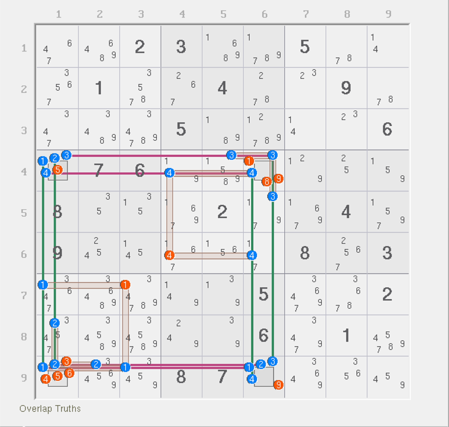
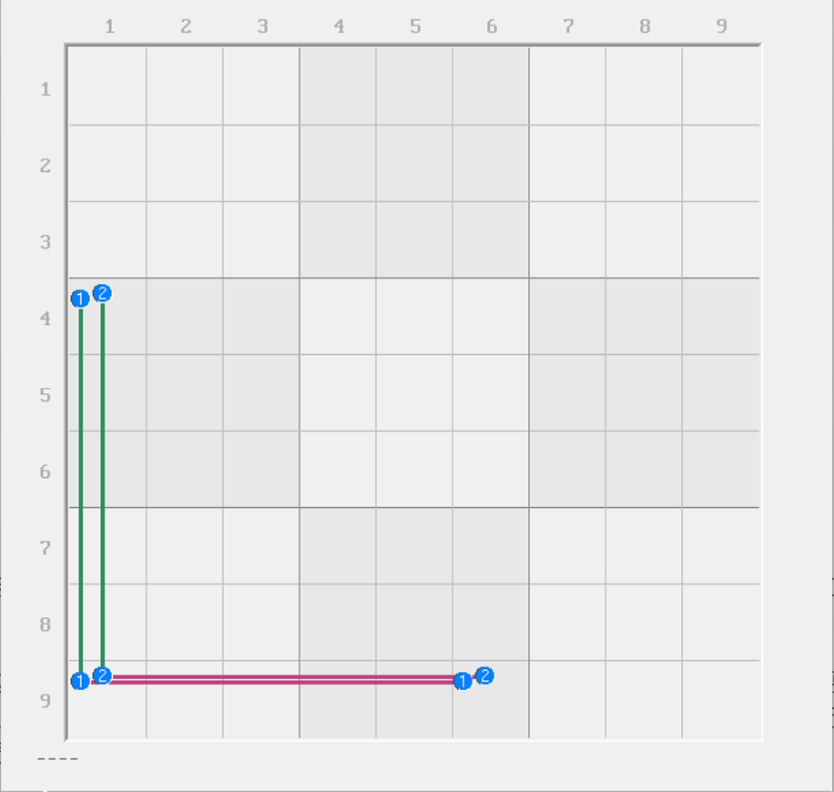
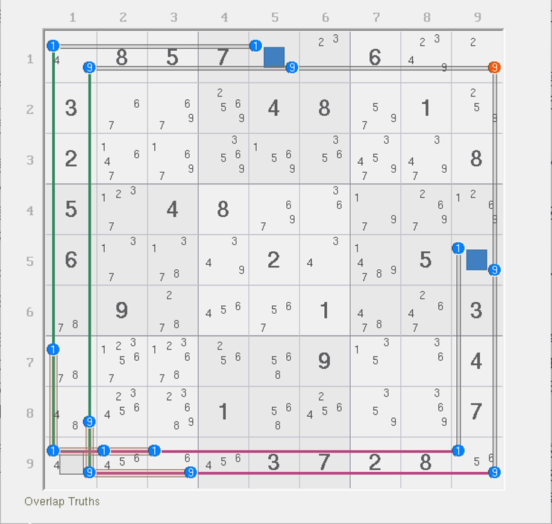
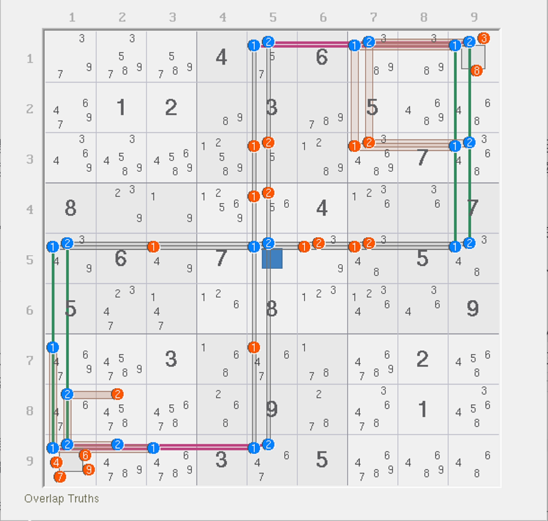
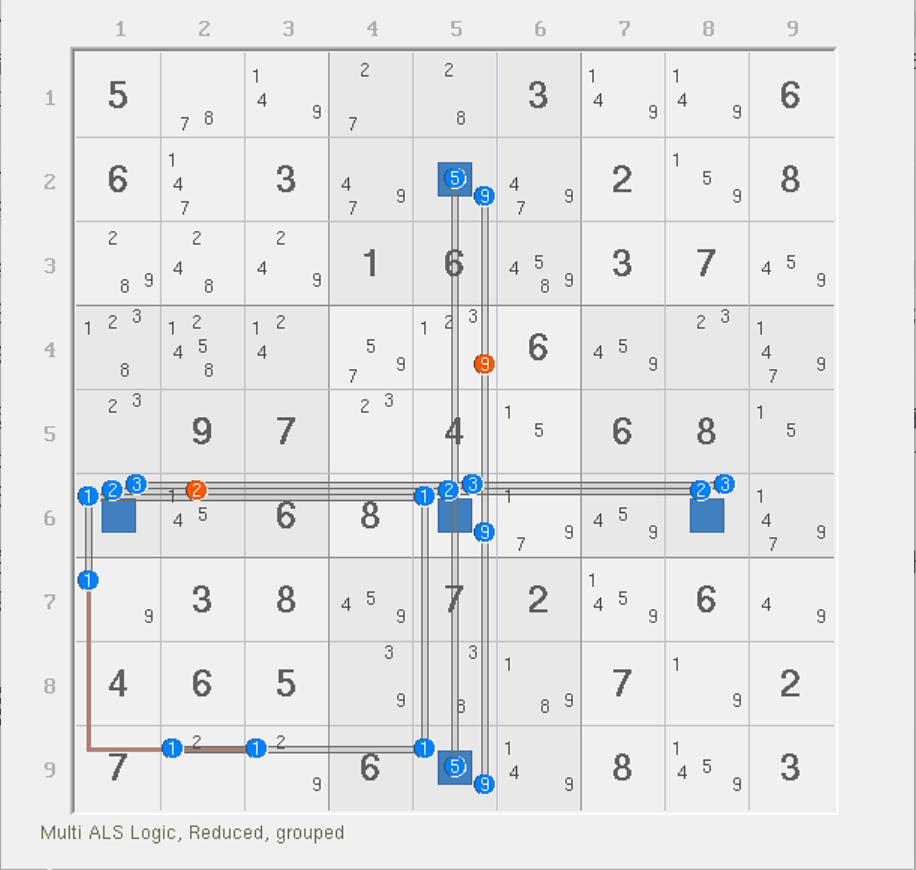
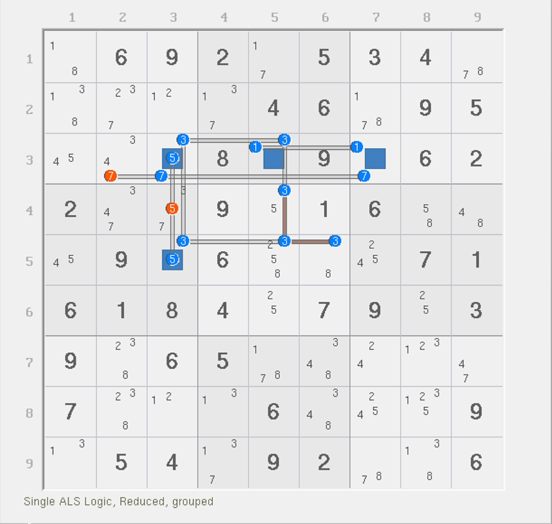
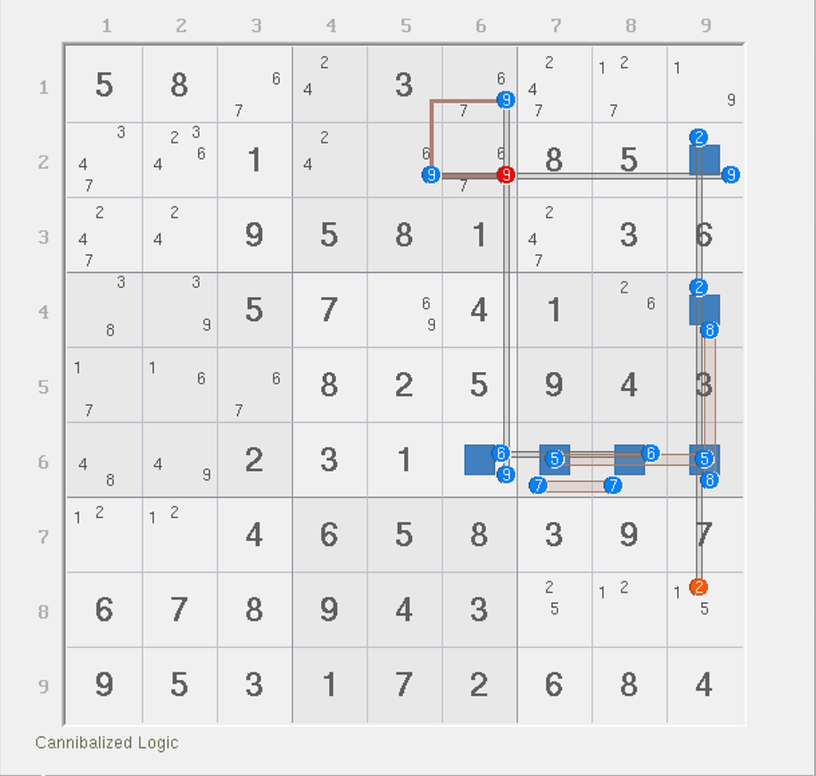
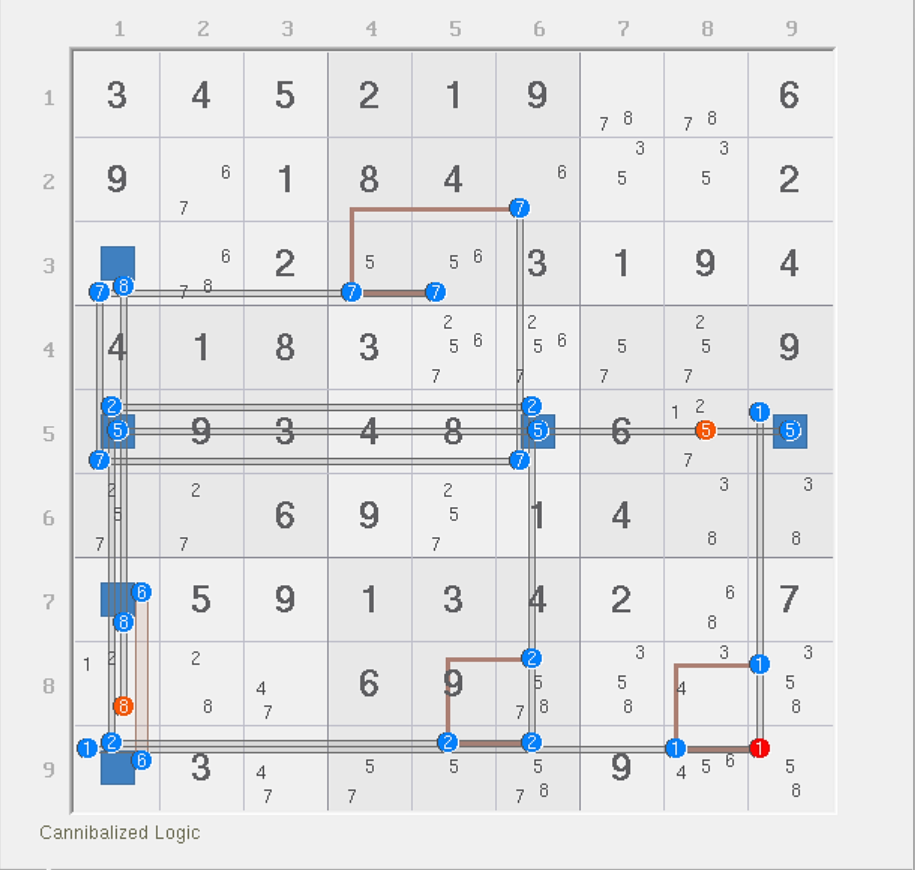

# 自增和自减

不知道你是否在平时使用秩理论的时候遇到过这种问题：

“为什么有些时候，结构的强弱区域数量是固定的，但实际上我试着往里填了数字却根本达不到数量？”

这便是今天我们要来学习的内容。

## 强区域自增现象 

### 引例 

<figure><figcaption>
烟花四数组
</figcaption></figure>

如图所示。这是之前介绍过的一个例子，不过这里改用了秩的画法来呈现。

首先，这个题的秩是没办法直接算的，因为这个结构用到了 4 个强三元组：`r4c6(34)` 和 `r9c1(12)`。你说它强三元组就强三元组吧，1 和 2 还落在同一个单元格；3 和 4 也是。这反而造成了分析的复杂程度的提升。

我们这里用一下上帝视角。经过枚举之后，我们可以知道的是，烟花四数组的填法一共有 8 个情况，且每一种可能均只能填 6 个数字进去。具体枚举就不呈现了，因为重点不在这里。

重点是，明明有 8 个强区域，却实际上只能填 6 个数进去。虽然我们都知道，强三元组可能是会造成填一个数就会影响到两个强区域的这个特征，但这也太恐怖了，穷举全部情况之后发现根本就不存在比 6 更多次数的填入。

那么这是怎么来的呢？

### 局部结构分析 

我们将这个题里用到的 8 个强弱区域拆开看。我们先看左下角 1 和 2 的这一部分，然后我们暂时忽略掉 `b7` 其他位置的 1 和 2（因为讲解期间用不上他们）。

<figure><figcaption>
1 和 2 的局部结构
</figcaption></figure>

如图所示。这能看出来个什么呢？别急。首先我们知道，1 和 2 必须在强区域里填入一次，理应 4 个强区域会安排 4 个数字的填入，两个 1 和两个 2。

但是，这个结构有一个特殊的地方：`r9c1` 只允许最多放入 1 或 2 的其中一个数。也就是说，只要我们往里面填了 1 就不能填 2（或者反之亦然）。而另外一个数呢？因为强区域的关系，余下一个数一定不会成为强三元组，所以它必须填两次。也就是说，这个局部结构其实最多只能填 3 个数进去（要么俩 1 和一个 2，要么俩 2 和一个 1）。

那么，能比它更少吗？显然是不能的。因为，你必须要同时满足 4 个强区域都有数填入。最差的摆放也必须要有一个位置占在 `r9c1` 上——你无法摆 4 个及以上的 1 或 2 到这个局部结构里去（因为再多数字就放不下了）；2 个及以下也不可能，因为你没那么多强三元组可以放（一个强三元组只能最多让两个强区域都有填入，但对于 4 个强区域而言，只填 2 个数 + 1 个强三元组是根本不够的）。

也就是说，对于烟花数组而言，1 和 2 的局部结构即使有 4 个强区域，但实际上我们只能填 3 个数进去就能让 4 个强区域都有填入，而且也只能是 3 个数，不能多也不能少。

当然，烟花数组里我们还用到 `b7` 里其中的一些 1 和 2，因为它会用作结构的删数，而且也确实客观存在这些数字。不过这都不重要，因为我们检查填入次数的时候，这些位置有 1 和 2 也不会影响结论的成立（必须填 3 个）。我们把实际填充次数达不到强区域数量这么多的局部结构称为**强区域自增现象**（Auto-increment Truths）。因为此现象只跟强区域有关系，所以一般也简称**自增现象**或直接称呼为**自增**。

### 实例 

下面我们来看一个自增现象的实例。

<figure><figcaption>
烟花……数对？
</figcaption></figure>

如图所示。这是一个**烟花数对**（Firework Pair）技巧。之前我们提到过，烟花数组要成立必须至少需要 3 个数（或者说结构能稳定出现在题目里，必须要 3 个数字及以上），但实际上两个数也可以构成，不过需要给结构动手脚加点东西才能稳定存在。

我们这次添加了 `r1c5` 和 `r5c9` 两个单元格。诶，有 W-Wing 的味道了。实际上不是哈。我们来分析一下这个的推理过程。

先是 `19c1` 和 `19r9` 这四个强区域。我们刚才说过，这四个强区域只能填 3 个数进去。对于这个题而言，就是要么俩 1 一个 9，要么就是俩 9 一个 1。具体哪一个数出现两次并不重要，重要的是 `r9c1` 一定会被占位。

接着是分析 `b7` 这些多出来的 1 和 9。分析它干啥呢？因为他们的出现会影响 1 和 9 实际的摆放位置。比如说我这个结构填俩 1 和一个 9 的话，显然 9 必须落在 `r9c1`，那么 1 还要填俩，那放哪里呢？`r7c1` 和 `r9c23` 这三处是肯定只能安排一个 1 的，因为你无法在同一个宫里填两个 1 进去。那么这么说的话，数字 1 势必会有一个落在要么 `r1c1` 要么 `r9c9` 这两个单元格里。

也就是说，如果是数字 9 填一次的话，我们可以得到 `r1c1` 和 `r9c9` 里必须有 1 的出现；那么如果是 1 填一次的话，那么也可以得到 9 必须在 `r1c1` 或 `r9c9` 里出现。总之，`r1c1` 和 `r9c9` 肯定会有 1 或 9 的出现。

既然得到这一点了，后面就好说了。因为 1 或 9 必须出现的缘故，结合 `r1c5` 和 `r5c9` 这两个单元格我们就可以得到保证：如果 `r1c1` 是填 1 或 9 的，则 `r1c15` 会形成显性数对；如果 `r9c9` 是填 1 或 9 的，那么 `r59c9` 则会构成显性数对。所以，`r1c9` 不论哪一个显性数对会成立，都可以被删除掉 9。所以这个题的结论就是 `r1c9 <> 9` 了。

我们再来看一个例子。

<figure><figcaption>
双烟花数对联立
</figcaption></figure>

如图所示。这个例子和刚才那个差不多，不过是两个烟花数对要联立起来才能看。首先是 `12c1` 和 `12r9` 这一个局部结构可以得到 1 和 2 肯定会出现在要么 `r5c1` 里要么 `r9c5` 里，然后是 `12r1` 和 `12c9` 这一个局部结构可以得到 1 和 2 肯定会出现在要么 `r1c5` 里要么 `r5c9` 里。

因为这一共有 4 个单元格，所以最终 1 和 2 的填数组合是如何的，我们并不清楚。但是，`r5c5` 告诉我们，“没事的兄弟，`r19c5` 和 `r5c19` 里只要有 1 或 2 出现就会有显性数对”。

实际上呢？实际上的确如此。就比如说 `r5c1` 和 `r9c5`，这俩肯定会有 1 或 2 的安排，如果填在 `r5c1` 里，那么 `r5` 就能形成数对；如果填在 `r9c5` 上，那么 `c5` 就能形成数对。但是，具体填在行上还是列上我们并不知晓，不过另外一个烟花数对结合起来看就不会有问题了。

因为另外一个烟花数对也会让要么行上要么列上出现一个数对，所以显然他们不能同时都出现在列上，因为 `r5c5` 只有两个候选数，同时出现在列上要么会造成 `r5c5` 无法填数，要么 `r19c5` 或 `r5c19` 填的数一样，总之肯定都不行。所以，1 和 2 的填数就像是上天安排好了一样，行和列都会有数对且肯定会出现的。

别的删数就不说了，因为就是普通的烟花数组的删数；虽然这个结构只是个烟花数对，但它的删数在这个结构里肯定也都能成立，不是说只有烟花三数组才会成立。不过我希望你自己去分析余下的删数。

## 弱区域自减现象 

### 引例 

<figure><figcaption>
胖姨环
</figcaption></figure>

如图所示。这是一个胖姨环。这个题一共有 6 个强区域 `6n18`、`269n5` 和 `1b7`，以及 8 个弱区域 `123r6`、`1r9`、`1c1` 和 `159c5`。

这个例子里 2、3、5、9 都最多只能填一次，而由于数字都各不相同，所以在 `r2c5`、`r6c158` 和 `r9c5` 这 5 个单元格里最多会有四个席位给 2、3、5、9 填入。那么剩下俩呢？只能是 1 了，因为没别的数字了。

但是，1 现在有 4 个弱区域（`1c15` 和 `1r59`）和一个强区域 `1b7`。尤其是这个 `r6c5` 这个位置，数字 1 在这里甚至在行列上都找不到强区域可以容纳这个 1，反倒是它现在处于 `6n5` 这个强区域里，和 2、3、5、9 共享其中一个。

那么 1 到底要怎么安排才合理呢？固定填两次就行。为什么呢？

首先，我们要保证 `1b7` 必须填 1，所以它会占用一次填 1 的名额；而余下的 5 个单元格里就算极限一些，把 2、3、5、9 都安排一个进去，也会剩下一个空格无法填数。所以剩下的那个位置就必须再填一个 1 来使得结构的 1 填够次数。所以，1 必须填两个；而很显然，1 肯定也不会出现三次及以上（因为放不下）。所以 1 还就只能有且仅有两个。

那么这么看的话，正常的放入情况就是 1 必须填 2 个（虽然有四个弱区域）。这样的话，2、3、5、9 显然都可以用于删数（因为他们都会出现）；而 1 则不知道两处的 1 分别在哪里，所以 `1r6` 和 `1c5` 里哪边有 1 是并不知道的，所以无法删数。所以这个结构的结论就只有 2、3、5、9 可提供删数。

我们把实际填充次数达不到弱区域数量的情况称为**弱区域自减现象**（Auto-decrement Links）；同理，它也可以简称为**自减现象**或**自减**。

### 实例 

<figure><figcaption>
胖姨环，另一个例子
</figcaption></figure>

如图所示。这个题一共有 5 个强区域和 7 个弱区域。和刚才一样，数字 3 形成了自减，所以虽然标了 4 个弱区域，但实际只能填两次：其他的数字 1、5、7 则刚好最多都只能放一个，所以安排下来，1 必须填入两个才行。

所以删数就按 1、5、7 弱区域删数即可；3 因为无法确定哪两个，所以无法删数。

我们再来看一个题。

<figure><figcaption>
胖姨环，没有自减就会直接自噬
</figcaption></figure>

如图所示。这是另一个胖姨环用法。首先，这个结构用到了 7 个强区域和 7 个弱区域。数字 9 这次学乖了，`r6c9` 原本这种单元格上应该有它的出现，这次它没有。

显然，2、5、6、7、8 这五个数字都只能最多出现一次，而余下两个数字的填入机会必须安排 9 填进去，才能凑够 7 个强区域都有数填入。那么，什么时候 9 能填两次呢？对了，只要让 `9r2` 和 `9c6` 都出现 9 就行。不过，要注意的是，整个结构有 6 个单元格强区域，如果我们将 9 安排在 `r2c6` 的话，会造成余下 6 个单元格强区域无法填够 6 个数字（因为 2、5、6、7、8 只能填 5 个席位，还有一个必须安排 9）。所以，`r2c6` 这个弱三元组是没有机会填 9 的。因此，这个题的其中一个 9 必须放在要么 `r2c9` 要么 `r6c6` 里，另外一个放在 `1b2` 里（而且还不能是 `r2c6`）。所以，`9c6` 和 `9r2` 这两个弱区域不能用作删数（因为具体哪一个弱区域有 9 不确定），但 `r2c6 <> 9` 可以作为删数结论出现。

是的，这个题里因为 `r6c9` 没 9 了之后，9 的摆放机会会少很多。原本是三个位置里出现一个，现在是两个位置就出现一个。

最后来看一个例子。

<figure><figcaption>
胖姨环，但是有 2 个自减和 1 个自噬
</figcaption></figure>

如图所示。这个题比较难数，但是有自减的知识储备之后就会比较好理解一些了。这个题一共有 9 个强区域和 13 个弱区域。其中，1、2、7 有自噬/自减现象出现，而 5、6、8 则都只能最多出现一次。

显然，因为有 9 个强区域的安排，所以 1、2、7 必须每一个数都出现两次才行。这样一来，2 + 2 + 2 + 1 + 1 + 1 = 9，刚好就占满了全部的 9 个强区域。弱区域就不用多说了（主要是 2 和 7，都有 4 个弱区域，但实际上他俩都只能填两次，所以 8 个弱区域实际上生效的填入只有 4 个）；另外，数字 1 只能出现两次，它不是自减，所以 1 在 `1c9` 和 `1r9` 里会出现一次，故 `r9c9` 轮不到填 1，它也可以用作删数。

## 其他补充内容 

这个概念来自于我的一个朋友，他之前对一些结构的整体分析秩有一定研究。不过他本人比较害羞，所以这里就只提及他本人的昵称——小舟。

小舟之前在贴吧里写了几篇关于秩理论的讨论和推算的帖子，其中有一篇跟本文有关系。教程下一篇的内容会继续对这个概念进行深入，讨论一下如何推算一个结构的秩，其中会使用帖子的内容，到时候也会给各位传送门。
