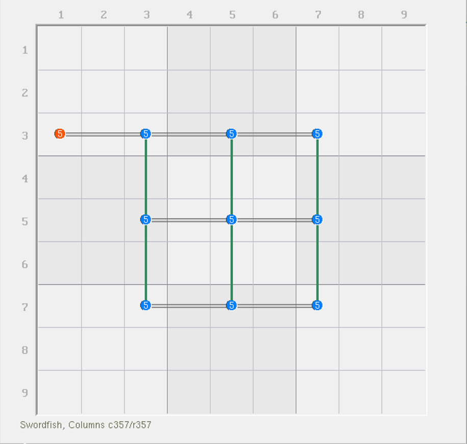
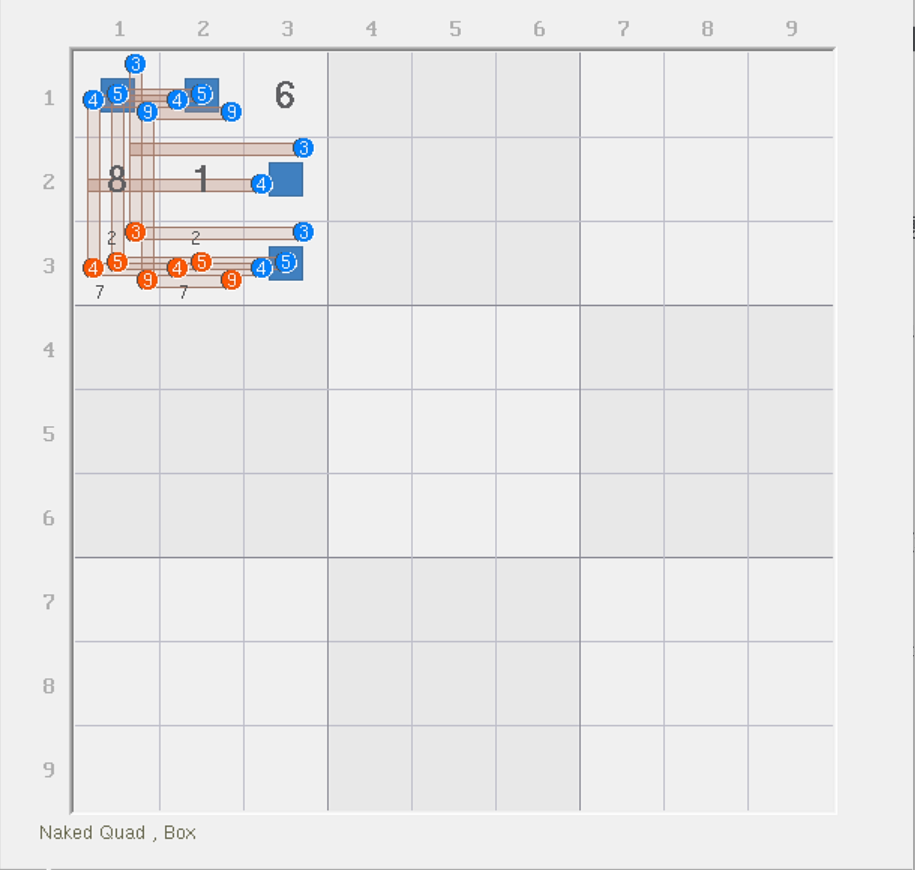
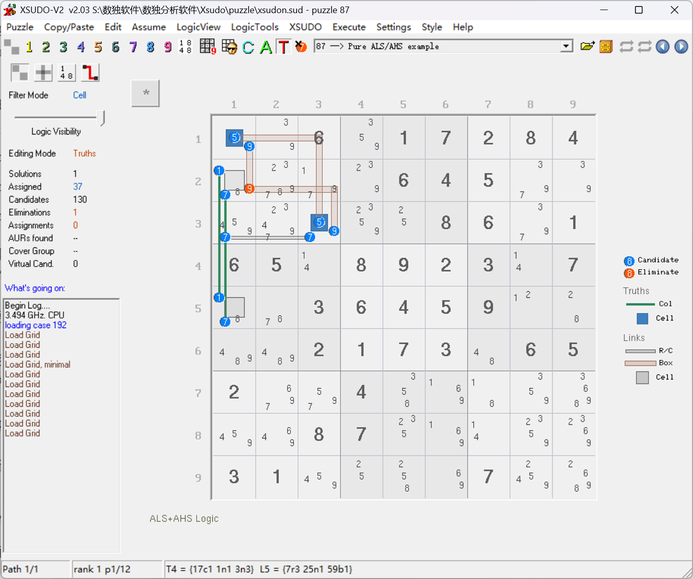
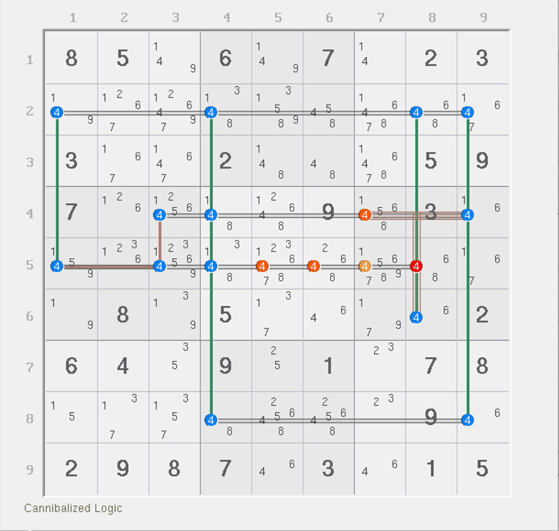

# 秩的定义

欢迎各位来到新的板块。这个板块你将会学习到数独里另外一个复杂的内容：**秩**（Rank）。

## 概念的由来 

可能你是数学系或计算机系的读者，学过线性代数的话肯定是知道这个概念的。秩在矩阵里看的是线性无关。你可以类比于求多元一次方程组（很多变量，但变量上面都没有次幂，或者说次幂都是 1）的每一个变量最终都等于几。将每一个方程里的变量配的系数，以及等号后的值一并排列起来，然后求原始方程在化简之后有多少个方程不等价。所谓等价就是说，化简之后他们之间就长得一样了，可以互相变来变去。那么不等价就是没有办法变成一样的（比如变量用得不一样）。

而在数独里，我们显然知道这肯定没有矩阵一说。但是，在数独里，我们借用了这个说法来表示一种结构的相似特征。

## 强弱区域的定义 

我们先来看一个例子。

<figure><figcaption>
三阶鱼（纯骨架）
</figcaption></figure>

如图所示。这是一个纯骨架的三阶鱼结构。其中实线（绿色）是鱼“生长的方向”，空心线表示删数的方向，其中橘色的 5（`r3c1(5)`）是删数。本题只标了一个删数。

> 请暂时忽略本图的配色方案和主题和之前不一样这一点，这个我们之后会详细说明。

之前在我们讲解三阶鱼的时候告诉大家，我们需要选择其中任意一个列（比如 `c3`），然后可以填的位置有 3 处，所以可以得到这个例子里一共有 6 个不同的摆放方式。

现在我们强行这么去规定它。

我们定义，像是图中的这三列，由于每一列都只有三处可用位置，它起到了排列的关键作用，因此我们把他称为**定义域**或**强区域**（Defining Set，Base Set 或 Truth），把删数用的三个行称为**删除域**、**删数域**或**弱区域**（Secondary Set，Cover Set 或 Link）。那么，这两个定义会具备这样的特征：

* **强区域：能且仅能填一个数**；
* **弱区域：最多能填入一个数**。

例如此题里，强区域是 `c357` 三列，而弱区域是 `r357` 三行。强区域的每一列，都必须在已有的三个单元格里必须填入一个正确的数；而弱区域的每一行，涉及结构的那几处位置里，最多只能填一个进去（毕竟同一行不能重复填相同数字）。

那么，我们可以得到这么一个东西：

**如果强区域数和弱区域数数量一样，而且弱区域也能完整覆盖强区域下所给的所有候选数，那么所有弱区域下不在强区域所覆盖的其余位置上的候选数均可删除。**

为什么可以得到呢？这里我们需要稍微使用一下抽屉原理。

强区域一个对应了一个必填的正确数字，所以 $$n$$ 个强区域就对应了有 $$n$$ 个必填的正确数字会被纳入其中；而弱区域却只能允许你最多往其中填入 $$n$$ 个数。因为弱区域涉及的候选数均覆盖了强区域给定的那些位置，所以要使得强区域和弱区域两者同时满足，你必须在填充数字时，让每一个弱区域都分配一个数字填入；否则强区域那边必然就会出现一个区域填入超出一个的填数，进而造成违背数独规则的矛盾。

既然如此，那么我们能将每一个弱区域下填充的填数放置在强区域所交叉的 9 个位置上排列，所以自然像是图中 `r3c1` 这种位置就是不可达的。所以它可以被删除。

## 秩的定义 

我们将前文的说法进一步推广，我们可以得到一个数值形式的定义：

* **结构的秩：最多可以容纳填充的数字的数量减去实际填入的数字的数量**。

记作

$$
r(结构)=N-M
$$

我们把结构的秩记作 $$r(\text{结构})$$；当不强调具体结构时也可以直接记作字母 $$r$$。其中， $$N$$ 表示最多可填的次数，而 $$M$$ 表示实际可填的次数。很显然，“最多可填”就是弱区域（因为弱区域用的就是“最多”来定义的）；而“实际可填”就是强区域（强区域用的是“恰好”来定义的），所以这一点此时又可以记作

$$
r(\text{结构})=n_\text{弱区域}-n_\text{强区域}
$$

请牢记此公式的定义。本式子会在后面的内容里进行灵活应用。

可以看出，该定义下会存在三种可能的取值：

* $$r\gt0$$：**结构合法，但存在较多填数模式，弱区域不一定可用于删数，需要具体情况具体分析**；
* $$r=0$$：**结构合法，且所有弱区域均可用于删数**；
* $$r\lt0$$：**结构不合法，因为最多可填次数都达不到结构规定的填充次数**。

该数值的绝对值一般都比较小，即稳定在 0 的左右两侧不远的地方。过大的秩会导致结构过于复杂，非常难以分析的同时，也几乎不存在删数的可能性。

是的，秩是可以取负数的。虽然这一点会造成结构不合法，但我们可以反向利用它，就和之前学习唯一矩形那样，为避免矛盾（秩为负）而作出一些必要的取舍。

## 区域是四维的 

虽然我们口口声声叫这些东西强区域或者弱区域，而区域一般指的是一个行、列或宫。但是，在秩理论里，区域除了这三种维度外，还存在单元格这种情况。

换言之，一个单元格里的所有候选数实际上也处于必须填一个的状态；因此，按候选数为单位来看的话，一个单元格也可以归为一个强区域，所以，区域具有四个维度：

* 单元格
* 行 + 数字
* 列 + 数字
* 宫 + 数字

<figure><figcaption>
显性四数组
</figcaption></figure>

比如说这个四数组，它的强区域是单元格 `r1c12` 以及 `r23c3` 四个单元格，一共四个；弱区域则是 `b1` 的候选数 3、4、5、9。

按秩的分析规则来看，四个单元格必须填充四个数字进去。而结构所用的候选数（`r1c12` 和 `r23c3` 里的所有候选数）均被 `b1` 里给的弱区域所覆盖，意味着 3、4、5、9 四种数字他们每一个都最多只能填一个。

计算秩可以得到 $$r(\text{显性四数组})=4-4=0$$，因此所有弱区域里除了强区域使用的数字外的其他位置，均可用于删数，所以本题的删数包含图中的 `r3c1(3459)` 和 `r3c2(459)` 一共 7 个。

一个数独盘面一共有 324 个不同的空间。

## 空间记号 

我们将前面四个维度称为**空间**（Space）。之所以叫空间，是因为候选数在这些个定义下是看的空间上的位置关系，所以叫空间。一个空间最多可以由 9 个候选数构成（一个区域配一个数只能有 9 个位置放；一个单元格最多也只能有 9 个候选数）。

我们将四种空间的类型分别使用 R、C、B、N 表示。其中：

* 单元格空间：行号 + N + 列号；
* 行空间：数字 + R + 行号；
* 列空间：数字 + C + 列号；
* 宫空间：数字 + B + 宫的编号。

例如，上面的三阶鱼的强区域可以表示为 `5c3`、`5c5` 和 `5c7`；弱区域则是 `5r3`、`5r5` 和 `5r7`。再比如上面的显性四数组，强区域记作 `1n1`、`1n2`、`2n3` 和 `3n3`，弱区域记作 `3b1`、`4b1`、`5b1` 和 `9b1`。

> 这里尤其要记住，单元格空间是写成先行后列的形式的，而其他三种则是把数字提前，这里稍微容易记错。

对于一组空间，我们也可以使用类似 RCB 记号的简写模式进行简写。比如说 `5c357` 或 `3459b1` 的写法。和 RCB 简写一样的是，如果字母前后都有合并时，则元素会自动进行排列组合，表示出所有的可能性。

## 秩理论的弊端 

很遗憾的是，秩理论虽然可以通过数值化结构来衡量复杂度和删数的规则，但是它仍然具有弊端——它不支持唯一矩形等依赖盘面唯一解的技巧。

这一点会在以后讲解致命结构板块里对此理论进行优化和推广，使之支持。

## XSudo 分析软件介绍 

还没介绍这个理论的作者呢。

这个人来自美国，叫做**罗伯特・艾伦・巴克尔**（Allan Barker），早在 2009 年左右就已经对秩理论完备进行了框架设计，并且实现成了软件。

可以看到，前面两幅图都是截自这个软件，UI 界面看着确实有些老气。

<figure><figcaption>
XSudo 软件截图
</figcaption></figure>

如图所示。

软件配色使用实心线条表示一个强区域，而使用空心线条表示一个弱区域。其中宫空间会使用折线表示，以方便呈现连接状态；另外，删数会使用橘色表示普通删数、深红色表示自噬删数、橘黄色表示删数范围。

<figure><figcaption>
复杂的鱼结构
</figcaption></figure>

如图所示。该技巧的推理逻辑以后会有详细说明，这里仅供配色方案的介绍使用。

另外，软件提供了候选数旋转的机制，在需要连接复杂的强弱区域时，候选数的编排位置会稍微进行一定程度的逆时针旋转，避免候选数遮盖关系分不清楚强弱区域。
