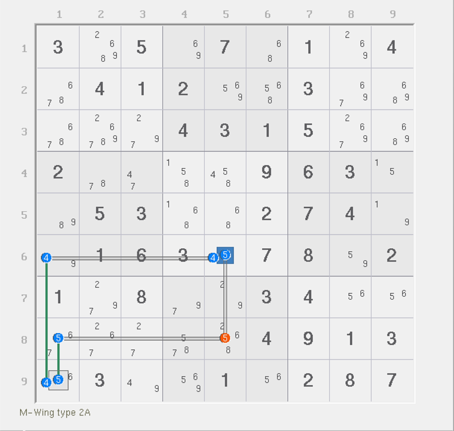
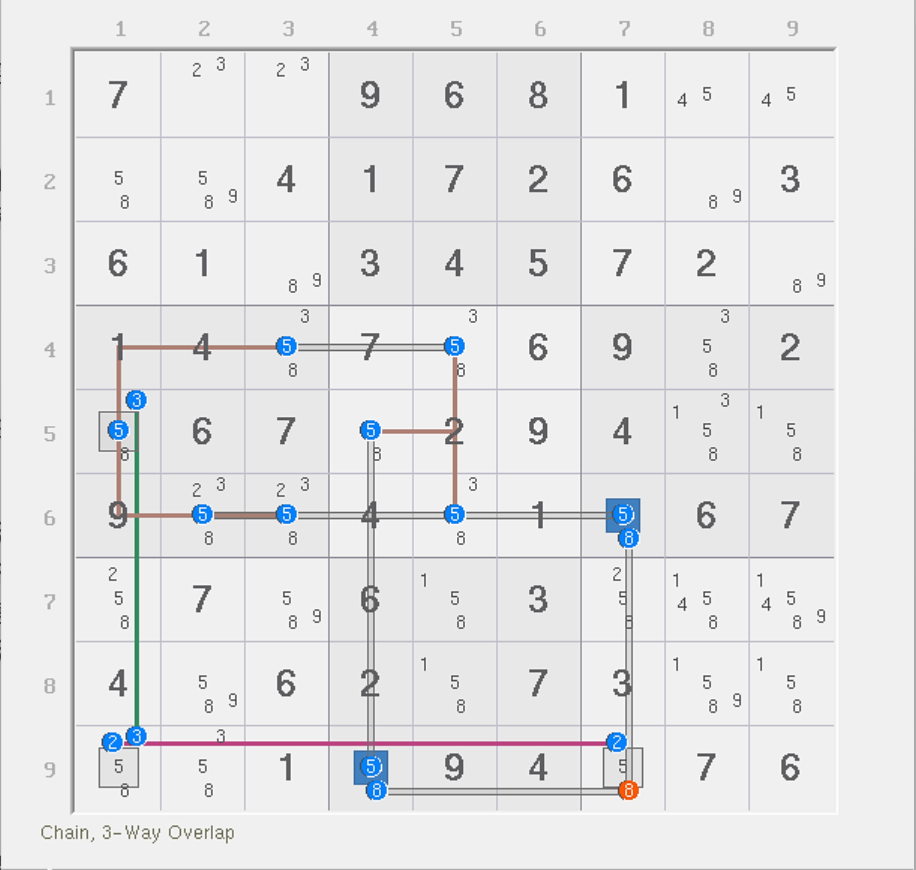
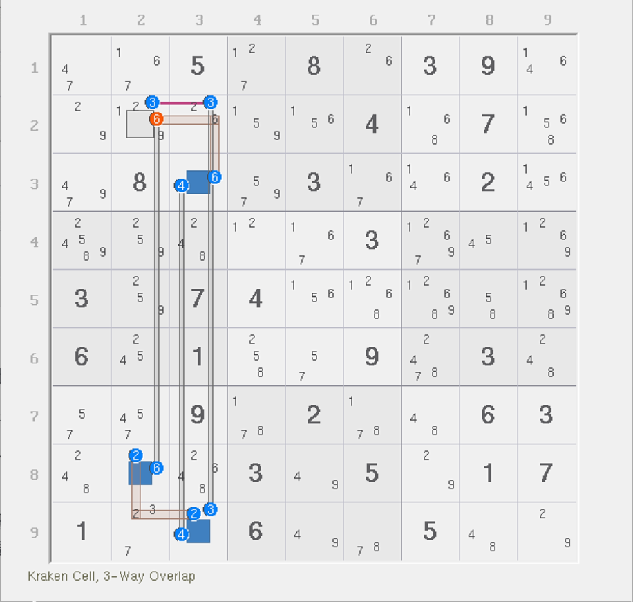
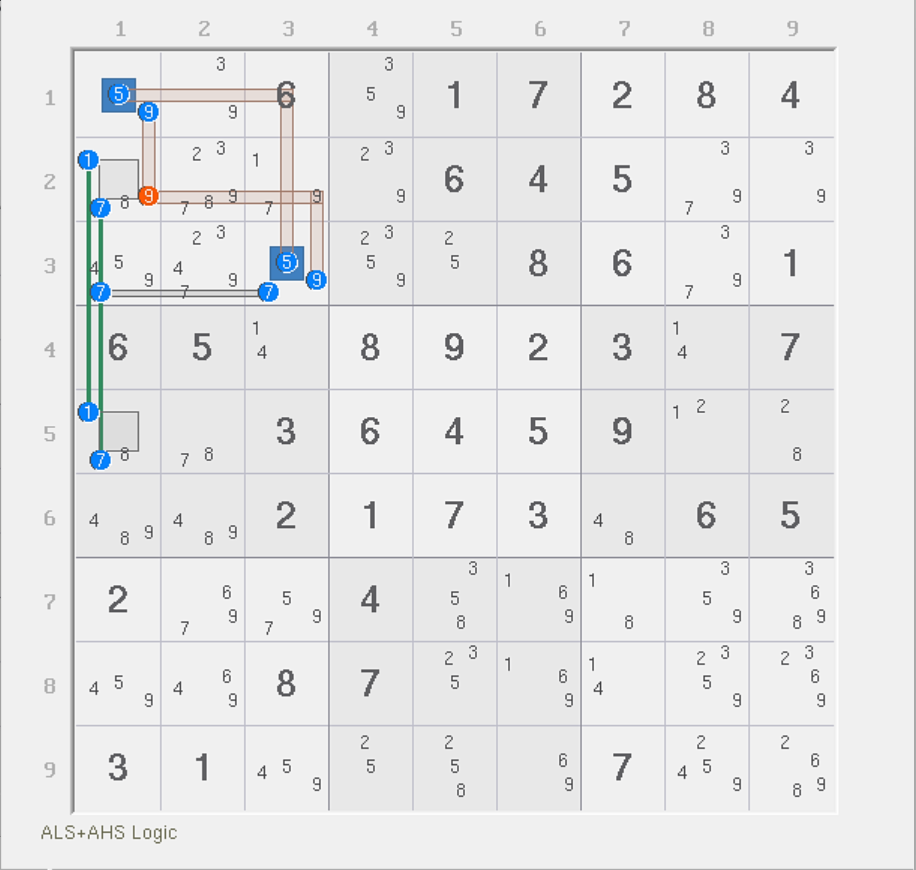
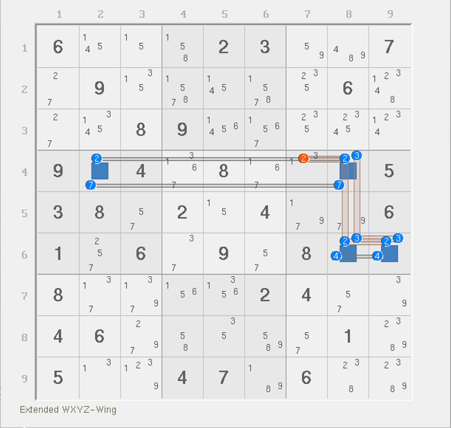
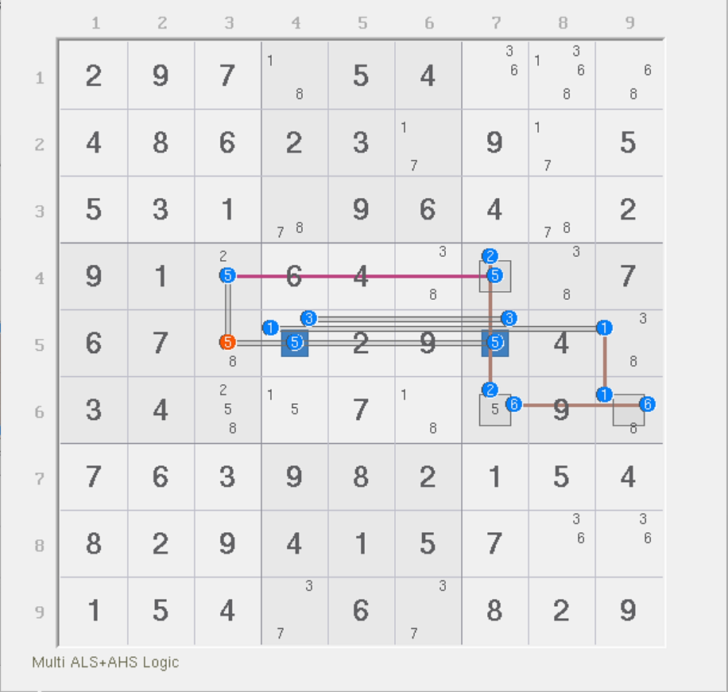
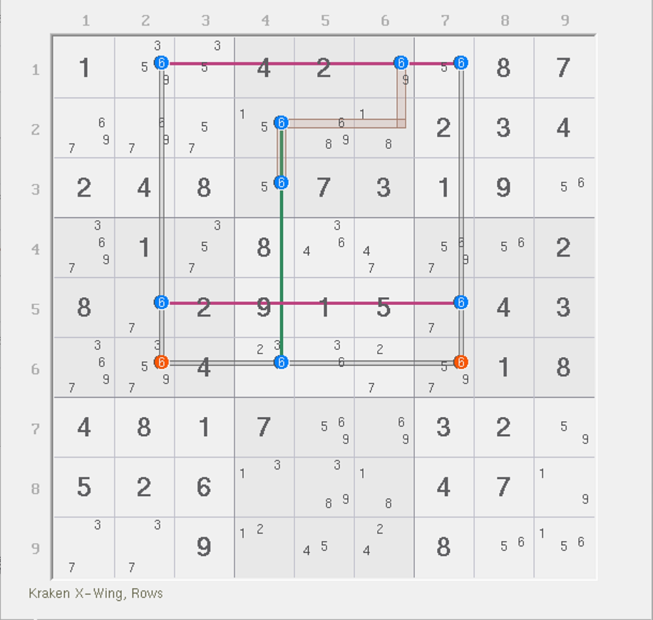

# 正秩结构

前面的内容里我们介绍了秩为零的情况。今天我们继续来看秩为正数的情况。

## 普通链

<figure><figcaption>
M-Wing
</figcaption></figure>

如图所示。这是一个很普通的 M-Wing 结构，其删数是 `r8c5(5)`。

很明显，这个删数破坏了之前零秩结构的表示方式：一个候选数只能被一个强区域和一个弱区域所覆盖。不过好在，这个题比较简单，整个结构只有删数不满足这一点，其他的候选数均是正常的。

这次我们不使用链来看删数。这次我们来用秩的理论来理解它。因为除了删数外，所有的数字均是满足覆盖规则的，那么我们不妨倒过来看。假设删数为真，那么删数会因为为真的关系，`5r8` 和 `5c5` 两个弱区域会被干掉。这样的话，实际结构的弱区域就会少两个单位，于是秩就会比原来小 2 个单位。

而原来呢？原来结构的秩是 1。为什么是 1 呢？因为强区域有 3 个，意味着我们必须填 3 个数字进去作为实际的结构稳定存在的填数；而弱区域呢？4 个。如果我们把删数也作为结构的一部分的话，那么整个结构会允许最多可以填入 4 个数字进去。注意，我这里说的是“最多”，而非实际填数，看的是弱区域不同真的定义得来的：一个弱区域等于说是“只能最多填 1 个”，也就意味着里面可填可不填。转为数学语言的话，就是 $$\le1$$ 个的意思；那 4 个弱区域就等于是 $$\le 4$$ 个的意思，因此最大是 4 个。所以，预期最多可以填的是 4 个，实际填的是 3 个，所以差值是 1，故秩为 1。

那么，如果当删数位置为真时，因为会同时干掉两个弱区域，所以最大可填的数量从 4 会变为 2。秩最终会变为 -1。秩为负数的时候是错误的结构，所以直接形成矛盾了。

至于为什么秩为负就是矛盾的，这一点其实之前也有说过，这里再趁着例子解释一次。因为弱区域表示最多填几个数的意思，所以删数为真会使得结构只剩下两个弱区域，也就是说这个结构只能填 $$\le2$$ 个数进去；但强区域约束要求我们必须填恰好 3 个数（即 $$=3$$ 个数）。两者联立起来就会发现，最多可填次数（2）都比实际要填的次数（3）要小，所以我们无论如何都找不到一个合理的填数模式，所以结构矛盾了。

这便是秩在为正数的时候的用法：找出强区域和弱区域数，仍然需要满足每一个候选数都必须恰好被一个强区域和一个弱区域所覆盖的规则，这样方便我们对结构进行假设和推演，得到最终的结果。这种秩为正数的结构被我们称为**正秩结构**（Positive-Rank Pattern）。

## 覆盖规则更新 

在前面的例子里，我们看到，删数其实是不符合被一个强区域和一个弱区域覆盖的规则的（它实际上压根也没被强区域覆盖，只被弱区域覆盖了，而且还是一连被俩覆盖）。但是好像例子里也就只有删数不满足。它是否说明只要这样干，那么它就一定是删数呢？

实际上不是的。这一点证明会需要更靠后一点知识，所以这里暂且不表。总之，我们目前要求的覆盖规则必须满足如下两点：

1. 覆盖规则：**结构的每一个候选数都必须被恰好一个强区域和一个弱区域所覆盖；**
2. 删数规则：**可以允许候选数被多个弱区域覆盖，但它为真的状态必须导致秩为负数。**

这是一个简易版的正秩结构所必须满足的规则。

## 所有的链都是正秩结构吗？ 

这是一个好问题。链的删数几乎看的都是头尾的交集，因此答案是，是的。当然，如果你把环也当成特殊的链的话，那答案就不是了。因为环的秩是为零的，因为强弱区域数相等。

看起来链理论还存在一些特殊的链结构，比如说强制链、动态链什么的。不过之前我们学到的动态链思路和强制链似乎仅仅将链的路径进行了分支考虑，而并未改变覆盖的规则（即前文覆盖规则的第一点；第二点是用于删数而非节点本身）。所以，所有的链都是正数秩的。

但是在链理论里，除了动态链较为复杂以外，所有剩下的链（强制链、普通链什么的）均都是线性的延展思路，即里面没有分支，就是单纯在进行强弱链关系的交替，所以结构都不怎么灵活。动态链虽然允许了分支，但本质上动态链的长相也比较像是在试数，平时也不便于观察，因此理论上链可以很复杂，但是实际上链其实仍然不够灵活。

而非常有意思的是，在学了秩理论的基础内容后，我们发现链可以推广到非常复杂，以至于很多用链根本看不了的东西（各种动态分支），却可以被秩理论给轻松拿下。下面我们就来看一个。

## 例子 1：秩为 2 的结构 

<figure><figcaption>
秩为 2 的结构
</figcaption></figure>

如图所示。这个结构略显复杂，但好在结构没有破坏前文描述的覆盖规则，所以比较容易分析。

我们把删数 `r9c7(8)` 单独考虑，它同时被 `8c7`、`8r9` 和 `9n7` 三个弱区域所覆盖。强区域一共有 6 个，弱区域一共有 8 个（含删数用到的三个弱区域），弱区域意味着最多填 8 个数，强区域则意味着只能恰好填 6 个数，所以这个结构的秩为 2。

因为除了删数这个地方比较特殊，所以我们假设它为真，看看会如何。如果假设删数为真，则三个弱区域会消失。但是要注意的是，看起来这个 `2r9` 是链到删数的所在单元格的，但这个强区域用的数字是 2 而不是 8，所以仍然跟实际删数无关，因此删数只被弱区域所覆盖。

而实际假设其为真后，因为 3 个弱区域都会被干掉，而强区域则一个没少，所以秩会减少 3 个单位，故从 2 变为 -1。因为秩变为了负数，所以结构就矛盾了。所以删数结论是成立的。

我们再来看一个例子，不过这个比讲解的例子要简单一些，所以就自己看了。

<figure><figcaption>
秩为 2 的结构，另一个例子
</figcaption></figure>

如图所示。这个就自己理解了。

## 例子 2：秩为 1 的结构

<figure><figcaption>
秩为 1 的结构
</figcaption></figure>

如图所示。这个例子里也是符合覆盖规则的。

可以看到，这个结构一共有 4 个强区域和 5 个弱区域，所以秩为 1；当删数 `r2c1(9)` 为真的时候，因为它被两个弱区域覆盖，所以秩从 1 变为 -1，就造成了矛盾。

不过这个题稍微不同于最开始那个题的原因在于，它要看成链的话，也得是个动态链，很显然 `7c1` 是有分支的。显然写分支就不如直接看秩来得好理解一些，毕竟也符合覆盖规则。

下面再展示一个秩为 1 的结构给各位自己理解。

<figure><figcaption>
伪数组
</figcaption></figure>

如图所示。这是一个伪数组。因为 2 可以跨区出现，所以 2 最终会作为删数。这次希望你用秩理论理解它，应该也不算难。

## 例子 3：秩为 1 的结构 

<figure><figcaption>
秩为 1 的结构
</figcaption></figure>

如图所示。这个例子又要比前面的稍微复杂一点。不过也还行。

先看覆盖规则是否满足。显然是满足的。所以再看删数。删数此时被两个弱区域覆盖。而强区域总数有 6 个，弱区域有 7 个，所以秩为 1。

如果删数 `r5c3(5)` 为真，则两个弱区域会被干掉，强区域则不受影响，故整个结构的秩序会从 1 变为 -1，造成矛盾。所以删数结论成立。

## 例子 4：毛刺鱼 

<figure><figcaption>
毛刺鱼
</figcaption></figure>

如图所示。这是一个毛刺鱼。这次我们来用秩理论来看它。

这个结构的秩为 1，因为强区域有 3 个，弱区域有 4 个。

显然，删数有两处。每一个都被两个弱区域覆盖。先来看左边这个 `r6c2(6)`。如果它为真，则两个弱区域会被干掉，于是弱区域少俩，秩从 1 变为 -1，导致矛盾；右边那个完全是一样的推演，也可以从 1 变为 -1。
