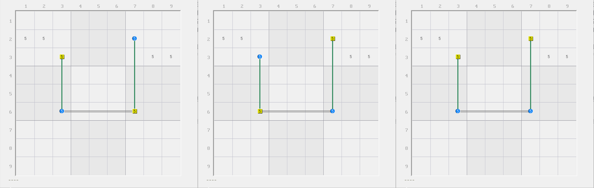

# 强三元组的基本推理

## 强三元组 

<figure><figcaption>
强三元组
</figcaption></figure>

如图所示。我们可以看到，本题一共有三个强区域和三个弱区域，但看起来有些奇怪。

我们发现，`r6c4(5)` 这个位置非常特殊，它处于两个强区域和一个弱区域的交点上。这一次不同于前面的所有例子是，它既在强区域上也在弱区域上，而且还不是正常的覆盖模式。

我们思考一下它会出现什么特殊的情况。假设 `r6c4(5)` 为真，则整个结构只能填两个数，一个在 `r6c4`，而另外一个在 `r3c26` 的其中一个位置上。似乎这两个位置的填充就足以让三个强区域得以全部覆盖，并不需要真正意义上填入三个数。

那么如果为假呢？如果 `r6c4(5)` 为假，就说明我们把这个特殊情况给排除掉了，剩下的位置均是被一个强区域和一个弱区域所覆盖的标准模式。那么想都不用想，它剩下的部分一定是正常的填 3 个数进去。

可以看出，当有了 `r6c4(5)` 的存在，整个结构实际填入的数字的总次数就会变为不定的数值。它可能是只填两次，也可能填三次，这将直接导致我们秩的结果不定。我们把某个候选数同时处于两个强区域和一个弱区域的特殊现象称为**强三元组**或**强三角区**（Truth Triplet）。

## 强三元组的用法 

### 用真假讨论理解 

我们知道它的定义了，下面我们来看看它究竟怎么发挥作用。

我们还是回到刚才的题目里。

<figure><figcaption>
强三元组，还是刚才那个结构
</figcaption></figure>

如图所示。可以看到，就只是单纯这个结构就已经可以存在删数。这是怎么得到的呢？我们来试着把刚才的分析过程严谨化一些。

讨论 `r6c4(5)` 的真假性。如果它为真，则我们会直接引发删数，因为 `r6c4` 恰好在 `c4` 删数这一列上；而如果它为假，则由于我们要保证三个强区域都有所覆盖，而现在弱区域还有三个仍未发生变动，所以结构剩下的情况是零秩的。所以，每个弱区域按理说都可以用于删数，所以这也包含 `c4`。

> 当然，这个题比较简单，如果你继续往下试数的话，你会发现，因为 `5r6` 和 `5b5` 是两个强区域，但只有两处摆放位置。我们都假设 `r6c4` 不填 5 了，那么理所应当地会直接使得 `r6c2` 和 `r5c6` 同时填 5。这样一来，会得到 `r3c4` 是唯一可以填在 `5r3` 这个强区域的位置。而 `r3c4` 此时刚好也在 `c4` 上，所以 `c4` 也可以用于删数。

总之，不论 `r6c4(5)` 的真假性，都可以得到删数合理成立，所以 `c4` 的别处都不能填 5。这便是强三元组的实际引发的效果。

### 用秩理解 

可能你看得懂我想说什么，但是看起来这个推演似乎不足以有一个通用的解题逻辑。换言之，它看起来好像只是这个结构的巧合。似乎不够通用。

下面我们就带着大家使用秩理论理解强三元组的魔法。

首先，整个结构是有三个强区域和三个弱区域的。我们先无需关心这个结构的秩是多少，因为它的实际填充次数并不知晓，因为并不存在一个稳定的大小（它可以填两个也可以填三个）。

我们这次反过来想。假设我们让删数成立，会出现什么情况。假设删数任意位置为真，那么都会使得这个结构 `5c4` 这个弱区域消失（毕竟填了数字之后这个弱区域都没办法标到图里了）。消失但是强区域数量并未发生变化，还是三个，只是说三个强区域要分配填数的所有可能位置里，刚好处于 `c4` 上的部分是无法填了。这恰好把我们最棘手的强三元组给干掉了。

但是，剩余结构对吗？不对。因为剩下三个强区域，却只有两个弱区域了。这么算下来秩就成为了负数（2 - 3 = -1）。这必然是矛盾的。所以，删数为真这个状态不成立，故要删除他们。

## 秩的新算法 

### 新的公式 

那么问题来了。既然我们只能确保它能讨论出矛盾，而实际填入的数字的数量却不是一个定值，所以无法计算秩（秩按照原有的定义是用最多填充减去实际填充，但实际填充不是定值，所以结果不是定值）。这并不是我们想要的。所以，我们应更加合理地对秩进行定义。

我们只需要把之前的“恰好”改成“最少”，而把“最多”保留（即只替换掉 $$n_{fact}$$），就可以得到如下的新定义：

$$
r=n_{max}-n_{min}
$$

于是，上述结构的秩就等于 $$r=3-2=1$$。在本题里，导致矛盾的本质原因是秩从 1 变为了 -1，减小了被减数 3 而增大了减数 2，这两方面同时造成的：因为填充删数位置使得被减数 3 减小为 2（最多可填位置少了一处）；而减数从 2 变为了 3（实际需要填的位置的强三元组被我们干掉，所以强区域必须不得已填 3 个才能完整全覆盖，反而引起填充次数的最小值增大）。

可以看到，这个式子和之前的定义里的 $$n_{fact}$$ 有所不同，它更侧重真实填充的总次数，而非一个定值，所以解决了无法计算这种结构的秩的问题。另外，这个例子即使篡改了其中一个参与计算的数值，但仍然是兼容早期的定义的。因为之前的结构都不会出现填充次数不定的情况，也就是说 $$n_{fact}$$ 在之前是一个定值；而对于这个式子而言，代入的最少次数由于对于早期的结构是稳定次数的而言，所以 $$n_{min} = n_{fact}$$。

### 一个潜在的问题 

显然，在你看到这个公式后，虽然解释已经足够清晰，但仍然看着非常别扭。我们虽然知道之前的 $$n_{min} = n_{fact}$$，但似乎因为结构稳定，所以似乎也有 $$n_{max} = n_{fact}$$ 这个等式成立。也就是说，三个数在早期的定义下是均等的，所以如果我们强行代入之前的例子进去，这样无论如何算出来的结果都是 0（毕竟减号两边的操作数总是相等的）。这岂不是在说之前的结构的秩一定为 0？是的，问题非常有意义，我稍微解释一下。

### 从线性代数切入 

要解释清楚它，我们就需要回到最本质的地方来说明这一点。数独里的秩理论的灵感确实来自于线性代数（矩阵）的秩的概念。而在线性代数里，秩和线性无关这个概念绑定。考虑到读者可能不一定对线性代数有充分的认识（甚至可能都不是学生），所以再三考虑，这一块的内容这里我们就不展开说明了。这里我们为了方便各位理解，我们尽量使用自然语言描述。举个例子，你在初中时代肯定学过一元一次方程组（就是一组方程，式子每一个变量都是一次的，或者说变量右上角的次幂都是 1），然后给了一组方程，每一个方程都有若干个不同的变量。你需要根据这些方程组，联立起来将变量全部求出。但是，有些题如果出得不太好，就会存在一个特殊现象，即在你计算期间会发现两边的方程组可能代指的是完全相同的同一个方程表示。换言之就是，你可能算着算着发现两个方程表达式一个是 $$x_1 + 3x_2=4$$，另一个是 $$2x_1 + 6x_2 = 8$$。你把第二个式子的系数和等号右边的结果都除以 2 就会发现它其实就是第一个式子。这种式子我们称为“线性相关”，也就是说它的存在毫无意义——因为俩式子一样，其中一个式子有用，那么另外一个式子就必然没有存在的必要了，毕竟这个式子的信息完全被之前那个式子所覆盖。既然线性相关指的是方程“无效”的效果，那么线性无关自然就是有效的方程了。

它是不是很像是数独里结构强弱区域的设计？实际上确实如此，变量就好比是数独结构里的候选数节点；每个强区域都是一个一个的方程，弱区域则对应说是将方程组联立之后，对一个变量而言，所有用到该变量的所有方程。只不过，在数独的秩理论里，秩的定义更像是在求变量和有效方程数量之间的关系，而不是单指有效方程的数量，这个定义更适合用于数独里，所以稍微有一点设计上的不同。我们更希望将结构的有效性充分体现在数值上，所以秩的结果看的是有效填充次数，能满足每一个强区域都符合条件的同时，还能正常造成删数的效果，所以在设计上，数独的秩理论更侧重有删数和结构的有效性，而非得出变量的结果，目的稍微有所不同。

在定义设计上，上面的公式（求差运算）暗含的意思是在看结构的可删数性（是否可以用作删数）。我们把强区域类比于变量的数量，弱区域类比于方程的数量，那么按照公式作差，我们也可以得到三种情况：

* 差值为正整数：变量数比方程数多，说明变量可能有一部分可以求得，但可能就不能全部求得了；
* 差值为零：变量数和方程数一样多，如果方程都有效，那么自然全部变量都可以求得；
* 差值为负整数：方程数比变量数多，且不说变量是否可以求得，方程自身就有“冲突”。

我们按照“删数是否存在”这个说法作为我们的目标来看的话，那么这个差值就可以代指结构删数的状态，这便是这个定义想表达的效果。

### 新公式的诞生 

那么，回到最开始。我们定义秩的计算本质是想衡量删数的存在性，所以我们必须要知晓的是结构里能够形成正常填充（不违背数独规则的填充）都能具备什么特征。最直观的特征就是看是否所有的可能填法都能造成相同的删数，其次是看结构到底填入了多少个候选数（使得多少个候选数为真）。

造成删数的本质是取填数的交集，其实就是跟鱼鳍类似，看两种填法是否都有一样的删数结论存在。只不过结构在这里越复杂，那么从鱼鳍类比到这里来的结构的可用填充状态数（不同的填入候选数的排列情况）也就越多。比如一个结构有 20 种不同的排列填法，其中每一种填入的位置最终都能让 `r9c9` 填入数字 1、2、3 的其一，那结论自然就是 `r9c9 <> 456789`。

那么，除了结构能否造成删数，那么结构还需要有一个衡量标准，就是看它内部到底填了多少个候选数。举个例子。如果 20 种不同的填法里，其中 6 种只需要让结构填 4 个候选数就可以保证强区域满足条件，而剩下的 14 种则需要填 5 个候选数才能满足条件的话，那么这个结构一会儿填 4 个候选数一会儿填 5 个的情况自然就说明结构存在三元组：因为三元组的占位状态会影响结构的填充次数的多少产生变化。我们必须要考虑到这一点，因为之前的公式是衡量不出来的（因为填数次数不稳定，因此并没有一个固定的数值参与计算）。那么， 为什么最大填充次数减去最小填充次数就能得到结果了呢？因为这么定义并不要求我们非得对强区域数量和弱区域数量作为衡量标准之一，避免了三元组导致结构“不稳定”填充的问题；与此同时，用实际填充的最多和最少候选数数量其实就是拿着“答案”在比对：因为你可以穷举出全部的排列，直接根据结果得到实质上的差值不也可以描述出一样的东西吗？

## 删数的秩 

但是，我们避不开的问题出现了：这个公式有个问题是它确实会造成前面链结构等根本用不到三元组的情况下，反而通过这个计算得到秩一定为 0 的情况。这说明公式错了吗？是，但不完全是。

我们就拿最基础的摩天楼举例。摩天楼是两个强链和一个弱链构成，而我们知道，摩天楼的两个强链各自都需要出一个数，所以整个结构可以产生的合理排列的情况数量是 3 个。

<figure><figcaption>
三种排列情况
</figcaption></figure>

如图所示。这个结构所有 3 种排列情况都是需要填入两个数的，所以这个结构最多只能填两个，最少也必须填两个，因此这么算下来，秩自然为零。

但是，这个式子算出来为 0 所代表的含义是，这个结构是稳定填两次的，它意味着我们的结构里面的所有数字都会正确派上用场，即有效。但是，我们在刚才的方程组的举例里有详细的描述，这种有效并非带来有效的结论。方程组仍然可能无法确定变量的正确结果，对于数独的结构而言，也就是说全部的数字有效也不代表它会有正常的删数存在。

在这个例子里，光凭我们标注的一个弱区域和两个强区域是不足以得到删数的。我们知道，要想删数，我们必须要纳入 `5r2` 和 `5b1` 这两个弱区域才能得到 `r2c12(5)` 的删数结论；同理，我们要同时纳入 `5b3` 和 `5r3` 才能保证删数能纳入 `r3c89(5)` 的结论。但刚才的结构里没有标注它们，因为两端的 `r2c7(5)` 和 `r3c3(5)` 只有强区域覆盖了，而弱区域并未覆盖进来。

所以，按照全候选数都有覆盖的规则，我们必须强行加入至少两个弱区域，才能具备删数的条件。而纳入之后我们可以知道，删数存在肯定看的是两端 `r2c7(5)` 和 `r3c3(5)` 不同假才造成的删数。但是，这个时候我们再看就会发现不同的地方：上方展示的三种填法下，前面两种想要使得删数成立，我们仅需要一个位置占位就行（要么 `r2c7(5)` 为真就可以引发删数，要么 `r3c3(5)` 为真也能引发删数）。但是第三种情况不同，两端都为真了。这意味着造成删数我们最多可以填两个位置。最少呢？最少就是 1 个。我们拿 2 减去 1 就可以得到 1 的结果。

发现问题了吗？是的。公式想要表示的含义是局部分析：看删数存在的地方，并确定删数是如何正常造成删数的。这个例子里，造成删数的其实仅仅用得上 `r2c7(5)` 和 `r3c3(5)` 两端，别的位置（如 `r6` 上的两处 5）并不是很关心。

那么，我们将引发删数所需要建立起来的弱区域单独提出来讨论的话，那么删数的占位状态确实会有不同的地方。如果我们使用刚才的理解方式往删数上套，我们可以得到删数确实存在两种不同的删数情况。

## 对新算法的总结 

那么，通过这么定义的话，秩的定义就会有如下两种形态：

* 结构的秩：看结构整体的占位状态，具有两种情况。
  * 如果结构除删数外的所有候选数均被一个强区域和一个弱区域覆盖：**用弱区域数和强区域数求差**。
    * 如果秩为零，则说明结构所有弱区域都必然可以造成删数；
    * 如果秩大于零，则说明删数的存在需要依赖多个弱区域，此时结构的秩等于此删数的秩（删数的秩的讨论情况在后面的分支里列出）；
    * 如果秩小于零，则结构无法稳定存在，直接矛盾。
    * **因为所有除删数外的候选数均是普通连接，所以其结果和使用删数的秩的计算规则算出的结果完全一样**。
  * 如果除了删数外还存在被非一个强区域和一个弱区域覆盖的候选数：**用结构最多可填次数和最小可填次数求差**。
    * 如果秩为零，则说明结构的填充是稳定的，但是因为结构此时带有三元组，所以强区域数和弱区域数可能和实际填充的次数不相等，需要具体情况具体分析。
    * 如果秩不为零，说明结构内可填的候选数数量不同。
    * **这个结果只能反映它的稳定状态，一般不使用此值判断结构的删数情况；但这个计算不会造成秩为负数的结果**。
* **删数的秩**（Rank of Elimination）：**看删数所有相关弱区域上的占位状态，确定弱区域占位最多和最少次数求差**。
  * 如果删数只关联一个弱区域：
    * 如果秩为零，说明弱区域上必然可以造成填数，所以此时删数的原因是它类似环逻辑的弱链删数形式，此时我们称这个弱区域为**零秩区域**（Rank-0 Set）；
    * 如果秩不为零，则因为此时需要超过一次的填充才能使得秩不为零，但只关联了一个弱区域，所以客观不存在这种情况。
  * 如果删数关联多个弱区域：
    * 不论秩为多少，删数都成立，但一般此时的秩是一个不为零的值（为零则表达的是若干弱区域上每一个都分配一个位置填，且结构所有的合法排列都符合此规则）。

因此，根据这一版的说辞，上述摩天楼的结构的秩等于 1（3 个弱区域减去 2 个强区域），删数的秩等于 1（最多 2 个弱区域同时占位，最少 1 个弱区域），强行套用新公式并认定结构的秩为 0 也正确，但不能解释删数。

另外，我们需要注意如下三点：

1. 一个结构的秩按照不同的算法可能计算结果不同，但它们确实可以同时都正确也不矛盾，因为套用此式子所得的结构的秩没有考虑删数，删数的秩需要单独讨论。
2. 一个结构的删数可能同时包含多个不同的删数的秩，比如某个结构里有些删数的秩是 0，而有些是 1。
3. 在讨论期间，只要强三元组占位为真，那么结构的秩就会下降。秩的计算公式里，最大可填次数（被减数）会变小，而最小可填次数（减数）则没有发生变化。

在设计上，新的式子计算规则显然和旧版本并不“兼容”，这可能会导致两个式子算出来的结果完全不相同，这使得秩理论的底层设计尤为复杂。但是很显然，有了强三元组之后，结构可填次数本身就会受影响，确实早期式子代入计算也不适用了。当然，之前的式子也不是永远都用不到了。在以后的内容里，我们会对三元组的占位状态进行复杂的分析，它可能会在结构的子结构（去除一些强弱区域后的部分）里派上用场。

## 一个例子 

下面我们来看一个实际的例子。

<figure><figcaption>
一个例子
</figcaption></figure>

如图所示。这个例子有四个强区域和四个弱区域。很显然，`r4c5(1)` 是强三元组。按照讨论的方式，假设它为真，则直接引发删数；如果它为假，则余下的结构将不存在任何的强三元组，进而退化为标准结构。强区域和弱区域数量都未发生变动，因为你还可以填在其他位置上，按理说还需要进一步讨论。但是很明显，因为这个例子比较特殊，强三元组就这一处，去掉后结构就成普通的了，于是强弱区域仍旧是相等的，故此时秩为 0，直接按零秩结构删数即可。

按两种情况讨论可以发现，不论哪一种，`1r4` 都是可以删数的弱区域，所以这个题的结论是 `r4c8 <> 1`。

那么，这个题的秩是多少呢？按照推广定义，最多这个结构可以填 4 个数进去（只要安排的时候能保证不叠在三元组上就行），所以被减数是 4；而最少呢？最少是 3 个。只要填在 `r4c5` 上就只能填 3 个了，所以减数是 3。所以，这个结构的秩是 $$r(\text{鱼})=4-3=1$$；而删数的秩为 $$r(\text{删数}) = 1 - 1 = 0$$，因为删数只关联了一个弱区域，该弱区域在任何情况下，`r4c357(1)` 都有一个数为真，所以该弱区域最多出现 1 个为真的候选数，最少也是 1 个。换言之，`1r4` 这个弱区域是一个零秩区域。

下一节我们将带着大家看一些例子，讨论强三元组的使用。
