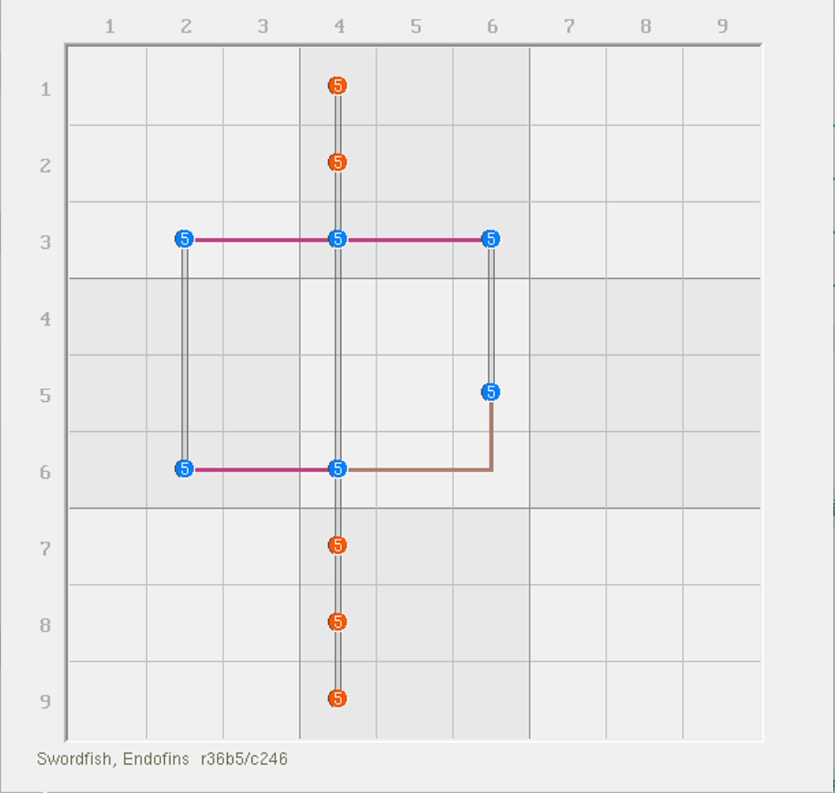
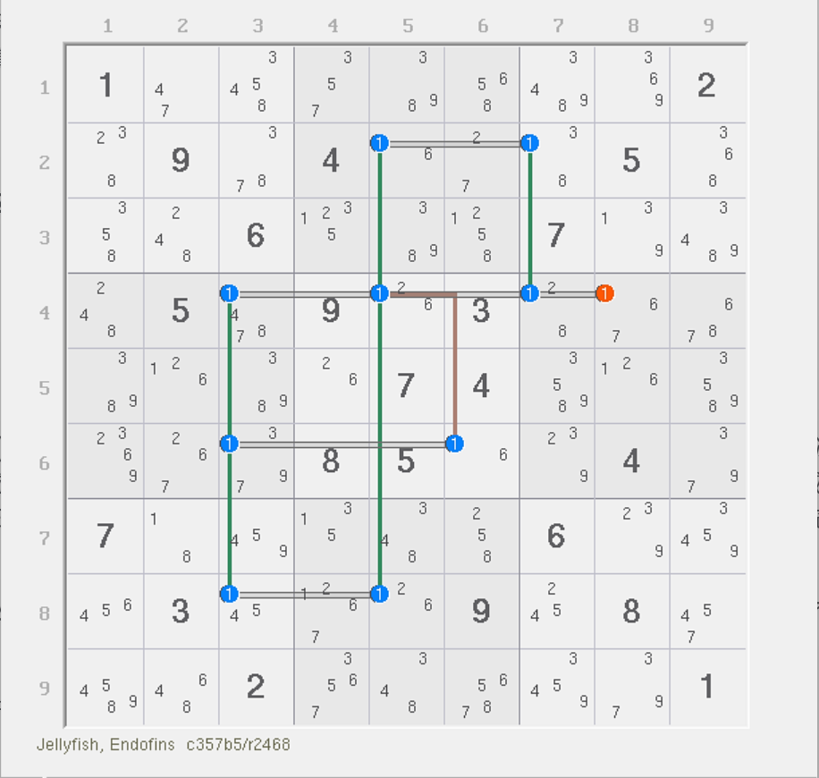

# 强三元组的基本推理

## 强三元组 

<figure><figcaption>
强三元组
</figcaption></figure>

如图所示。我们可以看到，本题一共有三个强区域和三个弱区域，但看起来有些奇怪。

我们发现，`r6c4(5)` 这个位置非常特殊，它处于两个强区域和一个弱区域的交点上。这一次不同于前面的所有例子是，它既在强区域上也在弱区域上，而且还不是正常的覆盖模式。

我们思考一下它会出现什么特殊的情况。假设 `r6c4(5)` 为真，则整个结构只能填两个数，一个在 `r6c4`，而另外一个在 `r3c26` 的其中一个位置上。似乎这两个位置的填充就足以让三个强区域得以全部覆盖，并不需要真正意义上填入三个数。

那么如果为假呢？如果 `r6c4(5)` 为假，就说明我们把这个特殊情况给排除掉了，剩下的位置均是被一个强区域和一个弱区域所覆盖的标准模式。那么想都不用想，它剩下的部分一定是正常的填 3 个数进去。

可以看出，当有了 `r6c4(5)` 的存在，整个结构实际填入的数字的总次数就会变为不定的数值。它可能是只填两次，也可能填三次，这将直接导致我们秩的结果不定。我们把某个候选数同时处于两个强区域和一个弱区域的特殊现象称为**强三元组**或**强三角区**（Truth Triplet）。

## 强三元组的用法 

### 用真假讨论理解 

我们知道它的定义了，下面我们来看看它究竟怎么发挥作用。

我们还是回到刚才的题目里。

<figure><figcaption>
强三元组，还是刚才那个结构
</figcaption></figure>

如图所示。可以看到，就只是单纯这个结构就已经可以存在删数。这是怎么得到的呢？我们来试着把刚才的分析过程严谨化一些。

讨论 `r6c4(5)` 的真假性。如果它为真，则我们会直接引发删数，因为 `r6c4` 恰好在 `c4` 删数这一列上；而如果它为假，则由于我们要保证三个强区域都有所覆盖，而现在弱区域还有三个仍未发生变动，所以结构剩下的情况是零秩的。所以，每个弱区域按理说都可以用于删数，所以这也包含 `c4`。

> 当然，这个题比较简单，如果你继续往下试数的话，你会发现，因为 `5r6` 和 `5b5` 是两个强区域，但只有两处摆放位置。我们都假设 `r6c4` 不填 5 了，那么理所应当地会直接使得 `r6c2` 和 `r5c6` 同时填 5。这样一来，会得到 `r3c4` 是唯一可以填在 `5r3` 这个强区域的位置。而 `r3c4` 此时刚好也在 `c4` 上，所以 `c4` 也可以用于删数。

总之，不论 `r6c4(5)` 的真假性，都可以得到删数合理成立，所以 `c4` 的别处都不能填 5。这便是强三元组的实际引发的效果。

### 用秩理解 

可能你看得懂我想说什么，但是看起来这个推演似乎不足以有一个通用的解题逻辑。换言之，它看起来好像只是这个结构的巧合。似乎不够通用。

下面我们就带着大家使用秩理论理解强三元组的魔法。

首先，整个结构是有三个强区域和三个弱区域的。我们先无需关心这个结构的秩是多少，因为它的实际填充次数并不知晓，因为并不存在一个稳定的大小（它可以填两个也可以填三个）。

我们这次反过来想。假设我们让删数成立，会出现什么情况。假设删数任意位置为真，那么都会使得这个结构 `5c4` 这个弱区域消失（毕竟填了数字之后这个弱区域都没办法标到图里了）。消失但是强区域数量并未发生变化，还是三个，只是说三个强区域要分配填数的所有可能位置里，刚好处于 `c4` 上的部分是无法填了。这恰好把我们最棘手的强三元组给干掉了。

但是，剩余结构对吗？不对。因为剩下三个强区域，却只有两个弱区域了。这么算下来秩就成为了负数（2 - 3 = -1）。这必然是矛盾的。所以，删数为真这个状态不成立，故要删除他们。

## 新的秩计算规则 

那么问题来了。既然我们只能确保它能讨论出矛盾，而实际填入的数字的数量却不是一个定值，所以无法计算秩（秩按照原有的定义是用最多填充减去实际填充，但实际填充不是定值，所以结果不是定值）。这并不是我们想要的。所以，我们应更加合理地对秩进行定义。

我们只需要把之前的“恰好”改成“最少”，而把“最多”保留（即只替换掉 $$n_{fact}$$），就可以得到如下的新定义：

* **秩的定义（推广）：一个结构的秩等于结构最多可容纳为真的候选数个数减去最少为真的候选数个数**。

公式则写成这样：

$$
r(\text{结构})=n_{max}-n_{min}
$$

于是，上述结构的秩就等于 $$r(\text{鱼})=3-2=1$$。在本题里，导致矛盾的本质原因是秩从 1 变为了 -1，减小了被减数 3 而增大了减数 2，这两方面同时造成的：因为填充删数位置使得被减数 3 减小为 2（最多可填位置少了一处）；而减数从 2 变为了 3（实际需要填的位置的强三元组被我们干掉，所以强区域必须不得已填 3 个才能完整全覆盖，反而引起填充次数的最小值增大）。

可以看到，这个式子和之前的定义里的 $$n_{fact}$$ 有所不同，它更侧重真实填充的总次数，而非一个定值，所以解决了无法计算这种结构的秩的问题。另外，这个例子即使篡改了其中一个参与计算的数值，但仍然是兼容早期的定义的。因为之前的结构都不会出现填充次数不定的情况，也就是说 $$n_{fact}$$ 在之前是一个定值；而对于这个式子而言，代入的最少次数由于对于早期的结构是稳定次数的而言，所以 $$n_{min} = n_{fact}$$。

以后我们会大量使用这个规则来讲解。

## 一个例子 

下面我们来看一个实际的例子。

<figure><figcaption>
一个例子
</figcaption></figure>

如图所示。这个例子有四个强区域和四个弱区域。很显然，`r4c5(1)` 是强三元组。按照讨论的方式，假设它为真，则直接引发删数；如果它为假，则余下的结构将不存在任何的强三元组，进而退化为标准结构。强区域和弱区域数量都未发生变动，因为你还可以填在其他位置上，按理说还需要进一步讨论。但是很明显，因为这个例子比较特殊，强三元组就这一处，去掉后结构就成普通的了，于是强弱区域仍旧是相等的，故此时秩为 0，直接按零秩结构删数即可。

按两种情况讨论可以发现，不论哪一种，`1r4` 都是可以删数的弱区域，所以这个题的结论是 `r4c8 <> 1`。

那么，这个题的秩是多少呢？按照推广定义，最多这个结构可以填 4 个数进去（只要安排的时候能保证不叠在三元组上就行），所以被减数是 4；而最少呢？最少是 3 个。只要填在 `r4c5` 上就只能填 3 个了，所以减数是 3。所以，这个结构的秩是 $$r(\text{鱼})=4-3=1$$。

## 秩的升降特征 

可以看出，秩在定义下是稳定的一个数值，但在使用时，因为会考虑假设其真假性，所以秩的数值在填充与否时会出现不同的情况。

**只要强三元组为真，那么结构的秩就会下降**。因为整个计算公式里，最大可填次数（被减数）会变小，而最小可填次数（减数）则没有发生变化。

下一节我们将带着大家看一些例子，讨论强三元组的使用。
