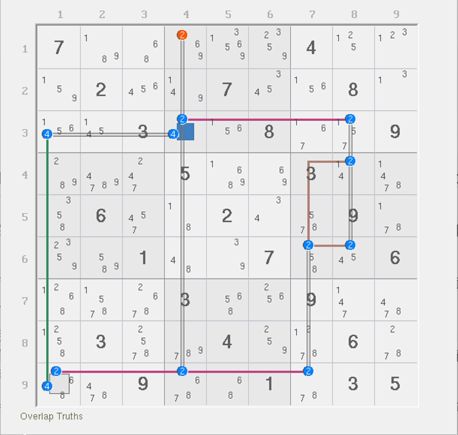
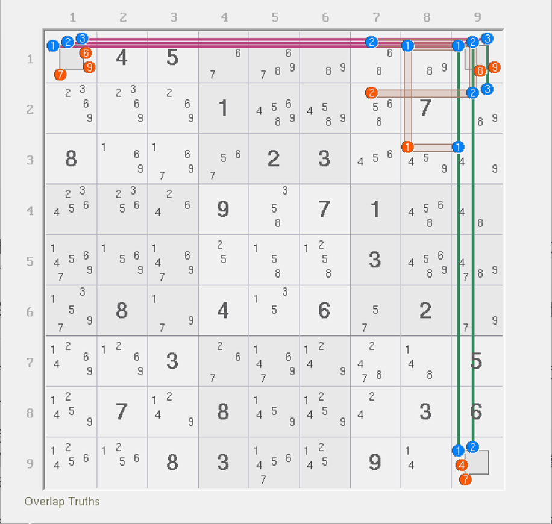
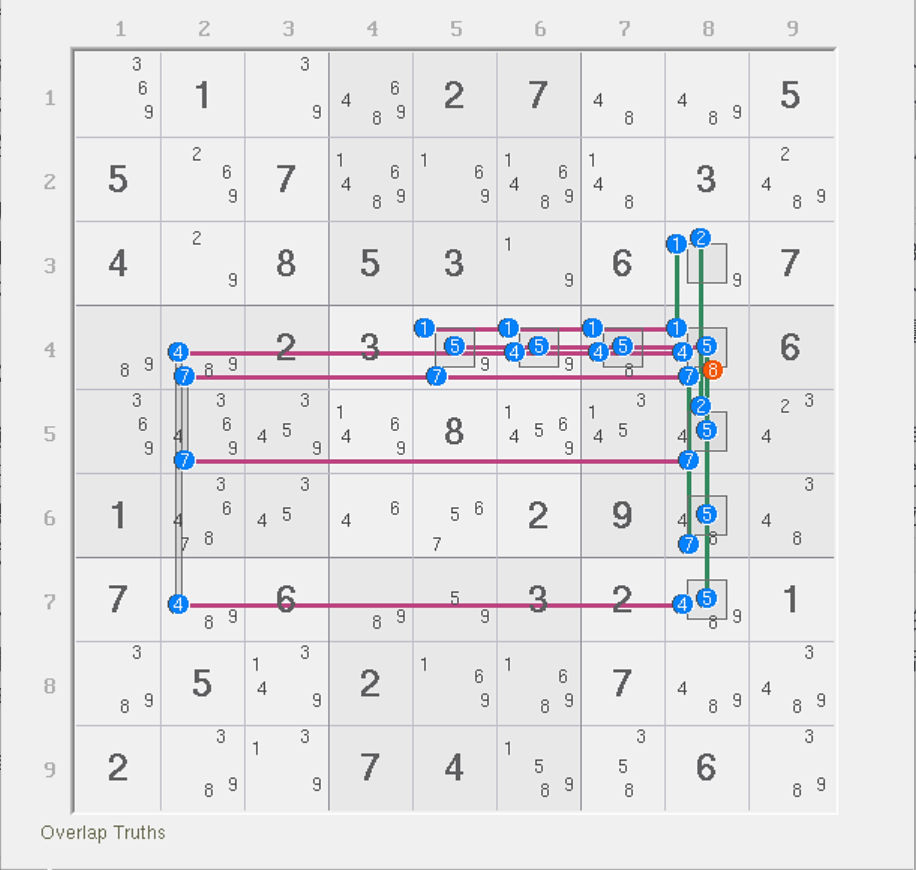

# 强三元组的例子

## 例子 1：动态链 

<figure><figcaption>
动态链
</figcaption></figure>

如图所示。本题有一个强三元组 `r3c4(2)`。我们需要讨论它的真假性。

如果它为真，则很显然，`2c4` 这个弱区域会用于删数；而如果它为假，则其余位置没有任何一个候选数出现三元组的特征，所以退化为普通的结构。此时数一下强区域数量和弱区域数量。强区域数量有 5 个，弱区域数量也有 5 个（因为三元组不占位时并不会影响强弱区域的数量造成变化）。所以，整个结构的秩为 0，故所有弱区域均可以用于删数。

那么，两种情况都可以删除的自然都包含 `2c4`，所以这个题的弱区域 `2c4` 可以用于删数，故有 `r1c4 <> 2`。

## 例子 2：烟花三数组 

<figure><figcaption>
烟花三数组
</figcaption></figure>

如图所示。本题讨论起来稍微复杂一些，主要是因为本题有三个强三元组。

但是，虽然复杂，但好在三元组用到的都是不同的数字，还挤在同一个单元格上。思考一个问题。这个题有三个强三元组的话，那么实际能占位的始终只有一个数。于是这个结构只会出现两种占位状态：

1. `r1c9` 不占位（不出现 1、2、3 任意一个数为真）；
2. `r1c9` 占位（出现 1、2、3 的其一为真）。

> 正好借着这个机会解释一下这个题的特殊现象。本题强区域有 6 个，弱区域只有 5 个，按理说你使用早期的公式代入计算可以得到这个题的秩等于 -1，就说这个结构是错误的，这显然是不对的。因为这题有强三元组，占位与否会影响填数的总个数，你是不能直接用之前的公式的。
>
> 而弱区域数比强区域数少的情况，在结构里可能确实会存在，而且还具有删数。这个题正好作为了一个很好的“反例”展示给大家。

我们用秩的角度讨论，就是之前说的占位与否来讨论。鉴于结构的特殊性，数字 1、2、3 在填充效果上一样的，你随便认为其中哪一个数占位填入都可以，就不用三种数每个都假设一次填入占位了。我们假设极端一些，假设 `r1c9` 不被 1、2、3 里的任意一个数所占位，那么此时结构就不存在任何的强三元组，结构就可以认为它实际真得填 6 个数（强区域此时有 6 个，还不能放在 `r1c9` 交点位置上）。但是弱区域只需要 5 个就可以全覆盖，而且每一个数此时都是一个强区域一个弱区域覆盖的标准模式。因此这个时候可以用秩的公式。但是用秩的公式得到 5 - 6 = -1，所以矛盾。所以，如果不占位会引发秩为负数的矛盾，所以 `r1c9` 就必须是占位的。换言之，`r1c9` 必须是 1、2、3 的其一。

但是，这么看好像还不能得到全部的删数（只能得到 `r1c9 <> 89`）。其实，我们稍微进一步分析就可以得到后面的删数。因为 `r1c9` 必须占位，所以此时强区域会同时少两个。为什么是两个？因为 1、2、3 三种数字都接了两个强区域到 `r1c9`。随便哪一个数占位，那个数接进来的两个强区域都会消失（因为 `r1c9` 此时为真了嘛）。而弱区域只会少一个，也就是 `1n9`（或者说 `r1c9`）。

那么，强区域此时少两个（6 个变为 4 个），弱区域只少一个（5 个变为 4 个），此时剩下的候选数又是标准的一个强区域一个弱区域覆盖，所以整体结构的秩可以直接得到等于 0 的结果。因为这次我们用的是最开始的式子算出的结果，所以我们可以确保所有弱区域此时都可用于删数，所以这个题的其他删数我们就顺理成章地得到了。

是不是这样看的话，比我们之前初步接触烟花数组时学到的推理过程要简单很多呢？

> 另外，穷举的角度可以得到这个结构总是填 5 个数。如果通过占位来分析的话，因为 `r1c9` 必占位 1、2、3 的其中一个数，所以另外俩就只能都填两个到两个不同的强区域里，所以要填入的数字总数肯定是 2 + 2 + 1 = 5，这样我们就可以通过占位的思路得到为什么是填 5 个数进去了。

## 例子 3：四个强三元组的结构 

<figure><figcaption>
四个强三元组的结构
</figcaption></figure>

如图所示。本题比较复杂，一共有 10 个强区域和 10 个弱区域，要是用穷举的话会有 50 多种填法组合，每个都看一遍肯定是不现实的。

我们找出这个题里不符合正常覆盖逻辑的地方。这个题一共有 4 个强三元组：`r4c8(157)` 和 `r5c8(7)`。我们直接讨论占位的状态即可。因为有两个不同的单元格可用于占位，所以占位状态一共就只有如下的三种：

1. `r45c8` 均不使用三元组占位；
2. `r4c8` 或 `r5c8` 其中一个被三元组占位；
3. `r45c8` 都被三元组占位。

通过强三元组基础的占位思路来理解的话，我们知道，强三元组在不占位的时候是不影响强弱区域总数的，就是说在不占位时，强区域的总数和弱区域的总数并不会因为不占位而发生变化。所以我们可以直接利用这一点分析这三种情况。

首先是都不占位。都不占位意味着强弱区域数都是 10（不变）的同时，没有任何一个数是特殊的覆盖逻辑，全都是一个强区域一个弱区域的标准覆盖规则，所以结构可以按最开始的计算规则算出秩为零的结果，所以结构为零秩的，所以所有弱区域都可以用于删数，`r4c8 <> 8` 此时属于删数的一部分，成立。

其次是 `r4c8` 或 `r5c8` 其一占位。先来看 `r4c8`。显然，它占位可以直接删数。所以此时 `r4c8 <> 8` 可以成立。再看 `r5c8`。这次，`r5c8` 占位的话，因为我们这个情况的假设是互斥的，所以 `r4c8` 此时就不能有占位。多亏这一点，我们才能得到结论：因为 `r4c8` 不被 1、5、7 三元组所占位，而 `r5c8` 占位，所以总体强区域数量只会少两个（`r5c8` 连进来的这两个 7 的强区域），但弱区域数量只会少一个，就是这个 `5n8`。此时，强区域数量变为 8 个，弱区域数量变为 9 个。因为弱区域数量仍然更多，所以秩为正数，所以无法得到矛盾。

但是实际上这还是矛盾的。因为 `r5c8 = 7` 之后，`2c8` 上只能让 `r3c8 = 2`。而 `1c8` 也恰好只有两处位置。因为 `r4c8` 不占位，数字 1 也在其中，所以 `r4c8 <> 1`；而唯一一个可填 1 的位置 `r3c8` 却在这种情况下被 2 所“占领”了，1 此时没有任何地方可以填入，所以就矛盾了。或者你倒过来看也行：因为 `r4c8` 不占位，所以 1 必须填在 `r3c8`，然后 2 就必须填在 `r5c8`；但 `r5c8` 此时我们假设它必须填的是强三元组占位的数字 7 而不是 2，所以矛盾。总之就是，此时只让 `r5c8` 被 7 占位，而 `r4c8` 又不被任何强三元组占位是根本不可能成立的。

还需要分析第三个情况吗？显然不需要了。因为第三个情况不管成立与否，`r4c8 <> 8` 的结论都可以得到了。因为第三个情况会假设 `r4c8` 成立其中一个强三元组占位的情况，而这已经在前面第一点就讨论过了——它能直接引发同单元格上的删数。所以，这个题的结论就是 `r4c8 <> 8`。
