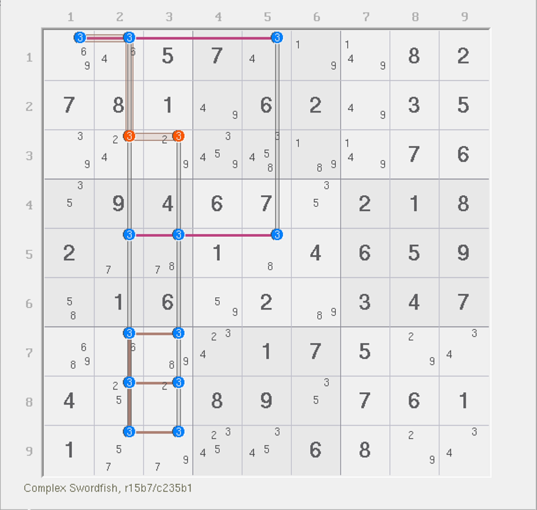
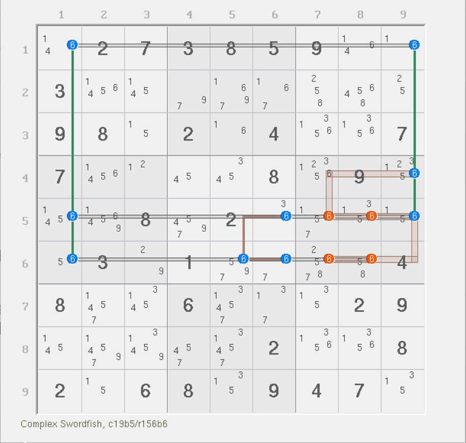
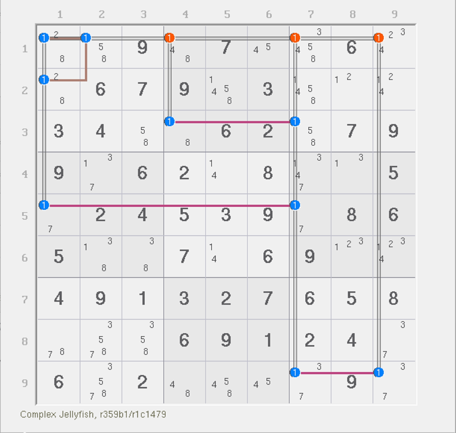
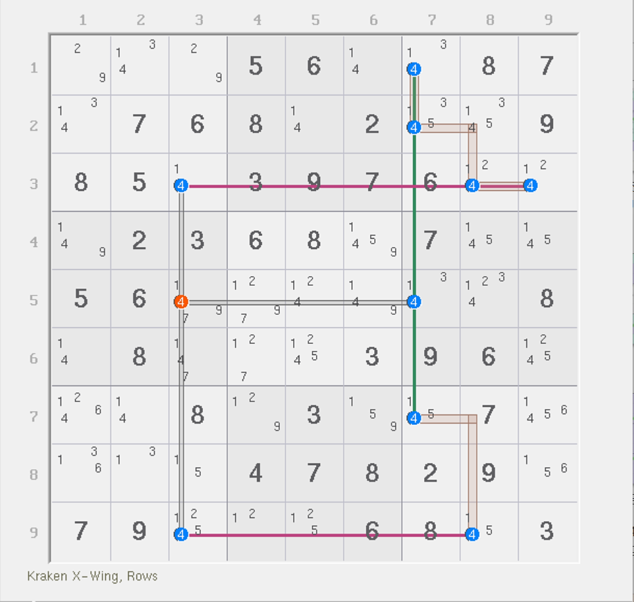
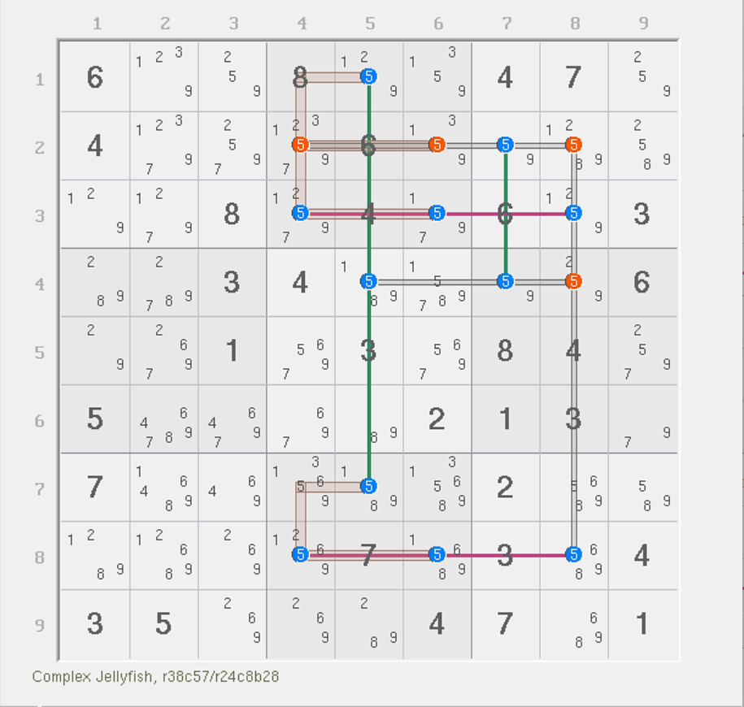
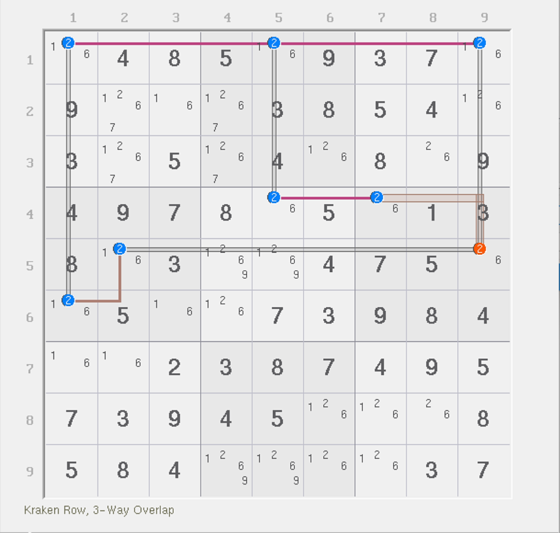
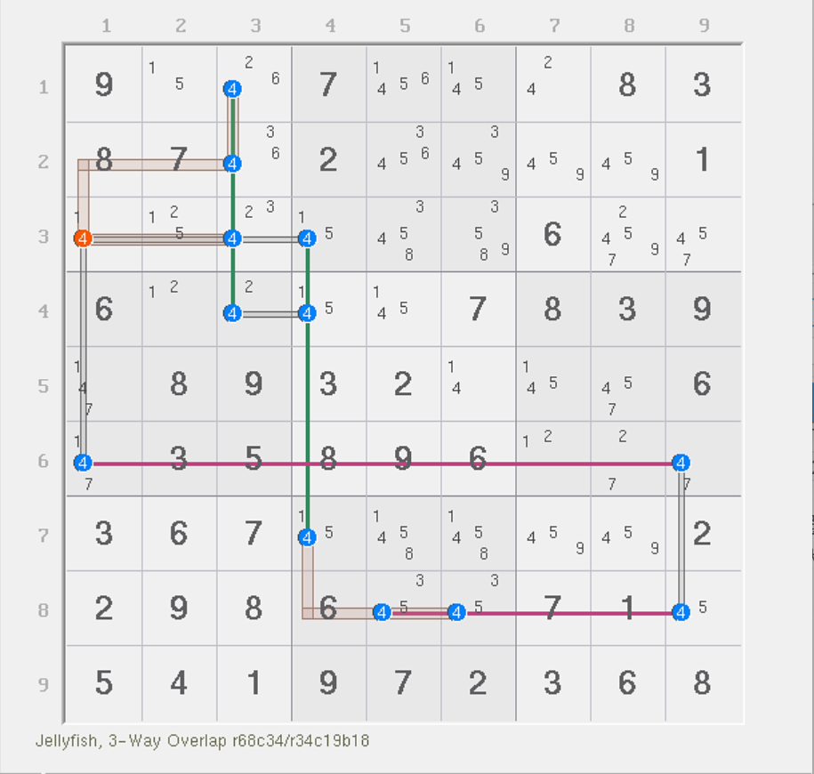
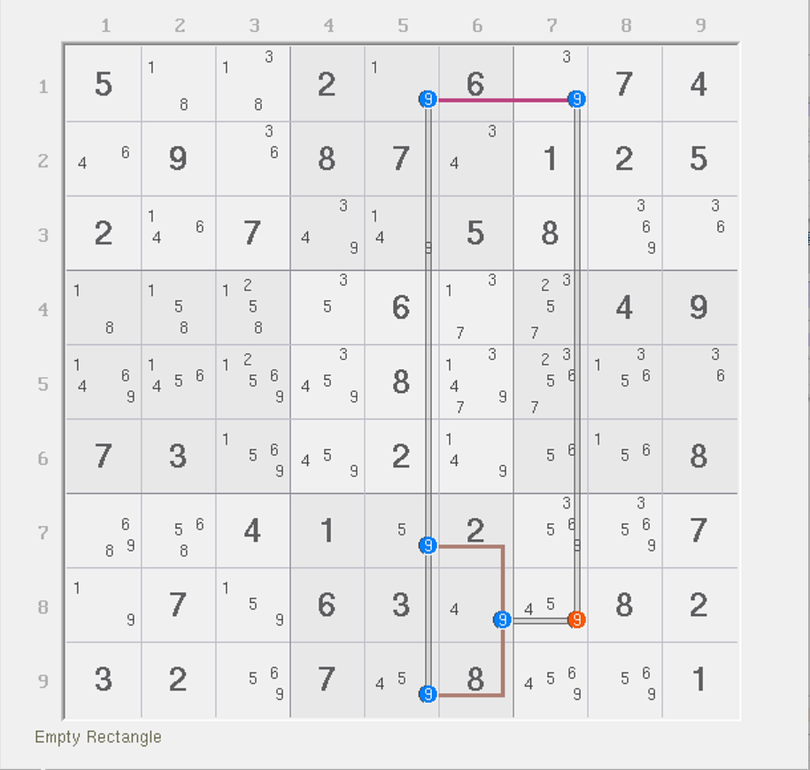
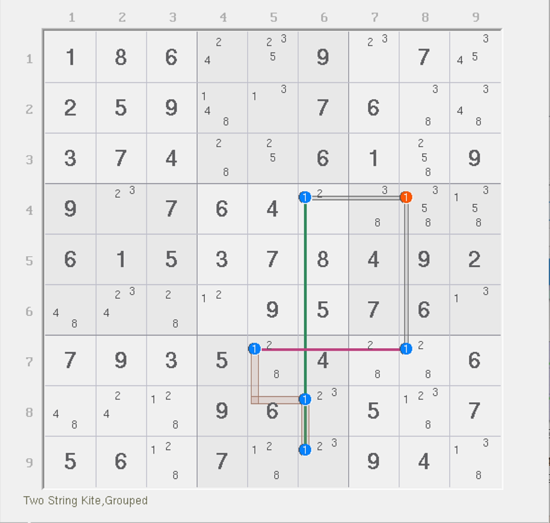

# 外鱼鳍的基本推理

我们继续来看复杂鱼。今天我们来介绍一个比较重要的概念：鱼鳍。

鱼鳍其实早在之前就已经说过，但是我们并未使用秩理论的内容为各位体系化介绍它。在最开始标准鱼的篇目里，我们学到的所有鱼鳍都是外鱼鳍，所以我们先说外鱼鳍。下面我们就来继续看看外鱼鳍在复杂鱼里的使用。

## 宫内鳍鱼 

### 三阶宫内鳍鱼（Finned Franken Swordfish） 

<figure><figcaption>
三阶宫内鳍鱼
</figcaption></figure>

如图所示。这是一个**三阶宫内鳍鱼**（Finned Franken Swordfish），鱼鳍位于 `r1c1(3)`。

如果你看不明白为什么它是鱼鳍的话，请拿掉它。当你拿掉它之后，结构的每一个候选数都会被一个强区域和一个弱区域覆盖。

按照这样的计算规则，我们可以知道，因为强弱区域数都是 3 个，所以它的秩为 0，并可直接按照标准的删数规则进行删数。但是由于 `r1c1(3)` 的客观存在，所以我们必须按照鱼鳍的规则进行讨论。

* 如果 `r1c1` 填入 3，则所在行、列、宫均可删数（因为填 3 所影响的范围只有 `r1c1` 看得见的这些单元格）；
* 如果 `r1c1` 不是 3，则三阶宫内鱼直接成立，于是 `c235` 都可用于删数。

那么联立两种情况，我们可以得到的是，`r3c23 <> 3` 是这个题的结论。

我们再来看一个例子。

<figure><figcaption>
三阶宫内鳍鱼，另一个例子
</figcaption></figure>

如图所示。这个题是竖着长的，强区域是两个列和一个宫，删除域则是横向的三行。

### 四阶宫内鳍鱼（Finned Franken Jellyfish） 

<figure><figcaption>
四阶宫内鳍鱼
</figcaption></figure>

如图所示。这是一个**四阶宫内鳍鱼**（Finned Franken Jellyfish）。尽管看着有些别扭，但是我们不难看出它的强区域是 `1b1` 和 `1r359` 一共 4 个，弱区域是 `1c1479` 也是 4 个。

这题的 `r1c2(1)` 是鱼鳍，因为它尚未被弱区域 `1c1479` 所覆盖，需要单独使用 `1r1` 弱区域覆盖。所以讨论它的真假性。

* 如果 `r1c2` 填 1，则显然删数可以成立，因为它们都和 `r1c2` 同一行；
* 如果 `r1c2` 不填 1，则四阶宫内鳍鱼所有剩余的候选数均是精确覆盖，所以秩为 0，所有弱区域均可用于删数。

那么结合起来自然就是 `r1c479 <> 1` 是这个题的结论了。

## 精确覆盖和非精确覆盖 

### 精确覆盖的定义 

为了衔接后面的内容，我们这里需要提及一个前文不曾提及但也不难的说法：**精确覆盖**（Exact Cover）。

精确覆盖指的是在推演结构时，候选数同时只被一个强区域和一个弱区域所覆盖的这种标准覆盖情况。这种覆盖情况最适合用于推演删数的真假性，因为我们显然知道它的填充规则是最普通的。不论它为真还是为假，也不会影响整体结构，也就是说，原本的结构的秩不会因为这种候选数的真假而发生变化。

> 这本身是一个计算机术语，用于一些高级的数据结构和算法，比如**舞蹈链**（Dancing Links，简称 DLX）算法里，描述每一个链表节点的覆盖规则是“精准”的。但是非常巧合的是，舞蹈链算法也时常用于数独的解题之中。

### 非精确覆盖的删数推演 

四阶宫内鳍鱼的例子里，我们留了一个伏笔。可以看到，这个例子其实并不是精确覆盖的。我们把 `r1c2` 当成了鱼鳍，但实际上我们仔细看看这个弱区域的覆盖规则，不难发现，它的弱区域的覆盖确实有些诡异。

我们不难看出，`r1c1` 其实是同时位于 `1r1` 和 `1c1` 两个弱区域的，而 `1b1` 是强区域，所以是同时被两个弱区域和一个强区域所覆盖的。虽然，我们不从秩的视角去讨论，而是使用鱼鳍的真假假设来看的话，它是可以推理并且可以得到结论的成立的，但是用秩的角度似乎并不是这么看的。

从秩的视角而言，我们需要讨论这个结构就必须按 `r1c1` 进行假设，因为它是一个弱三元组。假设 `r1c1(1)` 为真，则可以干掉删数；但如果我们假设 `r1c1(1)` 为假，则结构的强弱区域数都没有减少，仍然需要讨论删数自身的占位状态才可得到删数（如假设 `r1c4(1)` 为真，然后所有其他位置的删数会被干掉，于是整个结构再也不存在一个非精确覆盖的位置了。套用秩的公式可得，因为弱区域会因为删数假设为真的情况而减少 2 个单位，但强区域一个没少，所有从原本 5 个弱区域变为 3 个，秩得到 3 - 4 = -1 的结果。因为秩此时为负数，所以矛盾。其他的删数也同理。

换言之，当我们发现一个候选数尚未被精确覆盖时，我们需要讨论它的占位状态以确保结构剩余的部分可用秩理论进行分析。但是，一旦结构还存在至少一个不是精确覆盖的情况，那么我们就得小心了，因为它的占位与否始终会影响结构的秩的变动。

### 对删数讨论精确覆盖

另外，还请注意一点。

我们发现，上面的讨论（讨论弱三元组 `r1c1(1)` 的占位状态来确定删数）确实有些复杂。使用鱼的鱼鳍逻辑似乎简单不少，但看起来逻辑上，他俩并不共通，毕竟鱼鳍是 `r1c2(1)`。

那么，秩理论是怎么解释这个鱼鳍的概念的呢？

使用秩理论解释鱼鳍，我们需要拆分视角。将鱼鳍的真假状态拆解开来，这样可以让我们更清楚地恢复到正常使用强弱区域覆盖规则的两个不同分支上去。

如果 `r1c2(1)` 占位，则删数会被直接干掉，所以不用多推理；但如果 `r1c2(1)` 不占位的话，也就意味着 `r1c2` 无需我们进行精确覆盖，所以此时剩余的候选数均可被一个强区域和一个弱区域进行精确覆盖。

那么请注意这里。`r1c2(1)` 在填充时，会对 `r1` 产生排除效果，于是删数才会出现。所以，`1r1` 此时体现的是删数效果才有的弱区域；而当它不占位时，我们其实完全用不到 `1r1` 这个弱区域。也就是说，虽然结构看起来是有 5 个弱区域，但实际上在讨论删数时，并非所有的弱区域都会在 `r1c2(1)` 真假讨论的两种情况下都同时参与进来。所以，在计算秩的时候，`1r1` 确实和 `1c1` 产生了交集，所以 `r1c1(1)` 确实形成了弱三元组；但它并非是我们讨论的地方，因为问题并不是 `r1c1(1)` 这个候选数，而是我们“错误地”将 `r1c1` 视为了讨论的核心。说是“错误地”，其实也并非错误，只是选取了一个不恰当的位置，才造成了问题变得更加复杂。

所以，在讨论复杂鱼的删数逻辑时，我们一般更倾向于找出鱼鳍，讨论鱼鳍本身，而非使用三元组的思路。而计算鱼的秩，是需要拆视角的，并不是拿着结构整体去看有多少强弱区域去求秩的结果，因为这么算肯定是不妥的，有些弱区域只会在其中一个真假性状态上才会发挥必要的作用。

## 交叉鳍鱼 

说完了精确覆盖，那么我们继续来看交叉鱼的部分。

### 三阶交叉鳍鱼（Finned Mutant Swordfish） 

<figure><figcaption>
三阶交叉鳍鱼
</figcaption></figure>

如图所示。这是一个**三阶交叉鳍鱼**（Finned Mutant Swordfish）。我们这次要把 `r5c7(4)` 视为鱼鳍。如果它为真，则直接可以删除 `r5c3(4)`；而当它不存在时，所有候选数（除了删数）均为精确覆盖，所以是零秩结构，弱区域都可以用于删数。

两种情况均可删除 `r5c3(4)`，所以它是这个题的结论。

### 四阶交叉鳍鱼（Finned Mutant Jellyfish） 

<figure><figcaption>
四阶交叉鳍鱼
</figcaption></figure>

如图所示。这是一个**四阶交叉鳍鱼**（Finned Mutant Jellyfish）。这题的鱼鳍是 `r2c7(5)`。本题有四个删数，但 `r4c8(5)` 的删数原理不同，所以要分开看。

如果它为真，则删除 `r2c468(5)` 三个候选数；如果它为假，则本题出了删数以外，所有候选数均是精确覆盖的，强区域是 `5r28` 和 `5c57` 一共 4 个；弱区域是 `5b28`、`5r4` 和 `5c8` 也是 4 个。因为此时 `r2c7(5)` 为假，则我们不需要去覆盖它。于是此时整个结构就是 4 个强区域和 4 个弱区域，秩为 0，所有弱区域上都可以用于删数。

两者取交集，可以看到，`r2c468 <> 5` 是这个题的结论。

而 `r4c8(5)` 这个删数则需要更复杂的讨论，最终会因为删空 `5r3` 造成矛盾；但是因为它需要超纲的填充逻辑，所以这里暂且不提。

## 退化复杂鱼 

之前我们提到过，鱼鳍在结构里会造成三种形态：鳍鱼、退化鱼和孪生鱼三种。前面的例子都是普通的鳍鱼，下面我们来看退化鱼的情况。

### 三阶退化鱼 

<figure><figcaption>
三阶宫内退化鱼
</figcaption></figure>

如图所示。这是一个**三阶宫内退化鱼**（Sashimi Franken Swordfish）。本题的鱼鳍谅你也猜不到，有两个。一个是 `r4c7(2)`，另一个是 `r5c2(2)`。

这两个鱼鳍同为假的时候，则因为 `2r4` 和 `2b4` 两个强区域都只有一处位置可填，因此是退化鱼；另外，当同假时，不需要覆盖这两个候选数，因此剩余的候选数均可被精确覆盖，所以秩为 0，所有弱区域都可以用于删数。如果两个鱼鳍里至少有一个为真也可以直接删除 `r5c9(2)`。所以这个题的结论就是 `r5c9 <> 2`。

当然，从定义强行这么看的话是这样的。因为我们知道，退化鱼造成某个强区域只剩下一个位置可填。这个例子比较特殊，当假设同假后，`2b4` 和 `2r4` 均变为一个数，于是会直接影响到 `2r1`，然后就直接得到 `r1c9 = 2` 了。只不过这么看的话就不便于我们定义它的技巧名称和结构。

我们再来看一个例子。

### 四阶退化鱼 

<figure><figcaption>
四阶交叉退化鱼
</figcaption></figure>

如图所示。这是一个**四阶交叉退化鱼**（Sashimi Mutant Jellyfish）。强区域是 4 个：`4r68` 和 `4c34`，弱区域也是 4 个：`4r4`、`4c9` 和 `4b18`。剩下两个标记出来的弱区域 `4r3` 和 `4c1` 是鱼鳍用到的。

这个题的鱼鳍是 `r3c4(4)` 和 `r6c1(4)`。如果他们同假，则所有候选数均可使用这四个弱区域进行精确覆盖，于是秩为 0，所有弱区域都可以用于删数；如果两个鱼鳍至少有一个为真，则按照排除操作也可以得到 `r3c1 <> 4` 的结论。所以这个题的结论就是 `r3c1 <> 4`。

## 有鱼鳍的二阶复杂鱼 

最后我们补充一下二阶复杂鱼带有鱼鳍时的情况。

为什么前文没有对二阶鱼提及复杂鱼的结构？就算带鱼鳍也可以被其他技巧等价替换掉吗？是的。我们下面就来看一下。

### 二阶宫内鳍鱼是空矩形或多宝鱼 

<figure><figcaption>
二阶宫内鳍鱼（空矩形）
</figcaption></figure>

如图所示。这是一个**二阶宫内鳍鱼**（Finned Franken X-Wing）。这个题的鱼鳍是 `r8c6(9)`。强区域是 `9r1` 和 `9b8`，弱区域是 `9c57`。都是两个。

当鱼鳍不存在时，所有候选数都被精确覆盖，所以秩为 0，所有弱区域都可以用于删数；如果鱼鳍存在，则按排除法也可以删除 `r8c7(9)`。

不过，这其实是一个空矩形。我们把 `r8c456(9)` 都补充上，它就是一个完整的空矩形了；而在复杂鱼里，这三个位置都是作为鱼鳍来看的。

所以，二阶宫内鳍鱼等价于空矩形；而**二阶宫内退化鱼**（Sashimi Franken X-Wing）则是多宝鱼。为什么呢？退化鱼和鳍鱼的唯一区别在于强区域在去掉了鱼鳍后是否会只剩下一处可填位置。那么我们把图上的 `r79c5(9)` 改成只有一处位置，这个题就成退化鱼了。改成了退化鱼之后，其实不难看出，它就真正意义上成为了一个多宝鱼结构。

### 二阶交叉鳍鱼是双线风筝 

<figure><figcaption>
二阶交叉退化鱼（双线风筝）
</figcaption></figure>

如图所示。这是一个**二阶交叉退化鱼**（Finned Mutant X-Wing）。可以很容易地看出，它其实就是双线风筝，只不过用了个区块，即区块双线风筝。

所以，二阶交叉鳍鱼则等价于双线风筝。因为两个强区域要想作为交叉鱼出现，必须一行一列。而它自然就构成了双线风筝必要的强链垂直的效果。

### 二阶鱼的替代性 

所以，综上所述，所有二阶鱼（除了二阶鱼，不带鱼鳍的标准版本）均可被链或环所替换。其中：

* 二阶普通鱼
  * 没有鱼鳍：唯一一个不被替换、有单独技巧名称的技巧；
  * 有鱼鳍
    * 二阶鳍鱼：区块摩天楼（只删一边）
    * 二阶退化鱼：摩天楼或区块摩天楼（只删一边）
    * 二阶孪生鱼：摩天楼或区块摩天楼
* 二阶复杂鱼
  * 没有鱼鳍
    * 二阶宫内鱼：区块
    * 二阶交叉鱼：构造不出来——不能稳定存在
  * 有鱼鳍
    * 二阶宫内鳍鱼：空矩形（区块多宝鱼）
    * 二阶宫内退化鱼：多宝鱼
    * 二阶交叉鳍鱼：区块双线风筝
    * 二阶交叉退化鱼：双线风筝

下一节我们将看看内鱼鳍的用法。
