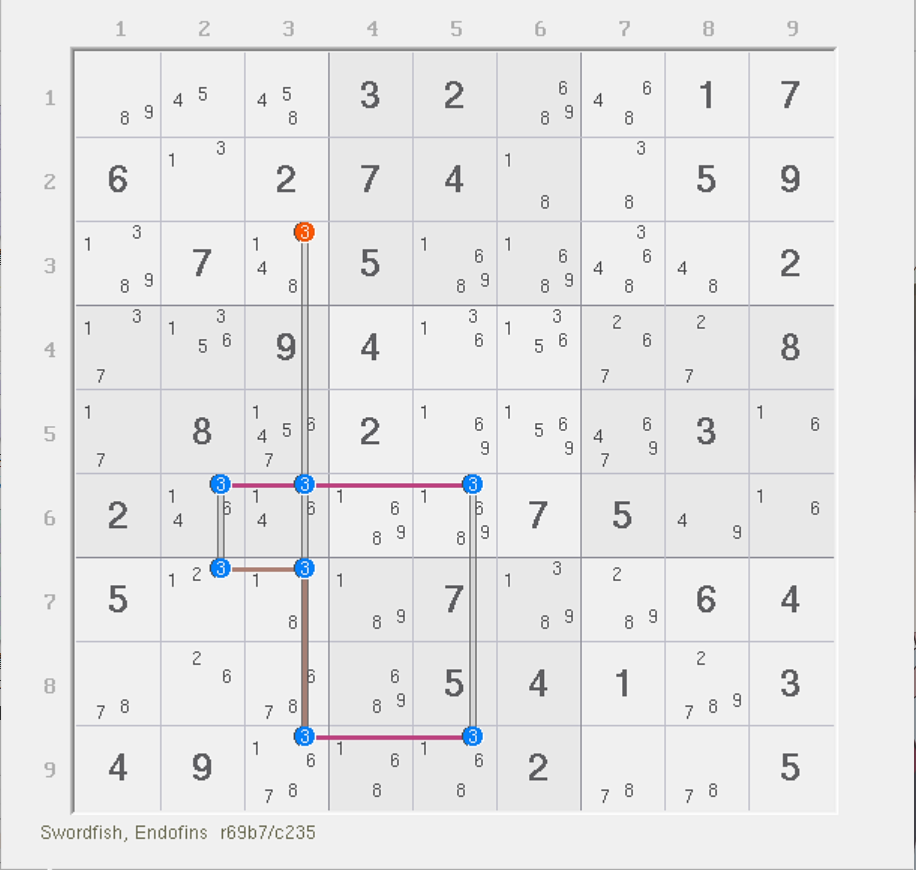
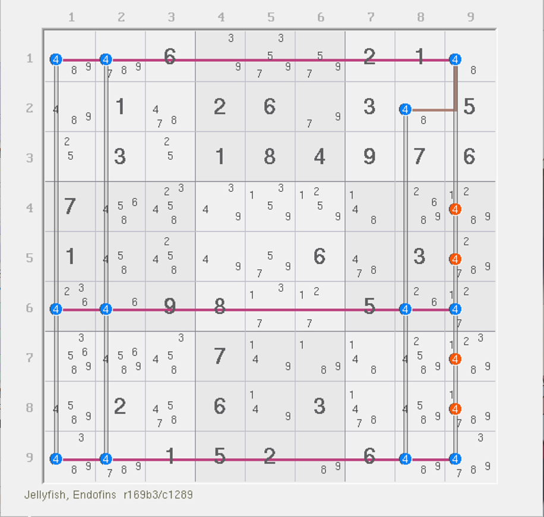
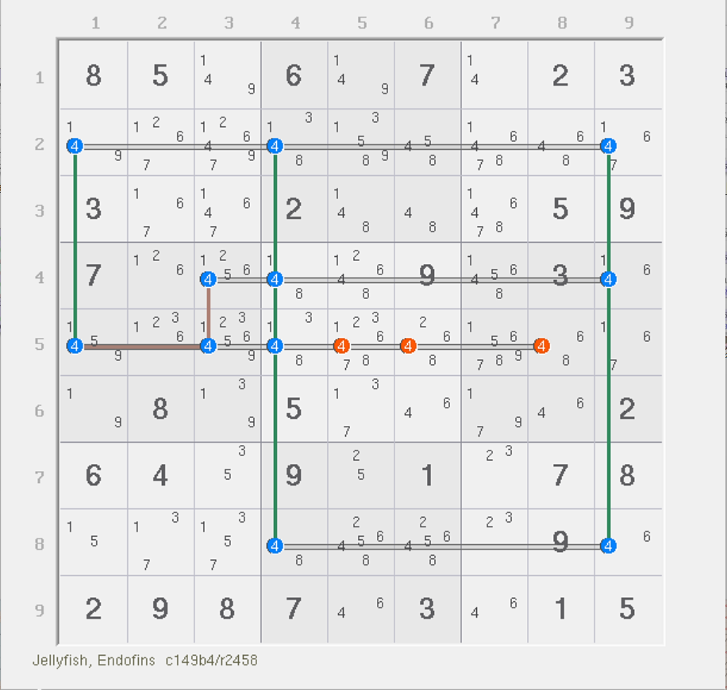
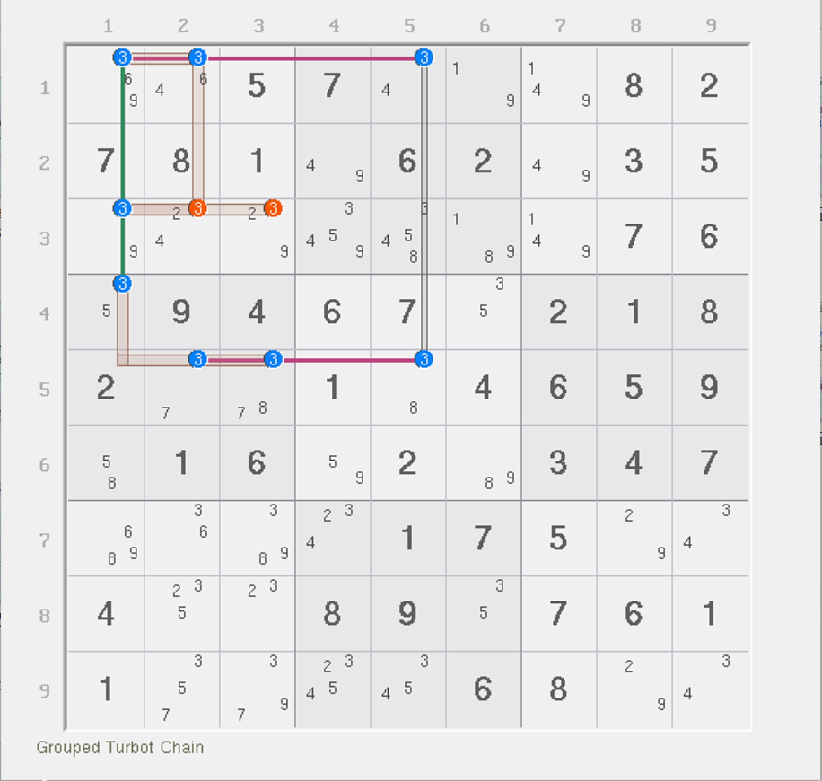
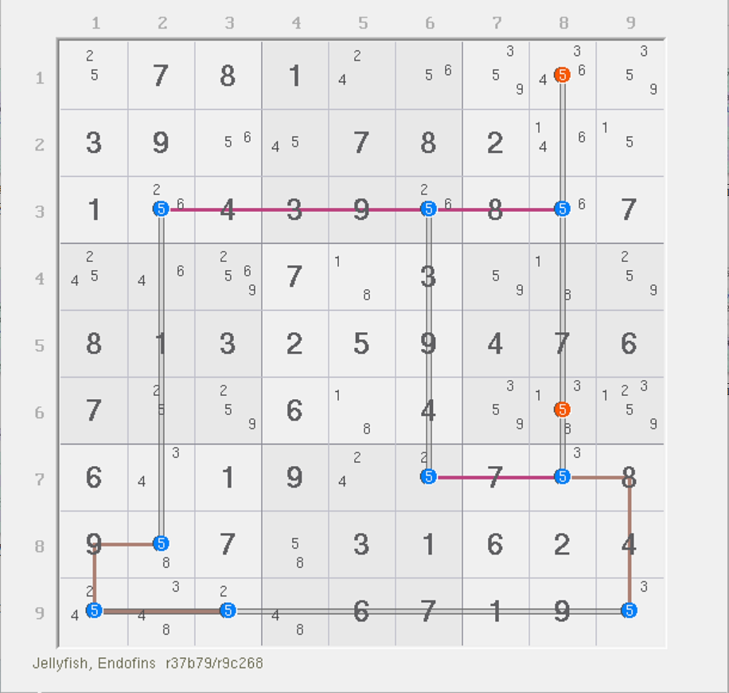
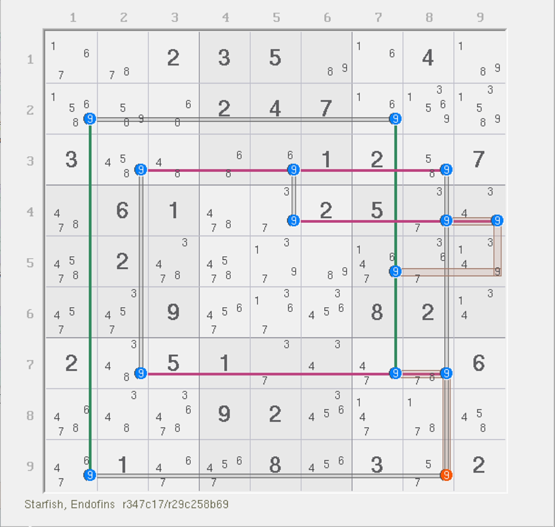

# 内鱼鳍的基本推理

今天我们来看带有内鱼鳍的复杂鱼结构。

## 宫内鳍鱼 

### 三阶宫内鳍鱼 

<figure><figcaption>
三阶宫内鳍鱼
</figcaption></figure>

如图所示。这个题目的强区域是 `3r69` 和 `3b7`，弱区域是 `3c235`。都是 3 个。不过要注意的是，这个地方有一个强三元组，位于 `r9c3`。

显然，按照最基础的推理过程，我们必须讨论它的真假性才能得到结果。

* 如果 `r9c3 = 3`，则列排除可以直接删除 `r3c3(3)`；
* 如果 `r9c3 <> 3`，则本结构不存在任何的三元组，故退回普通的 3 个强区域和 3 个弱区域的鱼结构，秩为 0，故所有弱区域均可用于删数。

结合两种情况我们可以得到，`r3c3 <> 3` 是这个题目的结论。

似乎说起来也并不是非常费劲，因为前期的内容我们已经简要接触过强三元组的推理过程。我们把图中 `r9c3(3)` 称为这个结构的**内鱼鳍**（Endofin）。为什么叫内鱼鳍呢？这得分两部分解释。

第一部分，为什么有个“内”字？因为我们不难发现，这个影响我们推理、需要讨论真假性的候选数长在了鱼的身上。之前我们学到过的鱼鳍，都是附着在鱼结构的边上。虽然他们都在强区域里，但很明显的不同点在于，之前学到的鱼鳍都只会被一个强区域所覆盖；而这个例子不同的地方在于，它同时被两个强区域所覆盖。显然，当我们讨论真假性的时候，它的占位状态就会和之前的鱼鳍有所不同。正是因为它长在了鱼的身体里，所以我们把它称为结构内的鱼鳍。

第二部分，为什么这也叫鱼鳍？因为它的真假性仍然影响了我们推理。我们在得到删数结论之前，也是需要依赖它的真假性讨论的，这一点和鱼鳍完全一样。所以我们把他称为鱼鳍。

结合两点，我们将这种特殊现象称为鱼的内鱼鳍。

### 四阶宫内退化鱼 

<figure><figcaption>
四阶宫内退化鱼
</figcaption></figure>

如图所示。这个题的强区域是 `4r169` 和 `4b3`，弱区域是 `4c1289`。

这题和刚才的例子也差不多，`r1c9` 是这个题的内鱼鳍。讨论真假性可以得到，要么 `r1c9(4)` 为真，则删除 `c9` 里其余位置的 4；如果为假则没有任何位置是三元组，变为精确覆盖，于是结构秩为 0，所有弱区域都可以删数。所以，联立起来就可以得到结论是 `r4578c9 <> 4`。

我们再来看一个例子。

<figure><figcaption>
四阶宫内退化鱼，另一个例子
</figcaption></figure>

如图所示。这个题就自己理解了。

## 交叉鳍鱼 

下面我们来看内鱼鳍长在交叉鱼上的情况。

### 三阶交叉鳍鱼 

<figure><figcaption>
三阶交叉鳍鱼
</figcaption></figure>

如图所示。这个题的强区域是 `3r15` 和 `3c1`，弱区域是 `3b14` 和 `3c5`。

显然，这题也有一个强三元组，位于 `r1c1`。讨论它的真假性。如果 `r1c1 = 3`，则宫内的 `r3c23 <> 3`；如果 `r1c1 <> 3`，则所有候选数精确覆盖，于是结构秩为 0，所有弱区域均可用于删数。

结合起来，可以得到 `r3c23 <> 3` 是这个题的结论。

### 四阶交叉退化鱼 

<figure><figcaption>
四阶交叉退化鱼
</figcaption></figure>

如图所示。这是一个四阶交叉鳍鱼。为什么它是交叉鳍鱼呢？强区域不是有两个宫吗？这是因为它的弱区域里同时含有了行和列两种元素。我们之前提到过，如果强区域或弱区域只要有一侧同时含有行和列两种元素，我们就称为交叉鳍鱼。实际上，这是三行一列的弱区域，将结构转置后就会变为三行一列的强区域，这符合交叉鱼的归类。

可以看到，本题的内鱼鳍是 `r7c8(5)`。按照前文的讨论，真假性可以得到这个题的结论是 `r16c8 <> 5`。过程就不多说了，因为说过两回了。

## 混合鱼鳍 

前文我们介绍了外鱼鳍和内鱼鳍的基本推理过程。而对于复杂鱼来说，两种鱼鳍是可以混合出现的。下面我们就来看一些这样的例子。

> 下面两个例子都是五阶的情况。由于结构的长相使得它不具备明显的互补性质和特征，所以在复杂鱼里是可以存在稳定的五阶鱼及以上规格的鱼的。
>
> 五阶的鱼称为 Squirmbag 或 Starfish（海星）。后者“海星”的由来比较好理解，但前者没有比较好的翻译，应该是来自三阶鱼 Swordfish （那架战斗机）的另外一个称呼 Stringbag（网袋）衍生而来。

### 五阶宫内退化鱼（Finned Franken Squirmbag） 

<figure><figcaption>
五阶宫内退化鱼
</figcaption></figure>

如图所示。这个题的两个鱼鳍一个位于 `r1c5(7)`，一个位于 `r9c1(7)`。

看得出来哪个是外鱼鳍，哪个是内鱼鳍吗？是的，`r1c5` 是外鱼鳍，`r9c1` 是内鱼鳍。`r1c5` 长在了单独的一行上，只需要 `7c5` 这个弱区域就可以覆盖，所以它只会被一个强区域和一个弱区域覆盖；而 `r9c1` 就不行了。它是强三元组；而且，`r2c5` 这里虽然也是鱼身体的一部分，但它在结构里是同时被 `7r2` 和 `7c5` 两个弱区域覆盖的，所以单看结构整体还不算是精确覆盖。这一点和之前介绍外鱼鳍的那个四阶情况类似；而且，它是鱼鳍单拎出来才会造成的 `7c5` 这个弱区域，而并非鱼自身产生的弱区域，因此鱼的弱区域实际只有 5 个，全都是行。所以这是一个宫内鱼，而非交叉鱼。

按照推理过程，因为鱼鳍的本质是不变的（假设真假性），所以我们直接讨论其真假性就行。因为是两个鱼鳍，所以混合在一起讨论就行。

* 如果两个鱼鳍均为假，则所有候选数均为精确覆盖，于是秩为 0，所有弱区域均可用于删数；
* 如果两个鱼鳍任意一个为真，`r9c5 <> 7` 均成立。

所以，结论是 `r9c5 <> 7`。同样地，本题的 `r6c5 <> 7` 也可以删除，但是它也不能直接这么删，因为内鱼鳍 `r9c1(7)` 无法删到它那里，所以它需要单独讨论，这里就不作解释了。等到了后面再说。

### 五阶交叉退化鱼（Finned Mutant Squirmbag） 

<figure><figcaption>
五阶交叉退化鱼
</figcaption></figure>

如图所示。这个题有些复杂。这题也有两个鱼鳍，一个是 `r9c1(9)`，是外鱼鳍；一个是 `r7c7(9)`，是内鱼鳍。另外，强区域是 `9r347` 和 `9c17` 一共 5 个，弱区域是 `9r2`、`9c258` 和 `9b6` 也有 5 个。

很显然，当我们把鱼鳍设为假之后，除了 `r4c8(9)` 外，所有候选数均为精确覆盖。`r4c8(9)` 比较特殊，它位于两个弱区域上，是弱三元组。因为这个结构的在拿掉了鱼鳍后，鱼的强区域和弱区域数量一样；但是，`r4c8(9)` 的占位状态可能会影响结论形成，所以我们作为子情况继续讨论。

* 当 `r4c8` 占位时，删数直接成立；
* 当 `r4c8` 不占位时，所有候选数变为精确覆盖，但不占位时不影响强弱区域数量的变化，所以秩是 0，所有弱区域可以用于删数，删数 `r9c8(9)` 也在其中。

所以就算列出子情况讨论起来，鱼鳍为假之后其实跟不讨论它没啥差别（结论仍然没有受影响），所以 `r9c8 <> 9` 可以删除。

而如果鱼鳍设为真，随便哪一个都可以删除 `r9c8(9)`，因为他们都看得见这个候选数。

所以，这个题的结论就是 `r9c8 <> 9`。

好了。内鱼鳍的内容我们也结束了。
