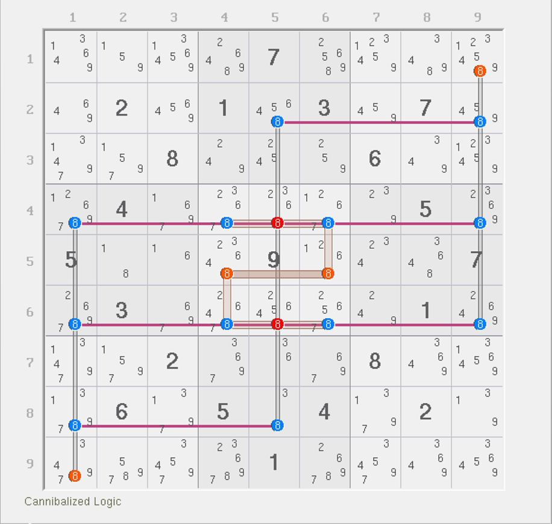
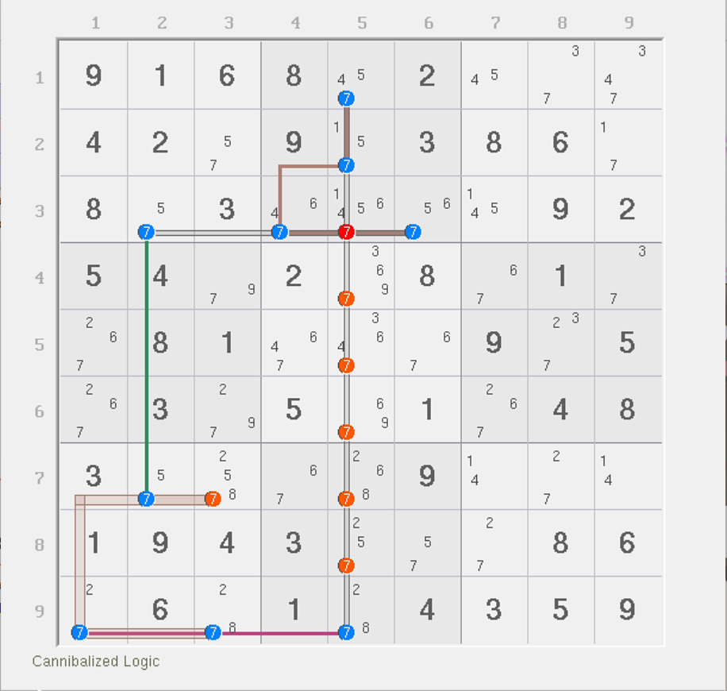
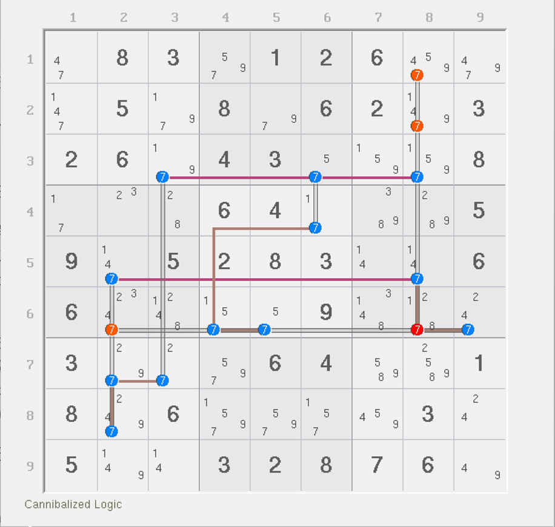

# 复杂鱼的自噬

我们早在之前很多技巧里就遇到过自噬的现象。而我们总是会告诉大家这个现象的来历其实是来自于鱼结构。下面我们来看鱼里的自噬是怎么样的。

## 鱼的自噬现象 

<figure><figcaption>
有自噬的四阶宫内鱼
</figcaption></figure>

如图所示。这是一个四阶宫内鱼，有 6 个删数，强区域是 `8r2468`，弱区域是 `8c159` 和 `8b5`。

这个结构非常巧合的是它非常对称，强弱区域数是一样的，但这题存在弱三元组 `r46c5(8)`。我们必须单独讨论他们。

如果 `r46c5(8)` 至少有一处占位，则弱区域数会少两个，强区域数只会少一个；剩余结构其余位置均为精确覆盖，所以秩变为 -1，导致矛盾。所以 `r46c5(8)` 占位直接造成矛盾，可以删除他们。

那么，删除了之后，结构的剩余部分均为精确覆盖，而结构的秩为 0，所以所有弱区域均可用于删数。

在复杂鱼里，我们就把这种弱三元组讨论后发现占位必造成矛盾的情况称为鱼的**自噬**（Cannibalism）。

## 例子 1：三阶交叉鱼 

<figure><figcaption>
有自噬的三阶交叉鱼
</figcaption></figure>

如图所示。这是一个三阶交叉鱼。强区域是 `7b2`、`7r9` 和 `7c2`，弱区域是 `7b7`、`7r3` 和 `7c5`。

很显然，这个题里非精确覆盖的只有 `r3c5(7)`。讨论它的占位状态可以发现，如果它占位，则强区域数量少一个，弱区域数量少两个，剩下的结构弱区域数会比强区域数少，而剩余部分为精确覆盖，所以秩变为 -1，造成矛盾。所以占位是不合法的。

而剩余的删数是因为，我们可以得到 `r3c5(7)` 是不能占位的，所以要删除。删除之后结构变为精确覆盖，所以秩为 0，直接弱区域删数就可以删除他们。

## 例子 2：四阶宫内鱼 

<figure><figcaption>
有自噬的四阶宫内鱼
</figcaption></figure>

如图所示。这也是一个四阶宫内鱼，不过和之前那个例子不一样的是，这个更普通一些，因为它只有一处自噬删数 `r2c8(8)`。

讨论方式和之前的一样，所以就不多说了。

## 例子 3：五阶宫内鱼（Franken Squirmbag） 

<figure><figcaption>
有自噬的五阶宫内鱼
</figcaption></figure>

如图所示。这是一个**五阶宫内鱼**（Franken Squirmbag）。这个题巧妙在它不需要依赖任何的鱼鳍，是一个非常标准的五阶鱼。

这题也有弱三元组，不过和前文一样的地方是，这个题只有弱三元组而不存在强三元组，所以它讨论起来会轻松不少。

首先我们要知道一点的是，整个结构除了精确覆盖的地方就只有弱三元组这一种特殊情况。这一点很重要，因为弱三元组占位总是会让弱区域数变得更少，但强区域数虽然也会变少，但少得没弱区域数少得快。这句话有点绕，你可以理解为计算秩里，被减数少得更多，但减数少得没那么多，这使得原先计算出来的秩的结果会变小。这很关键，因为上面这个例子在这一点上和秩的计算是一样的。

知道这一点之后就轻松多了：因为这个题只有可能填 5 个 9 进去，因为强区域已经锁定了填充 9 的次数必须是 5 个，这是强区域的特征。而显然，一旦任意一个弱三元组有占位，则实际填充 9 的次数就会少两个，但强区域只会因为占位而少一个。所以，弱区域按“最多填几次”的理解来看的话，它肯定会比强区域“实际必须填几次”要更小，这显然是矛盾的。而结构又不存在任何其他特殊的覆盖模式（其他位置都是精确覆盖的），所以显然弱三元组都不能占位。

所以，弱三元组均可删数。删完之后，结构退化为精确覆盖，于是秩的公式可以代入。求得结果为 0，所以所有弱区域均可用于删数。

## 例子 4：五阶交叉鳍鱼 

<figure><figcaption>
有自噬的五阶交叉鳍鱼
</figcaption></figure>

如图所示。这个题也是五阶的，但是它有一个内鱼鳍，位于 `r5c8(7)`，而且还有一个自噬删数 `r6c8(7)`。

这个结构就比较复杂了，从秩理论的角度来说，它同时拥有强三元组和弱三元组。倒是其他地方都是精确覆盖，所以不用怎么关心。

这个题我们要先讨论弱三元组的占位情况。强弱区域数都是 5 个，所以还算比较好。如果 `r6c8(7)` 弱三元组占位，则强区域数少 1 个（即 `7b6`），但弱区域数会少 2 个（`7c8` 和 `7r6`）。同时，因为弱三元组和强三元组 `r5c8(7)` 同一列，所以同一列不能填相同的数字，故 `r5c8` 此时也不能填 7，强三元组也就无法此时同步占位，故剩余所有候选数均为精确覆盖。此时，强弱区域数不平衡——弱区域数是 3 个，强区域数是 4 个，故秩为 -1，矛盾。所以，`r6c8(7)` 占位一定是矛盾的。

确定弱三元组一定无法占位后，剩下就只有一个强三元组了，也就是鱼里我们称为的那个内鱼鳍 `r5c8(7)`。因为它是此时唯一一个影响结构填充次数的位置，所以我们也按鱼鳍的模式进行真假性讨论。显然，`r12c8(7)` 是可以删数的——这是内鱼鳍造成的删数：内鱼鳍为真，则直接列排除删；如果内鱼鳍为假，则剩余结构为精确覆盖，秩为 0，故所有弱区域均可删数。

所以，这个题能确定的删数有 3 个。不过这题还有一个删数是 `r6c2(7)`。它要删数也是和前文一样，也需要后面的内容才能得到，所以先不剧透其推理过程。
